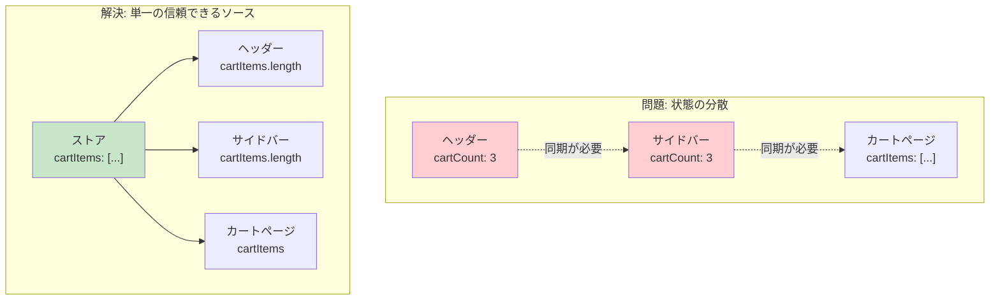
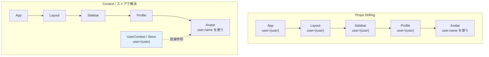
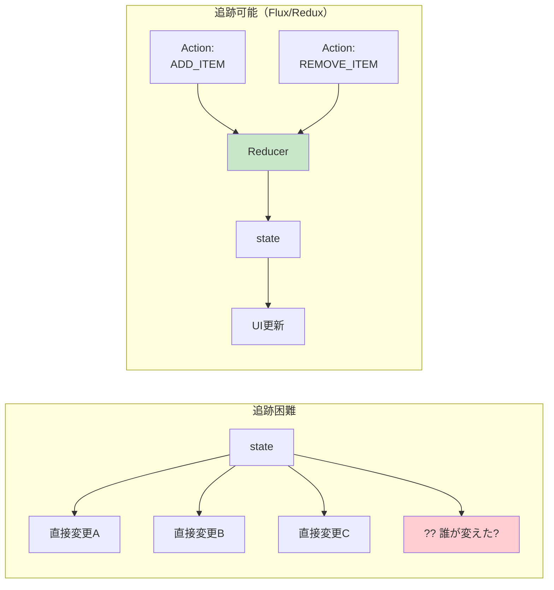
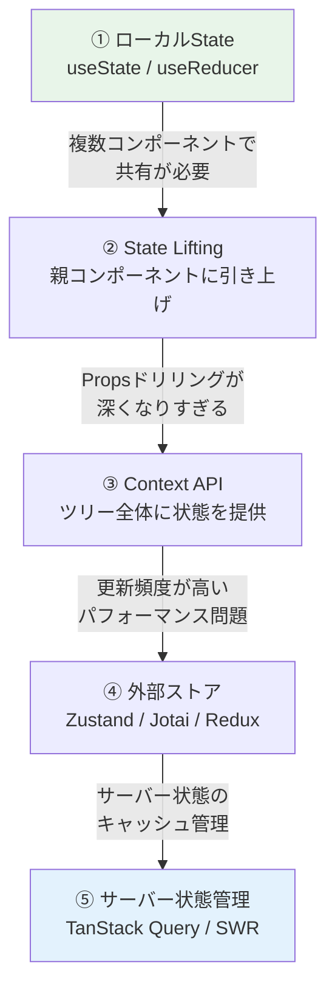
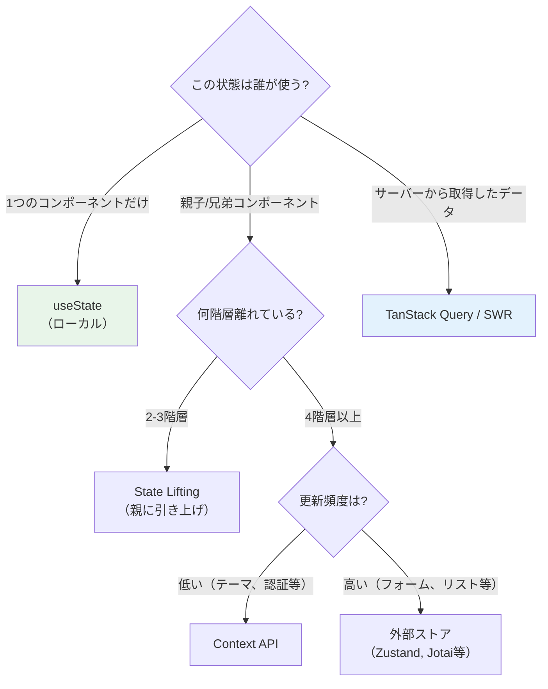

# 状態管理

> **一言で言うと:** UIの複雑さの本質は「状態（State）の管理」にある。どのコンポーネントがどの状態を持ち、変更をどう伝播するかを制御する仕組み。propsドリリング→Context→外部ストア（Redux, Zustand等）は、複雑さの段階に応じた解決策のスペクトラムである。

## なぜ必要か

フロントエンドアプリケーションの「状態」とは、UIに影響を与える**あらゆるデータ**のことである:

- フォームの入力値
- ログイン中のユーザー情報
- APIから取得したデータとそのローディング状態
- モーダルの開閉、アコーディオンの展開状態
- 選択中のタブ、フィルター条件、ページネーションの現在位置

状態管理がなければ何が起こるか:

- **UIの不整合** — 「カートに3個」と表示しているのに、カートアイコンのバッジは「2」になっている。同じデータを複数の場所で独立に管理すると、変更の同期が漏れる
- **予測不能な動作** — 状態が散在し、どこで・いつ・なぜ変更されたかが追えない。デバッグが「再現できない」地獄になる
- **Props Drilling（バケツリレー）** — 深くネストしたコンポーネントにデータを渡すために、中間の全コンポーネントに不要なpropsを通す。コンポーネントの再利用性が崩壊する

## どの問題を解決するか

### 問題1: 状態の分散と同期

同じデータを複数のコンポーネントが必要とする場合、「状態をどこに置くか」が根本的な問題になる:



**Single Source of Truth（単一の信頼できるソース）** — 同じデータは1箇所だけで管理し、必要な箇所はそこから参照する。これが状態管理の最も基本的な原則。

### 問題2: Props Drilling

コンポーネントツリーが深くなると、末端のコンポーネントに状態を渡すために中間の全コンポーネントを経由する必要がある:



Layout、Sidebar、Profileは `user` を使わないのに、バケツリレーのためだけにpropsを受け取っている。これはコンポーネントの**関心の分離**を壊す。

### 問題3: 状態変更の追跡

自由に状態を変更できると、「いつ・どこで・なぜ変わったか」が追えなくなる:



**Action → Reducer → State → View** の[[FluxアーキテクチャとRedux|一方向データフロー]]（Unidirectional Data Flow）により、全ての状態変更が記録可能になる。Redux DevToolsでの「タイムトラベルデバッグ」はこのアーキテクチャの産物。

## 状態管理の段階的アプローチ

状態管理は「最もシンプルな手法から始め、複雑さが増したら段階的に上の手法に移行する」のが正しい:



| 段階 | 手法 | 適用場面 | 代表例 |
|------|------|---------|--------|
| ① | ローカルState | 1つのコンポーネント内で完結する状態 | `useState`, `useReducer` |
| ② | State Lifting | 兄弟コンポーネント間の共有（2-3階層） | 親コンポーネントにstateを移動 |
| ③ | Context API | 認証情報、テーマなど更新頻度が低い共有状態 | `React.createContext` |
| ④ | 外部ストア | 更新頻度が高く、多くのコンポーネントが参照する状態 | Zustand, Jotai, Redux Toolkit |
| ⑤ | サーバー状態管理 | APIデータのキャッシュ・同期・再取得 | TanStack Query, SWR |

## 他の仕組みとどう関係するか

- **下位レイヤーとの関係:**
  - [[HTML-CSS-JS]] — 状態の変更が最終的にDOMの変更として画面に反映される。CSSのクラスの切り替えも状態の反映の一種
  - [[HTTP-HTTPS|HTTP/HTTPS]]（Layer 2）— サーバーから取得するデータ（サーバー状態）と、UI固有のデータ（クライアント状態）の区別が状態管理の基本設計
- **同レイヤーとの関係:**
  - [[DOMと仮想DOM]] — 仮想DOMの「状態が変わればUIを再レンダリング」というモデルが、宣言的な状態管理を可能にした基盤
  - [[コンポーネント設計]] — コンポーネントの粒度と状態の配置は表裏一体。「このコンポーネントが持つべき状態は何か」がコンポーネント設計の中心的問い
  - [[API設計-REST-GraphQL|API設計]]（4-A）— RESTのレスポンスデータをどうクライアント状態に変換・キャッシュするかが、サーバー状態管理の核心
- **上位レイヤーとの関係:**
  - [[Layer5-パフォーマンス/_index|パフォーマンス]]（Layer 5）— Contextの値が変わると全消費者が再レンダリングされる。状態の粒度と配置がパフォーマンスに直結する
  - [[Layer7-設計アーキテクチャ/_index|設計]]（Layer 7）— Fluxアーキテクチャ（一方向データフロー）は[[Layer7-設計アーキテクチャ/_index|設計パターン]]の適用。関心の分離とテスタビリティに寄与する

## 誤解されやすいポイント

### 1. 「最初からReduxを入れるべき」

Reduxは強力だが、ほとんどのアプリケーションには過剰。ボイラープレートが多く、学習コストが高い。**状態管理ライブラリは「問題が発生してから」導入するのが正しい**。`useState` + State Liftingで十分な場合がほとんどであり、Props Drillingが3-4階層を超えてからContextや外部ストアを検討する。

Redux Toolkitの登場でボイラープレートは大幅に減ったが、Zustand（2KB）やJotai（3KB）のようなより軽量な選択肢が現在は主流になりつつある。

### 2. 「Contextは状態管理ツール」

React Contextは**依存性注入（DI）の仕組み**であり、状態管理ツールではない。Contextはpropsを飛ばして値を伝播するだけで、状態の更新を最適化する仕組みを持たない:

```jsx
// Contextの値が変わると、Provider内の全Consumer（useContext呼び出し元）が再レンダリングされる
const UserContext = React.createContext(null);

function App() {
  const [user, setUser] = useState({ name: 'Alice', theme: 'dark' });
  return (
    <UserContext.Provider value={user}>
      <Header />      {/* user.themeだけ使うのに、user.nameの変更でも再レンダリング */}
      <MainContent />  {/* user.nameだけ使うのに、user.themeの変更でも再レンダリング */}
    </UserContext.Provider>
  );
}
```

Contextが適しているのは、テーマ・ロケール・認証情報など**更新頻度が低い**共有データ。更新頻度が高い状態にはZustandやJotai等の外部ストアを使う。

### 3. 「サーバーのデータもグローバルストアに入れる」

APIから取得したデータ（サーバー状態）と、UIの状態（クライアント状態）は**性質が根本的に異なる**:

| 観点 | クライアント状態 | サーバー状態 |
|------|--------------|------------|
| 所有者 | フロントエンド | バックエンド |
| 鮮度 | 常に最新 | 取得時点のスナップショット |
| 同期の必要性 | なし | 定期的な再取得・キャッシュ無効化が必要 |
| 例 | モーダルの開閉、フォーム入力値 | ユーザー一覧、商品データ |

サーバー状態をRedux等のストアに入れると、キャッシュの有効期限管理、バックグラウンド再取得、楽観的更新といった複雑なロジックを自前で書く必要がある。TanStack Query（旧React Query）やSWRはこれらを自動化する。

### 4. 「イミュータブルな更新は非効率」

Reactの状態更新がイミュータブル（元のオブジェクトを変更せず、新しいオブジェクトを作る）なのは「遅い」のではなく、**参照の比較（`===`）で変更検出を O(1) にするため**:

```javascript
// ミュータブルな更新 — 参照が同じなので変更を検出できない
state.items.push(newItem);
setState(state);  // React: 「同じオブジェクトだから変更なし」→ 再レンダリングされない

// イミュータブルな更新 — 新しい参照を作るので検出できる
setState({ ...state, items: [...state.items, newItem] });
// React: 「別のオブジェクトだから変更あり」→ 再レンダリング
```

## 設計のベストプラクティス

### 状態の分類と配置



### 状態設計の原則

1. **最小限の状態を持つ** — 計算で導出できるものは状態にしない（例: `todos.filter(t => !t.done).length` は状態にせず、レンダリング時に計算する）
2. **正規化する** — ネストしたオブジェクトを避け、IDで参照する構造にする
3. **クライアント状態とサーバー状態を分離する** — 混在させると両方の管理が複雑化する
4. **状態は可能な限り下（ローカル）に置く** — グローバルストアに入れるのは最後の手段

### 正規化の例

```typescript
// ❌ ネストした構造 — 更新が複雑
interface AppState {
  posts: {
    id: number;
    title: string;
    author: { id: number; name: string };  // 同じauthorが複数postに重複
    comments: { id: number; body: string; author: { id: number; name: string } }[];
  }[];
}

// ✅ 正規化された構造 — 更新がシンプル
interface NormalizedState {
  posts: Record<number, { id: number; title: string; authorId: number; commentIds: number[] }>;
  comments: Record<number, { id: number; body: string; authorId: number }>;
  users: Record<number, { id: number; name: string }>;
}
// ユーザー名の変更は users[id].name を1箇所変えるだけ
```

## AIによる実装のアンチパターン

| アンチパターン | なぜ問題か | 対策 |
|---|---|---|
| 全ての状態をグローバルストアに入れる | モーダルの開閉やフォーム入力値までグローバルにすると、ストアが肥大化し依存関係が不透明になる | ローカルで完結する状態は `useState` に留める |
| 導出可能な値を状態として持つ | `items` と `itemCount` を別々の状態にすると同期漏れの温床になる | `items.length` で計算する。重い計算は `useMemo` |
| `useEffect` で状態を同期する | 「AのStateが変わったらBのStateを更新する」パターンは無限ループの原因 | 1つの状態から導出するか、イベントハンドラで同時に更新する |
| APIデータを `useState` + `useEffect` で管理 | ローディング、エラー、キャッシュ、再取得を全て自前実装するのは膨大なコード | TanStack Query / SWR を使う |
| Context内に高頻度更新の状態を含める | Provider配下の全Consumerが再レンダリングされる | 高頻度の状態は外部ストアに分離する |

## 具体例

### ① useState — ローカル状態

```jsx
import { useState } from 'react';

function Counter() {
  const [count, setCount] = useState(0);
  // countはこのコンポーネント内でのみ使用 → ローカルStateで十分
  return (
    <div>
      <p>カウント: {count}</p>
      <button onClick={() => setCount(c => c + 1)}>+1</button>
    </div>
  );
}
```

### ② useReducer — 複雑なローカル状態

```jsx
import { useReducer } from 'react';

// 状態遷移を明示的に定義
function todoReducer(state, action) {
  switch (action.type) {
    case 'ADD':
      return [...state, { id: Date.now(), text: action.text, done: false }];
    case 'TOGGLE':
      return state.map(t => t.id === action.id ? { ...t, done: !t.done } : t);
    case 'DELETE':
      return state.filter(t => t.id !== action.id);
    default:
      return state;
  }
}

function TodoList() {
  const [todos, dispatch] = useReducer(todoReducer, []);
  const [input, setInput] = useState('');

  const remaining = todos.filter(t => !t.done).length;  // 導出値（stateにしない）

  return (
    <div>
      <form onSubmit={e => {
        e.preventDefault();
        if (input.trim()) {
          dispatch({ type: 'ADD', text: input });
          setInput('');
        }
      }}>
        <input value={input} onChange={e => setInput(e.target.value)} />
        <button type="submit">追加</button>
      </form>
      <ul>
        {todos.map(todo => (
          <li key={todo.id}>
            <label>
              <input
                type="checkbox"
                checked={todo.done}
                onChange={() => dispatch({ type: 'TOGGLE', id: todo.id })}
              />
              <span style={{ textDecoration: todo.done ? 'line-through' : 'none' }}>
                {todo.text}
              </span>
            </label>
            <button onClick={() => dispatch({ type: 'DELETE', id: todo.id })}>×</button>
          </li>
        ))}
      </ul>
      <p>残り {remaining} 件</p>
    </div>
  );
}
```

### ③ Zustand — 軽量な外部ストア

```typescript
import { create } from 'zustand';

// ストアの定義 — ボイラープレートが最小限
interface CartStore {
  items: { id: number; name: string; quantity: number }[];
  addItem: (item: { id: number; name: string }) => void;
  removeItem: (id: number) => void;
  totalCount: () => number;
}

const useCartStore = create<CartStore>((set, get) => ({
  items: [],

  addItem: (item) =>
    set((state) => {
      const existing = state.items.find((i) => i.id === item.id);
      if (existing) {
        return {
          items: state.items.map((i) =>
            i.id === item.id ? { ...i, quantity: i.quantity + 1 } : i
          ),
        };
      }
      return { items: [...state.items, { ...item, quantity: 1 }] };
    }),

  removeItem: (id) =>
    set((state) => ({
      items: state.items.filter((i) => i.id !== id),
    })),

  totalCount: () => get().items.reduce((sum, i) => sum + i.quantity, 0),
}));

// コンポーネントから使用 — hookとして直接参照
function CartIcon() {
  // selectorで必要な値だけ購読 → 他の値が変わっても再レンダリングしない
  const count = useCartStore((state) =>
    state.items.reduce((sum, i) => sum + i.quantity, 0)
  );
  return <span>🛒 {count}</span>;
}

function CartPage() {
  const items = useCartStore((state) => state.items);
  const removeItem = useCartStore((state) => state.removeItem);

  return (
    <ul>
      {items.map((item) => (
        <li key={item.id}>
          {item.name} × {item.quantity}
          <button onClick={() => removeItem(item.id)}>削除</button>
        </li>
      ))}
    </ul>
  );
}
```

### ④ TanStack Query — サーバー状態管理

```typescript
import { useQuery, useMutation, useQueryClient } from '@tanstack/react-query';

interface Todo {
  id: number;
  title: string;
  completed: boolean;
}

// サーバー状態の取得 — キャッシュ・再取得・ローディング状態を自動管理
function useTodos() {
  return useQuery<Todo[]>({
    queryKey: ['todos'],
    queryFn: () => fetch('/api/todos').then(res => res.json()),
    staleTime: 30_000,       // 30秒間はキャッシュを新鮮とみなす
    refetchOnWindowFocus: true,  // ウィンドウにフォーカスが戻ったら再取得
  });
}

// サーバー状態の変更 — 楽観的更新を含む
function useAddTodo() {
  const queryClient = useQueryClient();

  return useMutation({
    mutationFn: (title: string) =>
      fetch('/api/todos', {
        method: 'POST',
        headers: { 'Content-Type': 'application/json' },
        body: JSON.stringify({ title }),
      }).then(res => res.json()),

    // 楽観的更新: サーバーの応答を待たずにUIを更新
    onMutate: async (title) => {
      await queryClient.cancelQueries({ queryKey: ['todos'] });
      const previous = queryClient.getQueryData<Todo[]>(['todos']);
      queryClient.setQueryData<Todo[]>(['todos'], (old = []) => [
        ...old,
        { id: Date.now(), title, completed: false },
      ]);
      return { previous };
    },
    // エラー時はロールバック
    onError: (_err, _title, context) => {
      queryClient.setQueryData(['todos'], context?.previous);
    },
    // 成功/失敗に関わらずキャッシュを再検証
    onSettled: () => {
      queryClient.invalidateQueries({ queryKey: ['todos'] });
    },
  });
}

// コンポーネント — ローディング/エラー/データの3状態が自動管理される
function TodoApp() {
  const { data: todos, isLoading, error } = useTodos();
  const addTodo = useAddTodo();

  if (isLoading) return <p>読み込み中...</p>;
  if (error) return <p>エラー: {error.message}</p>;

  return (
    <div>
      <button onClick={() => addTodo.mutate('新しいタスク')}>追加</button>
      <ul>
        {todos?.map(todo => (
          <li key={todo.id}>{todo.title}</li>
        ))}
      </ul>
    </div>
  );
}
```

### 状態管理ライブラリの比較

| ライブラリ | バンドルサイズ | アプローチ | 特徴 |
|-----------|-------------|----------|------|
| **Redux Toolkit** | ~11KB | Flux（Action→Reducer→Store） | エコシステム最大。DevToolsが強力 |
| **Zustand** | ~2KB | シンプルなストア | APIが最小限。Reactの外でも使える |
| **Jotai** | ~3KB | アトミック（Atom） | ボトムアップ。Contextの問題を回避 |
| **Valtio** | ~4KB | プロキシベース | ミュータブルな書き方でイミュータブルに動作 |
| **TanStack Query** | ~12KB | サーバー状態専用 | キャッシュ・再取得・楽観的更新を自動化 |

## 参考リソース

- [React公式 — Managing State](https://react.dev/learn/managing-state) — 状態の構造化と共有の公式ガイド
- [Zustand GitHub](https://github.com/pmndrs/zustand) — 最小APIのストアライブラリ
- [TanStack Query ドキュメント](https://tanstack.com/query/latest) — サーバー状態管理の決定版
- [Bulletproof React](https://github.com/alan2207/bulletproof-react) — 実務的なReact設計パターン集
- 書籍:『りあクト！TypeScriptで始めるつらくないReact開発』— Reactの状態管理を体系的に解説

## 学習メモ

- 状態管理で最も重要なのは「どの手法を使うか」ではなく「何をどこに置くか」の設計判断。手法は複雑さに応じて段階的に選ぶ
- クライアント状態とサーバー状態の分離は、TanStack Queryの登場で業界標準になった。これにより、グローバルストアには純粋なクライアント状態だけが残り、ストアが劇的にシンプルになる
- Vue 3のComposition APIにおける `ref` / `reactive` や、SvelteのStoreも同様の問題を解決している。フレームワークごとにAPIは異なるが、根底の設計原則は共通
