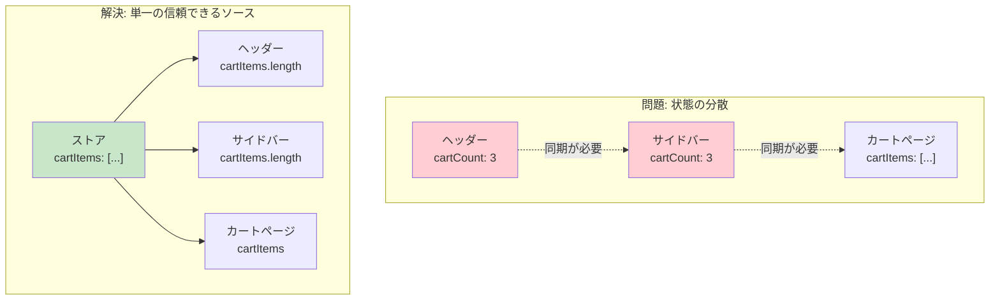
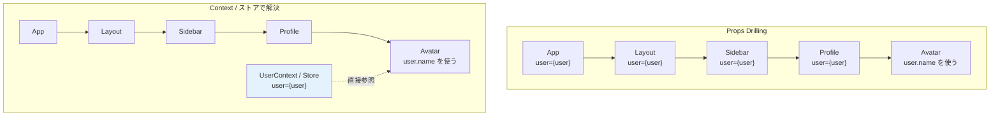
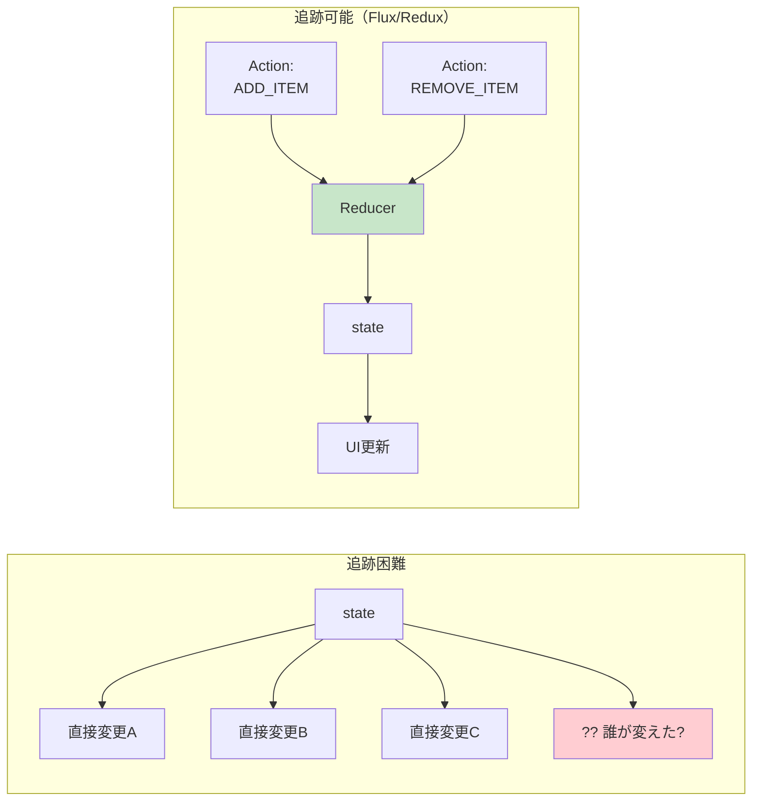
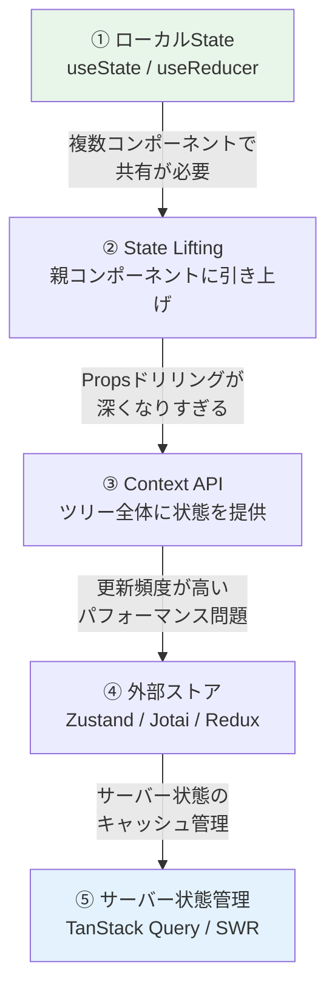
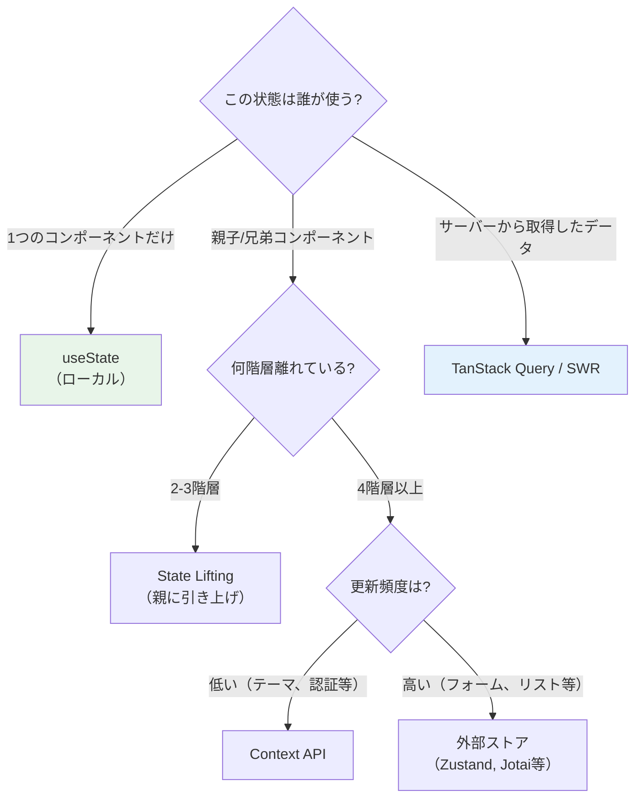

# 状態管理

> **一言で言うと:** UIの複雑さの本質は「状態（State）の管理」にある。どのコンポーネントがどの状態を持ち、変更をどう伝播するかを制御する仕組み。propsドリリング→Context→外部ストア（Redux, Zustand等）は、複雑さの段階に応じた解決策のスペクトラムである。

## 3分で全体像

- **何を解決する技術か:** 「同じデータを複数の場所で表示する」「コンポーネントをまたいで状態を共有する」「状態変更をいつ・どこで・なぜ起きたか追跡する」という3つの問題を、複雑さの段階に応じた手法（ローカル State → State Lifting → Context → 外部ストア → サーバー状態管理）で解決する
- **代表的な使用シーン:** SPA でのフォーム状態管理、認証情報の共有、ショッピングカート、リアルタイム共同編集、APIデータのキャッシュと再取得、楽観的更新を伴うユーザーアクション
- **これだけは覚える3つ:**
    1. **クライアント状態とサーバー状態は性質が違う** — APIから取った「ユーザー一覧」と、UIの「モーダル開閉」を同じストアに入れるのは設計ミス。サーバー状態は **TanStack Query / SWR** が標準解、クライアント状態は **useState / Zustand**
    2. **状態は可能な限り下に置く** — グローバル化は最後の手段。`useState` で完結するならそれが最良。Props Drilling が3〜4階層を超えてから Context や外部ストアを検討する。**最初から Redux** はアンチパターン
    3. **派生状態を別 state に持たない** — `items` と `itemCount` を別々の state にすると同期漏れの温床。`items.length` で計算する、重ければ `useMemo`。`useEffect` で「A の state が変わったら B を更新」は無限ループの原因
- **AIに任せやすいか:** **一部任せられる** — `useState` / `useReducer` / Zustand ストアの実装は AI が高品質に書ける。一方「**サーバー状態を Redux に詰め込む**」「**派生状態を `useEffect` で同期**」「**全状態をグローバル化**」「**Context に高頻度更新の状態**」など、状態の置き場所の判断ミスが頻出する。`/review-ai-code` で必ず検出する
- **詰まったらここを読む:** [[コンポーネント設計]] / [[DOMと仮想DOM]] / [[FluxアーキテクチャとRedux]] / [[API設計-REST-GraphQL]]

## なぜ必要か

フロントエンドアプリケーションの「状態」とは、UIに影響を与える**あらゆるデータ**のことである:

- フォームの入力値
- ログイン中のユーザー情報
- APIから取得したデータとそのローディング状態
- モーダルの開閉、アコーディオンの展開状態
- 選択中のタブ、フィルター条件、ページネーションの現在位置

状態管理がなければ何が起こるか:

- **UIの不整合** — 「カートに3個」と表示しているのに、カートアイコンのバッジは「2」になっている。同じデータを複数の場所で独立に管理すると、変更の同期が漏れる
- **予測不能な動作** — 状態が散在し、どこで・いつ・なぜ変更されたかが追えない。デバッグが「再現できない」地獄になる
- **Props Drilling（バケツリレー）** — 深くネストしたコンポーネントにデータを渡すために、中間の全コンポーネントに不要なpropsを通す。コンポーネントの再利用性が崩壊する

## どの問題を解決するか

### 問題1: 状態の分散と同期

同じデータを複数のコンポーネントが必要とする場合、「状態をどこに置くか」が根本的な問題になる:


```mermaid
graph TD
    subgraph "問題: 状態の分散"
        A1["ヘッダー<br/>cartCount: 3"]
        A2["サイドバー<br/>cartCount: 3"]
        A3["カートページ<br/>cartItems: [...]"]
        A1 -.->|"同期が必要"| A2
        A2 -.->|"同期が必要"| A3
        style A1 fill:#ffcdd2
        style A2 fill:#ffcdd2
    end

    subgraph "解決: 単一の信頼できるソース"
        S["ストア<br/>cartItems: [...]"]
        B1["ヘッダー<br/>cartItems.length"]
        B2["サイドバー<br/>cartItems.length"]
        B3["カートページ<br/>cartItems"]
        S --> B1
        S --> B2
        S --> B3
        style S fill:#c8e6c9
    end
```

**Single Source of Truth（単一の信頼できるソース）** — 同じデータは1箇所だけで管理し、必要な箇所はそこから参照する。これが状態管理の最も基本的な原則。

### 問題2: Props Drilling

コンポーネントツリーが深くなると、末端のコンポーネントに状態を渡すために中間の全コンポーネントを経由する必要がある:


```mermaid
graph TD
    subgraph "Props Drilling"
        APP["App<br/>user={user}"] --> LAYOUT["Layout<br/>user={user}"]
        LAYOUT --> SIDEBAR["Sidebar<br/>user={user}"]
        SIDEBAR --> PROFILE["Profile<br/>user={user}"]
        PROFILE --> AVATAR["Avatar<br/>user.name を使う"]
    end

    subgraph "Context / ストアで解決"
        APP2["App"] --> LAYOUT2["Layout"]
        LAYOUT2 --> SIDEBAR2["Sidebar"]
        SIDEBAR2 --> PROFILE2["Profile"]
        PROFILE2 --> AVATAR2["Avatar<br/>user.name を使う"]
        STORE["UserContext / Store<br/>user={user}"] -.->|"直接参照"| AVATAR2
        style STORE fill:#e3f2fd
    end
```

Layout、Sidebar、Profileは `user` を使わないのに、バケツリレーのためだけにpropsを受け取っている。これはコンポーネントの**関心の分離**を壊す。

### 問題3: 状態変更の追跡

自由に状態を変更できると、「いつ・どこで・なぜ変わったか」が追えなくなる:


```mermaid
flowchart LR
    subgraph "追跡困難"
        S1["state"] --> M1["直接変更A"]
        S1 --> M2["直接変更B"]
        S1 --> M3["直接変更C"]
        S1 --> M4["?? 誰が変えた?"]
        style M4 fill:#ffcdd2
    end

    subgraph "追跡可能（Flux/Redux）"
        S2["state"]
        A1["Action:<br/>ADD_ITEM"] --> R["Reducer"]
        A2["Action:<br/>REMOVE_ITEM"] --> R
        R --> S2
        S2 --> V["UI更新"]
        style R fill:#c8e6c9
    end
```

**Action → Reducer → State → View** の[[FluxアーキテクチャとRedux|一方向データフロー]]（Unidirectional Data Flow）により、全ての状態変更が記録可能になる。Redux DevToolsでの「タイムトラベルデバッグ」はこのアーキテクチャの産物。

## 状態管理の段階的アプローチ

状態管理は「最もシンプルな手法から始め、複雑さが増したら段階的に上の手法に移行する」のが正しい:


```mermaid
graph TD
    L1["① ローカルState<br/>useState / useReducer"] -->|"複数コンポーネントで<br/>共有が必要"| L2["② State Lifting<br/>親コンポーネントに引き上げ"]
    L2 -->|"Propsドリリングが<br/>深くなりすぎる"| L3["③ Context API<br/>ツリー全体に状態を提供"]
    L3 -->|"更新頻度が高い<br/>パフォーマンス問題"| L4["④ 外部ストア<br/>Zustand / Jotai / Redux"]
    L4 -->|"サーバー状態の<br/>キャッシュ管理"| L5["⑤ サーバー状態管理<br/>TanStack Query / SWR"]

    style L1 fill:#e8f5e9
    style L5 fill:#e3f2fd
```

| 段階 | 手法 | 適用場面 | 代表例 |
|------|------|---------|--------|
| ① | ローカルState | 1つのコンポーネント内で完結する状態 | `useState`, `useReducer` |
| ② | State Lifting | 兄弟コンポーネント間の共有（2-3階層） | 親コンポーネントにstateを移動 |
| ③ | Context API | 認証情報、テーマなど更新頻度が低い共有状態 | `React.createContext` |
| ④ | 外部ストア | 更新頻度が高く、多くのコンポーネントが参照する状態 | Zustand, Jotai, Redux Toolkit |
| ⑤ | サーバー状態管理 | APIデータのキャッシュ・同期・再取得 | TanStack Query, SWR |

## 他の仕組みとどう関係するか

- **下位レイヤーとの関係:**
  - [[HTML-CSS-JS]] — 状態の変更が最終的にDOMの変更として画面に反映される。CSSのクラスの切り替えも状態の反映の一種
  - [[HTTP-HTTPS|HTTP/HTTPS]]（Layer 2）— サーバーから取得するデータ（サーバー状態）と、UI固有のデータ（クライアント状態）の区別が状態管理の基本設計
- **同レイヤーとの関係:**
  - [[DOMと仮想DOM]] — 仮想DOMの「状態が変わればUIを再レンダリング」というモデルが、宣言的な状態管理を可能にした基盤
  - [[コンポーネント設計]] — コンポーネントの粒度と状態の配置は表裏一体。「このコンポーネントが持つべき状態は何か」がコンポーネント設計の中心的問い
  - [[API設計-REST-GraphQL|API設計]]（4-A）— RESTのレスポンスデータをどうクライアント状態に変換・キャッシュするかが、サーバー状態管理の核心
- **上位レイヤーとの関係:**
  - [[Layer5-パフォーマンス/_index|パフォーマンス]]（Layer 5）— Contextの値が変わると全消費者が再レンダリングされる。状態の粒度と配置がパフォーマンスに直結する
  - [[Layer7-設計アーキテクチャ/_index|設計]]（Layer 7）— Fluxアーキテクチャ（一方向データフロー）は[[Layer7-設計アーキテクチャ/_index|設計パターン]]の適用。関心の分離とテスタビリティに寄与する

## 誤解されやすいポイント

### 1. 「最初からReduxを入れるべき」

Reduxは強力だが、ほとんどのアプリケーションには過剰。ボイラープレートが多く、学習コストが高い。**状態管理ライブラリは「問題が発生してから」導入するのが正しい**。`useState` + State Liftingで十分な場合がほとんどであり、Props Drillingが3-4階層を超えてからContextや外部ストアを検討する。

Redux Toolkitの登場でボイラープレートは大幅に減ったが、Zustand（2KB）やJotai（3KB）のようなより軽量な選択肢が現在は主流になりつつある。

### 2. 「Contextは状態管理ツール」

React Contextは**依存性注入（DI）の仕組み**であり、状態管理ツールではない。Contextはpropsを飛ばして値を伝播するだけで、状態の更新を最適化する仕組みを持たない:

```jsx
// Contextの値が変わると、Provider内の全Consumer（useContext呼び出し元）が再レンダリングされる
const UserContext = React.createContext(null);

function App() {
  const [user, setUser] = useState({ name: 'Alice', theme: 'dark' });
  return (
    <UserContext.Provider value={user}>
      <Header />      {/* user.themeだけ使うのに、user.nameの変更でも再レンダリング */}
      <MainContent />  {/* user.nameだけ使うのに、user.themeの変更でも再レンダリング */}
    </UserContext.Provider>
  );
}
```

Contextが適しているのは、テーマ・ロケール・認証情報など**更新頻度が低い**共有データ。更新頻度が高い状態にはZustandやJotai等の外部ストアを使う。

### 3. 「サーバーのデータもグローバルストアに入れる」

APIから取得したデータ（サーバー状態）と、UIの状態（クライアント状態）は**性質が根本的に異なる**:

| 観点 | クライアント状態 | サーバー状態 |
|------|--------------|------------|
| 所有者 | フロントエンド | バックエンド |
| 鮮度 | 常に最新 | 取得時点のスナップショット |
| 同期の必要性 | なし | 定期的な再取得・キャッシュ無効化が必要 |
| 例 | モーダルの開閉、フォーム入力値 | ユーザー一覧、商品データ |

サーバー状態をRedux等のストアに入れると、キャッシュの有効期限管理、バックグラウンド再取得、楽観的更新といった複雑なロジックを自前で書く必要がある。TanStack Query（旧React Query）やSWRはこれらを自動化する。

### 4. 「イミュータブルな更新は非効率」

Reactの状態更新がイミュータブル（元のオブジェクトを変更せず、新しいオブジェクトを作る）なのは「遅い」のではなく、**参照の比較（`===`）で変更検出を O(1) にするため**:

```javascript
// ミュータブルな更新 — 参照が同じなので変更を検出できない
state.items.push(newItem);
setState(state);  // React: 「同じオブジェクトだから変更なし」→ 再レンダリングされない

// イミュータブルな更新 — 新しい参照を作るので検出できる
setState({ ...state, items: [...state.items, newItem] });
// React: 「別のオブジェクトだから変更あり」→ 再レンダリング
```

## 設計のベストプラクティス

### 状態の分類と配置


```mermaid
flowchart TD
    Q1{"この状態は誰が使う?"} -->|"1つのコンポーネントだけ"| A1["useState<br/>（ローカル）"]
    Q1 -->|"親子/兄弟コンポーネント"| Q2{"何階層離れている?"}
    Q2 -->|"2-3階層"| A2["State Lifting<br/>（親に引き上げ）"]
    Q2 -->|"4階層以上"| Q3{"更新頻度は?"}
    Q3 -->|"低い（テーマ、認証等）"| A3["Context API"]
    Q3 -->|"高い（フォーム、リスト等）"| A4["外部ストア<br/>（Zustand, Jotai等）"]
    Q1 -->|"サーバーから取得したデータ"| A5["TanStack Query / SWR"]

    style A1 fill:#e8f5e9
    style A5 fill:#e3f2fd
```

### 状態設計の原則

1. **最小限の状態を持つ** — 計算で導出できるものは状態にしない（例: `todos.filter(t => !t.done).length` は状態にせず、レンダリング時に計算する）
2. **正規化する** — ネストしたオブジェクトを避け、IDで参照する構造にする
3. **クライアント状態とサーバー状態を分離する** — 混在させると両方の管理が複雑化する
4. **状態は可能な限り下（ローカル）に置く** — グローバルストアに入れるのは最後の手段

### 正規化の例

```typescript
// ❌ ネストした構造 — 更新が複雑
interface AppState {
  posts: {
    id: number;
    title: string;
    author: { id: number; name: string };  // 同じauthorが複数postに重複
    comments: { id: number; body: string; author: { id: number; name: string } }[];
  }[];
}

// ✅ 正規化された構造 — 更新がシンプル
interface NormalizedState {
  posts: Record<number, { id: number; title: string; authorId: number; commentIds: number[] }>;
  comments: Record<number, { id: number; body: string; authorId: number }>;
  users: Record<number, { id: number; name: string }>;
}
// ユーザー名の変更は users[id].name を1箇所変えるだけ
```

## AIエージェントとの協働

> このトピックでAIコーディングエージェント（Claude Code, Copilot, Cursor 等）と協働するための観点。
> ストア実装やフォーム state は AI に任せやすい一方、**「サーバー状態を Redux に詰め込む」「派生状態を `useEffect` で同期」「全状態をグローバル化」「Context に高頻度更新の状態」「ミュータブル更新で UI が更新されない」** が頻出。レビューも `/review-ai-code` で横断アンチパターン照合に任せられる。

### AIに任せられる部分 / 人間が判断すべき部分

| タスク種類 | 任せ方（実装/レビュー） | 人間の関与 |
|---|---|---|
| `useState` / `useReducer` のローカル state 設計 | AI 実装、`/review-ai-code` でレビュー | 状態の置き場所（ローカル / Lifting / Context / グローバル）はコンポーネント境界の判断 |
| Zustand / Jotai / Redux Toolkit ストア実装 | AI に任せる | ライブラリ選定はチームスキル・規模・既存資産で人間判断 |
| TanStack Query / SWR の queryKey 設計 | AI が複数案 | キャッシュ戦略・staleTime・楽観的更新の方針は要件で決める |
| 派生状態の検出と整理 | AI に分析させる | リファクタの優先順位は人間 |
| Context Provider の粒度（テーマ・認証・ロケール） | AI に提案させる | 更新頻度に応じた分割（高頻度は外部ストア）は人間判断 |
| 状態の正規化（ネスト → 平坦 + ID 参照） | AI に任せる | 既存コードへの影響範囲は人間が確認 |

### AI生成コードのレビュー観点（このトピック固有）

AI生成の状態管理コードを受け取ったとき、最低限ここを見る。

1. **クライアント状態とサーバー状態の混在** — APIから取得したデータ（ユーザー一覧、商品データ）を `useState` + `useEffect` や Redux に入れていないか。ローディング・エラー・再取得・キャッシュ無効化を自前実装している場合、**TanStack Query / SWR** の出番。クライアント状態（モーダル開閉、フォーム入力）と同じストアに混ぜるのは設計ミス
2. **派生状態の二重管理と `useEffect` 同期** — `items` と `itemCount` のように計算可能な値を別 state に持っていないか。`useEffect(() => setX(derivedFromY), [y])` のような state 同期は二重レンダリング・無限ループの温床。**レンダリング中に計算する**（`const itemCount = items.length`）か `useMemo` で求める
3. **状態のミュータブル更新と置き場所の誤り** — `state.items.push(newItem); setState(state)` のように元のオブジェクトを変更していないか（参照が変わらず変更検出されない）。また、ローカルで完結する状態（モーダル開閉、Accordion 展開）が Context や Redux に入っていないか — グローバル化は最後の手段で、`useState` で完結するならそれが最良

### 効くプロンプトの型

このトピックに関する実装をAIに依頼するとき、コンテキストとして渡すべき情報・制約・成功基準のテンプレ。

```
# 前提（プロジェクトの状況・既存のコード規約）
- フレームワーク: React 19 / Vue 3 / Svelte 5
- クライアント状態: useState / Zustand / Jotai / Redux Toolkit
- サーバー状態: TanStack Query v5 / SWR / Apollo Client
- 既存のストア構成: 〜
- Props Drilling の現状: 〜階層

# やってほしいこと
- 「{要件}」の状態管理を実装
- 状態の所在 (ローカル/Lifting/Context/外部ストア) と選定理由を提示

# 守ってほしい制約（このトピック固有のもの）
- クライアント状態とサーバー状態を混在させない (サーバーは TanStack Query)
- 派生可能な値は別 state にしない (items.length / useMemo)
- useEffect で状態同期しない (無限ループの温床)
- ミュータブル更新は禁止 (state.items.push ではなく [...state.items, ...])
- ローカルで完結する状態はグローバル化しない (まず useState)
- Context に高頻度更新の状態を入れない (外部ストアに分離)
- 状態は最小限・正規化 (ネストは ID 参照に展開)

# 完了の判断基準
- 同じデータを別々の state に持つ箇所がない
- useEffect で setState を呼んでいる箇所がない (派生は計算で求める)
- DevTools Profiler で不要な再レンダリングが起きていない
- API データのキャッシュ無効化が自動化されている
```

### AI実装のアンチパターン

LLM生成コードで頻出する過剰設計・誤用パターン。レビュー時の照合表として使う。

| アンチパターン | なぜ問題か | レビュー観点 / 対策 |
|---|---|---|
| 全ての状態をグローバルストアに入れる | モーダル開閉やフォーム入力値まで肥大化、依存関係が不透明 | ローカルで完結する状態は `useState` に留める |
| サーバー状態を `useState` + `useEffect` で管理 | ローディング・エラー・キャッシュ・再取得を全て自前実装、コードが膨大 | TanStack Query / SWR を使う |
| サーバー状態を Redux / Zustand に詰める | キャッシュ無効化・楽観的更新・バックグラウンド再取得を自前実装になる | サーバー状態は専用ライブラリ、グローバルストアにはクライアント状態のみ |
| 派生可能な値を別 state にする | 同期漏れの温床（`items` と `itemCount`） | レンダリング中に計算、重ければ `useMemo` |
| `useEffect` で state を同期 | 二重レンダリング、無限ループの温床 | 派生はレンダリング中、イベント時の同時更新はハンドラ内で |
| ミュータブル更新（`state.items.push(...)`） | 参照が変わらず変更が検出されない、UI が更新されない | `[...state.items, newItem]` 等イミュータブル、または Immer / Valtio |
| Context に高頻度更新の state を入れる | Provider 配下の全 Consumer が再レンダリング | 高頻度状態は Zustand / Jotai 等の外部ストアに分離 |
| Context を分割せず1つの Provider で巨大な値を共有 | 一部だけ使う Consumer も全変更で再レンダリング | 関心ごとに Provider を分ける、または selector が使えるストアに |
| 最初から Redux 導入 | ボイラープレートと学習コストが要件を超える | `useState` → State Lifting → Context → 外部ストアの段階的導入 |
| 状態のネスト構造をそのまま保持 | 深いオブジェクトの更新が複雑、参照変更の連鎖 | 正規化（`Record<id, entity>` で ID 参照）に展開 |
| `useReducer` の state を mutate | Reducer の純粋性が壊れ、タイムトラベルデバッグも崩壊 | 必ず新オブジェクトを返す、または Immer の `produce` を使う |
| ローカルストレージへの保存を `useEffect` で都度実行 | 高頻度更新でストレージ I/O がボトルネック | Zustand persist ミドルウェアや専用 Hook、debounce で頻度を抑える |

→ レイヤー横断のアンチパターン索引: [[_anti-patterns/_index|AIアンチパターン索引]] / [[_anti-patterns/レイヤー別/Layer4-Frontend|Layer 4 Frontend アンチパターン集]]

## 具体例

### ① useState — ローカル状態

```jsx
import { useState } from 'react';

function Counter() {
  const [count, setCount] = useState(0);
  // countはこのコンポーネント内でのみ使用 → ローカルStateで十分
  return (
    <div>
      <p>カウント: {count}</p>
      <button onClick={() => setCount(c => c + 1)}>+1</button>
    </div>
  );
}
```

### ② useReducer — 複雑なローカル状態

```jsx
import { useReducer, useState } from 'react';

// 状態遷移を明示的に定義
function todoReducer(state, action) {
  switch (action.type) {
    case 'ADD':
      return [...state, { id: Date.now(), text: action.text, done: false }];
    case 'TOGGLE':
      return state.map(t => t.id === action.id ? { ...t, done: !t.done } : t);
    case 'DELETE':
      return state.filter(t => t.id !== action.id);
    default:
      return state;
  }
}

function TodoList() {
  const [todos, dispatch] = useReducer(todoReducer, []);
  const [input, setInput] = useState('');

  const remaining = todos.filter(t => !t.done).length;  // 導出値（stateにしない）

  return (
    <div>
      <form onSubmit={e => {
        e.preventDefault();
        if (input.trim()) {
          dispatch({ type: 'ADD', text: input });
          setInput('');
        }
      }}>
        <input value={input} onChange={e => setInput(e.target.value)} />
        <button type="submit">追加</button>
      </form>
      <ul>
        {todos.map(todo => (
          <li key={todo.id}>
            <label>
              <input
                type="checkbox"
                checked={todo.done}
                onChange={() => dispatch({ type: 'TOGGLE', id: todo.id })}
              />
              <span style={{ textDecoration: todo.done ? 'line-through' : 'none' }}>
                {todo.text}
              </span>
            </label>
            <button onClick={() => dispatch({ type: 'DELETE', id: todo.id })}>×</button>
          </li>
        ))}
      </ul>
      <p>残り {remaining} 件</p>
    </div>
  );
}
```

### ③ Zustand — 軽量な外部ストア

```typescript
import { create } from 'zustand';

// ストアの定義 — ボイラープレートが最小限
interface CartStore {
  items: { id: number; name: string; quantity: number }[];
  addItem: (item: { id: number; name: string }) => void;
  removeItem: (id: number) => void;
  totalCount: () => number;
}

const useCartStore = create<CartStore>((set, get) => ({
  items: [],

  addItem: (item) =>
    set((state) => {
      const existing = state.items.find((i) => i.id === item.id);
      if (existing) {
        return {
          items: state.items.map((i) =>
            i.id === item.id ? { ...i, quantity: i.quantity + 1 } : i
          ),
        };
      }
      return { items: [...state.items, { ...item, quantity: 1 }] };
    }),

  removeItem: (id) =>
    set((state) => ({
      items: state.items.filter((i) => i.id !== id),
    })),

  totalCount: () => get().items.reduce((sum, i) => sum + i.quantity, 0),
}));

// コンポーネントから使用 — hookとして直接参照
function CartIcon() {
  // selectorで必要な値だけ購読 → 他の値が変わっても再レンダリングしない
  const count = useCartStore((state) =>
    state.items.reduce((sum, i) => sum + i.quantity, 0)
  );
  return <span>🛒 {count}</span>;
}

function CartPage() {
  const items = useCartStore((state) => state.items);
  const removeItem = useCartStore((state) => state.removeItem);

  return (
    <ul>
      {items.map((item) => (
        <li key={item.id}>
          {item.name} × {item.quantity}
          <button onClick={() => removeItem(item.id)}>削除</button>
        </li>
      ))}
    </ul>
  );
}
```

### ④ TanStack Query — サーバー状態管理

```typescript
import { useQuery, useMutation, useQueryClient } from '@tanstack/react-query';

interface Todo {
  id: number;
  title: string;
  completed: boolean;
}

// サーバー状態の取得 — キャッシュ・再取得・ローディング状態を自動管理
function useTodos() {
  return useQuery<Todo[]>({
    queryKey: ['todos'],
    queryFn: () => fetch('/api/todos').then(res => res.json()),
    staleTime: 30_000,       // 30秒間はキャッシュを新鮮とみなす
    refetchOnWindowFocus: true,  // ウィンドウにフォーカスが戻ったら再取得
  });
}

// サーバー状態の変更 — 楽観的更新を含む
function useAddTodo() {
  const queryClient = useQueryClient();

  return useMutation({
    mutationFn: (title: string) =>
      fetch('/api/todos', {
        method: 'POST',
        headers: { 'Content-Type': 'application/json' },
        body: JSON.stringify({ title }),
      }).then(res => res.json()),

    // 楽観的更新: サーバーの応答を待たずにUIを更新
    onMutate: async (title) => {
      await queryClient.cancelQueries({ queryKey: ['todos'] });
      const previous = queryClient.getQueryData<Todo[]>(['todos']);
      queryClient.setQueryData<Todo[]>(['todos'], (old = []) => [
        ...old,
        { id: Date.now(), title, completed: false },
      ]);
      return { previous };
    },
    // エラー時はロールバック
    onError: (_err, _title, context) => {
      queryClient.setQueryData(['todos'], context?.previous);
    },
    // 成功/失敗に関わらずキャッシュを再検証
    onSettled: () => {
      queryClient.invalidateQueries({ queryKey: ['todos'] });
    },
  });
}

// コンポーネント — ローディング/エラー/データの3状態が自動管理される
function TodoApp() {
  const { data: todos, isLoading, error } = useTodos();
  const addTodo = useAddTodo();

  if (isLoading) return <p>読み込み中...</p>;
  if (error) return <p>エラー: {error.message}</p>;

  return (
    <div>
      <button onClick={() => addTodo.mutate('新しいタスク')}>追加</button>
      <ul>
        {todos?.map(todo => (
          <li key={todo.id}>{todo.title}</li>
        ))}
      </ul>
    </div>
  );
}
```

### 状態管理ライブラリの比較

| ライブラリ | バンドルサイズ | アプローチ | 特徴 |
|-----------|-------------|----------|------|
| **Redux Toolkit** | ~11KB | Flux（Action→Reducer→Store） | エコシステム最大。DevToolsが強力 |
| **Zustand** | ~2KB | シンプルなストア | APIが最小限。Reactの外でも使える |
| **Jotai** | ~3KB | アトミック（Atom） | ボトムアップ。Contextの問題を回避 |
| **Valtio** | ~4KB | プロキシベース | ミュータブルな書き方でイミュータブルに動作 |
| **TanStack Query** | ~12KB | サーバー状態専用 | キャッシュ・再取得・楽観的更新を自動化 |

## 参考リソース

- [React公式 — Managing State](https://react.dev/learn/managing-state) — 状態の構造化と共有の公式ガイド
- [Zustand GitHub](https://github.com/pmndrs/zustand) — 最小APIのストアライブラリ
- [TanStack Query ドキュメント](https://tanstack.com/query/latest) — サーバー状態管理の決定版
- [Bulletproof React](https://github.com/alan2207/bulletproof-react) — 実務的なReact設計パターン集
- 書籍:『りあクト！TypeScriptで始めるつらくないReact開発』— Reactの状態管理を体系的に解説

## 理解度セルフチェック

> 答えられなければ本文に戻る。答えはこのファイル内に必ずある。

1. **「クライアント状態とサーバー状態は性質が違う」とはどういうことか、30秒で説明せよ。** 同じストアに混ぜるとどんな問題が起きるか、具体例を挙げて述べよ。
2. **「Reactの状態更新がイミュータブルなのは遅い」がなぜ誤りか?** ミュータブルに更新するとどんなバグが起きるか説明せよ。
3. **AI生成コードレビュー設問:** AI が以下の「商品一覧 + フィルタリング + カート機能」の状態管理を生成した。本文の観点で **問題点を最低3つ** 指摘せよ。

```jsx
import { create } from 'zustand';
import { useEffect, useState } from 'react';

// グローバルストア
const useStore = create((set) => ({
  // サーバーから取得する商品一覧
  products: [],
  productsLoading: false,
  productsError: null,
  // フィルター状態
  filterCategory: '',
  filterPriceMax: 100000,
  // 表示用に絞った商品 (派生)
  filteredProducts: [],
  filteredCount: 0,
  // カート (クライアント状態)
  cart: [],
  cartTotal: 0,
  // モーダル (クライアント状態)
  isCartModalOpen: false,
  isCheckoutModalOpen: false,

  fetchProducts: async () => {
    set({ productsLoading: true });
    try {
      const res = await fetch('/api/products');
      const data = await res.json();
      set({ products: data, productsLoading: false });
    } catch (e) {
      set({ productsError: e.message, productsLoading: false });
    }
  },

  setFilterCategory: (category) => set({ filterCategory: category }),
  setFilterPriceMax: (price) => set({ filterPriceMax: price }),

  addToCart: (product) => set((state) => {
    state.cart.push(product);
    state.cartTotal = state.cart.reduce((sum, p) => sum + p.price, 0);
    return state;
  }),

  openCartModal: () => set({ isCartModalOpen: true }),
  closeCartModal: () => set({ isCartModalOpen: false }),
}));

function ProductList() {
  const { products, filterCategory, filterPriceMax, filteredProducts, fetchProducts } = useStore();

  useEffect(() => {
    fetchProducts();
  }, []);

  // 派生 state を更新
  useEffect(() => {
    const filtered = products.filter(
      p => (!filterCategory || p.category === filterCategory) && p.price <= filterPriceMax
    );
    useStore.setState({ filteredProducts: filtered, filteredCount: filtered.length });
  }, [products, filterCategory, filterPriceMax]);

  return (
    <ul>
      {filteredProducts.map((p, i) => (
        <li key={i}>{p.name} - {p.price}円</li>
      ))}
    </ul>
  );
}
```

> [!note]- 解答の指針
>
> > [!info] 用語ミニ辞典
> > - **クライアント状態:** UI の状態（モーダル開閉、フォーム入力値、選択中のタブ、フィルター条件）。フロントエンドが所有し、サーバーとの同期は不要
> > - **サーバー状態:** API から取得したデータ（ユーザー一覧、商品データ）。バックエンドが所有し、取得時点のスナップショット。再取得・キャッシュ無効化・楽観的更新が必要
> > - **TanStack Query / SWR:** サーバー状態管理の専用ライブラリ。queryKey でキャッシュを管理、staleTime で新鮮さを判定、自動再取得・楽観的更新・エラー再試行を自動化する
> > - **Single Source of Truth:** 同じデータは1箇所だけで管理し、必要な箇所はそこから参照する原則。状態管理の最も基本的な指針
> > - **Props Drilling (バケツリレー):** 深くネストしたコンポーネントに props を渡すために中間の全コンポーネントを経由する問題。3〜4階層を超えると Context や外部ストアの導入を検討
> > - **State Lifting:** 兄弟コンポーネント間で状態を共有するため、共通の親に state を引き上げるパターン。最も基本的な共有手法
> > - **Context API:** React の依存性注入機構。Provider 配下のすべての Consumer に値を提供する。ただし**状態管理ツールではない**点に注意（高頻度更新で全 Consumer が再レンダリング）
> > - **Zustand / Jotai:** 軽量な外部ストア。Zustand は単一ストア + selector、Jotai はアトミック（個別の atom）アプローチ
> > - **Redux Toolkit:** Redux の公式ツールキット。`createSlice` でボイラープレートを大幅削減。Immer 内蔵で「ミュータブル風」に書ける
> > - **イミュータブル更新:** 元のオブジェクトを変更せず、新しい参照を返す更新パターン。React は参照比較（`===`）で変更検出するため、`state.items.push(...)` だと検出されず再レンダリングされない
> > - **派生状態 (Derived State):** 既存の state から計算で求められる値。`items.length` や `users.filter(u => u.active)` など。別 state に持たず、レンダリング中に計算するか `useMemo` で求める
> > - **正規化 (Normalization):** ネストしたデータを ID 参照に展開する設計。`{posts: {1: ..., 2: ...}, users: {1: ...}}` のように Record で持つことで重複を排除し、更新が局所化される
> > - **Single Provider Anti-pattern:** Context の値を1つの巨大なオブジェクトで提供すると、その一部だけ使う Consumer も他の変更で再レンダリングされる問題
>
> 1. クライアント状態（モーダル開閉・フォーム入力値・選択中のタブ）は **フロントエンドが所有し、常に最新の値が手元にある**。一方サーバー状態（ユーザー一覧・商品データ）は **バックエンドが所有し、フロントが持っているのは取得時点のスナップショット**。サーバー側で他のユーザーが更新すれば手元の値は陳腐化する。**性質が違う**ので、サーバー状態には (a) **キャッシュの有効期限管理**、(b) **バックグラウンド再取得**、(c) **楽観的更新とロールバック**、(d) **複数コンポーネントが同じ queryKey で参照したときの重複排除**、(e) **エラー時の自動再試行とサーキットブレーカー** が必要。これらを Redux / Zustand に詰めると全部自前実装になり、コードが数百行に膨れる。サーバー状態は **TanStack Query / SWR** が標準解。具体例: 同じストアに混ぜると、「商品一覧（サーバー）の取得中に loading フラグが立つ」と「カート（クライアント）の loading フラグ」が同じキーで管理されて衝突したり、商品一覧をリフレッシュしようとするとカート状態まで巻き込まれてしまう、というバグが起きる
> 2. React のイミュータブル更新は「**遅い**」のではなく、**参照の比較（`===`）で変更検出を O(1) にするため**の設計。`prev === next` で「変更があったか」を瞬時に判定でき、`React.memo` の浅い比較や `useMemo` の依存配列もこれに依存する。ミュータブルに更新（`state.items.push(newItem); setState(state)`）すると React は「同じオブジェクトだから変更なし」と判定し**再レンダリングされない**。具体的なバグ: (a) **UI が更新されない** — 配列に push してもリストに表示されない、(b) **`React.memo` が効かない**（参照は同じだが内容が変わっているのに変更を検出できない）、(c) **タイムトラベルデバッグが壊れる** — Redux DevTools などが過去の状態を再現できない、(d) **共同編集での衝突解決が困難** — イミュータブル更新なら「変更前」と「変更後」が両方残るが、ミュータブルだと変更前が消失する。Immer のような「ミュータブル風に書けてイミュータブルに動作する」ライブラリで両立可能
> 3. AI生成コードの問題点（最低限以下を指摘できれば本文を理解している）:
>     - **クライアント状態とサーバー状態を1つのストアに混在** — `products` (サーバー) と `cart` / `isCartModalOpen` (クライアント) が同じストア。サーバー状態は TanStack Query に分離すべき
>     - **サーバー状態を `useState` + `useEffect` 相当の自前実装** — `productsLoading` / `productsError` / `fetchProducts` を自前管理。TanStack Query なら `useQuery({ queryKey: ['products'], queryFn })` だけで loading / error / data の3状態とキャッシュ・再取得が自動化
>     - **派生 state を別 state にして `useEffect` で同期** — `filteredProducts` `filteredCount` は `products` `filterCategory` `filterPriceMax` から計算可能。`useEffect` で `setState` するのは無限ループの温床、二重レンダリングも発生。レンダリング中に計算するか `useMemo` で
>     - **`addToCart` 内でミュータブル更新 (`state.cart.push`)** — 参照が変わらず再レンダリングされない、UI に反映されないバグ。`set((state) => ({ cart: [...state.cart, product], cartTotal: ... }))` でイミュータブルに
>     - **`cartTotal` が派生 state** — `cart.reduce((sum, p) => sum + p.price, 0)` で計算可能。別 state で持つと同期漏れの温床
>     - **`isCartModalOpen` `isCheckoutModalOpen` がグローバルストア** — モーダルの開閉はそれぞれを使うコンポーネントのローカル state で十分。グローバル化する必要なし
>     - **`key={i}` でインデックス使用** — 商品リストはフィルタで並び順が変わる可能性がある。`p.id` を使うべき（[[DOMと仮想DOM]] 観点）
>     - **`useEffect(() => fetchProducts(), [])`** — Strict Mode で2回呼ばれる、再マウント時に再取得が制御不能。TanStack Query なら自動で重複排除・staleTime 制御
>     - **`useStore.setState({ filteredProducts: filtered, filteredCount: filtered.length })` をエフェクト内で呼ぶ** — レンダリング → useEffect → setState → 再レンダリング のサイクル。レンダリング中に計算する純粋関数で済む話を非同期化している
>     - **エラー処理が `set({ productsError: e.message })` だけ** — リトライ・通知・フォールバック UI が必要。TanStack Query なら自動再試行 + onError コールバック
>     - **`useStore()` を引数なしで呼び全状態を購読 (`const { products, filterCategory, ... } = useStore();`)** — Zustand 公式が最も強く警告する典型アンチパターン。`cart` や `isCartModalOpen` など**他の値が変わっても再レンダリング**される。**セレクタで個別購読すべき**: `const products = useStore(s => s.products); const fetchProducts = useStore(s => s.fetchProducts);`。または `useShallow` を使った `useStore(useShallow(s => ({ products: s.products, fetchProducts: s.fetchProducts })))` で複数値を浅い比較で取り出す。これにより該当値が変わったときだけ再レンダリングされる

## 学習メモ

- 状態管理で最も重要なのは「どの手法を使うか」ではなく「何をどこに置くか」の設計判断。手法は複雑さに応じて段階的に選ぶ
- クライアント状態とサーバー状態の分離は、TanStack Queryの登場で業界標準になった。これにより、グローバルストアには純粋なクライアント状態だけが残り、ストアが劇的にシンプルになる
- Vue 3のComposition APIにおける `ref` / `reactive` や、SvelteのStoreも同様の問題を解決している。フレームワークごとにAPIは異なるが、根底の設計原則は共通
