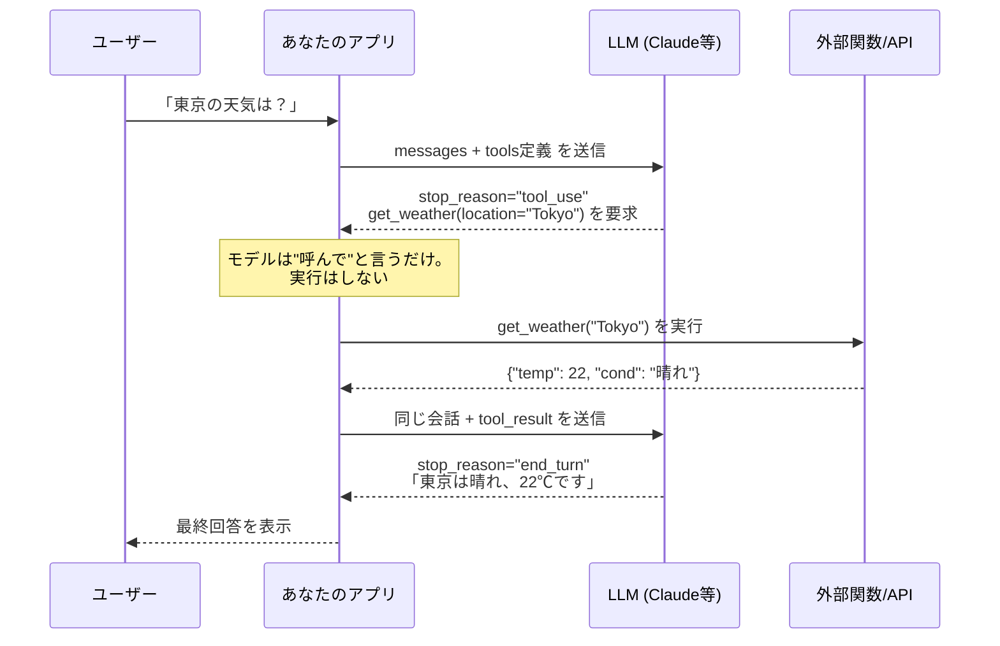

# Tool Calling（ツール呼び出し / Function Calling）

> **一言で言うと:** LLM（大規模言語モデル）に「使える道具（ツール）の一覧と使い方」を渡しておき、**モデル自身が「いつ・どの道具を・どんな引数で呼ぶか」を構造化されたJSONで出力する**仕組み。実際にその関数を実行するのはあなたのアプリ側で、結果をモデルに返すと文章に組み込んでくれる。

## 3分で全体像

- **何を解決する技術か:** テキスト生成しかできないLLMを、**外部システム（DB・API・計算・社内ツール）に接続して「行動できるAI」**に拡張する。
- **代表的な使用シーン:** AIチャットボットが在庫DBを照会する、カスタマーサポートBotが注文をキャンセルする、AIエージェントがファイルを読み書きする。
- **これだけは覚える3つ:**
    1. **モデルは関数を実行しない。** モデルが返すのは「この関数をこの引数で呼んで」という**指示（tool_use）**だけ。実行はアプリ側の責任。
    2. **ツール定義の中核は [[JSON-Schema]]。** 「何という名前で・何のためで・どんな引数を取るか」をスキーマで宣言し、モデルはそれを読んで呼び方を決める。
    3. **会話は往復ループ。** モデルがツールを要求 → アプリが実行 → 結果を返す → モデルが続きを生成、を `stop_reason` が止まるまで繰り返す。
- **AIに任せやすいか:** 一部任せられる — ループの定型コードは生成させてよいが、**ツールの権限境界・副作用・エラー設計は人間が決める**（後述）。
- **詰まったらここを読む:** [[API設計-REST-GraphQL]] / [[JSON-Schema]] / [[バリデーション]]

## なぜ必要か

素のLLMは「次に来そうな文字列」を生成するだけで、外の世界に触れられない。だから次のような要求に答えられない:

- 「**今の**東京の天気は？」→ 学習時点より後の情報は持っていない
- 「私の注文 #12345 の配送状況を教えて」→ あなたのDBを見られない
- 「来月の請求額を計算して」→ 正確な四則演算すら苦手（もっともらしい嘘＝ハルシネーションを生む）

これらは「文章をうまく書く」能力では解決できない。**外部システムを呼び出す能力**が要る。Tool Calling はその橋渡しをする標準的な仕組みで、OpenAI では Function Calling、Anthropic（Claude）では Tool Use と呼ばれるが、考え方は同じだ。

> [!info] 用語ミニ辞典
> - **LLM（Large Language Model / 大規模言語モデル）** — 大量のテキストで学習し、文章生成・要約・分類などを行うAIモデル。Claude, GPT などが該当する。
> - **ハルシネーション（Hallucination）** — モデルが存在しない事実・関数・数値を自信満々に生成する現象。Tool Calling は「計算やデータ照会を外部に逃がす」ことでこれを減らす狙いもある。
> - **ツール（Tool）/ 関数（Function）** — モデルから呼び出せる、アプリ側が用意した処理単位（例: `get_weather`, `cancel_order`）。「ツール」と「関数」はこの文脈ではほぼ同義。

## どの問題を解決するか

| 課題 | Tool Calling なしの世界 | Tool Calling で解決 |
|---|---|---|
| 最新情報へのアクセス | 学習時点で知識が止まる | `web_search` や社内API呼び出しで最新値を取得 |
| 正確な計算・データ照会 | もっともらしい嘘を生む | 計算・DB照会を外部関数に委譲し、結果を引用させる |
| 自然言語 → 構造化アクション | 「キャンセルして」を実行に変換できない | `cancel_order(order_id=12345)` という構造化呼び出しに変換 |
| 出力フォーマットの保証 | 自由文に混ざって抽出が大変 | スキーマで引数の型を強制（後述の `strict`） |

要は **「曖昧な自然言語」を「型の付いた関数呼び出し」へ翻訳する**のが本質だ。これは [[API設計-REST-GraphQL]] でいう「フロントとバックの契約」を、人間の言葉とプログラムの間にも引くことに似ている。

### 動作の流れ（ツール呼び出しループ）



ポイントは、**1回のユーザー質問に対してアプリ⇄LLMの往復が複数回発生しうる**こと。モデルが複数のツールを順に呼びたい場合、`stop_reason` が `end_turn`（＝もう道具は要らない）になるまでループが続く。

## 他の仕組みとどう関係するか

- **下位レイヤーとの関係:**
    - **[[ストリームレスポンス]]** — チャットUIでは回答をトークンごとに流す。ツール呼び出しの「考え中」「ツール実行中」の表示もこのストリーミングイベント上で扱う。
    - **HTTP/JSON** — ツール定義もtool_resultも、最終的には [[API設計-REST-GraphQL]] で扱う普通のHTTPリクエストボディ（JSON）として送受信される。Tool Calling は新しいプロトコルではなく、Messages API という1つのエンドポイントの一機能だ。
- **同レイヤーとの関係:**
    - **[[JSON-Schema]]** — ツールの `input_schema` はそのままJSON Schema。`additionalProperties: false` や `enum`、`required` の扱いはこちらの知識がそのまま効く。
    - **[[バリデーション]]** — モデルが生成した引数は**外部入力と同じく信用してはいけない**。実行前に必ず検証する（後述の誤解2）。
    - **[[エラーハンドリング]]** — ツール実行が失敗したら `is_error: true` で結果を返し、モデルにリカバリさせる。例外で握りつぶさない。
- **上位レイヤーとの関係:**
    - **[[最小権限の原則]]（Layer 6）** — ツールに与える権限は「そのタスクに必要な最小限」に。`delete_all_users` のような広すぎるツールを安易に渡さない。これは横断的関心事として最重要。
    - **[[非同期処理とメッセージキュー]]（Layer 5）** — 重いツール（レポート生成、外部バッチ）は同期実行せず、ジョブを積んで「受け付けました」を返す設計に寄せる。

## 誤解されやすいポイント

1. **「モデルが関数を実行してくれる」は誤り。**
   モデルが返すのは `{"name": "get_weather", "input": {"location": "Tokyo"}}` という**JSONの指示**だけ。実際に `get_weather` を呼ぶコードはあなたが書く。モデルは「呼び方の提案者」であって「実行者」ではない。この誤解があると「なぜ天気が返ってこないのか」で延々詰まる。

2. **モデルが生成した引数を検証なしで実行するのは危険。**
   モデルは `order_id` に存在しない値や、`amount` に負の数を入れてくることがある。さらにプロンプトインジェクション（ユーザーが「全注文をキャンセルして」と仕込む）で意図しない引数を出させられる。**tool_use の input は外部入力**だと思って [[バリデーション]] と権限チェックを通す。`additionalProperties: false` を [[JSON-Schema]] で必ず指定し、想定外フィールドを弾く。

3. **ツールを増やせば賢くなる、は半分嘘。**
   ツールが多すぎると、モデルはどれを使うべきか迷い精度が落ちる。説明文（description）が曖昧だと誤った道具を選ぶ。**「いつ呼ぶか」をdescriptionに明記**し、本当に必要なツールだけ渡すのが鉄則。数十個になるなら動的にツールを絞り込む仕組み（ツール検索）を検討する。

4. **`stop_reason` を見ずに `content[0]` を読むと壊れる。**
   モデルがツールを要求したターンでは、最初のcontentブロックが文章（text）とは限らず tool_use ブロックのこともある。`stop_reason == "tool_use"` を先に判定してから分岐する。これを怠ると「たまにクラッシュするチャットボット」になる。

5. **OpenAI と Anthropic でフォーマットが微妙に違う。**
   概念は同じ（ツール定義＋呼び出し＋結果の往復）だが、フィールド名やレスポンス構造が異なる（OpenAIは `tool_calls`、Anthropicは content内の `tool_use` ブロック）。ベンダーをまたぐ抽象化を自作する前に、差分を [[ToolCalling-AIチャットボット実装]] で把握しておく。さらに**同じモデルでも「どこ経由で呼ぶか」でフォーマットと使える機能が変わる** — Amazon Bedrock 経由ではモデル ID の書式が変わり、Web検索などサーバーサイドツールが使えないこともある（→ [[Amazon-Bedrockとモデル提供形態の選択]]）。

## 設計のベストプラクティス

- **ツールは「動詞＋目的語」で命名し、descriptionに発動条件を書く。** 例: `get_order_status` / 「ユーザーが注文の配送状況や到着予定を尋ねたときに呼ぶ」。何をするかだけでなく**いつ呼ぶか**を書くと選択精度が上がる。
- **入力スキーマは厳密に。** `required` を明示し、`enum` で取りうる値を限定し、`additionalProperties: false` を付ける。可能なら `strict: true`（スキーマ完全準拠を保証する機能）を使う。
- **副作用のあるツールはゲートを設ける。** メール送信・課金・削除など「取り消しにくい操作」は、実行前にユーザー確認を挟む / 専用の承認フローに通す。読み取り専用ツール（検索・照会）と、書き込みツールを設計上はっきり分ける。
- **エラーはモデルに返してリカバリさせる。** 関数が失敗したら例外で止めず、`tool_result` に `is_error: true` と原因メッセージを入れて返す。モデルは別の引数で再試行したり、ユーザーに聞き直したりできる。
- **冪等性とタイムアウトを意識する。** モデルが同じツールを二度呼ぶことはある。書き込み系は冪等に設計し、重いツールは [[非同期処理とメッセージキュー]] に逃がす。
- **ループに上限を設ける。** ツール往復が無限に続く事故を防ぐため、最大反復回数（例: 10回）でブレークする安全弁を入れる。

## AIエージェントとの協働

> このトピックでAIコーディングエージェント（Claude Code, Copilot, Cursor 等）と協働するための観点。
> Tool Calling 自体がAI機能の実装なので、「**AIにAI機能を作らせる**」という二重構造になる。定型ループは任せやすいが、安全性に関わる判断は人間が握る。

### AIに任せられる部分 / 人間が判断すべき部分

| タスク種類 | 任せ方（実装/レビュー） | 人間の関与 |
|---|---|---|
| ツール往復ループの定型コード | 実装を任せてよい。SDKのツールランナーや`stop_reason`分岐は定番パターン | レビューでループ上限・例外処理の有無を確認 |
| JSON Schema のツール定義 | ドラフト生成を任せる | `additionalProperties: false`・`required`・権限境界を人間が確定 |
| tool_result の組み立て | 任せてよい | `is_error` の扱い・機密情報を結果に混ぜていないかを確認 |
| どのツールを公開するか | — | **人間が決める。** 削除・課金・全件操作の露出は設計判断 |
| 引数バリデーション・認可 | 雛形は任せる | **境界条件と認可ロジックは人間がレビュー必須**（インジェクション対策） |

### AI生成コードのレビュー観点（このトピック固有）

AI生成のTool Calling実装を受け取ったとき、最低限ここを見る。

1. **`stop_reason` を見ずに `content[0].text` を読んでいないか。** ツール要求ターンで落ちる定番バグ。`tool_use` ブロックを正しく走査しているか。
2. **モデル生成の `input` を検証せず実行していないか。** `order_id` の所有者チェック、数値範囲、`additionalProperties: false` の有無。**ここが抜けると権限昇格・インジェクションの穴になる。**
3. **副作用ツールに承認ゲートやループ上限があるか。** 「とりあえず動くチャットボット」は往復無限ループや無確認削除を作りがち。`is_error` で握りつぶさず返しているかも確認。

### 効くプロンプトの型

```
# 前提（プロジェクトの状況・既存のコード規約）
- Python + Anthropic SDK（claude-opus-4-8）。DBアクセスは src/db/repo.py 経由
- 認可は require_user(user_id) で行う。生のSQLは禁止

# やってほしいこと
- 注文照会チャットボットのツール往復ループを実装
- ツール: get_order_status(order_id), cancel_order(order_id)

# 守ってほしい制約（このトピック固有のもの）
- input_schema は additionalProperties: false、required 明示、strict: true
- cancel_order は実行前に「その注文がそのユーザーのものか」を必ず認可チェック
- ツール失敗は is_error:true で返し、例外でループを止めない
- ループは最大10往復で打ち切る
- モデル生成の order_id を検証なしでDBに渡さない

# 完了の判断基準
- 他人の注文IDを渡すと認可エラーになる（テストで確認）
- 存在しないツール名を要求されても落ちない
- 正常系で stop_reason が end_turn になりループが終了する
```

### AI実装のアンチパターン

| アンチパターン | なぜ問題か | レビュー観点 / 対策 |
|---|---|---|
| `content[0].text` 直読み | ツール要求ターンでcontentがtool_useブロックのとき例外 | `stop_reason`分岐 + ブロック種別での走査を徹底 |
| モデル生成 input を無検証で実行 | プロンプトインジェクション・権限昇格の温床 | input を外部入力扱いし [[バリデーション]] + 認可を通す |
| 過剰なツール数を一括公開 | モデルが道具選択を誤り精度低下 | 必要最小限に絞る / descriptionに発動条件を明記 |
| ツール失敗を例外で握りつぶす | モデルがリカバリできず会話が死ぬ | `tool_result` に `is_error:true` で返す |
| ループ上限なし | ツール往復が無限ループ化しコスト爆発 | 最大反復回数で安全弁を設ける |
| 機密値を tool_result にそのまま混入 | モデル出力経由で漏洩 | 返す前にマスキング / 最小限のフィールドだけ返す |

→ レイヤー横断のアンチパターン索引: [[_anti-patterns/_index|AIアンチパターン索引]]

## 具体例

主要言語は Python（Anthropic SDK）。**実用的なAIチャットボット（マルチターン会話 + ストリーミング + OpenAIとの違い）の完全実装**は [[ToolCalling-AIチャットボット実装]] に切り出してある。

### 1. ツールを定義する（JSON Schema）

ツール定義は「名前・説明・引数スキーマ」の3点。スキーマは [[JSON-Schema]] そのもの。

```python
import anthropic

client = anthropic.Anthropic()  # ANTHROPIC_API_KEY を環境変数から解決

tools = [
    {
        "name": "get_order_status",
        "description": (
            "注文の配送状況・到着予定を取得する。"
            "ユーザーが注文番号を挙げて状況を尋ねたときに呼ぶ。"
        ),
        # input_schema は JSON Schema。strict と additionalProperties:false で
        # モデルに想定外のフィールドを生成させない
        "strict": True,
        "input_schema": {
            "type": "object",
            "properties": {
                "order_id": {"type": "integer", "description": "注文番号"},
            },
            "required": ["order_id"],
            "additionalProperties": False,
        },
    }
]
```

### 2. ツール往復ループを回す

`stop_reason == "tool_use"` の間だけツールを実行し、結果を返して継続する。`stop_reason` が `end_turn` になったらモデルの最終回答が得られている。

```python
def get_order_status(order_id: int, user_id: int) -> dict:
    # 重要: モデルが渡した order_id を検証なしで信用しない。
    # 「その注文がこのユーザーのものか」を必ず認可チェックする。
    order = repo.find_order(order_id)
    if order is None or order.user_id != user_id:
        raise PermissionError(f"order {order_id} は参照できません")
    return {"order_id": order_id, "status": order.status, "eta": order.eta}


def chat(user_text: str, user_id: int) -> str:
    messages = [{"role": "user", "content": user_text}]

    for _ in range(10):  # ループ上限（無限往復の安全弁）
        resp = client.messages.create(
            model="claude-opus-4-8",
            max_tokens=1024,
            tools=tools,
            messages=messages,
        )

        # モデルがもう道具を要らないと判断したら終了
        if resp.stop_reason != "tool_use":
            # 最終回答テキストを取り出す
            return "".join(b.text for b in resp.content if b.type == "text")

        # アシスタントのターン（tool_use ブロック含む）を会話に追加
        messages.append({"role": "assistant", "content": resp.content})

        # 要求された各ツールを実行し、結果を tool_result として集める
        tool_results = []
        for block in resp.content:
            if block.type != "tool_use":
                continue
            try:
                if block.name == "get_order_status":
                    result = get_order_status(user_id=user_id, **block.input)
                else:
                    raise ValueError(f"未知のツール: {block.name}")
                content = str(result)
                is_error = False
            except Exception as e:
                # 失敗は例外で止めず、モデルに返してリカバリさせる
                content = f"エラー: {e}"
                is_error = True

            tool_results.append({
                "type": "tool_result",
                "tool_use_id": block.id,   # 要求元の id と必ず一致させる
                "content": content,
                "is_error": is_error,
            })

        # ツール結果は1つの user メッセージにまとめて返す
        messages.append({"role": "user", "content": tool_results})

    return "（ツール往復が上限に達しました）"
```

押さえどころ:

- **`tool_use_id` の一致** — 結果は必ず要求元の `block.id` と紐付ける。ずれると400エラー。
- **複数ツールは1メッセージに** — モデルが並列に複数ツールを要求したら、全結果を**1つの user メッセージ**にまとめる。分割すると並列呼び出しを抑制してしまう。
- **`tool_choice`** — `{"type": "auto"}`（既定、モデルが判断）/ `{"type": "any"}`（必ず何か呼ぶ）/ `{"type": "tool", "name": "..."}`（特定ツール強制）/ `{"type": "none"}`（呼ばせない）で制御できる。

### 3. SDKのツールランナーで定型ループを省く

上記ループは定番なので、SDK側にループを任せるヘルパーもある（Anthropic SDK の `tool_runner`）。「素のループの中身を理解した上で」使うと、定型コードを減らせる。

```python
from anthropic import beta_tool

@beta_tool
def get_order_status(order_id: int) -> str:
    """注文の配送状況を取得する。ユーザーが注文番号を挙げたときに呼ぶ。"""
    return str(repo.find_order(order_id))

runner = client.beta.messages.tool_runner(
    model="claude-opus-4-8",
    max_tokens=1024,
    tools=[get_order_status],
    messages=[{"role": "user", "content": "注文12345の状況は？"}],
)
for message in runner:   # ループ・tool_result の往復はSDKが処理
    print(message)
```

> [!warning] ランナーを使っても安全責任は消えない
> ツールランナーは「モデルが要求したら自動でその関数を実行」する。つまり**承認ゲートや認可チェックは関数の中に自分で書く**必要がある。削除・課金など副作用の大きい操作で自動実行を許すと事故になる。手動承認を挟みたいなら素のループ（例2）を使う。

### MCP — ツール接続の標準化

ツールを個別アプリに書く代わりに、**[[MCP]]（Model Context Protocol）** という標準プロトコルでツール群を「サーバー」として公開し、複数のAIクライアントから再利用する流れが広がっている。社内のGitHub・DB・SaaS連携を1つのMCPサーバーに集約し、Claude Code でも自作チャットボットでも同じツール群を使う、といった構成が取れる。詳しくは [[MCP]] を参照（供給網リスクは [[Claude-Skillsエコシステム]] 周辺とも共通）。

### RAG — ツール呼び出しと対をなす「知識の渡し方」

Tool Calling が「モデルに**行動させる**」のに対し、社内文書やDBから関連断片を検索してプロンプトに詰め、根拠付きで答えさせるのが **[[RAG]]（検索拡張生成）**。検索自体を1つのツールとして公開すれば、モデルが必要なときだけ検索を呼ぶ「エージェント型RAG」になり、両者は組み合わせて使う。使い分けと実装は [[RAG]] を参照。

## 参考リソース

- [Anthropic — Tool use overview](https://platform.claude.com/docs/en/agents-and-tools/tool-use/overview) — ツール定義・tool_choice・結果ハンドリングの一次資料
- [Anthropic — Implement tool use](https://platform.claude.com/docs/en/agents-and-tools/tool-use/implement-tool-use) — ループ実装とサンプル
- [OpenAI — Function calling](https://platform.openai.com/docs/guides/function-calling) — OpenAI側のフォーマット（差分理解に）
- [Model Context Protocol](https://modelcontextprotocol.io/) — ツール接続の標準プロトコル
- [JSON Schema 公式](https://json-schema.org/) — `input_schema` の文法（[[JSON-Schema]] も参照）

## 理解度セルフチェック

> 答えられなければ本文に戻る。答えはこのファイル内に必ずある。

1. 「Tool Calling でモデルが関数を実行する」という説明はどこが間違っているか。モデルが実際に返すものと、誰が関数を実行するのかを30秒で説明せよ。
2. ツール往復ループで `stop_reason` を確認せずに `resp.content[0].text` を読むと、なぜ「たまに」クラッシュするのか。Yes/No ではなく理由を述べよ。
3. 次のAI生成コードはこのトピックの観点で何が問題か。修正方針も述べよ。
   ```python
   # results は前段で results = [] と初期化済みとする
   for block in resp.content:
       if block.type == "tool_use" and block.name == "cancel_order":
           cancel_order(block.input["order_id"])   # ① 実行
           results.append({"type": "tool_result",
                           "tool_use_id": block.id,
                           "content": "キャンセルしました"})
   ```

> [!note]- 解答の指針
> 1. モデルが返すのは `{"name": ..., "input": {...}}` という**ツール呼び出しの指示（tool_use ブロック）**であって、関数の実行結果ではない。実際に関数を呼ぶのは**アプリ側のコード**。モデルは「呼び方の提案者」であり「実行者」ではない（誤解1）。この区別を取り違えると「天気が返ってこない」「DBが更新されない」で延々詰まる。
> 2. モデルがツールを要求したターンでは、`content` の先頭ブロックが必ずしも text ではなく **tool_use ブロックのことがある**。tool_use ブロックには `.text` 属性がないので、`content[0].text` を無条件に読むと属性エラーで落ちる。「たまに」なのは、ツールを呼ばない普通の応答ターンでは先頭が text なので動いてしまい、ツールを要求したときだけ壊れるから。`stop_reason == "tool_use"` を先に判定し、ブロックの `type` で分岐するのが正しい（誤解4）。
> 3. 問題は **①の `cancel_order` を認可チェックなしで実行している**点。`order_id` はモデルが生成した値で、プロンプトインジェクションや誤生成で「他人の注文ID」が入りうる。これは外部入力と同じく信用してはいけない（誤解2）。`cancel_order` は副作用が大きく取り消しにくい操作なので、(a) その注文がこのユーザーのものかを認可チェック、(b) できれば実行前にユーザー確認を挟む、(c) 失敗時は例外で止めず `is_error: true` で返す、を加える。さらに `try/except` が無いため、1件失敗すると会話全体が落ちる。
> > [!info] 用語ミニ辞典
> > - **プロンプトインジェクション** — ユーザー入力や外部データに「これまでの指示を無視して〜」のような命令を混ぜ、モデルに意図しない行動（不正なツール呼び出し等）をさせる攻撃。ツールの input を必ず検証・認可すべき最大の理由。

## 学習メモ

（ツール往復ループを一度自分で手書きしてから SDK ランナーを使うと、ランナーが何を肩代わりしているか・どこに自分で認可を挟むべきかが腹落ちする。実装の全体像は [[ToolCalling-AIチャットボット実装]] へ）
