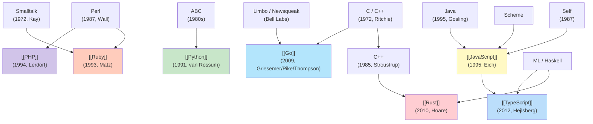
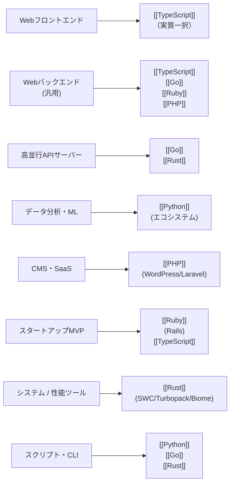

# プログラミング言語の系譜と選択

> **一言で言うと:** プログラミング言語はそれぞれが解決しようとした時代の問題と、設計者の哲学を色濃く反映している。Webプロダクトの寿命を左右する「言語選択」は、**型システム・並行モデル・GC戦略・エコシステム成熟度**という4軸のトレードオフ判断であり、流行ではなく特性で選ぶべきもの。

## なぜ必要か

言語選択は技術スタックの中で**最も交換コストが高い決断**の一つ。一度選んだ言語は、採用市場・教育コスト・ライブラリエコシステム・運用ノウハウすべてに影響し、後から変えると数年〜十数年規模のリプレイスになる（PHPで作ったレガシーアプリのGo/TypeScriptへの移行、Rubyの大規模Railsアプリの停滞など、業界に多数の事例がある）。

それにもかかわらず、言語選択の議論は表層的になりがち:

- 「速いから Go」 — どんな処理が速いのか、どこで効くのかの理解なし
- 「型があるから TS」 — 型がついていてもバグはバグる、TS特有の罠もある
- 「Pythonは機械学習向け」 — エコシステムは強いが GIL や非同期の弱さは無視されがち
- 「PHPは古い」 — PHP 8 は別言語と呼べるほど進化している

各言語の**設計者が当時何の問題を解決しようとしたか**を理解することで、はじめて「この用途にこの言語が向く理由」を語れる。本トピックは、言語選択を体系的に語るための入口を提供する。

## どの問題を解決するか

### 問題1: 言語特性が散在的にしか把握されない

実務では「JavaScriptは動的型」「Goは並行性が強い」のような断片的知識で言語を語りがち。**実際の選択判断には、複数言語を同じ軸で比較できる構造化された理解が必要**。

### 問題2: 「流行で選ぶ」と数年後の負債になる

2010年代の Ruby on Rails ブーム、2015年頃の Node.js 一辺倒の流れ、近年の Rust 信仰など、流行は技術的判断を歪める。**言語の核心的な設計思想に立ち戻れば、流行を超えた選択軸が見える**。

### 問題3: 言語ごとの「やってはいけない」が体系化されていない

各言語には固有の罠がある（PHPの `==`、JavaScript の `this`、Pythonの可変デフォルト引数、Goのnil interface、Rustのライフタイム）。これらを言語横断で並べて見ることで、「動的型言語に共通する罠」「静的型言語の限界」のようなメタな理解が得られる。

## 言語の系譜

それぞれの詳細は [[JavaScript]] / [[TypeScript]] / [[Go]] / [[Python]] / [[PHP]] / [[Ruby]] / [[Rust]] を参照。

## 設計トレードオフの4軸比較

各言語の核心的な設計判断を4つの軸で並べる:

| 言語 | 型システム | 並行モデル | メモリ管理 | エコシステム特化領域 |
|------|----------|----------|----------|------------------|
| [[JavaScript]] | 動的・弱い | イベントループ（シングルスレッド） | GC | フロント / Node.jsバックエンド |
| [[TypeScript]] | 静的・構造的・gradual | （JS継承） | （JS継承） | 大規模フロント / 型安全なバックエンド |
| [[Go]] | 静的・構造的・シンプル | Goroutine + Channel（CSP） | GC（低レイテンシ） | クラウドインフラ / API / CLI |
| [[Python]] | 動的・型ヒントで段階的 | GIL（3.14でfree-threaded正式化／オプトイン） + asyncio | GC | データ分析 / ML / スクリプト |
| [[PHP]] | 動的→段階的（PHP 8+） | Share-nothing（リクエスト単位） | GC | Web専用（CMS / SaaS） |
| [[Ruby]] | 動的・強い | GVL + Fiber + Ractor（実験的） | GC | Webアプリ（Rails） / DSL |
| [[Rust]] | 静的・代数的 | OS スレッド + async | 所有権（GCなし） | システム / Web基盤ツール / Wasm |

### 型システム軸の解説

**動的型 vs 静的型** は単なる「型を書くかどうか」ではなく、エラーを実行時に発見するか・ビルド時に発見するかの哲学の違い:

- **動的型代表**: [[Python]] / [[Ruby]] / [[PHP]] / [[JavaScript]] — 開発初速・柔軟性を重視
- **静的型代表**: [[TypeScript]] / [[Go]] / [[Rust]] — 大規模化・リファクタリング耐性を重視
- **gradual typing**: [[TypeScript]] / [[Python]] / [[PHP]] が部分的に採用 — 動的型言語に後付けで型を載せるアプローチ

### 並行モデル軸の解説

並行性の扱い方が言語の世界観を決める:

- [[Go]] のGoroutineと[[並行性の基本概念|Channel]]（CSPモデル）— 軽量スレッド数万を当然のように扱う
- [[JavaScript]]のイベントループ（[[イベントループ|詳細]]）— シングルスレッド + 非同期 I/O
- [[Python]]のGIL — CPU並列性を犠牲にして実装をシンプルに
- [[PHP]]のShare-nothing — リクエストごとにメモリ完全リセット、状態同期問題が原理的に発生しない
- [[Rust]]のFearless concurrency — 所有権で[[ロック|データ競合]]をビルド時に検出

### メモリ管理軸の解説

GC（ガベージコレクション）の有無は性能特性を決める:

- **GCあり**: ほぼすべての高水準言語。プログラマがメモリ解放を気にしなくていい
- **GCなし（所有権）**: [[Rust]]のみ — 性能予測可能、リアルタイム処理可能、学習コスト高い

[[メモリリーク]]の原因や[[ダングリングポインタ]]への対処の仕方が、この軸で決まる。

## 用途別の選択指針

「言語の選択は問題領域に従う」が原則。設計者が想定した用途から外れた使い方は、必ずどこかで詰まる。

## 他の仕組みとどう関係するか

- **下位レイヤーとの関係:**
  - [[Layer1-OSインフラ/_index|Layer 1: OS/インフラ]] — 言語ランタイムは [[シングルコア・マルチコアとスレッドモデル|スレッドモデル]] や [[ファイルディスクリプタ|FD]] の扱い方を抽象化する
  - [[インタプリタ・コンパイラ・JIT]] — 各言語の実行方式の違い（PHP/Pythonはインタプリタ、Go/Rustはコンパイラ、JS/Java/Rubyは JIT）
- **同レイヤーとの関係:**
  - [[ルーティングとミドルウェア]] / [[API設計-REST-GraphQL]] / [[データアクセス層]] — 言語によって主流のフレームワークと書き味が変わる（Go の標準ライブラリ志向 vs Ruby の Rails 一強 vs Pythonの FastAPI/Django 二強）
  - [[DOMと仮想DOM]] / [[コンポーネント設計]] — フロントは [[TypeScript]] が事実上の標準
- **上位レイヤーとの関係:**
  - [[Layer5-パフォーマンス/_index|Layer 5: パフォーマンス]] — 言語選択がスループット・レイテンシ・[[メモリ階層とキャッシュ|メモリ効率]]に直結する
  - [[Layer6-セキュリティ/_index|Layer 6: セキュリティ]] — 動的型言語は[[SQLインジェクションとXSS|入力検証]]の責任が大きい、Rust はメモリ安全性で多くの脆弱性が原理的に存在しない
  - [[Layer7-設計アーキテクチャ/_index|Layer 7: 設計]] — 言語の特性が[[クリーンアーキテクチャ|アーキテクチャ選択]]や[[テストダブル|テスト戦略]]に影響する

## 誤解されやすいポイント

### 1. 「速い言語が常に良い」

[[Go]] や [[Rust]] が高速だからといって、すべての領域で最適とは限らない。**言語の速さが効くのは「同じ処理を多数捌く」場面**であり、開発速度・採用市場・既存資産・チームのスキルセットを総合した「組織としての速さ」は別の話。スタートアップが Rust で MVP を作って失速する、Go で複雑なドメインロジックを書いて型表現力に苦しむ、といった失敗事例は多い。

### 2. 「型があれば安全」

[[TypeScript]] / [[Go]] の型は実行時の保証ではない。`as` キャストや `interface{}` で型システムをバイパスでき、外部入力（JSON, DB, FormData）の境界では結局ランタイムバリデーションが必要。型は「**自分が書いたコードの整合性**」を保証するが、「**世界の整合性**」は保証しない。

### 3. 「動的型言語は大規模に向かない」

これは半分正しく半分間違い。**型ヒント（[[Python]] PEP 484, [[PHP]] の型宣言, [[Ruby]] の RBS）が成熟した現在、適切に運用すれば動的型言語でも大規模開発は可能**。GitHub・Shopify・Airbnb・Stripe などが Ruby/Python の大規模運用を成功させている例がある。

### 4. 「言語は1つ覚えれば十分」

Webエンジニアは複数言語を扱うことが多く、**それぞれの言語の世界観の違いを理解することが、より良い設計判断につながる**。Go の simplicity 哲学を知ると TS の冗長な型を整理したくなる、Rust の所有権を知ると JS のクロージャによる参照保持を意識する、のような相互作用が起きる。

## 設計のベストプラクティス

### 言語選択の判断フロー

1. **問題領域から始める** — フロント/バック/データ/システムのどれかで候補が絞られる
2. **チームのスキルセットを確認** — 言語の客観的優劣より、チームが書ける言語の方が重要
3. **採用市場を確認** — その言語のエンジニアが採用できる地域・予算か
4. **エコシステムを確認** — 必要なライブラリ・フレームワークが揃っているか
5. **長期保守を考慮** — 5年後もメンテされている見込みがあるか（Erlang / Crystal / Nim 等は注意）

### 多言語スタックの設計

近年は1つのプロダクトでも複数言語を使うのが普通:

- フロント = [[TypeScript]]、バック = [[Go]]、データ処理 = [[Python]]、性能ツール = [[Rust]] のような組み合わせが現実的
- ただし**言語が増えるほど運用コストが増す**ため、「やむを得ない理由」がある場合のみ追加すべき

## AIによる実装のアンチパターン

| アンチパターン | なぜ問題か | 対策 |
|---|---|---|
| 言語固有のイディオムを無視した「翻訳調」コード | Goに JS 風のオブジェクト、Pythonに Java 風のクラス階層など、言語の世界観に合わない | 各言語の[[Goのポインタ\|代表的なイディオム]]を学んで自然な書き方をする |
| 言語の最新版仕様を使わず古いパターンを生成 | PHP 5 風の `mysql_*` 関数、ES5 風の `var` 多用、Python 2 風の print 文 | 各言語detailで最新版の推奨パターンを確認 |
| 動的型言語に過剰な型注釈 | Python の `Dict[str, Dict[str, List[Tuple[int, str]]]]` のような型ヒント地獄 | 必要十分なところに留め、複雑なものは TypedDict や Pydantic で構造化 |
| 静的型言語で型システムをバイパス | TS の `as any`, Go の `interface{}` 多用 | 型を回避する代わりに、適切な型表現を学ぶ（[[ジェネリクス]]・[[インターフェース]]） |
| すべての言語で同じエラーハンドリングパターンを使う | Go の `if err != nil` は他言語の例外と本質的に違う、Rust の `Result<T, E>` も独特 | 各言語の[[エラーハンドリングとフォールバックの設計戦略\|エラーハンドリング哲学]]を尊重 |
| 言語の並行モデルを誤用 | Go の goroutine を JS の Promise のように使う、Python で CPU並列を期待する | 各言語の並行モデルを正しく理解（[[並行性の基本概念]]） |

## 参考リソース

- 『プログラミング言語論』(2nd edition, Robert W. Sebesta) — 言語設計の理論的背景
- [TIOBE Index](https://www.tiobe.com/tiobe-index/) — 言語の人気度トレンド
- [Stack Overflow Developer Survey](https://survey.stackoverflow.co/) — 開発者の言語使用実態の年次調査
- [The History of Programming Languages](https://hopl.info/) — 主要言語の創生史アーカイブ
- 各言語の公式ドキュメントと初代設計者によるエッセイ（各 detail に列挙）

## 学習メモ

- 言語ごとの「ハロワを書ける」と「その言語らしく書ける」の間には大きな溝がある。各 detail では「らしさが現れるサンプル」を重視する
- 言語の選択は本質的に**未来予測**を含む（5年後もこの言語は伸びているか？）。歴史を学ぶことで、過去の流行と廃れのパターンが見えるようになる
