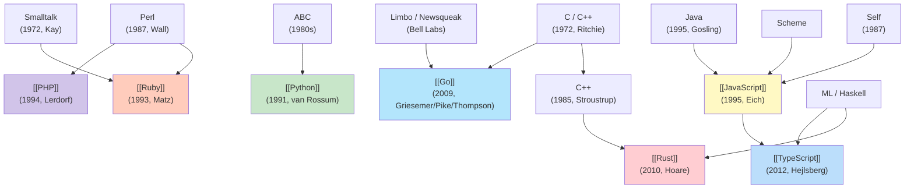
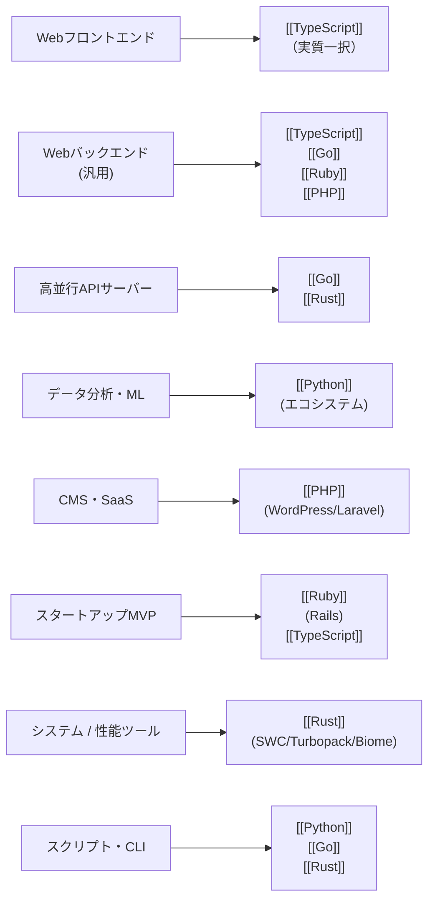

# プログラミング言語の系譜と選択

> **一言で言うと:** プログラミング言語はそれぞれが解決しようとした時代の問題と、設計者の哲学を色濃く反映している。Webプロダクトの寿命を左右する「言語選択」は、**型システム・並行モデル・GC戦略・エコシステム成熟度**という4軸のトレードオフ判断であり、流行ではなく特性で選ぶべきもの。

## 3分で全体像

- **何を解決する技術か:** プロダクトの数年〜十数年単位の寿命を支える「言語選択」を、流行や噂ではなく**設計者の哲学と4軸の特性**で評価できるようにする。一度選ぶと組織全体（採用・教育・ライブラリ・運用）に固定化される選択を、構造的な比較軸の上で行えるようにする
- **代表的な使用シーン:** 新規プロダクトの技術スタック選定、レガシー言語からの移行判断、マイクロサービスごとに異なる言語を採用するか統一するかの議論、外部委託先の言語選定、ジュニアの教育順序の設計
- **これだけは覚える3つ:**
    1. **言語選択は「組織としての速さ」が最優先** — Go や Rust が高速でも、チームが書けない・採用できない言語を選ぶと **「言語が速いがプロダクトは遅い」** に陥る。問題領域 → チームスキル → 採用市場 → エコシステム → 長期保守、の順に評価する
    2. **4軸（型・並行・メモリ・エコシステム）で並べると見える** — 「動的 vs 静的」だけでなく、`Result<T,E>` / `Option<T>` / `error` 戻り値 / 例外、Goroutine / イベントループ / GIL / 所有権、GC / 所有権、汎用 / Web 特化 / ML 特化、を比較表で並べる
    3. **「型があれば安全」は嘘** — TypeScript の `as`、Go の `interface{}`、Rust の `unsafe` で型システムは穴になる。型は「**自分が書いたコードの整合性**」を保証するが、「**世界の整合性**」（外部入力・JSON・DB レスポンス）にはランタイムバリデーション（[[バリデーション]]）が必須
- **AIに任せやすいか:** **任せにくい（minimal）** — 言語選択そのものは**未来予測を含むビジネス判断**で、AI に最終決定を委ねるべきではない。一方、選定後の各言語固有のイディオム翻訳・ボイラープレート生成・初期セットアップは AI が高品質に書ける。言語の特性比較を AI に出させて**人間が最終判断**するのが正しい使い分け
- **詰まったらここを読む:** [[インタプリタ・コンパイラ・JIT]] / [[シングルコア・マルチコアとスレッドモデル]] / [[ルーティングとミドルウェア]]

## なぜ必要か

言語選択は技術スタックの中で**最も交換コストが高い決断**の一つ。一度選んだ言語は、採用市場・教育コスト・ライブラリエコシステム・運用ノウハウすべてに影響し、後から変えると数年〜十数年規模のリプレイスになる（PHPで作ったレガシーアプリのGo/TypeScriptへの移行、Rubyの大規模Railsアプリの停滞など、業界に多数の事例がある）。

それにもかかわらず、言語選択の議論は表層的になりがち:

- 「速いから Go」 — どんな処理が速いのか、どこで効くのかの理解なし
- 「型があるから TS」 — 型がついていてもバグはバグる、TS特有の罠もある
- 「Pythonは機械学習向け」 — エコシステムは強いが GIL や非同期の弱さは無視されがち
- 「PHPは古い」 — PHP 8 は別言語と呼べるほど進化している

各言語の**設計者が当時何の問題を解決しようとしたか**を理解することで、はじめて「この用途にこの言語が向く理由」を語れる。本トピックは、言語選択を体系的に語るための入口を提供する。

## どの問題を解決するか

### 問題1: 言語特性が散在的にしか把握されない

実務では「JavaScriptは動的型」「Goは並行性が強い」のような断片的知識で言語を語りがち。**実際の選択判断には、複数言語を同じ軸で比較できる構造化された理解が必要**。

### 問題2: 「流行で選ぶ」と数年後の負債になる

2010年代の Ruby on Rails ブーム、2015年頃の Node.js 一辺倒の流れ、近年の Rust 信仰など、流行は技術的判断を歪める。**言語の核心的な設計思想に立ち戻れば、流行を超えた選択軸が見える**。

### 問題3: 言語ごとの「やってはいけない」が体系化されていない

各言語には固有の罠がある（PHPの `==`、JavaScript の `this`、Pythonの可変デフォルト引数、Goのnil interface、Rustのライフタイム）。これらを言語横断で並べて見ることで、「動的型言語に共通する罠」「静的型言語の限界」のようなメタな理解が得られる。

## 言語の系譜


```mermaid
graph TD
    C["C / C++<br/>(1972, Ritchie)"] --> Cpp["C++<br/>(1985, Stroustrup)"]
    Smalltalk["Smalltalk<br/>(1972, Kay)"] --> Ruby["[[Ruby]]<br/>(1993, Matz)"]
    ABC["ABC<br/>(1980s)"] --> Python["[[Python]]<br/>(1991, van Rossum)"]
    Perl["Perl<br/>(1987, Wall)"] --> Ruby
    Perl --> PHP["[[PHP]]<br/>(1994, Lerdorf)"]
    Self["Self<br/>(1987)"] --> JS["[[JavaScript]]<br/>(1995, Eich)"]
    Scheme["Scheme"] --> JS
    Java["Java<br/>(1995, Gosling)"] --> JS
    JS --> TS["[[TypeScript]]<br/>(2012, Hejlsberg)"]
    C --> Go["[[Go]]<br/>(2009, Griesemer/Pike/Thompson)"]
    Limbo["Limbo / Newsqueak<br/>(Bell Labs)"] --> Go
    Cpp --> Rust["[[Rust]]<br/>(2010, Hoare)"]
    ML["ML / Haskell"] --> Rust
    ML --> TS

    style JS fill:#fff9c4
    style TS fill:#bbdefb
    style Go fill:#b3e5fc
    style Python fill:#c8e6c9
    style PHP fill:#d1c4e9
    style Ruby fill:#ffccbc
    style Rust fill:#ffcdd2
```

それぞれの詳細は [[JavaScript]] / [[TypeScript]] / [[Go]] / [[Python]] / [[PHP]] / [[Ruby]] / [[Rust]] を参照。

## 設計トレードオフの4軸比較

各言語の核心的な設計判断を4つの軸で並べる:

| 言語 | 型システム | 並行モデル | メモリ管理 | エコシステム特化領域 |
|------|----------|----------|----------|------------------|
| [[JavaScript]] | 動的・弱い・構造的 | イベントループ（シングルスレッド） | GC | フロント / Node.jsバックエンド |
| [[TypeScript]] | 静的・**構造的**・gradual typing | （JS継承） | （JS継承） | 大規模フロント / 型安全なバックエンド |
| [[Go]] | 静的・**構造的**・シンプル | Goroutine + Channel（CSP） | GC（低レイテンシ） | クラウドインフラ / API / CLI |
| [[Python]] | 動的・型ヒントで段階的 | GIL + asyncio（**3.13 で実験的 free-threading 導入、3.14 でオプトインの公式サポート格上げ。GIL は依然デフォルト**） | GC | データ分析 / ML / スクリプト |
| [[PHP]] | 動的→段階的（PHP 8+） | Share-nothing（リクエスト単位） | GC | Web専用（CMS / SaaS） |
| [[Ruby]] | 動的・強い・**ダックタイピング** | GVL + Fiber + Ractor（実験的） | GC | Webアプリ（Rails） / DSL |
| [[Rust]] | 静的・**代数的データ型** | OS スレッド + async | 所有権（GCなし） | システム / Web基盤ツール / [[WebAssembly\|Wasm]] |

### 型システム軸の解説 — 4つのパラダイムで見る

**動的型 vs 静的型**は単なる「型を書くかどうか」ではなく、**どこでエラーを発見するか**の哲学の違い。さらに静的型の中にも**型の表現力**で差がある:

| パラダイム | 言語 | 特徴 |
|------|------|------|
| **構造的型 (Structural)** | [[TypeScript]] / [[Go]] | 「同じ形なら同じ型」。インターフェース実装を明示する必要がない。`interface Duck { quack(): void }` を満たすオブジェクトは自動的に Duck 型 |
| **公称型 (Nominal)** | Java / C# / Rust の trait の一部 | 「同じ名前で宣言した型のみ同じ型」。`implements Duck` のような明示が必要 |
| **代数的データ型 (Algebraic / ADT)** | [[Rust]] / Haskell / Scala | `enum Result<T, E> { Ok(T), Err(E) }` のように**型に値の組み合わせ**を表現できる。`Option<T>` で null を型レベルで表現する |
| **gradual typing** | [[TypeScript]] / [[Python]] / [[PHP]] | 動的型言語に**部分的に型を載せる**。型注釈がない箇所は `any` 相当で、実行時には型情報は消える |

「動的型 vs 静的型」の対立だけでは Rust の `Result<T,E>` が解く問題（**例外を投げない、エラーを型で強制する**）が見えない。エラー伝播の哲学（次節）と合わせて理解する。

### エラー伝播の哲学 — 各言語の「失敗の表現」

| 戻り値 / 例外モデル | 代表言語 | 特徴 |
|------|------|------|
| **例外（Exception）暗黙伝播** | [[Python]] / [[Ruby]] / [[PHP]] / [[JavaScript]] / Java | `throw` / `raise` でコールスタックを遡上。書き忘れても伝播するが、**どの関数がどの例外を投げるか型に現れない** |
| **戻り値（Error as Value）** | [[Go]] | `result, err := f()` で明示的にチェック。**冗長だが見落としが起きにくい** |
| **代数的型（Result / Option）** | [[Rust]] / Haskell / Scala / [[TypeScript]] (Effect-TS 等) | `Result<T, E>` / `Option<T>` を**型システムが強制**。`?` 演算子で簡潔に伝播。**コンパイラが扱い忘れを検出** |

シニアレベルの言語選択判断では、「例外を許容するチームか」「Result 型のコストを払えるか」もエコシステム選定に直結する。

### 並行モデル軸の解説

並行性の扱い方が言語の世界観を決める:

- [[Go]] のGoroutineと Channel（CSPモデル）— 軽量スレッド数万を当然のように扱う
- [[JavaScript]]のイベントループ（[[イベントループ|詳細]]）— シングルスレッド + 非同期 I/O
- [[Python]]のGIL — CPU並列性を犠牲にして実装をシンプルに（PEP 703 で **3.13 から free-threading 実験導入、3.14 でオプトイン公式サポート**。GIL 排除は依然オプトインで、デフォルトビルドは GIL 維持）
- [[PHP]]のShare-nothing — リクエストごとにメモリ完全リセット、状態同期問題が原理的に発生しない
- [[Rust]]のFearless concurrency — 所有権で[[ロック|データ競合]]をビルド時に検出

### メモリ管理軸の解説

GC（ガベージコレクション）の有無は性能特性を決める:

- **GCあり**: ほぼすべての高水準言語。プログラマがメモリ解放を気にしなくていい
- **GCなし（所有権）**: [[Rust]]のみ — 性能予測可能、リアルタイム処理可能、学習コスト高い

[[メモリリーク]]の原因や[[ダングリングポインタ]]への対処の仕方が、この軸で決まる。

## 用途別の選択指針


```mermaid
graph LR
    Use1["Webフロントエンド"] --> A["[[TypeScript]]<br/>（実質一択）"]
    Use2["Webバックエンド<br/>(汎用)"] --> B["[[TypeScript]]<br/>[[Go]]<br/>[[Ruby]]<br/>[[PHP]]"]
    Use3["高並行APIサーバー"] --> C["[[Go]]<br/>[[Rust]]"]
    Use4["データ分析・ML"] --> D["[[Python]]<br/>(エコシステム)"]
    Use5["CMS・SaaS"] --> E["[[PHP]]<br/>(WordPress/Laravel)"]
    Use6["スタートアップMVP"] --> F["[[Ruby]]<br/>(Rails)<br/>[[TypeScript]]"]
    Use7["システム / 性能ツール"] --> G["[[Rust]]<br/>(SWC/Turbopack/Biome)"]
    Use8["スクリプト・CLI"] --> H["[[Python]]<br/>[[Go]]<br/>[[Rust]]"]
```

「言語の選択は問題領域に従う」が原則。設計者が想定した用途から外れた使い方は、必ずどこかで詰まる。

## 他の仕組みとどう関係するか

- **下位レイヤーとの関係:**
  - [[Layer1-OSインフラ/_index|Layer 1: OS/インフラ]] — 言語ランタイムは [[シングルコア・マルチコアとスレッドモデル|スレッドモデル]] や [[ファイルディスクリプタ|FD]] の扱い方を抽象化する
  - [[インタプリタ・コンパイラ・JIT]] — 各言語の実行方式の違い（PHP/Pythonはインタプリタ、Go/Rustはコンパイラ、JS/Java/Rubyは JIT）
- **同レイヤーとの関係:**
  - [[ルーティングとミドルウェア]] / [[API設計-REST-GraphQL]] / [[データアクセス層]] — 言語によって主流のフレームワークと書き味が変わる（Go の標準ライブラリ志向 vs Ruby の Rails 一強 vs Pythonの FastAPI/Django 二強）
  - [[DOMと仮想DOM]] / [[コンポーネント設計]] — フロントは [[TypeScript]] が事実上の標準
- **上位レイヤーとの関係:**
  - [[Layer5-パフォーマンス/_index|Layer 5: パフォーマンス]] — 言語選択がスループット・レイテンシ・[[メモリ階層とキャッシュ|メモリ効率]]に直結する
  - [[Layer6-セキュリティ/_index|Layer 6: セキュリティ]] — 動的型言語は[[SQLインジェクションとXSS|入力検証]]の責任が大きい、Rust はメモリ安全性で多くの脆弱性が原理的に存在しない
  - [[Layer7-設計アーキテクチャ/_index|Layer 7: 設計]] — 言語の特性が[[クリーンアーキテクチャ|アーキテクチャ選択]]や[[テストダブル|テスト戦略]]に影響する

## 誤解されやすいポイント

### 1. 「速い言語が常に良い」

[[Go]] や [[Rust]] が高速だからといって、すべての領域で最適とは限らない。**言語の速さが効くのは「同じ処理を多数捌く」場面**であり、開発速度・採用市場・既存資産・チームのスキルセットを総合した「組織としての速さ」は別の話。スタートアップが Rust で MVP を作って失速する、Go で複雑なドメインロジックを書いて型表現力に苦しむ、といった失敗事例は多い。

シニアレベルでは **「言語のベンチマーク」と「組織のベンチマーク」を別軸で評価**する習慣が必要。RPS（言語の速さ）を 5 倍にするより、開発リードタイムを半分にする方がプロダクト全体の速さに効く局面が多い。

### 2. 「型があれば安全」

[[TypeScript]] / [[Go]] の型は実行時の保証ではない。`as` キャストや `interface{}` で型システムをバイパスでき、外部入力（JSON, DB, FormData）の境界では結局ランタイムバリデーションが必要。型は「**自分が書いたコードの整合性**」を保証するが、「**世界の整合性**」は保証しない（→ [[バリデーション]]）。

### 3. 「動的型言語は大規模に向かない」

これは半分正しく半分間違い。**型ヒント（[[Python]] PEP 484, [[PHP]] の型宣言, [[Ruby]] の RBS）が成熟した現在、適切に運用すれば動的型言語でも大規模開発は可能**。GitHub・Shopify・Airbnb・Stripe などが Ruby/Python の大規模運用を成功させている例がある。

### 4. 「言語は1つ覚えれば十分」

Webエンジニアは複数言語を扱うことが多く、**それぞれの言語の世界観の違いを理解することが、より良い設計判断につながる**。Go の simplicity 哲学を知ると TS の冗長な型を整理したくなる、Rust の所有権を知ると JS のクロージャによる参照保持を意識する、のような相互作用が起きる。

### 5. 「最新版に追従していれば安心」

言語のメジャーバージョン更新は、ランタイム・依存ライブラリ・本番環境・CI/CD の足並みが揃って初めて意味がある。Python 3.14 の free-threading や PHP 8 の strict_types のような**段階的に有効化する機能**は、フラグや設定で**チームの準備が整ってから**適用するのが定石。

## 設計のベストプラクティス

### 言語選択の判断フロー

1. **問題領域から始める** — フロント/バック/データ/システムのどれかで候補が絞られる
2. **チームのスキルセットを確認** — 言語の客観的優劣より、チームが書ける言語の方が重要
3. **採用市場を確認** — その言語のエンジニアが採用できる地域・予算か
4. **エコシステムを確認** — 必要なライブラリ・フレームワークが揃っているか
5. **長期保守を考慮** — 5年後もメンテされている見込みがあるか（Erlang / Crystal / Nim 等は注意）

### 多言語スタックの設計

近年は1つのプロダクトでも複数言語を使うのが普通:

- フロント = [[TypeScript]]、バック = [[Go]]、データ処理 = [[Python]]、性能ツール = [[Rust]] のような組み合わせが現実的
- ただし**言語が増えるほど運用コストが増す**ため、「やむを得ない理由」がある場合のみ追加すべき

## AIエージェントとの協働

> このトピックでAIコーディングエージェント（Claude Code, Copilot, Cursor 等）と協働するための観点。
> 言語選択そのものは**ビジネス・組織・未来予測を含む人間判断**で AI に最終決定を委ねるべきではない。一方、選定後の各言語のイディオム翻訳・定型コード生成・移行ツール実装は AI が高品質に書ける。AIコードレビュー観点で「Goに JS 風オブジェクト」「Pythonに Java 風クラス階層」「TS の `as any` 多用」などの言語アンチパターンを必ず検出する。

### AIに任せられる部分 / 人間が判断すべき部分

| タスク種類 | 任せ方（実装/レビュー） | 人間の関与 |
|---|---|---|
| **言語選択そのものの最終判断** | **AIに任せない** | 採用市場・チームスキル・既存資産・5年後の保守見通しは人間判断 |
| 各言語のイディオム翻訳（同じロジックを多言語で書き直し） | AI に任せる | 言語の世界観に合わない「翻訳調」をAIコードレビュー観点で検出 |
| 4軸比較表・ベンチマーク資料の生成 | AI に複数案を出させる | データの最新性・妥当性は人間が検証 |
| 言語マイグレーションツール / コード変換スクリプト | AI 実装 | 移行戦略（Strangler Fig / ビッグバン / サイドカー）は人間判断 |
| 各言語の最新バージョンの差分整理 | AI に要約させる | バージョン採用判断（破壊的変更の許容度）は人間 |
| 言語固有のセキュリティ罠（PHP `==`、JS `this`、Python 可変デフォルト） | AI が網羅 | 自社コードへの該当箇所判定は人間が確認 |

### AI生成コードのレビュー観点（このトピック固有）

AI生成の多言語コードや言語選定資料を受け取ったとき、最低限ここを見る。

1. **言語のイディオムに合っているか — 「翻訳調コード」の検出** — Go なのに JS 風のオブジェクトリテラル、Python なのに Java 風のクラス階層、Rust なのに C++ 風のポインタ操作になっていないか。各言語にはコミュニティが磨いてきた**慣習的な書き方**があり、そこから外れると保守困難に。`gofmt` `black` `rustfmt` `prettier` などの公式フォーマッタを通した上で、各言語の `_anti-patterns` も照合する
2. **型システムのバイパスや回避** — TS の `as any` `as unknown as T` 多用、Go の `interface{}` / `any` 多用、Rust の `unsafe` 不要利用、Python の型ヒント無視（`Any`）が目立たないか。これらは型システムの利益を捨てる行為で、「動かすため」に逃げているならリファクタの兆候
3. **古いパターンの混入** — PHP 5 風の `mysql_*` 関数、ES5 風の `var` 多用、Python 2 風の print 文、Ruby の `Object#tap` 未使用、Java 7 風のループなど、**学習データの古さ**から AI は古いパターンを生成しがち。各言語の最新ベストプラクティス（PEP / RFC / 公式 changelog）と照合する

### 効くプロンプトの型

このトピックに関する実装をAIに依頼するとき、コンテキストとして渡すべき情報・制約・成功基準のテンプレ。

```
# 前提（プロジェクトの状況・既存のコード規約）
- 言語: Go 1.23 / Python 3.13 / TypeScript 5.4 / PHP 8.3 / Ruby 3.3 / Rust 1.80 など明示
- 主要フレームワーク: Gin / FastAPI / Express 5 / Laravel 11 / Rails 7.1 / Axum
- フォーマッタ・リンタ: gofmt / black + ruff / biome / php-cs-fixer / rubocop / rustfmt + clippy
- 採用検討中の最新機能: Python free-threading (オプトイン) / TS 5.4 const型パラメータ / Go 1.23 iter
- チーム経験年数の中央値: {年数}
- 言語アップグレードの予算: 余裕あり / 必要時のみ

# やってほしいこと
- 「{要件}」を {言語名} で実装
- 各言語のイディオムに合わせた書き方を選ぶ
- 必要なら他言語の対応バージョンも提示

# 守ってほしい制約（このトピック固有のもの）
- 公式フォーマッタ (gofmt / black / rustfmt) に通る
- 型システムをバイパスしない (TS の as any / Go の interface{} 多用 / Rust の unsafe を避ける)
- エラー伝播はその言語の哲学に沿う (Go: error 戻り値 / Rust: Result / TS: throw or Result / Python: 例外)
- 並行処理は言語のモデルに従う (Go: goroutine+channel / JS: async/await / Python: asyncio / Rust: tokio)
- 廃止 API・古いパターン (PHP mysql_*, JS var, Python print文 等) は使わない
- 動的型言語に過剰な型注釈の入れ子を作らない (Pydantic / TypedDict で構造化)
- 言語間で「翻訳調」にならない (Go に JS 風オブジェクト等)

# 完了の判断基準
- 公式フォーマッタ・リンタを通る
- 型チェック (mypy / tsc / cargo check) が通る
- その言語の標準テストランナーが緑
- 同等機能を多言語で書いた場合、各言語の慣習的な API が使われている
```

### AI実装のアンチパターン

LLM生成コードで頻出する過剰設計・誤用パターン。レビュー時の照合表として使う。

| アンチパターン | なぜ問題か | レビュー観点 / 対策 |
|---|---|---|
| 言語固有のイディオムを無視した「翻訳調」コード | Goに JS 風のオブジェクト、Pythonに Java 風のクラス階層など、言語の世界観に合わない | 各言語の[[Goのポインタ\|代表的なイディオム]]を学んで自然な書き方をする。公式フォーマッタとリンタに通す |
| 言語の最新版仕様を使わず古いパターンを生成 | PHP 5 風の `mysql_*` 関数、ES5 風の `var` 多用、Python 2 風の print 文 | 各言語detailで最新版の推奨パターンを確認、Lint で古い API を禁止 |
| 動的型言語に過剰な型注釈 | Python の `Dict[str, Dict[str, List[Tuple[int, str]]]]` のような型ヒント地獄 | 必要十分なところに留め、複雑なものは TypedDict や Pydantic で構造化 |
| 静的型言語で型システムをバイパス | TS の `as any`, Go の `interface{}` 多用 | 型を回避する代わりに、適切な型表現を学ぶ（[[ジェネリクス]]・[[インターフェース]]） |
| すべての言語で同じエラーハンドリングパターンを使う | Go の `if err != nil` は他言語の例外と本質的に違う、Rust の `Result<T, E>` も独特 | 各言語の[[エラーハンドリングとフォールバックの設計戦略\|エラーハンドリング哲学]]を尊重 |
| 言語の並行モデルを誤用 | Go の goroutine を JS の Promise のように使う、Python で CPU並列を期待する | 各言語の並行モデルを正しく理解（[[シングルコア・マルチコアとスレッドモデル|スレッドモデルの基本]]・[[イベントループ]]・[[ロック|並行制御]]） |
| ベンチマーク数値だけで言語選定 | TechEmpower 等のマイクロベンチマークと実プロダクトのボトルネックは別物 | チームスキル・採用市場・エコシステムを含めた「組織としての速さ」で評価 |
| 「型ヒントがあるから動的型言語でも安全」と過信 | 型ヒントは実行時には消える。外部入力は依然ランタイムバリデーションが必要 | Pydantic / Zod / RBS+Steep 等で**境界での実行時検証** |
| Rust を学習目的で本番投入 | 所有権・ライフタイムの学習コストが軽視され、開発速度が想定の 1/3 になる | チーム全員が経験者でない場合、Rust は「**ホットパスのみ FFI**」など部分採用が現実的 |

→ レイヤー横断のアンチパターン索引: [[_anti-patterns/_index|AIアンチパターン索引]]

## 具体例

各言語の「らしさ」が現れる最小サンプル。同じ「ユーザー一覧から特定 ID のユーザーを探し、見つからなければエラー」を各言語で書き分ける。

### TypeScript — 構造的型 + Result型 (Effect-TS) のパターン

```typescript
type User = { id: number; name: string };

// 構造的型: 形が合えば実装明示なしで適合
type HasId = { id: number };

function findById<T extends HasId>(items: T[], id: number): T | undefined {
  return items.find(item => item.id === id);
}

// 例外を投げる古典スタイル
class UserNotFoundError extends Error {
  constructor(id: number) {
    super(`User ${id} not found`);
    this.name = 'UserNotFoundError';
  }
}

function getUser(users: User[], id: number): User {
  const user = findById(users, id);
  if (!user) throw new UserNotFoundError(id);
  return user;
}
```

### Go — 戻り値エラー + 早期リターン

```go
package main

import (
	"errors"
	"fmt"
)

type User struct {
	ID   int
	Name string
}

var ErrUserNotFound = errors.New("user not found")

// Go の哲学: error は戻り値で明示、呼び出し元が必ずチェック
func GetUser(users []User, id int) (User, error) {
	for _, u := range users {
		if u.ID == id {
			return u, nil
		}
	}
	return User{}, fmt.Errorf("get user %d: %w", id, ErrUserNotFound)
}

func main() {
	users := []User{{1, "Alice"}, {2, "Bob"}}
	u, err := GetUser(users, 99)
	if err != nil {
		// errors.Is でラップされたエラーを判定
		if errors.Is(err, ErrUserNotFound) {
			fmt.Println("not found")
			return
		}
		panic(err)
	}
	fmt.Println(u.Name)
}
```

### Rust — 代数的データ型で「ない」を型で表現

```rust
struct User {
    id: u32,
    name: String,
}

#[derive(Debug)]
enum UserError {
    NotFound(u32),
}

// Result<T, E> でエラーを型として強制。? で簡潔に伝播
fn get_user(users: &[User], id: u32) -> Result<&User, UserError> {
    users.iter()
        .find(|u| u.id == id)
        .ok_or(UserError::NotFound(id))
}

fn main() -> Result<(), UserError> {
    let users = vec![
        User { id: 1, name: "Alice".into() },
        User { id: 2, name: "Bob".into() },
    ];
    let user = get_user(&users, 1)?;  // ? で Err を自動伝播
    println!("{}", user.name);
    Ok(())
}
```

### Python — 例外 + 型ヒント

```python
from dataclasses import dataclass


@dataclass
class User:
    id: int
    name: str


class UserNotFoundError(Exception):
    pass


def get_user(users: list[User], id: int) -> User:
    """例外を投げる Python 流。型ヒントは静的解析で検査される"""
    for u in users:
        if u.id == id:
            return u
    raise UserNotFoundError(f"User {id} not found")


# 使用例
users = [User(1, "Alice"), User(2, "Bob")]
try:
    user = get_user(users, 99)
except UserNotFoundError as e:
    print(f"not found: {e}")
```

### Ruby — ダックタイピング + ブロック

```ruby
class UserNotFoundError < StandardError; end

# Ruby らしさ: detect (= find) と例外、シンボル引数、ブロック
def get_user(users, id)
  users.detect { |u| u[:id] == id } || raise(UserNotFoundError, "User #{id} not found")
end

users = [{ id: 1, name: "Alice" }, { id: 2, name: "Bob" }]
begin
  user = get_user(users, 99)
rescue UserNotFoundError => e
  puts "not found: #{e.message}"
end
```

### PHP — 型宣言（PHP 8+）+ 例外

```php
<?php
declare(strict_types=1);

class User
{
    public function __construct(
        public readonly int $id,
        public readonly string $name,
    ) {}
}

class UserNotFoundException extends \Exception {}

// PHP 8 の constructor property promotion + readonly + 型宣言を活用
function getUser(array $users, int $id): User
{
    foreach ($users as $u) {
        if ($u->id === $id) {
            return $u;
        }
    }
    throw new UserNotFoundException("User $id not found");
}

$users = [new User(1, 'Alice'), new User(2, 'Bob')];
try {
    $user = getUser($users, 99);
} catch (UserNotFoundException $e) {
    echo "not found: " . $e->getMessage();
}
```

### 比較 — 同じロジックで現れる言語の世界観

| 観点 | TypeScript | Go | Rust | Python | Ruby | PHP |
|------|-----------|----|----|------|------|------|
| エラー表現 | 例外 / Result（Effect-TS） | error 戻り値 | `Result<T, E>` 強制 | 例外 | 例外 | 例外 |
| 「ない」の表現 | `T \| undefined` | ゼロ値 + bool / error | `Option<T>` | `None` | `nil` | `null` |
| 型システム | 構造的・gradual | 構造的 | 公称 + ADT | 動的 + 型ヒント | 動的（ダックタイピング） | 動的 + 段階的型宣言 |
| 慣習スタイル | Promise / async | goroutine + channel | Result + `?` | with / context | block / yield | declare(strict_types=1) |

## 参考リソース

- 『プログラミング言語論』(2nd edition, Robert W. Sebesta) — 言語設計の理論的背景
- [TIOBE Index](https://www.tiobe.com/tiobe-index/) — 言語の人気度トレンド
- [Stack Overflow Developer Survey](https://survey.stackoverflow.co/) — 開発者の言語使用実態の年次調査
- [The History of Programming Languages](https://hopl.info/) — 主要言語の創生史アーカイブ
- 各言語の公式ドキュメントと初代設計者によるエッセイ（各 detail に列挙）

## 理解度セルフチェック

> 答えられなければ本文に戻る。答えはこのファイル内に必ずある。

1. **「速い言語が常に良い」がなぜ誤りか、30秒で説明せよ。** 「言語のベンチマーク」と「組織のベンチマーク」が別軸である理由に触れること。
2. **構造的型（Structural）・公称型（Nominal）・代数的データ型（ADT）の違いを、それぞれ代表言語と例とともに説明せよ。** Rust の `Result<T, E>` がなぜ ADT に分類されるかを述べよ。
3. **AI生成コードレビュー設問:** AI が以下の Go コードを生成した。本文の観点で **問題点を最低3つ** 指摘せよ。

```go
package main

import "fmt"

// User
type User struct {
	id   int
	name string
}

func GetUser(users interface{}, id int) interface{} {
	list := users.([]User)
	for _, u := range list {
		if u.id == id {
			return u
		}
	}
	return nil
}

func main() {
	users := []User{{1, "Alice"}, {2, "Bob"}}
	user := GetUser(users, 99)
	if user == nil {
		fmt.Println("not found")
		return
	}
	u := user.(User)
	fmt.Println(u.name)
}
```

> [!note]- 解答の指針
>
> > [!info] 用語ミニ辞典
> > - **構造的型 (Structural Typing):** 「同じ形なら同じ型」とみなす型システム。インターフェース実装を明示する必要がない。TypeScript・Go の interface が代表例。`{ id: number, name: string }` を満たすオブジェクトは自動的にその型として扱える
> > - **公称型 (Nominal Typing):** 「同じ名前で宣言した型のみ同じ型」とみなす型システム。Java の `implements`、Rust の trait 実装の明示が代表例。同じ形の構造体でも別名なら別型扱い
> > - **代数的データ型 (Algebraic Data Type / ADT):** 「型に値の組み合わせ」を表現できる型。`enum Result<T, E> { Ok(T), Err(E) }` のように **複数のバリアント**を1つの型にまとめる。Rust・Haskell・Scala が代表例。コンパイラが「すべてのバリアントを処理したか」を `match` で網羅検査する
> > - **gradual typing:** 動的型言語に部分的に静的型を載せる方式。TypeScript・Python の type hints・PHP の型宣言が代表例。型注釈がない箇所は `any` 相当で実行時には型情報が消える
> > - **戻り値エラー (Error as Value):** `result, err := f()` のように関数が結果とエラーを並べて返す Go の流派。例外と違い**呼び出し元が必ずチェックを書く必要がある**ため見落としが起きにくいが、冗長
> > - **Result / Option 型:** Rust が代表する代数的データ型のエラー表現。`Result<T, E>` は成功(T) / 失敗(E) のいずれか、`Option<T>` は値あり / なしのいずれか。**コンパイラが扱い忘れを検出**する
> > - **GIL (Global Interpreter Lock):** Python（CPython）と Ruby（MRI / GVL）が持つグローバルロック。**1プロセス内で同時に1スレッドしか Python/Ruby バイトコードを実行できない**制約。CPU 並列性を犠牲にして実装をシンプル化する設計判断
> > - **PEP 703 / free-threading:** Python の GIL を排除する提案。**3.13 で実験導入、3.14 でオプトインの公式サポート**に格上げされたが、デフォルトビルドは依然 GIL あり。GIL 排除版を使うには専用ビルドが必要で、C 拡張が free-threading 対応していないと壊れる
> > - **CSP (Communicating Sequential Processes):** Tony Hoare が提唱した並行プログラミングモデル。**プロセス間で共有メモリではなくチャネル（Channel）でメッセージを送り合う**。Go の goroutine + channel が代表的実装で、「Don't communicate by sharing memory; share memory by communicating」が標語
> > - **所有権 (Ownership):** Rust の中核機構。各値には**所有者が1つだけ**存在し、所有者がスコープを抜けると値は破棄される。GC を持たずにメモリ安全を達成する仕組みで、データ競合もコンパイル時に検出される
> > - **イディオム (Idiom):** その言語のコミュニティが「これが自然」と認めている書き方。Go の `if err != nil`、Python の `with` 文、Ruby のブロック、Rust の `?` 演算子など。同じ機能でも言語ごとに「らしい書き方」がある
> > - **型システムのバイパス:** TS の `as any` `as unknown as T`、Go の `interface{}` / `any` 多用、Rust の `unsafe` 多用など、型システムの保証を放棄する記法。動かすために逃げると後で型による安全性を失う
> > - **「翻訳調コード」:** 別言語のイディオムをそのまま移植したコード。Go に JS 風のオブジェクトリテラル、Python に Java 風のクラス階層、Rust に C++ 風のポインタなど。各言語の世界観と衝突し保守困難に
>
> 1. 言語のベンチマーク（同じ処理を多数捌くスループット・レイテンシ）が高くても、**チームが書けない・採用できない・既存資産と合わない言語を選ぶと、組織としての速さは下がる**。Rust は CPU 命令あたりの処理量で TypeScript の数倍速いが、所有権・ライフタイムの学習コストが大きく、Rust 経験者の採用市場も小さいため、スタートアップが Rust で MVP を作ると開発速度が想定の 1/3 になり機能リリースが遅れる事例が多い。一方、TypeScript は実行は遅いが、フロントとバックでコード共有でき、エンジニア採用市場が圧倒的に広く、エコシステムが成熟しているため、**「機能リリースまでの時間」というプロダクトレベルの速さは TypeScript の方が速い**ことが多い。シニアレベルでは「言語のベンチマーク（RPS）」と「組織のベンチマーク（リードタイム）」を別軸で評価し、どちらがプロダクト全体の速さに効くかを見極める必要がある。「速い言語」の意味を「組織の意思決定から本番リリースまで」で測ると、Go や Rust が必ずしも最速にならない
> 2. **構造的型（Structural）**は「同じ形なら同じ型」とみなすパラダイム。TypeScript と Go が代表例で、`interface Duck { quack(): void }` を満たすオブジェクトは `implements Duck` のような明示なしに自動的に Duck 型として扱える。利点は柔軟性、欠点は意図しない型一致が起きうる。**公称型（Nominal）**は「同じ名前で宣言した型のみ同じ型」とみなすパラダイム。Java の `implements Duck`、Rust の trait 実装の明示が代表例で、同じ形の構造体でも別名なら別型扱い。利点は意図的な型階層を強制できる、欠点は冗長性。**代数的データ型（ADT）**は「型に値の組み合わせ」を表現できるパラダイム。Rust・Haskell・Scala が代表例で、`enum Color { Red, Green, Blue }` のように **複数のバリアント** を1つの型にまとめる。Rust の `Result<T, E>` が ADT に分類される理由は、`enum Result<T, E> { Ok(T), Err(E) }` という定義から分かる通り「成功(T) または 失敗(E) のどちらか」という**バリアントの直和**を型レベルで表現しているから。`match` でバリアントを網羅処理することをコンパイラが強制し、「成功時の処理しか書かずに失敗を見落とす」が原理的にできない。例外モデル（暗黙伝播）や戻り値エラー（明示チェック）と比べ、**型システムにエラー処理を組み込んでしまう**点が ADT の特徴
> 3. AI生成コードの問題点（最低限以下を指摘できれば本文を理解している）:
>     - **`interface{}` を引数と戻り値に多用** — Go の構造的型システムを完全にバイパス。型安全性が消え、`users.([]User)` の型アサーションが失敗するとランタイムパニック。`func GetUser(users []User, id int) (User, error)` のように具体型を使うか、ジェネリクス（Go 1.18+）で `func GetUser[T any](items []T, ...)` と書くべき
>     - **エラー戻り値ではなく `nil` で「ない」を表現** — Go の哲学に反する。`User` は値型なのに戻り値が `interface{}` で `nil` 可能になり、`u.(User)` の型アサーションを呼び出し元に強制している。`func GetUser(...) (User, error)` で `error` として `ErrUserNotFound` を返すのが Go らしい
>     - **構造体フィールドが小文字で外部からアクセス不可** — `User.id` `User.name` は小文字なのでパッケージ外から `u.id` にアクセスできない。同一パッケージ内なので動くが、API 設計としては意図不明（外部公開なら `ID` `Name`）
>     - **`fmt.Errorf` でのコンテキスト追加なし** — エラーが発生してもどこで起きたかが分からない。`fmt.Errorf("get user %d: %w", id, ErrUserNotFound)` のようにラップする
>     - **`errors.Is` / `errors.As` でのエラー判定がない** — `if user == nil` でエラー判定しているが、Go では `errors.Is(err, ErrUserNotFound)` で sentinel エラーを判定するのが定石
>     - **`User` 型のゼロ値を使った早期リターンの設計欠落** — `return User{}, err` のように具体型のゼロ値を返せば、呼び出し元で型アサーションが不要になる。`interface{}` で返す設計は Java/C# の `Object` 戻り値の翻訳調
>     - **テストの `for _, u := range list` のループ変数キャプチャ問題** — Go 1.22 でループ変数のスコープが各反復に変更されたが、それ以前は goroutine 内で `u` を参照すると最後の値が取れる罠があった。今回は影響しないが、AI 生成コードはこの古い挙動を前提に書かれていることがある
>     - **より良い設計: ジェネリクス + Result ライクな戻り値** — `func Find[T any](items []T, pred func(T) bool) (T, bool)` のように Go ジェネリクスで書けば、`User` だけでなく汎用的に再利用できる

## 学習メモ

- 言語ごとの「ハロワを書ける」と「その言語らしく書ける」の間には大きな溝がある。各 detail では「らしさが現れるサンプル」を重視する
- 言語の選択は本質的に**未来予測**を含む（5年後もこの言語は伸びているか？）。歴史を学ぶことで、過去の流行と廃れのパターンが見えるようになる
- AI 時代の言語選択では「LLM の学習データに豊富にある言語」（Python・JS・TS・Go）と「学習データが少ない言語」（Crystal・Nim・Zig）でも AI 協働の生産性に差が出る。マイナー言語選択は AI 補助のメリットが小さい点も判断材料に
