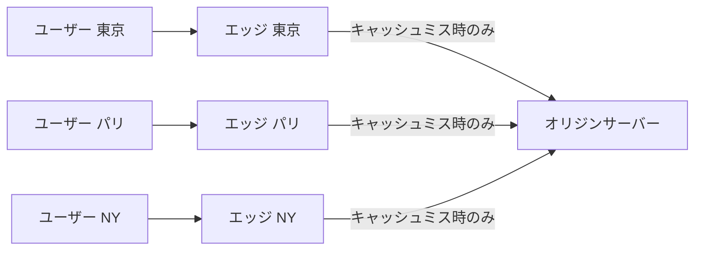
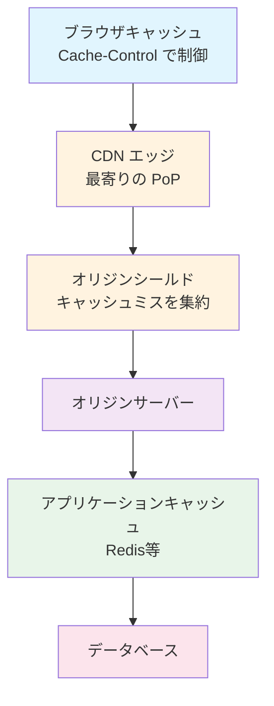

# CDN

> **一言で言うと:** ユーザーの物理的な近くにコンテンツのコピーを配置し、レイテンシを劇的に削減するネットワークインフラ。

## なぜ必要か

光ファイバーの中を信号が伝わる速度には物理的な上限がある。東京からニューヨークまで片道約70ms、往復で140ms以上かかる。TLSハンドシェイクやTCPの3ウェイハンドシェイクを含めると、最初の1バイトが届くまでに数百ミリ秒を消費する。

CDN（Content Delivery Network）がなければ、全てのリクエストがオリジンサーバー1箇所に集中し、以下の問題が発生する:

- **レイテンシの増大** --- 地理的に遠いユーザーほど応答が遅くなる
- **オリジンの過負荷** --- トラフィックのスパイク（セール、バズ等）でサーバーがダウンする
- **帯域コストの肥大** --- 同じコンテンツを何百万回もオリジンから配信する無駄

## どの問題を解決するか

### 1. 物理的距離によるレイテンシ

CDNは世界中にエッジサーバー（PoP: Point of Presence）を配置し、ユーザーに最も近いサーバーからコンテンツを返す。DNSベースのルーティングや[[AnycastとUnicast|Anycast]]により、ユーザーのリクエストは自動的に最寄りのエッジに到達する。



### 2. オリジンサーバーの負荷軽減

静的ファイル（画像・CSS・JS・フォント）をエッジがキャッシュすることで、オリジンへのリクエスト数を大幅に減らす。キャッシュヒット率が90%を超えれば、オリジンの負荷は1/10以下になる。

### 3. 可用性と耐障害性

オリジンが一時的にダウンしても、エッジのキャッシュからコンテンツを返し続けられる（stale-while-revalidate）。複数のエッジが冗長性を持つため、単一障害点を排除できる。

### 4. 動的コンテンツの高速化

現代のCDNは静的ファイルのキャッシュだけでなく、以下も提供する:

- **コネクション最適化** --- エッジとオリジン間で持続接続を維持し、ユーザー↔エッジ間のTLSハンドシェイクだけで済むようにする
- **[[エッジコンピューティング]]** --- Cloudflare Workers、AWS Lambda@Edgeなどでエッジ上でロジックを実行する
- **[[画像フォーマットと最適化|画像最適化]]** --- デバイスに応じたフォーマット変換（WebP/AVIF）やリサイズを自動で行う

## 他の仕組みとどう関係するか

- **下位レイヤーとの関係:**
  - [[TCP-IP]] --- CDNはTCPコネクションのセットアップコストを削減する。エッジが近いほどRTT（Round Trip Time）が短く、TCPスロースタートの影響も軽減される
  - [[DNS]] --- CDNのルーティングはDNSに依存する。CNAMEレコードでドメインをCDNのエッジに向ける。DNSのTTL設定がCDN切り替え時の反映速度に影響する
  - [[TLS-SSL]] --- TLSハンドシェイクはRTTを複数回消費する。エッジが近いことでこのオーバーヘッドが大幅に減る
  - [[HTTP-HTTPS]] --- CDNのキャッシュ制御はHTTPのCache-Controlヘッダーに基づく。ETag、Last-Modified、Varyヘッダーの理解が正しいキャッシュ戦略の前提

- **同レイヤーとの関係:**
  - [[ロードバランシング]] --- CDNはグローバルなロードバランサーとしても機能する。CDNがエッジレベルの分散、ロードバランサーがオリジンレベルの分散を担う
  - [[キャッシュ戦略]] --- CDNは多段キャッシュ（ブラウザ→エッジ→シールド→オリジン）の一層を担う。キャッシュの無効化（パージ）戦略がCDN運用の要
  - [[CoreWebVitals]] --- CDNの導入はLCP（Largest Contentful Paint）に直接的な改善効果がある

- **上位レイヤーとの関係:**
  - [[CORS]] --- CDNから配信されるリソースに対するCORSヘッダーの設定が必要。CDNがオリジンヘッダーをキャッシュしてしまうと、異なるオリジンからのリクエストが失敗する（Varyヘッダーで対処）

## 誤解されやすいポイント

### 1. 「CDNは静的ファイル専用」

初期のCDNは確かに静的コンテンツの配信が主目的だった。しかし現代のCDNは動的コンテンツの加速、エッジコンピューティング、DDoS防御、WAF（Web Application Firewall）など多機能化している。APIレスポンスのキャッシュやGraphQLのエッジキャッシュも一般的になっている。

### 2. 「CDNを入れればキャッシュは自動で最適化される」

CDNは`Cache-Control`ヘッダーに従ってキャッシュする。オリジンが適切なヘッダーを返さなければ、キャッシュされない（`no-store`）か、古いコンテンツが返され続ける。キャッシュ戦略の設計はアプリケーション開発者の責任であり、CDNは設定どおりに動くだけ。

### 3. 「キャッシュパージすれば即座に反映される」

CDNのエッジは世界中に分散しており、パージの伝播には時間がかかる。また、ブラウザキャッシュはCDNからは制御できない。確実に最新版を配信するには、ファイル名にハッシュを含める（Cache Busting）のが最も信頼性が高い。

### 4. 「CDNを使えばオリジンのセキュリティは気にしなくていい」

CDNはオリジンの前段に立つが、オリジンのIPアドレスが漏洩すると直接攻撃される。オリジンはCDNからのリクエストのみ受け付けるようにファイアウォールを設定すべき。また、CDN経由でもHTTPヘッダーインジェクションなどの攻撃は通過する。

## 設計のベストプラクティス

### 推奨パターン

| パターン | 説明 |
|---------|------|
| **Cache Busting（ハッシュ付きファイル名）** | `app.a1b2c3.js` のようにビルド時にハッシュを付与。`Cache-Control: max-age=31536000, immutable` で長期キャッシュ可能 |
| **stale-while-revalidate** | `Cache-Control: max-age=60, stale-while-revalidate=3600` で、キャッシュ期限切れ後も古いコンテンツを返しつつバックグラウンドで更新 |
| **オリジンシールド** | エッジ→オリジン間にシールド層を挟み、複数エッジからのキャッシュミスを1つに集約 |
| **Vary ヘッダーの適切な設定** | `Vary: Accept-Encoding, Accept` で、圧縮形式やコンテンツタイプごとに別キャッシュを保持 |

### アンチパターン

| アンチパターン | なぜ問題か | 対策 |
|---|---|---|
| 全ページに `no-cache` を設定 | CDNの効果がゼロになる | 静的/動的を分離し、静的にはlong-lived cacheを設定 |
| クエリパラメータでキャッシュバスティング (`?v=123`) | CDNによってはクエリパラメータごとに別キャッシュになり、キャッシュヒット率が低下 | ファイル名にハッシュを含める方式に統一 |
| CDN設定をコードで管理せずに手動設定 | 環境差異やヒューマンエラーが発生 | Terraform/PulumiでIaC化する |
| HTMLにlong-lived cacheを設定 | 更新後もブラウザが古いHTMLを表示し続ける | HTMLは `no-cache` で毎回検証、JS/CSSはハッシュ付きで長期キャッシュ |

## AIによる実装のアンチパターン

| アンチパターン | なぜ問題か | 対策 |
|---|---|---|
| CDN前提の設計を無視して全リソースにCache-Control: no-storeを設定 | CDNの恩恵を完全に潰す | 静的リソースには適切なキャッシュヘッダーをデフォルトで設定する |
| キャッシュ無効化のために全エッジにパージAPIを叩く処理を毎デプロイに組み込む | パージは重い操作であり、Cache Bustingで不要になる | ファイル名ハッシュ方式を採用し、パージは緊急時のみ |
| CDN設定をハードコードして環境ごとのドメインを考慮しない | ステージング/本番で異なるCDN設定が必要 | 環境変数でCDNドメインを注入する |

## 具体例

### Cache-Controlヘッダーの設定例（Nginx）

```nginx
# 静的アセット（ハッシュ付きファイル名前提）
location ~* \.(js|css|png|jpg|jpeg|gif|ico|svg|woff2)$ {
    add_header Cache-Control "public, max-age=31536000, immutable";
}

# HTML（常にオリジンに検証）
location ~* \.html$ {
    add_header Cache-Control "no-cache";
}

# APIレスポンス（短時間キャッシュ + バックグラウンド更新）
location /api/ {
    add_header Cache-Control "public, max-age=10, stale-while-revalidate=60";
    add_header Vary "Accept-Encoding, Authorization";
}
```

### CloudFront + S3 の構成例（Terraform）

```hcl
# Origin Access Control（OAC）--- 旧 OAI は非推奨
resource "aws_cloudfront_origin_access_control" "default" {
  name                              = "s3-oac"
  origin_access_control_origin_type = "s3"
  signing_behavior                  = "always"
  signing_protocol                  = "sigv4"
}

# キャッシュポリシー --- 旧 forwarded_values は非推奨
resource "aws_cloudfront_cache_policy" "assets" {
  name        = "assets-cache-policy"
  default_ttl = 86400
  max_ttl     = 31536000
  min_ttl     = 0

  parameters_in_cache_key_and_forwarded_to_origin {
    cookies_config {
      cookie_behavior = "none"
    }
    headers_config {
      header_behavior = "none"
    }
    query_strings_config {
      query_string_behavior = "none"
    }
    enable_accept_encoding_gzip  = true
    enable_accept_encoding_brotli = true
  }
}

resource "aws_cloudfront_distribution" "cdn" {
  origin {
    domain_name              = aws_s3_bucket.assets.bucket_regional_domain_name
    origin_id                = "S3-assets"
    origin_access_control_id = aws_cloudfront_origin_access_control.default.id
  }

  enabled             = true
  default_root_object = "index.html"

  default_cache_behavior {
    allowed_methods  = ["GET", "HEAD"]
    cached_methods   = ["GET", "HEAD"]
    target_origin_id = "S3-assets"
    cache_policy_id  = aws_cloudfront_cache_policy.assets.id

    viewer_protocol_policy = "redirect-to-https"
    compress               = true
  }

  restrictions {
    geo_restriction {
      restriction_type = "none"
    }
  }

  viewer_certificate {
    cloudfront_default_certificate = true
  }
}
```

### CDNのキャッシュ動作を確認する（curl）

```bash
# レスポンスヘッダーでキャッシュ状態を確認
curl -I https://example.com/assets/app.a1b2c3.js

# 確認すべきヘッダー:
# Cache-Control: public, max-age=31536000, immutable
# X-Cache: Hit from cloudfront    ← キャッシュヒット
# Age: 3600                       ← キャッシュされてからの秒数
# CF-Cache-Status: HIT            ← Cloudflareの場合
```

### 多段キャッシュの全体像



## 参考リソース

- [MDN Web Docs - HTTP caching](https://developer.mozilla.org/en-US/docs/Web/HTTP/Caching) --- キャッシュの基礎を網羅
- [Cloudflare Learning Center](https://www.cloudflare.com/learning/cdn/what-is-a-cdn/) --- CDNの仕組みを図解で解説
- [web.dev - Caching best practices](https://web.dev/articles/http-cache) --- Google推奨のキャッシュ戦略
- [High Performance Browser Networking (Ilya Grigorik)](https://hpbn.co/) --- ネットワークパフォーマンスの名著（無料公開）

## 学習メモ

（個人的な気づき・疑問・TODO）
