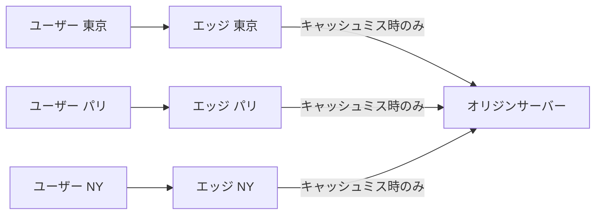
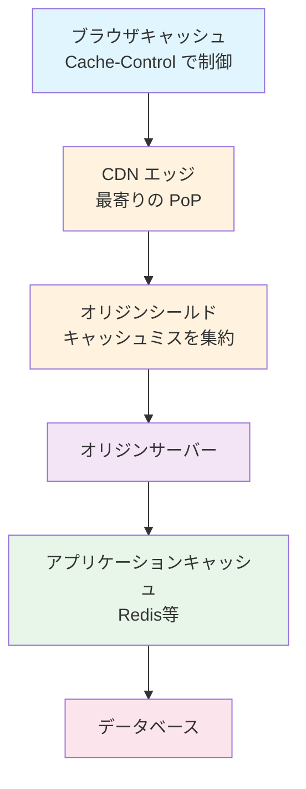

# CDN

> **一言で言うと:** ユーザーの物理的な近くにコンテンツのコピーを配置し、レイテンシを劇的に削減するネットワークインフラ。

## 3分で全体像

- **何を解決する技術か:** 「光の速度」という物理法則による地理的レイテンシを、エッジサーバーをユーザーの近くに置くことで回避する。同時にオリジンの負荷分散・DDoS 防御・エッジ計算の基盤としても機能する
- **代表的な使用シーン:** 画像・CSS・JS・フォント等の静的アセット配信、API レスポンスの地理的キャッシュ、グローバルサービスでの TTFB 短縮、トラフィックスパイク（セール・バズ）対策、エッジでの認証・ルーティング・画像最適化（Cloudflare Workers / Vercel Edge）、DDoS 緩和層
- **これだけは覚える3つ:**
    1. **CDN は `Cache-Control` ヘッダーに従って動く** — オリジンが `no-store` を返せばキャッシュされない、`public, max-age=...` を返せばその秒数キャッシュされる。**キャッシュ戦略の設計責任はアプリ開発者**であり、CDN を入れるだけでは何も改善しない
    2. **HTML はキャッシュしない、ハッシュ付きアセットは `immutable` で1年** — HTML を長期キャッシュすると更新が反映されない。逆に `app.a1b2c3.js` のようにビルドハッシュを含むファイル名なら、内容が変わればファイル名も変わる前提で `max-age=31536000, immutable` で問題ない
    3. **キャッシュパージは遅い、Cache Busting（ファイル名ハッシュ）が王道** — エッジは世界中に分散しているためパージ伝播は瞬時ではなく、ブラウザキャッシュは制御できない。**確実な最新版配信はファイル名にハッシュを含める**のが信頼性の高い方法
- **AIに任せやすいか:** **一部任せられる** — `Cache-Control` ヘッダーの設定パターン、Nginx / Cloudflare / CloudFront の設定雛形、Cache Busting 用のビルド設定は AI に任せやすい。一方で「**何をどのくらいの期間キャッシュするか**」「**Vary ヘッダーをどう設定するか**」「**`Authorization` ヘッダーを含むレスポンスをキャッシュしてしまう事故をどう防ぐか**」など、機密漏洩につながる判断は人間レビューが必須
- **詰まったらここを読む:** [[HTTP-HTTPS]] / [[キャッシュ戦略]] / [[CoreWebVitals]] / [[CORS]]

## なぜ必要か

光ファイバーの中を信号が伝わる速度には物理的な上限がある。東京からニューヨークまで片道約70ms、往復で140ms以上かかる。TLSハンドシェイクやTCPの3ウェイハンドシェイクを含めると、最初の1バイトが届くまでに数百ミリ秒を消費する。

CDN（Content Delivery Network）がなければ、全てのリクエストがオリジンサーバー1箇所に集中し、以下の問題が発生する:

- **レイテンシの増大** --- 地理的に遠いユーザーほど応答が遅くなる
- **オリジンの過負荷** --- トラフィックのスパイク（セール、バズ等）でサーバーがダウンする
- **帯域コストの肥大** --- 同じコンテンツを何百万回もオリジンから配信する無駄

## どの問題を解決するか

### 1. 物理的距離によるレイテンシ

CDNは世界中にエッジサーバー（PoP: Point of Presence）を配置し、ユーザーに最も近いサーバーからコンテンツを返す。DNSベースのルーティングや[[AnycastとUnicast|Anycast]]により、ユーザーのリクエストは自動的に最寄りのエッジに到達する。


```mermaid
graph LR
    User_Tokyo[ユーザー 東京] --> Edge_Tokyo[エッジ 東京]
    User_Paris[ユーザー パリ] --> Edge_Paris[エッジ パリ]
    User_NY[ユーザー NY] --> Edge_NY[エッジ NY]
    Edge_Tokyo -->|キャッシュミス時のみ| Origin[オリジンサーバー]
    Edge_Paris -->|キャッシュミス時のみ| Origin
    Edge_NY -->|キャッシュミス時のみ| Origin
```

### 2. オリジンサーバーの負荷軽減

静的ファイル（画像・CSS・JS・フォント）をエッジがキャッシュすることで、オリジンへのリクエスト数を大幅に減らす。キャッシュヒット率が90%を超えれば、オリジンの負荷は1/10以下になる。

### 3. 可用性と耐障害性

オリジンが一時的にダウンしても、エッジのキャッシュからコンテンツを返し続けられる（stale-while-revalidate）。複数のエッジが冗長性を持つため、単一障害点を排除できる。

### 4. 動的コンテンツの高速化

現代のCDNは静的ファイルのキャッシュだけでなく、以下も提供する:

- **コネクション最適化** --- エッジとオリジン間で持続接続を維持し、ユーザー↔エッジ間のTLSハンドシェイクだけで済むようにする
- **[[エッジコンピューティング]]** --- Cloudflare Workers、AWS Lambda@Edgeなどでエッジ上でロジックを実行する
- **[[画像フォーマットと最適化|画像最適化]]** --- デバイスに応じたフォーマット変換（WebP/AVIF）やリサイズを自動で行う

## 他の仕組みとどう関係するか

- **下位レイヤーとの関係:**
  - [[TCP-IP]] --- CDNはTCPコネクションのセットアップコストを削減する。エッジが近いほどRTT（Round Trip Time）が短く、TCPスロースタートの影響も軽減される
  - [[DNS]] --- CDNのルーティングはDNSに依存する。CNAMEレコードでドメインをCDNのエッジに向ける。DNSのTTL設定がCDN切り替え時の反映速度に影響する
  - [[TLS-SSL]] --- TLSハンドシェイクはRTTを複数回消費する。エッジが近いことでこのオーバーヘッドが大幅に減る
  - [[HTTP-HTTPS]] --- CDNのキャッシュ制御はHTTPのCache-Controlヘッダーに基づく。ETag、Last-Modified、Varyヘッダーの理解が正しいキャッシュ戦略の前提

- **同レイヤーとの関係:**
  - [[ロードバランシング]] --- CDNはグローバルなロードバランサーとしても機能する。CDNがエッジレベルの分散、ロードバランサーがオリジンレベルの分散を担う
  - [[キャッシュ戦略]] --- CDNは多段キャッシュ（ブラウザ→エッジ→シールド→オリジン）の一層を担う。キャッシュの無効化（パージ）戦略がCDN運用の要
  - [[CoreWebVitals]] --- CDNの導入はLCP（Largest Contentful Paint）に直接的な改善効果がある

- **上位レイヤーとの関係:**
  - [[CORS]] --- CDNから配信されるリソースに対するCORSヘッダーの設定が必要。CDNがオリジンヘッダーをキャッシュしてしまうと、異なるオリジンからのリクエストが失敗する（Varyヘッダーで対処）

## 誤解されやすいポイント

### 1. 「CDNは静的ファイル専用」

初期のCDNは確かに静的コンテンツの配信が主目的だった。しかし現代のCDNは動的コンテンツの加速、エッジコンピューティング、[[DoS攻撃とDDoS攻撃|DDoS防御]]、WAF（Web Application Firewall）など多機能化している。APIレスポンスのキャッシュやGraphQLのエッジキャッシュも一般的になっている。

### 2. 「CDNを入れればキャッシュは自動で最適化される」

CDNは`Cache-Control`ヘッダーに従ってキャッシュする。オリジンが適切なヘッダーを返さなければ、キャッシュされない（`no-store`）か、古いコンテンツが返され続ける。キャッシュ戦略の設計はアプリケーション開発者の責任であり、CDNは設定どおりに動くだけ。

### 3. 「キャッシュパージすれば即座に反映される」

CDNのエッジは世界中に分散しており、パージの伝播には時間がかかる。また、ブラウザキャッシュはCDNからは制御できない。確実に最新版を配信するには、ファイル名にハッシュを含める（Cache Busting）のが最も信頼性が高い。

### 4. 「CDNを使えばオリジンのセキュリティは気にしなくていい」

CDNはオリジンの前段に立つが、オリジンのIPアドレスが漏洩すると[[DoS攻撃とDDoS攻撃|直接攻撃]]される。オリジンはCDNからのリクエストのみ受け付けるようにファイアウォールを設定すべき。また、CDN経由でもHTTPヘッダーインジェクションなどの攻撃は通過する。

## 設計のベストプラクティス

### 推奨パターン

| パターン | 説明 |
|---------|------|
| **Cache Busting（ハッシュ付きファイル名）** | `app.a1b2c3.js` のようにビルド時にハッシュを付与。`Cache-Control: max-age=31536000, immutable` で長期キャッシュ可能 |
| **stale-while-revalidate** | `Cache-Control: max-age=60, stale-while-revalidate=3600` で、キャッシュ期限切れ後も古いコンテンツを返しつつバックグラウンドで更新 |
| **オリジンシールド** | エッジ→オリジン間にシールド層を挟み、複数エッジからのキャッシュミスを1つに集約 |
| **Vary ヘッダーの適切な設定** | `Vary: Accept-Encoding, Accept` で、圧縮形式やコンテンツタイプごとに別キャッシュを保持 |

### アンチパターン

| アンチパターン | なぜ問題か | 対策 |
|---|---|---|
| 全ページに `no-cache` を設定 | CDNの効果がゼロになる | 静的/動的を分離し、静的にはlong-lived cacheを設定 |
| クエリパラメータでキャッシュバスティング (`?v=123`) | CDNによってはクエリパラメータごとに別キャッシュになり、キャッシュヒット率が低下 | ファイル名にハッシュを含める方式に統一 |
| CDN設定をコードで管理せずに手動設定 | 環境差異やヒューマンエラーが発生 | Terraform/PulumiでIaC化する |
| HTMLにlong-lived cacheを設定 | 更新後もブラウザが古いHTMLを表示し続ける | HTMLは `no-cache` で毎回検証、JS/CSSはハッシュ付きで長期キャッシュ |

## AIエージェントとの協働

> このトピックでAIコーディングエージェント（Claude Code, Copilot, Cursor 等）と協働するための観点。
> `Cache-Control` ヘッダーの設定、Cloudflare / CloudFront / Fastly の設定ファイル、ハッシュ付きファイル名のビルド設定など**個別の設定**は AI に任せやすい。一方で **「個人化されたコンテンツをエッジにキャッシュして他ユーザーに漏洩させる」「CORS と Vary ヘッダーの取り扱いミスでクライアント側のリクエストが壊れる」「Authorization ヘッダーを含むレスポンスを誤キャッシュ」**などの**事故は致命的かつ AI が見落としやすい**。レビューもセキュリティ視点を含めて慎重に。

### AIに任せられる部分 / 人間が判断すべき部分

| タスク種類 | 任せ方（実装/レビュー） | 人間の関与 |
|---|---|---|
| `Cache-Control` ヘッダー設定パターン（HTML / アセット / API） | AI 実装、`/review-ai-code` でレビュー | 個人化コンテンツの判定（Cookie / `Authorization` を含むかどうか）は人間 |
| Cache Busting（ハッシュ付きファイル名）のビルド設定 | AI に Webpack / Vite / esbuild の設定を任せる | デプロイフローとの整合（ハッシュファイル名と HTML の参照同期）は人間判断 |
| Cloudflare Workers / Lambda@Edge / Vercel Edge のスクリプト | AI が雛形を書く | エッジで動くコードの**冪等性・データ整合性**は人間判断（書き込みは原則オリジンに集約） |
| CDN 設定の IaC 化（Terraform / Pulumi） | AI に CloudFront / Cloudflare の Terraform 雛形を任せる | 環境（ステージング / 本番）ごとのドメイン分離・WAF ルールは人間判断 |
| `Vary` ヘッダーと圧縮 / 言語 / コンテンツタイプの組み合わせ | AI に推奨パターンを書かせる | 過剰な `Vary` でキャッシュヒット率が崩壊する判断は人間 |
| `stale-while-revalidate` / `stale-if-error` の TTL 設計 | AI が雛形 | ビジネス要件（古いデータをどこまで許容するか）は人間判断 |

### AI生成コードのレビュー観点（このトピック固有）

AI生成のキャッシュ設定を受け取ったとき、最低限ここを見る。

1. **個人化コンテンツの誤キャッシュによる情報漏洩** — `Authorization` ヘッダーや `Set-Cookie` を含むレスポンスに対して `Cache-Control: public` が設定されていないか。**ユーザー A のレスポンスが他ユーザー B に返る事故**は致命的。`Cache-Control: private` または個人化コンテンツは `no-store`、認証付き API は **`Vary: Authorization` + `private`** が原則。CDN 側でも「Cookie / Authorization を含むレスポンスはキャッシュしない」設定を二重で確認
2. **HTML への長期キャッシュと反映遅延** — HTML に `Cache-Control: max-age=31536000, immutable` などの長期キャッシュを誤って付けていないか。HTML は `no-cache` または短時間 `max-age=0, must-revalidate`、対するハッシュ付き JS/CSS/画像は `max-age=31536000, immutable` という**非対称設計**になっているか。逆に全リソースに `no-store` を付けて CDN を無効化していないかも確認
3. **`Vary` ヘッダーと CORS の相互作用** — `Origin` ヘッダーに応じて `Access-Control-Allow-Origin` を動的に返すのに `Vary: Origin` を付け忘れると、A サイトのレスポンスが B サイト用にキャッシュされて CORS エラーが発生する。同様に `Accept-Encoding` の `Vary` 漏れで gzip/br レスポンスが非対応ブラウザに返ったり、`Accept-Language` の `Vary` 漏れで多言語サイトの言語ミックスが起こる

### 効くプロンプトの型

このトピックに関する実装をAIに依頼するとき、コンテキストとして渡すべき情報・制約・成功基準のテンプレ。

```
# 前提（プロジェクトの状況・既存のコード規約）
- CDN: Cloudflare / CloudFront / Fastly / Vercel Edge など
- オリジン: Next.js 15 / Express / Rails など
- ビルド: Vite / Next.js（ファイル名ハッシュは自動付与）
- 認証: Cookie ベース / Authorization ヘッダー（Bearer JWT）
- 個人化要素: ログインユーザー名表示、カート個数バッジ等
- 多言語: 日本語 / 英語（Accept-Language ベース）
- リージョン: 日本中心、世界展開予定

# やってほしいこと
- 静的アセット (JS/CSS/画像) と HTML のキャッシュ戦略
- API エンドポイントのキャッシュ可否と TTL
- CDN 側の設定（Cloudflare Page Rules / CloudFront Cache Policy）

# 守ってほしい制約（このトピック固有のもの）
- 認証付きレスポンス（Cookie / Authorization 付き）は `Cache-Control: private` または `no-store`
- HTML は `no-cache` 系、ハッシュ付きアセットは `max-age=31536000, immutable`
- CORS 動的な場合は `Vary: Origin` 必須
- gzip / brotli 圧縮を返す場合 `Vary: Accept-Encoding` 必須
- Cache Busting はファイル名ハッシュ方式（クエリパラメータ `?v=` は使わない）
- パージ依存の運用にしない（緊急時のみの最終手段）
- 環境ごと（dev / stg / prod）のドメインは環境変数で切替

# 完了の判断基準
- `curl -I` で Cache-Control / X-Cache / CF-Cache-Status を確認
- 個人化エンドポイントが他ユーザーに漏れないテストが通る
- フロントエンドのデプロイ後、HTML 即時反映 + アセットは長期キャッシュ
```

### AI実装のアンチパターン

LLM生成コードで頻出する過剰設計・誤用パターン。レビュー時の照合表として使う。

| アンチパターン | なぜ問題か | レビュー観点 / 対策 |
|---|---|---|
| 全リソースに `Cache-Control: no-store` を設定 | CDN の恩恵がゼロになる、TTFB / LCP / 帯域コストが悪化 | 静的アセットには `max-age=31536000, immutable`、HTML は `no-cache`、API は要件次第 |
| 認証付きレスポンスに `Cache-Control: public` | ユーザー A のデータが B に漏洩する致命的事故 | `private` または `no-store`、`Vary: Authorization` を併記 |
| HTML に長期キャッシュ | デプロイ後も古い HTML が配信され続け、新しいハッシュ付きアセットを参照できない | HTML は `no-cache` か `max-age=0, must-revalidate` |
| クエリパラメータでキャッシュバスティング (`?v=123`) | CDN によってはクエリパラメータごとに別キャッシュ、ヒット率低下 | ファイル名にハッシュを含める方式（Vite / Next.js のデフォルト） |
| 動的 CORS で `Vary: Origin` 抜け | A サイトの ACAO ヘッダーが B サイトに返り、CORS エラー | 動的に `Access-Control-Allow-Origin` を返すなら `Vary: Origin` を必ず付ける |
| 圧縮レスポンスで `Vary: Accept-Encoding` 抜け | gzip / brotli が非対応ブラウザに渡り、表示崩れ | 圧縮を返すなら `Vary: Accept-Encoding` を必ず付ける |
| 多言語サイトで `Vary: Accept-Language` 抜け | 言語ミックスのキャッシュ事故 | 言語別 URL（`/ja/` `/en/`）に分けるか `Vary` で対応 |
| 全レスポンスに `Vary: *` | キャッシュ無効化と等価、CDN を無視 | 必要なヘッダーだけを `Vary` に列挙 |
| 毎デプロイで全エッジパージを実行 | パージは重い操作で頻発させると料金高騰、ヒット率も低下 | Cache Busting に統一、パージは事故時の緊急手段のみ |
| エッジ Worker でデータベース書き込み | 冪等性と整合性が崩れやすい、地理的に分散したストレージとの整合は困難 | 書き込みは原則オリジンに集約、エッジはキャッシュ・読み取り・認証中心 |
| オリジン IP を DNS に直接公開 | CDN を回避した DDoS / WAF バイパスの直接攻撃を許す | オリジン IP は非公開、ファイアウォールで CDN IP のみ許可 |
| `stale-while-revalidate` の `max-age` を長くしすぎ | 古いデータが長時間返り続ける | `max-age` は短く（数十秒〜数分）、`stale-while-revalidate` で長く（数時間） |
| CDN 設定をコンソール手動操作 | 環境差異・ヒューマンエラー・履歴消失 | Terraform / Pulumi で IaC 化、レビュー対象に |

→ レイヤー横断のアンチパターン索引: [[_anti-patterns/_index|AIアンチパターン索引]] / [[_anti-patterns/レイヤー別/Layer5|Layer 5 パフォーマンス アンチパターン集]]

## 具体例

### Cache-Controlヘッダーの設定例（Nginx）

```nginx
# 静的アセット（ハッシュ付きファイル名前提）
location ~* \.(js|css|png|jpg|jpeg|gif|ico|svg|woff2)$ {
    add_header Cache-Control "public, max-age=31536000, immutable";
}

# HTML（常にオリジンに検証）
location ~* \.html$ {
    add_header Cache-Control "no-cache";
}

# APIレスポンス（短時間キャッシュ + バックグラウンド更新）
location /api/ {
    add_header Cache-Control "public, max-age=10, stale-while-revalidate=60";
    add_header Vary "Accept-Encoding, Authorization";
}
```

### CloudFront + S3 の構成例（Terraform）

```hcl
# Origin Access Control（OAC）--- 旧 OAI は非推奨
resource "aws_cloudfront_origin_access_control" "default" {
  name                              = "s3-oac"
  origin_access_control_origin_type = "s3"
  signing_behavior                  = "always"
  signing_protocol                  = "sigv4"
}

# キャッシュポリシー --- 旧 forwarded_values は非推奨
resource "aws_cloudfront_cache_policy" "assets" {
  name        = "assets-cache-policy"
  default_ttl = 86400
  max_ttl     = 31536000
  min_ttl     = 0

  parameters_in_cache_key_and_forwarded_to_origin {
    cookies_config {
      cookie_behavior = "none"
    }
    headers_config {
      header_behavior = "none"
    }
    query_strings_config {
      query_string_behavior = "none"
    }
    enable_accept_encoding_gzip  = true
    enable_accept_encoding_brotli = true
  }
}

resource "aws_cloudfront_distribution" "cdn" {
  origin {
    domain_name              = aws_s3_bucket.assets.bucket_regional_domain_name
    origin_id                = "S3-assets"
    origin_access_control_id = aws_cloudfront_origin_access_control.default.id
  }

  enabled             = true
  default_root_object = "index.html"

  default_cache_behavior {
    allowed_methods  = ["GET", "HEAD"]
    cached_methods   = ["GET", "HEAD"]
    target_origin_id = "S3-assets"
    cache_policy_id  = aws_cloudfront_cache_policy.assets.id

    viewer_protocol_policy = "redirect-to-https"
    compress               = true
  }

  restrictions {
    geo_restriction {
      restriction_type = "none"
    }
  }

  viewer_certificate {
    cloudfront_default_certificate = true
  }
}
```

### CDNのキャッシュ動作を確認する（curl）

```bash
# レスポンスヘッダーでキャッシュ状態を確認
curl -I https://example.com/assets/app.a1b2c3.js

# 確認すべきヘッダー:
# Cache-Control: public, max-age=31536000, immutable
# X-Cache: Hit from cloudfront    ← キャッシュヒット
# Age: 3600                       ← キャッシュされてからの秒数
# CF-Cache-Status: HIT            ← Cloudflareの場合
```

### 多段キャッシュの全体像


```mermaid
graph TD
    Browser["ブラウザキャッシュ<br/>Cache-Control で制御"] --> CDN_Edge["CDN エッジ<br/>最寄りの PoP"]
    CDN_Edge --> Shield["オリジンシールド<br/>キャッシュミスを集約"]
    Shield --> Origin["オリジンサーバー"]
    Origin --> AppCache["アプリケーションキャッシュ<br/>Redis等"]
    AppCache --> DB["データベース"]

    style Browser fill:#e1f5fe
    style CDN_Edge fill:#fff3e0
    style Shield fill:#fff3e0
    style Origin fill:#f3e5f5
    style AppCache fill:#e8f5e9
    style DB fill:#fce4ec
```

## 参考リソース

- [MDN Web Docs - HTTP caching](https://developer.mozilla.org/en-US/docs/Web/HTTP/Caching) --- キャッシュの基礎を網羅
- [Cloudflare Learning Center](https://www.cloudflare.com/learning/cdn/what-is-a-cdn/) --- CDNの仕組みを図解で解説
- [web.dev - Caching best practices](https://web.dev/articles/http-cache) --- Google推奨のキャッシュ戦略
- [High Performance Browser Networking (Ilya Grigorik)](https://hpbn.co/) --- ネットワークパフォーマンスの名著（無料公開）

## 理解度セルフチェック

> 答えられなければ本文に戻る。答えはこのファイル内に必ずある。

1. **CDN を入れただけでは Web パフォーマンスが改善しない理由を、`Cache-Control` ヘッダーとアプリ開発者の責任の観点から30秒で説明せよ。**
2. **HTML とハッシュ付き JS/CSS で `Cache-Control` の設計が非対称になる理由を答えよ。** 「HTML を長期キャッシュする」「JS/CSS を毎回検証する」の双方が問題になる理由を Cache Busting の仕組みに触れて説明すること。
3. **AI生成コードレビュー設問:** AI が「個人化された商品ページのキャッシュを CDN で効かせる」として以下のレスポンスヘッダー設定を生成した。本文の観点で **問題点を最低3つ** 指摘せよ。

```nginx
# 全レスポンス共通
add_header Cache-Control "public, max-age=3600";

# /index.html (商品トップページ — ログインユーザーのカート数を表示)
location = /index.html {
    add_header Cache-Control "public, max-age=3600";
}

# /api/me (認証付き、現在ユーザーの情報を返す)
location /api/me {
    add_header Cache-Control "public, max-age=300";
    # Authorization ヘッダーで判別される認証付きレスポンス
}

# /api/products (商品一覧、英語/日本語両対応・gzip 圧縮)
location /api/products {
    add_header Cache-Control "public, max-age=600";
    gzip on;
    # Accept-Language で日英切替、Origin で動的 CORS
    add_header Access-Control-Allow-Origin $http_origin;
}

# /assets/app.js (ビルドハッシュ付きファイル)
location /assets/app.js {
    add_header Cache-Control "no-cache";
}

# キャッシュ無効化はデプロイ毎に CloudFront パージ API を全パスで叩く
```

> [!note]- 解答の指針
>
> > [!info] 用語ミニ辞典
> > - **`Cache-Control`:** HTTP レスポンスヘッダーの中心的な指示。`public`/`private` で共有キャッシュ可否、`max-age` で TTL 秒数、`no-cache`（毎回検証）、`no-store`（保存禁止）、`immutable`（変更されない宣言）、`stale-while-revalidate`（期限切れ後の許容秒数）などを組み合わせる
> > - **`public` vs `private`:** `public` は CDN / プロキシなど共有キャッシュにも保存可、`private` はユーザーのブラウザのみ。**認証付きレスポンスは必ず `private`**
> > - **`Vary` ヘッダー:** 「このヘッダーが異なれば別キャッシュ」を CDN / プロキシ / ブラウザに伝える。`Vary: Origin` `Vary: Accept-Encoding` `Vary: Authorization` などを併記して列挙
> > - **Cache Busting:** ビルド時にファイル内容のハッシュをファイル名に含めることで、内容が変わればファイル名も変わる方式（例: `app.a1b2c3.js`）。永続キャッシュと即時更新を両立する
> > - **`immutable`:** 「期限内は再検証も不要」とブラウザに指示する `Cache-Control` 値。Cache Busting 前提で `max-age=31536000, immutable` が定石
> > - **TTFB (Time To First Byte):** リクエスト送信から最初のバイト受信までの時間。サーバー応答速度の指標で、CDN による距離短縮で大きく改善される
> > - **オリジン (Origin) サーバー:** CDN の背後にある実体サーバー。エッジでキャッシュミスしたときにここから取得される
> > - **CrUX / PageSpeed Insights:** ラボデータではないフィールドデータの収集元。CDN 効果の検証はこちらを見る（[[CoreWebVitals]] 参照）
> > - **DDoS / WAF:** 大量のリクエストでサービスを止める攻撃 (DDoS) と、それを CDN 層で弾く Web Application Firewall。CDN は配信の速さだけでなく**防御層**としても機能する
>
> 1. **CDN は `Cache-Control` ヘッダーに従って動く中継器**であり、それ自体は何も決めない。オリジンが `Cache-Control: no-store` を返せばエッジは保存しないし、`max-age=60` を返せば 60 秒だけ保存する。**何をどのくらいキャッシュするかの設計責任はアプリケーション開発者**にある。CDN を契約してドメインを向けただけでは、デフォルトでオリジンの設定に従うため、オリジンが何も指定していなければ CDN ベンダーのデフォルト動作（多くは保守的に短時間キャッシュ）になり、期待した恩恵は得られない。HTTP の仕様と `Cache-Control` の理解が前提知識
> 2. **HTML を長期キャッシュすると更新が反映されない**。HTML は「次にどの JS / CSS / 画像を読むか」のエントリーポイントであり、デプロイで内容が変わる頻度が高い。1年キャッシュすると新しいハッシュ付きアセットへの参照が更新されず、ブラウザが古い HTML から古いアセットを参照し続ける。逆に **`app.a1b2c3.js` のようにハッシュ付きの JS/CSS は、内容が変われば必ずファイル名も変わる**ので、`max-age=31536000, immutable` で1年キャッシュしても問題ない。「HTML は短く（`no-cache`）、ハッシュ付きアセットは長く（`immutable`）」の非対称設計が、永続キャッシュと即時反映を両立させる。逆に JS/CSS を `no-cache` で毎回検証させると CDN の効果がほぼ失われ、TTFB / LCP が悪化する
> 3. AI生成コードの問題点（最低限以下を指摘できれば本文を理解している）:
>     - **致命的: `/api/me` を `public, max-age=300` でキャッシュ** — `Authorization` ヘッダーで判別される認証付きレスポンスを共有キャッシュに 5 分保存している。**ユーザー A の個人情報が他ユーザー B に返る情報漏洩事故**。`private` または `no-store`、必要なら `Vary: Authorization` を併記
>     - **`/index.html` の長期キャッシュ + 個人化コンテンツ** — ログインユーザーのカート数を含む HTML を `public, max-age=3600` で全ユーザー共有キャッシュ。これも個人情報漏洩リスク。HTML から個人化部分を分離（クライアント側で `/api/me` を別取得）した上で HTML 自体は `no-cache`
>     - **`Access-Control-Allow-Origin: $http_origin` に対して `Vary: Origin` 抜け** — `Origin` ヘッダーに応じて動的に ACAO を返すのに `Vary: Origin` がなく、A サイトのレスポンスが B サイト用にキャッシュされて CORS エラー。`add_header Vary "Origin, Accept-Encoding, Accept-Language"` を追加
>     - **gzip 圧縮 + `Vary: Accept-Encoding` 抜け** — 圧縮を返すなら必須。非対応ブラウザに gzip が返って表示崩れ
>     - **多言語対応 + `Vary: Accept-Language` 抜け** — 日英ミックスのキャッシュ事故。言語別 URL に分けるか `Vary` で対応
>     - **`/assets/app.js`（ハッシュ付き）に `no-cache`** — Cache Busting 前提のファイルなのに毎回検証で CDN の効果が無駄に。`max-age=31536000, immutable` が正しい
>     - **HTML（ファイル名固定）に `max-age=3600`** — 1時間遅延で更新反映、デプロイ後の不整合（古い HTML から新しいハッシュ付きアセットを探して 404）が起きる。`no-cache` か `max-age=0, must-revalidate` に
>     - **デプロイ毎の全パスパージ** — 重い操作で料金高騰 + キャッシュヒット率低下。ハッシュ付きアセットは Cache Busting で不要、HTML だけ短時間キャッシュなら自然に切り替わる。パージは事故時の緊急手段のみ
>     - **`add_header` の継承挙動** — Nginx の `add_header` は子ロケーションで再宣言すると親の設定が引き継がれない（既知の罠）。`always` 修飾子と一緒に明示的に書くか、共通設定をインクルード化する

## 学習メモ

（個人的な気づき・疑問・TODO）
