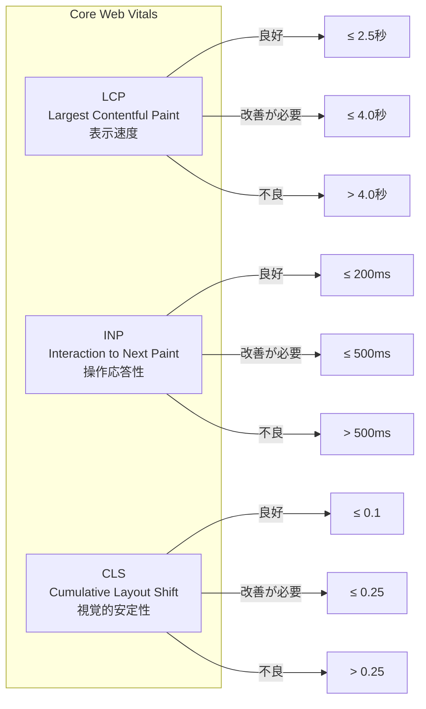
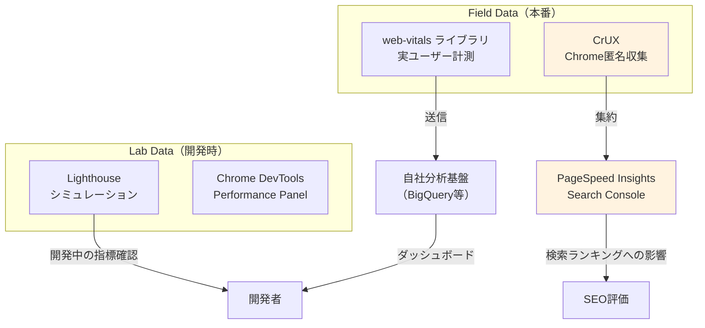

# Core Web Vitals

> **一言で言うと:** Googleが定義したユーザー体験の3つの数値指標（LCP・INP・CLS）で、「表示速度」「操作応答」「視覚的安定性」を定量的に測定・改善する枠組み。

## なぜ必要か

「サイトが遅い」「ボタンを押しても反応しない」「読んでいる途中でレイアウトがずれた」---これらはユーザー体験を損なう代表的な問題だが、従来は主観的な報告に頼るしかなかった。Core Web Vitals がなければ:

- **「速い」「遅い」の基準が曖昧** --- 開発者の高速回線・高スペックPCでは問題が再現せず、実ユーザーの体験と乖離する
- **改善の優先順位が立てられない** --- 「画像を圧縮すべきか」「JSを分割すべきか」の判断に客観的根拠がない
- **ビジネスインパクトが見えない** --- パフォーマンス改善がコンバージョン率やSEOにどう影響するか定量化できない
- **Googleの検索順位に影響** --- Core Web Vitals はランキングシグナルの一つ。基準を満たさないサイトは検索結果で不利になる

## どの問題を解決するか

### 3つの指標

Core Web Vitals は、ユーザー体験の3つの側面をそれぞれ1つの指標で測定する。



### 1. LCP（Largest Contentful Paint）--- 表示速度

ビューポート内で最も大きいコンテンツ要素（画像、テキストブロック等）が描画されるまでの時間。「ページのメインコンテンツがいつ見えるか」を測定する。

**よくあるLCP要素:**
- `` 要素
- `<video>` のポスター画像
- CSSの `background-image` で表示される画像
- テキストノードを含むブロック要素

**LCPが遅くなる4つの原因:**

| 原因 | 対策 |
|------|------|
| サーバーレスポンスが遅い（TTFB） | [[CDN]] の導入、サーバーサイドキャッシュ、データベース最適化 |
| レンダーブロッキングリソース | CSSのインライン化（Critical CSS）、JSの `defer`/`async` |
| リソースの読み込みが遅い | [[画像フォーマットと最適化|画像の最適化（WebP/AVIF）]]、`fetchpriority="high"`、プリロード |
| クライアントサイドレンダリング | SSR/SSGの採用、ストリーミングHTMLレスポンス |

### 2. INP（Interaction to Next Paint）--- 操作応答性

ユーザーの操作（クリック、タップ、キー入力）から次の画面更新（Paint）までの時間。ページのライフタイム全体で最も遅いインタラクションの遅延を測定する（外れ値を除く）。

旧指標のFID（First Input Delay）は「最初の」操作のみを測定していたため、ページ読み込み後の応答性を反映できなかった。INPはページ全体のインタラクティビティを評価する。

**INPが悪化する原因:**

| 原因 | 対策 |
|------|------|
| メインスレッドのブロック（Long Task） | 重い処理を `requestIdleCallback` やWeb Workerに移動 |
| 大きなDOMサイズ | 仮想スクロール、不要なDOM要素の削除 |
| 過剰な再レンダリング | React.memo、useMemo、状態の適切な分離 |
| 同期的なレイアウト計算（Layout Thrashing） | DOM読み取りと書き込みをバッチ化 |

### 3. CLS（Cumulative Layout Shift）--- 視覚的安定性

ページ読み込み中やインタラクション中に、要素が予期せず移動する量の累積スコア。「記事を読んでいたらボタンがずれて誤タップした」という体験を数値化する。

**CLSの計算:**
```
CLS = Impact Fraction × Distance Fraction
```
- Impact Fraction: 移動した要素が影響するビューポートの面積の割合
- Distance Fraction: 要素が移動した距離のビューポートに対する割合

**CLSが悪化する原因:**

| 原因 | 対策 |
|------|------|
| サイズ未指定の画像/iframe | `width` と `height` 属性を指定、CSSの `aspect-ratio` |
| 動的に挿入される広告/バナー | 挿入位置にプレースホルダーを確保 |
| Webフォントの読み込み（FOIT/FOUT） | `font-display: swap` + `<link rel="preload">` |
| 動的コンテンツの挿入 | ユーザー操作起点以外のDOM変更はレイアウトシフトを避ける設計に |

## 他の仕組みとどう関係するか

- **下位レイヤーとの関係:**
  - [[TCP-IP]] --- TCPの接続確立時間とスロースタートがTTFB（Time to First Byte）に影響し、LCPの起点を遅らせる
  - [[HTTP-HTTPS]] --- HTTP/2のストリーム多重化、HTTP/3のQUICプロトコルがリソース読み込みを高速化しLCPを改善する。`103 Early Hints` によるプリロードも有効
  - [[DNS]] --- DNS解決時間はTTFBに含まれる。`dns-prefetch` でサードパーティドメインの事前解決が可能
  - [[TLS-SSL]] --- TLSハンドシェイクのRTTもTTFBに含まれる。TLS 1.3の1-RTTハンドシェイクがLCP改善に寄与

- **同レイヤーとの関係:**
  - [[CDN]] --- CDNの導入はTTFBを短縮し、LCPに直接的な改善効果がある。画像CDN（Cloudflare Images, imgix等）による自動最適化はLCPの画像配信を改善する
  - [[モニタリング]] --- Core Web VitalsはRUM（Real User Monitoring）として、サーバーサイドメトリクスでは見えないユーザー体験を可視化する。Labデータ（Lighthouse）とFieldデータ（CrUX）の両方を監視する
  - [[ロードバランシング]] --- オリジンサーバーの応答速度（TTFB）はLBの設定とバックエンドの健全性に依存する

- **上位レイヤーとの関係:**
  - [[DOMツリーとノード]] --- DOMサイズの肥大はINPを悪化させる。大きなDOMはスタイル再計算やレイアウト処理のコストを増大させる
  - [[Layer6-セキュリティ/_index|セキュリティ]] --- CSP（Content Security Policy）がインラインスクリプトを禁止する場合、Critical CSSのインライン化と衝突する可能性がある。`nonce` や `hash` ベースの許可で対応

## 誤解されやすいポイント

### 1. 「Lighthouseで100点ならCore Web Vitalsは問題ない」

Lighthouseはラボ環境（Lab Data）でのシミュレーション結果であり、実ユーザーのデバイス・回線・地域の多様性を反映しない。Googleが検索ランキングに使うのはフィールドデータ（Field Data）---実ユーザーのChromeから匿名収集されるCrUX（Chrome User Experience Report）のデータ。ラボスコアが良くても、低スペックモバイル端末のユーザーが多ければフィールドデータは悪化する。

### 2. 「SPAはCore Web Vitalsに不利」

SPA（Single Page Application）のLCPが悪くなりやすいのは事実だが、本質的な問題はクライアントサイドレンダリング（CSR）にある。Next.js（SSR/SSG）やNuxt等のフレームワークを使えばSPAでも初回表示を高速化できる。また、SPAのソフトナビゲーション（ページ遷移）は従来Core Web Vitalsの計測対象外だったが、Chrome 139（2025年7月）からSoft Navigations APIのオリジントライアルが開始されており、将来的にはソフトナビゲーション単位での計測が標準化される可能性がある。現時点ではCrUXのランキングシグナルにはハードナビゲーション（初回読み込み）のみが使用される。

### 3. 「画像をWebPにすればLCPは解決する」

画像フォーマットの最適化は1つの手段に過ぎない。LCPが遅い場合、まずTTFBを確認すべき。サーバーレスポンスが2秒かかっていたら、画像を最適化しても2.5秒の目標は達成できない。LCP改善はTTFB→レンダーブロッキング除去→リソース最適化の順で取り組む。

### 4. 「CLS対策は画像にwidth/heightを指定するだけ」

画像の寸法指定は最も基本的な対策だが、動的コンテンツの挿入（API結果の表示、遅延読み込みのコンテンツ、同意バナー等）もCLSの原因になる。特にSPAでAPIレスポンス待ちの間にスケルトンUIを表示せず、結果が返ったときにレイアウトがずれるパターンは頻発する。

## 設計のベストプラクティス

### 推奨パターン

| パターン | 対象指標 | 説明 |
|---------|---------|------|
| **`fetchpriority="high"` でLCP画像を優先** | LCP | ブラウザにLCP画像を最優先で取得させる |
| **Critical CSSのインライン化** | LCP | ファーストビューに必要なCSSを `<style>` に直接埋め込み、レンダーブロッキングを排除 |
| **`loading="lazy"` をファーストビュー外に限定** | LCP | LCP要素には `lazy` を**つけない**。ファーストビュー外の画像のみ遅延読み込み |
| **`content-visibility: auto`** | INP | ビューポート外のレンダリングをスキップし、DOMツリーの処理コストを削減 |
| **スケルトンUI / プレースホルダー** | CLS | コンテンツ読み込み前にレイアウト領域を確保する |
| **`font-display: swap` + プリロード** | CLS, LCP | フォント読み込み中もテキストを表示し、フォントの読み込みを高優先度に |

### アンチパターン

| アンチパターン | なぜ問題か | 対策 |
|---|---|---|
| 全画像に `loading="lazy"` | LCP画像の読み込みが遅延する | ファーストビューの画像は `eager`（デフォルト）のまま |
| `<head>` に大量の同期 `<script>` | レンダーブロッキングでLCPが遅延 | `defer` または `async` を使い、不要なJSは遅延読み込み |
| CSSの `@import` チェーン | 直列読み込みになりLCPが遅延 | `<link>` タグで並列読み込みにする |
| アニメーションに `top`/`left` を使用 | レイアウト再計算が発生しINPが悪化 | `transform: translate()` を使い、合成（Compositing）レイヤーで処理 |

## AIによる実装のアンチパターン

| アンチパターン | なぜ問題か | 対策 |
|---|---|---|
| コンポーネントの全画像に `loading="lazy"` を一律適用 | LCP要素の遅延読み込みでスコア悪化 | ファーストビュー判定ロジックを入れるか、LCP候補にはpropsで制御する |
| useEffectでのデータフェッチ後にレイアウトサイズが変わるUIを生成 | CLSが発生する | データフェッチ前にスケルトンUIで領域を確保する |
| バンドルを分割せずに1つの巨大なJSファイルを生成 | メインスレッドが長時間ブロックされINPが悪化 | ルートベースのコード分割（dynamic import）を適用する |

## 具体例

### LCP画像の最適化（HTML）

```html
<!-- LCP要素: fetchpriorityで最優先、lazyはつけない、プリロードも併用 -->
<head>
  <link rel="preload" as="image" href="/hero.webp" fetchpriority="high">
</head>
<body>
  
  <!-- ファーストビュー外の画像は遅延読み込み -->
  
</body>
```

### Web Vitals の計測（JavaScript）

```javascript
// web-vitals ライブラリでフィールドデータを収集
import { onLCP, onINP, onCLS } from 'web-vitals';

function sendToAnalytics(metric) {
  // ビーコンAPIで分析サービスに送信（ページ離脱時も確実に送信）
  const body = JSON.stringify({
    name: metric.name,        // "LCP", "INP", "CLS"
    value: metric.value,      // 数値（ms or score）
    rating: metric.rating,    // "good", "needs-improvement", "poor"
    delta: metric.delta,      // 前回値からの差分
    id: metric.id,            // 一意のID
    navigationType: metric.navigationType, // "navigate", "reload", etc.
  });

  if (navigator.sendBeacon) {
    navigator.sendBeacon('/analytics', body);
  } else {
    fetch('/analytics', { body, method: 'POST', keepalive: true });
  }
}

onLCP(sendToAnalytics);
onINP(sendToAnalytics);
onCLS(sendToAnalytics);
```

### Long Taskの検知とINP改善

```javascript
// Long Task（50ms超のメインスレッドブロック）を検知
const observer = new PerformanceObserver((list) => {
  for (const entry of list.getEntries()) {
    console.warn('Long Task detected:', {
      duration: entry.duration,
      startTime: entry.startTime,
      name: entry.name,
    });
  }
});
observer.observe({ type: 'longtask', buffered: true });

// 重い処理をメインスレッドからオフロードする例
// Before: メインスレッドをブロックする
function processLargeData(data) {
  return data.map(item => heavyComputation(item)); // 200ms+ブロック
}

// After: requestIdleCallbackで分割処理
function processLargeDataAsync(data, callback) {
  const results = [];
  let index = 0;

  function processChunk(deadline) {
    while (index < data.length && deadline.timeRemaining() > 5) {
      results.push(heavyComputation(data[index]));
      index++;
    }
    if (index < data.length) {
      requestIdleCallback(processChunk);
    } else {
      callback(results);
    }
  }

  requestIdleCallback(processChunk);
}
```

### CLS対策: レスポンシブ画像とスケルトンUI（React）

```jsx
// CLS対策: aspect-ratioでプレースホルダー確保
function ResponsiveImage({ src, alt, width, height }) {
  return (
    
  );
}

// CLS対策: データ読み込み前にスケルトンでレイアウトを確保
function OrderList() {
  const { data, isLoading } = useFetch('/api/orders');

  if (isLoading) {
    return (
      <div style={{ minHeight: '400px' }}> {/* レイアウト領域を確保 */}
        {[...Array(5)].map((_, i) => (
          <div key={i} className="skeleton" style={{ height: '72px', marginBottom: '8px' }} />
        ))}
      </div>
    );
  }

  return (
    <div>
      {data.map(order => <OrderItem key={order.id} order={order} />)}
    </div>
  );
}
```

### Core Web Vitals の計測フロー全体像



## 参考リソース

- [web.dev - Web Vitals](https://web.dev/articles/vitals) --- Googleによる公式解説。各指標の詳細と改善ガイド
- [web-vitals (npm)](https://github.com/GoogleChrome/web-vitals) --- フィールドデータ収集ライブラリ
- [Chrome UX Report (CrUX)](https://developer.chrome.com/docs/crux/) --- 実ユーザーデータセットの公式ドキュメント
- [web.dev - Optimize LCP](https://web.dev/articles/optimize-lcp) / [Optimize INP](https://web.dev/articles/optimize-inp) / [Optimize CLS](https://web.dev/articles/optimize-cls) --- 指標ごとの具体的な最適化手法

## 学習メモ

（個人的な気づき・疑問・TODO）
