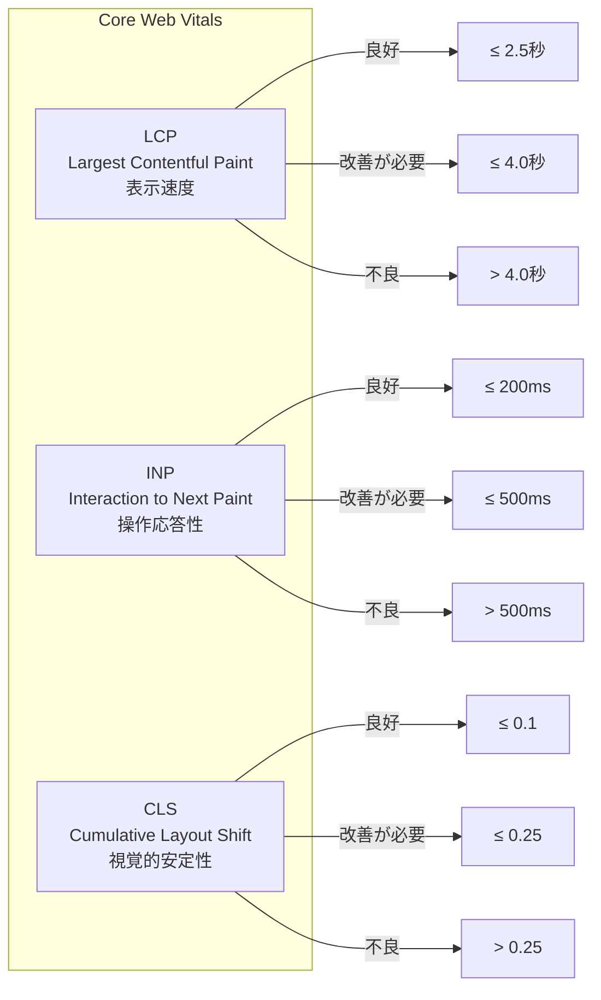
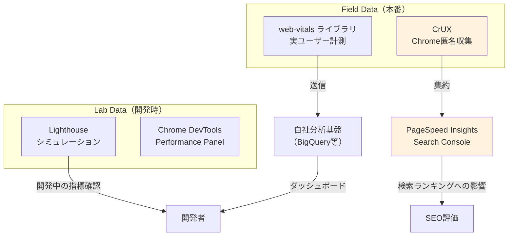

# Core Web Vitals

> **一言で言うと:** Googleが定義したユーザー体験の3つの数値指標（LCP・INP・CLS）で、「表示速度」「操作応答」「視覚的安定性」を定量的に測定・改善する枠組み。

## 3分で全体像

- **何を解決する技術か:** 「サイトが速い/遅い」という主観を、**実ユーザーのフィールドデータ**による客観指標に置き換え、改善の優先順位とビジネス影響（SEO・コンバージョン）を定量化する
- **代表的な使用シーン:** Web サイト全般のパフォーマンス計測・改善判断、PageSpeed Insights / CrUX / web-vitals ライブラリでの本番監視、SEO 施策の根拠付け、フロントエンド改修の効果測定、デプロイ前のラボ計測（Lighthouse）と本番フィールド計測の組み合わせ
- **これだけは覚える3つ:**
    1. **3指標は別の問題を見ている** — LCP（表示速度・主にバックエンド+リソース読み込み）、INP（操作応答性・主に JS の重さ）、CLS（視覚的安定性・主にレイアウト設計）。**1つの最適化で全部は改善しない**ので、どの指標が悪いかを見てから打ち手を選ぶ
    2. **ラボデータとフィールドデータは別物** — Lighthouse はシミュレーション（ラボ）、Google が検索順位に使うのは実ユーザーの **CrUX**（フィールド）。Lighthouse 100点でもフィールドが悪ければ評価されない。`web-vitals` で本番収集が必須
    3. **`loading="lazy"` を LCP 画像に付けてはいけない** — 全画像に一律 lazy を付ける AI 生成コードが頻発する。LCP 候補のヒーロー画像は `eager`（デフォルト）+ `fetchpriority="high"` で最優先取得すべき
- **AIに任せやすいか:** **一部任せられる** — `web-vitals` 計装、`` の `width` `height` 指定、`fetchpriority` 付与、Critical CSS 抽出など個別パターンは AI が高品質に書ける。一方で「**どの要素が LCP 候補か**」「**何が CLS の原因か**」は実機計測 + DevTools 分析が必須で、AI には判断不能。Lighthouse / DevTools の出力を読んで判断する人間側の能力が要る
- **詰まったらここを読む:** [[CDN]] / [[HTTP-HTTPS]] / [[DOMと仮想DOM]] / [[パフォーマンス最適化]]

## なぜ必要か

「サイトが遅い」「ボタンを押しても反応しない」「読んでいる途中でレイアウトがずれた」---これらはユーザー体験を損なう代表的な問題だが、従来は主観的な報告に頼るしかなかった。Core Web Vitals がなければ:

- **「速い」「遅い」の基準が曖昧** --- 開発者の高速回線・高スペックPCでは問題が再現せず、実ユーザーの体験と乖離する
- **改善の優先順位が立てられない** --- 「画像を圧縮すべきか」「JSを分割すべきか」の判断に客観的根拠がない
- **ビジネスインパクトが見えない** --- パフォーマンス改善がコンバージョン率やSEOにどう影響するか定量化できない
- **Googleの検索順位に影響** --- Core Web Vitals はランキングシグナルの一つ。基準を満たさないサイトは検索結果で不利になる

## どの問題を解決するか

### 3つの指標

Core Web Vitals は、ユーザー体験の3つの側面をそれぞれ1つの指標で測定する。


```mermaid
graph LR
    subgraph Core Web Vitals
        LCP["LCP<br/>Largest Contentful Paint<br/>表示速度"]
        INP["INP<br/>Interaction to Next Paint<br/>操作応答性"]
        CLS["CLS<br/>Cumulative Layout Shift<br/>視覚的安定性"]
    end

    LCP -->|良好| LCP_G["≤ 2.5秒"]
    LCP -->|改善が必要| LCP_N["≤ 4.0秒"]
    LCP -->|不良| LCP_P["> 4.0秒"]

    INP -->|良好| INP_G["≤ 200ms"]
    INP -->|改善が必要| INP_N["≤ 500ms"]
    INP -->|不良| INP_P["> 500ms"]

    CLS -->|良好| CLS_G["≤ 0.1"]
    CLS -->|改善が必要| CLS_N["≤ 0.25"]
    CLS -->|不良| CLS_P["> 0.25"]
```

### 1. LCP（Largest Contentful Paint）--- 表示速度

ビューポート内で最も大きいコンテンツ要素（画像、テキストブロック等）が描画されるまでの時間。「ページのメインコンテンツがいつ見えるか」を測定する。

**よくあるLCP要素:**
- `` 要素
- `<video>` のポスター画像
- CSSの `background-image` で表示される画像
- テキストノードを含むブロック要素

**LCPが遅くなる4つの原因:**

| 原因 | 対策 |
|------|------|
| サーバーレスポンスが遅い（TTFB） | [[CDN]] の導入、サーバーサイドキャッシュ、データベース最適化 |
| レンダーブロッキングリソース | CSSのインライン化（Critical CSS）、JSの `defer`/`async` |
| リソースの読み込みが遅い | [[画像フォーマットと最適化|画像の最適化（WebP/AVIF）]]、`fetchpriority="high"`、プリロード |
| クライアントサイドレンダリング | [[SSR-SSG-CSR|SSR/SSG]]の採用、ストリーミングHTMLレスポンス |

### 2. INP（Interaction to Next Paint）--- 操作応答性

ユーザーの操作（クリック、タップ、キー入力）から次の画面更新（Paint）までの時間。ページのライフタイム全体で最も遅いインタラクションの遅延を測定する（外れ値を除く）。

旧指標のFID（First Input Delay）は「最初の」操作のみを測定していたため、ページ読み込み後の応答性を反映できなかった。INPはページ全体のインタラクティビティを評価する。

**INPが悪化する原因:**

| 原因 | 対策 |
|------|------|
| メインスレッドのブロック（Long Task） | 重い処理を `requestIdleCallback` やWeb Workerに移動 |
| 大きなDOMサイズ | 仮想スクロール、不要なDOM要素の削除 |
| 過剰な再レンダリング | React.memo、useMemo、状態の適切な分離 |
| 同期的なレイアウト計算（Layout Thrashing） | DOM読み取りと書き込みをバッチ化 |

### 3. CLS（Cumulative Layout Shift）--- 視覚的安定性

ページ読み込み中やインタラクション中に、要素が予期せず移動する量の累積スコア。「記事を読んでいたらボタンがずれて誤タップした」という体験を数値化する。

**CLSの計算:**
```
CLS = Impact Fraction × Distance Fraction
```
- Impact Fraction: 移動した要素が影響するビューポートの面積の割合
- Distance Fraction: 要素が移動した距離のビューポートに対する割合

**CLSが悪化する原因:**

| 原因 | 対策 |
|------|------|
| サイズ未指定の画像/iframe | `width` と `height` 属性を指定、CSSの `aspect-ratio` |
| 動的に挿入される広告/バナー | 挿入位置にプレースホルダーを確保 |
| Webフォントの読み込み（FOIT/FOUT） | `font-display: swap` + `<link rel="preload">` |
| 動的コンテンツの挿入 | ユーザー操作起点以外のDOM変更はレイアウトシフトを避ける設計に |

## 他の仕組みとどう関係するか

- **下位レイヤーとの関係:**
  - [[TCP-IP]] --- TCPの接続確立時間とスロースタートがTTFB（Time to First Byte）に影響し、LCPの起点を遅らせる
  - [[HTTP-HTTPS]] --- HTTP/2のストリーム多重化、HTTP/3のQUICプロトコルがリソース読み込みを高速化しLCPを改善する。`103 Early Hints` によるプリロードも有効
  - [[DNS]] --- DNS解決時間はTTFBに含まれる。`dns-prefetch` でサードパーティドメインの事前解決が可能
  - [[TLS-SSL]] --- TLSハンドシェイクのRTTもTTFBに含まれる。TLS 1.3の1-RTTハンドシェイクがLCP改善に寄与

- **同レイヤーとの関係:**
  - [[CDN]] --- CDNの導入はTTFBを短縮し、LCPに直接的な改善効果がある。画像CDN（Cloudflare Images, imgix等）による自動最適化はLCPの画像配信を改善する
  - [[モニタリング]] --- Core Web VitalsはRUM（Real User Monitoring）として、サーバーサイドメトリクスでは見えないユーザー体験を可視化する。Labデータ（Lighthouse）とFieldデータ（CrUX）の両方を監視する
  - [[ロードバランシング]] --- オリジンサーバーの応答速度（TTFB）はLBの設定とバックエンドの健全性に依存する

- **上位レイヤーとの関係:**
  - [[DOMツリーとノード]] --- DOMサイズの肥大はINPを悪化させる。大きなDOMはスタイル再計算やレイアウト処理のコストを増大させる
  - [[Layer6-セキュリティ/_index|セキュリティ]] --- CSP（Content Security Policy）がインラインスクリプトを禁止する場合、Critical CSSのインライン化と衝突する可能性がある。`nonce` や `hash` ベースの許可で対応

## 誤解されやすいポイント

### 1. 「Lighthouseで100点ならCore Web Vitalsは問題ない」

Lighthouseはラボ環境（Lab Data）でのシミュレーション結果であり、実ユーザーのデバイス・回線・地域の多様性を反映しない。Googleが検索ランキングに使うのはフィールドデータ（Field Data）---実ユーザーのChromeから匿名収集されるCrUX（Chrome User Experience Report）のデータ。ラボスコアが良くても、低スペックモバイル端末のユーザーが多ければフィールドデータは悪化する。

### 2. 「SPAはCore Web Vitalsに不利」

SPA（Single Page Application）のLCPが悪くなりやすいのは事実だが、本質的な問題はクライアントサイドレンダリング（CSR）にある。Next.js（SSR/SSG）やNuxt等のフレームワークを使えばSPAでも初回表示を高速化できる。また、SPAのソフトナビゲーション（ページ遷移）は従来Core Web Vitalsの計測対象外だったが、ChromeではSoft Navigations APIの実験的サポートが段階的に進んでおり、将来的にはソフトナビゲーション単位での計測が標準化される可能性がある。現時点ではCrUXのランキングシグナルにはハードナビゲーション（初回読み込み）のみが使用される。

### 3. 「画像をWebPにすればLCPは解決する」

画像フォーマットの最適化は1つの手段に過ぎない。LCPが遅い場合、まずTTFBを確認すべき。サーバーレスポンスが2秒かかっていたら、画像を最適化しても2.5秒の目標は達成できない。LCP改善はTTFB→レンダーブロッキング除去→リソース最適化の順で取り組む。

### 4. 「CLS対策は画像にwidth/heightを指定するだけ」

画像の寸法指定は最も基本的な対策だが、動的コンテンツの挿入（API結果の表示、遅延読み込みのコンテンツ、同意バナー等）もCLSの原因になる。特にSPAでAPIレスポンス待ちの間にスケルトンUIを表示せず、結果が返ったときにレイアウトがずれるパターンは頻発する。

## 設計のベストプラクティス

### 推奨パターン

| パターン | 対象指標 | 説明 |
|---------|---------|------|
| **`fetchpriority="high"` でLCP画像を優先** | LCP | ブラウザにLCP画像を最優先で取得させる |
| **Critical CSSのインライン化** | LCP | ファーストビューに必要なCSSを `<style>` に直接埋め込み、レンダーブロッキングを排除 |
| **`loading="lazy"` をファーストビュー外に限定** | LCP | LCP要素には `lazy` を**つけない**。ファーストビュー外の画像のみ遅延読み込み |
| **`content-visibility: auto`** | INP | ビューポート外のレンダリングをスキップし、DOMツリーの処理コストを削減 |
| **スケルトンUI / プレースホルダー** | CLS | コンテンツ読み込み前にレイアウト領域を確保する |
| **`font-display: swap` + プリロード** | CLS, LCP | フォント読み込み中もテキストを表示し、フォントの読み込みを高優先度に |

### アンチパターン

| アンチパターン | なぜ問題か | 対策 |
|---|---|---|
| 全画像に `loading="lazy"` | LCP画像の読み込みが遅延する | ファーストビューの画像は `eager`（デフォルト）のまま |
| `<head>` に大量の同期 `<script>` | レンダーブロッキングでLCPが遅延 | `defer` または `async` を使い、不要なJSは遅延読み込み |
| CSSの `@import` チェーン | 直列読み込みになりLCPが遅延 | `<link>` タグで並列読み込みにする |
| アニメーションに `top`/`left` を使用 | レイアウト再計算が発生しINPが悪化 | `transform: translate()` を使い、合成（Compositing）レイヤーで処理 |

## AIエージェントとの協働

> このトピックでAIコーディングエージェント（Claude Code, Copilot, Cursor 等）と協働するための観点。
> Core Web Vitals の **計装コード**（`web-vitals` の `onLCP` / `onINP` / `onCLS`）や **個別の最適化パターン**（`width`/`height` 指定、`fetchpriority`、`font-display: swap`）は AI に高品質に書かせやすい。一方で「**どの要素が実際に LCP 候補か**」「**何が CLS の原因か**」は **DevTools / Lighthouse / CrUX を実際に読む人間判断**が必須。AI は「全画像に `loading="lazy"`」「全コンポーネントに `React.memo`」「`requestIdleCallback` で全部包む」のような一律最適化を提案しがちで、`/review-ai-code` で必ず検出する。

### AIに任せられる部分 / 人間が判断すべき部分

| タスク種類 | 任せ方（実装/レビュー） | 人間の関与 |
|---|---|---|
| `web-vitals` ライブラリの計装と分析基盤への送信実装 | AI 実装、`/review-ai-code` でレビュー | どの分析基盤に送るか（自社 BigQuery / Datadog / GA4）の判断は人間 |
| `` の `width`/`height` / `aspect-ratio` / `fetchpriority` の付与 | AI が網羅的に書く | LCP 候補画像の特定（DevTools の Performance パネル）は人間 |
| Critical CSS の抽出と `<style>` インライン化 | AI に critical / critters 等の導入を任せる | CSP との衝突（`nonce` / `hash` 採用）は人間判断 |
| CLS 対策のスケルトンUI / プレースホルダー実装 | AI が雛形を書く | 動的コンテンツ（広告・同意バナー・遅延 API）の挿入位置設計は人間判断 |
| Long Task 検出と `requestIdleCallback` / Web Worker への切り出し | AI が雛形 | どこをオフロードすべきかは DevTools Profiler の実測結果から人間が選ぶ |
| Lighthouse / PageSpeed Insights のスコア解釈 | AI に解説させる | スコア改善とコード変更コストのトレードオフは人間が判断 |

### AI生成コードのレビュー観点（このトピック固有）

AI生成のパフォーマンス最適化コードを受け取ったとき、最低限ここを見る。

1. **`loading="lazy"` の一律適用と LCP 画像への誤付与** — `` 全てに `loading="lazy"` を付けていないか。**ファーストビューの画像（特に LCP 候補のヒーロー画像）には付けてはいけない**。LCP 画像は `eager`（デフォルト）+ `fetchpriority="high"` + `<link rel="preload">` で最優先取得すべき。逆にファーストビュー外の画像にだけ `lazy` を限定する設計になっているか
2. **CLS を生む動的コンテンツの挿入** — `useEffect` でデータフェッチ後にレイアウトサイズが変わる UI を生成していないか。スケルトン UI / `min-height` / `aspect-ratio` で**読み込み前にレイアウト領域を確保**する設計になっているか。広告・同意バナー・遅延 API レスポンスなど動的挿入されるコンテンツに対して、挿入位置にプレースホルダーを置いているか
3. **INP を悪化させるメインスレッドブロック** — 同期的に重い計算（巨大配列の `.map`、JSON パース、正規表現）をメインスレッドで実行していないか。`requestIdleCallback` / `scheduler.yield()` / Web Worker への分割が適切に検討されているか。逆に**ボトルネックでもない場所に予防的に `requestIdleCallback` を撒く**過剰最適化になっていないかも確認

### 効くプロンプトの型

このトピックに関する実装をAIに依頼するとき、コンテキストとして渡すべき情報・制約・成功基準のテンプレ。

```
# 前提（プロジェクトの状況・既存のコード規約）
- フレームワーク: Next.js 15 (App Router) / Remix / Astro / 生 HTML など
- 計測基盤: web-vitals + 自社分析基盤 (BigQuery / Datadog) など
- 現状の Core Web Vitals: LCP=3.2s (poor) / INP=180ms (good) / CLS=0.18 (needs improvement)
- ターゲット: モバイル 4G 回線、低スペック端末を含む
- LCP 候補要素: トップページのヒーロー画像 (1200x600 / WebP)

# やってほしいこと
- LCP を 2.5s 以下に改善するための具体的なコード変更
- 効果測定のための前後比較プロトコル

# 守ってほしい制約（このトピック固有のもの）
- LCP 画像には `loading="lazy"` を付けない
- 全画像に `width` / `height` / `aspect-ratio` を必ず指定（CLS 対策）
- `fetchpriority="high"` は LCP 候補1枚のみ（複数枚に付けると効果が分散）
- Critical CSS のインライン化は CSP の `nonce` / `hash` と整合させる
- `requestIdleCallback` は実測でボトルネックが確認された箇所のみ
- 計測は本番デプロイ後の web-vitals フィールドデータで判定（Lighthouse スコアだけで判断しない）
- アクセシビリティ要件 (alt 属性、コントラスト比) を犠牲にしない

# 完了の判断基準
- web-vitals フィールドデータで p75 が「good」基準を満たす
- DevTools Performance パネルで Long Task が 50ms 以下に分割されている
- Lighthouse のラボスコア悪化がないこと（最低限の sanity check）
```

### AI実装のアンチパターン

LLM生成コードで頻出する過剰設計・誤用パターン。レビュー時の照合表として使う。

| アンチパターン | なぜ問題か | レビュー観点 / 対策 |
|---|---|---|
| 全画像に `loading="lazy"` を一律適用 | LCP 要素まで遅延読み込みされ、スコアが悪化する | ファーストビュー判定ロジックを入れるか、LCP 候補は明示的に `eager` |
| LCP 候補に `loading="lazy"` + `fetchpriority="high"` 併用 | `lazy` が優先され、`fetchpriority` の効果が打ち消される | LCP 候補は `eager` のまま `fetchpriority="high"` を付ける |
| `useEffect` でデータフェッチ後にレイアウトサイズが変わる UI を生成 | CLS が発生し、ユーザーが誤タップする | スケルトン UI / `min-height` / `aspect-ratio` で領域を確保 |
| `` の `width` / `height` 未指定 | アスペクト比が確定せず CLS が発生 | 全 `` に `width` / `height` または `aspect-ratio` を指定 |
| バンドルを分割せず 1 つの巨大な JS ファイルを生成 | メインスレッドが長時間ブロックされ INP が悪化 | ルートベースのコード分割（`dynamic import`）+ `React.lazy` |
| `requestIdleCallback` / Web Worker をボトルネック未確認のまま予防的に多用 | 制御フローの複雑化、デバッグ困難、効果は微小 | DevTools Profiler で Long Task を実測してから適用 |
| Web フォントの `font-display` 未指定 | FOIT で長時間テキストが見えず LCP 悪化、または FOUT で CLS 発生 | `font-display: swap` + `<link rel="preload" as="font" crossorigin>` |
| アニメーションに `top` / `left` を使用 | レイアウト再計算が発生し INP 悪化 | `transform: translate()` + `will-change` で合成レイヤー |
| Critical CSS のインライン化を CSP `unsafe-inline` で許可 | XSS 防御を犠牲にする | `nonce` / `hash` ベースの CSP に対応する |
| Lighthouse のスコアだけで完了判定 | ラボデータと実ユーザーのフィールドデータは乖離する | `web-vitals` で本番フィールドデータを必ず確認（CrUX / 自社分析） |
| `<head>` に大量の同期 `<script>` | レンダーブロッキングで LCP が遅延 | `defer` または `async`、可能なら body 末尾に |
| サードパーティスクリプト（広告・分析）を同期的に読み込む | メインスレッドを長時間ブロックして INP / LCP が悪化 | `async` + `Partytown` / Facade パターンで Web Worker に逃がす |

→ レイヤー横断のアンチパターン索引: [[_anti-patterns/_index|AIアンチパターン索引]] / [[_anti-patterns/レイヤー別/Layer5|Layer 5 パフォーマンス アンチパターン集]]

## 具体例

### LCP画像の最適化（HTML）

```html
<!-- LCP要素: fetchpriorityで最優先、lazyはつけない、プリロードも併用 -->
<head>
  <link rel="preload" as="image" href="/hero.webp" fetchpriority="high">
</head>
<body>
  
  <!-- ファーストビュー外の画像は遅延読み込み -->
  
</body>
```

### Web Vitals の計測（JavaScript）

```javascript
// web-vitals ライブラリでフィールドデータを収集
import { onLCP, onINP, onCLS } from 'web-vitals';

function sendToAnalytics(metric) {
  // ビーコンAPIで分析サービスに送信（ページ離脱時も確実に送信）
  const body = JSON.stringify({
    name: metric.name,        // "LCP", "INP", "CLS"
    value: metric.value,      // 数値（ms or score）
    rating: metric.rating,    // "good", "needs-improvement", "poor"
    delta: metric.delta,      // 前回値からの差分
    id: metric.id,            // 一意のID
    navigationType: metric.navigationType, // "navigate", "reload", etc.
  });

  if (navigator.sendBeacon) {
    navigator.sendBeacon('/analytics', body);
  } else {
    fetch('/analytics', { body, method: 'POST', keepalive: true });
  }
}

onLCP(sendToAnalytics);
onINP(sendToAnalytics);
onCLS(sendToAnalytics);
```

### Long Taskの検知とINP改善

```javascript
// Long Task（50ms超のメインスレッドブロック）を検知
const observer = new PerformanceObserver((list) => {
  for (const entry of list.getEntries()) {
    console.warn('Long Task detected:', {
      duration: entry.duration,
      startTime: entry.startTime,
      name: entry.name,
    });
  }
});
observer.observe({ type: 'longtask', buffered: true });

// 重い処理をメインスレッドからオフロードする例
// Before: メインスレッドをブロックする
function processLargeData(data) {
  return data.map(item => heavyComputation(item)); // 200ms+ブロック
}

// After: requestIdleCallbackで分割処理
function processLargeDataAsync(data, callback) {
  const results = [];
  let index = 0;

  function processChunk(deadline) {
    while (index < data.length && deadline.timeRemaining() > 5) {
      results.push(heavyComputation(data[index]));
      index++;
    }
    if (index < data.length) {
      requestIdleCallback(processChunk);
    } else {
      callback(results);
    }
  }

  requestIdleCallback(processChunk);
}
```

### CLS対策: レスポンシブ画像とスケルトンUI（React）

```jsx
// CLS対策: aspect-ratioでプレースホルダー確保
function ResponsiveImage({ src, alt, width, height }) {
  return (
    
  );
}

// CLS対策: データ読み込み前にスケルトンでレイアウトを確保
function OrderList() {
  const { data, isLoading } = useFetch('/api/orders');

  if (isLoading) {
    return (
      <div style={{ minHeight: '400px' }}> {/* レイアウト領域を確保 */}
        {[...Array(5)].map((_, i) => (
          <div key={i} className="skeleton" style={{ height: '72px', marginBottom: '8px' }} />
        ))}
      </div>
    );
  }

  return (
    <div>
      {data.map(order => <OrderItem key={order.id} order={order} />)}
    </div>
  );
}
```

### Core Web Vitals の計測フロー全体像


```mermaid
graph TD
    subgraph "Lab Data（開発時）"
        LH["Lighthouse<br/>シミュレーション"]
        DevTools["Chrome DevTools<br/>Performance Panel"]
    end

    subgraph "Field Data（本番）"
        WV["web-vitals ライブラリ<br/>実ユーザー計測"]
        CrUX["CrUX<br/>Chrome匿名収集"]
    end

    WV -->|送信| Analytics["自社分析基盤<br/>（BigQuery等）"]
    CrUX -->|集約| PSI["PageSpeed Insights<br/>Search Console"]

    LH -->|開発中の指標確認| Dev["開発者"]
    Analytics -->|ダッシュボード| Dev
    PSI -->|検索ランキングへの影響| SEO["SEO評価"]

    style CrUX fill:#fff3e0
    style PSI fill:#fff3e0
```

## 参考リソース

- [web.dev - Web Vitals](https://web.dev/articles/vitals) --- Googleによる公式解説。各指標の詳細と改善ガイド
- [web-vitals (npm)](https://github.com/GoogleChrome/web-vitals) --- フィールドデータ収集ライブラリ
- [Chrome UX Report (CrUX)](https://developer.chrome.com/docs/crux/) --- 実ユーザーデータセットの公式ドキュメント
- [web.dev - Optimize LCP](https://web.dev/articles/optimize-lcp) / [Optimize INP](https://web.dev/articles/optimize-inp) / [Optimize CLS](https://web.dev/articles/optimize-cls) --- 指標ごとの具体的な最適化手法

## 理解度セルフチェック

> 答えられなければ本文に戻る。答えはこのファイル内に必ずある。

1. **LCP / INP / CLS の3指標がそれぞれ「何の問題」を測っているかを30秒で説明せよ。** 1つの最適化で全部解決しない理由を、それぞれが見ているレイヤー（ネットワーク・JS・レイアウト）の違いに触れて答えること。
2. **Yes/No: 「Lighthouse でスコア95点を取れたので、Core Web Vitals は対策完了」と判断してよいか?** ラボデータとフィールドデータ（CrUX）の違い、Google が検索ランキングシグナルに使うのはどちらかを答えよ。
3. **AI生成コードレビュー設問:** AI が「LCP を改善するため」として以下のコードを生成した。本文の観点で **問題点を最低3つ** 指摘せよ。

```jsx
function ProductPage({ product, reviews }) {
  // ヒーロー画像（LCP候補）
  return (
    <article>
      
      <h1>{product.name}</h1>

      {/* レビュー一覧（API取得後に表示） */}
      <ReviewList reviews={reviews} />

      {/* 関連商品（下部に挿入される広告枠） */}
      <div id="ad-slot" />
    </article>
  );
}

function ReviewList({ reviews }) {
  if (!reviews) return null;  // ローディング中は何も表示しない
  return (
    <ul>
      {reviews.map(r => (
        <li key={r.id}>
          
          <p>{r.content}</p>
        </li>
      ))}
    </ul>
  );
}

// 広告スクリプトを <head> に同期読み込み
// <script src="https://ads.example.com/sdk.js"></script>
```

> [!note]- 解答の指針
>
> > [!info] 用語ミニ辞典
> > - **LCP (Largest Contentful Paint):** ビューポート内で最も大きいコンテンツ要素（画像・テキストブロック）が描画されるまでの時間。「メインコンテンツがいつ見えるか」を測る。良好は 2.5 秒以下
> > - **INP (Interaction to Next Paint):** ユーザー操作（クリック・タップ・キー入力）から次の画面更新までの時間のうち、ページのライフタイムで最も遅いもの（外れ値除く）。旧 FID は最初の操作のみ測っていた問題を解決。良好は 200ms 以下
> > - **CLS (Cumulative Layout Shift):** ページ表示中に要素が予期せず移動する量の累積スコア。良好は 0.1 以下。`Impact Fraction × Distance Fraction` で計算
> > - **CrUX (Chrome User Experience Report):** 実ユーザーの Chrome から匿名で集約されたフィールドデータセット。Google が検索ランキングに使うのはこれ。PageSpeed Insights / Search Console から閲覧可能
> > - **ラボデータ vs フィールドデータ:** ラボはシミュレーション環境（Lighthouse / DevTools）の計測、フィールドは実ユーザーの計測。デバイス・回線・地域が多様なフィールドの方が乖離しやすい
> > - **`fetchpriority`:** ブラウザにリソース取得の優先度を指示する HTML 属性（`high` / `low` / `auto`）。LCP 候補画像に `high` を付けると最優先取得される
> > - **`loading="lazy"`:** ビューポートに近づくまで `` の取得を遅延させる属性。ファーストビュー外の画像にだけ使うのが原則
> > - **Critical CSS:** ファーストビューに必要な最小限の CSS。`<style>` で HTML にインライン化することでレンダーブロッキングを排除し LCP を改善する
> > - **`font-display: swap`:** Web フォント読み込み中もシステムフォントでテキストを即座に表示する設定。FOIT（テキスト不可視）回避と引き換えに FOUT（フォント切替時の見た目変化）が発生
> > - **Long Task:** メインスレッドを 50ms 以上ブロックするタスク。`PerformanceObserver` で `type: 'longtask'` を観測できる。INP 悪化の主因
> > - **Web Worker / `requestIdleCallback`:** 重い処理をメインスレッド外（Worker）または手の空いた時間（Idle）に逃がす仕組み。ただし制御フローが複雑化するため、計測でボトルネックを確認してから適用する
> > - **CSP (Content Security Policy):** XSS 防御の HTTP ヘッダー。`unsafe-inline` を使わず `nonce` / `hash` でインラインスクリプト/スタイルを許可するのが推奨
>
> 1. **3指標は別レイヤーの問題を見ている**ので、解決策も別の場所に効く:
>     - **LCP は主にバックエンド + ネットワーク + リソース読み込み**の問題。TTFB 短縮（CDN、サーバーサイドキャッシュ）、レンダーブロッキング除去（Critical CSS、JS の `defer`）、リソース最適化（WebP/AVIF、`fetchpriority`）が効く
>     - **INP は主に JavaScript の重さ**の問題。Long Task 分割、不要な再レンダリング削減（`React.memo` / `useMemo`、ただし計測してから）、重い処理を Web Worker / `requestIdleCallback` に逃がすのが効く
>     - **CLS は主にレイアウト設計**の問題。`width`/`height` 指定、`aspect-ratio`、スケルトン UI、`font-display: swap`、動的挿入要素のプレースホルダー確保が効く。
>     - 例えば「画像を WebP に変えた」だけでは LCP は改善しても INP・CLS は変わらない。「`React.memo` を全部に付けた」だけでは INP は改善しても LCP・CLS は変わらない。**まず web-vitals でどの指標が悪いか**を見て、対応する打ち手を選ぶ
> 2. **No、判断してはいけない**。Lighthouse は **ラボデータ**（シミュレーション）であり、固定の回線・デバイス条件での1点計測。実ユーザーは多様なデバイス・回線・地域を持ち、結果は乖離する。**Google が検索ランキングシグナルに使うのは CrUX のフィールドデータ**（実ユーザーの Chrome から匿名収集）。ラボで 95点でも、低スペックモバイルが多い実ユーザー層ではフィールドデータが poor になりうる。**`web-vitals` ライブラリで本番計測 → 自社分析基盤か PageSpeed Insights で CrUX を確認**して初めて対策完了と判断できる。逆に Lighthouse が低くてもフィールドが good なら緊急性は低い。**ラボは開発時の指標、フィールドは本番の指標**と使い分ける
> 3. AI生成コードの問題点（最低限以下を指摘できれば本文を理解している）:
>     - **LCP 候補のヒーロー画像に `loading="lazy"` + `fetchpriority="high"` 併用** — `lazy` が優先されるため `fetchpriority="high"` の効果が打ち消され、LCP がむしろ悪化する。LCP 候補は `eager`（属性削除でデフォルト）+ `fetchpriority="high"` + `<link rel="preload" as="image" fetchpriority="high">` が正しい
>     - **ヒーロー画像の `width` / `height` 未指定** — アスペクト比が画像読み込みまで確定せず、CLS が発生する。`width="1200" height="600"` または `aspect-ratio: 2 / 1` を必ず指定する。`alt` 属性も欠落（アクセシビリティ違反）
>     - **`ReviewList` のローディング中 `null` 返し → CLS 発生** — `if (!reviews) return null` で何も描画しない状態から、API レスポンス到着時に一気にリスト挿入されるため、`<h1>` 以下のコンテンツが下に押し下げられて CLS スコアが悪化する。`min-height` 確保の skeleton か、固定高さのプレースホルダーを表示する
>     - **`<div id="ad-slot" />` の動的広告挿入** — 広告 SDK が後から DOM に挿入する場合、上下のコンテンツがずれて CLS 発生。広告枠には `min-height` を CSS で予約しておき、未配信時もレイアウトが動かないようにする
>     - **レビューリスト内 `` の `width` / `height` / `loading` / `alt` 未指定** — 各レビューのアバター画像も CLS 要因。`width="32" height="32" loading="lazy" alt={r.author}` を付ける（ファーストビュー外なので `lazy` は OK）
>     - **広告 SDK を `<head>` に同期 `<script>` 読み込み** — メインスレッドを長時間ブロックして INP / LCP が悪化。`async` または `defer` を付け、可能なら **Partytown / Facade パターン** で Web Worker に逃がす。同期サードパーティスクリプトは Core Web Vitals 悪化の最頻出原因
>     - **`<head>` に同期 `<script>` 配置（コメント部分）** — レンダーブロッキングそのもの。広告 SDK は Lazy 読み込みかインタラクション後の遅延読み込みに変える
>     - **計測未実装** — そもそもこのコードに `web-vitals` の計装がないため、フィールドでの効果が確認できない。`onLCP(sendToAnalytics)` `onINP(sendToAnalytics)` `onCLS(sendToAnalytics)` の追加を促す

## 学習メモ

（個人的な気づき・疑問・TODO）
