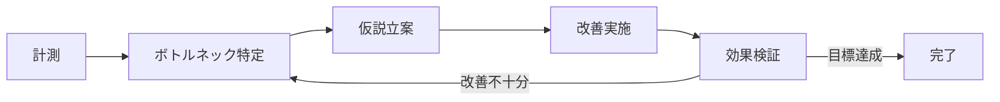

# パフォーマンス最適化

> **一言で言うと:** 「推測するな、計測せよ」を原則に、ボトルネックを特定し、限られたリソースで最大のユーザー体験を実現する技術体系。

## なぜ必要か

機能的に正しく動くコードでも、レスポンスに3秒かかればユーザーの53%が離脱する（Google調査）。パフォーマンス最適化がなければ:

- **ユーザー体験の劣化** — ページ表示が遅い、操作がもたつく、処理が終わらない
- **インフラコストの増大** — 非効率な処理がCPU・メモリ・帯域を浪費し、スケールアウトで対処するとコストが線形に増加する
- **スケーラビリティの喪失** — ユーザー数が10倍になったとき、O(n²) のアルゴリズムは100倍遅くなる。小規模では見えない問題が成長とともに顕在化する
- **ビジネス機会の損失** — Core Web Vitals が検索順位に影響し、コンバージョン率にも直結する

## どの問題を解決するか

### 1. どこが遅いのか分からない問題

最適化の第一歩は「ボトルネックの特定」である。プロファイリング（Profiling）により、CPU時間・メモリ使用量・I/O待ちの内訳を可視化する。実際に「ページが遅い」と報告されたときの体系的な切り分け手順は [[バックエンドパフォーマンス切り分けガイド]] にまとめている。



### 2. アルゴリズムレベルの非効率

最も効果が大きいのは[[計算量-BigO|計算量]]の改善。O(n²) → O(n log n) への変更はハードウェア増強では達成できない本質的な改善。

| 改善カテゴリ | 例 | 効果の大きさ |
|---|---|---|
| アルゴリズム改善 | ネストしたループ → ハッシュマップ | 極大（O(n²) → O(n)） |
| データ構造の選択 | 配列の線形探索 → Set の使用 | 大 |
| I/O の削減 | N+1 クエリの解消 | 大 |
| キャッシュ導入 | 計算結果の再利用 | 中〜大 |
| コードレベル微最適化 | ループ内の不要な処理除去 | 小〜中 |

### 3. レイテンシの積み重ね

Webアプリケーションでは、1つのリクエストが複数のサービス・DB・外部APIを経由する。各ステップで数十ミリ秒のレイテンシが積み重なり、体感速度を大きく劣化させる。

主な対策:
- **並列化** — 独立した処理を同時実行する（`Promise.all` など）
- **キャッシュ** — 同じ計算・クエリの繰り返しを避ける（Redis、CDN、ブラウザキャッシュ）
- **[[ページネーション]]** — 大量データを一度に返さず、固定サイズの塊に分割して取得コストを O(1) に抑える
- **遅延読み込み（Lazy Loading）** — 今すぐ不要なリソースの取得を後回しにする
- **[[非同期処理とメッセージキュー|非同期化]]** — レスポンスに不要な重い処理をバックグラウンドに逃がす

### 4. フロントエンドの描画パフォーマンス

ブラウザのレンダリングパイプライン（Parse → Style → Layout → Paint → Composite）を理解し、不要な再計算を避ける。[[CoreWebVitals]] の3指標（LCP・INP・CLS）が定量的な基準となる。

## 他の仕組みとどう関係するか

- **下位レイヤーとの関係:** [[計算量-BigO]] はアルゴリズム改善の判断基準そのもの。[[データ構造とアルゴリズム]] の選択がパフォーマンスに直結する。[[メモリ管理]] の理解がメモリリーク検出やGCチューニングの前提になる。[[プロセスとスレッド]] の知識がCPUバウンド/I/Oバウンドの判別に必要。
- **同レイヤーとの関係:** [[CDN]] はネットワークレイテンシの最適化手段。[[ロードバランシング]] はサーバーリソースの分散。[[非同期処理とメッセージキュー]] は即時不要な処理の切り離し。[[モニタリング]] は「計測」フェーズを支える基盤。[[CoreWebVitals]] はフロントエンド最適化の定量指標。
- **上位レイヤーとの関係:** Layer 3 の [[Resources/Study/Layer3-データ永続化/インデックス|インデックス]] はDBクエリ最適化の主要手段。Layer 4 の [[ページネーション]] はデータ量に起因するパフォーマンス問題の解決策。Layer 7 の設計判断（マイクロサービス分割、キャッシュ戦略）がシステム全体のパフォーマンス特性を決定する。

## 誤解されやすいポイント

1. **「速いコードを書けば最適化」という誤解** — パフォーマンス最適化は「計測 → ボトルネック特定 → 改善 → 検証」のサイクルであり、事前に「速そうなコード」を書くことではない。計測なしの最適化は、間違った場所を改善して複雑性だけ増やすリスクがある。Donald Knuth の格言: *"Premature optimization is the root of all evil"*（早すぎる最適化は諸悪の根源）。

2. **「キャッシュを入れれば速くなる」という誤解** — キャッシュは強力だが、キャッシュ無効化（Cache Invalidation）は最も難しい問題の一つ。古いデータを返す、キャッシュヒット率が低い、キャッシュの暖機に時間がかかるなど、導入には慎重な設計が必要。さらに、根本原因（N+1クエリ等）をキャッシュで隠蔽すると、キャッシュが切れた瞬間にシステムが崩壊する（Cache Stampede）。

3. **「マイクロ最適化が効く」という誤解** — `for` ループを `while` に変える、文字列結合を `StringBuilder` にするといったマイクロ最適化は、ほとんどの場合ボトルネックではない。実際のWebアプリケーションでは、ネットワークI/O、DBクエリ、ディスクI/Oがボトルネックの大半を占める。

4. **「パフォーマンスとスケーラビリティは同じ」という誤解** — パフォーマンスは「1リクエストがどれだけ速いか」、スケーラビリティは「負荷増加にどれだけ耐えられるか」。メモリ内キャッシュでレスポンスを速くしても、それがサーバー間で共有できなければスケールアウト時に破綻する。

## 設計のベストプラクティス

### 推奨パターン

- **計測駆動で最適化する** — 推測ではなく、プロファイラやAPM（Application Performance Monitoring）のデータに基づいて改善箇所を決定する
- **パフォーマンスバジェットを設定する** — 「LCP は 2.5秒以内」「API レスポンスは p95 で 200ms以内」のように定量的な目標を先に決める
- **ホットパスを集中的に最適化する** — 全コードを等しく最適化する必要はない。リクエスト頻度が高い処理、ユーザー体験に直結する処理を優先する
- **段階的に改善する** — 一度に全てを最適化せず、最もインパクトの大きい1箇所から始める。改善効果を計測してから次に進む

### アンチパターン

- **計測なしの最適化** — 直感で「ここが遅そう」と判断して複雑なキャッシュ機構を導入し、実際のボトルネックは別の場所だった
- **可読性を犠牲にした微最適化** — ナノ秒単位の改善のためにコードを難読化し、保守コストが増大する
- **根本原因の隠蔽** — N+1クエリをキャッシュで覆い隠す、遅いAPIの前にキューを置いてタイムアウトを回避するなど

## AIによる実装のアンチパターン

| アンチパターン | なぜ問題か | 対策 |
|---|---|---|
| 全メソッドにメモ化を追加 | ヒット率の低いキャッシュはメモリを浪費するだけ | 計測でホットパスを特定してから導入する |
| 過剰な非同期化 | 単純な同期処理まで `async/await` にすると、オーバーヘッドが増える | I/Oバウンドな処理のみ非同期にする |
| 不要なインデックス提案 | 全カラムにインデックスを張ると書き込み性能が劣化する | クエリの `EXPLAIN` 結果を見て判断する |
| 早すぎるマイクロサービス分割 | ネットワークホップが増えてレイテンシが悪化する | モノリスで計測し、本当にボトルネックな部分のみ分離する |

## 具体例

### Node.js: N+1 クエリの検出と解消

N+1問題はアプリケーション層で最も頻出するパフォーマンスボトルネックの一つ。DB側では[[Resources/Study/Layer3-データ永続化/インデックス|インデックス]]の適切な設計が前提となるが、クエリの発行回数自体を減らすことがまず重要。

```javascript
// アンチパターン: N+1 クエリ（ユーザーごとに1クエリ発行）
async function getUsersWithOrders_slow(userIds) {
  const users = await db.query('SELECT * FROM users WHERE id IN (?)', [userIds]);
  for (const user of users) {
    // ループ内でクエリ → N回のDBアクセス
    user.orders = await db.query('SELECT * FROM orders WHERE user_id = ?', [user.id]);
  }
  return users;
}

// 改善: JOINまたはIN句で1回のクエリにまとめる
async function getUsersWithOrders_fast(userIds) {
  const users = await db.query('SELECT * FROM users WHERE id IN (?)', [userIds]);
  const orders = await db.query('SELECT * FROM orders WHERE user_id IN (?)', [userIds]);

  const ordersByUser = new Map();
  for (const order of orders) {
    if (!ordersByUser.has(order.user_id)) ordersByUser.set(order.user_id, []);
    ordersByUser.get(order.user_id).push(order);
  }

  for (const user of users) {
    user.orders = ordersByUser.get(user.id) || [];
  }
  return users;
}
```

### Python: プロファイリングによるボトルネック特定

```python
import cProfile
import pstats

def find_duplicates_slow(items: list[int]) -> list[int]:
    """O(n²): 全ペアを比較"""
    duplicates = []
    for i, item in enumerate(items):
        for j in range(i + 1, len(items)):
            if item == items[j] and item not in duplicates:
                duplicates.append(item)
    return duplicates

def find_duplicates_fast(items: list[int]) -> list[int]:
    """O(n): setで出現回数を追跡"""
    seen = set()
    duplicates = set()
    for item in items:
        if item in seen:
            duplicates.add(item)
        seen.add(item)
    return list(duplicates)

# プロファイリング実行
if __name__ == "__main__":
    import random
    data = [random.randint(0, 1000) for _ in range(10000)]

    print("=== slow version ===")
    cProfile.run("find_duplicates_slow(data)", sort="cumulative")

    print("=== fast version ===")
    cProfile.run("find_duplicates_fast(data)", sort="cumulative")
```

### ブラウザ: パフォーマンス計測 API

```javascript
// Navigation Timing API でページロード時間を計測
const timing = performance.getEntriesByType('navigation')[0];
console.log({
  dns: timing.domainLookupEnd - timing.domainLookupStart,
  tcp: timing.connectEnd - timing.connectStart,
  ttfb: timing.responseStart - timing.requestStart,
  domReady: timing.domContentLoadedEventEnd - timing.fetchStart,
  fullLoad: timing.loadEventEnd - timing.fetchStart,
});

// 任意の処理の計測
performance.mark('process-start');
// ... 計測したい処理 ...
performance.mark('process-end');
performance.measure('processing-time', 'process-start', 'process-end');

const measure = performance.getEntriesByName('processing-time')[0];
console.log(`処理時間: ${measure.duration.toFixed(2)}ms`);
```

## 参考リソース

- [web.dev - Performance](https://web.dev/performance/) — Google による Web パフォーマンス最適化ガイド
- Martin Kleppmann『データ指向アプリケーションデザイン』— 分散システムのパフォーマンスとスケーラビリティの体系的理解
- Brendan Gregg『Systems Performance』— システムパフォーマンス分析の決定版（CPU、メモリ、I/O、ネットワーク）
- [Chrome DevTools - Performance](https://developer.chrome.com/docs/devtools/performance/) — ブラウザ側のプロファイリング手法

## 学習メモ

（個人的な気づき・疑問・TODO）
