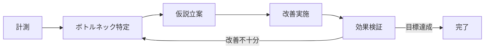

# パフォーマンス最適化

> **一言で言うと:** 「推測するな、計測せよ」を原則に、ボトルネックを特定し、限られたリソースで最大のユーザー体験を実現する技術体系。

## 3分で全体像

- **何を解決する技術か:** 「遅い」「重い」「スケールしない」の原因を計測駆動で特定し、アルゴリズム / I/O / キャッシュ / 並列化のどのレバーで改善するかを判断する技術体系。マイクロ最適化ではなく、**計算量・I/O コスト・ボトルネック**という大きな物理に着目する
- **代表的な使用シーン:** Web API のレスポンス改善（p99 を SLO 内に）、画面表示の高速化（[[CoreWebVitals]]）、バッチ処理時間短縮、コスト削減のためのリソース効率化、スパイク耐性向上、ユーザー数 10 倍時の崩壊予防
- **これだけは覚える3つ:**
    1. **計測 → ボトルネック特定 → 仮説 → 改善 → 検証 のサイクル** — 推測で「ここが遅そう」と複雑な仕組みを入れず、プロファイラ / APM / `EXPLAIN` で**実測してから**手を動かす。Donald Knuth: *"Premature optimization is the root of all evil"*
    2. **効果の桁が違うレバーから順に試す** — アルゴリズム改善（O(n²) → O(n log n)）→ I/O 削減（N+1 解消）→ キャッシュ → コードレベル微最適化、の順に効果が大きい。**ループ内の `+1` を引き算で速くする」のような微最適化は最後の手段**で、可読性を犠牲にする価値があるかは要検討
    3. **キャッシュは最後の手段、根本原因を隠蔽しない** — N+1 をキャッシュで覆い隠すと、キャッシュが切れた瞬間に Cache Stampede でシステム崩壊。キャッシュは**速い処理をさらに速くする道具**であり、**遅い処理を隠す道具ではない**
- **AIに任せやすいか:** **一部任せられる** — N+1 検出と JOIN 化、`Promise.all` での並列化、`useMemo` / `React.memo` の適用、プロファイリング雛形は AI が高品質に書ける。一方で **「どこが本当のボトルネックか」「キャッシュ TTL をいくつにするか」「並列化で副作用が安全か」**は実測 + ビジネス判断が必要。AI は「全関数にメモ化」「全部 async 化」「全カラムにインデックス」のような**予防的最適化**を量産しがちで `/review-ai-code` 必須
- **詰まったらここを読む:** [[CoreWebVitals]] / [[モニタリング]] / [[インデックス]] / [[キャッシュ戦略]] / [[計算量-BigO]]

## なぜ必要か

機能的に正しく動くコードでも、レスポンスに3秒かかればユーザーの53%が離脱する（Google調査）。パフォーマンス最適化がなければ:

- **ユーザー体験の劣化** — ページ表示が遅い、操作がもたつく、処理が終わらない
- **インフラコストの増大** — 非効率な処理がCPU・メモリ・帯域を浪費し、スケールアウトで対処するとコストが線形に増加する
- **スケーラビリティの喪失** — ユーザー数が10倍になったとき、O(n²) のアルゴリズムは100倍遅くなる。小規模では見えない問題が成長とともに顕在化する
- **ビジネス機会の損失** — Core Web Vitals が検索順位に影響し、コンバージョン率にも直結する

## どの問題を解決するか

### 1. どこが遅いのか分からない問題

最適化の第一歩は「ボトルネックの特定」である。プロファイリング（Profiling）により、CPU時間・メモリ使用量・I/O待ちの内訳を可視化する。実際に「ページが遅い」と報告されたときの体系的な切り分け手順は [[バックエンドパフォーマンス切り分けガイド]] にまとめている。


```mermaid
flowchart LR
    A[計測] --> B[ボトルネック特定]
    B --> C[仮説立案]
    C --> D[改善実施]
    D --> E[効果検証]
    E -->|改善不十分| B
    E -->|目標達成| F[完了]
```

### 2. アルゴリズムレベルの非効率

最も効果が大きいのは[[計算量-BigO|計算量]]の改善。O(n²) → O(n log n) への変更はハードウェア増強では達成できない本質的な改善。

| 改善カテゴリ | 例 | 効果の大きさ |
|---|---|---|
| アルゴリズム改善 | ネストしたループ → ハッシュマップ | 極大（O(n²) → O(n)） |
| データ構造の選択 | 配列の線形探索 → Set の使用 | 大 |
| I/O の削減 | N+1 クエリの解消 | 大 |
| キャッシュ導入 | 計算結果の再利用 | 中〜大 |
| コードレベル微最適化 | ループ内の不要な処理除去 | 小〜中 |

### 3. レイテンシの積み重ね

Webアプリケーションでは、1つのリクエストが複数のサービス・DB・外部APIを経由する。各ステップで数十ミリ秒のレイテンシが積み重なり、体感速度を大きく劣化させる。

主な対策:
- **並列化** — 独立した処理を同時実行する（`Promise.all` など）
- **キャッシュ** — 同じ計算・クエリの繰り返しを避ける（Redis、CDN、ブラウザキャッシュ）
- **[[ページネーション]]** — 大量データを一度に返さず、固定サイズの塊に分割して取得コストを全件 O(n) からページサイズに対する O(ページサイズ) に抑える
- **遅延読み込み（Lazy Loading）** — 今すぐ不要なリソースの取得を後回しにする
- **[[非同期処理とメッセージキュー|非同期化]]** — レスポンスに不要な重い処理をバックグラウンドに逃がす

### 4. フロントエンドの描画パフォーマンス

ブラウザのレンダリングパイプライン（Parse → Style → Layout → Paint → Composite）を理解し、不要な再計算を避ける。[[CoreWebVitals]] の3指標（LCP・INP・CLS）が定量的な基準となる。

## 他の仕組みとどう関係するか

- **下位レイヤーとの関係:**
  - [[計算量-BigO]] --- アルゴリズム改善の判断基準そのもの。O(n²) → O(n log n) への変更はハードウェア増強では達成できない本質的な改善
  - [[データ構造とアルゴリズム]] --- 配列の線形探索 → ハッシュマップ / Set への置換、二分探索木 / B-Tree の選択がパフォーマンスに直結する
  - [[メモリ管理]] --- メモリリーク検出やGCチューニングの前提知識。GC 停止時間が p99 レイテンシに直接影響する
  - [[プロセスとスレッド]] --- CPUバウンド / I/Oバウンドの判別に必要。CPU バウンドはマルチプロセス、I/O バウンドは非同期 I/O が効く

- **同レイヤーとの関係:**
  - [[CDN]] --- ネットワークレイテンシ削減と TTFB 短縮の主要手段
  - [[ロードバランシング]] --- サーバーリソースの分散と水平スケール、ステートレス設計の前提
  - [[非同期処理とメッセージキュー]] --- 即時不要な処理の切り離しでレスポンスタイム短縮と負荷平準化
  - [[モニタリング]] --- 「計測駆動」サイクルの計測フェーズを支える基盤。p99 / RED / USE での監視が前提
  - [[CoreWebVitals]] --- フロントエンドパフォーマンスの定量指標（LCP / INP / CLS）

- **上位レイヤーとの関係:**
  - [[Resources/Study/Layer3-データ永続化/インデックス|インデックス]] --- DB クエリ最適化の主要手段。`EXPLAIN ANALYZE` で必要なものを見極める
  - [[ページネーション]] --- データ量に起因するパフォーマンス問題の解決策。N+1 と組み合わせて頻出するボトルネック
  - [[Layer7-設計アーキテクチャ/_index|設計・アーキテクチャ]] --- マイクロサービス分割・キャッシュ戦略・データレイアウト等の設計判断がシステム全体のパフォーマンス特性を決定する

## 誤解されやすいポイント

1. **「速いコードを書けば最適化」という誤解** — パフォーマンス最適化は「計測 → ボトルネック特定 → 改善 → 検証」のサイクルであり、事前に「速そうなコード」を書くことではない。計測なしの最適化は、間違った場所を改善して複雑性だけ増やすリスクがある。Donald Knuth の格言: *"Premature optimization is the root of all evil"*（早すぎる最適化は諸悪の根源）。

2. **「キャッシュを入れれば速くなる」という誤解** — キャッシュは強力だが、キャッシュ無効化（Cache Invalidation）は最も難しい問題の一つ。古いデータを返す、キャッシュヒット率が低い、キャッシュの暖機に時間がかかるなど、導入には慎重な設計が必要。さらに、根本原因（N+1クエリ等）をキャッシュで隠蔽すると、キャッシュが切れた瞬間にシステムが崩壊する（Cache Stampede）。

3. **「マイクロ最適化が効く」という誤解** — `for` ループを `while` に変える、文字列結合を `StringBuilder` にするといったマイクロ最適化は、ほとんどの場合ボトルネックではない。実際のWebアプリケーションでは、ネットワークI/O、DBクエリ、ディスクI/Oがボトルネックの大半を占める。

4. **「パフォーマンスとスケーラビリティは同じ」という誤解** — パフォーマンスは「1リクエストがどれだけ速いか」、スケーラビリティは「負荷増加にどれだけ耐えられるか」。メモリ内キャッシュでレスポンスを速くしても、それがサーバー間で共有できなければスケールアウト時に破綻する。

## 設計のベストプラクティス

### 推奨パターン

- **計測駆動で最適化する** — 推測ではなく、プロファイラやAPM（Application Performance Monitoring）のデータに基づいて改善箇所を決定する
- **パフォーマンスバジェットを設定する** — 「LCP は 2.5秒以内」「API レスポンスは p95 で 200ms以内」のように定量的な目標を先に決める
- **ホットパスを集中的に最適化する** — 全コードを等しく最適化する必要はない。リクエスト頻度が高い処理、ユーザー体験に直結する処理を優先する
- **段階的に改善する** — 一度に全てを最適化せず、最もインパクトの大きい1箇所から始める。改善効果を計測してから次に進む

### アンチパターン

- **計測なしの最適化** — 直感で「ここが遅そう」と判断して複雑なキャッシュ機構を導入し、実際のボトルネックは別の場所だった
- **可読性を犠牲にした微最適化** — ナノ秒単位の改善のためにコードを難読化し、保守コストが増大する
- **根本原因の隠蔽** — N+1クエリをキャッシュで覆い隠す、遅いAPIの前にキューを置いてタイムアウトを回避するなど

## AIエージェントとの協働

> このトピックでAIコーディングエージェント（Claude Code, Copilot, Cursor 等）と協働するための観点。
> N+1 検出と JOIN 化 / `Promise.all` 並列化 / `useMemo` / `React.memo` 適用 / プロファイラ呼び出し雛形は AI が高品質に書ける。一方で **「全関数にメモ化」「全部 async 化」「全カラムにインデックス」「マイクロサービス分割」「全部キャッシュ」**のような**予防的・横並び最適化**を AI が量産しがち。これは可読性・保守性を犠牲にし、実測上の効果は微小なことが多い。`/review-ai-code` で「計測根拠」を必ず確認する。

### AIに任せられる部分 / 人間が判断すべき部分

| タスク種類 | 任せ方（実装/レビュー） | 人間の関与 |
|---|---|---|
| N+1 クエリの検出と JOIN / `IN` 句への書き換え | AI 実装、`/review-ai-code` でレビュー | ORM の特性（DataLoader / EagerLoad / IncludeAll）の選択は人間判断 |
| `Promise.all` / `asyncio.gather` での並列化 | AI に独立リクエストの並列化を任せる | レート制限・外部 API の同時呼び出し制約・副作用の独立性は人間判断 |
| `useMemo` / `React.memo` / `useCallback` の適用 | AI に提案させる | 「本当にボトルネックか」を DevTools Profiler で人間が確認してから採用 |
| インデックス追加提案 | AI に `EXPLAIN ANALYZE` の結果に基づく提案 | 書き込み性能とのトレードオフは人間判断（[[インデックス]] 参照） |
| プロファイリング（`cProfile` / `perf` / Chrome DevTools Performance） | AI に計装雛形 | 結果の解釈とどこから直すかの優先順位は人間 |
| キャッシュ導入（Redis / メモリ / CDN） | AI に TTL / キー設計 | キャッシュ無効化戦略・古いデータの許容範囲はビジネス要件で人間判断 |
| パフォーマンスバジェット設定（LCP < 2.5s / API p95 < 200ms） | AI が業界標準を提示 | 自社サービスの SLA / ユーザー期待・ビジネス影響は人間判断 |

### AI生成コードのレビュー観点（このトピック固有）

AI生成のパフォーマンス改善コードを受け取ったとき、最低限ここを見る。

1. **計測根拠なしの「予防的最適化」** — 「重そう」「将来遅くなりそう」という推測で `useMemo` / `React.memo` / メモ化キャッシュ / インデックス / 並列化を予防的に大量適用していないか。**プロファイリング / APM / `EXPLAIN ANALYZE` / DevTools Profiler の実測結果**が根拠として示されているか。逆に**「ここがホットパスです、p99 を見るとここで時間を食っています」**のような数値裏付けがある提案は採用してよい
2. **キャッシュで根本問題を隠蔽していないか** — N+1 クエリや O(n²) アルゴリズムの上に Redis キャッシュを被せて速度を稼いでいないか。**キャッシュが切れた瞬間に同時アクセスが集中する Cache Stampede** で、サービスが瞬時に崩壊する典型パターン。根本原因（N+1 / 計算量）を直してからキャッシュを検討する。`stale-while-revalidate` / `singleflight` / ロックでの再生成抑制も併用
3. **並列化の副作用と外部制約の見落とし** — `Promise.all([api1(), api2(), api3()])` のような並列化で、(a) 外部 API のレート制限を超過していないか、(b) 副作用の順序依存を破壊していないか（先に DB 書き込んだ後に外部通知の順序が必要なケースで並列化すると不整合）、(c) 例外時のロールバック / 部分成功の扱いは整合的か。並列化は I/O バウンドな**独立した**処理にのみ有効

### 効くプロンプトの型

このトピックに関する実装をAIに依頼するとき、コンテキストとして渡すべき情報・制約・成功基準のテンプレ。

```
# 前提（プロジェクトの状況・既存のコード規約）
- 計測基盤: APM (Datadog / New Relic) / Prometheus / Chrome DevTools Performance
- 現状の SLO: API p95 < 300ms, LCP < 2.5s
- 計測結果（実数値必須）: 例 — /api/orders p99 = 2.1s, EXPLAIN で N+1 検出 (各リクエスト 50 SELECT)
- DB: PostgreSQL 16 + 接続プール (PgBouncer)
- ORM: Prisma 6 / TypeORM など
- キャッシュ層: Redis (まだ導入していない / 既存)

# やってほしいこと
- 実測結果に基づく改善提案 (推測ではなく数値根拠)
- 効果の大きい順に並べ、見積もり改善幅を提示
- 改善前後で計測する手順

# 守ってほしい制約（このトピック固有のもの）
- 推測で `useMemo` / `React.memo` / Redis キャッシュを追加しない
- 「効果が小さい微最適化」は採用しない (可読性とのトレードオフ)
- インデックス追加は EXPLAIN ANALYZE 結果に基づく
- 並列化は副作用が独立、レート制限・順序依存がないことを確認
- 根本原因を直さずにキャッシュで隠さない
- キャッシュ TTL とビジネス要件 (古いデータの許容範囲) を整合
- Cache Stampede 対策 (stale-while-revalidate / singleflight)

# 完了の判断基準
- 改善前後の実測値が並べて報告される (p50 / p95 / p99)
- ボトルネックの順に着手し、最大効果のものから完了
- リグレッションテストとロードテストで副作用なし
```

### AI実装のアンチパターン

LLM生成コードで頻出する過剰設計・誤用パターン。レビュー時の照合表として使う。

| アンチパターン | なぜ問題か | レビュー観点 / 対策 |
|---|---|---|
| 全関数にメモ化 / 全コンポーネントに `React.memo` | 浅い比較コストが加算、ヒット率の低いキャッシュはメモリを浪費 | DevTools Profiler / プロファイラで計測してから |
| 単純な同期処理まで `async/await` にする | イベントループ切替・Promise オブジェクト生成のオーバーヘッド | I/O バウンドな処理のみ非同期化 |
| 全カラムにインデックス追加 | 書き込み性能が劣化、INSERT/UPDATE で全インデックス更新 | `EXPLAIN ANALYZE` で必要なものに限定（[[インデックス]] 参照） |
| 早すぎるマイクロサービス分割 | ネットワークホップでレイテンシ悪化、分散トランザクションの複雑化 | モノリスで計測し、本当にボトルネックな部分のみ分離 |
| キャッシュで N+1 / O(n²) を隠蔽 | Cache Stampede 時に瞬時崩壊 | 根本原因を直してからキャッシュを検討 |
| 並列化で外部 API レート制限超過 | 429 Too Many Requests でエラー連鎖 | 並列度を制限（`p-limit` / `Semaphore`）、レート制限を考慮 |
| 副作用の順序依存を破壊する並列化 | データ不整合（DB 書き込み前に通知が飛ぶ等） | 順序依存はシーケンシャル、独立処理のみ並列 |
| `for ... of` を `for (let i=0; ...)` に書き換える微最適化 | 数十ナノ秒の改善、可読性低下 | ボトルネック確認後にのみ |
| 文字列結合を `StringBuilder` 系に置換 | モダンな JS / Python では JIT が最適化済み | 計測根拠なしには採用しない |
| Redis キャッシュ TTL = 0 / `EXPIRE` 抜け | キャッシュが永久残留、メモリ枯渇・古いデータ配信 | 必ず TTL 設定、`stale-while-revalidate` 等で更新戦略 |
| キャッシュキーにユーザーごとの一意値（user_id 必須）を入れていない | ユーザー A のデータが B に表示される事故 | ユーザー / テナントスコープのキー設計 |
| ロードテストなしの本番投入 | スパイク時に未知のボトルネックで崩壊 | k6 / Locust / Vegeta でステージング負荷試験 |
| パフォーマンスバジェットなし | 「速い / 遅い」の合意基準が無く、リグレッションが累積 | LCP < 2.5s / API p95 < 200ms 等の数値目標 |

→ レイヤー横断のアンチパターン索引: [[_anti-patterns/_index|AIアンチパターン索引]] / [[_anti-patterns/レイヤー別/Layer5|Layer 5 パフォーマンス アンチパターン集]]

## 具体例

### Node.js: N+1 クエリの検出と解消

N+1問題はアプリケーション層で最も頻出するパフォーマンスボトルネックの一つ。DB側では[[Resources/Study/Layer3-データ永続化/インデックス|インデックス]]の適切な設計が前提となるが、クエリの発行回数自体を減らすことがまず重要。

```javascript
// アンチパターン: N+1 クエリ（ユーザーごとに1クエリ発行）
async function getUsersWithOrders_slow(userIds) {
  const users = await db.query('SELECT * FROM users WHERE id IN (?)', [userIds]);
  for (const user of users) {
    // ループ内でクエリ → N回のDBアクセス
    user.orders = await db.query('SELECT * FROM orders WHERE user_id = ?', [user.id]);
  }
  return users;
}

// 改善: JOINまたはIN句で1回のクエリにまとめる
async function getUsersWithOrders_fast(userIds) {
  const users = await db.query('SELECT * FROM users WHERE id IN (?)', [userIds]);
  const orders = await db.query('SELECT * FROM orders WHERE user_id IN (?)', [userIds]);

  const ordersByUser = new Map();
  for (const order of orders) {
    if (!ordersByUser.has(order.user_id)) ordersByUser.set(order.user_id, []);
    ordersByUser.get(order.user_id).push(order);
  }

  for (const user of users) {
    user.orders = ordersByUser.get(user.id) || [];
  }
  return users;
}
```

### Python: プロファイリングによるボトルネック特定

```python
import cProfile
import pstats

def find_duplicates_slow(items: list[int]) -> list[int]:
    """O(n²): 全ペアを比較"""
    duplicates = []
    for i, item in enumerate(items):
        for j in range(i + 1, len(items)):
            if item == items[j] and item not in duplicates:
                duplicates.append(item)
    return duplicates

def find_duplicates_fast(items: list[int]) -> list[int]:
    """O(n): setで出現回数を追跡"""
    seen = set()
    duplicates = set()
    for item in items:
        if item in seen:
            duplicates.add(item)
        seen.add(item)
    return list(duplicates)

# プロファイリング実行
if __name__ == "__main__":
    import random
    data = [random.randint(0, 1000) for _ in range(10000)]

    print("=== slow version ===")
    cProfile.run("find_duplicates_slow(data)", sort="cumulative")

    print("=== fast version ===")
    cProfile.run("find_duplicates_fast(data)", sort="cumulative")
```

### ブラウザ: パフォーマンス計測 API

```javascript
// Navigation Timing API でページロード時間を計測
const timing = performance.getEntriesByType('navigation')[0];
console.log({
  dns: timing.domainLookupEnd - timing.domainLookupStart,
  tcp: timing.connectEnd - timing.connectStart,
  ttfb: timing.responseStart - timing.requestStart,
  domReady: timing.domContentLoadedEventEnd - timing.fetchStart,
  fullLoad: timing.loadEventEnd - timing.fetchStart,
});

// 任意の処理の計測
performance.mark('process-start');
// ... 計測したい処理 ...
performance.mark('process-end');
performance.measure('processing-time', 'process-start', 'process-end');

const measure = performance.getEntriesByName('processing-time')[0];
console.log(`処理時間: ${measure.duration.toFixed(2)}ms`);
```

## 参考リソース

- [web.dev - Performance](https://web.dev/performance/) — Google による Web パフォーマンス最適化ガイド
- Martin Kleppmann『データ指向アプリケーションデザイン』— 分散システムのパフォーマンスとスケーラビリティの体系的理解
- Brendan Gregg『Systems Performance』— システムパフォーマンス分析の決定版（CPU、メモリ、I/O、ネットワーク）
- [Chrome DevTools - Performance](https://developer.chrome.com/docs/devtools/performance/) — ブラウザ側のプロファイリング手法

## 理解度セルフチェック

> 答えられなければ本文に戻る。答えはこのファイル内に必ずある。

1. **「計測なしの最適化」が諸悪の根源と言われる理由を、Donald Knuth の警句と「効果の桁」の観点から30秒で説明せよ。**
2. **「キャッシュを入れれば速くなる」が誤りである理由を、Cache Stampede と根本原因の隠蔽の2側面から答えよ。**
3. **AI生成コードレビュー設問:** AI が「`/api/orders` のパフォーマンス改善」として以下のコードを生成した。本文の観点で **問題点を最低3つ** 指摘せよ。

```javascript
// 改善後のコード（推測ベースで書かれた最適化）
const NodeCache = require('node-cache');
const cache = new NodeCache();  // TTL未設定（デフォルトは無期限）

// React.memo を全コンポーネントに適用
const OrderItem = React.memo(({ order }) => <li>{order.name}</li>);
const OrderList = React.memo(({ orders }) => (
  <ul>{orders.map(o => <OrderItem key={o.id} order={o} />)}</ul>
));

// API ハンドラ
app.get('/api/orders', async (req, res) => {
  // 全リクエストをキャッシュ（user_id を含めない）
  const cacheKey = 'all-orders';
  const cached = cache.get(cacheKey);
  if (cached) return res.json(cached);

  // ループ内で並列取得（外部API・DB・S3）
  const orders = await db.query('SELECT * FROM orders WHERE user_id = ?', [req.user.id]);
  const enriched = await Promise.all(orders.map(async (order) => {
    // 各注文に対して 4 つの外部呼び出しを並列実行
    const [customer, items, payment, shipping] = await Promise.all([
      fetch(`https://customer-api/${order.customer_id}`).then(r => r.json()),
      db.query('SELECT * FROM order_items WHERE order_id = ?', [order.id]),
      fetch(`https://payment-api/${order.id}`).then(r => r.json()),
      fetch(`https://shipping-api/${order.id}`).then(r => r.json()),
    ]);
    return { ...order, customer, items, payment, shipping };
  }));

  cache.set(cacheKey, enriched);  // TTL なしで永続キャッシュ
  res.json(enriched);
});

// migration: 検索を速くするため全カラムにインデックス追加
// CREATE INDEX idx_orders_id ON orders (id);
// CREATE INDEX idx_orders_user_id ON orders (user_id);
// CREATE INDEX idx_orders_status ON orders (status);
// CREATE INDEX idx_orders_created_at ON orders (created_at);
// CREATE INDEX idx_orders_customer_id ON orders (customer_id);
// CREATE INDEX idx_orders_total ON orders (total);
// CREATE INDEX idx_orders_currency ON orders (currency);
// CREATE INDEX idx_orders_notes ON orders (notes);
```

> [!note]- 解答の指針
>
> > [!info] 用語ミニ辞典
> > - **計測駆動最適化:** プロファイリング / APM / `EXPLAIN` などの実測データに基づいてボトルネックを特定し、効果の大きい順に改善するアプローチ。推測駆動の対義語
> > - **N+1 クエリ:** 1 件のリクエストで N+1 個の DB クエリを発行する典型的アンチパターン（[[ページネーション]] / [[インデックス]] / [[データアクセス層]] と関連）
> > - **Cache Stampede / Thundering Herd:** キャッシュ期限切れの瞬間に多数のリクエストが同時にキャッシュミスし、全員がオリジン（DB / API）に殺到して負荷スパイクを起こす現象。`stale-while-revalidate` / `singleflight`（同一キーは1リクエストだけが再生成）/ ロックで対策
> > - **Premature Optimization:** 効果も計測根拠もないのに早すぎるタイミングで複雑な最適化を導入すること。Donald Knuth: *"Premature optimization is the root of all evil"*
> > - **マイクロ最適化:** ナノ秒単位のループ・文字列処理の改善。ほとんどの Web アプリではボトルネックではなく、可読性とのトレードオフが見合わないことが多い
> > - **`React.memo` / `useMemo` / `useCallback`:** React の参照同一性を保つメモ化フック / HOC。浅い比較コストが加算されるため**ボトルネック計測後に適用**するのが原則（[[コンポーネント設計]] / [[DOMと仮想DOM]] 参照）
> > - **`Promise.all` / 並列化:** 独立した非同期処理を同時実行して総時間を最小化する手法。**副作用が独立、レート制限・順序依存がない場合のみ**有効
> > - **パフォーマンスバジェット:** 「LCP < 2.5s」「API p95 < 200ms」など定量的な性能目標。CI / CD で自動チェックして劣化を防ぐ
> > - **APM (Application Performance Monitoring):** アプリのトレース・メトリクス・エラーを統合監視するツール。Datadog / New Relic / AppDynamics など
> > - **`EXPLAIN` / `EXPLAIN ANALYZE`:** SQL の実行計画を見るコマンド。インデックス使用状況、結合順序、コストを確認できる（[[インデックス]] 参照）
> > - **キャッシュキー設計:** ユーザー / テナントスコープを必ず含める、変動要素を含める、サイズ上限を考慮するなど。設計ミスは情報漏洩・キャッシュヒット率低下の原因
>
> 1. Donald Knuth の警句 *"Premature optimization is the root of all evil"* は、**「計測しないまま最適化すると、間違った場所を直して複雑性だけ増やすリスクがある」**ことを指す。最適化には**効果の桁が違うレバー**が存在する: アルゴリズム改善（O(n²) → O(n log n) で桁違いの改善）→ I/O 削減（N+1 解消で 50ms → 5ms）→ キャッシュ → コードレベル微最適化（数十 ns）。**桁の小さい微最適化（ループの書き換えや文字列結合の最適化）は、本物のボトルネックがネットワーク I/O や DB クエリにある状況では効果がほぼゼロ**。にもかかわらず可読性を犠牲にするコストが先行する。さらに、**実測なしには「ここが遅い」という前提自体が間違っている**ことが多く、推測で改善した結果「予想していた場所はホットパスではなく、本当のボトルネックは別の場所だった」という事故が起きる。プロファイラ・APM・`EXPLAIN ANALYZE` で実測してから、効果の大きいレバーから順に適用するのが鉄則
> 2. **(a) Cache Stampede による瞬時崩壊**: キャッシュ期限切れの瞬間、多数のリクエストが同時にキャッシュミスし、全員がオリジン（DB / 外部 API）に殺到する。普段はキャッシュヒットで秒間 10000 リクエストを捌けても、TTL 切れの 1 秒間に 10000 リクエストすべてが DB に流れ、DB が瞬時にダウンする。`stale-while-revalidate`（古いデータを返しつつバックグラウンドで再生成）、`singleflight`（同一キーへの並行リクエストは1つの再生成だけ実行し他は結果を待つ）、ロックでの排他で対策する。**(b) 根本原因の隠蔽**: N+1 クエリや O(n²) アルゴリズムをキャッシュで覆い隠すと、見かけの速度は出るが、内部的には「重い処理を保管しているだけ」の状態。キャッシュが切れた瞬間、Redis がダウンした瞬間、新しい値（カーディナリティの高いキー）が来た瞬間に**根本原因が露出してシステムが崩壊**する。さらに、根本原因が直されないため、関連箇所の改修・新機能追加で同じ問題が広がる。**キャッシュは「速い処理をさらに速くする道具」であり、「遅い処理を隠す道具ではない」**。先に N+1 / 計算量を直し、それでも足りない場合にキャッシュを検討する
> 3. AI生成コードの問題点（最低限以下を指摘できれば本文を理解している）:
>     - **致命的: キャッシュキーに `user_id` を含めない `'all-orders'`** — ユーザー A のデータが B に返る情報漏洩。`cacheKey = \`orders:${req.user.id}\`` のようにユーザースコープ必須
>     - **TTL 未設定（無期限キャッシュ）** — 古いデータが永久に返り続け、メモリも枯渇。`cache.set(key, value, 60)` のように TTL を必ず設定し、`stale-while-revalidate` / 明示的な無効化戦略を併用
>     - **N+1 を並列化で「見せかけ高速化」しているが根本原因は未解消** — `orders.map` のループ内で 4 種類の外部呼び出しを並列化しているが、注文 100 件なら **400 並列リクエスト**が外部 API・DB に飛ぶ。レート制限超過、外部 API の DDoS 化、DB 接続プール枯渇のリスク。`p-limit` で並列度を制御、または **DataLoader パターン**で全注文の `customer_id` を集めて1回でバッチ取得する
>     - **`React.memo` を全コンポーネントに予防的適用** — `OrderList` の親が再レンダリングするたびに `orders` 配列の浅い比較が発生（参照が変われば毎回 false）。シンプルな `<li>{order.name}</li>` のメモ化は比較コストの方が大きく、効果なし。DevTools Profiler で実測してからホットスポットのみ
>     - **全カラムインデックス追加** — `notes`（テキストカラム）への B-Tree インデックスは検索効率が悪く、`currency`（カーディナリティ低）はインデックスの効果が薄い。INSERT/UPDATE のたびに 8 個のインデックスを更新するコストが大きく、書き込み性能が劣化。`EXPLAIN ANALYZE` で実際に使われるクエリパターンを確認してから、必要な最小限のインデックス（`(user_id, created_at)` 複合インデックスなど）に絞る
>     - **計測根拠の欠落** — 「`React.memo` を入れた」「キャッシュを入れた」「インデックスを増やした」が、改善前後の実測値（p50 / p95 / p99 / RPS）の比較がない。本当に効果があったか不明、リグレッション可能性
>     - **`Promise.all` 内のエラーハンドリングなし** — 4 つの並列呼び出しのうち 1 つでも失敗すると全体が reject される。`Promise.allSettled` で部分成功を許容するか、必須 / オプショナルで分類
>     - **DB クエリで `SELECT *`** — 不要カラムまで取得して帯域・メモリを消費。必要カラムだけ列挙
>     - **エラーハンドリング不在** — `db.query` / `fetch` の失敗時の処理がなく、500 エラー直行 + ログなし（[[モニタリング]] / [[エラーハンドリング]] 観点）

## 学習メモ

（個人的な気づき・疑問・TODO）
