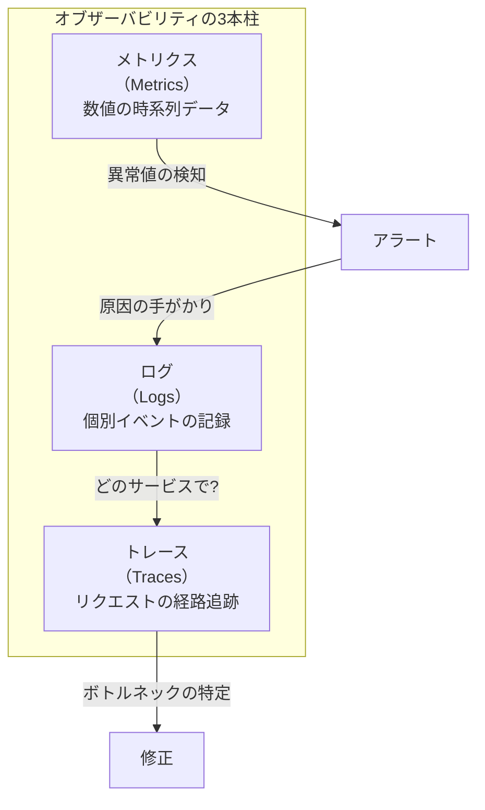
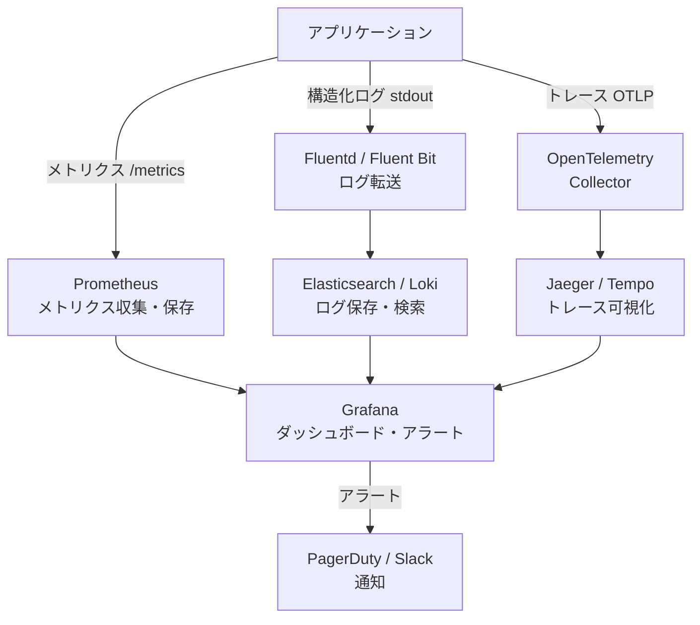

# モニタリング

> **一言で言うと:** メトリクス・ログ・トレースの3本柱でシステムの内部状態を可視化し、「見えないものは直せない」問題を解決する仕組み。

## なぜ必要か

本番環境のシステムは、開発者のローカルマシンとは根本的に異なる。何百ものリクエストが同時に流れ、外部サービスの応答が遅延し、ディスクが静かに埋まっていく。モニタリングがなければ:

- **障害の検知が遅れる** --- ユーザーからの報告で初めて障害に気づく（MTTD: Mean Time To Detect が長い）
- **原因の特定ができない** --- 「遅い」「エラーが出る」としか分からず、どのコンポーネントが原因か切り分けられない
- **容量計画が立てられない** --- CPU・メモリ・ディスクがいつ限界に達するか予測できず、突然のサービス停止を招く
- **変更の影響が見えない** --- デプロイ後に性能が劣化しても気づけない。問題が蓄積してから発覚する

## どの問題を解決するか

### オブザーバビリティ（Observability）の3本柱

モニタリングの根幹は、3つの異なるシグナルを組み合わせてシステムの状態を理解すること。



### 1. メトリクス（Metrics）--- 「何が起きているか」の数値

時系列の数値データ。「今、毎秒何リクエスト処理しているか」「エラー率は何%か」「レスポンスタイムのp99は何msか」を継続的に記録する。

**4つのゴールデンシグナル**（Google SRE本より）:

| シグナル | 意味 | 例 |
|---------|------|-----|
| **レイテンシ（Latency）** | リクエストの処理にかかる時間 | p50=50ms, p99=200ms |
| **トラフィック（Traffic）** | システムに対する需要の量 | 1000 req/sec |
| **エラー（Errors）** | 失敗したリクエストの割合 | 5xx rate = 0.1% |
| **飽和度（Saturation）** | リソースの利用率 | CPU 70%, メモリ 85% |

### 2. ログ（Logs）--- 「具体的に何が起きたか」の記録

個別イベントの詳細な記録。メトリクスが「エラー率3%」と教えてくれたら、ログで「どのエンドポイントで」「どんなエラーが」「どのユーザーに」起きたかを調べる。

構造化ログ（Structured Logging）が鍵。テキストの羅列ではなく、検索・集計可能なJSON形式で出力する。

### 3. トレース（Traces）--- 「リクエストがどこを通ったか」の経路追跡

分散トレーシング（Distributed Tracing）は、1つのリクエストが複数のサービスを横断する経路を追跡する。マイクロサービス環境では、APIゲートウェイ→認証サービス→注文サービス→決済サービス→通知サービスと複数のホップがあり、どこで遅延しているかをトレースなしに特定するのは困難。

```mermaid
gantt
    title 分散トレースの例（1リクエストの内訳）
    dateFormat X
    axisFormat %L ms

    section API Gateway
    ルーティング         :0, 5

    section Auth Service
    トークン検証         :5, 20

    section Order Service
    注文作成             :20, 80
    DB書き込み           :30, 70

    section Payment Service
    決済処理             :80, 180

    section Notification
    メール送信キュー投入  :180, 190
```



### 4. アラート（Alerting）--- 「人が見ていなくても気づく」仕組み

メトリクスに閾値を設定し、異常時に通知する。ただし、アラート設計を誤ると「アラート疲れ（Alert Fatigue）」に陥り、重要な通知が埋もれる。

## 他の仕組みとどう関係するか

- **下位レイヤーとの関係:**
  - [[プロセスとスレッド]] --- CPU使用率、プロセス数、スレッド数はインフラレベルのメトリクス。OOM Killerによるプロセス強制終了はログで検知する
  - [[ファイルシステムとIO]] --- ディスクI/OレイテンシとIOPS（Input/Output Operations Per Second）はストレージボトルネックの指標
  - [[メモリ管理]] --- メモリ使用量の推移、GCの頻度と停止時間はアプリケーションの健全性指標
  - [[HTTP-HTTPS]] --- HTTPステータスコード別のカウント、レスポンスタイムの分布が最も基本的なWebアプリケーションメトリクス

- **同レイヤーとの関係:**
  - [[ロードバランシング]] --- LBのメトリクス（バックエンドごとのレイテンシ、5xxレート、アクティブ接続数）はシステム全体の健全性を示す最初のシグナル
  - [[CDN]] --- CDNのキャッシュヒット率、エッジでのエラー率はフロントエンドパフォーマンスの指標
  - [[非同期処理とメッセージキュー]] --- キューの深さ、処理遅延、DLQのメッセージ数はバックグラウンド処理の健全性指標
  - [[CoreWebVitals]] --- ユーザー体験のモニタリング（RUM: Real User Monitoring）として、サーバー側メトリクスを補完する

- **上位レイヤーとの関係:**
  - [[Layer7-設計アーキテクチャ/_index|設計・アーキテクチャ]] --- モニタリングはCI/CDパイプラインと統合し、デプロイ後の自動ロールバック判断に使われる
  - [[Layer6-セキュリティ/_index|セキュリティ]] --- 不正アクセスの検知、レート制限の発動状況、認証失敗の急増などはセキュリティモニタリングの領域

## 誤解されやすいポイント

### 1. 「モニタリング = ダッシュボードを作ること」

ダッシュボードは可視化の手段であってモニタリングの本質ではない。誰も見ていないダッシュボードは意味がない。モニタリングの核心は**アラート**---異常を自動検知して人に通知する仕組みにある。ダッシュボードはアラート発報後の調査ツールとして機能する。

### 2. 「ログを全部保存すれば問題ない」

非構造化のテキストログを大量に保存しても、検索・分析が困難でストレージコストだけが膨らむ。必要なのは:
- **構造化ログ**（JSON形式、検索可能なフィールド付き）
- **適切なログレベル**（DEBUG/INFO/WARN/ERROR）の使い分け
- **リクエストIDの付与**（1つのリクエストに関するログを横断的に追跡できる）

### 3. 「平均値を監視すれば十分」

レスポンスタイムの平均が100msでも、p99（上位1%）が5秒かもしれない。100人に1人が極端に遅い体験をしていることが平均値では見えない。**パーセンタイル**（p50, p90, p95, p99）での監視が不可欠。

### 4. 「アラートは多いほど安全」

閾値を厳しく設定しすぎると、対応不要なアラートが大量に発生する（アラート疲れ）。結果として重要なアラートを見逃す。アラートは**アクションが必要なもの**だけに絞るべき。「今すぐ人が対応する必要があるか？」がアラート設定の基準。

### 5. 「APMツールを入れればオブザーバビリティは完成」

APM（Application Performance Monitoring）ツールは強力だが、ビジネスメトリクス（注文数、コンバージョン率等）やインフラメトリクス（ディスク残量、ネットワーク帯域）はカバーしない。技術メトリクスとビジネスメトリクスの両方を監視する視点が必要。

## 設計のベストプラクティス

### 推奨パターン

| パターン | 説明 |
|---------|------|
| **RED メソッド** | サービスごとにRate（リクエスト率）、Errors（エラー率）、Duration（処理時間）を監視する |
| **USE メソッド** | リソースごとにUtilization（使用率）、Saturation（飽和度）、Errors（エラー）を監視する |
| **[[SLI-SLO-SLA]]** | Service Level Indicator（指標）→ Service Level Objective（目標）→ Service Level Agreement（契約）の順で定義。エラーバジェット（許容される障害量）でリリース判断 |
| **構造化ログ + リクエストID** | 全サービスで共通のリクエストIDをHTTPヘッダーで伝播し、ログを横断的に検索可能にする |
| **段階的アラート** | Warning → Critical → Page の多段階。Warning はSlack通知、Critical はPagerDuty |

### アンチパターン

| アンチパターン | なぜ問題か | 対策 |
|---|---|---|
| 全リクエストをDEBUGレベルでログ出力 | ストレージ圧迫、ログ検索が遅い、コスト増大 | 本番はINFO以上、DEBUGはサンプリングか動的有効化 |
| メトリクスのカーディナリティ爆発 | ユーザーIDやURLパスをラベルにすると、メトリクスのストレージが指数的に増加 | ラベルは有界な値（ステータスコード、エンドポイントグループ等）に限定 |
| 障害時にしかダッシュボードを見ない | 正常時のベースラインが分からないと異常値を判断できない | 定期的なレビュー（週次SLOチェック等）を仕組み化する |
| アラート対応手順が未整備 | アラートが鳴っても何をすればいいか分からず対応が遅延 | 各アラートにRunbook（対応手順書）へのリンクを含める |

## AIによる実装のアンチパターン

| アンチパターン | なぜ問題か | 対策 |
|---|---|---|
| ログ出力に `console.log` / `print` を多用 | 構造化されず、ログレベルもなく、本番で検索不能 | ロギングライブラリ（winston, pino, structlog等）を使う |
| メトリクスラベルにリクエストパラメータを含める | カーディナリティ爆発でPrometheusが落ちる | ラベルは固定の列挙値のみ。動的な値はログに記録する |
| エラーハンドリングで例外をログに出さずに握りつぶす | 障害の検知が遅れ、原因特定が不可能になる | catch節では必ずログ出力し、メトリクスのエラーカウンターも更新する |

## 具体例

### 構造化ログの実装（Node.js / pino）

```javascript
const pino = require('pino');

const logger = pino({
  level: process.env.LOG_LEVEL || 'info',
  formatters: {
    level(label) { return { level: label }; },
  },
  // リクエストIDの自動付与はミドルウェアで
});

// Express ミドルウェア: リクエストごとにloggerを生成
function requestLogger(req, res, next) {
  const requestId = req.headers['x-request-id'] || crypto.randomUUID();
  req.log = logger.child({ requestId, method: req.method, path: req.path });

  const start = process.hrtime.bigint();
  res.on('finish', () => {
    const duration = Number(process.hrtime.bigint() - start) / 1e6; // ms
    req.log.info({
      statusCode: res.statusCode,
      durationMs: duration,
      userAgent: req.headers['user-agent'],
    }, 'request completed');
  });

  next();
}

// アプリケーションコード内での使用
app.get('/orders/:id', async (req, res) => {
  req.log.info({ orderId: req.params.id }, 'fetching order');
  try {
    const order = await db.orders.findById(req.params.id);
    if (!order) {
      req.log.warn({ orderId: req.params.id }, 'order not found');
      return res.status(404).json({ error: 'not found' });
    }
    res.json(order);
  } catch (err) {
    req.log.error({ err, orderId: req.params.id }, 'failed to fetch order');
    res.status(500).json({ error: 'internal error' });
  }
});
```

出力例（JSON形式、ログ集約ツールで検索可能）:
```json
{"level":"info","time":1711700000000,"requestId":"a1b2c3","method":"GET","path":"/orders/42","orderId":"42","msg":"fetching order"}
{"level":"info","time":1711700000050,"requestId":"a1b2c3","method":"GET","path":"/orders/42","statusCode":200,"durationMs":48.2,"msg":"request completed"}
```

### Prometheusメトリクスの公開（Node.js / prom-client）

```javascript
const promClient = require('prom-client');

// デフォルトメトリクス（CPU、メモリ、GC等）を自動収集
promClient.collectDefaultMetrics();

// HTTPリクエストのカスタムメトリクス
const httpRequestDuration = new promClient.Histogram({
  name: 'http_request_duration_seconds',
  help: 'Duration of HTTP requests in seconds',
  labelNames: ['method', 'route', 'status_code'],
  buckets: [0.01, 0.05, 0.1, 0.25, 0.5, 1, 2.5, 5, 10],
});

const httpRequestTotal = new promClient.Counter({
  name: 'http_requests_total',
  help: 'Total number of HTTP requests',
  labelNames: ['method', 'route', 'status_code'],
});

// Express ミドルウェア
function metricsMiddleware(req, res, next) {
  const end = httpRequestDuration.startTimer();
  res.on('finish', () => {
    const route = req.route?.path || 'unknown';
    const labels = { method: req.method, route, status_code: res.statusCode };
    end(labels);
    httpRequestTotal.inc(labels);
  });
  next();
}

// /metrics エンドポイント（Prometheusがスクレイプする）
app.get('/metrics', async (req, res) => {
  res.set('Content-Type', promClient.register.contentType);
  res.end(await promClient.register.metrics());
});
```

### モニタリングスタックの構成例



### OpenTelemetryによるトレースの計装（Node.js）

```javascript
const { NodeSDK } = require('@opentelemetry/sdk-node');
const { OTLPTraceExporter } = require('@opentelemetry/exporter-trace-otlp-http');
const { HttpInstrumentation } = require('@opentelemetry/instrumentation-http');
const { ExpressInstrumentation } = require('@opentelemetry/instrumentation-express');
const { PgInstrumentation } = require('@opentelemetry/instrumentation-pg');

// SDKの初期化（アプリケーション起動前に実行）
const sdk = new NodeSDK({
  serviceName: 'order-service',
  traceExporter: new OTLPTraceExporter({
    url: 'http://otel-collector:4318/v1/traces',
  }),
  instrumentations: [
    new HttpInstrumentation(),      // HTTP通信を自動計装
    new ExpressInstrumentation(),   // Expressルーティングを自動計装
    new PgInstrumentation(),        // PostgreSQLクエリを自動計装
  ],
});

sdk.start();
// これだけで、HTTPリクエスト→Express→DB の一連のスパンが自動生成される
```

### 主要なモニタリングツールの比較

| カテゴリ | OSS | マネージド |
|---------|-----|----------|
| **メトリクス** | Prometheus + Grafana | Datadog, New Relic, Amazon CloudWatch |
| **ログ** | ELK Stack (Elasticsearch + Logstash + Kibana), Loki | Datadog Logs, AWS CloudWatch Logs |
| **トレース** | Jaeger, Zipkin, Grafana Tempo | Datadog APM, AWS X-Ray |
| **統合** | OpenTelemetry（計装の標準化） | Datadog（メトリクス+ログ+トレースを統合） |

## 参考リソース

- [Google SRE Book - Chapter 6: Monitoring Distributed Systems](https://sre.google/sre-book/monitoring-distributed-systems/) --- 4つのゴールデンシグナルの出典。無料公開
- [OpenTelemetry Documentation](https://opentelemetry.io/docs/) --- 計装の業界標準。メトリクス・ログ・トレースを統一的に扱う
- [Prometheus: Up & Running (Julien Pivotto, Brian Brazil)](https://www.oreilly.com/library/view/prometheus-up/9781098131135/) --- Prometheusの実践ガイド
- [Observability Engineering (Charity Majors et al.)](https://www.oreilly.com/library/view/observability-engineering/9781492076438/) --- オブザーバビリティの概念と実践を体系的に解説

## 学習メモ

（個人的な気づき・疑問・TODO）
