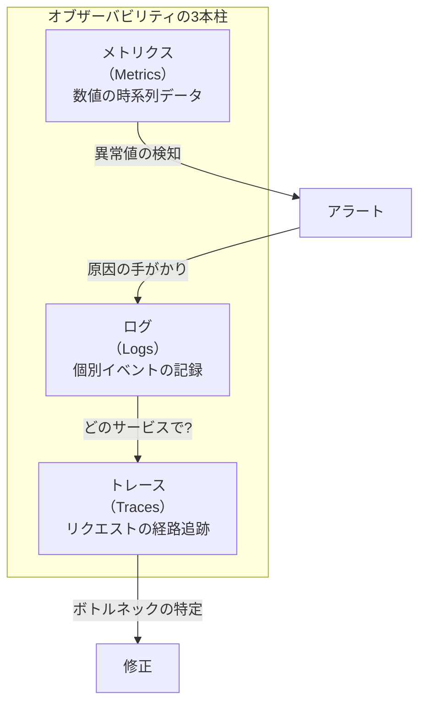
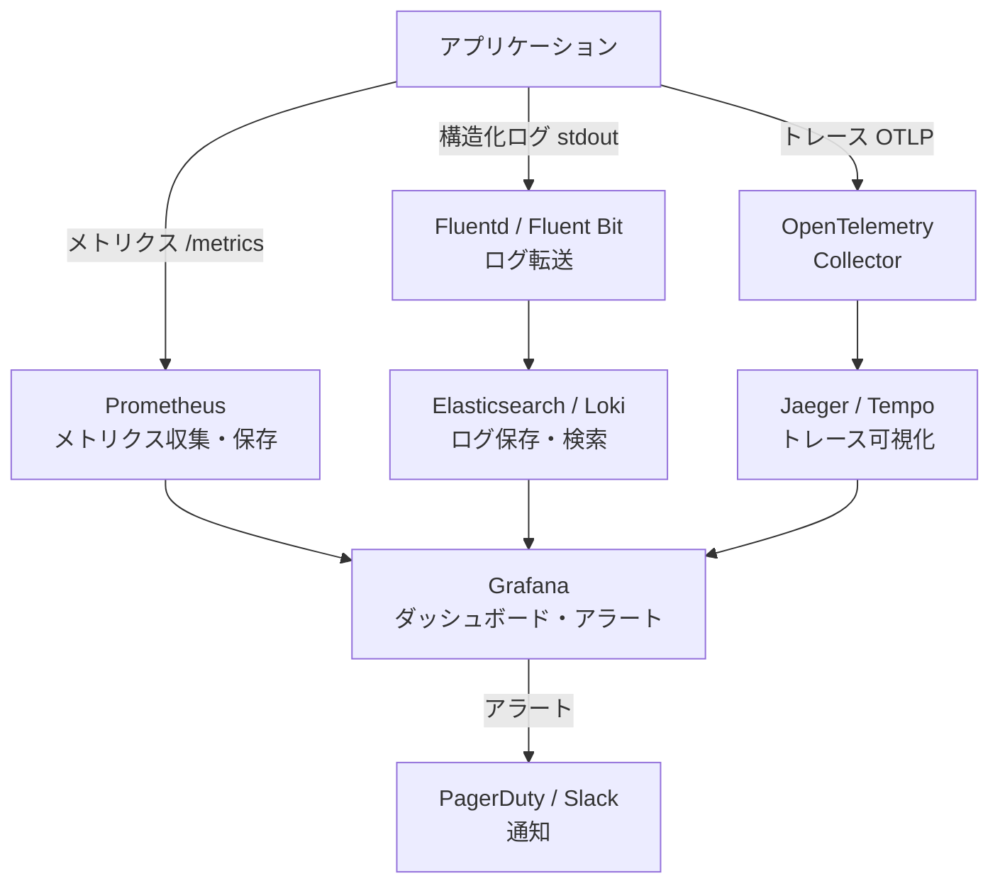

# モニタリング

> **一言で言うと:** メトリクス・ログ・トレースの3本柱でシステムの内部状態を可視化し、「見えないものは直せない」問題を解決する仕組み。

## 3分で全体像

- **何を解決する技術か:** 「障害を顧客に教えてもらう」「原因が分からない」「容量が突然枯渇する」状態を、メトリクス（数値時系列）・ログ（個別イベント）・トレース（リクエスト経路）の3本柱と適切なアラート設計で解消する
- **代表的な使用シーン:** 本番環境の障害検知（MTTD 短縮）、SRE による SLO/SLI 管理、デプロイ後の自動ロールバック判断、容量計画、性能リグレッション検出、マイクロサービスの分散トレース、セキュリティイベント監視
- **これだけは覚える3つ:**
    1. **3本柱は別の問題を見ている** — メトリクスは「**何が起きているか**」（高速集約、低カーディナリティ）、ログは「**具体的に何が起きたか**」（高カーディナリティ、検索）、トレースは「**リクエストがどこを通ったか**」（複数サービス横断）。**1つで全部はカバーできない**ので役割を理解して使い分ける
    2. **平均値ではなく p50 / p95 / p99 で見る** — 平均レスポンスタイムが 100ms でも、p99 が 5 秒なら 100 人に 1 人が極端な体験をしている。**パーセンタイル**で監視しないと「テールレイテンシ」が隠蔽される。SLO もパーセンタイルベースで定義
    3. **メトリクスのラベルにユーザー ID や URL パラメータを入れない** — `user_id` や `path=/users/123` のような無界（カーディナリティ無制限）の値をラベルにすると、Prometheus のメモリが指数的に肥大して落ちる。**ラベルは固定の列挙値（HTTP メソッド・ステータスコード・エンドポイントグループ）のみ**。動的な値はログに記録する
- **AIに任せやすいか:** **一部任せられる** — pino / winston / structlog による構造化ログ、prom-client / OpenTelemetry の計装、Express ミドルウェア、Grafana ダッシュボードの JSON 雛形は AI が高品質に書ける。一方で **「何を SLO にするか」「閾値をいくつにするか」「アラートを誰に飛ばすか」「Runbook の内容」**はビジネス・組織判断で人間が決める。`console.log` 多用、メトリクスラベル爆発、握りつぶし `try-catch` などは AI が量産しがち
- **詰まったらここを読む:** [[ロードバランシング]] / [[CoreWebVitals]] / [[エラーハンドリング]] / [[非同期処理とメッセージキュー]]

## なぜ必要か

本番環境のシステムは、開発者のローカルマシンとは根本的に異なる。何百ものリクエストが同時に流れ、外部サービスの応答が遅延し、ディスクが静かに埋まっていく。モニタリングがなければ:

- **障害の検知が遅れる** --- ユーザーからの報告で初めて障害に気づく（MTTD: Mean Time To Detect が長い）
- **原因の特定ができない** --- 「遅い」「エラーが出る」としか分からず、どのコンポーネントが原因か切り分けられない
- **容量計画が立てられない** --- CPU・メモリ・ディスクがいつ限界に達するか予測できず、突然のサービス停止を招く
- **変更の影響が見えない** --- デプロイ後に性能が劣化しても気づけない。問題が蓄積してから発覚する

## どの問題を解決するか

### オブザーバビリティ（Observability）の3本柱

モニタリングの根幹は、3つの異なるシグナルを組み合わせてシステムの状態を理解すること。


```mermaid
graph TD
    subgraph "オブザーバビリティの3本柱"
        M["メトリクス<br/>（Metrics）<br/>数値の時系列データ"]
        L["ログ<br/>（Logs）<br/>個別イベントの記録"]
        T["トレース<br/>（Traces）<br/>リクエストの経路追跡"]
    end

    M -->|"異常値の検知"| Alert["アラート"]
    Alert -->|"原因の手がかり"| L
    L -->|"どのサービスで?"| T
    T -->|"ボトルネックの特定"| Fix["修正"]
```

### 1. メトリクス（Metrics）--- 「何が起きているか」の数値

時系列の数値データ。「今、毎秒何リクエスト処理しているか」「エラー率は何%か」「レスポンスタイムのp99は何msか」を継続的に記録する。

**4つのゴールデンシグナル**（Google SRE本より）:

| シグナル | 意味 | 例 |
|---------|------|-----|
| **レイテンシ（Latency）** | リクエストの処理にかかる時間 | p50=50ms, p99=200ms |
| **トラフィック（Traffic）** | システムに対する需要の量 | 1000 req/sec |
| **エラー（Errors）** | 失敗したリクエストの割合 | 5xx rate = 0.1% |
| **飽和度（Saturation）** | リソースの利用率 | CPU 70%, メモリ 85% |

### 2. ログ（Logs）--- 「具体的に何が起きたか」の記録

個別イベントの詳細な記録。メトリクスが「エラー率3%」と教えてくれたら、ログで「どのエンドポイントで」「どんなエラーが」「どのユーザーに」起きたかを調べる。

構造化ログ（Structured Logging）が鍵。テキストの羅列ではなく、検索・集計可能なJSON形式で出力する。

### 3. トレース（Traces）--- 「リクエストがどこを通ったか」の経路追跡

分散トレーシング（Distributed Tracing）は、1つのリクエストが複数のサービスを横断する経路を追跡する。マイクロサービス環境では、APIゲートウェイ→認証サービス→注文サービス→決済サービス→通知サービスと複数のホップがあり、どこで遅延しているかをトレースなしに特定するのは困難。


```mermaid
gantt
    title 分散トレースの例（1リクエストの内訳）
    dateFormat X
    axisFormat %L ms

    section API Gateway
    ルーティング         :0, 5

    section Auth Service
    トークン検証         :5, 20

    section Order Service
    注文作成             :20, 80
    DB書き込み           :30, 70

    section Payment Service
    決済処理             :80, 180

    section Notification
    メール送信キュー投入  :180, 190
```

### 4. アラート（Alerting）--- 「人が見ていなくても気づく」仕組み

メトリクスに閾値を設定し、異常時に通知する。ただし、アラート設計を誤ると「アラート疲れ（Alert Fatigue）」に陥り、重要な通知が埋もれる。

## 他の仕組みとどう関係するか

- **下位レイヤーとの関係:**
  - [[プロセスとスレッド]] --- CPU使用率、プロセス数、スレッド数はインフラレベルのメトリクス。OOM Killerによるプロセス強制終了はログで検知する
  - [[ファイルシステムとIO]] --- ディスクI/OレイテンシとIOPS（Input/Output Operations Per Second）はストレージボトルネックの指標
  - [[メモリ管理]] --- メモリ使用量の推移、GCの頻度と停止時間はアプリケーションの健全性指標
  - [[HTTP-HTTPS]] --- HTTPステータスコード別のカウント、レスポンスタイムの分布が最も基本的なWebアプリケーションメトリクス

- **同レイヤーとの関係:**
  - [[ロードバランシング]] --- LBのメトリクス（バックエンドごとのレイテンシ、5xxレート、アクティブ接続数）はシステム全体の健全性を示す最初のシグナル
  - [[CDN]] --- CDNのキャッシュヒット率、エッジでのエラー率はフロントエンドパフォーマンスの指標
  - [[非同期処理とメッセージキュー]] --- キューの深さ、処理遅延、DLQのメッセージ数はバックグラウンド処理の健全性指標
  - [[CoreWebVitals]] --- ユーザー体験のモニタリング（RUM: Real User Monitoring）として、サーバー側メトリクスを補完する

- **上位レイヤーとの関係:**
  - [[Layer7-設計アーキテクチャ/_index|設計・アーキテクチャ]] --- モニタリングはCI/CDパイプラインと統合し、デプロイ後の自動ロールバック判断に使われる
  - [[Layer6-セキュリティ/_index|セキュリティ]] --- 不正アクセスの検知、レート制限の発動状況、認証失敗の急増などはセキュリティモニタリングの領域

## 誤解されやすいポイント

### 1. 「モニタリング = ダッシュボードを作ること」

ダッシュボードは可視化の手段であってモニタリングの本質ではない。誰も見ていないダッシュボードは意味がない。モニタリングの核心は**アラート**---異常を自動検知して人に通知する仕組みにある。ダッシュボードはアラート発報後の調査ツールとして機能する。

### 2. 「ログを全部保存すれば問題ない」

非構造化のテキストログを大量に保存しても、検索・分析が困難でストレージコストだけが膨らむ。必要なのは:
- **構造化ログ**（JSON形式、検索可能なフィールド付き）
- **適切なログレベル**（DEBUG/INFO/WARN/ERROR）の使い分け
- **リクエストIDの付与**（1つのリクエストに関するログを横断的に追跡できる）

### 3. 「平均値を監視すれば十分」

レスポンスタイムの平均が100msでも、p99（上位1%）が5秒かもしれない。100人に1人が極端に遅い体験をしていることが平均値では見えない。**パーセンタイル**（p50, p90, p95, p99）での監視が不可欠。

### 4. 「アラートは多いほど安全」

閾値を厳しく設定しすぎると、対応不要なアラートが大量に発生する（アラート疲れ）。結果として重要なアラートを見逃す。アラートは**アクションが必要なもの**だけに絞るべき。「今すぐ人が対応する必要があるか？」がアラート設定の基準。

### 5. 「APMツールを入れればオブザーバビリティは完成」

APM（Application Performance Monitoring）ツールは強力だが、ビジネスメトリクス（注文数、コンバージョン率等）やインフラメトリクス（ディスク残量、ネットワーク帯域）はカバーしない。技術メトリクスとビジネスメトリクスの両方を監視する視点が必要。

## 設計のベストプラクティス

### 推奨パターン

| パターン | 説明 |
|---------|------|
| **RED メソッド** | サービスごとにRate（リクエスト率）、Errors（エラー率）、Duration（処理時間）を監視する |
| **USE メソッド** | リソースごとにUtilization（使用率）、Saturation（飽和度）、Errors（エラー）を監視する |
| **[[SLI-SLO-SLA]]** | Service Level Indicator（指標）→ Service Level Objective（目標）→ Service Level Agreement（契約）の順で定義。エラーバジェット（許容される障害量）でリリース判断 |
| **構造化ログ + リクエストID** | 全サービスで共通のリクエストIDをHTTPヘッダーで伝播し、ログを横断的に検索可能にする |
| **段階的アラート** | Warning → Critical → Page の多段階。Warning はSlack通知、Critical はPagerDuty |

### アンチパターン

| アンチパターン | なぜ問題か | 対策 |
|---|---|---|
| 全リクエストをDEBUGレベルでログ出力 | ストレージ圧迫、ログ検索が遅い、コスト増大 | 本番はINFO以上、DEBUGはサンプリングか動的有効化 |
| メトリクスのカーディナリティ爆発 | ユーザーIDやURLパスをラベルにすると、メトリクスのストレージが指数的に増加 | ラベルは有界な値（ステータスコード、エンドポイントグループ等）に限定 |
| 障害時にしかダッシュボードを見ない | 正常時のベースラインが分からないと異常値を判断できない | 定期的なレビュー（週次SLOチェック等）を仕組み化する |
| アラート対応手順が未整備 | アラートが鳴っても何をすればいいか分からず対応が遅延 | 各アラートにRunbook（対応手順書）へのリンクを含める |

## AIエージェントとの協働

> このトピックでAIコーディングエージェント（Claude Code, Copilot, Cursor 等）と協働するための観点。
> pino / winston / structlog の構造化ログ、prom-client / OpenTelemetry の計装雛形、Express / Fastify / FastAPI のミドルウェア、ELK / Grafana ダッシュボードの JSON は AI に任せやすい。一方で **「`console.log` で生 SQL や個人情報を垂れ流し」「メトリクスのラベルに `user_id` / 動的 URL パスを入れて Prometheus を落とす」「全 catch で例外を握りつぶす」「ログを INFO で全部出してストレージを食い潰す」**などを AI が量産しがち。`/review-ai-code` で必ず検出する。

### AIに任せられる部分 / 人間が判断すべき部分

| タスク種類 | 任せ方（実装/レビュー） | 人間の関与 |
|---|---|---|
| 構造化ログの計装（pino / winston / structlog） | AI 実装、`/review-ai-code` でレビュー | ログレベル戦略（DEBUG はサンプリング・PII マスキング）の方針は人間 |
| Prometheus メトリクスの計装（prom-client / micrometer） | AI に Counter / Histogram / Gauge の使い分け雛形 | ラベル設計（カーディナリティ管理）は人間レビュー必須 |
| OpenTelemetry のトレース計装と OTLP エクスポート | AI に Auto-Instrumentation 設定 | サンプリング率（head-based / tail-based）と保持期間は人間判断。tail-based は SDK 単体ではできず Collector の `TailSamplingProcessor` 経由が必要 |
| リクエスト ID 伝播ミドルウェア | AI に `x-request-id` の生成・伝搬パターン | サービスメッシュ / API Gateway との整合は人間判断 |
| Grafana ダッシュボード JSON | AI に RED / USE メソッドのテンプレ | 実際の閾値・SLO は組織の SLA / ユーザー期待で人間が決定 |
| アラート設定（Prometheus AlertManager / Grafana） | AI に PromQL / 閾値雛形 | アラート対象（誰に飛ばすか・PagerDuty / Slack 振り分け）は人間判断 |
| Runbook（対応手順書）の生成 | AI が雛形 | 実際の対応手順は実環境を知る人間が記述・継続更新 |

### AI生成コードのレビュー観点（このトピック固有）

AI生成のモニタリング計装を受け取ったとき、最低限ここを見る。

1. **メトリクスラベルのカーディナリティ爆発** — `user_id` `request_id` `path=/users/{動的 ID}` `query_param` のような**無界（unbounded）の値**がラベルに含まれていないか。Prometheus は (メトリクス名 × 全ラベル組み合わせ) の時系列を全てメモリに持つため、カーディナリティが爆発するとサーバーが落ちる。**ラベルは固定の列挙値（HTTP メソッド・ステータスコード・エンドポイントグループ・テナント tier）に限定**。動的値はログ / トレースに記録
2. **構造化ログの欠如と PII 漏洩** — `console.log` / `print` のテキスト羅列で、ログレベル・タイムスタンプ・リクエスト ID が無く、本番で検索不能になっていないか。逆に**生 SQL・パスワード・トークン・クレジットカード番号・個人情報**を構造化ログでもそのままダンプしていないか（`req.body` 全体を `info` ログ等）。ログは JSON 構造化、PII は事前にマスキング、機密値はダンプ対象から明示的に除外
3. **エラーハンドリングのログ握りつぶし** — `catch (err) {}` の空 catch、`catch (err) { console.error('failed') }` のスタックトレース欠落、`catch (err) { return null }` で上位への通知なし、などが残っていないか。catch では **(a) 構造化ログにエラー本体を出力、(b) メトリクスのエラーカウンターを更新、(c) リトライ可能性で再 throw / 戻り値判断**の3点が必要。逆に**ヘルスチェック / リクエストログだけで `console.error` を量産**して本来の障害ログが埋もれていないか

### 効くプロンプトの型

このトピックに関する実装をAIに依頼するとき、コンテキストとして渡すべき情報・制約・成功基準のテンプレ。

```
# 前提（プロジェクトの状況・既存のコード規約）
- 言語/FW: Node.js (Express) / Python (FastAPI) / Go (Echo) など
- ロガー: pino / structlog / zap など (既存採用ライブラリ)
- メトリクス: Prometheus + Grafana (or Datadog)
- トレース: OpenTelemetry → Jaeger / Tempo / Datadog APM
- リクエスト ID: 入口 (LB / API Gateway) で `x-request-id` を付与済み
- PII: メールアドレス・電話番号・住所・カード番号は構造化ログでもマスキング必須
- ログレベル: 本番 INFO 以上、DEBUG は環境変数で動的有効化

# やってほしいこと
- 構造化ログ + リクエスト ID 伝搬ミドルウェア
- HTTP リクエスト Histogram メトリクス (method, route, status_code をラベルに)
- OpenTelemetry の Auto-Instrumentation 初期化
- 4 Golden Signals (Rate / Errors / Duration / Saturation) のダッシュボード雛形

# 守ってほしい制約（このトピック固有のもの）
- メトリクスラベルは固定列挙値のみ (user_id / 動的 path / query は禁止)
- ログは JSON 構造化、`req.body` 全体ダンプは禁止 (PII リスク)
- ログレベル: ERROR / WARN / INFO / DEBUG の使い分け
- catch では必ず構造化ログ + メトリクスのエラーカウンター更新
- ヘルスチェックパスはアクセスログから除外 (ノイズ削減)
- パーセンタイル (p50 / p95 / p99) を監視可能に
- リクエスト ID を全ログに自動付与 (横断検索可能に)
- トレース: HTTP / DB / 外部 API を自動計装、サンプリング率は本番 1〜10%

# 完了の判断基準
- 障害発生時、リクエスト ID で全サービス横断検索が可能
- ダッシュボードで RED メソッド (Rate / Errors / Duration) が見える
- メトリクスのカーディナリティが固定値の組み合わせに収まっている
- PII がログに漏れていない (秘密情報のリスト確認)
```

### AI実装のアンチパターン

LLM生成コードで頻出する過剰設計・誤用パターン。レビュー時の照合表として使う。

| アンチパターン | なぜ問題か | レビュー観点 / 対策 |
|---|---|---|
| `console.log` / `print` の非構造化ログ | ログレベル・タイムスタンプ・リクエスト ID なし、本番で grep / 集約困難 | pino / winston / structlog 等で JSON 構造化 |
| メトリクスラベルに `user_id` / 動的 URL パス / クエリ | カーディナリティ爆発で Prometheus がメモリ枯渇 | ラベルは固定列挙値のみ、動的値はログ / トレースへ |
| `path` ラベルに正規表現の元のままを入れる（`/users/123/orders/456`） | リクエストごとに別の時系列になる | `path: /users/:id/orders/:orderId` のテンプレ化 |
| `Histogram` のバケット未設定 | デフォルトの不適切なバケットで p99 が見えない | サービス特性に合わせて `buckets: [0.01, 0.05, 0.1, 0.25, 0.5, 1, 2.5, 5, 10]` |
| 平均値だけのダッシュボード | テールレイテンシ（外れ値）が隠蔽される | p50 / p95 / p99 のパーセンタイル |
| `req.body` / `req.headers` 全体を `info` ログにダンプ | PII（メール / カード番号 / トークン）漏洩、PII 規制違反 | フィールド単位の出力、`Authorization` / `Cookie` / `password` は除外 |
| 全リクエストを DEBUG レベルでログ | ストレージ圧迫、検索遅延、コスト増大 | 本番は INFO 以上、DEBUG はサンプリングか環境変数で動的有効化 |
| `catch (err) {}` の空 catch / 握りつぶし | 障害が見えない、原因特定不能 | 構造化ログ + メトリクスのエラーカウンター + 必要に応じて再 throw |
| `console.error('failed')` のメッセージのみ | スタックトレース・コンテキストなし | エラーオブジェクト本体（`{ err, requestId, ... }`）を渡す |
| ヘルスチェックパスもアクセスログに記録 | LB の高頻度ポーリングでログを圧迫 | パスフィルタで除外（[[ロードバランシング]] と整合） |
| アラートを毎リクエストの 5xx 1件で発報 | アラート疲れで重要通知を見逃す | エラー率（直近 5 分の 5xx 比率）+ 持続時間で判定 |
| アラートに Runbook リンクなし | 鳴っても何をすればいいか分からず対応遅延 | 各アラートに Runbook（対応手順）リンク必須 |
| メトリクス・ログ・トレースのリクエスト ID が連動していない | 障害時に3つを横断できない | 共通 ID（`trace_id` / `request_id`）を全シグナルに付与 |
| OpenTelemetry のサンプリング 100%（全件） | コスト爆発、トレースバックエンドが落ちる | head-based 1〜10% を SDK に設定。tail-based（エラー / 高レイテンシのみ 100% 保持）は SDK 単体ではできず、**OpenTelemetry Collector の `TailSamplingProcessor`** を介する必要あり |
| ビジネスメトリクス（注文数・コンバージョン）の監視なし | インフラは健全でもビジネスが落ちている異常を検知できない | 技術メトリクス + ビジネスメトリクスの両軸 |

→ レイヤー横断のアンチパターン索引: [[_anti-patterns/_index|AIアンチパターン索引]] / [[_anti-patterns/レイヤー別/Layer5|Layer 5 パフォーマンス アンチパターン集]]

## 具体例

### 構造化ログの実装（Node.js / pino）

```javascript
const pino = require('pino');

const logger = pino({
  level: process.env.LOG_LEVEL || 'info',
  formatters: {
    level(label) { return { level: label }; },
  },
  // リクエストIDの自動付与はミドルウェアで
});

// Express ミドルウェア: リクエストごとにloggerを生成
function requestLogger(req, res, next) {
  const requestId = req.headers['x-request-id'] || crypto.randomUUID();
  req.log = logger.child({ requestId, method: req.method, path: req.path });

  const start = process.hrtime.bigint();
  res.on('finish', () => {
    const duration = Number(process.hrtime.bigint() - start) / 1e6; // ms
    req.log.info({
      statusCode: res.statusCode,
      durationMs: duration,
      userAgent: req.headers['user-agent'],
    }, 'request completed');
  });

  next();
}

// アプリケーションコード内での使用
app.get('/orders/:id', async (req, res) => {
  req.log.info({ orderId: req.params.id }, 'fetching order');
  try {
    const order = await db.orders.findById(req.params.id);
    if (!order) {
      req.log.warn({ orderId: req.params.id }, 'order not found');
      return res.status(404).json({ error: 'not found' });
    }
    res.json(order);
  } catch (err) {
    req.log.error({ err, orderId: req.params.id }, 'failed to fetch order');
    res.status(500).json({ error: 'internal error' });
  }
});
```

出力例（JSON形式、ログ集約ツールで検索可能）:
```json
{"level":"info","time":1711700000000,"requestId":"a1b2c3","method":"GET","path":"/orders/42","orderId":"42","msg":"fetching order"}
{"level":"info","time":1711700000050,"requestId":"a1b2c3","method":"GET","path":"/orders/42","statusCode":200,"durationMs":48.2,"msg":"request completed"}
```

### Prometheusメトリクスの公開（Node.js / prom-client）

```javascript
const promClient = require('prom-client');

// デフォルトメトリクス（CPU、メモリ、GC等）を自動収集
promClient.collectDefaultMetrics();

// HTTPリクエストのカスタムメトリクス
const httpRequestDuration = new promClient.Histogram({
  name: 'http_request_duration_seconds',
  help: 'Duration of HTTP requests in seconds',
  labelNames: ['method', 'route', 'status_code'],
  buckets: [0.01, 0.05, 0.1, 0.25, 0.5, 1, 2.5, 5, 10],
});

const httpRequestTotal = new promClient.Counter({
  name: 'http_requests_total',
  help: 'Total number of HTTP requests',
  labelNames: ['method', 'route', 'status_code'],
});

// Express ミドルウェア
function metricsMiddleware(req, res, next) {
  const end = httpRequestDuration.startTimer();
  res.on('finish', () => {
    const route = req.route?.path || 'unknown';
    const labels = { method: req.method, route, status_code: res.statusCode };
    end(labels);
    httpRequestTotal.inc(labels);
  });
  next();
}

// /metrics エンドポイント（Prometheusがスクレイプする）
app.get('/metrics', async (req, res) => {
  res.set('Content-Type', promClient.register.contentType);
  res.end(await promClient.register.metrics());
});
```

### モニタリングスタックの構成例


```mermaid
graph TD
    App["アプリケーション"] -->|メトリクス /metrics| Prom["Prometheus<br/>メトリクス収集・保存"]
    App -->|構造化ログ stdout| Fluentd["Fluentd / Fluent Bit<br/>ログ転送"]
    App -->|トレース OTLP| Collector["OpenTelemetry<br/>Collector"]

    Prom --> Grafana["Grafana<br/>ダッシュボード・アラート"]
    Fluentd --> ES["Elasticsearch / Loki<br/>ログ保存・検索"]
    Collector --> Jaeger["Jaeger / Tempo<br/>トレース可視化"]

    ES --> Grafana
    Jaeger --> Grafana

    Grafana -->|アラート| PD["PagerDuty / Slack<br/>通知"]
```

### OpenTelemetryによるトレースの計装（Node.js）

```javascript
const { NodeSDK } = require('@opentelemetry/sdk-node');
const { OTLPTraceExporter } = require('@opentelemetry/exporter-trace-otlp-http');
const { HttpInstrumentation } = require('@opentelemetry/instrumentation-http');
const { ExpressInstrumentation } = require('@opentelemetry/instrumentation-express');
const { PgInstrumentation } = require('@opentelemetry/instrumentation-pg');

// SDKの初期化（アプリケーション起動前に実行）
const sdk = new NodeSDK({
  serviceName: 'order-service',
  traceExporter: new OTLPTraceExporter({
    url: 'http://otel-collector:4318/v1/traces',
  }),
  instrumentations: [
    new HttpInstrumentation(),      // HTTP通信を自動計装
    new ExpressInstrumentation(),   // Expressルーティングを自動計装
    new PgInstrumentation(),        // PostgreSQLクエリを自動計装
  ],
});

sdk.start();
// これだけで、HTTPリクエスト→Express→DB の一連のスパンが自動生成される
```

### 主要なモニタリングツールの比較

| カテゴリ | OSS | マネージド |
|---------|-----|----------|
| **メトリクス** | Prometheus + Grafana | Datadog, New Relic, Amazon CloudWatch |
| **ログ** | ELK Stack (Elasticsearch + Logstash + Kibana), Loki | Datadog Logs, AWS CloudWatch Logs |
| **トレース** | Jaeger, Zipkin, Grafana Tempo | Datadog APM, AWS X-Ray |
| **統合** | OpenTelemetry（計装の標準化） | Datadog（メトリクス+ログ+トレースを統合） |

## 参考リソース

- [Google SRE Book - Chapter 6: Monitoring Distributed Systems](https://sre.google/sre-book/monitoring-distributed-systems/) --- 4つのゴールデンシグナルの出典。無料公開
- [OpenTelemetry Documentation](https://opentelemetry.io/docs/) --- 計装の業界標準。メトリクス・ログ・トレースを統一的に扱う
- [Prometheus: Up & Running (Julien Pivotto, Brian Brazil)](https://www.oreilly.com/library/view/prometheus-up/9781098131135/) --- Prometheusの実践ガイド
- [Observability Engineering (Charity Majors et al.)](https://www.oreilly.com/library/view/observability-engineering/9781492076438/) --- オブザーバビリティの概念と実践を体系的に解説

## 理解度セルフチェック

> 答えられなければ本文に戻る。答えはこのファイル内に必ずある。

1. **メトリクス・ログ・トレースの3本柱が「役割の異なるシグナル」である理由を、それぞれが解決する問題（カーディナリティ・速度・経路）の違いに触れて30秒で説明せよ。**
2. **「平均レスポンスタイム 100ms」のサービスをそれだけで監視するのが危険な理由を、p99 / テールレイテンシの観点から答えよ。** 100 人に 1 人の体験がなぜ重要かにも触れること。
3. **AI生成コードレビュー設問:** AI が「Express のリクエスト計装ミドルウェア」として以下のコードを生成した。本文の観点で **問題点を最低3つ** 指摘せよ。

```javascript
const express = require('express');
const promClient = require('prom-client');
const app = express();

// HTTP メトリクス
const httpRequestDuration = new promClient.Histogram({
  name: 'http_request_duration_seconds',
  help: 'Duration of HTTP requests',
  labelNames: ['method', 'path', 'user_id', 'query_string'],  // 細かく追跡したい
});

// アクセスログミドルウェア
app.use((req, res, next) => {
  console.log(`${req.method} ${req.url} body=${JSON.stringify(req.body)} headers=${JSON.stringify(req.headers)}`);
  const end = httpRequestDuration.startTimer();
  res.on('finish', () => {
    end({
      method: req.method,
      path: req.url,                           // /users/123 のような実 URL
      user_id: req.user?.id || 'anonymous',
      query_string: JSON.stringify(req.query),
    });
  });
  next();
});

// ヘルスチェック
app.get('/health', (req, res) => res.send('ok'));

// 注文 API
app.post('/orders', async (req, res) => {
  try {
    const order = await db.orders.create(req.body);
    res.json(order);
  } catch (err) {
    // 失敗時は何もしない
    res.status(500).send('error');
  }
});

// アラート: 直近 1 リクエストでも 5xx があれば PagerDuty 通知
// (PromQL: http_requests_total{status_code=~"5.."} > 0)
```

> [!note]- 解答の指針
>
> > [!info] 用語ミニ辞典
> > - **メトリクス (Metrics):** 数値の時系列データ。リクエスト数、レスポンスタイム、CPU 使用率などを一定間隔で記録。Prometheus / Datadog / CloudWatch が代表的
> > - **構造化ログ (Structured Logging):** JSON 等の機械可読フォーマットで出力するログ。検索・集計・フィルタが可能。pino / winston / structlog / zap が代表的
> > - **分散トレース (Distributed Tracing):** 1 つのリクエストが複数サービスを横断する経路を追跡。OpenTelemetry が標準、バックエンドは Jaeger / Tempo / Datadog APM
> > - **カーディナリティ (Cardinality):** ラベル値の組み合わせの数。Prometheus は (メトリクス名 × 全ラベル組み合わせ) を全て時系列としてメモリに持つため、無界の値（user_id / 動的 path）を入れると爆発する
> > - **パーセンタイル (Percentile):** データを並べた時の上位 X% の値。p50 = 中央値、p95 = 上位 5%、p99 = 上位 1%。レスポンスタイムは平均より p99 で見るのが定石
> > - **4 Golden Signals:** Google SRE が定義した監視の4指標 — Latency / Traffic / Errors / Saturation
> > - **RED メソッド:** マイクロサービスごとに Rate（リクエスト率）/ Errors（エラー率）/ Duration（処理時間）を監視するパターン
> > - **USE メソッド:** リソースごとに Utilization（使用率）/ Saturation（飽和度）/ Errors（エラー）を監視するパターン
> > - **SLI / SLO / SLA:** Service Level Indicator（指標）/ Objective（社内目標）/ Agreement（顧客契約）。エラーバジェット（許容できる障害量）でリリース判断
> > - **MTTD / MTTR:** Mean Time To Detect（検知までの平均時間）/ Mean Time To Recovery（復旧までの平均時間）。モニタリングの効果指標
> > - **OpenTelemetry (OTel):** メトリクス・ログ・トレースを統一的に扱う業界標準。Auto-Instrumentation で HTTP / DB / 外部 API を自動計装
> > - **head-based / tail-based サンプリング:** head-based はリクエスト開始時に確率で採用判定（SDK で完結、軽量）。tail-based はリクエスト完了後にエラー / 高レイテンシなどの結果を見て採用判定（事故ケースを取りこぼさないが、**OpenTelemetry Collector の `TailSamplingProcessor`** が必要で、全スパンを一旦バッファするためコレクタのリソース要件が上がる）
> > - **PII (Personally Identifiable Information):** 個人を特定できる情報（氏名・メール・電話番号・カード番号など）。ログ・トレースに漏らすと GDPR / 個人情報保護法違反
> > - **アラート疲れ (Alert Fatigue):** 重要でないアラートが頻発して人が反応しなくなる現象。アラートは「今すぐ人が対応する必要があるもの」だけに絞る
>
> 1. **3 本柱は別の質問に答える別のシグナル**: (a) **メトリクス**は「**何が起きているか**」を集約された数値時系列で見る。低カーディナリティ（固定ラベル）で高速集約・長期保持に向くが、個別の出来事は分からない。「エラー率 3%」までは見える。(b) **ログ**は「**具体的に何が起きたか**」を個別イベントの詳細記録で見る。高カーディナリティ（自由テキスト）で検索可能、メトリクスで気付いた異常を**どのエンドポイント・どのユーザー・どんなエラーで**まで掘れる。(c) **トレース**は「**1 リクエストがどこを通り、どこで遅くなったか**」を複数サービス横断で見る。マイクロサービスでは、API ゲートウェイ → 認証 → 注文 → 決済 → 通知のような複雑な経路の中でどのホップが遅延・失敗したかをトレースなしに特定するのは困難。**メトリクスで気付き → ログで詳細 → トレースで経路**という調査フローを支えるため、3 つは互いに代替できない。1 つで全部カバーしようとすると、メトリクスのカーディナリティ爆発か、ログだけで集計しようとして低速化する
> 2. **平均値はテール（極端に遅い人）を打ち消す**: 100 リクエストの大半が 50ms で完了し、1 リクエストだけが 5050ms かかった場合、平均は 100ms になる。ダッシュボード上は健全に見えるが、**100 人に 1 人が 5 秒待つ**という許容できない体験が起きている。Web サービスでは「ある程度悪い体験をした人」は離脱・クレーム・SNS 拡散につながり、ビジネスインパクトが大きい。**p99（上位 1% の値）は 5050ms** とはっきり可視化されるため、平均ではなく**パーセンタイル（p50 / p95 / p99）**で監視するのが定石。SLO もパーセンタイルで定義（「リクエストの 99% が 500ms 以下」など）。さらに、p99 の母数は「過去 5 分」「過去 1 時間」など窓を切って測ることで、急激な悪化（特定 API のリグレッション、特定地域の障害、トラフィックスパイク）を検知できる
> 3. AI生成コードの問題点（最低限以下を指摘できれば本文を理解している）:
>     - **メトリクスラベルに `user_id` / `path`（動的）/ `query_string`** — 完全なカーディナリティ爆発。`user_id` は無界、`path` は `/users/123` のようにユーザーごとに別の時系列、`query_string` も無限の組み合わせ。Prometheus が即座にメモリ枯渇で落ちる。**`route: '/users/:id'`（テンプレ化したパスパターン）+ `method` + `status_code` のみ**にする。動的値はログ / トレースに記録
>     - **`req.body` / `req.headers` 全体を `console.log` ダンプ** — `body` にはパスワード・クレジットカード・PII が含まれる、`headers` には `Authorization` / `Cookie` トークンが含まれる。**重大な機密漏洩**。フィールド単位で出力し、機密項目は明示除外
>     - **`console.log` の非構造化ログ** — タイムスタンプ・リクエスト ID・ログレベルなし、JSON でないため本番で grep / 集約困難。pino / winston で JSON 出力、`x-request-id` をミドルウェアで生成 / 伝搬
>     - **`/orders` の `catch` で握りつぶし** — `console.error` すらなく、エラー本体・スタックトレース・リクエスト ID なし。さらにメトリクスのエラーカウンターも更新されない。`req.log.error({ err, body: req.body }, 'order create failed')` + メトリクス更新
>     - **`/health` がアクセスログにも記録される** — LB の高頻度ポーリングでログ容量圧迫。`if (req.url === '/health') return next()` のスキップ、または pino-http のフィルタ
>     - **`Histogram` のバケット指定なし** — デフォルトのバケット（0.005, 0.01, 0.025, ...）はサービス特性によっては不適切で、p99 が荒い精度になる。`buckets: [0.01, 0.05, 0.1, 0.25, 0.5, 1, 2.5, 5, 10]` のように明示
>     - **アラートが「直近 1 リクエストでも 5xx で発報」** — 完全なアラート疲れパターン。スパイク時の単発 5xx でも全員に PagerDuty が飛ぶ。「直近 5 分のエラー率 > 1% が持続 5 分」のような**比率 + 持続時間**で発報
>     - **アラートに Runbook リンクなし** — 「http 5xx alert」だけでは対応者が初動を判断できない。`runbook_url: ...` をアラート定義に
>     - **トレース計装なし** — 分散システムでの遅延 / 失敗箇所を特定する手段がない。OpenTelemetry の `NodeSDK` を初期化し、HTTP / DB / 外部 API を Auto-Instrumentation
>     - **`status_code` ラベルなし** — エラー率を計算するのに必須。`{ method, route, status_code }` の3軸が定石
>     - **ログレベルなし** — 全部 INFO で出ている。本番のストレージとコスト・検索性に直撃。ERROR / WARN / INFO の使い分け、DEBUG は環境変数で動的有効化
>     - **`process.on('uncaughtException')` / `unhandledRejection` のハンドリングなし** — 想定外の例外がメッセージなく死ぬ。最低限ログに記録してから安全に終了する仕組みが必要

## 学習メモ

（個人的な気づき・疑問・TODO）
