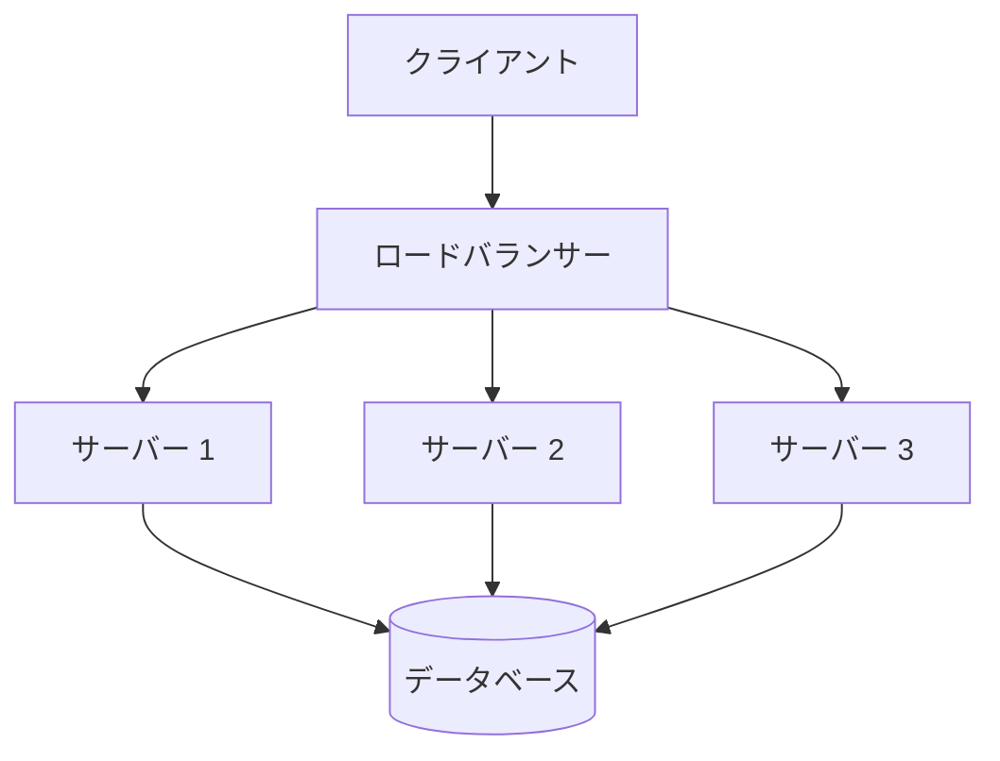
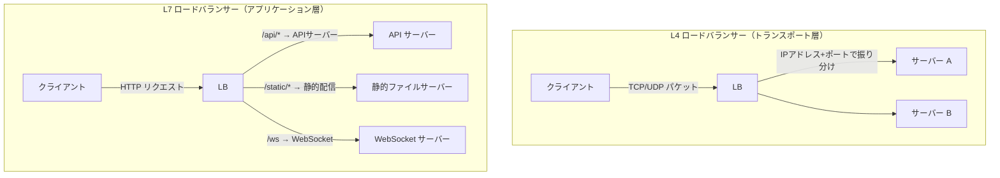

# ロードバランシング

> **一言で言うと:** 1台のサーバーでは処理しきれないトラフィックを複数台に振り分け、スケーラビリティと可用性を実現する仕組み。

## なぜ必要か

どんなに高性能なサーバーでも、処理できるリクエスト数には上限がある（垂直スケーリングの限界）。ロードバランサー（Load Balancer, LB）がなければ、以下の問題が発生する:

- **単一障害点（SPOF: Single Point of Failure）** --- サーバーが1台だけなら、その1台が落ちればサービス全停止
- **スケーリングの壁** --- トラフィック増加に対してCPU/メモリを増強する垂直スケーリングにはハードウェアの物理的限界がある
- **デプロイ時のダウンタイム** --- サーバーが1台では、更新のたびにサービス停止が避けられない
- **リソースの非効率利用** --- 一部のサーバーに負荷が集中し、他のサーバーが遊んでいる状態

## どの問題を解決するか

### 1. 水平スケーリング（Horizontal Scaling）の実現

サーバーを「増やす」ことでキャパシティを拡大する。LBが「どのサーバーにリクエストを送るか」を決定することで、アプリケーションは自身がクラスタの一部であることを意識しなくてよい。



### 2. ヘルスチェックによる障害の自動排除

LBはバックエンドサーバーに定期的にヘルスチェック（HTTPリクエストやTCP接続確認）を送り、応答がないサーバーを振り分け対象から自動的に除外する。サーバーが復旧すれば自動で再追加される。

### 3. ゼロダウンタイムデプロイ

ローリングデプロイ（Rolling Deploy）やブルーグリーンデプロイ（Blue-Green Deploy）をLBと組み合わせることで、ユーザーに影響を与えずにアプリケーションを更新できる。

### 4. SSL/TLSの終端（SSL Termination）

LBがTLSの暗号化/復号を担い、バックエンドサーバーには平文HTTPで通信する。これによりバックエンドのCPU負荷を軽減し、証明書管理を一元化できる。

## 他の仕組みとどう関係するか

- **下位レイヤーとの関係:**
  - [[TCP-IP]] --- L4ロードバランサーはTCPレベルで動作する。コネクションの確立先をバックエンドに中継し、パケット内容を解析しないため高速
  - [[HTTP-HTTPS]] --- L7ロードバランサーはHTTPヘッダーやURLパスを解析して振り分け先を決定する。パスベースルーティング（`/api/*` はAPIサーバー、`/static/*` はファイルサーバー）が可能
  - [[TLS-SSL]] --- SSL TerminationによりLBがTLSを終端する。バックエンドとの通信にはmTLS（相互TLS）を使うケースもある
  - [[DNS]] --- DNSラウンドロビンは最も原始的なロードバランシングだが、ヘルスチェックがなく障害時にトラフィックが送られ続けるため、単独では不十分
  - [[プロセスとスレッド]] --- バックエンドの各サーバーが何プロセス/何スレッドで動いているかが、1台あたりの処理能力を決める

- **同レイヤーとの関係:**
  - [[CDN]] --- CDNはグローバルなL7ロードバランサーとして機能する。CDNがエッジでの地理的分散、LBがオリジン内での負荷分散を担う
  - [[モニタリング]] --- LBのメトリクス（レイテンシ分布、5xxレート、アクティブコネクション数）はシステム健全性の重要な指標
  - [[非同期処理とメッセージキュー]] --- リクエスト処理が重い場合、LBの背後で非同期化してレスポンスタイムを短縮する

- **上位レイヤーとの関係:**
  - [[Layer7-設計アーキテクチャ/_index|設計・アーキテクチャ]] --- マイクロサービスではサービスごとにLBが必要になり、サービスメッシュ（Istio等）やサービスディスカバリ（Consul, Kubernetes Service）がこの問題を解決する

## 誤解されやすいポイント

### 1. 「ロードバランサーを置けば自動的にスケーラブルになる」

LBはリクエストを振り分けるだけで、アプリケーションがステートレスでなければ正しく機能しない。セッション情報をサーバーのメモリに持つアプリケーションは、別サーバーに振り分けられるとセッションが失われる。ステートの外部化（[[キャッシュ戦略|Redis等への外出し]]）が前提条件。

### 2. 「ラウンドロビンで十分」

全サーバーが同じスペックで同じ処理をしている場合はラウンドロビンで問題ないが、実際にはリクエストごとに処理コストが異なる。重いリクエストが特定サーバーに偏ると、均等に振り分けても負荷は不均等になる。Least Connections（最小接続数）やWeighted Round Robin（重み付き）が必要になる場面は多い。

### 3. 「[[L4とL7ロードバランサーの違い|L4とL7の違い]]はパフォーマンスだけ」

L4（トランスポート層）LBはパケットを転送するだけで高速だが、HTTPの内容は見えない。L7（アプリケーション層）LBはリクエスト内容に基づく高度なルーティング（パスベース、ヘッダーベース、Cookieベース）が可能。選択はパフォーマンスだけでなく、必要なルーティング機能で決まる。

### 4. 「Sticky Sessionを使えばステートフルアプリも問題ない」

Sticky Session（セッションアフィニティ）は同じクライアントを同じサーバーに固定する機能だが、以下の問題がある:
- そのサーバーがダウンするとセッションが失われる
- 特定サーバーに負荷が偏りやすい
- スケールイン時にセッション中のユーザーに影響する

Sticky Sessionは移行期の暫定策であり、最終的にはステートの外部化を目指すべき。

## 設計のベストプラクティス

### 推奨パターン

| パターン | 説明 |
|---------|------|
| **ステートレス設計** | セッション・キャッシュを外部ストア（Redis等）に保持し、どのサーバーに振り分けられても同じ結果を返す |
| **ヘルスチェックの多層化** | TCP接続確認だけでなく、アプリケーションレベルの `/health` エンドポイントでDB接続等も検証する |
| **グレースフルシャットダウン** | デプロイ時に処理中のリクエストを完了してから停止する。LBのドレイン（Connection Draining）と組み合わせる |
| **L7パスベースルーティング** | 単一ドメインでAPI・静的ファイル・WebSocketを異なるバックエンドに振り分ける |

### アンチパターン

| アンチパターン | なぜ問題か | 対策 |
|---|---|---|
| サーバーのローカルディスクにファイルを保存 | 他のサーバーからアクセスできない | S3等の共有ストレージを使う |
| ヘルスチェックが常にOKを返す | 障害サーバーにトラフィックが送られ続ける | DB接続・依存サービスの状態も含めた実質的なチェックを実装 |
| LBを単一構成で運用 | LB自体がSPOFになる | Active-Standby またはActive-Active構成にする |
| LBの背後に異なるバージョンのアプリを長時間混在 | API互換性の問題やデバッグ困難 | ローリングデプロイの時間を最小限にし、バージョン情報をレスポンスヘッダーに含める |

## AIによる実装のアンチパターン

| アンチパターン | なぜ問題か | 対策 |
|---|---|---|
| ヘルスチェックエンドポイントで重い処理（全DB確認等）を実行 | ヘルスチェック自体がサーバー負荷を上げ、障害の原因になる | 軽量なチェック（DB ping程度）に留め、詳細診断は別エンドポイントに分離 |
| セッションをインメモリに保存するコードを生成 | LB環境で動作しない | デフォルトで外部セッションストアを使う設計にする |
| 全リクエストをロギングするミドルウェアをヘルスチェックにも適用 | ヘルスチェックのログでディスクが埋まる | ヘルスチェックパスをログ対象から除外する |

## 具体例

### Nginxによるリバースプロキシ/LB設定

```nginx
upstream app_servers {
    # Least Connections アルゴリズム
    least_conn;

    server 10.0.1.1:3000 weight=3;  # 高スペックサーバーに重み付け
    server 10.0.1.2:3000 weight=1;
    server 10.0.1.3:3000 weight=1;
    server 10.0.1.4:3000 backup;     # 他が全滅したときのみ使用
}

server {
    listen 443 ssl;
    server_name example.com;

    # SSL Termination
    ssl_certificate     /etc/ssl/certs/example.com.pem;
    ssl_certificate_key /etc/ssl/private/example.com.key;

    # ヘルスチェック（Nginx Plus / OpenResty で利用可能）
    # OSS版Nginxは max_fails + fail_timeout でパッシブチェック
    location / {
        proxy_pass http://app_servers;
        proxy_set_header Host $host;
        proxy_set_header X-Real-IP $remote_addr;
        proxy_set_header X-Forwarded-For $proxy_add_x_forwarded_for;
        proxy_set_header X-Forwarded-Proto $scheme;

        # Connection Draining: タイムアウトを設定
        proxy_connect_timeout 5s;
        proxy_read_timeout 60s;
    }
}
```

### Express.jsのヘルスチェックエンドポイント

```javascript
// health.js - ヘルスチェックルーター
const express = require('express');
const router = express.Router();
const db = require('./db');

// 軽量チェック（LBのヘルスチェック用）
router.get('/health', async (req, res) => {
  try {
    await db.query('SELECT 1');
    res.status(200).json({ status: 'ok' });
  } catch (err) {
    res.status(503).json({ status: 'unhealthy', reason: 'db_unreachable' });
  }
});

// 詳細チェック（運用チーム向け）
router.get('/health/detail', async (req, res) => {
  const checks = {
    db: await checkDb(),
    redis: await checkRedis(),
    disk: checkDiskSpace(),
    memory: process.memoryUsage(),
    uptime: process.uptime(),
  };
  const healthy = checks.db.ok && checks.redis.ok;
  res.status(healthy ? 200 : 503).json(checks);
});

module.exports = router;
```

### グレースフルシャットダウンの実装

```javascript
// server.js
const express = require('express');
const app = express();

let isShuttingDown = false;

// シャットダウン判定ミドルウェアはルート定義より前に配置する
// LBがヘルスチェックで503を受け取り、新規リクエストの振り分けを停止する
app.use((req, res, next) => {
  if (isShuttingDown) {
    res.set('Connection', 'close');
    return res.status(503).json({ error: 'Server is shutting down' });
  }
  next();
});

// ルート定義（シャットダウンミドルウェアの後に配置）
const routes = require('./routes');
app.use(routes);

const server = app.listen(3000);

function gracefulShutdown(signal) {
  console.log(`${signal} received. Starting graceful shutdown...`);
  isShuttingDown = true;

  // 新規接続の受付を停止し、既存リクエストの完了を待つ
  server.close(() => {
    console.log('All connections closed. Exiting.');
    process.exit(0);
  });

  // 強制終了のタイムアウト（30秒）
  setTimeout(() => {
    console.error('Forced shutdown after timeout');
    process.exit(1);
  }, 30000);
}

process.on('SIGTERM', () => gracefulShutdown('SIGTERM'));
process.on('SIGINT', () => gracefulShutdown('SIGINT'));
```

### L4 vs L7 ロードバランサーの比較



### 主要なロードバランシングアルゴリズム

| アルゴリズム | 動作 | 適するケース |
|---|---|---|
| **Round Robin** | 順番に振り分け | 全サーバー同スペック、リクエスト処理コストが均一 |
| **Weighted Round Robin** | 重み付きで順番に振り分け | サーバースペックが異なる場合 |
| **Least Connections** | 接続数が最少のサーバーに振り分け | リクエスト処理時間にばらつきがある場合 |
| **IP Hash** | クライアントIPのハッシュで固定サーバーに振り分け | 簡易的なセッション維持（非推奨） |
| **Random with Two Choices** | ランダムに2台選び、接続数が少ない方を選択 | 大規模環境で Least Connections のオーバーヘッドを避けたい場合 |

## 参考リソース

- [Nginx Reverse Proxy Guide](https://docs.nginx.com/nginx/admin-guide/web-server/reverse-proxy/) --- Nginx公式のリバースプロキシ設定ガイド
- [AWS Elastic Load Balancing Documentation](https://docs.aws.amazon.com/elasticloadbalancing/) --- ALB/NLBの公式ドキュメント
- [High Performance Browser Networking (Ilya Grigorik)](https://hpbn.co/) --- ネットワークレイヤーからのパフォーマンス理解
- [The System Design Primer - Load Balancer](https://github.com/donnemartin/system-design-primer#load-balancer) --- システム設計の文脈でのLB解説

## 学習メモ

（個人的な気づき・疑問・TODO）
