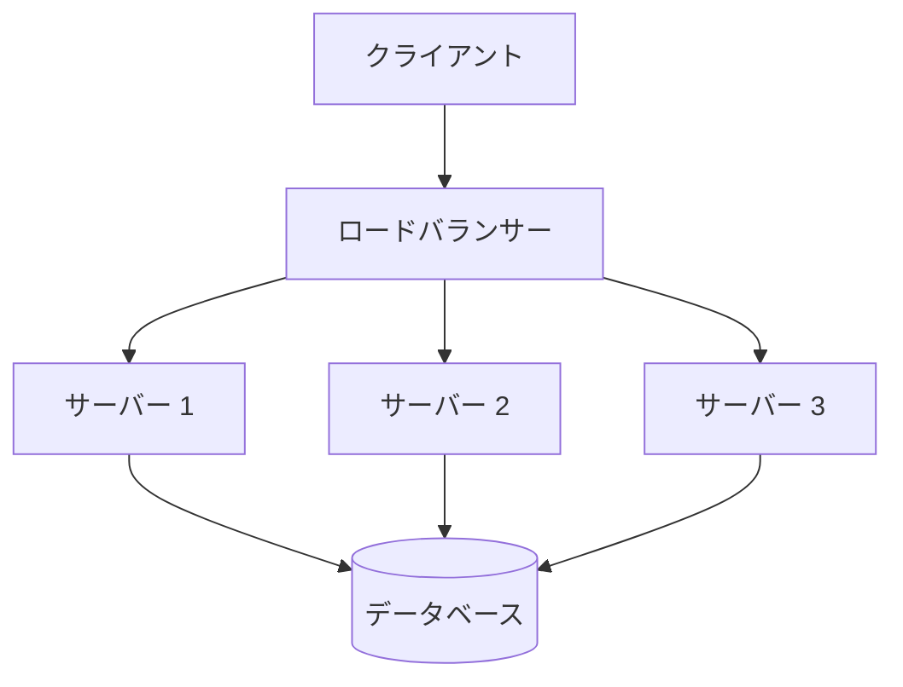
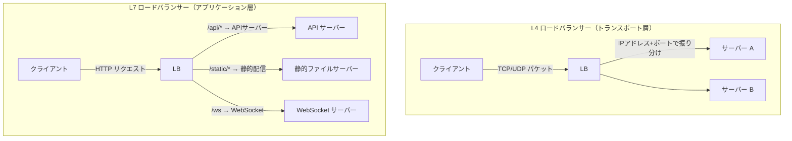

# ロードバランシング

> **一言で言うと:** 1台のサーバーでは処理しきれないトラフィックを複数台に振り分け、スケーラビリティと可用性を実現する仕組み。

## 3分で全体像

- **何を解決する技術か:** 単一サーバーの容量限界（垂直スケールの上限）と単一障害点を解消し、水平スケール・ヘルスチェックによる自動退避・ゼロダウンタイムデプロイ・SSL Termination を一括で実現する
- **代表的な使用シーン:** Web サービスの本番運用全般、Kubernetes の Service / Ingress、AWS ALB/NLB / GCP Load Balancer、Nginx / HAProxy / Envoy などのリバースプロキシ、マイクロサービス間通信のサービスメッシュ（Istio / Linkerd）、ブルーグリーン・カナリアデプロイの切替層
- **これだけは覚える3つ:**
    1. **LB はステートレスを前提にする** — セッションをサーバーメモリに持つアプリは、別サーバーに振り分けられた瞬間にログアウト扱いになる。**Redis 等の外部ストアにセッションを移す**のが LB 配下の必須条件。Sticky Session は応急処置で、SPOF とスケーリング不全の温床
    2. **ヘルスチェックは「実質的なチェック」で「軽い」もの** — 「200 を返すだけ」のエンドポイントは障害を検知できず、逆に「全 DB / 全外部 API を確認」する重いヘルスチェックは LB に毎秒叩かれてサーバーを落とす。**DB の `SELECT 1` 程度の依存先 ping** + 詳細診断は別エンドポイントに分離するのが定石
    3. **L4 と L7 は別物** — L4（TCP/UDP）はパケット転送のみで高速・プロトコル非依存、L7（HTTP）はパスベースルーティング・ヘッダー判定・WAF・SSL Termination が可能だが処理コスト高。**HTTP の中身で振り分けたいなら L7、TCP のまま流したいなら L4**
- **AIに任せやすいか:** **一部任せられる** — Nginx / HAProxy の設定、Kubernetes の Service / Ingress マニフェスト、ヘルスチェックエンドポイントの実装、グレースフルシャットダウンの雛形は AI が書ける。一方で「**ステートをどこに外出しするか**」「**Sticky Session が必要かの判断**」「**ヘルスチェックに何を含めるか**」「**LB 自体の冗長化（Active-Standby / Active-Active）**」はインフラとアプリの整合判断が必要で、人間レビューが必須
- **詰まったらここを読む:** [[CDN]] / [[非同期処理とメッセージキュー]] / [[モニタリング]] / [[キャッシュ戦略]]

## なぜ必要か

どんなに高性能なサーバーでも、処理できるリクエスト数には上限がある（垂直スケーリングの限界）。ロードバランサー（Load Balancer, LB）がなければ、以下の問題が発生する:

- **単一障害点（SPOF: Single Point of Failure）** --- サーバーが1台だけなら、その1台が落ちればサービス全停止
- **スケーリングの壁** --- トラフィック増加に対してCPU/メモリを増強する垂直スケーリングにはハードウェアの物理的限界がある
- **デプロイ時のダウンタイム** --- サーバーが1台では、更新のたびにサービス停止が避けられない
- **リソースの非効率利用** --- 一部のサーバーに負荷が集中し、他のサーバーが遊んでいる状態

## どの問題を解決するか

### 1. 水平スケーリング（Horizontal Scaling）の実現

サーバーを「増やす」ことでキャパシティを拡大する。LBが「どのサーバーにリクエストを送るか」を決定することで、アプリケーションは自身がクラスタの一部であることを意識しなくてよい。


```mermaid
graph TD
    Client[クライアント] --> LB[ロードバランサー]
    LB --> S1[サーバー 1]
    LB --> S2[サーバー 2]
    LB --> S3[サーバー 3]
    S1 --> DB[(データベース)]
    S2 --> DB
    S3 --> DB
```

### 2. ヘルスチェックによる障害の自動排除

LBはバックエンドサーバーに定期的にヘルスチェック（HTTPリクエストやTCP接続確認）を送り、応答がないサーバーを振り分け対象から自動的に除外する。サーバーが復旧すれば自動で再追加される。

### 3. ゼロダウンタイムデプロイ

ローリングデプロイ（Rolling Deploy）やブルーグリーンデプロイ（Blue-Green Deploy）をLBと組み合わせることで、ユーザーに影響を与えずにアプリケーションを更新できる。

### 4. SSL/TLSの終端（SSL Termination）

LBがTLSの暗号化/復号を担い、バックエンドサーバーには平文HTTPで通信する。これによりバックエンドのCPU負荷を軽減し、証明書管理を一元化できる。

## 他の仕組みとどう関係するか

- **下位レイヤーとの関係:**
  - [[TCP-IP]] --- L4ロードバランサーはTCPレベルで動作する。コネクションの確立先をバックエンドに中継し、パケット内容を解析しないため高速
  - [[HTTP-HTTPS]] --- L7ロードバランサーはHTTPヘッダーやURLパスを解析して振り分け先を決定する。パスベースルーティング（`/api/*` はAPIサーバー、`/static/*` はファイルサーバー）が可能
  - [[TLS-SSL]] --- SSL TerminationによりLBがTLSを終端する。バックエンドとの通信にはmTLS（相互TLS）を使うケースもある
  - [[DNS]] --- DNSラウンドロビンは最も原始的なロードバランシングだが、ヘルスチェックがなく障害時にトラフィックが送られ続けるため、単独では不十分
  - [[プロセスとスレッド]] --- バックエンドの各サーバーが何プロセス/何スレッドで動いているかが、1台あたりの処理能力を決める。サーバーの[[ロードアベレージとCPU負荷|ロードアベレージやCPU負荷率]]を把握することで、LBのヘルスチェックやオートスケーリングの閾値設計に活かせる

- **同レイヤーとの関係:**
  - [[CDN]] --- CDNはグローバルなL7ロードバランサーとして機能する。CDNがエッジでの地理的分散、LBがオリジン内での負荷分散を担う。[[DoS攻撃とDDoS攻撃|DDoS]]時にはオートスケールと組み合わせて L7 攻撃のキャパシティを動的に拡張する
  - [[モニタリング]] --- LBのメトリクス（レイテンシ分布、5xxレート、アクティブコネクション数）はシステム健全性の重要な指標
  - [[非同期処理とメッセージキュー]] --- リクエスト処理が重い場合、LBの背後で非同期化してレスポンスタイムを短縮する

- **上位レイヤーとの関係:**
  - [[Layer7-設計アーキテクチャ/_index|設計・アーキテクチャ]] --- マイクロサービスではサービスごとにLBが必要になり、サービスメッシュ（Istio等）やサービスディスカバリ（Consul, Kubernetes Service）がこの問題を解決する

## 誤解されやすいポイント

### 1. 「ロードバランサーを置けば自動的にスケーラブルになる」

LBはリクエストを振り分けるだけで、アプリケーションがステートレスでなければ正しく機能しない。セッション情報をサーバーのメモリに持つアプリケーションは、別サーバーに振り分けられるとセッションが失われる。ステートの外部化（[[キャッシュ戦略|Redis等への外出し]]）が前提条件。

### 2. 「ラウンドロビンで十分」

全サーバーが同じスペックで同じ処理をしている場合はラウンドロビンで問題ないが、実際にはリクエストごとに処理コストが異なる。重いリクエストが特定サーバーに偏ると、均等に振り分けても負荷は不均等になる。Least Connections（最小接続数）やWeighted Round Robin（重み付き）が必要になる場面は多い。

### 3. 「[[L4とL7ロードバランサーの違い|L4とL7の違い]]はパフォーマンスだけ」

L4（トランスポート層）LBはパケットを転送するだけで高速だが、HTTPの内容は見えない。L7（アプリケーション層）LBはリクエスト内容に基づく高度なルーティング（パスベース、ヘッダーベース、Cookieベース）が可能。選択はパフォーマンスだけでなく、必要なルーティング機能で決まる。

### 4. 「Sticky Sessionを使えばステートフルアプリも問題ない」

Sticky Session（セッションアフィニティ）は同じクライアントを同じサーバーに固定する機能だが、以下の問題がある:
- そのサーバーがダウンするとセッションが失われる
- 特定サーバーに負荷が偏りやすい
- スケールイン時にセッション中のユーザーに影響する

Sticky Sessionは移行期の暫定策であり、最終的にはステートの外部化を目指すべき。

## 設計のベストプラクティス

### 推奨パターン

| パターン | 説明 |
|---------|------|
| **ステートレス設計** | セッション・キャッシュを外部ストア（Redis等）に保持し、どのサーバーに振り分けられても同じ結果を返す |
| **ヘルスチェックの多層化** | TCP接続確認だけでなく、アプリケーションレベルの `/health` エンドポイントでDB接続等も検証する |
| **グレースフルシャットダウン** | デプロイ時に処理中のリクエストを完了してから停止する。LBのドレイン（Connection Draining）と組み合わせる |
| **L7パスベースルーティング** | 単一ドメインでAPI・静的ファイル・WebSocketを異なるバックエンドに振り分ける |

### アンチパターン

| アンチパターン | なぜ問題か | 対策 |
|---|---|---|
| サーバーのローカルディスクにファイルを保存 | 他のサーバーからアクセスできない | S3等の共有ストレージを使う |
| ヘルスチェックが常にOKを返す | 障害サーバーにトラフィックが送られ続ける | DB接続・依存サービスの状態も含めた実質的なチェックを実装 |
| LBを単一構成で運用 | LB自体がSPOFになる | Active-Standby またはActive-Active構成にする |
| LBの背後に異なるバージョンのアプリを長時間混在 | API互換性の問題やデバッグ困難 | ローリングデプロイの時間を最小限にし、バージョン情報をレスポンスヘッダーに含める |

## AIエージェントとの協働

> このトピックでAIコーディングエージェント（Claude Code, Copilot, Cursor 等）と協働するための観点。
> Nginx / HAProxy / ALB の設定、ヘルスチェックエンドポイント、グレースフルシャットダウンの雛形は AI に任せやすい。一方で **「セッションをインメモリで持つステートフルなコード」「`/health` で重い処理」「ロギングミドルウェアを `/health` にも適用してディスクを埋める」「`process.exit(0)` を直叩きしてリクエスト中断」**などを AI が量産しがち。AIコードレビュー観点で必ず検出する。

### AIに任せられる部分 / 人間が判断すべき部分

| タスク種類 | 任せ方（実装/レビュー） | 人間の関与 |
|---|---|---|
| Nginx / HAProxy / ALB の設定雛形 | AI 実装、AIコードレビュー観点でレビュー | LB 自体の冗長化（Active-Standby）構成判断は人間 |
| ヘルスチェックエンドポイント（`/health` / `/health/detail`） | AI に2階層化（軽量と詳細）を任せる | 何を依存先として確認するか（DB / Redis / 外部 API）の判断は人間 |
| グレースフルシャットダウンの実装 | AI に SIGTERM ハンドリング + Connection Draining 雛形 | LB ドレインタイムアウトとアプリのシャットダウン猶予の整合は人間判断 |
| Sticky Session の有効化 / 無効化 | AI に Cookie ベースの有効化方法を書かせる | 「そもそも Sticky にすべきか」は人間判断（原則: ステートレス化が先） |
| L4 / L7 の選択 | AI に比較表 | プロトコル要件（WebSocket / gRPC / TCP プレーン）と必要なルーティング機能から人間が決定 |
| Kubernetes Service / Ingress マニフェスト | AI が雛形 | `externalTrafficPolicy: Local` / `Cluster` の選択、Topology Aware Routing は人間判断 |

### AI生成コードのレビュー観点（このトピック固有）

AI生成のサーバー側コードを受け取ったとき、最低限ここを見る。

1. **ステートフル設計が紛れ込んでいないか** — `express-session` のデフォルト（メモリストア）、`new Map()` 等のローカルキャッシュ、ファイルアップロードのローカルディスク保存などが残っていないか。**LB 配下では同一クライアントが毎リクエスト別サーバーに振り分けられる前提**で、Redis / S3 / RDB に外出しされているか。Sticky Session で誤魔化していないか
2. **ヘルスチェックが「重すぎる」または「軽すぎる」** — `/health` で全テーブル `SELECT COUNT(*)`、全外部 API への疎通確認、ファイル I/O などをしていないか（LB から毎秒叩かれてサーバーが落ちる）。逆に `res.send('ok')` だけで DB 接続も検証していないと、DB ダウン中も「健全」を返してトラフィックが流れ続ける。**`/health` は軽量チェック（DB の `SELECT 1` 程度）、`/health/detail` は詳細**の2階層が定石
3. **グレースフルシャットダウンの誤実装** — `process.on('SIGTERM', () => process.exit(0))` のような即時終了が混入していないか。**処理中のリクエストが中断**され、ユーザーは 502 を受け取る。`server.close()` で新規受付停止 → 既存リクエスト完了待ち → タイムアウト後強制終了の順序になっているか。`/health` を 503 に切り替えて LB に振り分けを止めさせる「ドレインモード」が入っているか

### 効くプロンプトの型

このトピックに関する実装をAIに依頼するとき、コンテキストとして渡すべき情報・制約・成功基準のテンプレ。

```
# 前提（プロジェクトの状況・既存のコード規約）
- LB: ALB / Nginx / Kubernetes Service など
- バックエンド: Node.js (Express / Fastify) / Go / Python (FastAPI) / Rails など
- セッション基盤: Redis / DynamoDB / Cookie ベース JWT
- 外部依存: PostgreSQL, Redis, S3, 外部決済 API
- デプロイ方式: ローリング / ブルーグリーン / カナリア
- LB ドレインタイムアウト: 30 秒

# やってほしいこと
- ヘルスチェックエンドポイント（軽量と詳細の2階層）
- グレースフルシャットダウン（SIGTERM 受信 → 新規受付停止 → 既存処理待ち）
- ステートレス設計のレビュー（セッション・キャッシュ・ファイルの外出し確認）

# 守ってほしい制約（このトピック固有のもの）
- ヘルスチェックは軽量（依存先 ping 程度）に留め、詳細診断は別エンドポイント
- ヘルスチェックのアクセスログはノイズになるため除外
- セッション・キャッシュは Redis 等の外部ストアに外出し（インメモリ禁止）
- ファイルアップロードはオブジェクトストレージ（S3 等）
- グレースフルシャットダウンは `server.close()` + ドレイン
- シャットダウン中は `/health` を 503 で返して LB から外す
- 強制終了タイムアウトは LB ドレインタイムアウトより少し長く

# 完了の判断基準
- LB 配下で複数インスタンスを起動し、ローリングデプロイ中もリクエストが落ちない
- DB ダウン時にヘルスチェックが 503 を返し、LB から該当インスタンスが外れる
- アクセスログから `/health` ノイズが除外されている
```

### AI実装のアンチパターン

LLM生成コードで頻出する過剰設計・誤用パターン。レビュー時の照合表として使う。

| アンチパターン | なぜ問題か | レビュー観点 / 対策 |
|---|---|---|
| セッションをインメモリストアに保存（`express-session` のデフォルト等） | 別サーバーに振り分けられた瞬間にログアウト | Redis / DynamoDB 等の外部ストアに移行、または Cookie ベース JWT |
| アップロードファイルをローカルディスクに保存 | 別サーバーから取得できない、再起動で消える | S3 等のオブジェクトストレージに保存 |
| ヘルスチェックで全テーブル `SELECT COUNT(*)` や全外部 API 確認 | LB の高頻度ポーリングでサーバーが落ちる | `SELECT 1` 程度の軽量チェック、詳細診断は別エンドポイントに分離 |
| ヘルスチェックが `res.send('ok')` のみ | DB ダウン中も健全と返してトラフィックが流れ続ける | DB の単純疎通確認は最低限含める |
| 全アクセスログ収集ミドルウェアを `/health` にも適用 | LB のヘルスチェック高頻度でログ容量を圧迫 | パスでフィルタしてヘルスチェックは除外 |
| `process.on('SIGTERM', () => process.exit(0))` で即時終了 | 処理中リクエストが中断、ユーザーが 502 を受け取る | `server.close()` + 既存処理完了待ち + タイムアウト後強制終了 |
| Sticky Session で「ステートフルでも動く」と判断 | サーバー停止でセッション喪失、負荷が偏る、スケールイン時に影響 | ステートを外部化、Sticky は移行期の暫定策 |
| Cookie 認証をクライアント IP でハッシュ Sticky | プロキシ経由で IP がまとまり負荷偏在、CGN 配下のユーザーが同サーバーに集中 | Application Load Balancing の Cookie ベース、または完全ステートレス |
| LB を単一構成で運用 | LB 自体が SPOF | Active-Standby または Active-Active、マネージド LB を選ぶ |
| `Connection: keep-alive` の TTL がアップストリームより長い | LB が閉じる前にアップストリームが閉じて 502 | アップストリーム側の keepalive_timeout を LB より長く |
| `X-Forwarded-For` を信頼してクライアント IP として使用 | スプーフィング可能、レート制限・監査が崩れる | `trust proxy` を信頼できる LB レイヤー数だけに制限 |
| Round Robin 一択 | リクエストごとの処理コスト差が反映されず負荷偏在 | Least Connections / Random with Two Choices を検討 |

→ レイヤー横断のアンチパターン索引: [[_anti-patterns/_index|AIアンチパターン索引]] / [[_anti-patterns/レイヤー別/Layer5|Layer 5 パフォーマンス アンチパターン集]]

## 具体例

### Nginxによるリバースプロキシ/LB設定

```nginx
upstream app_servers {
    # Least Connections アルゴリズム
    least_conn;

    server 10.0.1.1:3000 weight=3;  # 高スペックサーバーに重み付け
    server 10.0.1.2:3000 weight=1;
    server 10.0.1.3:3000 weight=1;
    server 10.0.1.4:3000 backup;     # 他が全滅したときのみ使用
}

server {
    listen 443 ssl;
    server_name example.com;

    # SSL Termination
    ssl_certificate     /etc/ssl/certs/example.com.pem;
    ssl_certificate_key /etc/ssl/private/example.com.key;

    # ヘルスチェック（Nginx Plus / OpenResty で利用可能）
    # OSS版Nginxは max_fails + fail_timeout でパッシブチェック
    location / {
        proxy_pass http://app_servers;
        proxy_set_header Host $host;
        proxy_set_header X-Real-IP $remote_addr;
        proxy_set_header X-Forwarded-For $proxy_add_x_forwarded_for;
        proxy_set_header X-Forwarded-Proto $scheme;

        # Connection Draining: タイムアウトを設定
        proxy_connect_timeout 5s;
        proxy_read_timeout 60s;
    }
}
```

### Express.jsのヘルスチェックエンドポイント

```javascript
// health.js - ヘルスチェックルーター
const express = require('express');
const router = express.Router();
const db = require('./db');

// 軽量チェック（LBのヘルスチェック用）
router.get('/health', async (req, res) => {
  try {
    await db.query('SELECT 1');
    res.status(200).json({ status: 'ok' });
  } catch (err) {
    res.status(503).json({ status: 'unhealthy', reason: 'db_unreachable' });
  }
});

// 詳細チェック（運用チーム向け）
router.get('/health/detail', async (req, res) => {
  const checks = {
    db: await checkDb(),
    redis: await checkRedis(),
    disk: checkDiskSpace(),
    memory: process.memoryUsage(),
    uptime: process.uptime(),
  };
  const healthy = checks.db.ok && checks.redis.ok;
  res.status(healthy ? 200 : 503).json(checks);
});

module.exports = router;
```

### グレースフルシャットダウンの実装

```javascript
// server.js
const express = require('express');
const app = express();

let isShuttingDown = false;

// シャットダウン判定ミドルウェアはルート定義より前に配置する
// LBがヘルスチェックで503を受け取り、新規リクエストの振り分けを停止する
app.use((req, res, next) => {
  if (isShuttingDown) {
    res.set('Connection', 'close');
    return res.status(503).json({ error: 'Server is shutting down' });
  }
  next();
});

// ルート定義（シャットダウンミドルウェアの後に配置）
const routes = require('./routes');
app.use(routes);

const server = app.listen(3000);

function gracefulShutdown(signal) {
  console.log(`${signal} received. Starting graceful shutdown...`);
  isShuttingDown = true;

  // 新規接続の受付を停止し、既存リクエストの完了を待つ
  server.close(() => {
    console.log('All connections closed. Exiting.');
    process.exit(0);
  });

  // 強制終了のタイムアウト（30秒）
  setTimeout(() => {
    console.error('Forced shutdown after timeout');
    process.exit(1);
  }, 30000);
}

process.on('SIGTERM', () => gracefulShutdown('SIGTERM'));
process.on('SIGINT', () => gracefulShutdown('SIGINT'));
```

### L4 vs L7 ロードバランサーの比較


```mermaid
graph TD
    subgraph L4["L4 ロードバランサー（トランスポート層）"]
        L4_Client[クライアント] -->|TCP/UDP パケット| L4_LB[LB]
        L4_LB -->|IPアドレス+ポートで振り分け| L4_S1[サーバー A]
        L4_LB --> L4_S2[サーバー B]
    end

    subgraph L7["L7 ロードバランサー（アプリケーション層）"]
        L7_Client[クライアント] -->|HTTP リクエスト| L7_LB[LB]
        L7_LB -->|"/api/* → APIサーバー"| L7_API[API サーバー]
        L7_LB -->|"/static/* → 静的配信"| L7_Static[静的ファイルサーバー]
        L7_LB -->|"/ws → WebSocket"| L7_WS[WebSocket サーバー]
    end
```

### 主要なロードバランシングアルゴリズム

| アルゴリズム | 動作 | 適するケース |
|---|---|---|
| **Round Robin** | 順番に振り分け | 全サーバー同スペック、リクエスト処理コストが均一 |
| **Weighted Round Robin** | 重み付きで順番に振り分け | サーバースペックが異なる場合 |
| **Least Connections** | 接続数が最少のサーバーに振り分け | リクエスト処理時間にばらつきがある場合 |
| **IP Hash** | クライアントIPのハッシュで固定サーバーに振り分け | 簡易的なセッション維持（非推奨） |
| **Random with Two Choices** | ランダムに2台選び、接続数が少ない方を選択 | 大規模環境で Least Connections のオーバーヘッドを避けたい場合 |

## 参考リソース

- [Nginx Reverse Proxy Guide](https://docs.nginx.com/nginx/admin-guide/web-server/reverse-proxy/) --- Nginx公式のリバースプロキシ設定ガイド
- [AWS Elastic Load Balancing Documentation](https://docs.aws.amazon.com/elasticloadbalancing/) --- ALB/NLBの公式ドキュメント
- [High Performance Browser Networking (Ilya Grigorik)](https://hpbn.co/) --- ネットワークレイヤーからのパフォーマンス理解
- [The System Design Primer - Load Balancer](https://github.com/donnemartin/system-design-primer#load-balancer) --- システム設計の文脈でのLB解説

## 理解度セルフチェック

> 答えられなければ本文に戻る。答えはこのファイル内に必ずある。

1. **「ロードバランサーを置けば自動的にスケーラブル」が誤りである理由を、ステートレス設計と Sticky Session の限界に触れて30秒で説明せよ。**
2. **`/health` エンドポイントを「軽量チェック」と「詳細チェック」の2階層に分ける理由を、ヘルスチェック頻度とサーバー負荷の観点から答えよ。** 逆に「軽すぎる `/health`」がなぜ危険かにも触れること。
3. **AI生成コードレビュー設問:** AI が「LB 配下で動く Express サーバーを実装」として以下のコードを生成した。本文の観点で **問題点を最低3つ** 指摘せよ。

```javascript
const express = require('express');
const session = require('express-session');
const multer = require('multer');
const db = require('./db');

const app = express();

// セッション管理
app.use(session({
  secret: process.env.SESSION_SECRET,
  resave: false,
  saveUninitialized: false,
  // ストア未指定（デフォルトはメモリストア）
}));

// アクセスログ
app.use((req, res, next) => {
  console.log(`${new Date().toISOString()} ${req.method} ${req.url}`);
  next();
});

// ファイルアップロード（ローカルディスク）
const upload = multer({ dest: '/var/uploads/' });
app.post('/upload', upload.single('file'), (req, res) => {
  res.json({ path: req.file.path });
});

// ヘルスチェック
app.get('/health', async (req, res) => {
  // 全テーブルの件数を確認して詳細を返す
  const userCount = await db.query('SELECT COUNT(*) FROM users');
  const orderCount = await db.query('SELECT COUNT(*) FROM orders');
  const productCount = await db.query('SELECT COUNT(*) FROM products');
  const externalApiOk = await fetch('https://payment-api.example.com/ping');
  res.json({
    status: 'ok',
    counts: { userCount, orderCount, productCount },
    paymentApi: externalApiOk.ok,
  });
});

const server = app.listen(3000);

// シャットダウン処理
process.on('SIGTERM', () => {
  console.log('SIGTERM received');
  process.exit(0);
});
```

> [!note]- 解答の指針
>
> > [!info] 用語ミニ辞典
> > - **ステートレス (Stateless):** サーバーがリクエスト間で状態を持たない設計。どのサーバーに振り分けられても同じ結果を返せる。LB 配下の必須条件
> > - **Sticky Session (Session Affinity):** Cookie や IP ハッシュで同じクライアントを同じサーバーに固定する仕組み。ステートフルアプリの応急処置だが、サーバー障害でセッション喪失・負荷偏在・スケールイン時の影響などの問題を抱える
> > - **ヘルスチェック (Health Check):** LB がバックエンドの稼働状態を確認するための定期的なリクエスト。応答がないサーバーを自動で振り分け対象から外す
> > - **グレースフルシャットダウン (Graceful Shutdown):** SIGTERM 受信時に新規受付を止め、処理中リクエストの完了を待ってから終了する手順。`server.close()` 系 + タイムアウトが定石
> > - **Connection Draining:** LB が「もうこのサーバーには新規振り分けしない」と宣言して、既存接続が完了するまで一定時間待つ機能。ALB / NLB / Nginx Plus などが提供
> > - **L4 (Layer 4) LB:** TCP / UDP レベルで動作。パケット転送のみで HTTP の中身は見ない。NLB、HAProxy の `mode tcp` など。高速・プロトコル非依存
> > - **L7 (Layer 7) LB:** HTTP レベルで動作。パスベースルーティング、ヘッダー判定、SSL Termination が可能。ALB、Nginx、Envoy など
> > - **SPOF (Single Point of Failure):** 単一障害点。1 箇所が落ちると全停止。LB 自身を冗長化しないと SPOF 化する
> > - **Round Robin / Least Connections:** 振り分けアルゴリズム。Round Robin は順番に、Least Connections は接続数が最少のサーバーに送る。処理時間にばらつきがある場合は Least Connections の方が均等
> > - **`X-Forwarded-For`:** プロキシ通過時に元のクライアント IP を引き継ぐヘッダー。改ざん可能なため、信頼できる LB 経由のものだけ採用する設定が必要
> > - **`externalTrafficPolicy`:** Kubernetes Service の設定。`Cluster` は全 Node に分散、`Local` は同 Node の Pod のみに送り source IP を保つ
> > - **OOM Killer:** メモリ不足時にプロセスを強制終了する Linux カーネル機能。グレースフルでない停止の典型例
>
> 1. **LB はリクエストを振り分けるだけ**で、アプリケーションがステートレスでなければ正しく機能しない。セッションをサーバーのメモリに持つアプリは、別サーバーに振り分けられた瞬間にセッションが失われ、ユーザーは強制ログアウトになる。Sticky Session（Cookie や IP ハッシュで同じサーバーに固定）は応急処置だが、(a) **そのサーバーがダウンするとセッション喪失**、(b) **特定サーバーに負荷が偏りやすい**、(c) **スケールイン（インスタンス削減）時にセッション中のユーザーに影響**、の3つの欠点を持つ。最終形は **Redis / DynamoDB 等の外部ストアにセッションを移し**、どのサーバーが受けても同じ動作になる完全ステートレス。LB は「スケーラビリティを実現する道具」であって、自動的にスケーラブルにする魔法ではなく、**アプリ側のステートレス化が前提条件**になっている
> 2. **ヘルスチェックは LB から「毎秒〜数秒間隔」で全インスタンスに飛んでくる**ため、1 回のチェックコストがそのまま定常負荷になる。`/health` で全テーブル `SELECT COUNT(*)` や全外部 API 疎通確認をすると、ヘルスチェック自体がサーバー負荷を上げてアプリのスループットを食う、最悪の場合 DB を詰まらせて障害を引き起こす。一方で **「軽すぎる」`res.send('ok')` だけ**では DB がダウンしていても 200 を返し続け、LB は健全と判断してトラフィックを流し続ける（実際にはエラーを返すサーバーに流し続ける状態）。バランス点が **「軽量チェック（DB の `SELECT 1` 程度）= 致命的依存先の単純疎通確認」+ 詳細診断は別エンドポイント**。`/health/detail` のような重いチェックは LB ではなく運用ダッシュボード・人間のオペレーターが叩く想定にし、LB のポーリングからは除外する。さらに**ヘルスチェックパスはアクセスログから除外**してログ容量も抑える
> 3. AI生成コードの問題点（最低限以下を指摘できれば本文を理解している）:
>     - **`express-session` のデフォルトメモリストア使用** — 別サーバーに振り分けられた瞬間にログアウト。本番では起動時に warning が出る（"connect.session() MemoryStore is not designed for a production environment"）が、無視されがち。`connect-redis` 等で Redis に外出し
>     - **`multer({ dest: '/var/uploads/' })` でローカルディスク保存** — 別サーバーから取得できず、コンテナ再起動で消失。`multer-s3` で S3 にアップロード、または一時ディレクトリ経由で S3 に転送
>     - **`/health` で全テーブル件数 + 外部 API 疎通の重い処理** — LB から毎秒叩かれてサーバーが落ちる原因に。`SELECT 1` 程度の軽量化、詳細は `/health/detail` に分離。さらに**外部決済 API の疎通失敗で自分のヘルスチェックが落ちる**（外部障害が自サービス障害に化ける）のも設計ミス
>     - **アクセスログミドルウェアが `/health` も全部出力** — ヘルスチェック高頻度でログ容量圧迫。`if (req.url === '/health') return next()` でスキップ、または pino + pino-http のフィルタを使う
>     - **`process.exit(0)` の即時終了** — 処理中リクエストが中断され、ユーザーが 502 を受け取る。`server.close()` で新規受付停止 → 既存リクエスト完了待ち → タイムアウト後強制終了が正しい
>     - **シャットダウン中の `/health` が 503 にならない** — LB が「健全」と判断し続けて新規リクエストを送り、シャットダウン中のサーバーで処理失敗する。`isShuttingDown` フラグで `/health` を 503 に切り替える「ドレインモード」が必要
>     - **`SIGINT` ハンドリングなし** — `kubectl delete pod` や Docker stop は SIGTERM、Ctrl+C は SIGINT。両方を扱う
>     - **`session.secret` を `process.env.SESSION_SECRET` から取得は OK だが、本番でデフォルト値や hardcode に fallback していないか要確認** — 環境変数未設定でデフォルト平文値だとセッションハイジャックの足がかり
>     - **`saveUninitialized: false` は OK** — ただし `cookie: { secure: true, httpOnly: true, sameSite: 'lax' }` などのセキュリティ設定が抜けている（[[認証と認可]] 観点）
>     - **`console.log` での非構造化アクセスログ** — JSON 化して `pino` 等のロガーへ。本番で grep / 集約困難（[[モニタリング]] 観点）
>     - **`X-Forwarded-For` の trust proxy 設定なし** — LB 経由のクライアント IP を取得する場合は `app.set('trust proxy', 1)` 等の設定が必要、ただし**信頼できる段数だけに制限**しないと IP スプーフィング可能

## 学習メモ

（個人的な気づき・疑問・TODO）
