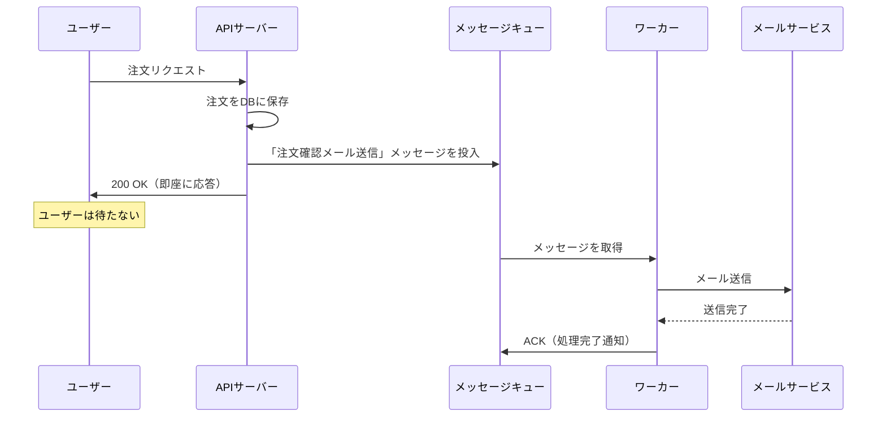
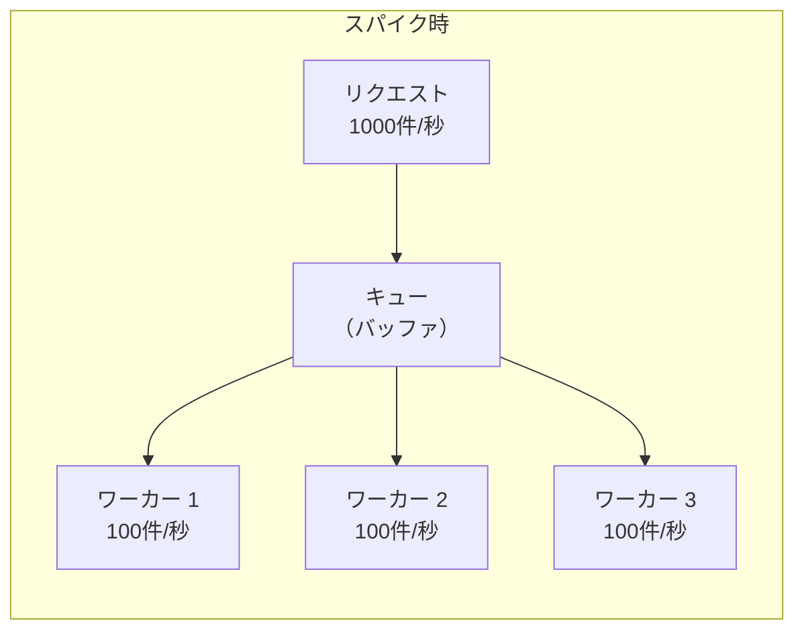
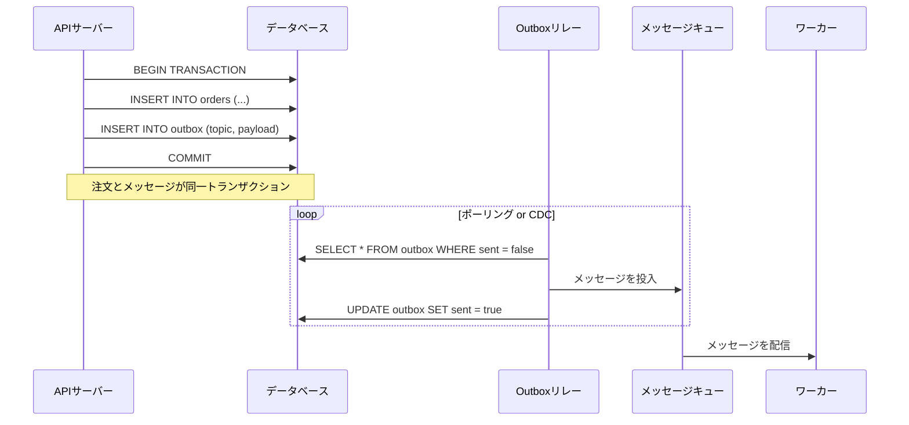

# 非同期処理とメッセージキュー

> **一言で言うと:** 「今すぐやらなくていい処理」をリクエストの流れから切り離し、応答速度と耐障害性を両立させる仕組み。

## なぜ必要か

Webアプリケーションのリクエスト処理には「ユーザーが待っている間に完了すべきこと」と「後でやっても構わないこと」がある。メール送信、PDF生成、画像リサイズ、外部API呼び出し、レポート集計---これらをリクエスト処理の中で同期的に実行すると:

- **レスポンスタイムの悪化** --- メール送信に3秒かかれば、ユーザーは注文完了画面を3秒待たされる
- **障害の連鎖** --- 外部メールサービスがダウンすると、注文処理自体が失敗する（本来無関係な障害が波及する）
- **スパイク時の全滅** --- 一時的にリクエストが集中すると、重い処理がサーバーリソースを食い尽くし、軽い処理まで巻き添えで遅延する
- **リトライの困難** --- 同期処理で失敗した場合、ユーザーに「もう一度やってください」と頼むしかない

## どの問題を解決するか

### 1. 処理の分離（Decoupling）

メッセージキュー（Message Queue, MQ）は**プロデューサー（Producer）**と**コンシューマー（Consumer）**を分離する。プロデューサーはメッセージをキューに入れるだけで即座に応答し、コンシューマーが自分のペースでメッセージを取り出して処理する。



### 2. 負荷の平準化（Load Leveling）

トラフィックのスパイク時、キューがバッファとして機能する。リクエストが毎秒1000件来ても、ワーカーが毎秒100件のペースで処理すれば、キューに溜まりはするが処理は確実に完了する。サーバーが過負荷で落ちるよりはるかに安全。



### 3. 信頼性のある配信（Reliable Delivery）

メッセージキューは**at-least-once delivery**（少なくとも1回の配信）を保証する。コンシューマーが処理に失敗してもメッセージはキューに残り、リトライされる。一定回数失敗したメッセージはデッドレターキュー（Dead Letter Queue, DLQ）に移動し、後から調査・再処理できる。

### 4. システム間の疎結合

マイクロサービスアーキテクチャでは、サービス間の直接的なHTTP呼び出しは密結合を生む。メッセージキューを介することで、各サービスは互いの存在を知らなくても連携できる（イベント駆動アーキテクチャ）。

## 他の仕組みとどう関係するか

- **下位レイヤーとの関係:**
  - [[並行性の基本概念]] --- メッセージキューの消費は本質的に並行処理。複数ワーカーが同じキューから読む場合の競合制御（メッセージの可視性タイムアウト等）は並行性の応用
  - [[プロセスとスレッド]] --- ワーカーはAPIサーバーとは別プロセスで動くことが多い。Node.jsではBullMQのワーカー、Pythonではceleryのワーカーなど
  - [[TCP-IP]] --- メッセージブローカー（RabbitMQ, Redis等）との通信はTCP上で行われる。AMQPプロトコルはTCP上に構築されている

- **同レイヤーとの関係:**
  - [[ロードバランシング]] --- LBがリクエストを分散し、メッセージキューがバックグラウンド処理を分散する。両者は異なるレイヤーでの負荷分散
  - [[モニタリング]] --- キューの深さ（Queue Depth）、処理遅延（Processing Lag）、DLQのメッセージ数は重要な監視指標。キューが溜まり続けるのはワーカー能力不足のシグナル
  - [[キャッシュ戦略]] --- キャッシュの事前生成（Cache Warming）を非同期ジョブとして実行するパターンがある

- **上位レイヤーとの関係:**
  - [[Layer7-設計アーキテクチャ/_index|設計・アーキテクチャ]] --- イベント駆動アーキテクチャ、CQRS、Saga パターンなど、メッセージキューは高度なアーキテクチャパターンの基盤技術

## 誤解されやすいポイント

### 1. 「非同期処理 = メッセージキュー」

プログラミング言語レベルの非同期（async/await, Promise, goroutine）とインフラレベルのメッセージキューは別物。async/awaitは1つのリクエスト内でI/O待ちを効率化する仕組みであり、メッセージキューはリクエストの境界を超えて処理を分離する仕組み。両者は補完的であり、代替関係ではない。

### 2. 「メッセージは必ず1回だけ処理される」

ほとんどのメッセージキューは**at-least-once**（少なくとも1回）を保証する。ネットワーク障害やワーカーのクラッシュにより、同じメッセージが2回以上配信されることがある。コンシューマーは**冪等（Idempotent）**に設計する必要がある---つまり同じメッセージを何回処理しても結果が変わらないようにする。

### 3. 「キューに入れれば処理は保証される」

キューに投入する前にプロデューサーがクラッシュすれば、メッセージは失われる。「DBに注文を保存」と「キューにメッセージを投入」の間で障害が起きるケースへの対策が必要。Transactional Outbox パターン（DBトランザクションと同じトランザクション内でoutboxテーブルにメッセージを書き、別プロセスがoutboxからキューに転送する）がこの問題を解決する。

### 4. 「メッセージの順序は保証される」

標準的なキューでは、複数のコンシューマーが並行処理するため順序は保証されない。順序が重要な場合はFIFOキュー（SQS FIFO等）を使うか、パーティションキー（Kafka）で同じキーのメッセージを同じパーティションに送る必要がある。ただしFIFOキューはスループットが制限される。

## 設計のベストプラクティス

### 推奨パターン

| パターン | 説明 |
|---------|------|
| **冪等なコンシューマー** | メッセージIDをキーとした重複チェック、またはDB操作自体を冪等にする（`INSERT ... ON CONFLICT DO NOTHING`等） |
| **Transactional Outbox** | ビジネスロジックのDB書き込みとメッセージ投入を同一トランザクションで保証する |
| **Dead Letter Queue（DLQ）** | 一定回数失敗したメッセージを隔離し、後から調査・再処理できるようにする |
| **Visibility Timeout の適切な設定** | 処理時間の見積もり + マージンを設定。短すぎると重複処理、長すぎるとリトライが遅延 |
| **バックプレッシャー** | コンシューマーの処理能力に応じてメッセージの取得量を調整する |

### アンチパターン

| アンチパターン | なぜ問題か | 対策 |
|---|---|---|
| メッセージに巨大なペイロードを含める | キューの容量圧迫、転送遅延 | メッセージにはIDやURLのみ含め、データ本体はS3やDBに格納 |
| エラー時に無限リトライ | 恒久的なエラー（不正データ等）は何度リトライしても成功しない | 最大リトライ回数を設定し、超過したらDLQに移動 |
| 非同期にすべき処理を同期で実行 | レスポンスタイム悪化、障害の連鎖 | 「ユーザーが結果を今すぐ必要か？」を基準に判断 |
| 同期にすべき処理を非同期にする | 処理結果をユーザーに返せない | 決済処理の成否のように即時フィードバックが必要なものは同期で |

## AIによる実装のアンチパターン

| アンチパターン | なぜ問題か | 対策 |
|---|---|---|
| メッセージハンドラ内で外部APIを複数回呼び出し、途中で失敗した場合のリトライで二重実行 | 冪等性を考慮していない | 各外部呼び出しに一意キーを付与し、重複チェックを実装 |
| キューのコンシューマーにグローバルなtry-catchを置いて全エラーを握りつぶす | 失敗が検知されず、メッセージがACKされて消失する | エラーの種類を区別し、リトライ可能なエラーはNACK、不正データはDLQへ |
| 全ての処理を非同期化して「高速化」を図る | ユーザーへの即時フィードバックが必要な処理まで遅延する | 非同期化の判断基準を「ユーザーが結果を待つか」で設計する |

## 具体例

### BullMQ（Node.js）によるジョブキュー

```javascript
// producer.js - APIサーバー側
const { Queue } = require('bullmq');
const connection = { host: 'localhost', port: 6379 };

const emailQueue = new Queue('email', { connection });

// 注文完了時にメール送信ジョブを投入
async function placeOrder(order) {
  await db.orders.create(order);

  await emailQueue.add('order-confirmation', {
    orderId: order.id,
    email: order.customerEmail,
  }, {
    attempts: 3,                    // 最大3回リトライ
    backoff: { type: 'exponential', delay: 1000 }, // 1s, 2s, 4s
    removeOnComplete: 1000,         // 完了済みジョブは1000件まで保持
    removeOnFail: 5000,             // 失敗ジョブは5000件まで保持
  });

  return { status: 'order_placed' }; // 即座に応答
}
```

```javascript
// worker.js - ワーカープロセス（APIとは別プロセスで起動）
const { Worker } = require('bullmq');
const connection = { host: 'localhost', port: 6379 };

const worker = new Worker('email', async (job) => {
  const { orderId, email } = job.data;

  // 冪等性チェック: 同じ注文に対して二重送信しない
  const alreadySent = await db.emailLogs.findOne({
    orderId,
    type: 'order-confirmation',
  });
  if (alreadySent) {
    console.log(`Email already sent for order ${orderId}, skipping`);
    return;
  }

  await mailService.send({
    to: email,
    template: 'order-confirmation',
    data: await db.orders.findById(orderId),
  });

  // 送信記録を保存（冪等性の保証）
  await db.emailLogs.create({ orderId, type: 'order-confirmation' });
}, { connection, concurrency: 5 });

worker.on('failed', (job, err) => {
  console.error(`Job ${job.id} failed: ${err.message}`);
});
```

### Celery（Python）によるタスクキュー

```python
# tasks.py
from celery import Celery

app = Celery('tasks', broker='redis://localhost:6379/0')

@app.task(
    bind=True,
    max_retries=3,
    default_retry_delay=60,  # 60秒後にリトライ
    acks_late=True,          # 処理完了後にACK（途中クラッシュ時にリトライ可能）
)
def generate_report(self, report_id):
    try:
        report = db.reports.get(report_id)
        if report.status == 'completed':
            return  # 冪等性: 既に完了済みなら何もしない

        data = fetch_analytics_data(report.params)
        pdf = render_pdf(data)
        storage.upload(f'reports/{report_id}.pdf', pdf)

        db.reports.update(report_id, status='completed')
    except ExternalServiceError as exc:
        # リトライ可能なエラー
        raise self.retry(exc=exc)
    except InvalidDataError:
        # リトライしても解決しないエラー → DLQへ
        db.reports.update(report_id, status='failed')
        raise  # Celeryがmax_retries後にDLQ相当の処理を行う
```

```bash
# ワーカーの起動（APIサーバーとは別プロセス）
celery -A tasks worker --loglevel=info --concurrency=4
```

### Transactional Outbox パターン



```sql
-- outbox テーブルの定義
CREATE TABLE outbox (
    id          BIGSERIAL PRIMARY KEY,
    topic       VARCHAR(255) NOT NULL,
    payload     JSONB NOT NULL,
    created_at  TIMESTAMPTZ NOT NULL DEFAULT NOW(),
    sent        BOOLEAN NOT NULL DEFAULT FALSE
);

-- 注文作成と同一トランザクション内でoutboxに書き込む
BEGIN;
INSERT INTO orders (customer_id, total) VALUES (42, 9800);
INSERT INTO outbox (topic, payload) VALUES (
    'order.created',
    '{"order_id": 123, "customer_id": 42, "total": 9800}'
);
COMMIT;
```

### 主要なメッセージキュー/ブローカーの比較

| サービス | 特徴 | 適するケース |
|---|---|---|
| **Redis + BullMQ** | 軽量、セットアップ簡単、Node.jsエコシステム | 中小規模のジョブキュー |
| **RabbitMQ** | AMQP準拠、柔軟なルーティング、Exchange/Binding | 複雑なルーティングが必要なシステム |
| **Amazon SQS** | フルマネージド、スケーリング不要 | AWSインフラ上の汎用キュー |
| **Apache Kafka** | 高スループット、永続ログ、リプレイ可能 | イベントストリーミング、大規模データパイプライン |
| **Celery** | Pythonタスクキューフレームワーク（ブローカーにRedis/RabbitMQ使用） | Pythonアプリのバックグラウンドジョブ |

## 参考リソース

- [RabbitMQ Tutorials](https://www.rabbitmq.com/tutorials) --- メッセージキューの基本パターンを段階的に学べる公式チュートリアル
- [Designing Data-Intensive Applications (Martin Kleppmann)](https://dataintensive.net/) --- Chapter 11 "Stream Processing" がメッセージングの理論を網羅
- [BullMQ Documentation](https://docs.bullmq.io/) --- Node.jsでのジョブキュー実装のリファレンス
- [Enterprise Integration Patterns](https://www.enterpriseintegrationpatterns.com/) --- メッセージングパターンの古典的カタログ

## 学習メモ

（個人的な気づき・疑問・TODO）
