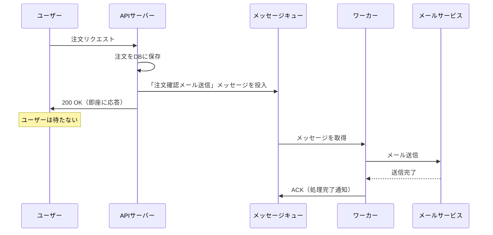
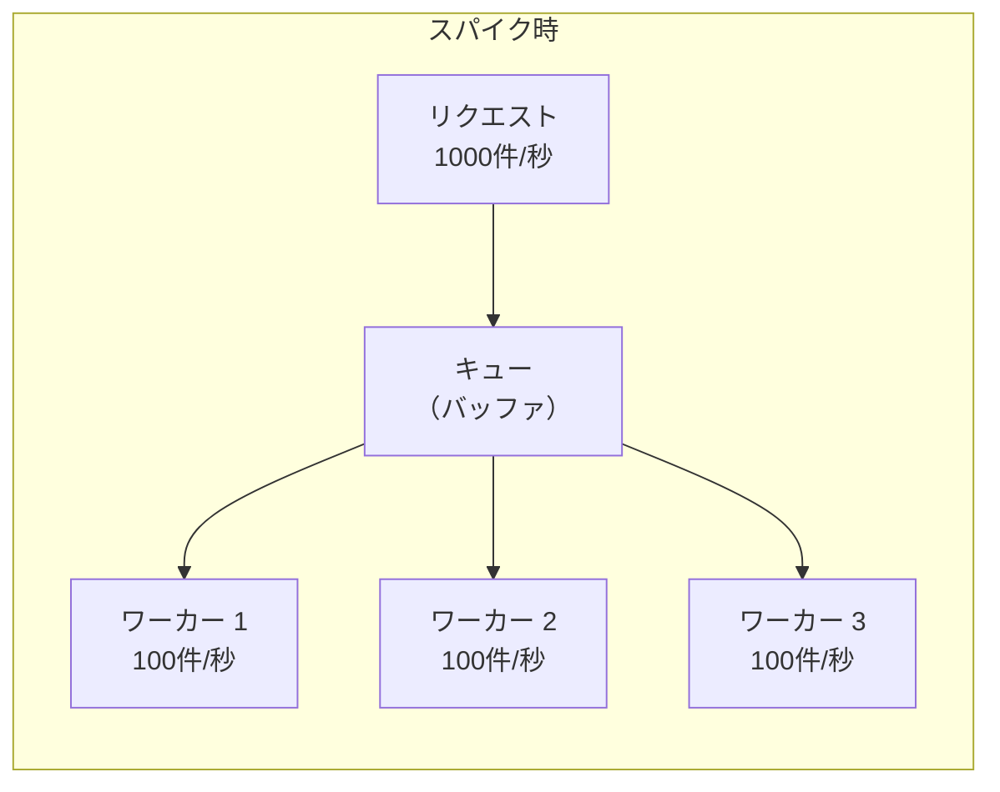
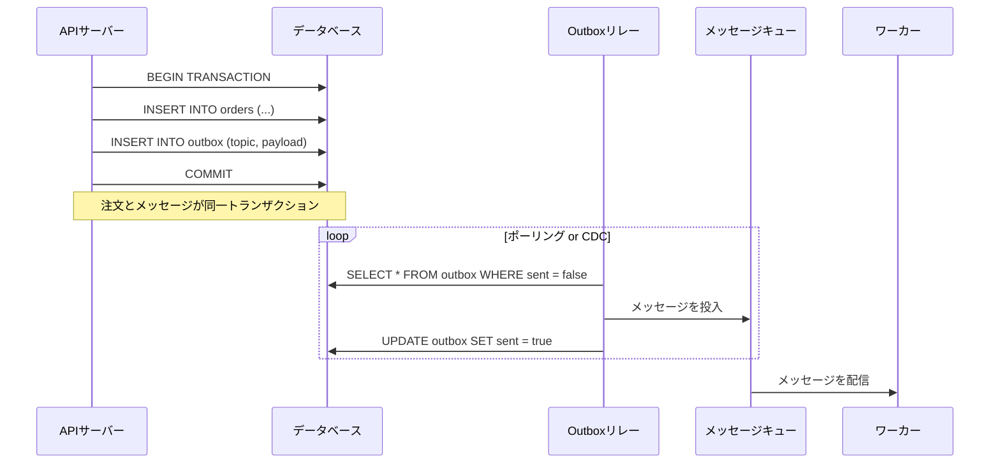

# 非同期処理とメッセージキュー

> **一言で言うと:** 「今すぐやらなくていい処理」をリクエストの流れから切り離し、応答速度と耐障害性を両立させる仕組み。

## 3分で全体像

- **何を解決する技術か:** リクエスト処理の中で同期実行すると遅くなる・障害が連鎖する処理（メール送信・PDF生成・外部API呼び出し・レポート集計）を、Producer/Consumer モデルで分離して、レスポンスを即座に返しつつ確実な処理を保証する
- **代表的な使用シーン:** 注文確認メール送信、画像/動画のリサイズ・変換、PDF レポート生成、外部 API への通知（Webhook 配信）、バッチジョブのスケジュール実行、マイクロサービス間のイベント駆動連携、Kafka を使ったイベントストリーミング
- **これだけは覚える3つ:**
    1. **配信は基本 at-least-once、コンシューマは冪等に書く** — 「メッセージは正確に1回」は分散システムでは実現困難。リトライやネットワーク障害で**同じメッセージが2回以上届く前提**で、ハンドラは「同じメッセージを何回処理しても結果が変わらない」（冪等）に書く。メッセージ ID + 重複チェックテーブル、`INSERT ... ON CONFLICT DO NOTHING`、外部 API への idempotency key 付与が定石
    2. **DB 書き込み + キュー投入は同一トランザクションにできない → Transactional Outbox** — 「注文を DB に保存してからキューにメッセージ投入」の間でクラッシュするとメッセージが失われる。**同じ DB トランザクション内で `outbox` テーブルにも書き、別プロセスが outbox からキューに転送**するパターンが定石。Debezium 等の CDC ツールでも代替可
    3. **何でも非同期化すれば速い、ではない** — 「ユーザーが結果を今すぐ必要か」で判断する。決済処理の成否のような即時フィードバックが必要なものを非同期化すると、ユーザーは「成功したか」を確認できない。**非同期 = 遅延の許容**であり、用途を選ぶ
- **AIに任せやすいか:** **一部任せられる** — BullMQ / Celery / SQS / Kafka などのライブラリ呼び出しと Producer/Consumer の雛形は AI が書ける。一方で **「冪等性をどう保証するか」「DLQ（Dead Letter Queue）の設計」「Visibility Timeout の値」「順序保証が必要かどうか」「Outbox パターンの採用判断」**は要件分析を伴うため人間判断が必須。誤ると重複送金・メッセージロスト・無限リトライといった事故になる
- **詰まったらここを読む:** [[並行性の基本概念]] / [[モニタリング]] / [[RDB]] / [[ロードバランシング]]

## なぜ必要か

Webアプリケーションのリクエスト処理には「ユーザーが待っている間に完了すべきこと」と「後でやっても構わないこと」がある。メール送信、PDF生成、画像リサイズ、外部API呼び出し、レポート集計---これらをリクエスト処理の中で同期的に実行すると:

- **レスポンスタイムの悪化** --- メール送信に3秒かかれば、ユーザーは注文完了画面を3秒待たされる
- **障害の連鎖** --- 外部メールサービスがダウンすると、注文処理自体が失敗する（本来無関係な障害が波及する）
- **スパイク時の全滅** --- 一時的にリクエストが集中すると、重い処理がサーバーリソースを食い尽くし、軽い処理まで巻き添えで遅延する
- **リトライの困難** --- 同期処理で失敗した場合、ユーザーに「もう一度やってください」と頼むしかない

## どの問題を解決するか

### 1. 処理の分離（Decoupling）

メッセージキュー（Message Queue, MQ）は**プロデューサー（Producer）**と**コンシューマー（Consumer）**を分離する。プロデューサーはメッセージをキューに入れるだけで即座に応答し、コンシューマーが自分のペースでメッセージを取り出して処理する。


```mermaid
sequenceDiagram
    participant User as ユーザー
    participant API as APIサーバー
    participant Queue as メッセージキュー
    participant Worker as ワーカー
    participant Mail as メールサービス

    User->>API: 注文リクエスト
    API->>API: 注文をDBに保存
    API->>Queue: 「注文確認メール送信」メッセージを投入
    API->>User: 200 OK（即座に応答）
    Note over User: ユーザーは待たない

    Queue->>Worker: メッセージを取得
    Worker->>Mail: メール送信
    Mail-->>Worker: 送信完了
    Worker->>Queue: ACK（処理完了通知）
```

### 2. 負荷の平準化（Load Leveling）

トラフィックのスパイク時、キューがバッファとして機能する。リクエストが毎秒1000件来ても、ワーカーが毎秒100件のペースで処理すれば、キューに溜まりはするが処理は確実に完了する。サーバーが過負荷で落ちるよりはるかに安全。


```mermaid
graph LR
    subgraph スパイク時
        Spike["リクエスト<br/>1000件/秒"] --> Q["キュー<br/>（バッファ）"]
        Q --> W1["ワーカー 1<br/>100件/秒"]
        Q --> W2["ワーカー 2<br/>100件/秒"]
        Q --> W3["ワーカー 3<br/>100件/秒"]
    end
```

### 3. 信頼性のある配信（Reliable Delivery）

メッセージキューは**at-least-once delivery**（少なくとも1回の配信）を保証する。コンシューマーが処理に失敗してもメッセージはキューに残り、リトライされる。一定回数失敗したメッセージはデッドレターキュー（Dead Letter Queue, DLQ）に移動し、後から調査・再処理できる。

### 4. システム間の疎結合

マイクロサービスアーキテクチャでは、サービス間の直接的なHTTP呼び出しは密結合を生む。メッセージキューを介することで、各サービスは互いの存在を知らなくても連携できる（イベント駆動アーキテクチャ）。

## 他の仕組みとどう関係するか

- **下位レイヤーとの関係:**
  - [[並行性の基本概念]] --- メッセージキューの消費は本質的に並行処理。複数ワーカーが同じキューから読む場合の競合制御（メッセージの可視性タイムアウト等）は並行性の応用
  - [[プロセスとスレッド]] --- ワーカーはAPIサーバーとは別プロセスで動くことが多い。Node.jsではBullMQのワーカー、Pythonではceleryのワーカーなど
  - [[TCP-IP]] --- メッセージブローカー（RabbitMQ, Redis等）との通信はTCP上で行われる。AMQPプロトコルはTCP上に構築されている

- **同レイヤーとの関係:**
  - [[ロードバランシング]] --- LBがリクエストを分散し、メッセージキューがバックグラウンド処理を分散する。両者は異なるレイヤーでの負荷分散
  - [[モニタリング]] --- キューの深さ（Queue Depth）、処理遅延（Processing Lag）、DLQのメッセージ数は重要な監視指標。キューが溜まり続けるのはワーカー能力不足のシグナル
  - [[キャッシュ戦略]] --- キャッシュの事前生成（Cache Warming）を非同期ジョブとして実行するパターンがある

- **上位レイヤーとの関係:**
  - [[Layer7-設計アーキテクチャ/_index|設計・アーキテクチャ]] --- イベント駆動アーキテクチャ、CQRS、Saga パターンなど、メッセージキューは高度なアーキテクチャパターンの基盤技術

## 誤解されやすいポイント

### 1. 「非同期処理 = メッセージキュー」

プログラミング言語レベルの非同期（async/await, Promise, goroutine）とインフラレベルのメッセージキューは別物。async/awaitは1つのリクエスト内でI/O待ちを効率化する仕組みであり、メッセージキューはリクエストの境界を超えて処理を分離する仕組み。両者は補完的であり、代替関係ではない。

### 2. 「メッセージは必ず1回だけ処理される」

ほとんどのメッセージキューは**at-least-once**（少なくとも1回）を保証する。ネットワーク障害やワーカーのクラッシュにより、同じメッセージが2回以上配信されることがある。コンシューマーは**冪等（Idempotent）**に設計する必要がある---つまり同じメッセージを何回処理しても結果が変わらないようにする。

### 3. 「キューに入れれば処理は保証される」

キューに投入する前にプロデューサーがクラッシュすれば、メッセージは失われる。「DBに注文を保存」と「キューにメッセージを投入」の間で障害が起きるケースへの対策が必要。Transactional Outbox パターン（DBトランザクションと同じトランザクション内でoutboxテーブルにメッセージを書き、別プロセスがoutboxからキューに転送する）がこの問題を解決する。

### 4. 「メッセージの順序は保証される」

標準的なキューでは、複数のコンシューマーが並行処理するため順序は保証されない。順序が重要な場合はFIFOキュー（SQS FIFO等）を使うか、パーティションキー（Kafka）で同じキーのメッセージを同じパーティションに送る必要がある。ただしFIFOキューはスループットが制限される。

## 設計のベストプラクティス

### 推奨パターン

| パターン | 説明 |
|---------|------|
| **冪等なコンシューマー** | メッセージIDをキーとした重複チェック、またはDB操作自体を冪等にする（`INSERT ... ON CONFLICT DO NOTHING`等） |
| **Transactional Outbox** | ビジネスロジックのDB書き込みとメッセージ投入を同一トランザクションで保証する |
| **Dead Letter Queue（DLQ）** | 一定回数失敗したメッセージを隔離し、後から調査・再処理できるようにする |
| **Visibility Timeout の適切な設定** | 処理時間の見積もり + マージンを設定。短すぎると重複処理、長すぎるとリトライが遅延 |
| **バックプレッシャー（Backpressure）** | コンシューマー側の処理能力を超えたメッセージ流入を**プロデューサー / ブローカー側に逆流させて抑制**する仕組み。BullMQ の `concurrency` 制限、Kafka の Consumer Lag 監視 + パーティション増設、AMQP の `prefetch_count`、SQS の `MaxNumberOfMessages` などで実現する |

#### 補足: バックプレッシャーが効かないとどうなるか

バックプレッシャーがないままコンシューマーの処理能力を超えるメッセージが流入し続けると、(a) **キューが青天井に伸びて処理遅延が増大**、(b) **古いメッセージが業務的に意味を失う**（注文確認メールが 1 時間遅延、決済通知が 30 分遅延）、(c) **メモリ / ディスクが圧迫されてブローカー自体が落ちる**、という連鎖が起きる。BullMQ なら `new Worker(name, fn, { concurrency: 5 })` でワーカー1台あたりの並行処理数を絞る、Kafka なら Consumer Lag をメトリクスで監視してパーティションとコンシューマインスタンスを増やす、AMQP なら `channel.basic_qos(prefetch_count=10)` でクライアントへのプリフェッチ数を制限する、というように**「自分が処理しきれない量を取りに行かない」**設計が要となる。アンチパターンは「**`concurrency` 無制限で `Promise.all` で全消費**」「**Kafka のパーティション数 = コンシューマ数 = 1**で並列度がない**」など。

### アンチパターン

| アンチパターン | なぜ問題か | 対策 |
|---|---|---|
| メッセージに巨大なペイロードを含める | キューの容量圧迫、転送遅延 | メッセージにはIDやURLのみ含め、データ本体はS3やDBに格納 |
| エラー時に無限リトライ | 恒久的なエラー（不正データ等）は何度リトライしても成功しない | 最大リトライ回数を設定し、超過したらDLQに移動 |
| 非同期にすべき処理を同期で実行 | レスポンスタイム悪化、障害の連鎖 | 「ユーザーが結果を今すぐ必要か？」を基準に判断 |
| 同期にすべき処理を非同期にする | 処理結果をユーザーに返せない | 決済処理の成否のように即時フィードバックが必要なものは同期で |

## AIエージェントとの協働

> このトピックでAIコーディングエージェント（Claude Code, Copilot, Cursor 等）と協働するための観点。
> BullMQ / Celery / SQS / Kafka などのライブラリ呼び出しと Producer/Consumer の雛形は AI に任せやすい。一方で **「冪等性なしで外部 API を二重呼び出し」「全エラーを握りつぶして ACK」「`process.exit` で進行中ジョブ中断」「Outbox を使わず DB 書き込み後に直接 publish」**などを AI が量産しがちで、これらは**メッセージロスト・重複送金・無限リトライ**といった事故に直結する。`/review-ai-code` で必ず検出する。

### AIに任せられる部分 / 人間が判断すべき部分

| タスク種類 | 任せ方（実装/レビュー） | 人間の関与 |
|---|---|---|
| BullMQ / Celery / SQS / Kafka の Producer / Consumer 雛形 | AI 実装、`/review-ai-code` でレビュー | キューサービスの選定（要件・スループット・コスト）は人間 |
| ジョブハンドラ内の冪等性チェック実装 | AI に重複チェックテーブル + メッセージ ID 突き合わせの雛形 | 何を「同一メッセージ」とみなす一意キーの設計は人間 |
| リトライポリシー（指数バックオフ、最大回数、ジッター） | AI に推奨値を出させる | 外部 API のレート制限・SLA との整合は人間判断 |
| DLQ への移送条件 | AI が分類雛形（リトライ可能 / 不可能） | リトライ不可エラーの定義（4xx vs 5xx、ビジネス例外）は人間判断 |
| Transactional Outbox の実装 | AI に outbox テーブル DDL + ポーリング雛形 | CDC（Debezium）採用判断、リレーの冗長化は人間判断 |
| Visibility Timeout / acks_late / max_retries の設定値 | AI に各種推奨値 | ジョブの最大実行時間と SLA の整合は人間判断 |
| 順序保証が必要なケース（FIFO / Kafka パーティションキー） | AI に実装パターン | 「順序が本当に必要か」の判断は人間（コスト・スループット影響大） |

### AI生成コードのレビュー観点（このトピック固有）

AI生成のキューイング処理を受け取ったとき、最低限ここを見る。

1. **冪等性の欠落** — ハンドラ内で外部 API を呼び出す箇所、DB に書き込む箇所、メール / Webhook 送信箇所で**重複実行されても結果が変わらないか**を確認する。`db.emailLogs.findOne({ orderId, type })` のような重複チェック、決済 API の `Idempotency-Key` ヘッダー、`INSERT ... ON CONFLICT DO NOTHING` のような DB 制約の活用。**at-least-once 配信前提**で、リトライやワーカークラッシュでメッセージが2回届くことを想定したコードか
2. **エラーハンドリングの大雑把さ** — `try-catch` でグローバルに全例外を握りつぶし、いずれにしてもメッセージを ACK していないか。**リトライ可能なエラー（ネットワーク・タイムアウト・5xx）は throw / NACK して再キューイング、リトライ不可エラー（不正データ・4xx）は DLQ へ**の分類が必要。逆に**全部リトライ無限**にしていると、不正データのループでキューが詰まる
3. **DB 書き込みとキュー投入の整合性** — 「DB に注文を保存」直後に「キューに送信」を `await` 実行しているコードはクラッシュ耐性が低い。**`db.commit()` 後にキュー投入が失敗するとメッセージロスト**、逆に**キュー投入後に `db.commit()` 失敗すると DB 反映なしのメッセージ**が走る。Transactional Outbox（同 DB トランザクション内で `outbox` テーブルに書き、別プロセスがリレー）または CDC ベースのアウトボックスになっているか

### 効くプロンプトの型

このトピックに関する実装をAIに依頼するとき、コンテキストとして渡すべき情報・制約・成功基準のテンプレ。

```
# 前提（プロジェクトの状況・既存のコード規約）
- キューサービス: BullMQ (Redis) / SQS / Kafka / RabbitMQ / Celery など
- DB: PostgreSQL 16 (本処理と同一インスタンス)
- ワーカー: 別プロセスで起動 (concurrency=5)
- 冪等性キー: メッセージ payload の `messageId` フィールド
- 外部依存: 決済 API (Idempotency-Key 対応), メール送信 API (重複検知なし), S3
- 監視: 構造化ログ + Prometheus メトリクス + DLQ の深さ監視

# やってほしいこと
- 注文確認メール送信ジョブの Producer / Consumer
- 失敗時のリトライ + DLQ 移送
- DB 書き込みとキュー投入の整合性確保 (Transactional Outbox)

# 守ってほしい制約（このトピック固有のもの）
- ハンドラは冪等に: メッセージ ID で重複チェック、外部 API には Idempotency-Key 付与
- リトライ: 指数バックオフ + ジッター、max_retries=3〜5
- リトライ可能 / 不可能エラーを分類: 不正データは即 DLQ、ネットワーク系はリトライ
- 全例外を握りつぶさない: 構造化ログ + メトリクスのエラーカウンター更新
- ワーカーのグレースフルシャットダウン: SIGTERM で新規取得停止、in-flight 完了待ち
- DB 書き込みとキュー投入は Transactional Outbox で整合性確保
- メッセージ payload にはペイロード本体ではなく ID / URL のみ (S3 等に外出し)

# 完了の判断基準
- 同じメッセージを2回処理しても副作用が起きない (冪等性の単体テスト)
- ワーカーをクラッシュさせてもメッセージが消えない (at-least-once 検証)
- DLQ の深さが Prometheus に出ており、閾値超過でアラート
- ローリングデプロイ中にもジョブの欠損 / 重複処理が起きない
```

### AI実装のアンチパターン

LLM生成コードで頻出する過剰設計・誤用パターン。レビュー時の照合表として使う。

| アンチパターン | なぜ問題か | レビュー観点 / 対策 |
|---|---|---|
| ハンドラに冪等性チェックなし | リトライ・重複配信で外部 API を二重呼び出し（重複送金・重複メール） | メッセージ ID で重複チェック、外部 API に `Idempotency-Key` 付与、DB は `INSERT ... ON CONFLICT DO NOTHING` |
| グローバル `try-catch` で全例外を握りつぶして ACK | 失敗が検知されず、メッセージが消失 | エラー種別ごとに NACK / DLQ / リトライを分類、ログ + メトリクス必須 |
| エラー時に無限リトライ | 不正データが永久にループしてキューが詰まる | `max_retries` を設定し、超過は DLQ へ |
| DB 書き込み後に `await queue.add(...)` を直接呼ぶ | クラッシュ時にメッセージが失われる、または逆順で不整合 | Transactional Outbox パターンで同 DB トランザクション内に書き、リレーが転送 |
| メッセージ payload に巨大データ（画像バイナリ、CSV 全行） | キュー容量圧迫、転送遅延、サイズ上限違反 | S3 / DB に格納し、メッセージには ID / URL のみ |
| Visibility Timeout が処理時間より短い | 処理中にメッセージが再配信され重複処理 | 処理時間の最大値 + マージン、長時間ジョブは延長 API（`changeMessageVisibility` 等） |
| acks_late=False（処理開始時 ACK） | クラッシュでメッセージロスト | acks_late=True（処理完了後 ACK）+ 冪等なハンドラ |
| ワーカーのシャットダウンで `process.exit(0)` 即時終了 | 進行中ジョブ中断、メッセージは Visibility Timeout 後に他ワーカーが再処理（重複処理リスク） | グレースフルシャットダウン: 新規取得停止 → in-flight 完了待ち |
| 順序保証なしの環境で順序前提のロジック | メッセージ A の前に B が処理されて状態破綻 | FIFO キュー / Kafka パーティションキー、または順序非依存設計に |
| すべてを非同期化して「高速化」 | ユーザー応答が必要な処理（決済可否、認証）まで遅延 | 「ユーザーが結果を待つか」で同期 / 非同期を分ける |
| メールキュー先頭に PDF 生成のような重いジョブを混在 | 重いジョブが軽いジョブを長時間ブロック | キューを役割で分ける（mail / pdf / webhook など） |
| メトリクス（キュー深さ・処理遅延・DLQ 深さ）監視なし | 障害が見えず、気付くのは顧客クレーム | Prometheus / Datadog 等にメトリクスを出力、深さ閾値でアラート |
| メッセージ ID をシーケンシャルな DB ID やタイムスタンプにする | 重複検知の競合状態、グローバル一意性なし | UUID / ULID で生成、または DB の `INSERT ... RETURNING id` |

→ レイヤー横断のアンチパターン索引: [[_anti-patterns/_index|AIアンチパターン索引]] / [[_anti-patterns/レイヤー別/Layer5|Layer 5 パフォーマンス アンチパターン集]]

## 具体例

### BullMQ（Node.js）によるジョブキュー

```javascript
// producer.js - APIサーバー側
const { Queue } = require('bullmq');
const connection = { host: 'localhost', port: 6379 };

const emailQueue = new Queue('email', { connection });

// 注文完了時にメール送信ジョブを投入
async function placeOrder(order) {
  await db.orders.create(order);

  await emailQueue.add('order-confirmation', {
    orderId: order.id,
    email: order.customerEmail,
  }, {
    attempts: 3,                    // 最大3回リトライ
    backoff: { type: 'exponential', delay: 1000 }, // 1s, 2s, 4s
    removeOnComplete: 1000,         // 完了済みジョブは1000件まで保持
    removeOnFail: 5000,             // 失敗ジョブは5000件まで保持
  });

  return { status: 'order_placed' }; // 即座に応答
}
```

```javascript
// worker.js - ワーカープロセス（APIとは別プロセスで起動）
const { Worker } = require('bullmq');
const connection = { host: 'localhost', port: 6379 };

const worker = new Worker('email', async (job) => {
  const { orderId, email } = job.data;

  // 冪等性チェック: 同じ注文に対して二重送信しない
  const alreadySent = await db.emailLogs.findOne({
    orderId,
    type: 'order-confirmation',
  });
  if (alreadySent) {
    console.log(`Email already sent for order ${orderId}, skipping`);
    return;
  }

  await mailService.send({
    to: email,
    template: 'order-confirmation',
    data: await db.orders.findById(orderId),
  });

  // 送信記録を保存（冪等性の保証）
  await db.emailLogs.create({ orderId, type: 'order-confirmation' });
}, { connection, concurrency: 5 });

worker.on('failed', (job, err) => {
  console.error(`Job ${job.id} failed: ${err.message}`);
});
```

### Celery（Python）によるタスクキュー

```python
# tasks.py
from celery import Celery

app = Celery('tasks', broker='redis://localhost:6379/0')

@app.task(
    bind=True,
    max_retries=3,
    default_retry_delay=60,  # 60秒後にリトライ
    acks_late=True,          # 処理完了後にACK（途中クラッシュ時にリトライ可能）
)
def generate_report(self, report_id):
    try:
        report = db.reports.get(report_id)
        if report.status == 'completed':
            return  # 冪等性: 既に完了済みなら何もしない

        data = fetch_analytics_data(report.params)
        pdf = render_pdf(data)
        storage.upload(f'reports/{report_id}.pdf', pdf)

        db.reports.update(report_id, status='completed')
    except ExternalServiceError as exc:
        # リトライ可能なエラー
        raise self.retry(exc=exc)
    except InvalidDataError:
        # リトライしても解決しないエラー → DLQへ
        db.reports.update(report_id, status='failed')
        raise  # Celeryがmax_retries後にDLQ相当の処理を行う
```

```bash
# ワーカーの起動（APIサーバーとは別プロセス）
celery -A tasks worker --loglevel=info --concurrency=4
```

### Transactional Outbox パターン


```mermaid
sequenceDiagram
    participant API as APIサーバー
    participant DB as データベース
    participant Relay as Outboxリレー
    participant Queue as メッセージキュー
    participant Worker as ワーカー

    API->>DB: BEGIN TRANSACTION
    API->>DB: INSERT INTO orders (...)
    API->>DB: INSERT INTO outbox (topic, payload)
    API->>DB: COMMIT
    Note over API,DB: 注文とメッセージが同一トランザクション

    loop ポーリング or CDC
        Relay->>DB: SELECT * FROM outbox WHERE sent = false
        Relay->>Queue: メッセージを投入
        Relay->>DB: UPDATE outbox SET sent = true
    end

    Queue->>Worker: メッセージを配信
```

```sql
-- outbox テーブルの定義
CREATE TABLE outbox (
    id          BIGSERIAL PRIMARY KEY,
    topic       VARCHAR(255) NOT NULL,
    payload     JSONB NOT NULL,
    created_at  TIMESTAMPTZ NOT NULL DEFAULT NOW(),
    sent        BOOLEAN NOT NULL DEFAULT FALSE
);

-- 注文作成と同一トランザクション内でoutboxに書き込む
BEGIN;
INSERT INTO orders (customer_id, total) VALUES (42, 9800);
INSERT INTO outbox (topic, payload) VALUES (
    'order.created',
    '{"order_id": 123, "customer_id": 42, "total": 9800}'
);
COMMIT;
```

### 主要なメッセージキュー/ブローカーの比較

| サービス | 特徴 | 適するケース |
|---|---|---|
| **Redis + BullMQ** | 軽量、セットアップ簡単、Node.jsエコシステム | 中小規模のジョブキュー |
| **RabbitMQ** | AMQP準拠、柔軟なルーティング、Exchange/Binding | 複雑なルーティングが必要なシステム |
| **Amazon SQS** | フルマネージド、スケーリング不要 | AWSインフラ上の汎用キュー |
| **Apache Kafka** | 高スループット、永続ログ、リプレイ可能。Kafka 3.5+ では ZooKeeper 不要の **KRaft モード**が GA。Kafka 互換 OSS として運用負荷が軽い **Redpanda**、クラウドネイティブな **Apache Pulsar** も選択肢 | イベントストリーミング、大規模データパイプライン |
| **Celery** | Pythonタスクキューフレームワーク（ブローカーにRedis/RabbitMQ使用） | Pythonアプリのバックグラウンドジョブ |

## 参考リソース

- [RabbitMQ Tutorials](https://www.rabbitmq.com/tutorials) --- メッセージキューの基本パターンを段階的に学べる公式チュートリアル
- [Designing Data-Intensive Applications (Martin Kleppmann)](https://dataintensive.net/) --- Chapter 11 "Stream Processing" がメッセージングの理論を網羅
- [BullMQ Documentation](https://docs.bullmq.io/) --- Node.jsでのジョブキュー実装のリファレンス
- [Enterprise Integration Patterns](https://www.enterpriseintegrationpatterns.com/) --- メッセージングパターンの古典的カタログ

## 理解度セルフチェック

> 答えられなければ本文に戻る。答えはこのファイル内に必ずある。

1. **「メッセージは正確に1回処理される」が誤りで、コンシューマを冪等に書く必要がある理由を、at-least-once 配信の前提から30秒で説明せよ。**
2. **「DB に注文を保存してからキューにメッセージを投入」というシンプルな実装で、メッセージロストが起きうる理由を答えよ。** Transactional Outbox がなぜそれを解決するかにも触れること。
3. **AI生成コードレビュー設問:** AI が「注文確認メール送信ジョブ」として以下のコードを生成した。本文の観点で **問題点を最低3つ** 指摘せよ。

```javascript
// producer.js
const { Queue } = require('bullmq');
const emailQueue = new Queue('email', { connection: { host: 'localhost', port: 6379 } });

async function placeOrder(req, res) {
  const order = await db.orders.create(req.body);
  // 注文を保存した直後にメール送信ジョブを投入
  await emailQueue.add('order-confirmation', {
    orderId: order.id,
    email: order.customerEmail,
    pdfData: req.body.pdfBuffer,  // 注文書PDFのバイナリ (約3MB) を payload に含める
  });
  res.status(200).json({ status: 'ok', orderId: order.id });
}

// worker.js
const { Worker } = require('bullmq');
const worker = new Worker('email', async (job) => {
  try {
    const { orderId, email, pdfData } = job.data;
    // 決済 API への通知
    await fetch('https://payment-api.example.com/notify', {
      method: 'POST',
      body: JSON.stringify({ orderId }),
    });
    // 注文書 PDF を S3 にアップロード
    await s3.upload({ Bucket: 'orders', Key: `${orderId}.pdf`, Body: pdfData });
    // メール送信
    await mailService.send({ to: email, template: 'order-confirmation', orderId });
  } catch (err) {
    // 全エラーを握りつぶす（失敗してもジョブを成功扱いにする）
    console.error('failed:', err);
  }
}, { connection: { host: 'localhost', port: 6379 } });

// シャットダウン
process.on('SIGTERM', () => process.exit(0));
```

> [!note]- 解答の指針
>
> > [!info] 用語ミニ辞典
> > - **at-least-once / at-most-once / exactly-once:** 配信保証の3パターン。at-least-once は「少なくとも1回（重複あり）」、at-most-once は「多くとも1回（欠損あり）」、exactly-once は「正確に1回」。実用的な分散システムでは exactly-once は実現困難で、**at-least-once + 冪等な処理**で擬似的に実現する
> > - **冪等 (Idempotent):** 「何回実行しても結果が変わらない」性質。`SET x = 1` は冪等、`x++` は非冪等。リトライ前提の分散システムでは必須の設計属性
> > - **Producer / Consumer:** メッセージを投入する側（Producer）と取り出して処理する側（Consumer / Worker）。両者の独立スケールが MQ の主目的
> > - **DLQ (Dead Letter Queue):** リトライ上限を超えて処理失敗したメッセージを移送する隔離キュー。後から人間が調査・再処理する
> > - **Visibility Timeout:** ワーカーがメッセージを取得してから ACK までに「他ワーカーから見えない」時間。これを超えるとメッセージは再配信される。ジョブの最大処理時間 + マージンに設定
> > - **acks_late:** Celery / RabbitMQ の設定で、処理完了後に ACK するモード。クラッシュ耐性が上がる代わりに、コンシューマ側に冪等性が要求される
> > - **Transactional Outbox:** ビジネスロジックの DB 書き込みと「メッセージ送信意思」を**同一 DB トランザクション**でコミットし、別プロセスが outbox テーブルからキューに転送するパターン。MQ ロスト・DB 反映なし送信を同時に防ぐ
> > - **CDC (Change Data Capture):** DB の変更（INSERT/UPDATE/DELETE）をログから抽出してストリームに流す技術。Debezium が代表的。Outbox の変形
> > - **Idempotency-Key:** HTTP API のヘッダー。「このキーで同じ操作を重複呼び出ししない」と API 提供側に伝える。Stripe / PayPal など決済系 API の標準
> > - **指数バックオフ + ジッター:** リトライ間隔を指数的に増やしつつ、ランダム成分を加える方式。同時クラッシュ後の集中リトライを避ける
> > - **Backpressure:** Consumer 側の処理能力を超えたメッセージ流入を抑制する仕組み。BullMQ の concurrency 制限、Kafka の consumer lag 監視など
> > - **FIFO キュー / パーティションキー:** SQS FIFO や Kafka のパーティションで「同じキーは同じ順序で処理される」を保証する仕組み。スループットは低下する
>
> 1. **MQ の世界では `exactly-once`（正確に1回）は実現困難**で、ほぼすべての実用的なメッセージキュー（SQS / RabbitMQ / Kafka / BullMQ）は **at-least-once（少なくとも1回）** を保証する。理由は、コンシューマがメッセージを処理した後の **ACK 送信中にネットワーク切断・ワーカークラッシュ・Visibility Timeout 超過**が起きると、ブローカー側は「処理失敗」と判断して同じメッセージを別ワーカーに再配信するため、結果として同じメッセージが2回以上処理されることがある。コンシューマを **冪等（同じメッセージを何回処理しても結果が変わらない）** に書くことで、重複配信が起きても副作用が積み重ならない（重複送金・重複メール送信を防ぐ）状態を作る。具体的には、メッセージ ID をキーにした重複チェックテーブル、外部 API への `Idempotency-Key` ヘッダー付与、DB の `INSERT ... ON CONFLICT DO NOTHING` などで冪等性を保証する
> 2. シンプルな実装（DB commit → `await queue.add(message)`）には2種類の障害シナリオがある: (a) **DB commit 後・キュー投入前にプロセスがクラッシュ → 注文は DB にあるがメッセージは投入されず、メール送信されない（メッセージロスト）**、(b) **キュー投入後・レスポンス返す前にクラッシュ → ユーザーは失敗と思って再試行 → 重複注文 + 重複メッセージ**。両者とも「DB トランザクションと外部システム呼び出しは原子性を持てない」という分散システムの本質的な制約から来る。**Transactional Outbox** は「同一 DB トランザクション内で `outbox` テーブルにメッセージ意図を書き込む」ことで、注文と「送信意思」を同時にコミットし、別プロセス（リレー）が outbox テーブルをポーリングしてキューに転送する。リレーが失敗してもメッセージは outbox に残り続けるためロストせず、DB 書き込みが失敗すれば outbox にも書かれないため整合性が保たれる。Debezium 等の CDC ツールでも同等のことが実現できる
> 3. AI生成コードの問題点（最低限以下を指摘できれば本文を理解している）:
>     - **冪等性チェックなし** — メッセージ ID（または `orderId` ベース）の重複チェックがない。リトライ時に決済 API への通知・S3 アップロード・メール送信が二重実行される。`db.emailLogs.findOne({ orderId, type: 'order-confirmation' })` で既送信チェック、決済 API には `Idempotency-Key` ヘッダー、S3 には決定的キー（`${orderId}.pdf`）を使い `If-None-Match: *` での競合制御
>     - **DB 書き込み後の `await queue.add` 直接呼び出し** — `db.orders.create` 後にプロセスがクラッシュするとメール送信ジョブが投入されない（メッセージロスト）。Transactional Outbox パターンで同 DB トランザクション内に outbox 書き込み、別リレーが転送する設計に
>     - **メッセージ payload に 3MB の PDF バイナリ** — Redis（BullMQ のバックエンド）の容量圧迫、ネットワーク転送遅延、Redis のメモリ上限に達するとキュー全体が止まる。**S3 に先にアップロードして URL（または S3 キー）だけを payload に**含める
>     - **`try-catch` で全エラー握りつぶし → ジョブ ACK** — `console.error` だけでメッセージは成功扱いになり、再処理されない。失敗が見えず DLQ にも入らないため、いつのまにかメール未着が積み上がる。`throw err` で再キューイング、または明示的にエラー種別判定して DLQ へ。`worker.on('failed', ...)` で構造化ログ + メトリクスのエラーカウンター更新
>     - **リトライポリシー設定なし** — `attempts: 3, backoff: 'exponential'` の指定がない。一時的なネットワーク障害でも即失敗扱いに
>     - **DLQ への移送設定なし** — `removeOnFail` の指定もなく、リトライ上限を超えた失敗ジョブの隔離戦略がない
>     - **`process.exit(0)` の即時終了** — 進行中ジョブが中断され、Visibility Timeout 経過後に他ワーカーが再処理（さらなる重複リスク）。`worker.close()` でグレースフルシャットダウン → in-flight 完了待ち
>     - **3つの外部呼び出し（決済 API・S3・メール送信）が直列実行** — 1つでも失敗すると後続が実行されない（決済通知 OK、S3 OK、メール失敗で再リトライすると決済通知が二重）。各ステップを独立ジョブに分割するか、各呼び出しを冪等に保ちつつ重複チェックで吸収
>     - **コネクション設定の使い回し** — Producer と Worker で同じインライン設定が記述されている。共通モジュール化、本番では Redis Cluster / Sentinel に対応した接続文字列に
>     - **メトリクス・構造化ログなし** — DLQ 深さ、処理遅延、エラー率を Prometheus に出していないので障害が見えない（[[モニタリング]] 観点）
>     - **キューの分離なし** — 「注文確認メール」と「決済通知」と「S3 アップロード」を1つのキュー / ワーカーで処理しているため、片方の障害がもう片方を巻き込む。役割ごとにキューを分ける

## 学習メモ

（個人的な気づき・疑問・TODO）
