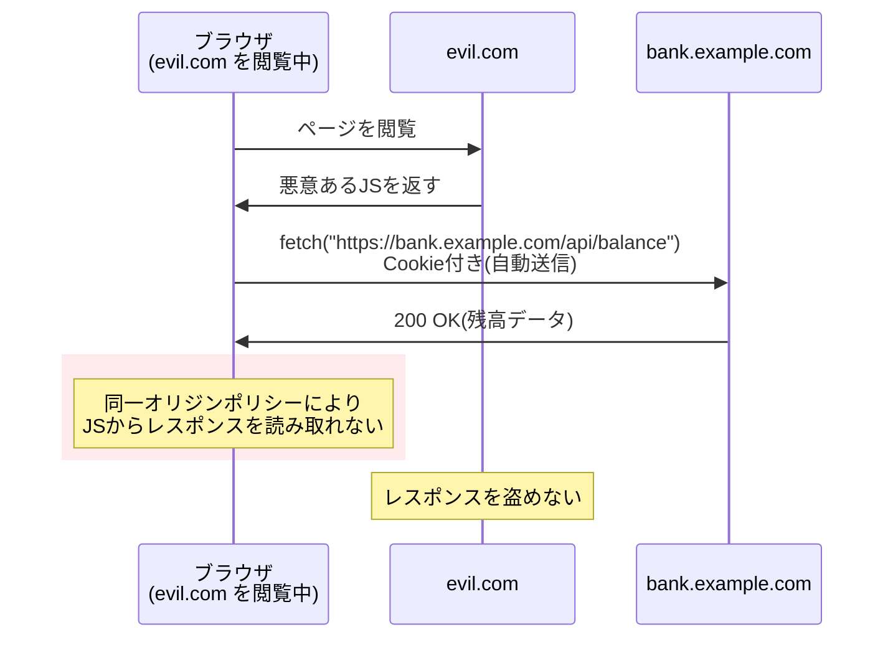
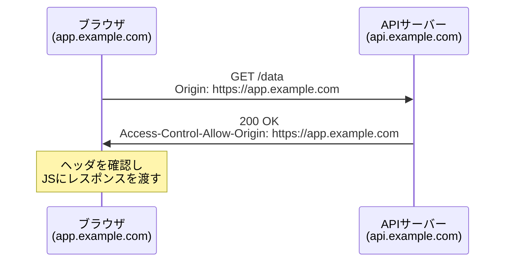
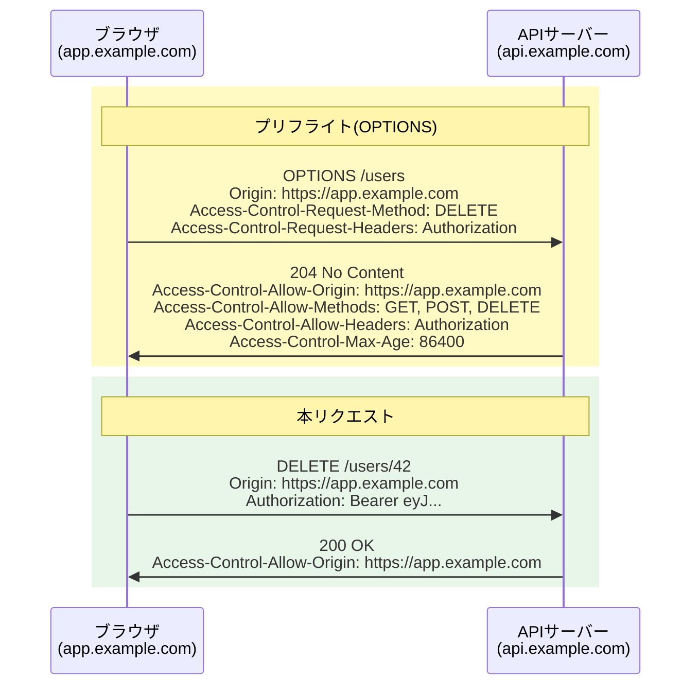
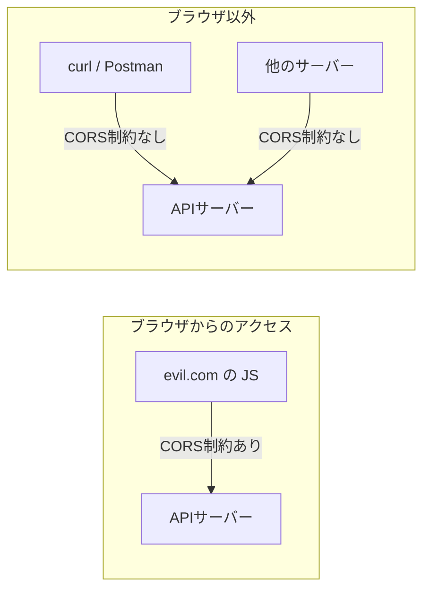
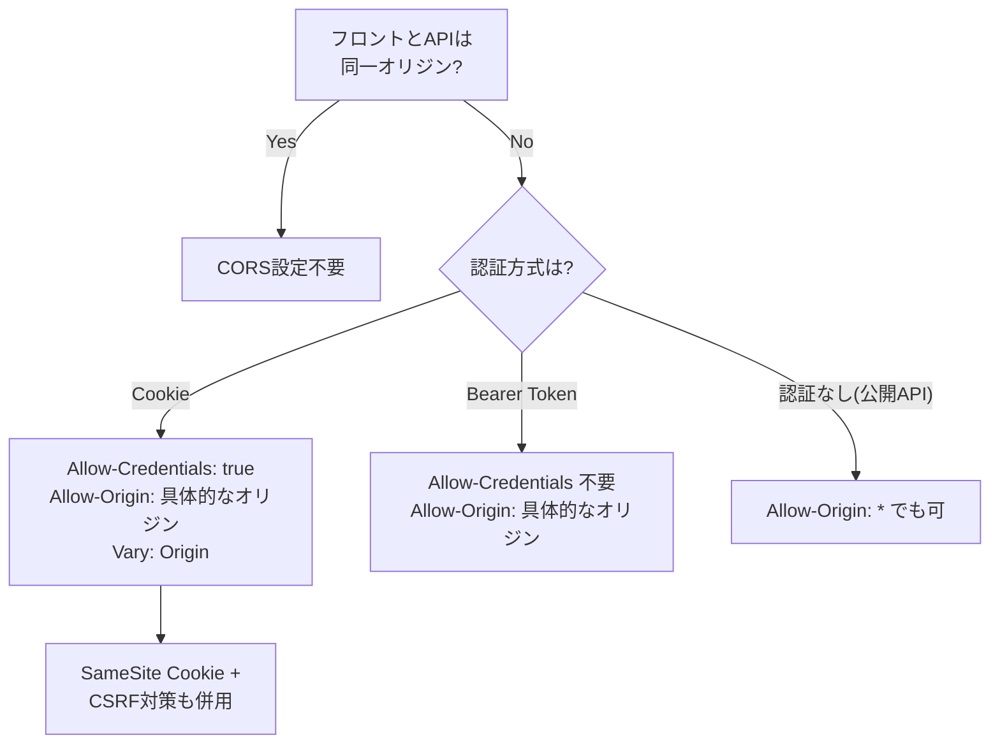
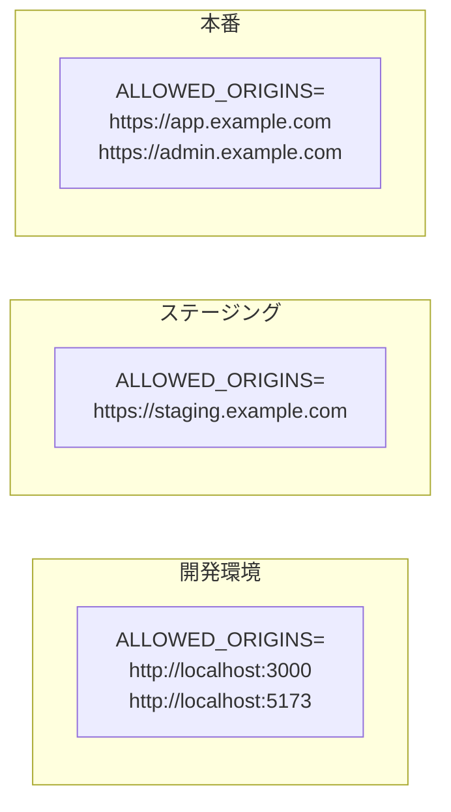
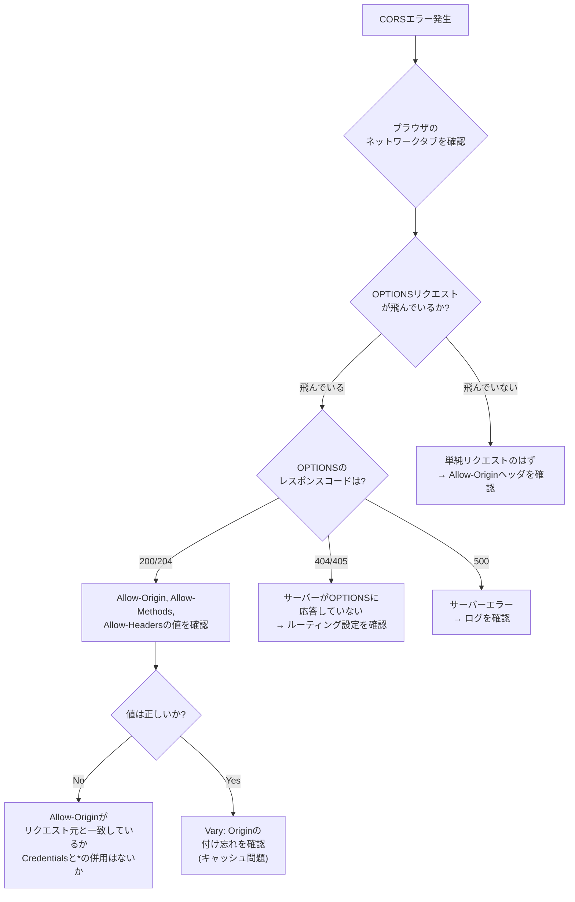

# CORS（オリジン間リソース共有 / Cross-Origin Resource Sharing）

> **一言で言うと:** ブラウザの同一オリジンポリシー（Same-Origin Policy）を**安全に緩和する**ための仕組み。サーバーがHTTPレスポンスヘッダで「このオリジンからのリクエストは許可する」と宣言することで、異なるオリジン間の通信を制御する。「なぜAPIが呼べないか」のトラブルの大半はCORS設定の問題。

## なぜ必要か

CORSを理解していないと、以下の問題が頻発する:

- **フロントエンドとバックエンドが別オリジンにデプロイされた途端にAPIが呼べなくなる** — 開発中は `localhost:3000` と `localhost:8080` で問題なく動いていたのに、本番で `app.example.com` から `api.example.com` を呼ぶとブラウザがブロックする
- **「OPTIONSリクエストが飛んでいるのに気づかない」問題** — `Content-Type: application/json` にしただけでプリフライトが発生し、サーバーが `OPTIONS` に応答できずエラーになる
- **開発時に `Access-Control-Allow-Origin: *` で全開放し、そのまま本番にデプロイしてしまう** — セキュリティリスクを抱えたまま運用される

### CORSがなかったら何が困るか

同一オリジンポリシーはブラウザのセキュリティ機能として不可欠だが、**緩和の仕組みがなければ**正当なクロスオリジン通信も一切できなくなる。現代のWebアーキテクチャでは、フロントエンドとAPIが異なるオリジンに配置されるのが一般的であり、CORSはその正当な通信を可能にする。

## どの問題を解決するか

### 前提: 同一オリジンポリシー（Same-Origin Policy）

CORSを理解するには、まず「なぜブラウザがクロスオリジンリクエストを制限するのか」を知る必要がある。

**オリジン（Origin）** = スキーム + ホスト + ポートの組み合わせ。1つでも異なれば「異なるオリジン」。

| URL | `https://app.example.com` と同一か | 理由 |
|-----|-----|------|
| `https://app.example.com/page` | 同一 | パスが違うだけ |
| `http://app.example.com` | **異なる** | スキームが違う |
| `https://api.example.com` | **異なる** | ホストが違う（サブドメイン違い） |
| `https://app.example.com:8080` | **異なる** | ポートが違う |

同一オリジンポリシーがないと、悪意あるサイトがユーザーのログイン済みセッションを利用して、銀行サイトのAPIを叩いてレスポンスを**読み取る**ことができてしまう。



**重要な区別:** 同一オリジンポリシーが制限するのは**レスポンスの読み取り**であって、**リクエストの送信自体ではない**。リクエストはサーバーに到達する（これが[[CSRF]]攻撃の根拠）。CORSはこの「レスポンス読み取り禁止」を、サーバーの許可に基づいて緩和する。

### CORSの2つのリクエストフロー

#### 単純リクエスト（Simple Request）

以下の条件を**すべて満たす**リクエストは、プリフライトなしで直接送信される:

- メソッドが `GET`、`HEAD`、`POST` のいずれか
- ヘッダが `Accept`、`Accept-Language`、`Content-Language`、`Content-Type` のみ
- `Content-Type` が `application/x-www-form-urlencoded`、`multipart/form-data`、`text/plain` のいずれか



#### プリフライトリクエスト（Preflight Request）

単純リクエストの条件を満たさない場合（`PUT`/`DELETE` メソッド、`Authorization` ヘッダ、`Content-Type: application/json` など）、ブラウザは本リクエストの前に `OPTIONS` リクエストを送信して許可を確認する。



**`Content-Type: application/json` にしただけでプリフライトが発生する** — これはCORSトラブルの最も多い原因の一つ。開発時にネットワークタブで `OPTIONS` リクエストが飛んでいることを確認し、サーバーが正しく応答しているかチェックすべき。

### CORSヘッダ一覧

#### レスポンスヘッダ（サーバーが返す）

| ヘッダ | 役割 | 値の例 |
|--------|------|--------|
| `Access-Control-Allow-Origin` | 許可するオリジン | `https://app.example.com` または `*` |
| `Access-Control-Allow-Methods` | 許可するHTTPメソッド（プリフライト応答） | `GET, POST, PUT, DELETE` |
| `Access-Control-Allow-Headers` | 許可するリクエストヘッダ（プリフライト応答） | `Authorization, Content-Type` |
| `Access-Control-Allow-Credentials` | Cookieの送信を許可するか | `true` |
| `Access-Control-Expose-Headers` | JSから読み取り可能にするレスポンスヘッダ | `X-Request-Id` |
| `Access-Control-Max-Age` | プリフライト結果のキャッシュ秒数 | `86400`（24時間） |

#### リクエストヘッダ（ブラウザが自動付与）

| ヘッダ | 役割 |
|--------|------|
| `Origin` | リクエスト元のオリジン |
| `Access-Control-Request-Method` | 本リクエストで使うメソッド（プリフライト時） |
| `Access-Control-Request-Headers` | 本リクエストで送るヘッダ（プリフライト時） |

## 他の仕組みとどう関係するか

- **下位レイヤーとの関係:**
  - [[HTTP-HTTPS]] — CORSはHTTPヘッダベースの仕組み。オリジンの定義にスキーム（http/https）が含まれるため、HTTPSへの移行だけでもオリジンが変わる
  - [[DNS]] — サブドメイン（`api.example.com` vs `app.example.com`）は異なるオリジンとして扱われる。DNS構成がCORS設定要件を決定する

- **同レイヤーとの関係:**
  - [[CSRF]] — CORSはレスポンスの**読み取り**を制限するだけで、リクエストの**送信**は止めない。CORSはCSRFを防がない。`<form>` によるPOSTは単純リクエストとしてプリフライトなしで送信される
  - [[XSS]] — 同一オリジンポリシーはXSSを防がない（攻撃スクリプトは被害者のオリジンで実行されるため、同一オリジン扱い）。ただし、CORS設定の甘さがXSSの影響範囲を広げうる
  - [[最小権限の原則]] — CORS設定でも「必要最小限のオリジン・メソッド・ヘッダのみ許可する」原則を適用する

- **上位レイヤーとの関係:**
  - [[API設計-REST-GraphQL]] — フロントエンドとバックエンドが異なるオリジンにデプロイされる場合にCORS設定が必須
  - [[認証と認可]] — `Access-Control-Allow-Credentials: true` とCookie認証の関係。Bearer Token方式ではCredentials設定が不要
  - [[ルーティングとミドルウェア]] — CORSはミドルウェアとして実装する代表例

## 誤解されやすいポイント

### 1. 「CORSはサーバーを保護する仕組み」

CORSは**ブラウザの仕組み**であり、サーバーを保護するものではない。`curl` やサーバー間通信にはCORSの制約は存在しない。CORS設定だけで「不正なアクセスを防いでいる」と考えるのは危険。サーバー側での[[認証と認可]]は別途必須。



### 2. 「`Access-Control-Allow-Origin` に複数オリジンをカンマ区切りで指定できる」

このヘッダには**1つのオリジンまたは `*`** しか指定できない。複数オリジンを許可するにはサーバー側でリクエストの `Origin` ヘッダを検証し、動的にレスポンスを返す必要がある。

```javascript
// ❌ 仕様違反（カンマ区切りで複数指定）
res.setHeader('Access-Control-Allow-Origin',
  'https://app.example.com, https://admin.example.com');

// ✅ リクエストのOriginを検証して動的に返す
const origin = req.headers.origin;
if (allowedOrigins.includes(origin)) {
  res.setHeader('Access-Control-Allow-Origin', origin);
}
```

### 3. 「`Allow-Origin: *` と `Allow-Credentials: true` は併用できる」

ブラウザはこの組み合わせを**明示的に拒否**する。Cookie（Credentials）を送信する場合は、`Allow-Origin` に具体的なオリジンを指定する必要がある。

### 4. 「CORSを設定すればCSRFは防げる」

CORSはレスポンスの読み取りを制限するだけで、リクエスト送信自体は止めない。`<form>` によるPOSTは単純リクエストとして扱われ、CORSプリフライトが発生しない。CSRF防御には[[CSRF|CSRFトークン]]やSameSite Cookie属性が必要。

### 5. 「プリフライト（OPTIONS）はすべてのリクエストで発生する」

プリフライトは単純リクエストの条件を満たさない場合にのみ発生する。`GET` + 標準ヘッダのみの場合はプリフライトなしで直接送信される。逆に、`Content-Type: application/json` を使うだけでプリフライトが発生する — これが最もよくあるハマりポイント。

### 6. 「`Vary: Origin` ヘッダは付けなくてよい」

オリジンに応じて `Allow-Origin` の値を動的に変える場合、`Vary: Origin` を付けないとCDNやブラウザキャッシュが**誤ったオリジンのレスポンスを返す**。オリジンAへのレスポンスがキャッシュされ、オリジンBのリクエストにもそのキャッシュが返されるとCORSエラーになる。

## 設計のベストプラクティス

### CORS設定の判断フロー



### 環境別CORS設定の管理



許可オリジンは環境変数で管理し、開発用の `localhost` が本番に持ち込まれないようにする。

### アンチパターン

| アンチパターン | なぜ問題か | 対策 |
|---|---|---|
| `Allow-Origin: *` で全開放 | 認証付きリクエストで使えず、攻撃面が広がる | 環境変数で許可オリジンを管理 |
| 全メソッド・全ヘッダを許可 | 必要最小限の原則に反する | 実際に使うメソッドとヘッダのみ許可 |
| 開発用CORS設定を環境分岐なしに本番へ | `localhost` が本番で許可される | 環境変数 `ALLOWED_ORIGINS` で管理 |
| `Vary: Origin` の付け忘れ | CDNキャッシュが誤ったオリジンのレスポンスを返す | 動的オリジン設定時は必ず `Vary: Origin` |
| CORSミドルウェアとOPTIONSルートの二重定義 | プリフライトが2回処理されるか優先順位の混乱 | ミドルウェアで一元管理 |

## AIによる実装のアンチパターン

| アンチパターン | なぜ問題か | 対策 |
|---|---|---|
| `Allow-Origin: *` をデフォルトで生成 | LLMは動作させることを優先して全開放しがち | 具体的なオリジンを環境変数から取得 |
| `Allow-Methods: *` や `Allow-Headers: *` | 必要最小限の原則に反し攻撃面が広がる | 実際に使うメソッド・ヘッダのみ列挙 |
| CORSミドルウェアと手動OPTIONSハンドラの併設 | 二重処理で予期しない挙動になる | フレームワークのCORS機能かミドルウェアかどちらかに統一 |
| `Max-Age` を設定しない | 毎回プリフライトが飛びパフォーマンスが低下 | `Max-Age: 86400` 等を設定してキャッシュ |

## 具体例

### Express（Node.js）— CORSミドルウェアの手動実装

```typescript
import express from 'express';

const app = express();

const ALLOWED_ORIGINS = (process.env.ALLOWED_ORIGINS ?? '')
  .split(',')
  .filter(Boolean);

// CORSミドルウェア
app.use((req, res, next) => {
  const origin = req.headers.origin;

  if (origin && ALLOWED_ORIGINS.includes(origin)) {
    res.setHeader('Access-Control-Allow-Origin', origin);
    res.setHeader('Access-Control-Allow-Credentials', 'true');
    res.setHeader('Access-Control-Expose-Headers', 'X-Request-Id');
    res.setHeader('Vary', 'Origin');
  }

  // プリフライトリクエストへの応答
  if (req.method === 'OPTIONS') {
    res.setHeader('Access-Control-Allow-Methods', 'GET, POST, PUT, DELETE');
    res.setHeader('Access-Control-Allow-Headers', 'Authorization, Content-Type');
    res.setHeader('Access-Control-Max-Age', '86400');
    return res.status(204).end();
  }

  next();
});

app.get('/api/data', (req, res) => {
  res.json({ message: 'CORSが許可されたレスポンス' });
});

app.listen(3000);
```

### Express — corsパッケージを使用

```typescript
import express from 'express';
import cors from 'cors';

const app = express();

app.use(cors({
  origin: (process.env.ALLOWED_ORIGINS ?? '').split(',').filter(Boolean),
  credentials: true,
  methods: ['GET', 'POST', 'PUT', 'DELETE'],
  allowedHeaders: ['Authorization', 'Content-Type'],
  exposedHeaders: ['X-Request-Id'],
  maxAge: 86400,
}));

app.get('/api/data', (req, res) => {
  res.json({ message: 'CORSが許可されたレスポンス' });
});

app.listen(3000);
```

### Go（Chi）— CORSミドルウェアの実装

```go
package main

import (
	"net/http"
	"os"
	"slices"
	"strings"

	"github.com/go-chi/chi/v5"
)

func getAllowedOrigins() []string {
	origins := os.Getenv("ALLOWED_ORIGINS")
	if origins == "" {
		return nil
	}
	return strings.Split(origins, ",")
}

func corsMiddleware(allowedOrigins []string) func(http.Handler) http.Handler {
	return func(next http.Handler) http.Handler {
		return http.HandlerFunc(func(w http.ResponseWriter, r *http.Request) {
			origin := r.Header.Get("Origin")

			if slices.Contains(allowedOrigins, origin) {
				w.Header().Set("Access-Control-Allow-Origin", origin)
				w.Header().Set("Access-Control-Allow-Credentials", "true")
				w.Header().Set("Vary", "Origin")
			}

			if r.Method == http.MethodOptions {
				w.Header().Set("Access-Control-Allow-Methods", "GET, POST, PUT, DELETE")
				w.Header().Set("Access-Control-Allow-Headers", "Authorization, Content-Type")
				w.Header().Set("Access-Control-Max-Age", "86400")
				w.WriteHeader(http.StatusNoContent)
				return
			}

			next.ServeHTTP(w, r)
		})
	}
}

func main() {
	r := chi.NewRouter()
	r.Use(corsMiddleware(getAllowedOrigins()))

	r.Get("/api/data", func(w http.ResponseWriter, r *http.Request) {
		w.Header().Set("Content-Type", "application/json")
		w.Write([]byte(`{"message":"CORSが許可されたレスポンス"}`))
	})

	http.ListenAndServe(":3000", r)
}
```

### Python（FastAPI）— CORS設定

```python
import os

from fastapi import FastAPI
from fastapi.middleware.cors import CORSMiddleware

app = FastAPI()

allowed_origins = [
    o for o in os.environ.get("ALLOWED_ORIGINS", "").split(",") if o
]

app.add_middleware(
    CORSMiddleware,
    allow_origins=allowed_origins,
    allow_credentials=True,
    allow_methods=["GET", "POST", "PUT", "DELETE"],
    allow_headers=["Authorization", "Content-Type"],
    expose_headers=["X-Request-Id"],
    max_age=86400,
)


@app.get("/api/data")
def get_data():
    return {"message": "CORSが許可されたレスポンス"}
```

### フロントエンド側のfetch設定

```typescript
// Cookie認証の場合 — credentials: 'include' が必要
const res = await fetch('https://api.example.com/data', {
  credentials: 'include', // Cookieを送信する
  headers: {
    'Content-Type': 'application/json',
  },
});

// Bearer Token認証の場合 — credentials は不要
const res2 = await fetch('https://api.example.com/data', {
  headers: {
    'Authorization': `Bearer ${token}`,
    'Content-Type': 'application/json',
  },
});
// ※ Content-Type: application/json の時点でプリフライトが発生する
```

### デバッグ: CORSエラーの診断手順



## 参考リソース

- MDN Web Docs: Cross-Origin Resource Sharing (CORS) — CORSの公式リファレンス
- MDN Web Docs: Same-origin policy — 同一オリジンポリシーの詳細
- web.dev: Cross-Origin Resource Sharing — 実践的な解説とベストプラクティス
- [[details/CORS]] — 各フレームワークでの実装例とよくある落とし穴の詳細

## 学習メモ

- CORSは**ブラウザの仕組み**であり、サーバーを保護するものではない。`curl` にはCORS制約がない
- 「CORSがCSRFを防ぐ」は誤り — CORSはレスポンス読み取りの制御、CSRFはリクエスト送信の悪用
- `Content-Type: application/json` でプリフライトが飛ぶ — 最もよくあるハマりポイント
- `Allow-Origin: *` と `Credentials: true` は併用不可 — Cookie認証では具体的なオリジンが必要
- 既存の[[details/CORS]]に、各フレームワーク実装とよくある落とし穴がまとまっている
