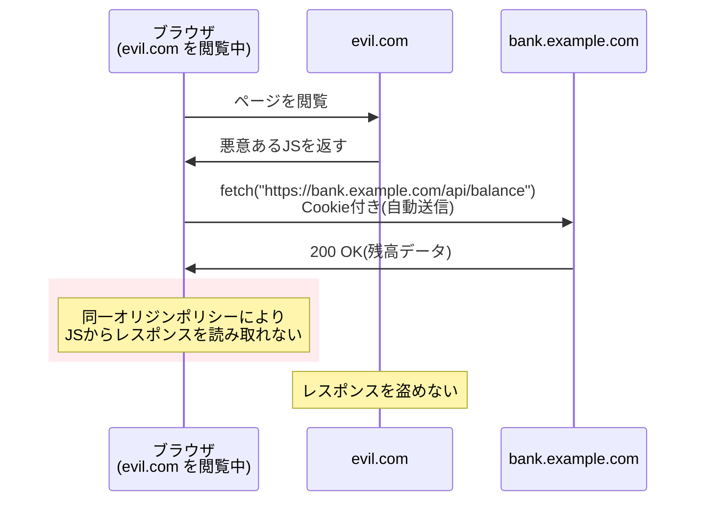
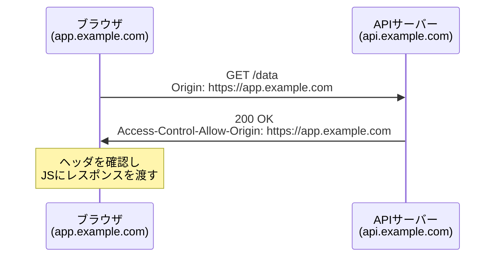
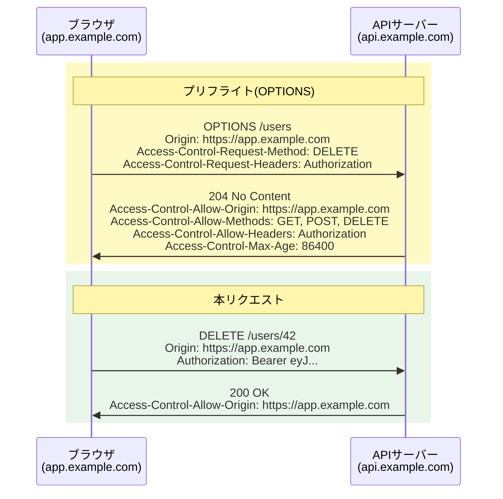
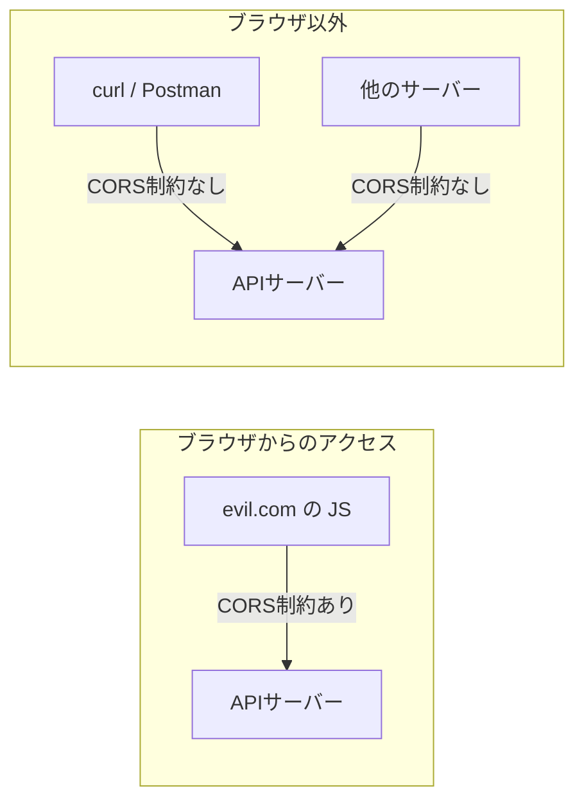
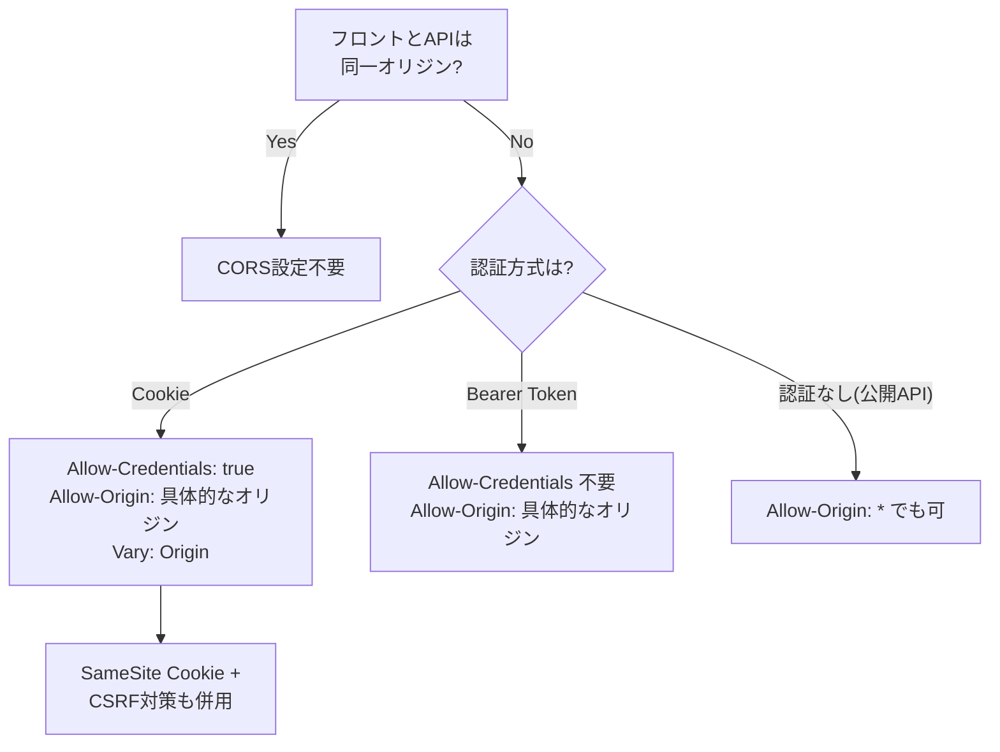
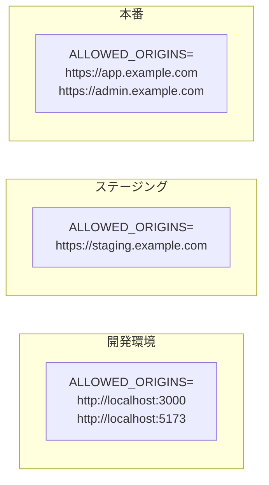
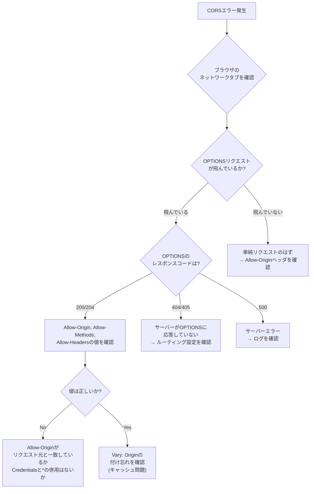

# CORS（オリジン間リソース共有 / Cross-Origin Resource Sharing）

> **一言で言うと:** ブラウザの同一オリジンポリシー（Same-Origin Policy）を**安全に緩和する**ための仕組み。サーバーがHTTPレスポンスヘッダで「このオリジンからのリクエストは許可する」と宣言することで、異なるオリジン間の通信を制御する。「なぜAPIが呼べないか」のトラブルの大半はCORS設定の問題。

## 3分で全体像

- **何を解決する技術か:** ブラウザの同一オリジンポリシーを「**サーバーの明示的な許可**」をもって安全に緩和する。フロント / API / 認可サーバー / CDN が別オリジンに散る現代アーキテクチャで、悪意あるサイトの読み取りを防ぎつつ正規通信を成立させる
- **代表的な使用シーン:** SPA（`app.example.com`）→ API（`api.example.com`）、サードパーティ API の埋め込み、SaaS の API 公開、WebSocket / SSE のオリジン検証、CDN 経由の静的アセットフォント、iframe + postMessage、OAuth 認可サーバーへのトークン要求
- **これだけは覚える3つ:**
    1. **CORS は「ブラウザの仕組み」、サーバー保護ではない** — `curl` / Postman / サーバー間通信には CORS 制約が一切ない。**アクセス制御は[[認証と認可]]で別途必須**。「CORS を厳しくしたから安全」は誤り
    2. **CORS は CSRF を防がない** — CORS が制限するのは**レスポンスの読み取り**。`<form>` POST はプリフライトなしで送信され、サーバーに到達する。CSRF 防御は別途[[CSRF]]トークン + SameSite で行う
    3. **`Content-Type: application/json` でプリフライトが飛ぶ** — トラブルの最頻出原因。`Access-Control-Allow-Credentials: true` と `Access-Control-Allow-Origin: *` の併用は**ブラウザに拒否される**ため、Cookie 認証では具体的なオリジンを返す。`Vary: Origin` の付け忘れは CDN キャッシュ汚染の典型ハマりポイント
- **AIに任せやすいか:** **一部任せられる** — Express の `cors` ミドルウェア、FastAPI の `CORSMiddleware`、Spring Security の `CorsConfiguration` 等の**標準ミドルウェア導入**は AI が定型実装可。一方で「**許可オリジンの allowlist 設計**」「**Credentials を伴うクロスサイト構成の妥当性**」「**OAuth コールバックや iframe 連携の例外処理**」は人間判断。AI は `Allow-Origin: *` をデフォルトで生成しがち
- **詰まったらここを読む:** [[CSRF]] / [[HTTP-HTTPS]] / [[認証と認可]] / [[API設計-REST-GraphQL]]

## なぜ必要か

CORSを理解していないと、以下の問題が頻発する:

- **フロントエンドとバックエンドが別オリジンにデプロイされた途端にAPIが呼べなくなる** — 開発中は `localhost:3000` と `localhost:8080` で問題なく動いていたのに、本番で `app.example.com` から `api.example.com` を呼ぶとブラウザがブロックする
- **「OPTIONSリクエストが飛んでいるのに気づかない」問題** — `Content-Type: application/json` にしただけでプリフライトが発生し、サーバーが `OPTIONS` に応答できずエラーになる
- **開発時に `Access-Control-Allow-Origin: *` で全開放し、そのまま本番にデプロイしてしまう** — セキュリティリスクを抱えたまま運用される

### CORSがなかったら何が困るか

同一オリジンポリシーはブラウザのセキュリティ機能として不可欠だが、**緩和の仕組みがなければ**正当なクロスオリジン通信も一切できなくなる。現代のWebアーキテクチャでは、フロントエンドとAPIが異なるオリジンに配置されるのが一般的であり、CORSはその正当な通信を可能にする。

## どの問題を解決するか

### 前提: 同一オリジンポリシー（Same-Origin Policy）

CORSを理解するには、まず「なぜブラウザがクロスオリジンリクエストを制限するのか」を知る必要がある。

**オリジン（Origin）** = スキーム + ホスト + ポートの組み合わせ。1つでも異なれば「異なるオリジン」。

| URL | `https://app.example.com` と同一か | 理由 |
|-----|-----|------|
| `https://app.example.com/page` | 同一 | パスが違うだけ |
| `http://app.example.com` | **異なる** | スキームが違う |
| `https://api.example.com` | **異なる** | ホストが違う（サブドメイン違い） |
| `https://app.example.com:8080` | **異なる** | ポートが違う |

同一オリジンポリシーがないと、悪意あるサイトがユーザーのログイン済みセッションを利用して、銀行サイトのAPIを叩いてレスポンスを**読み取る**ことができてしまう。


```mermaid
sequenceDiagram
    participant User as ブラウザ<br/>(evil.com を閲覧中)
    participant Evil as evil.com
    participant Bank as bank.example.com

    User->>Evil: ページを閲覧
    Evil->>User: 悪意あるJSを返す
    User->>Bank: fetch("https://bank.example.com/api/balance")<br/>Cookie付き(自動送信)
    Bank->>User: 200 OK(残高データ)

    rect rgb(255, 235, 238)
        Note over User: 同一オリジンポリシーにより<br/>JSからレスポンスを読み取れない
    end
    Note over Evil: レスポンスを盗めない
```

**重要な区別:** 同一オリジンポリシーが制限するのは**レスポンスの読み取り**であって、**リクエストの送信自体ではない**。リクエストはサーバーに到達する（これが[[CSRF]]攻撃の根拠）。CORSはこの「レスポンス読み取り禁止」を、サーバーの許可に基づいて緩和する。

### CORSの2つのリクエストフロー

#### 単純リクエスト（Simple Request）

以下の条件を**すべて満たす**リクエストは、プリフライトなしで直接送信される:

- メソッドが `GET`、`HEAD`、`POST` のいずれか
- ヘッダが `Accept`、`Accept-Language`、`Content-Language`、`Content-Type` のみ
- `Content-Type` が `application/x-www-form-urlencoded`、`multipart/form-data`、`text/plain` のいずれか


```mermaid
sequenceDiagram
    participant B as ブラウザ<br/>(app.example.com)
    participant S as APIサーバー<br/>(api.example.com)

    B->>S: GET /data<br/>Origin: https://app.example.com
    S->>B: 200 OK<br/>Access-Control-Allow-Origin: https://app.example.com

    Note over B: ヘッダを確認し<br/>JSにレスポンスを渡す
```

#### プリフライトリクエスト（Preflight Request）

単純リクエストの条件を満たさない場合（`PUT`/`DELETE` メソッド、`Authorization` ヘッダ、`Content-Type: application/json` など）、ブラウザは本リクエストの前に `OPTIONS` リクエストを送信して許可を確認する。


```mermaid
sequenceDiagram
    participant B as ブラウザ<br/>(app.example.com)
    participant S as APIサーバー<br/>(api.example.com)

    rect rgb(255, 249, 196)
        Note over B,S: プリフライト(OPTIONS)
        B->>S: OPTIONS /users<br/>Origin: https://app.example.com<br/>Access-Control-Request-Method: DELETE<br/>Access-Control-Request-Headers: Authorization
        S->>B: 204 No Content<br/>Access-Control-Allow-Origin: https://app.example.com<br/>Access-Control-Allow-Methods: GET, POST, DELETE<br/>Access-Control-Allow-Headers: Authorization<br/>Access-Control-Max-Age: 86400
    end

    rect rgb(232, 245, 233)
        Note over B,S: 本リクエスト
        B->>S: DELETE /users/42<br/>Origin: https://app.example.com<br/>Authorization: Bearer eyJ...
        S->>B: 200 OK<br/>Access-Control-Allow-Origin: https://app.example.com
    end
```

**`Content-Type: application/json` にしただけでプリフライトが発生する** — これはCORSトラブルの最も多い原因の一つ。開発時にネットワークタブで `OPTIONS` リクエストが飛んでいることを確認し、サーバーが正しく応答しているかチェックすべき。

### CORSヘッダ一覧

#### レスポンスヘッダ（サーバーが返す）

| ヘッダ | 役割 | 値の例 |
|--------|------|--------|
| `Access-Control-Allow-Origin` | 許可するオリジン | `https://app.example.com` または `*` |
| `Access-Control-Allow-Methods` | 許可するHTTPメソッド（プリフライト応答） | `GET, POST, PUT, DELETE` |
| `Access-Control-Allow-Headers` | 許可するリクエストヘッダ（プリフライト応答） | `Authorization, Content-Type` |
| `Access-Control-Allow-Credentials` | Cookieの送信を許可するか | `true` |
| `Access-Control-Expose-Headers` | JSから読み取り可能にするレスポンスヘッダ | `X-Request-Id` |
| `Access-Control-Max-Age` | プリフライト結果のキャッシュ秒数 | `86400`（24時間） |

#### リクエストヘッダ（ブラウザが自動付与）

| ヘッダ | 役割 |
|--------|------|
| `Origin` | リクエスト元のオリジン |
| `Access-Control-Request-Method` | 本リクエストで使うメソッド（プリフライト時） |
| `Access-Control-Request-Headers` | 本リクエストで送るヘッダ（プリフライト時） |

## 他の仕組みとどう関係するか

- **下位レイヤーとの関係:**
  - [[HTTP-HTTPS]] — CORSはHTTPヘッダベースの仕組み。オリジンの定義にスキーム（http/https）が含まれるため、HTTPSへの移行だけでもオリジンが変わる
  - [[DNS]] — サブドメイン（`api.example.com` vs `app.example.com`）は異なるオリジンとして扱われる。DNS構成がCORS設定要件を決定する

- **同レイヤーとの関係:**
  - [[CSRF]] — CORSはレスポンスの**読み取り**を制限するだけで、リクエストの**送信**は止めない。CORSはCSRFを防がない。`<form>` によるPOSTは単純リクエストとしてプリフライトなしで送信される
  - [[XSS]] — 同一オリジンポリシーはXSSを防がない（攻撃スクリプトは被害者のオリジンで実行されるため、同一オリジン扱い）。ただし、CORS設定の甘さがXSSの影響範囲を広げうる
  - [[最小権限の原則]] — CORS設定でも「必要最小限のオリジン・メソッド・ヘッダのみ許可する」原則を適用する

- **上位レイヤーとの関係:**
  - [[API設計-REST-GraphQL]] — フロントエンドとバックエンドが異なるオリジンにデプロイされる場合にCORS設定が必須
  - [[認証と認可]] — `Access-Control-Allow-Credentials: true` とCookie認証の関係。Bearer Token方式ではCredentials設定が不要
  - [[ルーティングとミドルウェア]] — CORSはミドルウェアとして実装する代表例

## 誤解されやすいポイント

### 1. 「CORSはサーバーを保護する仕組み」

CORSは**ブラウザの仕組み**であり、サーバーを保護するものではない。`curl` やサーバー間通信にはCORSの制約は存在しない。CORS設定だけで「不正なアクセスを防いでいる」と考えるのは危険。サーバー側での[[認証と認可]]は別途必須。


```mermaid
flowchart LR
    subgraph Browser["ブラウザからのアクセス"]
        B1["evil.com の JS"] -->|"CORS制約あり"| S1["APIサーバー"]
    end
    subgraph NonBrowser["ブラウザ以外"]
        B2["curl / Postman"] -->|"CORS制約なし"| S2["APIサーバー"]
        B3["他のサーバー"] -->|"CORS制約なし"| S2
    end
```

### 2. 「`Access-Control-Allow-Origin` に複数オリジンをカンマ区切りで指定できる」

このヘッダには**1つのオリジンまたは `*`** しか指定できない。複数オリジンを許可するにはサーバー側でリクエストの `Origin` ヘッダを検証し、動的にレスポンスを返す必要がある。

```javascript
// ❌ 仕様違反（カンマ区切りで複数指定）
res.setHeader('Access-Control-Allow-Origin',
  'https://app.example.com, https://admin.example.com');

// ✅ リクエストのOriginを検証して動的に返す
const origin = req.headers.origin;
if (allowedOrigins.includes(origin)) {
  res.setHeader('Access-Control-Allow-Origin', origin);
}
```

### 3. 「`Allow-Origin: *` と `Allow-Credentials: true` は併用できる」

ブラウザはこの組み合わせを**明示的に拒否**する。Cookie（Credentials）を送信する場合は、`Allow-Origin` に具体的なオリジンを指定する必要がある。

### 4. 「CORSを設定すればCSRFは防げる」

CORSはレスポンスの読み取りを制限するだけで、リクエスト送信自体は止めない。`<form>` によるPOSTは単純リクエストとして扱われ、CORSプリフライトが発生しない。CSRF防御には[[CSRF|CSRFトークン]]やSameSite Cookie属性が必要。

### 5. 「プリフライト（OPTIONS）はすべてのリクエストで発生する」

プリフライトは単純リクエストの条件を満たさない場合にのみ発生する。`GET` + 標準ヘッダのみの場合はプリフライトなしで直接送信される。逆に、`Content-Type: application/json` を使うだけでプリフライトが発生する — これが最もよくあるハマりポイント。

### 6. 「`Vary: Origin` ヘッダは付けなくてよい」

オリジンに応じて `Allow-Origin` の値を動的に変える場合、`Vary: Origin` を付けないとCDNやブラウザキャッシュが**誤ったオリジンのレスポンスを返す**。オリジンAへのレスポンスがキャッシュされ、オリジンBのリクエストにもそのキャッシュが返されるとCORSエラーになる。

## 設計のベストプラクティス

### CORS設定の判断フロー


```mermaid
flowchart TD
    A["フロントとAPIは<br/>同一オリジン?"] -->|Yes| B["CORS設定不要"]
    A -->|No| C{"認証方式は?"}
    C -->|"Cookie"| D["Allow-Credentials: true<br/>Allow-Origin: 具体的なオリジン<br/>Vary: Origin"]
    C -->|"Bearer Token"| E["Allow-Credentials 不要<br/>Allow-Origin: 具体的なオリジン"]
    C -->|"認証なし(公開API)"| F["Allow-Origin: * でも可"]

    D --> G["SameSite Cookie +<br/>CSRF対策も併用"]
```

### 環境別CORS設定の管理


```mermaid
flowchart LR
    subgraph Dev["開発環境"]
        D1["ALLOWED_ORIGINS=<br/>http://localhost:3000<br/>http://localhost:5173"]
    end
    subgraph Staging["ステージング"]
        S1["ALLOWED_ORIGINS=<br/>https://staging.example.com"]
    end
    subgraph Prod["本番"]
        P1["ALLOWED_ORIGINS=<br/>https://app.example.com<br/>https://admin.example.com"]
    end
```

許可オリジンは環境変数で管理し、開発用の `localhost` が本番に持ち込まれないようにする。

### アンチパターン

| アンチパターン | なぜ問題か | 対策 |
|---|---|---|
| `Allow-Origin: *` で全開放 | 認証付きリクエストで使えず、攻撃面が広がる | 環境変数で許可オリジンを管理 |
| 全メソッド・全ヘッダを許可 | 必要最小限の原則に反する | 実際に使うメソッドとヘッダのみ許可 |
| 開発用CORS設定を環境分岐なしに本番へ | `localhost` が本番で許可される | 環境変数 `ALLOWED_ORIGINS` で管理 |
| `Vary: Origin` の付け忘れ | CDNキャッシュが誤ったオリジンのレスポンスを返す | 動的オリジン設定時は必ず `Vary: Origin` |
| CORSミドルウェアとOPTIONSルートの二重定義 | プリフライトが2回処理されるか優先順位の混乱 | ミドルウェアで一元管理 |

## AIエージェントとの協働

> このトピックでAIコーディングエージェント（Claude Code, Copilot, Cursor 等）と協働するための観点。
> **「AIに何をどこまで任せ、AIに何をレビューさせ、人間は何を最終判断するか」**を整理する。実装だけでなく**レビューもAIに任せられる**前提で考える（AIコードレビュー観点で横断アンチパターン照合を行う）。

### AIに任せられる部分 / 人間が判断すべき部分

| タスク種類 | 任せ方（実装/レビュー） | 人間の関与 |
|---|---|---|
| Express `cors` / FastAPI `CORSMiddleware` / Spring `CorsConfiguration` の導入 | 実装・レビュー両方 AI 委任。AIコードレビュー観点で `*` 全開放と Credentials 併用を検出 | 環境別の許可オリジンリストを明示（`process.env.ALLOWED_ORIGINS`） |
| プリフライトキャッシュ（`Max-Age`）の設定 | 値の選定（7200 / 86400）と実装は AI 任せ | Chromium / Firefox / Safari の上限差を踏まえた値の最終判断 |
| `Vary: Origin` の付与 | 実装は AI、CDN 配下での挙動レビューも AI に任せる | CDN（CloudFront / Cloudflare）のキャッシュキー設計との整合性確認 |
| 動的オリジン検証（リクエストの `Origin` を allowlist と照合） | 実装は AI、AIコードレビュー観点で「`includes` での部分一致」誤りを検出 | サブドメイン許可方針（`*.example.com` を許すか）の意思決定 |
| WebSocket / SSE の `Origin` 検証 | 実装は AI、テストも AI に任せられる | 認証されていないオリジンからの接続をどう扱うかの仕様判断 |
| CORS エラーの診断（DevTools の Network タブ確認手順） | デバッグ手順の生成は AI 任せ | 実環境（CDN / WAF / プロキシ）の特殊事情の切り分け |

### AI生成コードのレビュー観点（このトピック固有）

AI生成物を受け取ったとき、最低限ここを見る。

1. **`Access-Control-Allow-Origin: *` がデフォルトで生成されていないか** — AI は動作優先で全開放を提案しがち。本番では具体的なオリジンを環境変数から取得し、`Allow-Credentials: true` と併用しないこと
2. **`Vary: Origin` が付いているか（動的オリジンを返す場合）** — オリジンに応じて `Allow-Origin` の値を変える時に Vary が無いと、CDN や中間プロキシがオリジン A 向けのレスポンスをオリジン B にも返してしまう（キャッシュ汚染）。AI は付け忘れがち
3. **CORS と CSRF の混同がないか** — AIコードレビュー観点で「CORS で CSRF 対策をしたつもり」のコードを検出する。CORS はレスポンス読み取り制限であり、`<form>` POST の到達は止めない

### 効くプロンプトの型

このトピックに関する実装をAIに依頼するとき、コンテキストとして渡すべき情報・制約・成功基準のテンプレ。

```
# 前提（プロジェクトの状況・既存のコード規約）
- フロント: app.example.com（本番）、localhost:5173（開発）
- API: api.example.com
- 認証: HttpOnly + Secure + SameSite=Lax の Session Cookie（Cookie 認証）
- フレームワーク: Express 5 + cors パッケージ
- CDN: CloudFront（API レスポンスもキャッシュ可能性あり）

# やってほしいこと
- /api/* の CORS を設定する。許可オリジンは ALLOWED_ORIGINS 環境変数（カンマ区切り）から動的に決定

# 守ってほしい制約（このトピック固有のもの）
- credentials: true（Cookie 送信が必須）
- Allow-Origin: * は禁止（Credentials と併用不可、かつ攻撃面が広がる）
- Vary: Origin を必ず付与（CDN キャッシュ汚染防止）
- Max-Age は 7200 秒（Chromium の上限）
- 許可メソッドは GET/POST/PUT/DELETE のみ、許可ヘッダは Authorization, Content-Type のみ

# 完了の判断基準
- localhost:5173 から fetch('https://api.example.com/users', { credentials: 'include' }) が成功
- evil.com からの fetch は CORS エラーで失敗
- レスポンスに Vary: Origin が含まれる
- プリフライト OPTIONS が 204 を返し、本リクエストの前に毎回飛ばない（Max-Age が効いている）
```

### AI実装のアンチパターン

LLM生成コードで頻出する過剰設計・誤用パターン。レビュー時の照合表として使う。

| アンチパターン | なぜ問題か | レビュー観点 / 対策 |
|---|---|---|
| `Allow-Origin: *` をデフォルトで生成 | LLM は動作優先で全開放しがち、Credentials と併用不可 | 具体的なオリジンを環境変数から取得 |
| `Allow-Methods: *` / `Allow-Headers: *` | 必要最小限の原則に反し攻撃面が広がる | 実際に使うメソッド・ヘッダのみ列挙 |
| CORS ミドルウェアと手動 OPTIONS ハンドラの併設 | 二重処理で予期しない挙動 | フレームワークの CORS 機能かミドルウェアどちらかに統一 |
| `Max-Age` を設定しない | 毎回プリフライトが飛びパフォーマンス低下 | `Max-Age: 7200`（Chromium の上限）でキャッシュ |
| `Origin` を `String.includes` で部分一致検証 | `evil-app.example.com` が `app.example.com` の検索に含まれてしまう誤検証 | 完全一致 (`===`) または `URL` パースで host を確認 |
| 動的オリジンを返しているのに `Vary: Origin` 抜け | CDN / プロキシでキャッシュ汚染、A のレスポンスが B に届く | 動的オリジン時は必ず `Vary: Origin` |
| CORS で CSRF 対策をしたつもり | CORS はリクエスト送信を止めない | CSRF トークン + `SameSite` で対策 |
| `Allow-Credentials: true` を無条件に設定 | Bearer Token 構成では不要、Cookie 漏洩リスク増 | Cookie 認証時のみ true、Bearer 構成では false（または未設定） |
| ローカル開発の `*` 設定をそのまま本番へ | `localhost` 許可が本番に紛れ込む | 環境変数で完全に分離、CI で本番設定をチェック |

→ レイヤー横断のアンチパターン索引: [[_anti-patterns/_index|AIアンチパターン索引]]

## 具体例

プリフライトキャッシュのブラウザ別上限・サブドメインワイルドカード・WebSocket での Origin 検証・iframe + postMessage・COOP/COEP/CORP との関係といった応用トピックは[[details/CORS]]にまとめている。以下は基本的なフレームワーク実装パターン。

### Express（Node.js）— CORSミドルウェアの手動実装

```typescript
import express from 'express';

const app = express();

const ALLOWED_ORIGINS = (process.env.ALLOWED_ORIGINS ?? '')
  .split(',')
  .filter(Boolean);

// CORSミドルウェア
app.use((req, res, next) => {
  const origin = req.headers.origin;

  if (origin && ALLOWED_ORIGINS.includes(origin)) {
    res.setHeader('Access-Control-Allow-Origin', origin);
    res.setHeader('Access-Control-Allow-Credentials', 'true');
    res.setHeader('Access-Control-Expose-Headers', 'X-Request-Id');
    res.setHeader('Vary', 'Origin');
  }

  // プリフライトリクエストへの応答
  if (req.method === 'OPTIONS') {
    res.setHeader('Access-Control-Allow-Methods', 'GET, POST, PUT, DELETE');
    res.setHeader('Access-Control-Allow-Headers', 'Authorization, Content-Type');
    res.setHeader('Access-Control-Max-Age', '86400');
    return res.status(204).end();
  }

  next();
});

app.get('/api/data', (req, res) => {
  res.json({ message: 'CORSが許可されたレスポンス' });
});

app.listen(3000);
```

### Express — corsパッケージを使用

```typescript
import express from 'express';
import cors from 'cors';

const app = express();

app.use(cors({
  origin: (process.env.ALLOWED_ORIGINS ?? '').split(',').filter(Boolean),
  credentials: true,
  methods: ['GET', 'POST', 'PUT', 'DELETE'],
  allowedHeaders: ['Authorization', 'Content-Type'],
  exposedHeaders: ['X-Request-Id'],
  maxAge: 86400,
}));

app.get('/api/data', (req, res) => {
  res.json({ message: 'CORSが許可されたレスポンス' });
});

app.listen(3000);
```

### Go（Chi）— CORSミドルウェアの実装

```go
package main

import (
	"net/http"
	"os"
	"slices"
	"strings"

	"github.com/go-chi/chi/v5"
)

func getAllowedOrigins() []string {
	origins := os.Getenv("ALLOWED_ORIGINS")
	if origins == "" {
		return nil
	}
	return strings.Split(origins, ",")
}

func corsMiddleware(allowedOrigins []string) func(http.Handler) http.Handler {
	return func(next http.Handler) http.Handler {
		return http.HandlerFunc(func(w http.ResponseWriter, r *http.Request) {
			origin := r.Header.Get("Origin")

			if slices.Contains(allowedOrigins, origin) {
				w.Header().Set("Access-Control-Allow-Origin", origin)
				w.Header().Set("Access-Control-Allow-Credentials", "true")
				w.Header().Set("Vary", "Origin")
			}

			if r.Method == http.MethodOptions {
				w.Header().Set("Access-Control-Allow-Methods", "GET, POST, PUT, DELETE")
				w.Header().Set("Access-Control-Allow-Headers", "Authorization, Content-Type")
				w.Header().Set("Access-Control-Max-Age", "86400")
				w.WriteHeader(http.StatusNoContent)
				return
			}

			next.ServeHTTP(w, r)
		})
	}
}

func main() {
	r := chi.NewRouter()
	r.Use(corsMiddleware(getAllowedOrigins()))

	r.Get("/api/data", func(w http.ResponseWriter, r *http.Request) {
		w.Header().Set("Content-Type", "application/json")
		w.Write([]byte(`{"message":"CORSが許可されたレスポンス"}`))
	})

	http.ListenAndServe(":3000", r)
}
```

### Python（FastAPI）— CORS設定

```python
import os

from fastapi import FastAPI
from fastapi.middleware.cors import CORSMiddleware

app = FastAPI()

allowed_origins = [
    o for o in os.environ.get("ALLOWED_ORIGINS", "").split(",") if o
]

app.add_middleware(
    CORSMiddleware,
    allow_origins=allowed_origins,
    allow_credentials=True,
    allow_methods=["GET", "POST", "PUT", "DELETE"],
    allow_headers=["Authorization", "Content-Type"],
    expose_headers=["X-Request-Id"],
    max_age=86400,
)


@app.get("/api/data")
def get_data():
    return {"message": "CORSが許可されたレスポンス"}
```

### フロントエンド側のfetch設定

```typescript
// Cookie認証の場合 — credentials: 'include' が必要
const res = await fetch('https://api.example.com/data', {
  credentials: 'include', // Cookieを送信する
  headers: {
    'Content-Type': 'application/json',
  },
});

// Bearer Token認証の場合 — credentials は不要
const res2 = await fetch('https://api.example.com/data', {
  headers: {
    'Authorization': `Bearer ${token}`,
    'Content-Type': 'application/json',
  },
});
// ※ Content-Type: application/json の時点でプリフライトが発生する
```

### デバッグ: CORSエラーの診断手順


```mermaid
flowchart TD
    A["CORSエラー発生"] --> B{"ブラウザの<br/>ネットワークタブを確認"}
    B --> C{"OPTIONSリクエスト<br/>が飛んでいるか?"}
    C -->|"飛んでいる"| D{"OPTIONSの<br/>レスポンスコードは?"}
    C -->|"飛んでいない"| E["単純リクエストのはず<br/>→ Allow-Originヘッダを確認"]
    D -->|"200/204"| F["Allow-Origin, Allow-Methods,<br/>Allow-Headersの値を確認"]
    D -->|"404/405"| G["サーバーがOPTIONSに<br/>応答していない<br/>→ ルーティング設定を確認"]
    D -->|"500"| H["サーバーエラー<br/>→ ログを確認"]
    F --> I{"値は正しいか?"}
    I -->|"No"| J["Allow-Originが<br/>リクエスト元と一致しているか<br/>Credentialsと*の併用はないか"]
    I -->|"Yes"| K["Vary: Originの<br/>付け忘れを確認<br/>(キャッシュ問題)"]
```

## 参考リソース

- MDN Web Docs: Cross-Origin Resource Sharing (CORS) — CORSの公式リファレンス
- MDN Web Docs: Same-origin policy — 同一オリジンポリシーの詳細
- web.dev: Cross-Origin Resource Sharing — 実践的な解説とベストプラクティス
- [[details/CORS]] — プリフライトキャッシュのブラウザ別上限、サブドメインワイルドカード、WebSocket、iframe postMessage、COOP/COEP/CORP との関係などの応用トピック

## 理解度セルフチェック

> 答えられなければ本文に戻る。答えはこのファイル内に必ずある。

1. 「同一オリジンポリシーが制限するもの」と「制限しないもの」を、CSRF との関係に触れながら説明せよ。
2. 「`Access-Control-Allow-Origin: *` を設定すれば、どのオリジンからも安全に API を叩ける」は正しいか。Yes / No と、3 つの問題点を挙げよ。
3. 次のコードは Express の CORS 設定である。何が問題で、本番運用に向けてどう直すべきかを述べよ。
   ```typescript
   app.use((req, res, next) => {
     const origin = req.headers.origin ?? '';
     // 自社ドメインを含むなら許可
     if (origin.includes('example.com')) {
       res.setHeader('Access-Control-Allow-Origin', origin);
     } else {
       res.setHeader('Access-Control-Allow-Origin', '*');
     }
     res.setHeader('Access-Control-Allow-Credentials', 'true');
     res.setHeader('Access-Control-Allow-Methods', '*');
     res.setHeader('Access-Control-Allow-Headers', '*');
     if (req.method === 'OPTIONS') return res.status(204).end();
     next();
   });
   ```

> [!note]- 解答の指針
>
> > [!info] 用語ミニ辞典
> > - **同一オリジンポリシー（Same-Origin Policy）**: スキーム + ホスト + ポートが完全一致するオリジンのリソースのみ JavaScript からアクセス・読み取り可能とするブラウザの基本セキュリティ。クロスオリジンに対しては「リクエストは送るが**レスポンスを JS から読めない**」状態にする
> > - **オリジン（Origin）**: スキーム + ホスト + ポートの組。`https://app.example.com` と `https://app.example.com:8443` も別オリジン、`http://` と `https://` も別オリジン
> > - **プリフライト（Preflight Request）**: 単純リクエストの条件を満たさない時、ブラウザが本リクエストの前に送る `OPTIONS` リクエスト。`Access-Control-Request-Method` / `Access-Control-Request-Headers` で「これからこういう本リクエストを送るが許可するか」を尋ねる
> > - **`Vary` ヘッダ**: HTTP キャッシュに「リクエストヘッダの値ごとに別エントリで保存せよ」と指示するヘッダ。`Vary: Origin` を付けないと、オリジン A 向けに動的に返した `Allow-Origin` がオリジン B にもキャッシュされて返り、CORS エラーや情報漏洩の原因となる
> > - **Credentials**: Cookie / `Authorization` ヘッダ / TLS クライアント証明書の総称。`fetch(..., { credentials: 'include' })` で送信を有効化、サーバー側は `Access-Control-Allow-Credentials: true` で受け入れを宣言する。`Allow-Origin: *` と併用不可
>
> 1. **制限するもの:** クロスオリジンの**レスポンスの JS からの読み取り**（`fetch().then(res => res.text())` 等）。攻撃者が evil.com から `bank.com/api/balance` を叩いても残高を読めない
>     **制限しないもの:** クロスオリジンへの**リクエスト送信そのもの**。`<form action="https://bank.com/transfer" method="POST">` は送信され、Cookie も自動付与される。これが CSRF の根拠であり、CORS が CSRF を防がない理由。CSRF 防御は[[CSRF]]トークンや SameSite Cookie で別途行う
> 2. **No**。3 つの問題:
>     - **Credentials と併用不可** — `Allow-Credentials: true` と `Allow-Origin: *` をブラウザが明示的に拒否する。Cookie 認証や `Authorization` ヘッダ送信が一切できなくなる
>     - **攻撃面の拡大** — どこのサイトからでも API を呼ばれる。認証されていない API でも、**サーバー保護がアクセス制御だけ**なら、ブラウザ経由の攻撃ベクトルが増える
>     - **意図的なクロスサイト読み取りリスク** — 公開 API のつもりでも、内部 API と URL を混ぜていると、ユーザーセッションに紐づく情報が `evil.com` から読めてしまう。**設計判断としては許可オリジンの allowlist が原則**で、`*` は明確に「公開 API」と決めた場合だけ
> 3. **3 つの問題**:
>     - **`origin.includes('example.com')` の部分一致** — `evil-example.com` や `example.com.evil.io` が **マッチしてしまう**。完全一致または `new URL(origin).host` で host を比較する。許可リストは配列で持って `===` 検証
>     - **`Allow-Origin: *` フォールバック + `Allow-Credentials: true`** — ブラウザが拒否する組み合わせ。本番リクエストはエラーになるし、仮に効いたとしても無認可で全開放になる。**許可しないオリジンには `Allow-Origin` を付けない**（ヘッダ自体を出さない）
>     - **`Allow-Methods: *` / `Allow-Headers: *`** — 必要最小限の原則違反。実際に使う `GET, POST, PUT, DELETE` と `Authorization, Content-Type` のみ列挙する
>     - 加えて: `Vary: Origin` の付け忘れによる CDN キャッシュ汚染、`Access-Control-Max-Age` 未設定によるプリフライト多発も改善点。修正版は `cors` パッケージで `origin: (process.env.ALLOWED_ORIGINS ?? '').split(',').filter(Boolean)`、`credentials: true`、`methods: ['GET','POST','PUT','DELETE']`、`maxAge: 7200` を指定する

## 学習メモ

- CORSは**ブラウザの仕組み**であり、サーバーを保護するものではない。`curl` にはCORS制約がない
- 「CORSがCSRFを防ぐ」は誤り — CORSはレスポンス読み取りの制御、CSRFはリクエスト送信の悪用
- `Content-Type: application/json` でプリフライトが飛ぶ — 最もよくあるハマりポイント
- `Allow-Origin: *` と `Credentials: true` は併用不可 — Cookie認証では具体的なオリジンが必要
- [[details/CORS]] に、プリフライトキャッシュ上限・WebSocket・COOP/COEP/CORP などの応用トピックがまとまっている
