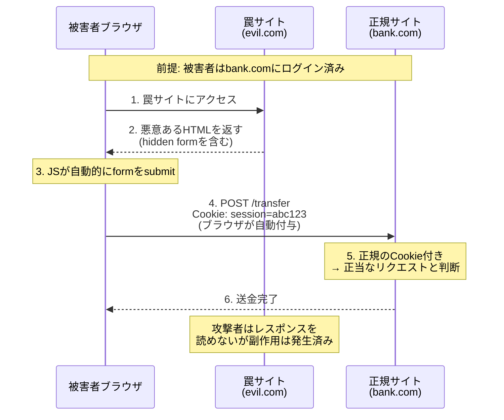
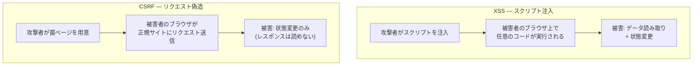
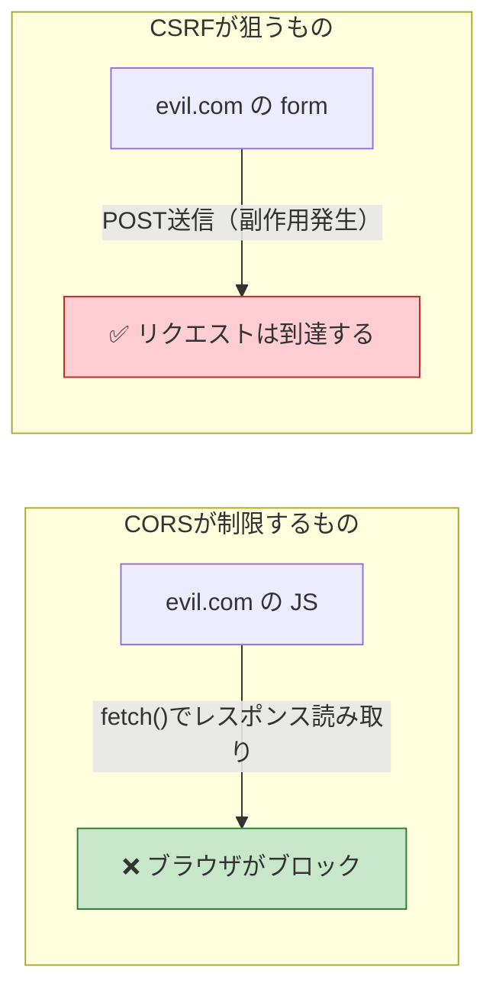
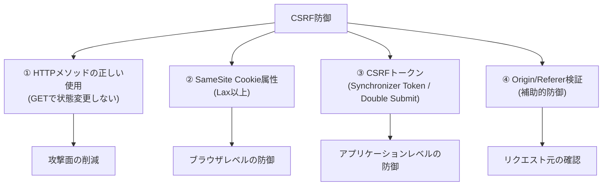
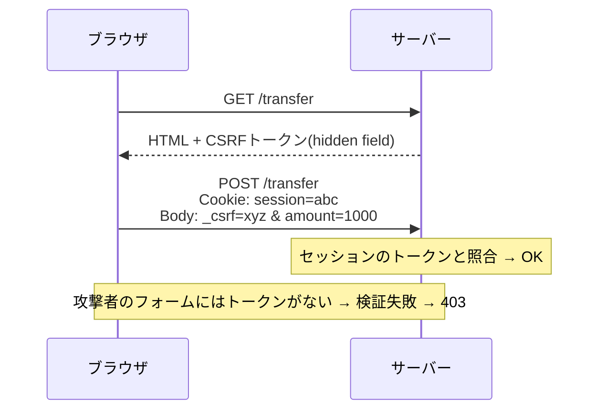
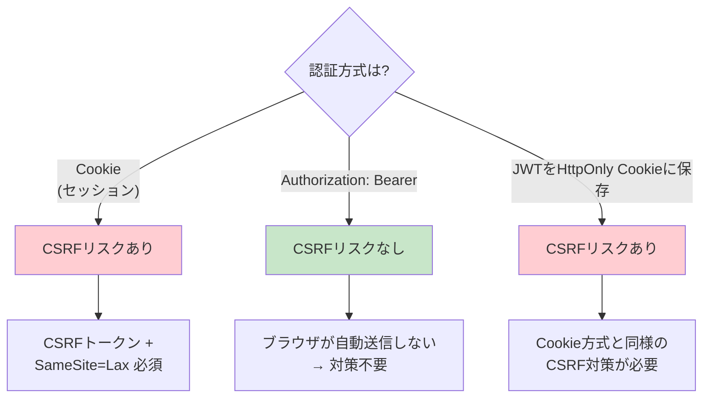

# CSRF（クロスサイトリクエストフォージェリ / Cross-Site Request Forgery）

> **一言で言うと:** ブラウザがCookieを自動送信する性質を悪用し、被害者のブラウザを踏み台にして正規サイトに意図しないリクエストを送信させる攻撃。CSRFトークンとSameSite Cookie属性で防ぐ。

## なぜ必要か

CSRFを理解していないと、以下のような被害が発生する:

- **不正送金** — ログイン中のユーザーが罠サイトを訪問しただけで、攻撃者への送金が実行される
- **アカウント設定の改ざん** — メールアドレスやパスワードの変更が勝手に行われる
- **不正な投稿・購入** — SNSへの意図しない投稿、ECサイトでの不正購入
- **権限昇格** — 管理者がCSRF攻撃を受け、攻撃者のアカウントに管理者権限が付与される

CSRF が厄介なのは、**サーバーから見ると正規のリクエストと区別できない**こと。被害者のブラウザから正規のCookie付きで送信されるため、通常の認証チェックでは防げない。

## どの問題を解決するか

### 根本問題: Cookieの自動送信

Webブラウザは、ドメインに紐づいたCookieをそのドメインへのリクエスト時に**自動的に**付与する。これはリクエストの発信元がどこであっても関係ない。つまり `evil.com` のページから `bank.com` へのリクエストを発生させると、ブラウザは `bank.com` のCookieを自動送信してしまう。



### CSRFが成立する4つの前提条件

1. 被害者が対象サイトに**ログイン済み**（認証Cookieがブラウザに存在）
2. 対象サイトが**Cookieベースの認証**を使用
3. 対象サイトに**リクエスト元の検証がない**（CSRFトークン未導入）
4. 攻撃者が被害者を**罠サイトに誘導**できる（メール、SNS等）

### XSSとの構造的な違い

[[XSS]]とCSRFは混同されやすいが、攻撃の方向が根本的に異なる:



| 観点 | XSS | CSRF |
|------|-----|------|
| 攻撃の本質 | コード注入（データ→コードの混同） | リクエスト偽造（Cookie自動送信の悪用） |
| 攻撃者ができること | **何でも**（読み取り + 書き込み） | **状態変更のみ**（レスポンスは読めない） |
| 脆弱性の場所 | 出力処理（エスケープ漏れ） | 入力処理（リクエスト元検証の欠如） |
| XSSが成功すると | CSRFトークンも読める → **CSRF防御が無効化** | — |

**重要:** XSSはCSRFの上位互換的な脅威。XSSが成功すると、ページ内のCSRFトークンを読み取り、正規のリクエストを完全に模倣できるため、CSRF防御が意味をなさなくなる。

## 他の仕組みとどう関係するか

- **下位レイヤーとの関係:**
  - [[HTTP-HTTPS]] — CSRFはHTTPのステートレス性とCookieの仕組みに起因する。Cookie属性（SameSite, Secure, HttpOnly）が防御の基盤
  - [[DNS]] — サブドメインが異なるサイト間でCookieを共有している場合、サブドメインからのCSRF攻撃のリスクがある

- **同レイヤーとの関係:**
  - [[XSS]] — XSSが成功するとCSRFトークンが窃取され、CSRF防御が無効化される。XSS対策はCSRF防御の前提条件
  - [[CORS]] — CORSはレスポンスの**読み取り**を制限するだけで、リクエストの**送信**は止めない。[[CORS]]設定だけではCSRFを防げない（詳細は[[details/CSRF]]を参照）
  - [[最小権限の原則]] — GETリクエストで状態変更しないという設計原則は、CSRFの攻撃面を減らす

- **上位レイヤーとの関係:**
  - [[認証と認可]] — CSRFはCookieベースの認証を悪用する。[[セッションとJWT|Bearer Token方式]]ではCSRFリスクが原理的に発生しない
  - [[ルーティングとミドルウェア]] — CSRFトークン検証はミドルウェアとして実装するのが一般的
  - [[バリデーション]] — リクエストの正当性検証の一環としてCSRFトークンを検証する

## 誤解されやすいポイント

### 1. 「CORSを設定すればCSRFは防げる」

CORSはレスポンスの読み取りを制限する仕組みであり、リクエストの送信自体は止めない。`<form>` によるPOSTは「単純リクエスト（Simple Request）」に該当し、CORSプリフライトが発生しない。つまりCORSの設定をどれだけ厳しくしても、formベースのCSRF攻撃は防げない。



### 2. 「GETリクエストならCSRFは問題ない」

GETリクエストで状態変更を行うAPIが存在すれば、`` だけで攻撃できる。**GETリクエストは副作用のない安全なメソッドであるべき**というHTTPの原則（RFC 9110）に従うことが根本的な防御。

### 3. 「Content-Type: application/json ならCSRFは起きない」

`application/json` はCORSプリフライトを発生させるため、一見安全に思える。しかし:
- サーバーが `Content-Type` を検証せず `text/plain` でも受け付ける場合は回避可能
- 過去にはFlash等を利用した回避手段も存在した
- Content-Typeだけに依存する防御は脆弱

### 4. 「SameSite=Lax がデフォルトだからCSRF対策は不要」

`SameSite=Lax` は**POSTベースのCSRFを防ぐ**が、以下のケースでは不十分:
- GETリクエストで状態変更を行う設計（そもそもHTTPの使い方が間違っている）
- サブドメイン間でCookieを共有しているケース
- `SameSite=None` を明示的に設定しているサードパーティCookie

多層防御の観点から、SameSite属性 **+** CSRFトークンの併用が推奨される。

### 5. 「Bearer Token（JWT）を使っていればCSRF対策は一切不要」

`Authorization: Bearer <token>` ヘッダで認証する場合、トークンはJSが明示的に設定するためCSRFは原理的に成立しない。しかし、JWTを `HttpOnly` Cookie に保存して自動送信させる設計を採用した場合、CSRFリスクが復活する。認証トークンの**保存場所と送信方法**によってCSRFリスクが変わる。

## 設計のベストプラクティス

### 防御策の全体像



### 1. CSRFトークンパターン

**Synchronizer Token Pattern（サーバーサイドレンダリング向け）:**

サーバーがセッションごとに一意のトークンを生成し、フォームのhiddenフィールドに埋め込む。攻撃者は被害者のセッションに紐づくトークンの値を知ることができないため、正当なリクエストを偽造できない。



**Double Submit Cookie Pattern（SPA向け）:**

CSRFトークンをCookieとリクエストヘッダの両方で送信し、サーバーが両者の一致を検証する。攻撃者は自分のサイトから被害者のCookieを読み取れないため、ヘッダに正しいトークンを設定できない。

### 2. SameSite Cookie属性

| 値 | クロスサイトでのCookie送信 | CSRF防御 | UXへの影響 |
|----|-------------------------|----------|-----------|
| `Strict` | 一切送信しない | 最強 | 外部リンクからのアクセスでログアウト状態 |
| `Lax` | トップレベルナビゲーションのGETのみ | POST CSRFを防御 | ほぼ影響なし（**推奨**） |
| `None` | 常に送信（`Secure` 必須） | なし | 影響なし |

### 3. 認証方式による防御の違い



### アンチパターン

| アンチパターン | なぜ問題か | 対策 |
|---|---|---|
| GETリクエストで状態変更 | `` タグだけで攻撃可能 | 状態変更は POST/PUT/DELETE のみ |
| CSRFトークンをURLパラメータに含める | Refererヘッダやログに漏洩する | hidden field または カスタムヘッダで送信 |
| 全ユーザー共通のCSRFトークン | 他ユーザーのトークンで攻撃可能 | セッションに紐づくトークンを生成 |
| CORSだけでCSRF対策とみなす | CORSはリクエスト送信を止めない | CSRFトークンで対策 |

## AIによる実装のアンチパターン

| アンチパターン | なぜ問題か | 対策 |
|---|---|---|
| CSRF保護を持たないAPIフレームワークでCookie認証を使用 | FastAPI等のAPI指向フレームワークはCSRF保護がデフォルトで無い | Cookie認証を使う場合は明示的にCSRFミドルウェアを導入 |
| CSRFトークン検証から全APIルートを除外 | Webhookなど特定ルートの除外が全体に波及するコードを生成しがち | 除外はルート単位で明示的に指定 |
| `SameSite=None` を深く考えずに設定 | サードパーティCookie利用のために安易に設定するとCSRF防御が無効化 | 本当に必要なケースのみ `None` を使用し、CSRFトークンで補完 |
| テスト環境でCSRF保護を無効化してそのまま本番へ | `if (env !== 'test') { enableCsrf() }` のような条件分岐が本番で漏れる | 環境変数ではなく、テスト用のHTTPクライアントでトークンを取得 |

## 具体例

以下はTypeScript, Go, Pythonの代表例。PHP（Laravel）、Ruby（Rails）、Python（FastAPI）の実装は[[details/CSRF]]を参照。

### TypeScript（Express + csrf-csrf）

`csurf` パッケージは非推奨のため、代替として `csrf-csrf`（Double Submit Cookie Pattern）を使用する。

```typescript
import express from "express";
import { doubleCsrf } from "csrf-csrf";
import cookieParser from "cookie-parser";

const app = express();
app.use(express.urlencoded({ extended: true }));
app.use(cookieParser("my-secret"));

const { generateToken, doubleCsrfProtection } = doubleCsrf({
  getSecret: () => "my-secret",
  cookieName: "__csrf",
  cookieOptions: {
    httpOnly: true,
    sameSite: "lax",
    secure: process.env.NODE_ENV === "production",
  },
  getTokenFromRequest: (req) =>
    req.body._csrf ?? req.headers["x-csrf-token"],
});

// フォーム表示時にCSRFトークンを埋め込む
app.get("/transfer", (req, res) => {
  const token = generateToken(req, res);
  res.send(`
    <form method="POST" action="/transfer">
      <input type="hidden" name="_csrf" value="${token}" />
      <input name="to" placeholder="送金先" />
      <input name="amount" type="number" placeholder="金額" />
      <button type="submit">送金</button>
    </form>
  `);
});

// CSRF検証ミドルウェアを適用
app.post("/transfer", doubleCsrfProtection, (req, res) => {
  // トークン検証に通過した場合のみここに到達
  res.send(`送金完了: ${req.body.to} に ${req.body.amount}円`);
});

app.listen(3000);
```

### Go（nosurf）

```go
package main

import (
	"fmt"
	"html/template"
	"net/http"

	"github.com/justinas/nosurf"
)

var formTmpl = template.Must(template.New("form").Parse(`
<!DOCTYPE html>
<form method="POST" action="/transfer">
  <input type="hidden" name="csrf_token" value="{{.Token}}" />
  <input name="to" placeholder="送金先" />
  <input name="amount" type="number" placeholder="金額" />
  <button type="submit">送金</button>
</form>
`))

func showForm(w http.ResponseWriter, r *http.Request) {
	formTmpl.Execute(w, map[string]string{
		"Token": nosurf.Token(r), // リクエストに紐づくトークンを取得
	})
}

func handleTransfer(w http.ResponseWriter, r *http.Request) {
	// nosurfミドルウェアがトークンを自動検証済み
	fmt.Fprintf(w, "送金完了: %s に %s円",
		r.FormValue("to"), r.FormValue("amount"))
}

func main() {
	mux := http.NewServeMux()
	mux.HandleFunc("GET /transfer", showForm)
	mux.HandleFunc("POST /transfer", handleTransfer)

	// nosurfでラップ — 状態変更メソッドでCSRFトークンを自動検証
	handler := nosurf.New(mux)
	handler.SetBaseCookie(http.Cookie{
		HttpOnly: true,
		SameSite: http.SameSiteLaxMode,
		Secure:   true,
		Path:     "/",
	})

	http.ListenAndServe(":3000", handler)
}
```

### Python（Django）

Djangoは `CsrfViewMiddleware` がデフォルトで有効。テンプレートで `` を使うだけでよい。

```python
# views.py
from django.shortcuts import render, redirect
from django.contrib import messages

def transfer_form(request):
    return render(request, "transfer.html")

def transfer(request):
    # CsrfViewMiddleware がトークンを自動検証
    # 不正なトークンの場合は 403 Forbidden
    to = request.POST["to"]
    amount = request.POST["amount"]
    # 送金処理...
    messages.success(request, f"送金完了: {to} に {amount}円")
    return redirect("/transfer")
```

```html
<!-- transfer.html -->
<form method="POST" action="/transfer/">
  
  <!-- ↑ <input type="hidden" name="csrfmiddlewaretoken" value="..."> を自動生成 -->
  <input name="to" placeholder="送金先" />
  <input name="amount" type="number" placeholder="金額" />
  <button type="submit">送金</button>
</form>
```

### SPA + API 構成での対策

```typescript
// SPA側 — Double Submit Cookie Pattern
// サーバーが XSRF-TOKEN Cookie（HttpOnly: false）を発行
// JSがCookieからトークンを読み取り、リクエストヘッダに付与

async function transferMoney(to: string, amount: number) {
  const csrfToken = document.cookie
    .split("; ")
    .find((row) => row.startsWith("XSRF-TOKEN="))
    ?.split("=")[1];

  const res = await fetch("/api/transfer", {
    method: "POST",
    credentials: "include", // Cookie送信に必要
    headers: {
      "Content-Type": "application/json",
      "X-XSRF-TOKEN": csrfToken ?? "", // ヘッダにもトークンを付与
    },
    body: JSON.stringify({ to, amount }),
  });

  return res.json();
}
```

### 罠ページの例（攻撃者が何をするかを理解する）

```html
<!-- evil.com に設置された罠ページ -->
<!-- ページを開いただけでformが自動送信される -->
<html>
<body onload="document.getElementById('csrf-form').submit()">
  <form id="csrf-form" action="https://bank.com/transfer" method="POST">
    <input type="hidden" name="to" value="attacker-account" />
    <input type="hidden" name="amount" value="1000000" />
  </form>
</body>
</html>
```

この罠ページが機能するのは、ブラウザが `bank.com` へのPOST時に `bank.com` のセッションCookieを自動送信するため。CSRFトークンがなければ、サーバーはこのリクエストを正規のものと区別できない。

## 参考リソース

- OWASP CSRF Prevention Cheat Sheet — CSRF防御策の網羅的ガイド
- PortSwigger Web Security Academy: CSRF — ハンズオン学習環境（無料）
- MDN Web Docs: SameSite cookies — SameSite属性の公式リファレンス

## 学習メモ

- CSRFは「Cookieが自動送信される」という仕組みへの攻撃。Bearer Token認証ではそもそも成立しない
- [[XSS]]が成功するとCSRFトークンも読めるため、XSS対策はCSRF防御の前提条件
- [[CORS]]はCSRFを防がない — この違いは頻出の面接トピック
- [[details/CSRF]] に、Laravel/Rails/FastAPI の実装例とSPA構成でのToken保存場所トレードオフがまとまっている
