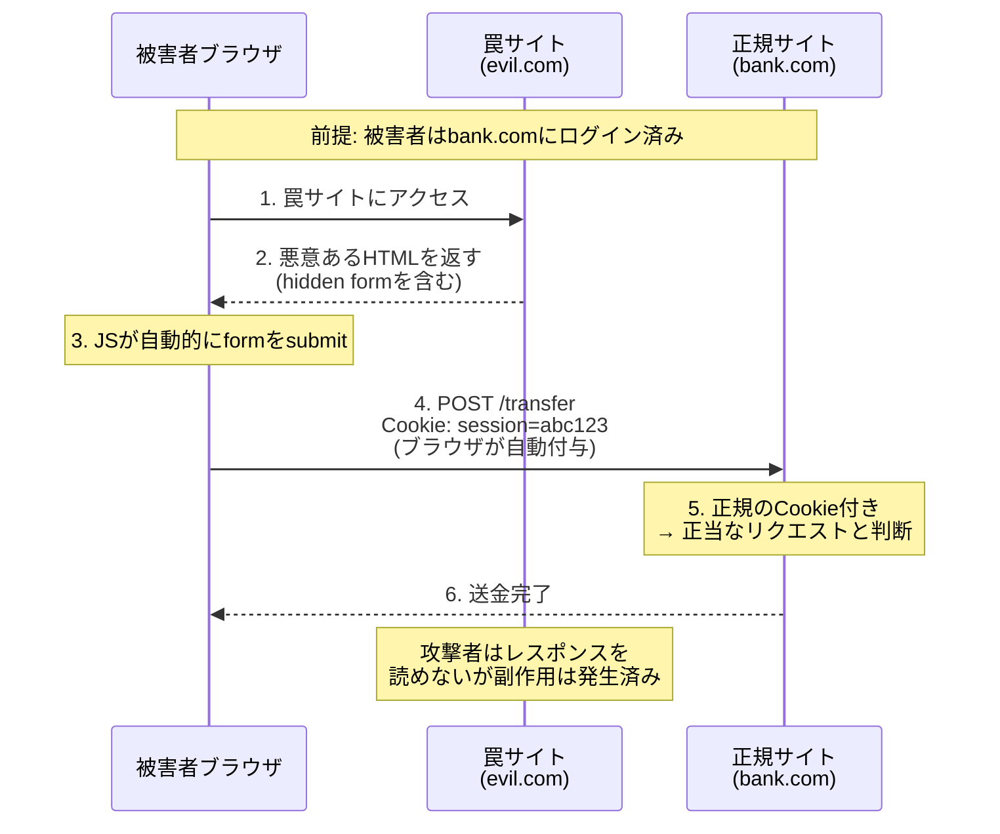
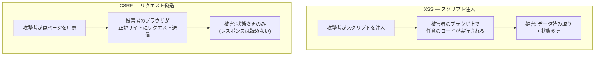
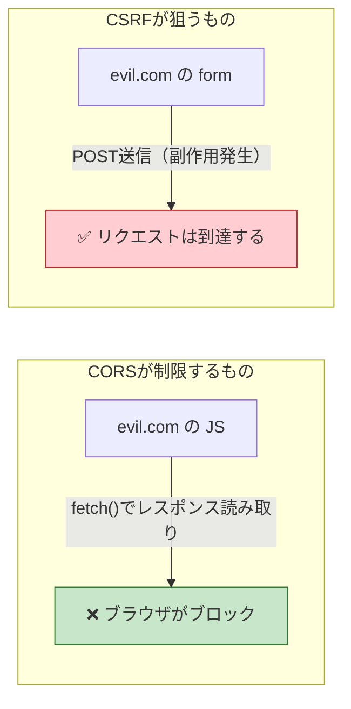
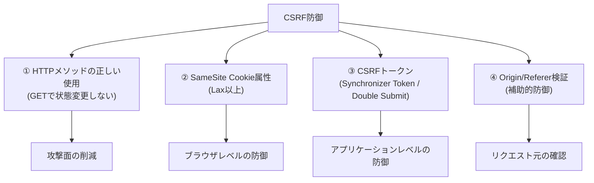
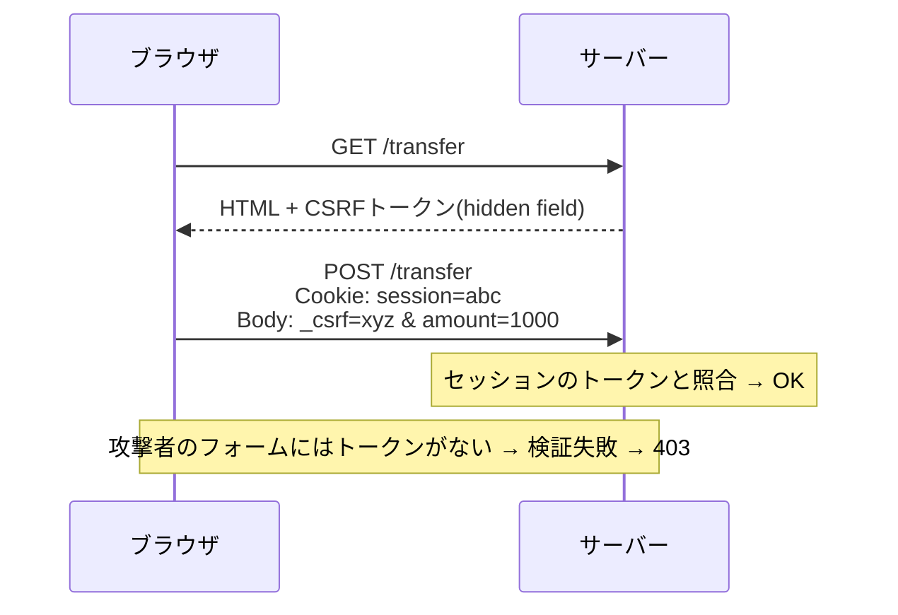
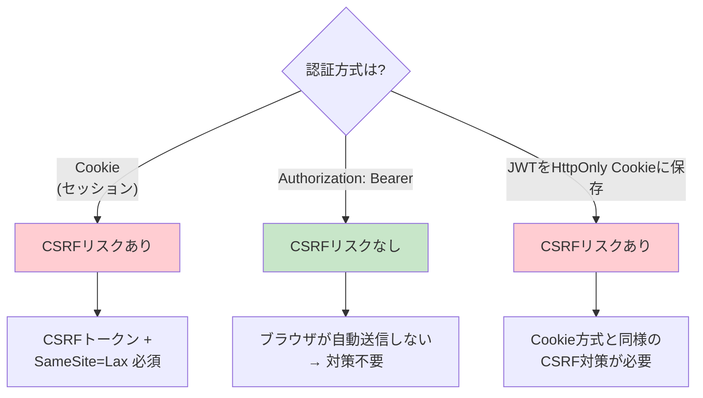

# CSRF（クロスサイトリクエストフォージェリ / Cross-Site Request Forgery）

> **一言で言うと:** ブラウザがCookieを自動送信する性質を悪用し、被害者のブラウザを踏み台にして正規サイトに意図しないリクエストを送信させる攻撃。CSRFトークンとSameSite Cookie属性で防ぐ。

## 3分で全体像

- **何を解決する技術か:** ログイン中のユーザーのブラウザを「正規 Cookie 付きの送信機」として悪用される事故を防ぐ。被害者が罠ページを開くだけで送金・設定変更・投稿が走る攻撃を、**リクエスト元の検証**で構造的に止める
- **代表的な使用シーン:** Cookie ベース認証を使う Web アプリ全般（ネットバンク・SNS・管理画面・SSR フレームワーク）、フォーム POST、状態変更系 API、SPA + Cookie 認証構成、SameSite=None で意図的にクロスサイトを許す決済フロー
- **これだけは覚える3つ:**
    1. **CSRF は「Cookie が自動送信される」性質への攻撃** — Bearer Token を `Authorization` ヘッダで送る方式は、JS が明示的に付与するためそもそも CSRF が成立しない。一方で **JWT を HttpOnly Cookie に保存して自動送信させた瞬間に CSRF リスクが復活する**ので「JWT だから安全」は誤り
    2. **CORS は CSRF を防がない** — CORS が制限するのは**レスポンスの読み取り**であってリクエスト送信ではない。`<form>` POST は単純リクエストとしてプリフライトなしで届く。面接で頻出の罠
    3. **多層防御で守る** — CSRF トークン（Synchronizer / Double Submit）+ `SameSite=Lax` 以上 + `GET で状態変更しない` + Origin/Referer 検証。1 つだけでは取りこぼす
- **AIに任せやすいか:** **一部任せられる** — Express の csrf-csrf、Django の `CsrfViewMiddleware`、Rails の `protect_from_forgery` のような**フレームワーク標準の有効化**は AI が高品質に書ける。一方で「**CSRF 保護を除外するルートの判断**」「**SameSite=None を選ぶ判断**」「**SPA でのトークン保存場所のトレードオフ**」は人間判断。AI は WebHook 受信エンドポイントを除外するつもりで全 API を除外しがち
- **詰まったらここを読む:** [[XSS]] / [[CORS]] / [[認証と認可]] / [[セッションとJWT]]

## なぜ必要か

CSRFを理解していないと、以下のような被害が発生する:

- **不正送金** — ログイン中のユーザーが罠サイトを訪問しただけで、攻撃者への送金が実行される
- **アカウント設定の改ざん** — メールアドレスやパスワードの変更が勝手に行われる
- **不正な投稿・購入** — SNSへの意図しない投稿、ECサイトでの不正購入
- **権限昇格** — 管理者がCSRF攻撃を受け、攻撃者のアカウントに管理者権限が付与される

CSRF が厄介なのは、**サーバーから見ると正規のリクエストと区別できない**こと。被害者のブラウザから正規のCookie付きで送信されるため、通常の認証チェックでは防げない。

## どの問題を解決するか

### 根本問題: Cookieの自動送信

Webブラウザは、ドメインに紐づいたCookieをそのドメインへのリクエスト時に**自動的に**付与する。これはリクエストの発信元がどこであっても関係ない。つまり `evil.com` のページから `bank.com` へのリクエストを発生させると、ブラウザは `bank.com` のCookieを自動送信してしまう。


```mermaid
sequenceDiagram
    participant Victim as 被害者ブラウザ
    participant Evil as 罠サイト<br/>(evil.com)
    participant Bank as 正規サイト<br/>(bank.com)

    Note over Victim,Bank: 前提: 被害者はbank.comにログイン済み

    Victim->>Evil: 1. 罠サイトにアクセス
    Evil-->>Victim: 2. 悪意あるHTMLを返す<br/>(hidden formを含む)
    Note over Victim: 3. JSが自動的にformをsubmit
    Victim->>Bank: 4. POST /transfer<br/>Cookie: session=abc123<br/>(ブラウザが自動付与)
    Note over Bank: 5. 正規のCookie付き<br/>→ 正当なリクエストと判断
    Bank-->>Victim: 6. 送金完了

    Note over Evil: 攻撃者はレスポンスを<br/>読めないが副作用は発生済み
```

### CSRFが成立する4つの前提条件

1. 被害者が対象サイトに**ログイン済み**（認証Cookieがブラウザに存在）
2. 対象サイトが**Cookieベースの認証**を使用
3. 対象サイトに**リクエスト元の検証がない**（CSRFトークン未導入）
4. 攻撃者が被害者を**罠サイトに誘導**できる（メール、SNS等）

### XSSとの構造的な違い

[[XSS]]とCSRFは混同されやすいが、攻撃の方向が根本的に異なる:


```mermaid
flowchart TB
    subgraph XSS["XSS — スクリプト注入"]
        X1["攻撃者がスクリプトを注入"] --> X2["被害者のブラウザ上で<br/>任意のコードが実行される"]
        X2 --> X3["被害: データ読み取り<br/>+ 状態変更"]
    end

    subgraph CSRF["CSRF — リクエスト偽造"]
        C1["攻撃者が罠ページを用意"] --> C2["被害者のブラウザが<br/>正規サイトにリクエスト送信"]
        C2 --> C3["被害: 状態変更のみ<br/>(レスポンスは読めない)"]
    end
```

| 観点 | XSS | CSRF |
|------|-----|------|
| 攻撃の本質 | コード注入（データ→コードの混同） | リクエスト偽造（Cookie自動送信の悪用） |
| 攻撃者ができること | **何でも**（読み取り + 書き込み） | **状態変更のみ**（レスポンスは読めない） |
| 脆弱性の場所 | 出力処理（エスケープ漏れ） | 入力処理（リクエスト元検証の欠如） |
| XSSが成功すると | CSRFトークンも読める → **CSRF防御が無効化** | — |

**重要:** XSSはCSRFの上位互換的な脅威。XSSが成功すると、ページ内のCSRFトークンを読み取り、正規のリクエストを完全に模倣できるため、CSRF防御が意味をなさなくなる。

## 他の仕組みとどう関係するか

- **下位レイヤーとの関係:**
  - [[HTTP-HTTPS]] — CSRFはHTTPのステートレス性とCookieの仕組みに起因する。Cookie属性（SameSite, Secure, HttpOnly）が防御の基盤
  - [[DNS]] — サブドメインが異なるサイト間でCookieを共有している場合、サブドメインからのCSRF攻撃のリスクがある

- **同レイヤーとの関係:**
  - [[XSS]] — XSSが成功するとCSRFトークンが窃取され、CSRF防御が無効化される。XSS対策はCSRF防御の前提条件
  - [[CORS]] — CORSはレスポンスの**読み取り**を制限するだけで、リクエストの**送信**は止めない。[[CORS]]設定だけではCSRFを防げない（詳細は[[details/CSRF]]を参照）
  - [[最小権限の原則]] — GETリクエストで状態変更しないという設計原則は、CSRFの攻撃面を減らす

- **上位レイヤーとの関係:**
  - [[認証と認可]] — CSRFはCookieベースの認証を悪用する。[[セッションとJWT|Bearer Token方式]]ではCSRFリスクが原理的に発生しない
  - [[ルーティングとミドルウェア]] — CSRFトークン検証はミドルウェアとして実装するのが一般的
  - [[バリデーション]] — リクエストの正当性検証の一環としてCSRFトークンを検証する

## 誤解されやすいポイント

### 1. 「CORSを設定すればCSRFは防げる」

CORSはレスポンスの読み取りを制限する仕組みであり、リクエストの送信自体は止めない。`<form>` によるPOSTは「単純リクエスト（Simple Request）」に該当し、CORSプリフライトが発生しない。つまりCORSの設定をどれだけ厳しくしても、formベースのCSRF攻撃は防げない。


```mermaid
flowchart LR
    subgraph CORS_Limit["CORSが制限するもの"]
        A["evil.com の JS"] -->|"fetch()でレスポンス読み取り"| B["❌ ブラウザがブロック"]
    end

    subgraph CSRF_Attack["CSRFが狙うもの"]
        C["evil.com の form"] -->|"POST送信（副作用発生）"| D["✅ リクエストは到達する"]
    end

    style B fill:#c8e6c9,stroke:#2e7d32
    style D fill:#ffcdd2,stroke:#c62828
```

### 2. 「GETリクエストならCSRFは問題ない」

GETリクエストで状態変更を行うAPIが存在すれば、`` だけで攻撃できる。**GETリクエストは副作用のない安全なメソッドであるべき**というHTTPの原則（RFC 9110）に従うことが根本的な防御。

### 3. 「Content-Type: application/json ならCSRFは起きない」

`application/json` はCORSプリフライトを発生させるため、一見安全に思える。しかし:
- サーバーが `Content-Type` を検証せず `text/plain` でも受け付ける場合は回避可能
- 過去にはFlash等を利用した回避手段も存在した
- Content-Typeだけに依存する防御は脆弱

### 4. 「SameSite=Lax がデフォルトだからCSRF対策は不要」

`SameSite=Lax` は**POSTベースのCSRFを防ぐ**が、以下のケースでは不十分:
- GETリクエストで状態変更を行う設計（そもそもHTTPの使い方が間違っている）
- サブドメイン間でCookieを共有しているケース
- `SameSite=None` を明示的に設定しているサードパーティCookie

多層防御の観点から、SameSite属性 **+** CSRFトークンの併用が推奨される。

### 5. 「Bearer Token（JWT）を使っていればCSRF対策は一切不要」

`Authorization: Bearer <token>` ヘッダで認証する場合、トークンはJSが明示的に設定するためCSRFは原理的に成立しない。しかし、JWTを `HttpOnly` Cookie に保存して自動送信させる設計を採用した場合、CSRFリスクが復活する。認証トークンの**保存場所と送信方法**によってCSRFリスクが変わる。

## 設計のベストプラクティス

### 防御策の全体像


```mermaid
flowchart TD
    A["CSRF防御"] --> B["① HTTPメソッドの正しい使用<br/>(GETで状態変更しない)"]
    A --> C["② SameSite Cookie属性<br/>(Lax以上)"]
    A --> D["③ CSRFトークン<br/>(Synchronizer Token / Double Submit)"]
    A --> E["④ Origin/Referer検証<br/>(補助的防御)"]

    B --> B1["攻撃面の削減"]
    C --> C1["ブラウザレベルの防御"]
    D --> D1["アプリケーションレベルの防御"]
    E --> E1["リクエスト元の確認"]
```

### 1. CSRFトークンパターン

**Synchronizer Token Pattern（サーバーサイドレンダリング向け）:**

サーバーがセッションごとに一意のトークンを生成し、フォームのhiddenフィールドに埋め込む。攻撃者は被害者のセッションに紐づくトークンの値を知ることができないため、正当なリクエストを偽造できない。


```mermaid
sequenceDiagram
    participant Browser as ブラウザ
    participant Server as サーバー

    Browser->>Server: GET /transfer
    Server-->>Browser: HTML + CSRFトークン(hidden field)
    Browser->>Server: POST /transfer<br/>Cookie: session=abc<br/>Body: _csrf=xyz & amount=1000
    Note over Server: セッションのトークンと照合 → OK

    Note over Browser,Server: 攻撃者のフォームにはトークンがない → 検証失敗 → 403
```

**Double Submit Cookie Pattern（SPA向け）:**

CSRFトークンをCookieとリクエストヘッダの両方で送信し、サーバーが両者の一致を検証する。攻撃者は自分のサイトから被害者のCookieを読み取れないため、ヘッダに正しいトークンを設定できない。

### 2. SameSite Cookie属性

| 値 | クロスサイトでのCookie送信 | CSRF防御 | UXへの影響 |
|----|-------------------------|----------|-----------|
| `Strict` | 一切送信しない | 最強 | 外部リンクからのアクセスでログアウト状態 |
| `Lax` | トップレベルナビゲーションのGETのみ | POST CSRFを防御 | ほぼ影響なし（**推奨**） |
| `None` | 常に送信（`Secure` 必須） | なし | 影響なし |

### 3. 認証方式による防御の違い


```mermaid
flowchart TD
    A{"認証方式は?"} -->|"Cookie<br/>(セッション)"| B["CSRFリスクあり"]
    A -->|"Authorization: Bearer"| C["CSRFリスクなし"]
    A -->|"JWTをHttpOnly Cookieに保存"| D["CSRFリスクあり"]

    B --> E["CSRFトークン +<br/>SameSite=Lax 必須"]
    C --> F["ブラウザが自動送信しない<br/>→ 対策不要"]
    D --> G["Cookie方式と同様の<br/>CSRF対策が必要"]

    style B fill:#ffcdd2
    style C fill:#c8e6c9
    style D fill:#ffcdd2
```

### アンチパターン

| アンチパターン | なぜ問題か | 対策 |
|---|---|---|
| GETリクエストで状態変更 | `` タグだけで攻撃可能 | 状態変更は POST/PUT/DELETE のみ |
| CSRFトークンをURLパラメータに含める | Refererヘッダやログに漏洩する | hidden field または カスタムヘッダで送信 |
| 全ユーザー共通のCSRFトークン | 他ユーザーのトークンで攻撃可能 | セッションに紐づくトークンを生成 |
| CORSだけでCSRF対策とみなす | CORSはリクエスト送信を止めない | CSRFトークンで対策 |

## AIエージェントとの協働

> このトピックでAIコーディングエージェント（Claude Code, Copilot, Cursor 等）と協働するための観点。
> **「AIに何をどこまで任せ、AIに何をレビューさせ、人間は何を最終判断するか」**を整理する。実装だけでなく**レビューもAIに任せられる**前提で考える（`/review-ai-code` skillが横断アンチパターン照合を担う）。

### AIに任せられる部分 / 人間が判断すべき部分

| タスク種類 | 任せ方（実装/レビュー） | 人間の関与 |
|---|---|---|
| フレームワーク標準 CSRF ミドルウェアの導入（Django / Rails / Express + csrf-csrf / Laravel） | 実装・レビュー両方 AI 委任。`/review-ai-code` で「除外ルート過多」「`SameSite=None` 誤用」を検出させる | フレームワーク選定後の整合性確認のみ |
| `SameSite` Cookie 属性の設定 | 既定値 `Lax` の選択は AI 任せ | `SameSite=None` を選ぶ場面（決済リダイレクト・iframe 埋め込み）の妥当性判断 |
| Double Submit Cookie パターンの SPA 実装 | トークン Cookie 発行 + ヘッダ検証ロジックは AI が定型実装可 | トークン保存先（localStorage / sessionStorage / Cookie）のトレードオフ判断 |
| CSRF 保護除外ルートの設計（Webhook 受信、外部 API コールバック） | 提案は AI、レビューは `/review-ai-code` で「全 API 除外」を検出 | 除外ルートのリスト承認、Webhook の代替認証（HMAC 署名）方式の設計 |
| Origin / Referer ヘッダの検証 | 実装は AI、proxy 配下での `X-Forwarded-Host` 整合性も AI に確認させる | 信頼するプロキシの段数決定（`trust proxy`）、CDN 配下の挙動確認 |
| 攻撃再現テスト（罠 HTML を用意して別オリジンから POST） | テスト生成・CI 組み込みは AI 委任 | テスト対象エンドポイントの優先順位決定 |

### AI生成コードのレビュー観点（このトピック固有）

AI生成物を受け取ったとき、最低限ここを見る。

1. **状態変更が GET で行われていないか** — `GET /transfer?to=X&amount=Y` は `` だけで攻撃可能。POST/PUT/DELETE で実装されているか、`safe-methods` の扱いが HTTP 仕様準拠か確認する
2. **CSRF 保護の除外（exempt）が必要最小限か** — AI は WebHook 1 本のために全 API を除外する設定を書きがち。`csrf_exempt` / `withoutMiddleware` の対象は**個別ルートに限定**し、Webhook には HMAC 署名等の別認証を入れる
3. **`SameSite` の値と Cookie 認証の整合性** — `SameSite=None` には `Secure` 必須。`Lax` で十分なケースに `None` を提案していないか、その逆に決済リダイレクトで `Lax` のままにしていないかを確認

### 効くプロンプトの型

このトピックに関する実装をAIに依頼するとき、コンテキストとして渡すべき情報・制約・成功基準のテンプレ。

```
# 前提（プロジェクトの状況・既存のコード規約）
- フレームワーク: Express 5 / SPA は別オリジン（app.example.com → api.example.com）
- 認証: HttpOnly + Secure + SameSite=Lax の Session Cookie
- 状態変更系 API: POST /api/transfer, PUT /api/profile, DELETE /api/account
- 既存の csrf-csrf は導入済み、トークンは X-CSRF-Token ヘッダで送信

# やってほしいこと
- /api/webhooks/stripe を新規追加する。Stripe からのみ POST を受け付ける

# 守ってほしい制約（このトピック固有のもの）
- /api/webhooks/* は CSRF 保護から除外してよいが、代わりに Stripe-Signature ヘッダで HMAC 検証を必須にする
- 既存の状態変更系 API の CSRF 保護は維持する
- SameSite=None への変更は禁止（決済リダイレクトは別ドメインを経由しない）

# 完了の判断基準
- 別オリジンから X-CSRF-Token なしで POST /api/transfer すると 403
- /api/webhooks/stripe は CSRF トークンなしで通るが、署名不正の場合は 401
- 既存テストが緑のまま
```

### AI実装のアンチパターン

LLM生成コードで頻出する過剰設計・誤用パターン。レビュー時の照合表として使う。

| アンチパターン | なぜ問題か | レビュー観点 / 対策 |
|---|---|---|
| CSRF 保護を持たない API フレームワークで Cookie 認証を使用 | FastAPI / Hono 等は CSRF 保護がデフォルトで無い | Cookie 認証を使う場合は明示的に CSRF ミドルウェアを導入 |
| CSRF トークン検証から全 API ルートを除外 | Webhook など特定ルートの除外が全体に波及するコードを生成しがち | 除外はルート単位で明示。代替認証（HMAC 署名）を入れる |
| `SameSite=None` を深く考えずに設定 | サードパーティ Cookie 利用のために安易に設定すると CSRF 防御が無効化 | 本当に必要なケースのみ `None` を使用し、CSRF トークンで補完 |
| テスト環境で CSRF 保護を無効化してそのまま本番へ | `if (env !== 'test') { enableCsrf() }` のような条件分岐が本番で漏れる | 環境変数で分岐せず、テスト用 HTTP クライアントでトークンを取得する設計に統一 |
| GET エンドポイントで状態変更（DB 書き込み・課金処理） | `` だけで攻撃可能、HTTP 仕様（RFC 9110）違反 | 状態変更は POST/PUT/DELETE のみ、GET は冪等・副作用なし |
| 全ユーザー共通の固定 CSRF トークン | 1 つ漏れると全ユーザーが攻撃される | セッション / ユーザー単位でトークンを発行し、Synchronizer Token として検証 |
| CORS の `Allow-Origin` 制限を CSRF 対策とみなす | CORS はレスポンス読み取り制限であり、リクエスト送信は止めない | CSRF トークン + `SameSite` で対策 |
| Bearer Token を HttpOnly Cookie に保存しつつ CSRF 対策なし | Cookie 自動送信が復活し CSRF が成立 | Cookie 保存にする時点で Cookie 認証と同等の CSRF 対策が必要 |

→ レイヤー横断のアンチパターン索引: [[_anti-patterns/_index|AIアンチパターン索引]]

## 具体例

以下はTypeScript, Go, Pythonの代表例。PHP（Laravel）、Ruby（Rails）、Python（FastAPI）の実装は[[details/CSRF]]を参照。

### TypeScript（Express + csrf-csrf）

`csurf` パッケージは非推奨のため、代替として `csrf-csrf`（Double Submit Cookie Pattern）を使用する。

```typescript
import express from "express";
import { doubleCsrf } from "csrf-csrf";
import cookieParser from "cookie-parser";

const app = express();
app.use(express.urlencoded({ extended: true }));
app.use(cookieParser("my-secret"));

const { generateToken, doubleCsrfProtection } = doubleCsrf({
  getSecret: () => "my-secret",
  cookieName: "__csrf",
  cookieOptions: {
    httpOnly: true,
    sameSite: "lax",
    secure: process.env.NODE_ENV === "production",
  },
  getTokenFromRequest: (req) =>
    req.body._csrf ?? req.headers["x-csrf-token"],
});

// フォーム表示時にCSRFトークンを埋め込む
app.get("/transfer", (req, res) => {
  const token = generateToken(req, res);
  res.send(`
    <form method="POST" action="/transfer">
      <input type="hidden" name="_csrf" value="${token}" />
      <input name="to" placeholder="送金先" />
      <input name="amount" type="number" placeholder="金額" />
      <button type="submit">送金</button>
    </form>
  `);
});

// CSRF検証ミドルウェアを適用
app.post("/transfer", doubleCsrfProtection, (req, res) => {
  // トークン検証に通過した場合のみここに到達
  res.send(`送金完了: ${req.body.to} に ${req.body.amount}円`);
});

app.listen(3000);
```

### Go（nosurf）

```go
package main

import (
	"fmt"
	"html/template"
	"net/http"

	"github.com/justinas/nosurf"
)

var formTmpl = template.Must(template.New("form").Parse(`
<!DOCTYPE html>
<form method="POST" action="/transfer">
  <input type="hidden" name="csrf_token" value="{{.Token}}" />
  <input name="to" placeholder="送金先" />
  <input name="amount" type="number" placeholder="金額" />
  <button type="submit">送金</button>
</form>
`))

func showForm(w http.ResponseWriter, r *http.Request) {
	formTmpl.Execute(w, map[string]string{
		"Token": nosurf.Token(r), // リクエストに紐づくトークンを取得
	})
}

func handleTransfer(w http.ResponseWriter, r *http.Request) {
	// nosurfミドルウェアがトークンを自動検証済み
	fmt.Fprintf(w, "送金完了: %s に %s円",
		r.FormValue("to"), r.FormValue("amount"))
}

func main() {
	mux := http.NewServeMux()
	mux.HandleFunc("GET /transfer", showForm)
	mux.HandleFunc("POST /transfer", handleTransfer)

	// nosurfでラップ — 状態変更メソッドでCSRFトークンを自動検証
	handler := nosurf.New(mux)
	handler.SetBaseCookie(http.Cookie{
		HttpOnly: true,
		SameSite: http.SameSiteLaxMode,
		Secure:   true,
		Path:     "/",
	})

	http.ListenAndServe(":3000", handler)
}
```

### Python（Django）

Djangoは `CsrfViewMiddleware` がデフォルトで有効。テンプレートで `` を使うだけでよい。

```python
# views.py
from django.shortcuts import render, redirect
from django.contrib import messages

def transfer_form(request):
    return render(request, "transfer.html")

def transfer(request):
    # CsrfViewMiddleware がトークンを自動検証
    # 不正なトークンの場合は 403 Forbidden
    to = request.POST["to"]
    amount = request.POST["amount"]
    # 送金処理...
    messages.success(request, f"送金完了: {to} に {amount}円")
    return redirect("/transfer")
```

```html
<!-- transfer.html -->
<form method="POST" action="/transfer/">
  
  <!-- ↑ <input type="hidden" name="csrfmiddlewaretoken" value="..."> を自動生成 -->
  <input name="to" placeholder="送金先" />
  <input name="amount" type="number" placeholder="金額" />
  <button type="submit">送金</button>
</form>
```

### SPA + API 構成での対策

```typescript
// SPA側 — Double Submit Cookie Pattern
// サーバーが XSRF-TOKEN Cookie（HttpOnly: false）を発行
// JSがCookieからトークンを読み取り、リクエストヘッダに付与

async function transferMoney(to: string, amount: number) {
  const csrfToken = document.cookie
    .split("; ")
    .find((row) => row.startsWith("XSRF-TOKEN="))
    ?.split("=")[1];

  const res = await fetch("/api/transfer", {
    method: "POST",
    credentials: "include", // Cookie送信に必要
    headers: {
      "Content-Type": "application/json",
      "X-XSRF-TOKEN": csrfToken ?? "", // ヘッダにもトークンを付与
    },
    body: JSON.stringify({ to, amount }),
  });

  return res.json();
}
```

### 罠ページの例（攻撃者が何をするかを理解する）

```html
<!-- evil.com に設置された罠ページ -->
<!-- ページを開いただけでformが自動送信される -->
<html>
<body onload="document.getElementById('csrf-form').submit()">
  <form id="csrf-form" action="https://bank.com/transfer" method="POST">
    <input type="hidden" name="to" value="attacker-account" />
    <input type="hidden" name="amount" value="1000000" />
  </form>
</body>
</html>
```

この罠ページが機能するのは、ブラウザが `bank.com` へのPOST時に `bank.com` のセッションCookieを自動送信するため。CSRFトークンがなければ、サーバーはこのリクエストを正規のものと区別できない。

## 参考リソース

- OWASP CSRF Prevention Cheat Sheet — CSRF防御策の網羅的ガイド
- PortSwigger Web Security Academy: CSRF — ハンズオン学習環境（無料）
- MDN Web Docs: SameSite cookies — SameSite属性の公式リファレンス

## 理解度セルフチェック

> 答えられなければ本文に戻る。答えはこのファイル内に必ずある。

1. CSRF が成立する 4 つの前提条件を列挙し、そのうちどれを潰せば防御になるかを述べよ。
2. 「`Authorization: Bearer <JWT>` ヘッダで認証している API は CSRF 対策不要」は常に正しいか。Yes / No と理由を述べよ。
3. 次のコードは Express + csrf-csrf を使っているように見えるが、CSRF 観点で問題がある。**3 箇所すべての問題を指摘し**、それぞれどう直すべきかを述べよ。
   ```typescript
   import { doubleCsrf } from 'csrf-csrf';
   const { doubleCsrfProtection } = doubleCsrf({ getSecret: () => 'my-secret' });

   // すべての状態変更系 API
   app.post('/api/transfer', doubleCsrfProtection, transferHandler);
   app.delete('/api/account', doubleCsrfProtection, deleteHandler);

   // GitHub からの Webhook を受信する
   app.post('/api/webhooks/github', githubWebhookHandler); // 開発時に CSRF が邪魔だったので外した

   // 銀行残高を取得（読み取り専用に見えるが、ログ書き込み + 残高再計算が走る）
   app.get('/api/balance/refresh', refreshBalance);
   ```

> [!note]- 解答の指針
>
> > [!info] 用語ミニ辞典
> > - **Synchronizer Token Pattern**: サーバーがセッションごとに固有のトークンを生成し、フォームの hidden field に埋め込んで送信させる方式。サーバーはセッションのトークンと送信値を照合する。攻撃者は被害者セッションのトークンを知る手段がない
> > - **Double Submit Cookie Pattern**: トークンを Cookie とリクエストヘッダ（または body）の両方で送らせ、サーバーが両者の一致を検証する方式。SameSite Cookie で攻撃者は被害者の Cookie を読み取れないため、ヘッダ値を一致させられない。SPA + API 構成で使いやすい
> > - **SameSite Cookie 属性**: Cookie をクロスサイトリクエストで送信するかをブラウザに指示する属性。`Strict`（送信しない）/ `Lax`（トップレベルナビゲーションの GET のみ送信、現代ブラウザのデフォルト）/ `None`（常に送信、`Secure` 必須）の 3 値
> > - **HMAC 署名**: 共有秘密鍵とハッシュ関数で計算した署名値で、送信者を検証する仕組み。Webhook では `X-Hub-Signature-256` のようなヘッダで送られ、受信側は同じ秘密鍵で再計算して照合する。CSRF 保護を外す代わりの認証として有効
> > - **単純リクエスト（Simple Request）**: CORS でプリフライトが発生しないリクエスト。`<form>` の POST は `application/x-www-form-urlencoded` で送られるため単純リクエストとなり、CORS の制限を受けずにサーバーに届く（CSRF が成立する根拠）
>
> 1. **4 条件:**
>     ① 被害者が対象サイトにログイン済み（認証 Cookie がある）
>     ② サイトが Cookie ベース認証を使用
>     ③ サイトがリクエスト元検証を持たない
>     ④ 攻撃者が被害者を罠ページに誘導できる
>     **どれを潰すか**: ② と ③ がアプリ側でコントロール可能。② は Bearer Token 化（Cookie 自動送信を使わない）、③ は CSRF トークン + `SameSite=Lax` + Origin/Referer 検証。① ④ は止められないので「ログイン済みユーザーが踏むことを前提」に防御する
> 2. **No**。理由:
>     - Bearer Token を `Authorization` ヘッダで送る場合は JS が明示的に付与するため CSRF は原理的に成立しない
>     - しかし JWT を `HttpOnly` Cookie に保存して**自動送信**させる構成にした瞬間、Cookie 認証と同じ CSRF リスクが発生する
>     - 「JWT だから安全」ではなく、「**トークンの送信方法（明示的ヘッダ vs 自動 Cookie）**」が決め手。Cookie に保存するなら CSRF トークンや SameSite による補強が必要
> 3. **3 つの問題**:
>     - **`POST /api/webhooks/github` の CSRF 除外が認証なし** — CSRF 保護を外すこと自体は妥当（外部からの正規リクエストなのでトークンを持たせられない）だが、その代わりに `X-Hub-Signature-256` で HMAC 署名検証を入れるべき。現状は誰でも `/api/webhooks/github` に POST できる
>     - **`GET /api/balance/refresh` で副作用** — ログ書き込みと残高再計算が走るのに GET を使っている。`` だけで攻撃される。**POST に変更**し、CSRF 保護を適用する。「読み取り専用に見える」名前と実態の乖離は典型的な落とし穴
>     - **GET ルート全般に CSRF 保護がない設計** — 上記が直っていれば構造的には正しいが、コードレビュー時には「副作用のある GET が他に紛れていないか」を `/review-ai-code` で横断確認するとよい
>     - 修正後: `app.post('/api/balance/refresh', doubleCsrfProtection, refreshBalance)`、`/api/webhooks/github` は HMAC 検証ミドルウェアを通す

## 学習メモ

- CSRFは「Cookieが自動送信される」という仕組みへの攻撃。Bearer Token認証ではそもそも成立しない
- [[XSS]]が成功するとCSRFトークンも読めるため、XSS対策はCSRF防御の前提条件
- [[CORS]]はCSRFを防がない — この違いは頻出の面接トピック
- [[details/CSRF]] に、Laravel/Rails/FastAPI の実装例とSPA構成でのToken保存場所トレードオフがまとまっている
