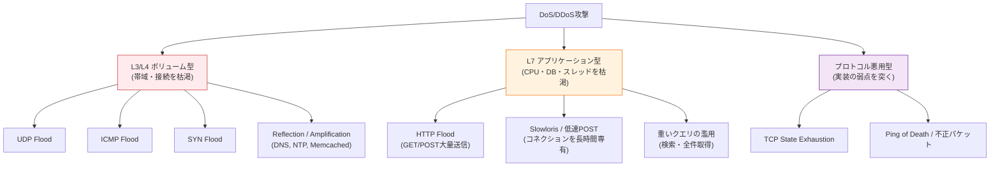
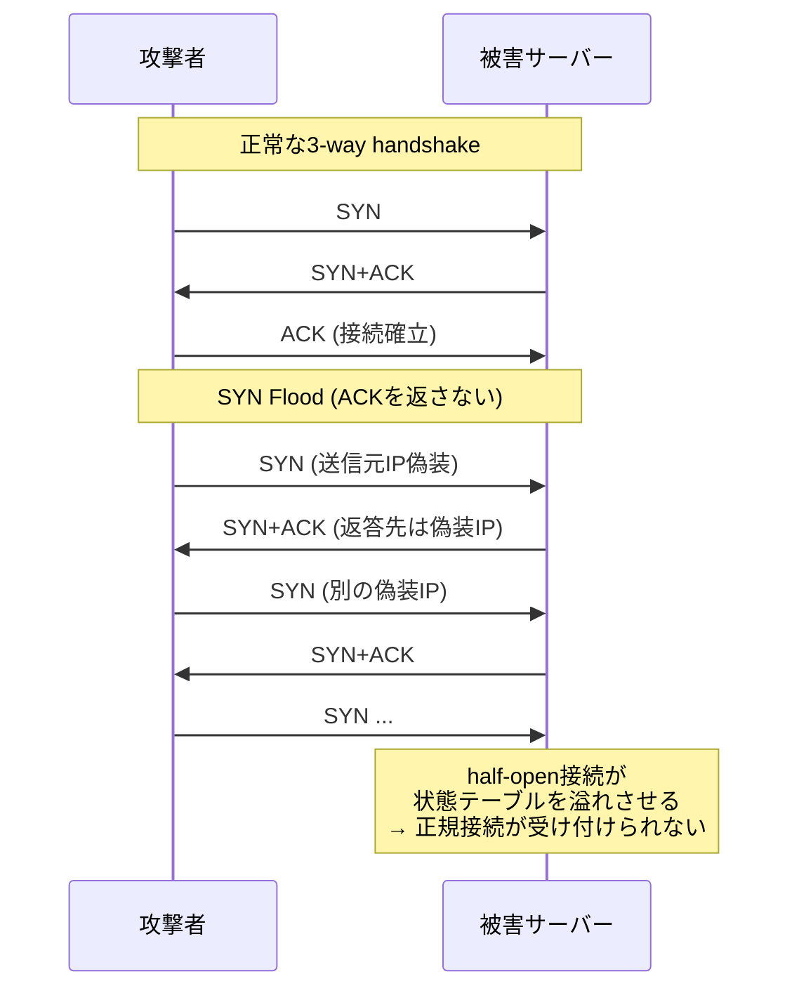
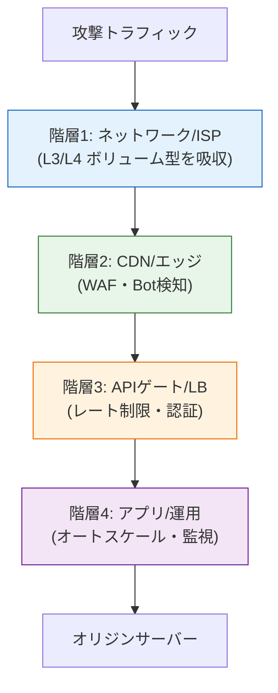
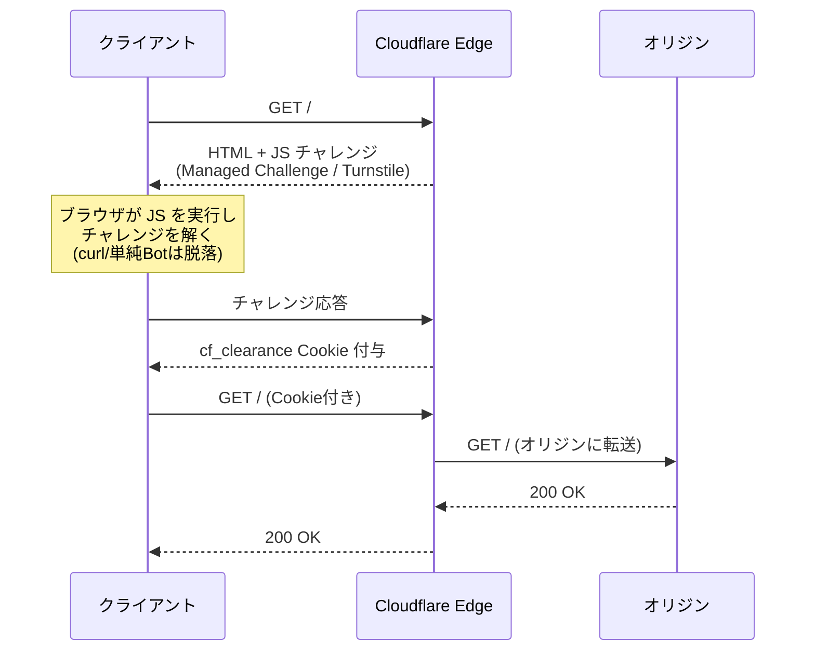

# DoS攻撃とDDoS攻撃（Denial of Service / Distributed Denial of Service）

> **一言で言うと:** DoS（Denial of Service）はサーバーやネットワークのリソースを枯渇させ、正規ユーザーへのサービス提供を妨げる攻撃。DDoS（Distributed DoS）は多数の踏み台（ボットネット）を使った分散型で、攻撃元の特定・遮断が極めて困難。単一の銀の弾丸はなく、[[CDN]]・[[ロードバランシング]]・[[レート制限]]を組み合わせた**多層防御**で対処する。

## なぜ必要か

情報セキュリティの3要素 CIA トライアド（Confidentiality / Integrity / **Availability**）のうち、DoS/DDoS は **可用性（Availability）** を直接攻撃する。XSS や SQL インジェクションのような「データを盗む・改ざんする」攻撃と異なり、「サービスを止める」だけで事業を破壊できるため、技術的な単純さに反して被害規模は大きい。

DoS/DDoS を理解していないと以下のような被害が発生する:

- **売上喪失** — EC サイトや SaaS が数時間停止するだけで数百万〜数億円の機会損失
- **SLA 違反** — 顧客との契約上のペナルティ、顧客離反
- **巻き添え被害** — 自社が直接の標的でなくても、共有 CDN・共有 IDC・共有 ISP 経由で影響を受ける（コラテラルダメージ）
- **別攻撃の隠蔽** — DoS で監視ログを溢れさせ、その隙に侵入や情報窃取を行う「スモークスクリーン」
- **ボットネットへの加担** — 自社サーバーが乗っ取られ、他者への攻撃の踏み台にされる（加害者化）

DoS/DDoS が厄介なのは、**正規プロトコルを正規の方法で大量に使うだけで成立する**こと。不正アクセスを伴わないため侵入検知では捕捉できず、リクエスト1件1件は完全に正当に見える。

## どの問題を解決するか

### 攻撃の目的（4分類）

| 目的 | 概要 | 代表例 |
|------|------|--------|
| **金銭的恐喝（Ransom DDoS / RDoS）** | 「攻撃を止めてほしければ仮想通貨で支払え」と脅迫 | 2020年以降急増、金融機関・ゲーム業者が標的 |
| **競合・営業妨害** | セール期間や新作リリース時を狙って事業妨害 | EC・ゲーム・チケット販売 |
| **政治的・思想的抗議（ハクティビズム）** | 政府機関・大企業への抗議活動 | Anonymous の各種作戦 |
| **別攻撃の隠蔽（スモークスクリーン）** | DoS で運用チームの注意・ログ容量を奪い、その裏で侵入・データ窃取 | APT 攻撃の前段 |

ここで重要なのは、**「自社のシステムが攻撃される動機」と「攻撃が発生する確率」は別物**ということ。Botnet の運用者は無差別スキャンで脆弱なサーバーを発見し、踏み台にしたり練習台にしたりする。「うちは小さいから狙われない」は通用しない。

### 攻撃手法のレイヤー分類（OSI 基準）

DoS/DDoS は OSI モデルのどの層を狙うかで対処法がまったく異なる。



#### L3/L4 ボリューム型

ネットワーク帯域やトランスポート層の状態テーブルを物理的に飽和させる攻撃。攻撃トラフィックを「アプリに到達する前に」止める必要がある。

- **UDP Flood / ICMP Flood**: ランダムなポートに大量の UDP/ICMP パケットを送りつけ、回線帯域とルーター/FW の処理能力を消費
- **SYN Flood**: TCP 3 ウェイハンドシェイクで SYN だけ送って ACK を返さず、サーバーの half-open 接続テーブルを溢れさせる（[[TCP-IP]] の状態管理を悪用）
- **Reflection / Amplification（増幅攻撃）**: 送信元 IP を被害者に偽装したクエリを、応答が大きくなるプロトコル（[[DNS]]・NTP・Memcached）に送り、応答を被害者に集中させる。Memcached の増幅率は最大で約 51,000 倍に達することがあり、2018年 GitHub への 1.35Tbps 攻撃（当時史上最大）の主因となった

#### L7 アプリケーション型

ネットワーク的には少量でも、アプリケーション側の重い処理（DB クエリ、暗号処理、テンプレート描画）を狙ってサーバーを疲弊させる。

- **HTTP Flood**: 正規の GET/POST を大量送信。1 リクエストあたり DB 数十回読みが発生するエンドポイントが標的
- **Slowloris**: HTTP リクエストヘッダを「1バイトずつ」「数秒おきに」送り、コネクションを長時間掴んだまま離さない。少数のクライアントで Apache の全ワーカープロセスを枯渇できる
- **重いクエリの濫用**: 全文検索や全件エクスポート API を繰り返し叩き、DB に負荷を集中

#### プロトコル悪用型

実装の弱点や仕様の歪みを突く。**TCP State Exhaustion** はファイアウォールやロードバランサーの接続トラッキングテーブルを満杯にする。

### 攻撃比較表

| 攻撃タイプ | 帯域消費 | 接続消費 | CPU消費 | 検知難易度 | 対処の主担当 |
|-----------|---------|---------|--------|-----------|-------------|
| UDP/ICMP Flood | ◎ | △ | × | 易 | ISP / CDN 上流 |
| SYN Flood | △ | ◎ | △ | 中 | OS / FW / LB |
| 増幅攻撃 | ◎ | × | × | 易 | ISP / CDN 上流 |
| HTTP Flood | △ | ○ | ◎ | 難 | WAF / [[レート制限]] |
| Slowloris | × | ◎ | × | 難 | アプリサーバー設定 |
| 重いクエリ濫用 | × | △ | ◎ | 難 | アプリ層 / API Gateway |

### SYN Flood の原理（参考シーケンス）



## 他の仕組みとどう関係するか

- **下位レイヤーとの関係:**
  - [[TCP-IP]] — SYN Flood は TCP の 3-way handshake と half-open 接続管理の弱点を突く。SYN Cookie は OS カーネルレベルの代表的な対策
  - [[DNS]] — DNS 増幅攻撃の踏み台にされる（オープンリゾルバ問題）。逆に、攻撃時には DNS ベースのトラフィックステアリングで Anycast に逃がす
  - [[HTTP-HTTPS]] — HTTP Flood、Slow HTTP 攻撃の前提プロトコル。HTTP/2 の Rapid Reset 攻撃（CVE-2023-44487）のような新しいベクトルも継続的に登場

- **同レイヤーとの関係:**
  - [[XSS]] / [[CSRF]] / [[SQLインジェクション]] が「機密性・完全性」を狙うのに対し、DoS/DDoS は「可用性」を狙う点で性質が異なる。攻撃成立に脆弱性が不要な点も対照的
  - [[最小権限の原則]] — DoS が別攻撃の隠蔽（スモークスクリーン）として使われ、混乱の最中に侵入を許した場合に、二次被害の範囲を限定する文脈で関連

- **上位/横断レイヤーとの関係:**
  - [[CDN]] — 第一の防衛線。エッジで攻撃トラフィックを吸収・スクラビングし、オリジンに到達させない。Anycast による地理的分散も DDoS 耐性の核心
  - [[ロードバランシング]] — 水平スケールとオートスケールにより L7 攻撃の処理キャパシティを動的に増やせる。ヘルスチェックが攻撃中も正しく機能する設計が前提
  - [[レート制限]] — L7 攻撃に対する最も基本的な対策。ただし帯域型 DoS には無力なことに注意
  - [[モニタリング]] — 平常時のベースライン（RPS、5xx率、レイテンシ分布、接続数）を取得しておくことが、異常検知・自動対応の前提

## 誤解されやすいポイント

### 1. 「DDoS = ハッキング」ではない

DDoS は不正アクセス（脆弱性を突いた侵入）を**伴わない**。正規プロトコルを正規の方法で大量に使うだけで成立する。そのため、IDS/IPS や脆弱性管理では検知・防御できない。「セキュリティパッチを当てているから DDoS は大丈夫」は完全な誤解。

### 2. 「ファイアウォールがあれば防げる」

L4 ファイアウォールは帯域型攻撃に対して**自身がボトルネック**になる。FW の処理能力（数 Gbps）を超えるトラフィックが来れば FW ごと落ちる。帯域型 DDoS は**自社ネットワークの上流（ISP/CDN）で吸収する**しかない。「自社内に置いた装置」での対処は原理的に限界がある。

### 3. 「自分のサーバーは小さいから狙われない」

Botnet の運用者は無差別スキャンで脆弱なサーバーを探し、踏み台や練習台にする。Mirai ボットネット（2016年）は IoT 機器を踏み台に Dyn DNS を攻撃し、Twitter・Netflix・Reddit を世界規模で停止させた。「狙われる動機」と「攻撃を受ける確率」は別物。

### 4. 「サーバーを増強すれば解決」(非対称性の誤解)

DDoS は**非対称戦**である。攻撃側は1台のレンタル C2 サーバーで数万〜数十万のボットを操れる一方、防御側は1リクエストあたり数十円〜数百円のクラウドコストを払う。コスト勝負では構造的に防御側が負ける。「スケールアウトすれば耐えられる」発想は財務的に持続不可能で、**攻撃トラフィックを防御コストの安い層（CDN/上流）でブロックする**ことが本質。

### 5. 「Slowloris のような低帯域攻撃は気づきやすい」

Slowloris は帯域消費がほぼゼロで、ネットワーク監視（帯域・PPS）のグラフでは何も異常が見えない。にもかかわらずアプリのコネクションプールが枯渇し、ある瞬間突然 503 を返し始める。**接続数・接続継続時間・ヘッダ受信時間**といったアプリ層メトリクスを取っていないと検知できない。

## 設計のベストプラクティス

### 多層防御モデル

DoS/DDoS には単一の対策はなく、攻撃の種類・規模に応じて4つの階層で防御を組み合わせる。



| 階層 | 主な対策 | 担当 | 効く攻撃タイプ |
|------|---------|------|---------------|
| **ネットワーク（L3/L4）** | Anycast 分散、ISP/上流のスクラビング、BGP Flowspec、SYN Cookie | CDN / 通信事業者 | 帯域型・増幅攻撃・SYN Flood |
| **アプリケーション（L7）** | WAF、Bot 検知、JS チャレンジ、CAPTCHA | CDN / WAF | HTTP Flood・Bot |
| **認証・APIゲート** | レート制限、IP/ASN 評価、行動分析 | API Gateway / アプリ | API 濫用・低速攻撃 |
| **アプリ・運用** | オートスケール、グレースフルデグラデーション、ランブック整備 | SRE | キャパシティ枯渇全般 |

### 推奨パターン

| パターン | 説明 |
|---------|------|
| **オリジン IP の秘匿** | CDN 経由のトラフィックのみ受け付ける FW ルール（CDN ベンダーの IP レンジを許可）。直接攻撃を防ぐ |
| **キャッシュヒット率の最大化** | 静的コンテンツを長期キャッシュ（Cache Busting 併用）。オリジンへの到達リクエスト数を 1/10 以下に |
| **平常時ベースラインの取得** | RPS、5xx 率、p95/p99 レイテンシ、接続数を常時記録。異常検知・自動対応の閾値の根拠になる |
| **ランブックの整備** | 攻撃時の連絡先（CDN ベンダー、上流 ISP）、エスカレーション基準、Under Attack Mode の有効化手順を文書化 |
| **フェイルオープン/フェイルクローズの事前決定** | レート制限ストア（Redis）が落ちたとき「許可」か「拒否」か。事業要件で先に決めておく |
| **グレースフルデグラデーション** | 過負荷時に重い機能（検索・推薦）を無効化し、コア機能（決済・ログイン）を維持する設計 |

### アンチパターン

| アンチパターン | なぜ問題か | 対策 |
|---|---|---|
| アプリサーバー単独で DDoS を捌こうとする | コスト勝負で必ず負ける、スケール限界に達する | CDN/上流で吸収する前提のアーキテクチャ |
| 単一 IP のブロックリストで対処 | DDoS は数万〜数十万 IP から来る、CGNAT で誤爆 | ASN 単位・行動ベースの動的判定（CDN/WAF に委ねる） |
| 攻撃検知時に手動で設定変更 | 攻撃は数分で終わることもあれば数時間続くこともある | 自動緩和（Cloudflare Under Attack Mode 等）と Runbook の併用 |
| ヘルスチェックエンドポイントを高負荷時に止める設計 | LB が「全サーバー死亡」と判定して全停止する | ヘルスチェックは軽量・優先処理、過負荷時もレスポンス可能に |

## AIによる実装のアンチパターン

| アンチパターン | なぜ問題か | 対策 |
|---|---|---|
| DoS 対策として「IP ブロックリスト」をハードコードで生成 | CGNAT・モバイル回線・IPv6 で誤爆、Botnet の数万 IP に対応不可能 | ASN 評価や Bot 検知サービスに委譲する設計を提案させる |
| 「とりあえず全エンドポイントに CAPTCHA」を提案 | UX 破壊、本質的な Bot 検知の代替にはならない、視覚障害ユーザー排除 | リスクの高いエンドポイント（ログイン・登録）に限定し、Invisible CAPTCHA や JS チャレンジを併用 |
| WAF ルールを LLM が網羅的に生成 | 偽陽性で正規ユーザーを締め出す、ルールの妥当性検証不能 | 検知（log only）モードから始めて統計を取り、段階的に enforce |
| 「DoS 対策 = レート制限」と短絡する生成コード | 帯域型 DoS には無力、Slowloris にも効かない | レート制限は L7 対策の1つに過ぎず、CDN/WAF が前提であることを明示 |
| エラー時に詳細なスタックトレースを返すコード | 攻撃者がエラー誘発で情報収集、エラー応答自体が高コスト | 本番ではエラーは汎用化、エラー応答は静的・軽量に |
| リトライを exponential backoff なしで生成 | 過負荷障害時にクライアントが攻撃側になる（自滅型 DDoS） | クライアント側にも jitter 付き backoff を必ず実装 |

## 具体例

### Nginx での Slow HTTP 攻撃対策

```nginx
http {
    # ヘッダ受信のタイムアウト（デフォルト60秒は長すぎる）
    client_header_timeout 10s;

    # ボディ受信のタイムアウト
    client_body_timeout 10s;

    # クライアントごとの同時接続数を制限
    limit_conn_zone $binary_remote_addr zone=perip:10m;

    server {
        listen 80;

        # 1 IP あたり同時 10 接続まで
        limit_conn perip 10;

        # リクエストボディサイズ上限
        client_max_body_size 1m;

        # keepalive を短く（攻撃時のコネクション専有を防ぐ）
        keepalive_timeout 15s;

        location / {
            proxy_pass http://backend;
        }
    }
}
```

### iptables での SYN Flood 緩和（Linux）

```bash
# 新規 SYN を 1 秒あたり 10 個、バースト 20 個まで許可
iptables -A INPUT -p tcp --syn -m limit --limit 10/s --limit-burst 20 -j ACCEPT

# それ以外の SYN は破棄
iptables -A INPUT -p tcp --syn -j DROP

# Linux カーネルの SYN Cookie を有効化（恒久対策）
sysctl -w net.ipv4.tcp_syncookies=1

# half-open 接続のキューサイズを増やす
sysctl -w net.ipv4.tcp_max_syn_backlog=2048
```

**注意:** 上記はあくまで「自サーバー1台で間に合う規模」の応急処置。本格的な DDoS には CDN/上流での吸収が必須。

### Cloudflare "Under Attack Mode" の挙動



このモードでは初回アクセスのレイテンシが増大するため**攻撃中の緊急退避**として使う。Bot の大部分は JS を実行しないため、低コストで大量の攻撃を遮断できる。

### アプリ層の保護（Express 例）

```typescript
import express, { Request, Response, NextFunction } from "express";
import rateLimit from "express-rate-limit";
import helmet from "helmet";

const app = express();

// 1. ボディサイズ制限（大きすぎる POST を拒否）
app.use(express.json({ limit: "100kb" }));

// 2. リクエスト全体のタイムアウト（Slowloris 対策）
app.use((req: Request, res: Response, next: NextFunction) => {
  req.setTimeout(10_000, () => {
    res.status(408).send("Request Timeout");
  });
  next();
});

// 3. レート制限（L7 防御の最低ライン）
app.use(rateLimit({
  windowMs: 60_000,
  max: 100,
  standardHeaders: true,
}));

// 4. セキュリティヘッダ
app.use(helmet());

app.get("/health", (_req: Request, res: Response) => res.json({ ok: true }));
```

詳細な[[レート制限]]の実装パターンは別途参照。本ファイルでは「DoS 対策の文脈ではレート制限は**多層防御の1層に過ぎない**」点を強調しておく。

## 法的位置づけ

DoS/DDoS 攻撃の**実行**は日本国内では複数の法律で犯罪となる:

- **電子計算機損壊等業務妨害罪（刑法 234 条の 2）** — 電子計算機やそのデータを損壊し業務を妨害した場合、5年以下の懲役または100万円以下の罰金
- **威力業務妨害罪（刑法 234 条）** — 威力を用いて業務を妨害した場合
- **電子計算機使用詐欺罪・不正アクセス禁止法** — 攻撃の前段としてサーバーに侵入した場合

国際的にも米国の Computer Fraud and Abuse Act（CFAA）、英国の Computer Misuse Act など、ほぼすべての先進国で違法とされる。

「**負荷試験（ストレステスト）と DoS 攻撃は技術的にはほぼ同じ**」という事実は重要で、自社サーバーに対する負荷試験であっても、共有環境（クラウド・SaaS・CDN）を経由する場合は事前にベンダーへの申請が必須。AWS・GCP・Azure はいずれも事前申請なしの大規模負荷試験を AUP 違反として扱う。

## 参考リソース

- [Cloudflare Learning Center: What is a DDoS attack?](https://www.cloudflare.com/learning/ddos/what-is-a-ddos-attack/) — 攻撃分類・緩和技術の体系的な解説
- [IPA「DDoS攻撃の対策」](https://www.ipa.go.jp/security/anshin/measures/ddos.html) — 日本語の実務向けガイド
- [RFC 4732 — Internet Denial-of-Service Considerations](https://datatracker.ietf.org/doc/html/rfc4732) — IETF による設計上の考慮事項
- [AWS Best Practices for DDoS Resiliency](https://docs.aws.amazon.com/whitepapers/latest/aws-best-practices-ddos-resiliency/welcome.html) — クラウド環境での実装パターン
- [OWASP Slow HTTP Attacks](https://owasp.org/www-community/attacks/Slow_HTTP_Headers_DoS_Attack) — Slow HTTP の詳細

## 学習メモ

- DDoS の本質は攻撃側と防御側のコスト非対称性。技術的解決ではなく経済学の問題として捉える
- 「侵入を伴わない攻撃」のため、IDS/IPS や脆弱性管理では検知できない点が他のセキュリティ攻撃と決定的に異なる
- 自社サーバーへの負荷試験も、共有環境（クラウド/CDN）経由なら事前申請が必須
