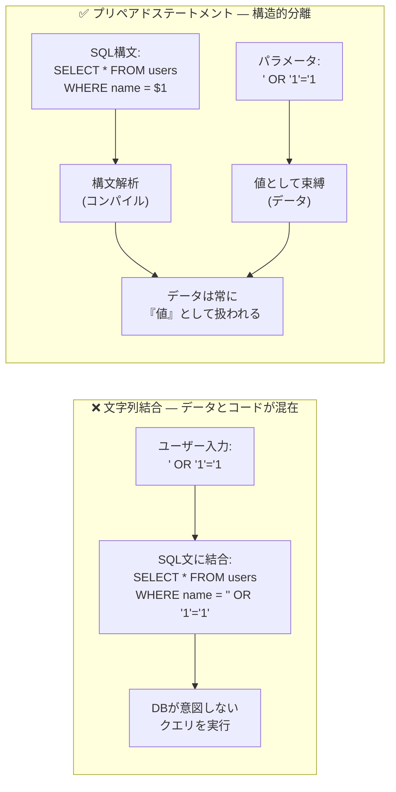
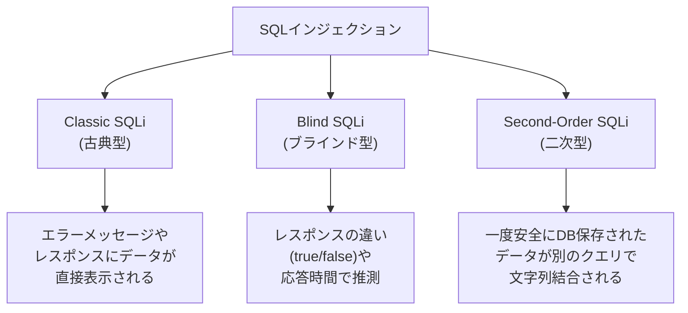
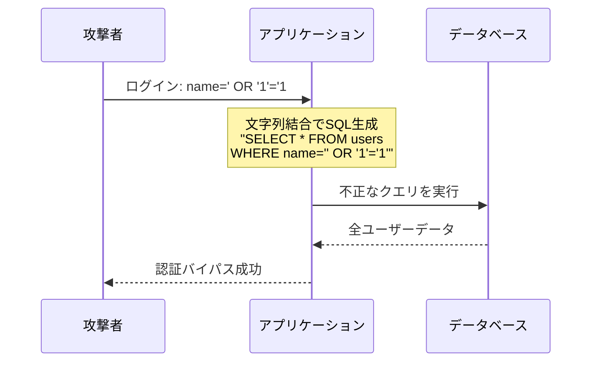
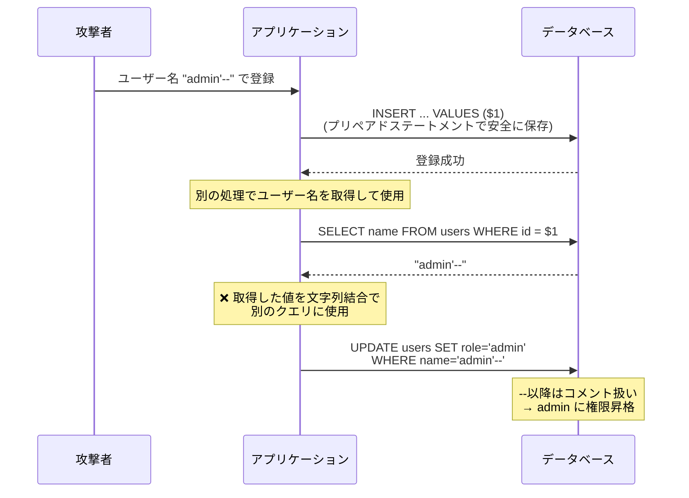
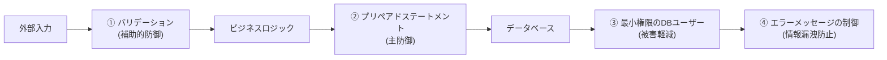

# SQLインジェクション（SQL Injection）

> **一言で言うと:** ユーザー入力がSQL文の一部として解釈されることで、攻撃者がデータベースに対して任意のクエリを実行できてしまう攻撃。プリペアドステートメント（パラメタライズドクエリ）でSQL構文とデータを構造的に分離することで根本解決する。ORMを使っていても生SQLを書く箇所は要注意。

## なぜ必要か

SQLインジェクションを理解していないと、以下の被害が発生する:

- **データ漏洩** — 全ユーザーの個人情報、パスワードハッシュ、クレジットカード情報の窃取
- **認証バイパス** — ログインフォームに `' OR '1'='1` を入力するだけで管理者としてログイン
- **データ改ざん・削除** — `DROP TABLE`、`UPDATE` によるデータ破壊
- **サーバー侵害** — DBの権限によってはOSコマンド実行やファイル読み取りも可能

SQLインジェクションはOWASP Top 10に長年ランクインし続けており、**最も被害額の大きいWeb脆弱性の一つ**。2011年のPlayStation Network（PSN）（約7,700万件のアカウントデータ流出）や2015年のTalkTalk（15万件の顧客データ流出）など、大規模な被害事例が繰り返し発生している。

## どの問題を解決するか

### 根本問題: データとコードの混同

SQLインジェクションの根本原因は、**信頼できないデータがSQL構文として解釈される**こと。文字列結合でSQLを組み立てると、ユーザー入力がクエリの一部としてDBエンジンに解釈される。



プリペアドステートメントでは、DBエンジンがSQL構文を先に解析（コンパイル）し、その後にデータを「値」として束縛する。データ部分がSQL構文として解釈される余地がないため、**原理的にSQLインジェクションが成立しない**。

### 攻撃の類型



| 類型 | 攻撃者がデータを得る方法 | 検出難易度 | 危険度 |
|------|----------------------|-----------|--------|
| **Classic（In-band）** | レスポンスに直接表示 / UNION SELECT | 低い | 高い |
| **Blind（Boolean/Time-based）** | レスポンスの true/false や応答遅延で1ビットずつ推測 | 高い | 高い |
| **Second-Order** | DB保存済みデータが別処理で文字列結合される | 非常に高い | 高い |

#### Classic SQLi — 攻撃フロー



#### Blind SQLi — Boolean-based

攻撃者はレスポンスのtrue/falseの違いで情報を1ビットずつ抽出する:

```
# 1文字目が 'a' かどうかを確認
' AND SUBSTRING(password, 1, 1) = 'a' --
→ レスポンスが「ユーザーが見つかりました」なら 'a' で正解

# 時間ベースの場合
' AND IF(SUBSTRING(password, 1, 1) = 'a', SLEEP(3), 0) --
→ レスポンスが3秒遅延すれば 'a' で正解
```

データが直接表示されなくても、応答の違いで全データを抽出できるため、エラーメッセージの非表示だけでは防御にならない。

#### Second-Order SQLi



一度安全にDBに保存されたデータでも、**別のクエリで文字列結合に使用すると**SQLインジェクションが発生する。DBから読み出したデータも「外部入力」として扱い、常にプリペアドステートメントを使用するのが原則。

## 他の仕組みとどう関係するか

- **下位レイヤーとの関係:**
  - [[RDB]] — SQLインジェクションはRDBのクエリ言語であるSQLを悪用する攻撃。[[インデックス|B-Tree]]やクエリオプティマイザの理解は、攻撃者がどこまで情報を引き出せるかの理解に繋がる
  - [[データ構造とアルゴリズム]] — [[ハッシュテーブル]]を使ったパスワード保存（[[パスワードハッシュ]]）が侵害時の被害軽減策

- **同レイヤーとの関係:**
  - [[XSS]] — SQLインジェクションと同じ「インジェクション」の構造的問題を共有する。「データとコードの混同」が根本原因で、防御の考え方（構造的分離）も共通。詳細は[[SQLインジェクションとXSS]]を参照
  - [[最小権限の原則]] — DB接続ユーザーの権限を最小にすることで、SQLインジェクション成功時の被害範囲を限定する

- **上位レイヤーとの関係:**
  - [[バリデーション]] — 入力バリデーションはSQLインジェクションの補助的防御。構造的防御はプリペアドステートメント
  - [[データアクセス層]] — ORMやクエリビルダはプリペアドステートメントを内部的に使用するが、生SQLの利用箇所には注意が必要
  - [[API設計-REST-GraphQL]] — GraphQLのリゾルバ内でSQLを組み立てる際にもプリペアドステートメントが必須

## 誤解されやすいポイント

### 1. 「ORMを使っていればSQLインジェクションは起きない」

ORMの通常のAPIは内部でプリペアドステートメントを使うため安全だが、**生SQL（raw query）** を書く機能を使って文字列結合すると脆弱性が生まれる。

```typescript
// Prisma — 通常のAPIは安全
await prisma.user.findMany({ where: { name } });

// ❌ $queryRawUnsafe で文字列結合すると脆弱
await prisma.$queryRawUnsafe(`SELECT * FROM users WHERE name = '${name}'`);

// ✅ $queryRaw のタグ付きテンプレートリテラルは安全（内部でパラメータ化）
await prisma.$queryRaw`SELECT * FROM users WHERE name = ${name}`;
```

```python
# SQLAlchemy — 通常のAPIは安全
session.query(User).filter(User.name == name).all()

# ❌ text() で文字列結合すると脆弱
session.execute(text(f"SELECT * FROM users WHERE name = '{name}'"))

# ✅ text() でもバインドパラメータを使えば安全
session.execute(text("SELECT * FROM users WHERE name = :name"), {"name": name})
```

### 2. 「入力をサニタイズ（エスケープ）すればプリペアドステートメントは不要」

手動エスケープ（シングルクォートを二重化する等）は以下の理由で**非推奨**:
- エスケープ漏れが発生しやすい
- 文字セット（charset）の違いで突破されるケース（GBKエンコーディング攻撃等）がある
- LIKE句やIN句でのエスケープルールが異なる

プリペアドステートメントは構造的にデータとコードを分離するため、これらの問題が原理的に発生しない。

### 3. 「数値型パラメータにはSQLインジェクションは起きない」

言語によっては型変換の挙動でインジェクションが可能になるケースがある。また、URLパラメータやフォーム値は常に文字列として送信されるため、型チェックなしにSQL文に結合するのは危険。

```
# URLパラメータ /users?id=1 OR 1=1
# → 数値のつもりが文字列 "1 OR 1=1" が渡される
```

**対策:** バリデーションで型をチェックした上で、プリペアドステートメントも使用する（多層防御）。

### 4. 「ストアドプロシージャを使えばSQLインジェクションは防げる」

ストアドプロシージャ内でも文字列結合で動的SQLを組み立てると脆弱になる。ストアドプロシージャ自体はSQLインジェクション防御の手段ではない。

```sql
-- ❌ ストアドプロシージャ内でも動的SQL + 文字列結合は脆弱
CREATE PROCEDURE search_users(IN search_name VARCHAR(100))
BEGIN
  SET @sql = CONCAT('SELECT * FROM users WHERE name = ''', search_name, '''');
  PREPARE stmt FROM @sql;
  EXECUTE stmt;
END;

-- ✅ ストアドプロシージャ内でもパラメータ化する
CREATE PROCEDURE search_users_safe(IN search_name VARCHAR(100))
BEGIN
  SELECT * FROM users WHERE name = search_name;
END;
```

### 5. 「WAF（Web Application Firewall）を入れればSQLインジェクションは防げる」

WAFはパターンマッチングでSQLインジェクションの既知パターンをブロックするが、難読化された攻撃や新しいパターンを見逃す可能性がある。WAFは**補助的防御**であり、プリペアドステートメントによる構造的防御の代替にはならない。

## 設計のベストプラクティス

### 多層防御（Defense in Depth）



| 防御層 | 手段 | 役割 |
|--------|------|------|
| 入力時 | バリデーション（型チェック、許可リスト） | 不正な形式のデータを門前払い |
| クエリ構築時 | **プリペアドステートメント** | **主防御** — データとSQLの構造的分離 |
| DB権限 | 最小権限の原則 | 侵害時の被害範囲を限定 |
| エラー出力 | 本番でのSQLエラー詳細の非表示 | Blind SQLi のヒントを与えない |
| ネットワーク | WAF | 既知の攻撃パターンをブロック（補助的） |

### DB権限の最小化

```sql
-- アプリケーション用DBユーザーの権限設定
-- ❌ 過剰: 全権限を付与
GRANT ALL PRIVILEGES ON mydb.* TO 'app_user'@'%';

-- ✅ 最小限: 必要な操作のみ許可
GRANT SELECT, INSERT, UPDATE, DELETE ON mydb.users TO 'app_user'@'%';
GRANT SELECT, INSERT ON mydb.orders TO 'app_user'@'%';
-- DROP, ALTER, CREATE, FILE 等の権限は付与しない
-- → SQLインジェクションが成功してもテーブル削除やファイル読み取りは不可
```

### アンチパターン

| アンチパターン | なぜ問題か | 対策 |
|---|---|---|
| テンプレートリテラルでSQL構築 | `` `SELECT ... WHERE name = '${name}'` `` は文字列結合と同じ | プリペアドステートメントのプレースホルダを使用 |
| 手動エスケープによる防御 | 文字セットの違いやエスケープ漏れで突破される | プリペアドステートメントで構造的に分離 |
| DBエラーの詳細をクライアントに返す | テーブル名やカラム名が漏洩しClassic SQLiのヒントに | 本番では汎用エラーメッセージを返す |
| 全権限付与のDB接続ユーザー | `DROP TABLE` 等の破壊的操作が可能になる | SELECT/INSERT/UPDATE/DELETE のみ付与 |

## AIによる実装のアンチパターン

| アンチパターン | なぜ問題か | 対策 |
|---|---|---|
| テンプレートリテラルでSQL構築 | LLMはバッククォート + `${}` でSQLを生成しがち。これは文字列結合でありSQLインジェクションに脆弱 | プレースホルダ（`$1`, `?`, `%s`）を使用 |
| `$queryRawUnsafe` 等の危険なAPIの使用 | ORM の「Unsafe」系APIを安易に使用してしまう | 通常のORMクエリAPIかパラメータ付き raw query を使用 |
| 動的テーブル名・カラム名のユーザー入力受け入れ | テーブル名やカラム名はプレースホルダでパラメータ化できない | 許可リストで検証してから埋め込む |
| IN句でスプレッド構文を使用 | `WHERE id IN (${ids.join(',')})` は文字列結合 | `ANY($1::int[])` や動的プレースホルダ生成を使用 |

## 具体例

### TypeScript（Node.js + pg）

```typescript
import pg from 'pg';
const pool = new pg.Pool({ connectionString: 'postgresql://localhost/mydb' });

// ❌ 脆弱: 文字列結合
async function unsafeGetUser(name: string) {
  return pool.query(
    `SELECT * FROM users WHERE name = '${name}'`
  );
}

// ✅ 安全: プリペアドステートメント
async function safeGetUser(name: string) {
  return pool.query(
    'SELECT * FROM users WHERE name = $1',
    [name]
  );
}

// ✅ IN句のパラメータ化（PostgreSQL）
async function getUsersByIds(ids: number[]) {
  return pool.query(
    'SELECT * FROM users WHERE id = ANY($1::int[])',
    [ids]
  );
}

// ✅ LIKE句のパラメータ化
async function searchUsers(term: string) {
  return pool.query(
    'SELECT * FROM users WHERE name LIKE $1',
    [`%${term}%`]  // ワイルドカードはアプリ側で付加し、全体を値として渡す
  );
}

// ✅ 動的カラム名は許可リストで検証
async function sortUsers(sortBy: string) {
  const allowedColumns = ['name', 'email', 'created_at'];
  if (!allowedColumns.includes(sortBy)) {
    throw new Error('Invalid sort column');
  }
  // 許可リストで検証済みの値のみSQLに埋め込む
  return pool.query(`SELECT * FROM users ORDER BY ${sortBy}`);
}
```

### Go（database/sql）

```go
package main

import (
	"database/sql"
	"fmt"
	"slices"

	_ "github.com/lib/pq"
)

func main() {
	db, _ := sql.Open("postgres", "postgresql://localhost/mydb?sslmode=disable")
	defer db.Close()

	name := "alice"

	// ❌ 脆弱: fmt.Sprintf で文字列結合
	// row := db.QueryRow(fmt.Sprintf("SELECT id FROM users WHERE name = '%s'", name))

	// ✅ 安全: プリペアドステートメント
	var id int
	err := db.QueryRow("SELECT id FROM users WHERE name = $1", name).Scan(&id)
	if err != nil {
		fmt.Println("not found:", err)
		return
	}
	fmt.Println("user id:", id)
}

// ✅ 動的カラム名は許可リストで検証
func sortUsers(db *sql.DB, sortBy string) (*sql.Rows, error) {
	allowed := []string{"name", "email", "created_at"}
	if !slices.Contains(allowed, sortBy) {
		return nil, fmt.Errorf("invalid sort column: %s", sortBy)
	}
	return db.Query(fmt.Sprintf("SELECT * FROM users ORDER BY %s", sortBy))
}
```

### Python（psycopg / SQLAlchemy）

```python
import psycopg2

conn = psycopg2.connect("dbname=mydb")
cur = conn.cursor()

name = "alice"

# ❌ 脆弱: f-string で文字列結合
# cur.execute(f"SELECT * FROM users WHERE name = '{name}'")

# ✅ 安全: パラメタライズドクエリ
cur.execute("SELECT * FROM users WHERE name = %s", (name,))
rows = cur.fetchall()

# ✅ IN句のパラメータ化
ids = [1, 2, 3]
cur.execute("SELECT * FROM users WHERE id = ANY(%s)", (ids,))

# ✅ 安全: SQLAlchemy ORM
# session.query(User).filter(User.name == name).all()

# ✅ SQLAlchemy Core でもバインドパラメータ
# from sqlalchemy import text
# session.execute(text("SELECT * FROM users WHERE name = :name"), {"name": name})
```

### PHP（PDO）

```php
<?php
$pdo = new PDO('mysql:host=localhost;dbname=mydb', 'user', 'pass');
$pdo->setAttribute(PDO::ATTR_ERRMODE, PDO::ERRMODE_EXCEPTION);
// エミュレーションを無効にして真のプリペアドステートメントを使用
$pdo->setAttribute(PDO::ATTR_EMULATE_PREPARES, false);

$name = $_POST['name'];

// ❌ 脆弱: 文字列結合
// $stmt = $pdo->query("SELECT * FROM users WHERE name = '$name'");

// ✅ 安全: プリペアドステートメント
$stmt = $pdo->prepare('SELECT * FROM users WHERE name = ?');
$stmt->execute([$name]);
$users = $stmt->fetchAll();

// ✅ Laravel Eloquent — 通常のAPIは安全
// User::where('name', $name)->get();

// ❌ Laravel でも DB::raw() + 文字列結合は脆弱
// DB::select(DB::raw("SELECT * FROM users WHERE name = '$name'"));

// ✅ Laravel の raw でもバインドパラメータを使えば安全
// DB::select('SELECT * FROM users WHERE name = ?', [$name]);
```

### UNION-based SQLi の例（攻撃を理解する）

```
# 正常なURL
/products?id=1
→ SELECT name, price FROM products WHERE id = 1

# 攻撃: UNIONで別テーブルのデータを抽出
/products?id=1 UNION SELECT username, password FROM users --
→ SELECT name, price FROM products WHERE id = 1
   UNION SELECT username, password FROM users --

# 結果: products のデータに加えて users テーブルの
# username と password が表示される
```

この攻撃が成功するのは、ユーザー入力がSQL構文として解釈されるため。プリペアドステートメントでは `1 UNION SELECT username, password FROM users --` は単なる「値」として扱われ、SQL構文として解釈されない。

## 参考リソース

- OWASP SQL Injection Prevention Cheat Sheet — SQLインジェクション防御の網羅的ガイド
- OWASP Testing Guide: SQL Injection — テスト手法の詳細
- PortSwigger Web Security Academy: SQL Injection — ハンズオン学習環境（無料）
- [[SQLインジェクションとXSS]] — SQLインジェクションとXSSの比較・共通構造、各言語のコード例

## 学習メモ

- SQLインジェクションと[[XSS]]は「データとコードの混同」という同じ根本問題を持つ。[[SQLインジェクションとXSS]]に比較がまとまっている
- プリペアドステートメントは「構造的防御」であり、エスケープ漏れの心配がない。手動エスケープは非推奨
- ORMは基本的に安全だが、生SQL機能（`$queryRawUnsafe`、`text()` + f-string等）は文字列結合と同じリスク
- テーブル名・カラム名はプレースホルダでパラメータ化できない → 許可リスト検証が必要
- Second-Order SQLi は「DB保存済みデータも外部入力」という認識が重要
