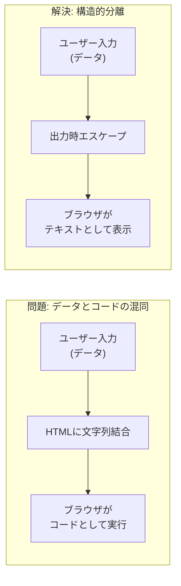
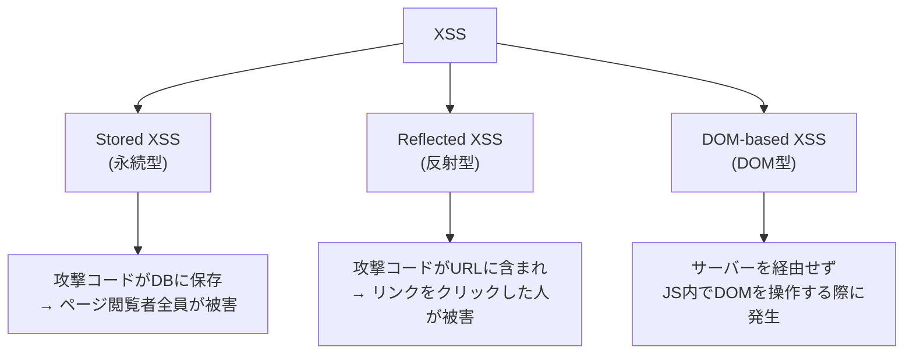
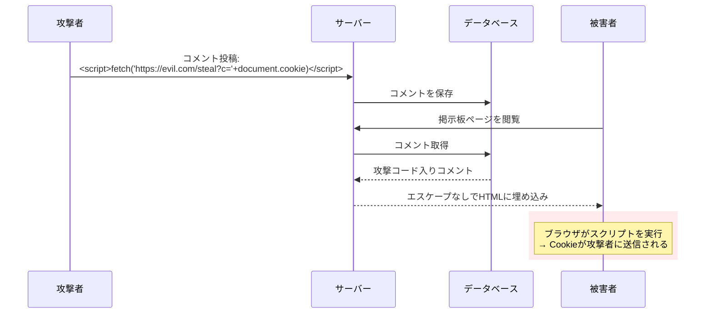
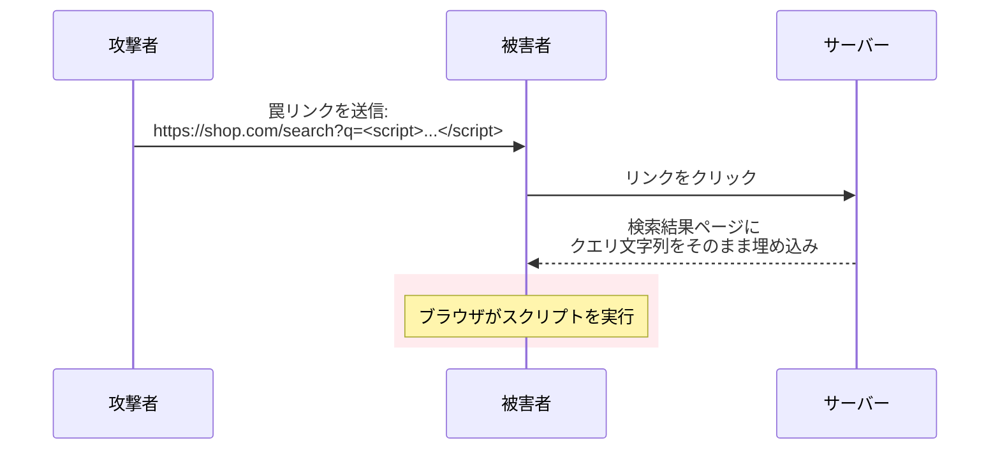
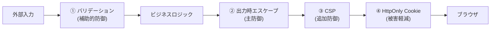

# XSS（クロスサイトスクリプティング / Cross-Site Scripting）

> **一言で言うと:** ユーザー入力がHTML/JavaScriptとして解釈されることで、攻撃者が他のユーザーのブラウザ上で任意のスクリプトを実行できてしまう攻撃。防御の本体は**出力時のコンテキスト別エスケープ**と**CSP（Content Security Policy）**。

## なぜ必要か

XSSを理解していないと、以下の被害が発生する:

- **セッションハイジャック** — `document.cookie` を盗まれ、攻撃者が被害者としてログインする
- **フィッシング** — 正規サイト上に偽のログインフォームを動的に描画し、認証情報を窃取する
- **キーロギング** — 入力フォームにイベントリスナーを仕込み、パスワードやクレジットカード番号を記録する
- **マルウェア配布** — 信頼されたドメインからリダイレクトさせることで、ブラウザの警告を回避する

XSSは OWASP Top 10 に継続的にランクインしており、Webアプリケーションで**最も頻繁に発見される脆弱性の一つ**である。

## どの問題を解決するか

### 根本問題: データとコードの混同

XSSの根本原因は**信頼できないデータが実行可能なコードとして解釈される**こと。これは[[SQLインジェクション]]と同じ構造的問題であり、インジェクション攻撃の一種である。



### XSSの3類型

攻撃コードがどこに保存され、どう実行されるかによって3つに分類される:



| 類型 | 攻撃コードの格納先 | サーバー経由 | 影響範囲 | 危険度 |
|------|------------------|-------------|---------|--------|
| **Stored XSS** | DB（永続） | する | ページ閲覧者全員 | 最も高い |
| **Reflected XSS** | URL（一時的） | する | リンクをクリックした人 | 中 |
| **DOM-based XSS** | クライアントJSのみ | しない | リンクをクリックした人 | 中 |

#### Stored XSS の攻撃フロー

掲示板やプロフィール欄など、ユーザー入力がDBに保存されHTMLに表示される場面で発生する。



#### Reflected XSS の攻撃フロー

検索結果ページなど、URLパラメータの値がそのままHTMLに反映される場面で発生する。



#### DOM-based XSS

サーバーを経由せず、クライアントサイドのJavaScriptが `location.hash` や `document.URL` 等のユーザー制御可能な値を直接DOMに挿入する際に発生する。

```javascript
// ❌ 脆弱: location.hashをそのままDOMに挿入
document.getElementById('output').innerHTML = location.hash.substring(1);
// URL: https://example.com/page#
// → imgタグのonerrorが実行される
```

## 他の仕組みとどう関係するか

- **下位レイヤーとの関係:**
  - [[HTTP-HTTPS]] — CSPやX-Content-Type-OptionsなどのHTTPレスポンスヘッダがXSSの追加防御層となる。Cookie属性（HttpOnly, Secure, SameSite）は被害軽減に関わる
  - [[DNS]] — XSSで窃取した情報の送信先としてDNSが利用される

- **同レイヤーとの関係:**
  - [[CSRF]] — XSSが成功するとCSRFトークンも読み取れるため、CSRF防御が無効化される。XSSはCSRFの上位互換的な脅威
  - [[CORS]] — 同一オリジンポリシーはXSSを直接防御しない（攻撃スクリプトは被害者のオリジンで実行されるため）。ただし[[CORS]]設定の甘さがXSSの影響範囲を広げる
  - [[SQLインジェクション]] — XSSと同じ「インジェクション」の構造的問題を共有する。防御の考え方（データとコードの分離）も共通
  - [[プロトタイプ汚染]] — JavaScript 固有の「ガジェット型」脆弱性で、単体では害が小さいが XSS・認証バイパス・RCE を増幅させる。2026年の axios CVE-2026-40175 ではこの汚染がヘッダ注入を経由して RCE に昇華する実例が示された
  - [[最小権限の原則]] — CSPはスクリプト実行の権限を最小限に絞るという点で、最小権限の原則の具体的適用

- **上位レイヤーとの関係:**
  - [[コンポーネント設計]] — React/Vueのテンプレートシステムは自動エスケープによりXSSを構造的に防止する
  - [[バリデーション]] — 入力バリデーションはXSSの補助的防御。構造的防御は[[バリデーションとサニタイズとエスケープ|出力時エスケープ]]

## 誤解されやすいポイント

### 1. 「入力をサニタイズすればXSSは防げる」

サニタイズ（HTMLタグ除去等）は補助的防御にすぎない。新しい攻撃ベクトル（``、`<svg onload=...>` 等）を見逃す可能性がある。XSS防御の**本体は出力時のコンテキスト別エスケープ**。テンプレートエンジンの自動エスケープに頼るのが最も安全。

### 2. 「ReactやVueを使っていればXSSは起きない」

ReactやVueはJSX/テンプレート内の値をデフォルトでエスケープするため、**基本的には安全**。しかし以下のAPIはエスケープをバイパスする:
- React: `dangerouslySetInnerHTML`
- Vue: `v-html`
- `href` 属性に `javascript:` スキームを渡すケース

これらを使う場合は必ずDOMPurify等でサニタイズが必要。

### 3. 「HTTPOnly Cookieを設定すればXSSの被害はない」

HttpOnly CookieはJavaScriptからのCookieアクセスを防ぐが、XSSの被害はCookie窃取だけではない。攻撃者はXSSを通じて以下が可能:
- ページ内容の改ざん（フィッシングフォームの挿入）
- キーストロークの記録
- 被害者の権限でのAPI呼び出し（Cookieは自動送信されるため、JSからアクセスできなくても利用可能）
- CSRFトークンの読み取りとCSRF防御の無効化

### 4. 「APIがJSONを返すならXSSは関係ない」

`Content-Type: application/json` でも、古いブラウザやMIMEスニッフィングによりHTMLとして解釈されるケースがある。`X-Content-Type-Options: nosniff` ヘッダを必ず設定する。また、JSONの値がフロントエンドでDOMに挿入される場合、フロントエンド側でのエスケープが必要。

### 5. 「CSPを設定すればエスケープは不要」

CSPは**多層防御（Defense in Depth）の一層**であり、エスケープの代替ではない。CSPには設定ミスのリスクがあり、`'unsafe-inline'` を許可してしまうとインラインスクリプトの実行を防げない。エスケープが主防御、CSPは追加防御。

## 設計のベストプラクティス

### 多層防御（Defense in Depth）

XSS対策は単一の手法に頼らず、複数の防御層を重ねる:



| 防御層 | 手段 | 役割 |
|--------|------|------|
| 入力時 | バリデーション（許可リスト） | 不正な形式のデータを門前払い |
| 出力時 | テンプレートエンジンの自動エスケープ | **主防御** — データとHTMLの構造的分離 |
| HTTP | CSP ヘッダ | インラインスクリプト実行のブロック |
| HTTP | `X-Content-Type-Options: nosniff` | MIMEスニッフィングの防止 |
| Cookie | `HttpOnly`, `Secure`, `SameSite` | XSS成功時の被害を軽減 |

### CSP（Content Security Policy）の設計

```
Content-Security-Policy:
  default-src 'self';
  script-src 'self';
  style-src 'self' 'unsafe-inline';
  img-src 'self' data: https:;
  connect-src 'self' https://api.example.com;
  frame-ancestors 'none';
  base-uri 'self';
  form-action 'self';
```

CSP設計の原則:
1. **`'unsafe-inline'` を `script-src` に使わない** — これを許可するとインラインスクリプトが実行でき、XSS防御の意味がなくなる
2. **`'unsafe-eval'` を避ける** — `eval()` や `new Function()` を許可してしまう
3. **nonce または hash ベースの許可** — インラインスクリプトが必要な場合は `'nonce-<random>'` を使用
4. **`report-uri` / `report-to`** で違反レポートを収集し、設定の問題を検出する

### アンチパターン

| アンチパターン | なぜ問題か | 対策 |
|---|---|---|
| `innerHTML` でユーザー入力を描画 | エスケープなしで直接XSSになる | `textContent` を使うか、フレームワークのバインディングを使用 |
| 入力時にHTMLエスケープしてDB保存 | 出力コンテキストが変わると二重エスケープが発生 | 生データを保存し、出力時にエスケープ |
| 正規表現で自作HTMLサニタイザー | HTMLの構文解析は正規表現では不可能 | DOMPurify、bluemonday等の実績あるライブラリを使用 |
| CSPに `'unsafe-inline'` を指定 | インラインスクリプトが実行でき、CSPの意味がなくなる | nonce ベースの許可に移行 |

## AIによる実装のアンチパターン

| アンチパターン | なぜ問題か | 対策 |
|---|---|---|
| `innerHTML` や `v-html` でユーザー入力を描画 | テンプレートの自動エスケープをバイパスする | `textContent` を使うか、必要なら DOMPurify でサニタイズ後に使用 |
| XSS対策としてフロントのみでサニタイズ | 攻撃者はフロントをバイパスしてAPIを直接叩ける | サーバーサイドで出力時エスケープ。フロントのサニタイズはUX目的 |
| テンプレートリテラルでHTMLを組み立て | バッククォート内の `${variable}` は文字列結合と同じ | テンプレートエンジンを使用するか、DOM APIで要素を構築 |
| CSPだけに依存してエスケープを省略 | CSPは追加防御であり設定ミスで無効になりうる | エスケープが主防御、CSPは多層防御の一層 |

## 具体例

### Stored XSS の脆弱なコードと修正

#### TypeScript（Express）

```typescript
import express from 'express';
import helmet from 'helmet';
import crypto from 'crypto';

const app = express();
app.use(express.urlencoded({ extended: true }));

// ✅ CSPヘッダの設定（helmetを使用）
app.use((req, res, next) => {
  // リクエストごとにnonceを生成
  res.locals.cspNonce = crypto.randomBytes(16).toString('base64');
  next();
});

app.use(helmet.contentSecurityPolicy({
  directives: {
    defaultSrc: ["'self'"],
    scriptSrc: ["'self'", (req, res) => `'nonce-${res.locals.cspNonce}'`],
    styleSrc: ["'self'", "'unsafe-inline'"],
    imgSrc: ["'self'", "data:"],
    frameAncestors: ["'none'"],
  },
}));

// ❌ 脆弱: ユーザー入力をそのままHTMLに埋め込み
app.get('/search-vulnerable', (req, res) => {
  const query = req.query.q as string;
  res.send(`<h1>検索結果: ${query}</h1>`);
  // /search-vulnerable?q=<script>alert(document.cookie)</script>
  // → スクリプトが実行される
});

// ✅ 安全: テンプレートエンジンの自動エスケープを使用
// EJSの場合: <%= query %> はHTMLエスケープされる
app.set('view engine', 'ejs');
app.get('/search', (req, res) => {
  res.render('search', { query: req.query.q });
  // テンプレート内: <h1>検索結果: <%= query %></h1>
  // → <script> は &lt;script&gt; にエスケープされる
});

app.listen(3000);
```

#### Go（html/template）

```go
package main

import (
	"html/template"
	"net/http"
)

var searchTmpl = template.Must(template.New("search").Parse(`
<!DOCTYPE html>
<html>
<head><title>検索</title></head>
<body>
  <!-- html/template はデフォルトでHTMLエスケープする -->
  <h1>検索結果: {{.Query}}</h1>
</body>
</html>
`))

func searchHandler(w http.ResponseWriter, r *http.Request) {
	query := r.URL.Query().Get("q")

	// ✅ html/template は自動エスケープ
	// <script>alert(1)</script> → &lt;script&gt;alert(1)&lt;/script&gt;
	searchTmpl.Execute(w, struct{ Query string }{Query: query})
}

func main() {
	http.HandleFunc("/search", searchHandler)
	http.ListenAndServe(":3000", nil)
}
```

**注意:** Go の `text/template` はエスケープしない。HTML出力には必ず `html/template` を使用すること。

#### Python（Jinja2 / Flask）

```python
from flask import Flask, request, render_template_string

app = Flask(__name__)

# ✅ Jinja2はデフォルトでautoescape=True
# {{ query }} はHTMLエスケープされる
SEARCH_TEMPLATE = """
<!DOCTYPE html>
<html>
<body>
  <h1>検索結果: {{ query }}</h1>
</body>
</html>
"""

@app.route("/search")
def search():
    query = request.args.get("q", "")
    return render_template_string(SEARCH_TEMPLATE, query=query)
    # <script>alert(1)</script> → &lt;script&gt;alert(1)&lt;/script&gt;

# ❌ 危険: | safe フィルタはエスケープを無効にする
# <h1>{{ query | safe }}</h1>  ← サニタイズ済みHTMLのみに使用

app.run(port=3000)
```

### React / Vue での注意点

```typescript
// === React ===
// ✅ 安全: JSXはデフォルトでエスケープする
function SearchResult({ query }: { query: string }) {
  return <h1>検索結果: {query}</h1>;
  // <script>alert(1)</script> → テキストとして表示される
}

// ❌ 危険: dangerouslySetInnerHTMLはエスケープをバイパス
function Unsafe({ html }: { html: string }) {
  return <div dangerouslySetInnerHTML={{ __html: html }} />;
}

// ✅ 安全: DOMPurifyでサニタイズしてから使用
import DOMPurify from 'dompurify';
function SafeHtml({ html }: { html: string }) {
  return <div dangerouslySetInnerHTML={{
    __html: DOMPurify.sanitize(html)
  }} />;
}

// ❌ 危険: href属性のjavascript:スキーム
function UnsafeLink({ url }: { url: string }) {
  return <a href={url}>リンク</a>;
  // url = "javascript:alert(1)" → クリックでスクリプト実行
}

// ✅ 安全: プロトコルを検証
function SafeLink({ url }: { url: string }) {
  const safeUrl = /^https?:\/\//.test(url) ? url : '#';
  return <a href={safeUrl}>リンク</a>;
}
```

### DOM-based XSS の防御

```javascript
// ❌ 脆弱: innerHTMLにユーザー制御可能な値を挿入
const userInput = new URLSearchParams(location.search).get('name');
document.getElementById('greeting').innerHTML = `こんにちは、${userInput}さん`;
// ?name= → スクリプト実行

// ✅ 安全: textContentを使用（HTMLとして解釈されない）
document.getElementById('greeting').textContent = `こんにちは、${userInput}さん`;

// ✅ 安全: DOM APIで要素を構築
const el = document.getElementById('greeting');
const text = document.createTextNode(`こんにちは、${userInput}さん`);
el.appendChild(text);
```

## 参考リソース

- OWASP XSS Prevention Cheat Sheet — コンテキスト別エスケープルールの網羅的ガイド
- OWASP Content Security Policy Cheat Sheet — CSP設計の実践ガイド
- PortSwigger Web Security Academy — XSSのハンズオン学習環境（無料）
- MDN Web Docs: Content Security Policy (CSP) — CSPディレクティブの公式リファレンス

## 学習メモ

- [[SQLインジェクションとXSS]] に、SQLインジェクションとXSSの比較・共通構造がまとまっている
- [[バリデーションとサニタイズとエスケープ]] に、バリデーション・サニタイズ・エスケープの使い分けが詳述されている
- [[CSRF]] と合わせて学ぶと「XSSが成功するとCSRF防御も突破される」関係が理解しやすい
