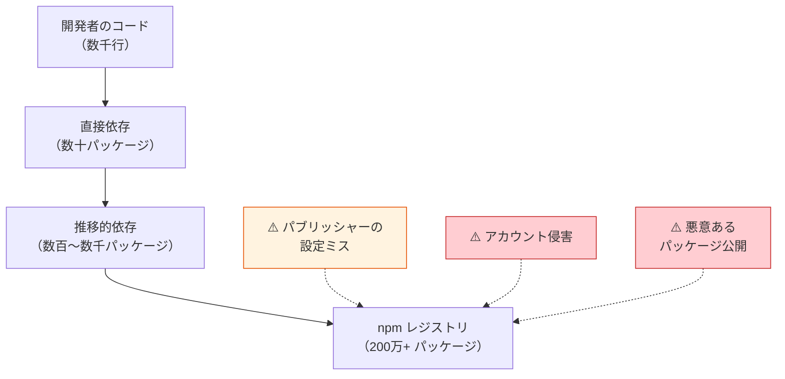

# サプライチェーンセキュリティ（Software Supply Chain Security）

> **一言で言うと:** アプリケーションが依存するパッケージ・ビルドツール・レジストリの「信頼の連鎖」を守る領域。npm だけでも 200 万以上のパッケージが公開されており、1 つの依存が侵害されれば推移的依存（Transitive Dependency）を通じて数百万プロジェクトに被害が波及する。[[最小権限の原則]]が「侵害時の爆発半径を抑える」原則なら、サプライチェーンセキュリティは「侵害の入り口を狭める」ための実践。

## なぜ必要か

現代の Web アプリケーションは、自前で書くコードよりも**依存パッケージのコードのほうが圧倒的に多い**。典型的な Node.js プロジェクトでは `node_modules` に数百〜数千のパッケージが含まれ、その大半は開発者が直接選んだものではなく推移的依存として自動導入されたものである。

この構造が意味するのは、**自分のコードを完璧に書いても、依存の 1 つが侵害されればアプリケーション全体が危険にさらされる**ということ。

### 攻撃対象面が広い理由

- **単一レジストリへの集中** — npm、PyPI、crates.io など、各エコシステムは事実上 1 つの公開レジストリに依存している
- **推移的依存の不透明性** — `npm install express` で直接インストールするのは 1 パッケージだが、実際には数十の推移的依存が導入される（Express 4.x 系では数十、Express 5.x で大幅削減）。React や Next.js のような大規模フレームワークでは数百〜千を超えることも珍しくない
- **postinstall フックの自動実行** — npm はパッケージインストール時にライフサイクルスクリプトを自動実行する。これがマルウェアの主要な配布経路になっている
- **メンテナの個人アカウントが単一障害点** — 週間数千万ダウンロードのパッケージでも、メンテナ 1 人のアカウントが侵害されればバックドアを仕込める

## どの問題を解決するか

サプライチェーンセキュリティが対処する脅威は大きく 3 種類に分けられる:

| 脅威カテゴリ | 具体例 | 対策の方向性 |
|------------|--------|------------|
| **情報漏洩（Accidental Exposure）** | ソースマップ・環境変数・秘密鍵がパッケージに混入 | パブリッシュ前の検証（`files` フィールド、`npm pack --dry-run`） |
| **アカウント侵害（Account Takeover）** | メンテナアカウントの乗っ取りによる悪意あるバージョン公開 | 2FA 強制、npm provenance、自動化トークンの権限制限 |
| **悪意あるパッケージ（Malicious Package）** | タイポスクワッティング、依存混同攻撃（Dependency Confusion） | lockfile ピンニング、`npm ci`、行動分析ツール（Socket.dev） |

2026 年 3 月 31 日には、これら脅威のうち「情報漏洩」と「アカウント侵害」が同日に発生した。[[npmサプライチェーン攻撃事例]]では、この 2 つのインシデントを詳細に分析し、具体的な防御策を解説する。

## 他の仕組みとどう関係するか

- **下位レイヤーとの関係:**
  - [[Docker]] — コンテナイメージのビルド時にも `npm install` が実行される。マルチステージビルドで `npm ci --ignore-scripts` を使うことでリスクを低減できる
- **同レイヤーとの関係:**
  - [[最小権限の原則]] — npm アカウント・自動化トークン・GitHub Actions の権限を最小化することでサプライチェーン攻撃の爆発半径を抑える
  - [[XSS]] — 侵害された依存パッケージがブラウザで実行されるコードを改ざんすれば、XSS と同等の攻撃が可能になる
- **上位レイヤーとの関係:**
  - [[Layer7-設計アーキテクチャ/_index|Layer 7: 設計]] — 依存の選定と管理はアーキテクチャ判断の一部。「依存を増やすコスト」にはセキュリティリスクが含まれる

## 誤解されやすいポイント

1. **「有名パッケージなら安全」** — axios は週間数千万ダウンロードの超メジャーパッケージだが、メンテナアカウントが侵害されバックドアが仕込まれた事例がある（詳細は[[npmサプライチェーン攻撃事例]]を参照）。人気はセキュリティの指標にならない

2. **「`npm audit` が通れば安全」** — `npm audit` は既知の脆弱性（CVE）のみをチェックする。ゼロデイ攻撃やアカウント侵害による悪意あるバージョンは、アドバイザリに登録されるまで検出できない。行動分析ベースのツール（Socket.dev 等）と組み合わせる必要がある

3. **「`package-lock.json` があればバージョンは固定されている」** — lockfile はバージョンを記録するが、`npm install` は lockfile を**更新しうる**（新しい依存の追加時など）。バージョンを厳密に固定するには `npm ci` を使う。CI/CD では常に `npm ci` を使うべき

4. **「`.npmignore` で不要ファイルを除外すれば十分」** — denylist（除外リスト）方式は漏れが生じやすい。`package.json` の `files` フィールドによる allowlist（許可リスト）方式のほうが構造的に安全

## 設計のベストプラクティス

### パブリッシャー側（パッケージを公開する場合）

| プラクティス | 具体的な実施方法 |
|------------|----------------|
| `files` フィールドで allowlist | `"files": ["dist/", "README.md"]` — 公開するファイルを明示的に列挙 |
| パブリッシュ前の内容検証 | `npm pack --dry-run` で含まれるファイルを確認、CI に組み込む |
| provenance の有効化 | `npm publish --provenance` で GitHub Actions からの署名付きパブリッシュ |
| 2FA の強制 | `npm profile enable-2fa auth-and-writes` |
| 自動化トークンの制限 | IP 制限付き Granular Access Token を使用 |

### コンシューマー側（パッケージを利用する場合）

| プラクティス | 具体的な実施方法 |
|------------|----------------|
| lockfile のコミットと `npm ci` | CI/CD では必ず `npm ci` を使う（lockfile を更新しない） |
| パッケージマネージャの選択 | pnpm はファントム依存を排除し攻撃面を構造的に縮小する（詳細は [[npmとpnpmの比較]] を参照） |
| postinstall スクリプトの制御 | `.npmrc` に `ignore-scripts=true` を設定し、必要なものだけ許可 |
| 依存の定期監査 | `npm audit` + Socket.dev / Snyk をCI に統合 |
| 依存の最小化 | 不要な依存を定期的に棚卸しする。1 つの機能のために巨大なライブラリを導入しない |

### 他言語エコシステムでの対応策

npm 以外のパッケージマネージャでも同様のリスクと対策が存在する:

| エコシステム | lockfile | 厳密インストール | 監査コマンド |
|------------|----------|----------------|------------|
| **npm**（Node.js） | `package-lock.json` | `npm ci` | `npm audit` |
| **Go Modules** | `go.sum`（ハッシュ検証） | `go mod verify` | `govulncheck` |
| **pip**（Python） | `requirements.txt` + `--require-hashes` | `pip install --require-hashes -r requirements.txt` | `pip-audit` |
| **Bundler**（Ruby） | `Gemfile.lock` | `bundle install --frozen` | `bundle audit` |
| **Composer**（PHP） | `composer.lock` | `composer install --no-dev` | `composer audit` |

Go Modules は `go.sum` にモジュールのハッシュを記録し `go mod verify` で改ざんを検出できる。Python では `pip install --require-hashes` でハッシュ検証を強制できる。いずれのエコシステムでも **lockfile のコミットと CI での厳密インストール**が基本原則。

## AIによる実装のアンチパターン

AI コーディングエージェント自体が新たな攻撃面となるリスク（パッケージ幻覚・プロンプトインジェクション・シークレット漏洩など）については [[生成AIコーディングエージェントのセキュリティリスク]] で詳しく扱う。ここでは AI が生成するコードに頻出するサプライチェーン関連のアンチパターンを示す。

| アンチパターン | なぜ問題か | 対策 |
|---|---|---|
| `npm install パッケージ名` でバージョン未指定 | latest が取得され、侵害バージョンに当たるリスクがある | `npm install パッケージ名@バージョン` で明示指定 |
| `npx 未知のCLI` をバージョン未指定で実行（[[npxとは]]） | レジストリから任意コードを取得・即実行する暗黙の攻撃面 | `devDependencies` に追加し `npx --no` で呼ぶ、または `@バージョン` を固定 |
| lockfile を `.gitignore` に追加 | バージョン固定が効かず、CI とローカルで異なるバージョンが入る | lockfile は必ずコミットする |
| `postinstall` スクリプトの無批判な実行 | マルウェアの主要配布経路 | `--ignore-scripts` + 明示的許可 |
| 依存の過剰追加 | 攻撃対象面の不必要な拡大 | 標準ライブラリで代替可能か検討する |

## 具体例

実際に発生したインシデントの詳細分析は [[npmサプライチェーン攻撃事例]] を参照。2026 年 3 月 31 日に発生した以下の 2 事例を取り上げている:

1. **Claude Code ソースマップ漏洩** — Bun バンドラのデフォルト設定で `.map` ファイルが npm に公開され、512K 行超のソースコードが流出（人的ミス）
2. **Axios バックドア攻撃** — 北朝鮮系攻撃者がメンテナアカウントを侵害し、RAT 入りバージョンを公開（意図的攻撃）

## 参考リソース

- [Socket.dev — Supply Chain Security](https://socket.dev/)
- [npm provenance（Sigstore 連携）](https://docs.npmjs.com/generating-provenance-statements)
- [OpenSSF Scorecard — OSS プロジェクトのセキュリティ評価](https://securityscorecards.dev/)

## 学習メモ

- 2026-03-31 の 2 件のインシデントが同日に発生したのは偶然だが、npm エコシステムの脆弱性を象徴している
