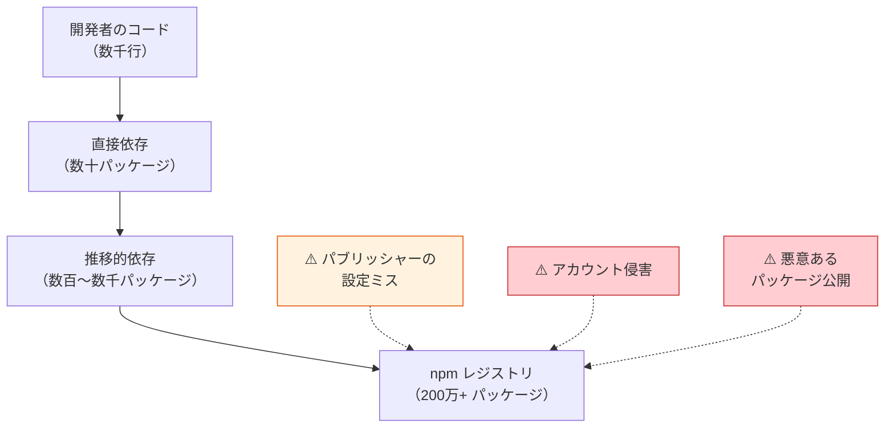

# サプライチェーンセキュリティ（Software Supply Chain Security）

> **一言で言うと:** アプリケーションが依存するパッケージ・ビルドツール・レジストリの「信頼の連鎖」を守る領域。npm だけでも 200 万以上のパッケージが公開されており、1 つの依存が侵害されれば推移的依存（Transitive Dependency）を通じて数百万プロジェクトに被害が波及する。[[最小権限の原則]]が「侵害時の爆発半径を抑える」原則なら、サプライチェーンセキュリティは「侵害の入り口を狭める」ための実践。

## 3分で全体像

- **何を解決する技術か:** 自分のコードを完璧に書いても、依存パッケージ・ビルドツール・レジストリの侵害でアプリケーション全体が危険にさらされる構造を、**信頼の連鎖を狭め・固定し・検証する**ことで防御する。`npm install` 1 回で数千の他人のコードが実行可能になる現代の根本リスク
- **代表的な使用シーン:** Node.js / Python / Ruby / Go / Rust の依存追加、CI/CD でのビルド、Docker イメージ作成、npm パブリッシュ、postinstall スクリプト実行、社内パッケージレジストリ運用、AI コーディングエージェントが提案する `npm install` の精査
- **これだけは覚える3つ:**
    1. **lockfile を必ずコミットし、CI では `npm ci`** — `npm install` は lockfile を**更新しうる**ため、CI とローカルでバージョン差分が出る。`npm ci` は厳密インストール。Go なら `go mod verify`、Python なら `pip install --require-hashes`、Ruby なら `bundle install --frozen` が等価
    2. **postinstall スクリプトはマルウェアの主要配布経路** — `.npmrc` に `ignore-scripts=true` を設定し、必要なパッケージだけ明示許可。CI イメージビルドは `npm ci --ignore-scripts` を基本に
    3. **「人気 = 安全」は誤り** — 週間数千万 DL の axios でもメンテナアカウント侵害でバックドア混入事例あり。`npm audit` は既知 CVE のみ、ゼロデイ・アカウント侵害バージョンは Socket.dev / Snyk のような行動分析ツールでないと検知困難
- **AIに任せやすいか:** **一部任せられる** — `package.json` の `files` allowlist 設定、CI で `npm ci` への移行、Docker `--ignore-scripts` 化、provenance 有効化など**定型的な防御施策**は AI が実装可。一方で「**依存追加の是非判断**」「**メンテナの信頼性評価**」「**新規パッケージの行動分析結果の解釈**」は人間判断。AI は「このライブラリ便利だから入れましょう」と気軽に提案しがちで、攻撃面拡大に繋がる
- **詰まったらここを読む:** [[Docker]] / [[最小権限の原則]] / [[CI-CD]] / [[npmサプライチェーン攻撃事例]]

## なぜ必要か

現代の Web アプリケーションは、自前で書くコードよりも**依存パッケージのコードのほうが圧倒的に多い**。典型的な Node.js プロジェクトでは `node_modules` に数百〜数千のパッケージが含まれ、その大半は開発者が直接選んだものではなく推移的依存として自動導入されたものである。

この構造が意味するのは、**自分のコードを完璧に書いても、依存の 1 つが侵害されればアプリケーション全体が危険にさらされる**ということ。


```mermaid
flowchart TB
    Dev["開発者のコード<br/>（数千行）"]
    Dev --> Direct["直接依存<br/>（数十パッケージ）"]
    Direct --> Trans["推移的依存<br/>（数百〜数千パッケージ）"]
    Trans --> Registry["npm レジストリ<br/>（200万+ パッケージ）"]

    Attack1["⚠️ パブリッシャーの<br/>設定ミス"]
    Attack2["⚠️ アカウント侵害"]
    Attack3["⚠️ 悪意ある<br/>パッケージ公開"]

    Attack1 -.-> Registry
    Attack2 -.-> Registry
    Attack3 -.-> Registry

    style Attack1 fill:#fff3e0,stroke:#e65100
    style Attack2 fill:#ffcdd2,stroke:#c62828
    style Attack3 fill:#ffcdd2,stroke:#c62828
```

### 攻撃対象面が広い理由

- **単一レジストリへの集中** — npm、PyPI、crates.io など、各エコシステムは事実上 1 つの公開レジストリに依存している
- **推移的依存の不透明性** — `npm install express` で直接インストールするのは 1 パッケージだが、実際には数十の推移的依存が導入される（Express 4.x 系では数十、Express 5.x で大幅削減）。React や Next.js のような大規模フレームワークでは数百〜千を超えることも珍しくない
- **postinstall フックの自動実行** — npm はパッケージインストール時にライフサイクルスクリプトを自動実行する。これがマルウェアの主要な配布経路になっている
- **メンテナの個人アカウントが単一障害点** — 週間数千万ダウンロードのパッケージでも、メンテナ 1 人のアカウントが侵害されればバックドアを仕込める

## どの問題を解決するか

サプライチェーンセキュリティが対処する脅威は大きく 3 種類に分けられる:

| 脅威カテゴリ | 具体例 | 対策の方向性 |
|------------|--------|------------|
| **情報漏洩（Accidental Exposure）** | ソースマップ・環境変数・秘密鍵がパッケージに混入 | パブリッシュ前の検証（`files` フィールド、`npm pack --dry-run`） |
| **アカウント侵害（Account Takeover）** | メンテナアカウントの乗っ取りによる悪意あるバージョン公開 | 2FA 強制、npm provenance、自動化トークンの権限制限 |
| **悪意あるパッケージ（Malicious Package）** | タイポスクワッティング、依存混同攻撃（Dependency Confusion） | lockfile ピンニング、`npm ci`、行動分析ツール（Socket.dev） |

2026 年 3 月 31 日には、これら脅威のうち「情報漏洩」と「アカウント侵害」が同日に発生した。[[npmサプライチェーン攻撃事例]]では、この 2 つのインシデントを詳細に分析し、具体的な防御策を解説する。

## 他の仕組みとどう関係するか

- **下位レイヤーとの関係:**
  - [[Docker]] — コンテナイメージのビルド時にも `npm install` が実行される。マルチステージビルドで `npm ci --ignore-scripts` を使うことでリスクを低減できる
- **同レイヤーとの関係:**
  - [[最小権限の原則]] — npm アカウント・自動化トークン・GitHub Actions の権限を最小化することでサプライチェーン攻撃の爆発半径を抑える
  - [[XSS]] — 侵害された依存パッケージがブラウザで実行されるコードを改ざんすれば、XSS と同等の攻撃が可能になる
- **上位レイヤーとの関係:**
  - [[Layer7-設計アーキテクチャ/_index|Layer 7: 設計]] — 依存の選定と管理はアーキテクチャ判断の一部。「依存を増やすコスト」にはセキュリティリスクが含まれる

## 誤解されやすいポイント

1. **「有名パッケージなら安全」** — axios は週間数千万ダウンロードの超メジャーパッケージだが、メンテナアカウントが侵害されバックドアが仕込まれた事例がある（詳細は[[npmサプライチェーン攻撃事例]]を参照）。人気はセキュリティの指標にならない

2. **「`npm audit` が通れば安全」** — `npm audit` は既知の脆弱性（CVE）のみをチェックする。ゼロデイ攻撃やアカウント侵害による悪意あるバージョンは、アドバイザリに登録されるまで検出できない。行動分析ベースのツール（Socket.dev 等）と組み合わせる必要がある

3. **「`package-lock.json` があればバージョンは固定されている」** — lockfile はバージョンを記録するが、`npm install` は lockfile を**更新しうる**（新しい依存の追加時など）。バージョンを厳密に固定するには `npm ci` を使う。CI/CD では常に `npm ci` を使うべき

4. **「`.npmignore` で不要ファイルを除外すれば十分」** — denylist（除外リスト）方式は漏れが生じやすい。`package.json` の `files` フィールドによる allowlist（許可リスト）方式のほうが構造的に安全

## 設計のベストプラクティス

### パブリッシャー側（パッケージを公開する場合）

| プラクティス | 具体的な実施方法 |
|------------|----------------|
| `files` フィールドで allowlist | `"files": ["dist/", "README.md"]` — 公開するファイルを明示的に列挙 |
| パブリッシュ前の内容検証 | `npm pack --dry-run` で含まれるファイルを確認、CI に組み込む |
| provenance の有効化 | `npm publish --provenance` で GitHub Actions からの署名付きパブリッシュ |
| 2FA の強制 | `npm profile enable-2fa auth-and-writes` |
| 自動化トークンの制限 | IP 制限付き Granular Access Token を使用 |

### コンシューマー側（パッケージを利用する場合）

| プラクティス | 具体的な実施方法 |
|------------|----------------|
| lockfile のコミットと `npm ci` | CI/CD では必ず `npm ci` を使う（lockfile を更新しない） |
| パッケージマネージャの選択 | pnpm はファントム依存を排除し攻撃面を構造的に縮小する（詳細は [[npmとpnpmの比較]] を参照） |
| postinstall スクリプトの制御 | `.npmrc` に `ignore-scripts=true` を設定し、必要なものだけ許可 |
| 依存の定期監査 | `npm audit` + Socket.dev / Snyk をCI に統合 |
| 依存の最小化 | 不要な依存を定期的に棚卸しする。1 つの機能のために巨大なライブラリを導入しない |

### 他言語エコシステムでの対応策

npm 以外のパッケージマネージャでも同様のリスクと対策が存在する:

| エコシステム | lockfile | 厳密インストール | 監査コマンド |
|------------|----------|----------------|------------|
| **npm**（Node.js） | `package-lock.json` | `npm ci` | `npm audit` |
| **Go Modules** | `go.sum`（ハッシュ検証） | `go mod verify` | `govulncheck` |
| **pip**（Python） | `requirements.txt` + `--require-hashes` | `pip install --require-hashes -r requirements.txt` | `pip-audit` |
| **Bundler**（Ruby） | `Gemfile.lock` | `bundle install --frozen` | `bundle audit` |
| **Composer**（PHP） | `composer.lock` | `composer install --no-dev` | `composer audit` |

Go Modules は `go.sum` にモジュールのハッシュを記録し `go mod verify` で改ざんを検出できる。Python では `pip install --require-hashes` でハッシュ検証を強制できる。いずれのエコシステムでも **lockfile のコミットと CI での厳密インストール**が基本原則。

## AIエージェントとの協働

> このトピックでAIコーディングエージェント（Claude Code, Copilot, Cursor 等）と協働するための観点。
> **「AIに何をどこまで任せ、AIに何をレビューさせ、人間は何を最終判断するか」**を整理する。実装だけでなく**レビューもAIに任せられる**前提で考える（AIコードレビュー観点で横断アンチパターン照合を行う）。
>
> AI コーディングエージェント自体が新たな攻撃面となるリスク（パッケージ幻覚・プロンプトインジェクション・シークレット漏洩など）については [[生成AIコーディングエージェントのセキュリティリスク]] で詳しく扱う。加えて、Claude Code の Skills / プラグインのようにエージェントの能力を拡張する配布物は、npm パッケージと同じ「取得した瞬間に実行権が渡る」性質を持ち、新たな配布経路を生んでいる（[[Claude-Skillsエコシステム]]）。

### AIに任せられる部分 / 人間が判断すべき部分

| タスク種類 | 任せ方（実装/レビュー） | 人間の関与 |
|---|---|---|
| `package.json` の `files` allowlist 化 | 実装は AI、`npm pack --dry-run` の結果確認も AI 委任 | 公開対象の最終チェック（うっかり `.env.example` などの混入確認） |
| CI を `npm ci` ベースに統一 | GitHub Actions / GitLab CI のワークフロー修正は AI 任せ | 既存 CI 資産との互換性、キャッシュ戦略 |
| `.npmrc` に `ignore-scripts=true` 追加 | 実装 + 依存影響調査は AI に任せる | postinstall を必要とする依存（esbuild, sharp 等）の個別許可判断 |
| `npm audit` / `pip-audit` / `govulncheck` の CI 組み込み | 設定ファイル生成は AI 委任 | 検出された CVE の個別評価（false positive、影響範囲、修正可否） |
| Docker `--ignore-scripts` + 非 root + マルチステージ化 | Dockerfile 改修は AI 任せ、レビューもAIコードレビュー観点で確認 | 本番イメージのサイズ・起動時間とのトレードオフ判断 |
| Socket.dev / Snyk の導入と PR チェック | 連携設定は AI 委任 | 検知ポリシー、スコア閾値、ブロックする vs 警告のみの判断 |
| 依存追加時の簡易レビュー | 「既存依存で代替可能か」を AI に質問 | 最終的な追加可否、メンテナの信頼性判断 |
| npm provenance（`--provenance`）の導入 | GitHub Actions の OIDC 設定は AI が書ける | 公開ポリシー、署名鍵管理 |

### AI生成コードのレビュー観点（このトピック固有）

AI生成物を受け取ったとき、最低限ここを見る。

1. **依存追加の妥当性** — AI は「便利そうだから入れる」傾向。**本当に必要か / 標準ライブラリで代替可能か / 推移的依存はどれだけ増えるか / メンテナンス頻度は健全か**を確認。`npm view <package>` で last publish と weekly downloads、Socket.dev でリスクスコアをチェック
2. **lockfile の更新が含まれているか** — `package.json` だけ変えて `package-lock.json` を更新していない PR は、CI が通っても本番でバージョンがズレる原因になる。AI は lockfile 更新を忘れがち
3. **`npm install foo` がバージョン無指定になっていないか** — `latest` 取得で侵害バージョンに当たるリスク。`@1.2.3` のような明示指定、または `npm install foo --save-exact` で完全固定。`npx` も `npx foo@1.2.3` を推奨

### 効くプロンプトの型

このトピックに関する実装をAIに依頼するとき、コンテキストとして渡すべき情報・制約・成功基準のテンプレ。

```
# 前提（プロジェクトの状況・既存のコード規約）
- パッケージマネージャ: pnpm 9
- CI: GitHub Actions、Node.js 22
- 本番デプロイ: Docker（distroless ベース、非 root ユーザー）
- 既存セキュリティ: pnpm audit を CI で実行、Socket.dev は未導入

# やってほしいこと
- サプライチェーン防御の基本セットを整える: lockfile 厳密化、postinstall 制御、provenance、Dockerfile の見直し

# 守ってほしい制約（このトピック固有のもの）
- pnpm install --frozen-lockfile を CI / Docker ビルドで使用
- .npmrc に ignore-scripts=true を追加。esbuild / @prisma/client の postinstall は明示許可
- npm publish (公開している場合) は --provenance で署名
- Dockerfile は非 root ユーザー、`COPY --chown` を使用、マルチステージで本番依存のみ

# 完了の判断基準
- pnpm install が CI でロックファイル不一致を検出できる
- 不審な postinstall を持つパッケージが入ってもスクリプトは走らない
- Docker イメージが root で起動しないこと
- pnpm pack --dry-run の出力に意図しないファイルが含まれない
```

### AI実装のアンチパターン

LLM生成コードで頻出する過剰設計・誤用パターン。レビュー時の照合表として使う。

| アンチパターン | なぜ問題か | レビュー観点 / 対策 |
|---|---|---|
| `npm install パッケージ名` でバージョン未指定 | latest 取得で侵害バージョンに当たる | `@バージョン` で明示、`--save-exact` で完全固定 |
| `npx 未知のCLI` をバージョン未指定で実行 | レジストリから任意コード取得・即実行 | `devDependencies` に追加、または `npx foo@version` |
| lockfile を `.gitignore` に追加 | バージョン固定が効かず CI とローカルで差分 | lockfile は必ずコミット |
| `postinstall` スクリプトの無批判な実行 | マルウェアの主要配布経路 | `--ignore-scripts` + 必要なものだけ明示許可 |
| 依存の過剰追加 | 攻撃対象面の不必要な拡大 | 標準ライブラリ / 既存依存で代替可能か検討 |
| Docker で `npm install` をビルド時に実行（`npm ci` を使わない） | lockfile 検証が効かず、レイヤキャッシュもズレる | `npm ci --ignore-scripts` をマルチステージビルドで |
| `.npmignore` の denylist 方式 | 漏れが生じやすい（PII / .env が混入する事故） | `package.json` の `files` allowlist で許可リスト化 |
| `npm audit` だけで安全と判断 | 既知 CVE しか検出しない、ゼロデイ・アカウント侵害は無視 | Socket.dev / Snyk 等の行動分析を併用 |
| メンテナの 2FA を有効化していない（公開側） | アカウント侵害でバックドア注入 | `npm profile enable-2fa auth-and-writes`、Granular Token + IP 制限 |
| AI が生成した「存在しないパッケージ名」をそのまま `npm install` | パッケージ幻覚（hallucinated package）を悪用したスクワッティング | `npm view <name>` で実在性とメンテナを確認してから |

→ レイヤー横断のアンチパターン索引: [[_anti-patterns/_index|AIアンチパターン索引]]

## 具体例

実際に発生したインシデントの詳細分析は [[npmサプライチェーン攻撃事例]] を参照。2026 年 3 月 31 日に発生した以下の 2 事例を取り上げている:

1. **Claude Code ソースマップ漏洩** — Bun バンドラのデフォルト設定で `.map` ファイルが npm に公開され、512K 行超のソースコードが流出（人的ミス）
2. **Axios バックドア攻撃** — 北朝鮮系攻撃者がメンテナアカウントを侵害し、RAT 入りバージョンを公開（意図的攻撃）

## 参考リソース

- [Socket.dev — Supply Chain Security](https://socket.dev/)
- [npm provenance（Sigstore 連携）](https://docs.npmjs.com/generating-provenance-statements)
- [OpenSSF Scorecard — OSS プロジェクトのセキュリティ評価](https://securityscorecards.dev/)

## 理解度セルフチェック

> 答えられなければ本文に戻る。答えはこのファイル内に必ずある。

1. 「`npm audit` がクリーンなら依存パッケージは安全」は正しいか。Yes / No と、検知できないリスクを 2 種類挙げよ。
2. CI/CD で `npm install` ではなく `npm ci` を使うべき理由を、lockfile の挙動に触れて説明せよ。Go / Python / Ruby での同等の操作も併記せよ。
3. 次の Dockerfile はサプライチェーン観点で複数の問題を持つ。何が問題で、どう直すべきかを述べよ。
   ```dockerfile
   FROM node:22

   WORKDIR /app
   COPY . .
   RUN npm install
   RUN npm install -g some-build-cli
   RUN npx unknown-tool-from-readme

   EXPOSE 3000
   CMD ["node", "src/index.js"]
   ```

> [!note]- 解答の指針
>
> > [!info] 用語ミニ辞典
> > - **lockfile**: `package-lock.json` / `pnpm-lock.yaml` / `yarn.lock` / `Gemfile.lock` / `go.sum` / `composer.lock` 等。インストール時に決定された全依存（推移的含む）の正確なバージョンとハッシュを記録するファイル。コミットすることでチーム・CI・本番でバージョンを再現可能にする
> > - **`npm ci`（厳密インストール）**: lockfile から全依存をインストールし、lockfile と `package.json` に矛盾があると失敗する。`npm install` は lockfile を更新する可能性があるが、`npm ci` は読み取り専用。CI/CD では `npm ci` が正解
> > - **postinstall スクリプト**: パッケージインストール時に自動実行される `package.json` の `scripts.postinstall` フィールド。ネイティブモジュールのコンパイル等で使われる正当な用途もあるが、**マルウェアの主要配布経路**でもある
> > - **provenance（来歴証明）**: パッケージがどのリポジトリ・どのコミット・どの CI ジョブから公開されたかを Sigstore で署名する仕組み。`npm publish --provenance` で有効化、利用者は npm レジストリ上で署名を検証できる
> > - **推移的依存（Transitive Dependency）**: 直接依存していないが、依存先がさらに依存しているパッケージ。`express` を入れるだけで数十のパッケージが導入される
> > - **タイポスクワッティング**: 人気パッケージ名に似た名前（`reqeusts` / `lodahs` 等）で悪意あるパッケージを公開し、タイプミスや AI のパッケージ幻覚を狙う攻撃。Socket.dev はこれを類似度で検知する
> > - **`--ignore-scripts`**: postinstall などのライフサイクルスクリプトの実行を全停止するフラグ。`.npmrc` に `ignore-scripts=true` で恒久化できる
> > - **`files` allowlist**: `package.json` で「公開するファイルのみ」を明示するフィールド。`.npmignore`（denylist）の漏れリスクを避けられる
>
> 1. **No**。`npm audit` は **既知の CVE（脆弱性アドバイザリ登録済み）**のみをチェックする。検知できないリスク:
>     - **ゼロデイ攻撃 / 公開直後の悪意あるバージョン** — アドバイザリに登録される前の侵害バージョンは検出できない（axios の RAT 混入バージョンは公開数時間 unblocked のまま流通した）
>     - **アカウント侵害による意図的バックドア / タイポスクワッティング / 依存混同攻撃** — メンテナ自身が攻撃者の場合、CVE として登録されるまでに時間がかかる。**Socket.dev / Snyk のような行動分析ツール**は「postinstall で外部 API を叩く」「環境変数を読む」など振る舞いベースで検知できるため併用すべき
> 2. **`npm install` vs `npm ci`**:
>     - `npm install` は lockfile を**更新しうる**。新依存追加時や `package.json` と lockfile が矛盾した時に lockfile が書き換わる。CI とローカルで微妙にバージョンがズレる原因
>     - `npm ci` は **lockfile を読み取り専用**で扱い、`package.json` と矛盾があれば**即座に失敗**する。`node_modules` を完全にクリーンインストールするため、再現性が高い
>     - **同等の操作:**
>         - **Go**: `go mod download` + `go mod verify`（`go.sum` のハッシュ検証）
>         - **Python**: `pip install --require-hashes -r requirements.txt`、または `pip-compile` で生成した `requirements.txt` を `pip-sync`
>         - **Ruby**: `bundle install --frozen`（`Gemfile.lock` 厳密モード）
>         - **Composer (PHP)**: `composer install --no-dev`（dev を抜く時）、`composer.lock` ベース
>         - 共通原則: **lockfile を信頼源として、CI では絶対に更新を許さない**
> 3. **複数の問題**:
>     - **`FROM node:22`（巨大ベースイメージ）** — 攻撃面が広い。`node:22-slim` か `node:22-alpine`、究極は `gcr.io/distroless/nodejs22` を使う
>     - **`COPY . .` の前に `package*.json` だけコピーしていない** — レイヤキャッシュが効かず、ソース変更で毎回 `npm install` がやり直される。**`COPY package*.json ./` → `RUN npm ci` → `COPY . .` の順**にする
>     - **`npm install`（`npm ci` ではない）** — lockfile 検証が効かない。**`npm ci --ignore-scripts`** に変更
>     - **`npm install -g some-build-cli`（バージョン未指定 + グローバル）** — latest で毎回ビルドが変わり再現性なし、侵害リスクも高い。**`devDependencies` に `some-build-cli@1.2.3` で固定**、グローバル禁止
>     - **`npx unknown-tool-from-readme`** — レジストリから任意コードを取得・即実行する明白な攻撃面。**README で見ただけのツールを `npx` で走らせない**。必要ならバージョン固定で依存に追加
>     - **`USER root` のまま（ベースイメージのデフォルト）** — 侵害時の被害が広がる。**非特権ユーザーを作って `USER appuser`**
>     - **マルチステージビルドなし** — devDependencies が本番イメージに残る。`AS builder` ステージでビルド → 本番ステージに `dist/` と本番 `node_modules` だけコピー
>     - 修正後の骨子: `FROM node:22-slim AS builder` → `COPY package*.json ./` → `RUN npm ci --ignore-scripts` → `COPY . .` → `RUN npm run build` → 本番ステージで非 root 化、必要ファイルだけコピー

## 学習メモ

- 2026-03-31 の 2 件のインシデントが同日に発生したのは偶然だが、npm エコシステムの脆弱性を象徴している
