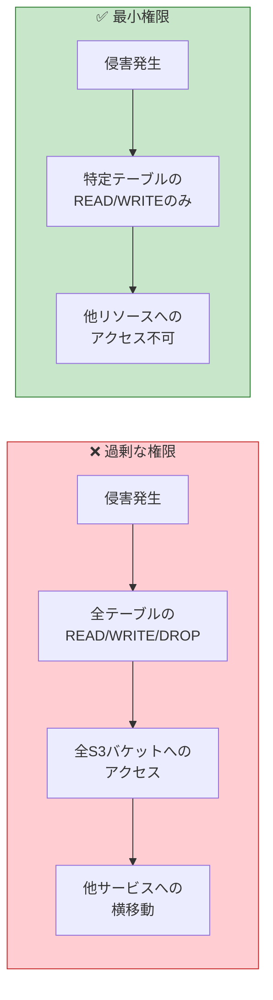
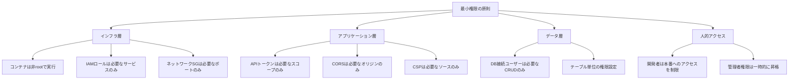
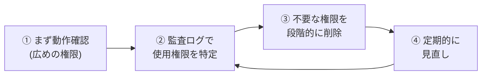
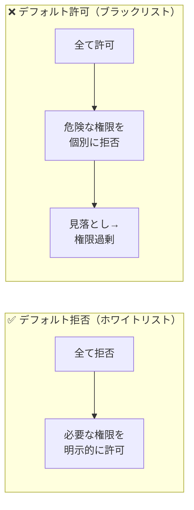
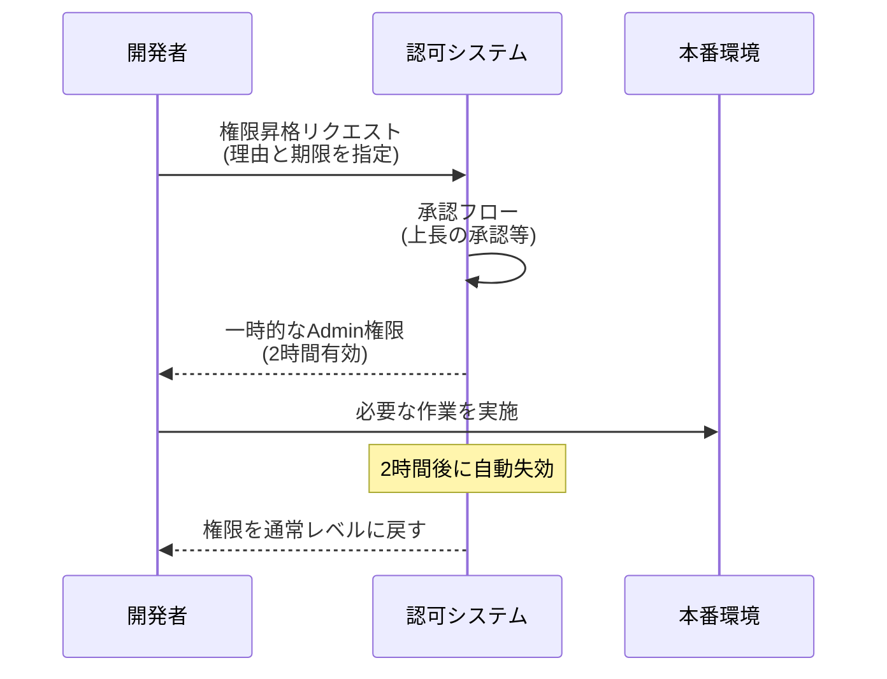

# 最小権限の原則（Principle of Least Privilege / PoLP）

> **一言で言うと:** 「必要最低限の権限だけ与える」という設計原則。DB接続ユーザー、APIトークン、IAMロール、ファイルパーミッション、CORSヘッダ——あらゆるレイヤーの権限設定に適用すべき基本思想。侵害が発生した際の**爆発半径（Blast Radius）を最小化する**ことが本質的な目的。

## なぜ必要か

最小権限の原則がないと、一つの侵害が**システム全体の壊滅的被害**に拡大する:

- **SQLインジェクションが成功した際** — DB接続ユーザーに `DROP TABLE` や `FILE` 権限があると、テーブル削除やOSファイルの読み取りまで可能になる。`SELECT`/`INSERT`/`UPDATE`/`DELETE` のみなら被害はデータの読み取り・改ざんに限定される
- **APIトークンが漏洩した際** — 全権限を持つトークンなら全リソースにアクセスできる。読み取り専用トークンなら書き込み被害は発生しない
- **コンテナが侵害された際** — rootで動作していたらホスト全体に影響が波及する。非特権ユーザーなら侵害範囲がコンテナ内に留まる
- **開発者の認証情報が漏洩した際** — 本番環境のAdmin権限があれば全データにアクセスできる。開発環境のみのアクセス権なら被害は限定的

### 爆発半径（Blast Radius）の概念



最小権限の原則は「侵害を防ぐ」のではなく、**侵害が起きたときの被害を限定する**ための原則。防御は多層で行い（多層防御 / Defense in Depth）、各層で権限を最小にすることで、一層が突破されても次の層で止まるようにする。

## どの問題を解決するか

### 適用すべきレイヤー

最小権限の原則はセキュリティの特定の層ではなく、**システムのあらゆる層**に横断的に適用される:



### 各レイヤーでの具体的な適用

| 適用対象 | 過剰な権限（❌） | 最小権限（✅） |
|----------|----------------|--------------|
| DB接続ユーザー | `GRANT ALL PRIVILEGES` | `GRANT SELECT, INSERT, UPDATE, DELETE ON 特定テーブル` |
| APIトークン | フルアクセストークン | スコープ付きトークン（`read:users`, `write:orders`） |
| IAMロール | `AdministratorAccess` | 必要なサービスとアクションのみ |
| [[Docker]]コンテナ | `USER root` | `USER appuser`（非特権ユーザー） |
| ファイルパーミッション | `chmod 777` | `chmod 644`（所有者のみ書き込み） |
| [[CORS]]設定 | `Allow-Origin: *` + 全メソッド許可 | 具体的なオリジン + 必要なメソッドのみ |
| CSP（Content Security Policy） | `script-src *` | `script-src 'self'` + nonce |
| 環境変数 / シークレット | アプリが全シークレットにアクセス | 各サービスに必要なシークレットのみ注入 |

## 他の仕組みとどう関係するか

- **下位レイヤーとの関係:**
  - [[Linux基本操作]] — ファイルパーミッション（`chmod`, `chown`）、ユーザー/グループの概念は最小権限の原則のOS実装
  - [[Docker]] — コンテナの非rootユーザー実行、読み取り専用ファイルシステム、capability制限

- **同レイヤーとの関係:**
  - [[SQLインジェクション]] — DB接続ユーザーの権限を最小にすることで、SQLインジェクション成功時の被害を限定する
  - [[XSS]] — CSP（Content Security Policy）はスクリプト実行権限を最小限に絞る仕組み
  - [[CORS]] — 許可するオリジン・メソッド・ヘッダを必要最小限にする
  - [[CSRF]] — SameSite Cookie属性はCookieの送信範囲を最小限にする

- **上位レイヤーとの関係:**
  - [[認証と認可]] — 認可（Authorization）は最小権限の原則をアプリケーションロジックに適用したもの。ロール・パーミッションに基づくアクセス制御
  - [[API設計-REST-GraphQL]] — APIトークンのスコープ設計。[[OAuth2とOpenID-Connect|OAuth 2.0]]のスコープはまさに最小権限の実装
  - [[CI-CD|CI/CD]] — デプロイパイプラインの認証情報には最小限の権限を付与する

## 誤解されやすいポイント

### 1. 「最小権限 = 権限を絞るとアプリが動かなくなるので現実的でない」

最小権限は「可能な限り少なく」ではなく「**必要な分だけ**」。動作に必要な権限を正確に把握し、それだけを付与する。初期に全権限を与えて動かし、監査ログで実際に使用された権限を特定してから絞る**トップダウンアプローチ**が現実的。



### 2. 「ORMを使っているからDB権限は気にしなくていい」

ORMが生成するSQLは `SELECT`/`INSERT`/`UPDATE`/`DELETE` だけだが、DB接続ユーザーに `DROP`/`ALTER`/`CREATE` 権限があると、[[SQLインジェクション]]や生SQL経由で破壊的操作が可能。ORMの使用とDB権限の最小化は**独立した防御層**。

### 3. 「開発環境と本番環境で同じ認証情報を使ってよい」

開発環境の認証情報が漏洩した場合（ログに記録、Gitにコミット等）、本番環境も同時に侵害される。環境ごとに別の認証情報を使用し、開発者が本番の認証情報に直接アクセスできないようにする。

### 4. 「Adminロールを作って全管理者に付与すればよい」

「Admin = 全権限」は最小権限の原則に反する。ユーザー管理者、コンテンツ管理者、システム管理者など、責任範囲に応じたロールを分離すべき。一人が全権限を持つと、そのアカウントの侵害で全システムが危険にさらされる。

### 5. 「一度設定した権限は見直す必要がない」

チームの変更、サービスの進化、担当者の退職などにより、必要な権限は常に変化する。定期的な権限レビュー（quarterly review等）を行い、不要になった権限を削除する**権限の棚卸し**が必要。

## 設計のベストプラクティス

### 原則: デフォルト拒否（Default Deny）

「デフォルトで全て拒否し、必要なものだけ許可する」がベース。「全て許可し、不要なものを拒否する」のアプローチは新しい攻撃ベクトルを見逃す。



### 時間的な最小権限: 一時的な権限昇格

常時管理者権限を持つのではなく、必要なときだけ権限を昇格させる:



### アンチパターン

| アンチパターン | なぜ問題か | 対策 |
|---|---|---|
| `GRANT ALL PRIVILEGES` | SQLインジェクション時にDROPやFILE操作が可能 | テーブル単位で必要なCRUDのみ付与 |
| 環境変数に全シークレットを注入 | 1つのサービスの侵害で全シークレットが漏洩 | 各サービスに必要なシークレットのみ注入 |
| `AdministratorAccess` IAMポリシー | 全AWSリソースへの無制限アクセス | サービス・アクション・リソースレベルで制限 |
| 長命のAPIキー（有効期限なし） | 漏洩時に気づかず長期間悪用される | 短命トークン + リフレッシュ、または自動ローテーション |
| 全開発者に本番DBへの直接アクセス権 | 誤操作やアカウント侵害で本番データが危険 | 読み取り専用レプリカ + 必要時の一時的アクセス |

## AIによる実装のアンチパターン

| アンチパターン | なぜ問題か | 対策 |
|---|---|---|
| `GRANT ALL PRIVILEGES` をDB初期化スクリプトに記述 | 動作させることを優先して全権限を付与しがち | 必要な操作のみGRANTする |
| Dockerfileで `USER root` のまま | LLMはビルドの簡便さから root を使いがち | マルチステージビルドで非特権ユーザーを設定 |
| IAMポリシーに `"Action": "*"` を記述 | 「とりあえず動く」を優先した全開放 | 実際に使用するActionのみ列挙 |
| APIトークンにスコープを設定しない | 全アクセス可能なトークンが生成される | エンドポイントごとに必要なスコープを定義 |

## 具体例

### DB権限の最小化（PostgreSQL）

```sql
-- アプリケーション用ユーザーの作成
CREATE USER app_readonly WITH PASSWORD 'secure-password';
CREATE USER app_readwrite WITH PASSWORD 'secure-password';

-- 読み取り専用ユーザー（レポート生成、分析用）
GRANT CONNECT ON DATABASE mydb TO app_readonly;
GRANT USAGE ON SCHEMA public TO app_readonly;
GRANT SELECT ON ALL TABLES IN SCHEMA public TO app_readonly;
-- INSERT, UPDATE, DELETE, DROP は一切不可

-- 読み書きユーザー（アプリケーション用）
GRANT CONNECT ON DATABASE mydb TO app_readwrite;
GRANT USAGE ON SCHEMA public TO app_readwrite;
GRANT SELECT, INSERT, UPDATE, DELETE ON users, orders, products TO app_readwrite;
-- DROP, ALTER, CREATE, TRUNCATE は不可
-- 他のテーブル（audit_logs等）へのアクセスは不可

-- マイグレーション専用ユーザー（CI/CDパイプラインのみ使用）
CREATE USER app_migrator WITH PASSWORD 'secure-password';
GRANT ALL PRIVILEGES ON SCHEMA public TO app_migrator;
-- マイグレーション時のみ使用し、アプリケーション実行時には使わない
```

### Dockerfileでの非特権ユーザー

```dockerfile
# マルチステージビルド
FROM node:22-slim AS builder
WORKDIR /app
COPY package*.json ./
RUN npm ci
COPY . .
RUN npm run build

# 本番依存のみ再インストール（devDependenciesを除外）
RUN rm -rf node_modules && npm ci --omit=dev

FROM node:22-slim
WORKDIR /app

# 非特権ユーザーを作成
RUN groupadd --system appgroup && \
    useradd --system --gid appgroup --no-create-home appuser

COPY --from=builder /app/dist ./dist
COPY --from=builder /app/node_modules ./node_modules
COPY --from=builder /app/package.json ./

# ファイル所有者を設定し、非特権ユーザーに切り替え
RUN chown -R appuser:appgroup /app
USER appuser

EXPOSE 3000
CMD ["node", "dist/index.js"]
```

### IAMポリシーの最小化（AWS）

```json
{
  "Version": "2012-10-17",
  "Statement": [
    {
      "Sid": "AllowS3ReadOnly",
      "Effect": "Allow",
      "Action": [
        "s3:GetObject",
        "s3:ListBucket"
      ],
      "Resource": [
        "arn:aws:s3:::my-app-uploads",
        "arn:aws:s3:::my-app-uploads/*"
      ]
    },
    {
      "Sid": "AllowSQSSendMessage",
      "Effect": "Allow",
      "Action": [
        "sqs:SendMessage"
      ],
      "Resource": "arn:aws:sqs:ap-northeast-1:123456789:my-app-queue"
    }
  ]
}
```

**ポイント:**
- `"Action": "*"` ではなく、必要なアクション（`s3:GetObject` 等）のみ許可
- `"Resource": "*"` ではなく、特定のARNに限定
- サービスごとに別のIAMロールを使用（ECSタスクロール等）

### APIトークンのスコープ設計

```typescript
// OAuth 2.0 スコープに基づくアクセス制御
import express from 'express';

const app = express();

// スコープを検証するミドルウェア
function requireScope(...requiredScopes: string[]) {
  return (req: express.Request, res: express.Response, next: express.NextFunction) => {
    const tokenScopes: string[] = req.user?.scopes ?? [];
    const hasAllScopes = requiredScopes.every(s => tokenScopes.includes(s));

    if (!hasAllScopes) {
      return res.status(403).json({
        error: 'insufficient_scope',
        required: requiredScopes,
      });
    }
    next();
  };
}

// 読み取りには read:users スコープが必要
app.get('/api/users', requireScope('read:users'), (req, res) => {
  // ユーザー一覧を返す
});

// 作成には write:users スコープが必要
app.post('/api/users', requireScope('write:users'), (req, res) => {
  // ユーザーを作成
});

// 削除にはより強い admin:users スコープが必要
app.delete('/api/users/:id', requireScope('admin:users'), (req, res) => {
  // ユーザーを削除
});

app.listen(3000);
```

### 環境変数とシークレットの分離

```yaml
# docker-compose.yml — サービスごとに必要なシークレットのみ注入
services:
  api:
    image: my-app-api
    environment:
      DATABASE_URL: ${API_DATABASE_URL}     # 読み書き権限
      REDIS_URL: ${REDIS_URL}
      # S3_ACCESS_KEY は不要なので渡さない

  worker:
    image: my-app-worker
    environment:
      DATABASE_URL: ${WORKER_DATABASE_URL}  # 読み取り専用
      SQS_QUEUE_URL: ${SQS_QUEUE_URL}
      S3_ACCESS_KEY: ${S3_ACCESS_KEY}       # ワーカーのみS3にアクセス
      # REDIS_URL は不要なので渡さない

  migrator:
    image: my-app-migrator
    environment:
      DATABASE_URL: ${MIGRATOR_DATABASE_URL} # スキーマ変更権限
      # 他のシークレットは一切不要
```

## 参考リソース

- OWASP Principle of Least Privilege — OWASPによる最小権限の原則の解説
- AWS Well-Architected Framework: Security Pillar — AWSにおけるセキュリティ設計のベストプラクティス
- CIS Benchmarks — OS・DB・クラウドの構成セキュリティベンチマーク
- NIST SP 800-53: Access Control (AC) — 米国標準のアクセス制御ガイドライン

## 学習メモ

- 最小権限は「防御」ではなく「被害軽減」の原則。侵害を前提に設計する（Assume Breach）
- [[SQLインジェクション]]対策としてプリペアドステートメント（防御）+ DB権限最小化（被害軽減）を組み合わせるのが多層防御
- [[CORS]]設定、CSP、SameSite Cookie属性——すべて最小権限の原則の具体的適用
- 「とりあえず動かす」ために全権限を付与するのは開発時だけ。本番投入前に必ず権限を絞る
- IAMポリシーは `"Action": "*"` を使わない。AWS IAM Access Analyzer で未使用権限を特定できる
