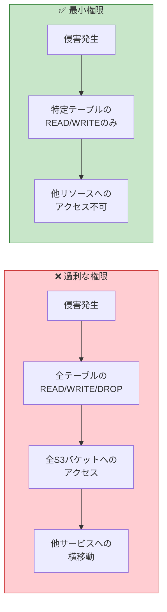
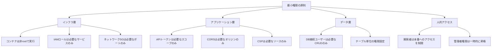
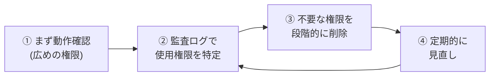
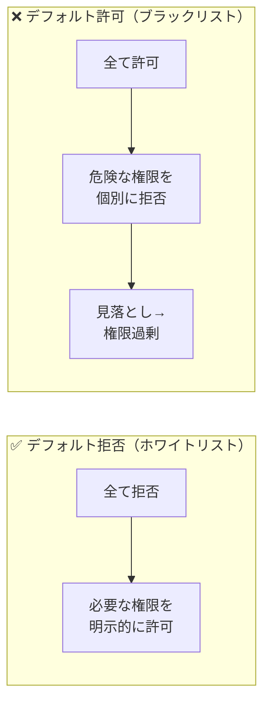
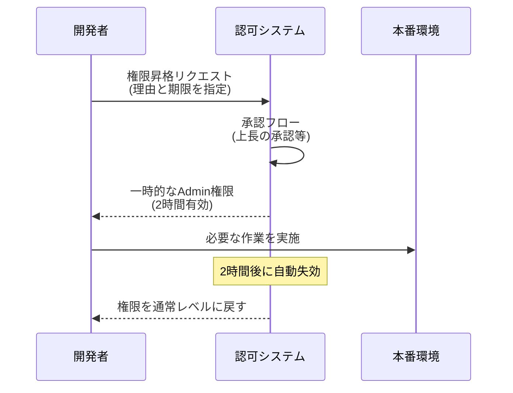

# 最小権限の原則（Principle of Least Privilege / PoLP）

> **一言で言うと:** 「必要最低限の権限だけ与える」という設計原則。DB接続ユーザー、APIトークン、IAMロール、ファイルパーミッション、CORSヘッダ——あらゆるレイヤーの権限設定に適用すべき基本思想。侵害が発生した際の**爆発半径（Blast Radius）を最小化する**ことが本質的な目的。

## 3分で全体像

- **何を解決する技術か:** **侵害が起きた前提で**被害を限定する設計原則。SQLi / XSS / 認証情報漏洩 / コンテナ侵害などが成功しても、**爆発半径（Blast Radius）**が次の層で止まるように、各レイヤーの権限を「必要最低限」に絞る
- **代表的な使用シーン:** DB ユーザーの GRANT 設計、IAM ロール / ポリシー、Docker コンテナの実行ユーザー、Kubernetes RBAC、API トークンのスコープ、CORS / CSP の許可リスト、CI/CD パイプラインの認証情報、SSH 鍵の配布、開発者の本番アクセス
- **これだけは覚える3つ:**
    1. **「侵害を防ぐ」のではなく「被害を限定する」原則** — 防御は別途 (バリデーション・プリペアドステートメント等) で行う。最小権限は**多層防御の最後の壁**で、Assume Breach（侵害を前提とする）の発想に立つ
    2. **時間的最小権限も重要** — 常時 Admin ではなく**必要なときだけ昇格**（PIM / Just-In-Time Access）。AWS の AssumeRole、GitHub の Environment Approval、Linux の sudo がそれぞれの実装。長命な API キーは漏洩時に長期間悪用される
    3. **「デフォルト拒否」が原則** — 全許可からの個別拒否（denylist）は新攻撃に脆弱。**全拒否からの個別許可（allowlist）** で構築する。`Action: "*"`、`GRANT ALL PRIVILEGES`、`USER root`、`Allow-Origin: *` はすべて反例
- **AIに任せやすいか:** **一部任せられる** — `GRANT` 文の最小化、Dockerfile の非 root ユーザー化、IAM ポリシーの最小アクション列挙、API スコープ実装などの**雛形作成**は AI が高品質に書ける。一方で「**実際にどの権限が使われているか**」「**Admin ロールを誰に与えるか**」「**緊急昇格フローの設計**」は人間判断。AI は「動かすため」に `*` や `ALL` を使いがちで、本番投入前のレビュー必須
- **詰まったらここを読む:** [[SQLインジェクション]] / [[XSS]] / [[CORS]] / [[認証と認可]]

## なぜ必要か

最小権限の原則がないと、一つの侵害が**システム全体の壊滅的被害**に拡大する:

- **SQLインジェクションが成功した際** — DB接続ユーザーに `DROP TABLE` や `FILE` 権限があると、テーブル削除やOSファイルの読み取りまで可能になる。`SELECT`/`INSERT`/`UPDATE`/`DELETE` のみなら被害はデータの読み取り・改ざんに限定される
- **APIトークンが漏洩した際** — 全権限を持つトークンなら全リソースにアクセスできる。読み取り専用トークンなら書き込み被害は発生しない
- **コンテナが侵害された際** — rootで動作していたらホスト全体に影響が波及する。非特権ユーザーなら侵害範囲がコンテナ内に留まる
- **開発者の認証情報が漏洩した際** — 本番環境のAdmin権限があれば全データにアクセスできる。開発環境のみのアクセス権なら被害は限定的

### 爆発半径（Blast Radius）の概念


```mermaid
flowchart LR
    subgraph Over["❌ 過剰な権限"]
        A1["侵害発生"] --> A2["全テーブルの<br/>READ/WRITE/DROP"]
        A2 --> A3["全S3バケットへの<br/>アクセス"]
        A3 --> A4["他サービスへの<br/>横移動"]
    end

    subgraph Minimal["✅ 最小権限"]
        B1["侵害発生"] --> B2["特定テーブルの<br/>READ/WRITEのみ"]
        B2 --> B3["他リソースへの<br/>アクセス不可"]
    end

    style Over fill:#ffcdd2,stroke:#c62828
    style Minimal fill:#c8e6c9,stroke:#2e7d32
```

最小権限の原則は「侵害を防ぐ」のではなく、**侵害が起きたときの被害を限定する**ための原則。防御は多層で行い（多層防御 / Defense in Depth）、各層で権限を最小にすることで、一層が突破されても次の層で止まるようにする。

## どの問題を解決するか

### 適用すべきレイヤー

最小権限の原則はセキュリティの特定の層ではなく、**システムのあらゆる層**に横断的に適用される:


```mermaid
flowchart TB
    PoLP["最小権限の原則"] --> Infra["インフラ層"]
    PoLP --> App["アプリケーション層"]
    PoLP --> Data["データ層"]
    PoLP --> Human["人的アクセス"]

    Infra --> I1["コンテナは非rootで実行"]
    Infra --> I2["IAMロールは必要なサービスのみ"]
    Infra --> I3["ネットワークSGは必要なポートのみ"]

    App --> A1["APIトークンは必要なスコープのみ"]
    App --> A2["CORSは必要なオリジンのみ"]
    App --> A3["CSPは必要なソースのみ"]

    Data --> D1["DB接続ユーザーは必要なCRUDのみ"]
    Data --> D2["テーブル単位の権限設定"]

    Human --> H1["開発者は本番へのアクセスを制限"]
    Human --> H2["管理者権限は一時的に昇格"]
```

### 各レイヤーでの具体的な適用

| 適用対象 | 過剰な権限（❌） | 最小権限（✅） |
|----------|----------------|--------------|
| DB接続ユーザー | `GRANT ALL PRIVILEGES` | `GRANT SELECT, INSERT, UPDATE, DELETE ON 特定テーブル` |
| APIトークン | フルアクセストークン | スコープ付きトークン（`read:users`, `write:orders`） |
| IAMロール | `AdministratorAccess` | 必要なサービスとアクションのみ |
| [[Docker]]コンテナ | `USER root` | `USER appuser`（非特権ユーザー） |
| ファイルパーミッション | `chmod 777` | `chmod 644`（所有者のみ書き込み） |
| [[CORS]]設定 | `Allow-Origin: *` + 全メソッド許可 | 具体的なオリジン + 必要なメソッドのみ |
| CSP（Content Security Policy） | `script-src *` | `script-src 'self'` + nonce |
| 環境変数 / シークレット | アプリが全シークレットにアクセス | 各サービスに必要なシークレットのみ注入 |

## 他の仕組みとどう関係するか

- **下位レイヤーとの関係:**
  - [[Linux基本操作]] — ファイルパーミッション（`chmod`, `chown`）、ユーザー/グループの概念は最小権限の原則のOS実装
  - [[Docker]] — コンテナの非rootユーザー実行、読み取り専用ファイルシステム、capability制限

- **同レイヤーとの関係:**
  - [[SQLインジェクション]] — DB接続ユーザーの権限を最小にすることで、SQLインジェクション成功時の被害を限定する
  - [[XSS]] — CSP（Content Security Policy）はスクリプト実行権限を最小限に絞る仕組み
  - [[CORS]] — 許可するオリジン・メソッド・ヘッダを必要最小限にする
  - [[CSRF]] — SameSite Cookie属性はCookieの送信範囲を最小限にする

- **上位レイヤーとの関係:**
  - [[認証と認可]] — 認可（Authorization）は最小権限の原則をアプリケーションロジックに適用したもの。ロール・パーミッションに基づくアクセス制御
  - [[API設計-REST-GraphQL]] — APIトークンのスコープ設計。[[OAuth2とOpenID-Connect|OAuth 2.0]]のスコープはまさに最小権限の実装
  - [[CI-CD|CI/CD]] — デプロイパイプラインの認証情報には最小限の権限を付与する

## 誤解されやすいポイント

### 1. 「最小権限 = 権限を絞るとアプリが動かなくなるので現実的でない」

最小権限は「可能な限り少なく」ではなく「**必要な分だけ**」。動作に必要な権限を正確に把握し、それだけを付与する。初期に全権限を与えて動かし、監査ログで実際に使用された権限を特定してから絞る**トップダウンアプローチ**が現実的。


```mermaid
flowchart LR
    A["① まず動作確認<br/>(広めの権限)"] --> B["② 監査ログで<br/>使用権限を特定"]
    B --> C["③ 不要な権限を<br/>段階的に削除"]
    C --> D["④ 定期的に<br/>見直し"]
    D --> B
```

### 2. 「ORMを使っているからDB権限は気にしなくていい」

ORMが生成するSQLは `SELECT`/`INSERT`/`UPDATE`/`DELETE` だけだが、DB接続ユーザーに `DROP`/`ALTER`/`CREATE` 権限があると、[[SQLインジェクション]]や生SQL経由で破壊的操作が可能。ORMの使用とDB権限の最小化は**独立した防御層**。

### 3. 「開発環境と本番環境で同じ認証情報を使ってよい」

開発環境の認証情報が漏洩した場合（ログに記録、Gitにコミット等）、本番環境も同時に侵害される。環境ごとに別の認証情報を使用し、開発者が本番の認証情報に直接アクセスできないようにする。

### 4. 「Adminロールを作って全管理者に付与すればよい」

「Admin = 全権限」は最小権限の原則に反する。ユーザー管理者、コンテンツ管理者、システム管理者など、責任範囲に応じたロールを分離すべき。一人が全権限を持つと、そのアカウントの侵害で全システムが危険にさらされる。

### 5. 「一度設定した権限は見直す必要がない」

チームの変更、サービスの進化、担当者の退職などにより、必要な権限は常に変化する。定期的な権限レビュー（quarterly review等）を行い、不要になった権限を削除する**権限の棚卸し**が必要。

## 設計のベストプラクティス

### 原則: デフォルト拒否（Default Deny）

「デフォルトで全て拒否し、必要なものだけ許可する」がベース。「全て許可し、不要なものを拒否する」のアプローチは新しい攻撃ベクトルを見逃す。


```mermaid
flowchart LR
    subgraph Deny["✅ デフォルト拒否（ホワイトリスト）"]
        D1["全て拒否"] --> D2["必要な権限を<br/>明示的に許可"]
    end

    subgraph Allow["❌ デフォルト許可（ブラックリスト）"]
        A1["全て許可"] --> A2["危険な権限を<br/>個別に拒否"]
        A2 --> A3["見落とし→<br/>権限過剰"]
    end
```

### 時間的な最小権限: 一時的な権限昇格

常時管理者権限を持つのではなく、必要なときだけ権限を昇格させる:


```mermaid
sequenceDiagram
    participant Dev as 開発者
    participant Auth as 認可システム
    participant Prod as 本番環境

    Dev->>Auth: 権限昇格リクエスト<br/>(理由と期限を指定)
    Auth->>Auth: 承認フロー<br/>(上長の承認等)
    Auth-->>Dev: 一時的なAdmin権限<br/>(2時間有効)
    Dev->>Prod: 必要な作業を実施
    Note over Auth: 2時間後に自動失効
    Auth-->>Dev: 権限を通常レベルに戻す
```

### アンチパターン

| アンチパターン | なぜ問題か | 対策 |
|---|---|---|
| `GRANT ALL PRIVILEGES` | SQLインジェクション時にDROPやFILE操作が可能 | テーブル単位で必要なCRUDのみ付与 |
| 環境変数に全シークレットを注入 | 1つのサービスの侵害で全シークレットが漏洩 | 各サービスに必要なシークレットのみ注入 |
| `AdministratorAccess` IAMポリシー | 全AWSリソースへの無制限アクセス | サービス・アクション・リソースレベルで制限 |
| 長命のAPIキー（有効期限なし） | 漏洩時に気づかず長期間悪用される | 短命トークン + リフレッシュ、または自動ローテーション |
| 全開発者に本番DBへの直接アクセス権 | 誤操作やアカウント侵害で本番データが危険 | 読み取り専用レプリカ + 必要時の一時的アクセス |

## AIエージェントとの協働

> このトピックでAIコーディングエージェント（Claude Code, Copilot, Cursor 等）と協働するための観点。
> **「AIに何をどこまで任せ、AIに何をレビューさせ、人間は何を最終判断するか」**を整理する。実装だけでなく**レビューもAIに任せられる**前提で考える（`/review-ai-code` skillが横断アンチパターン照合を担う）。

### AIに任せられる部分 / 人間が判断すべき部分

| タスク種類 | 任せ方（実装/レビュー） | 人間の関与 |
|---|---|---|
| DB ユーザーの `GRANT` 文生成（読み書き / 読み取り / migrator の 3 種類） | SQL 雛形は AI 委任 | 各環境（dev/staging/prod）への適用順序、既存 GRANT との差分確認 |
| Dockerfile の非 root 化（`USER appuser` + `chown`） | マルチステージビルド構造の生成は AI 任せ | ビルド成果物のパス・パーミッション設定の妥当性 |
| IAM ポリシーの最小化（必要 Action のみ列挙、Resource ARN 限定） | JSON 雛形は AI が書ける、AWS IAM Access Analyzer 結果から不要権限の削除も AI 委任 | 実際に発生する操作の網羅性、本番運用での権限不足リスクの判断 |
| OAuth 2.0 スコープ設計と検証ミドルウェア | スコープ定義 + Express ミドルウェアは AI 任せ | スコープの粒度（`read:users` vs `read:users:profile`）の決定 |
| シークレット管理（環境変数の最小注入） | `docker-compose.yml` / Terraform / Helm の最小化は AI 委任 | サービス間の依存関係と必要シークレットのマッピング |
| 一時的権限昇格（AWS AssumeRole / Just-In-Time Access） | スクリプト・CloudFormation / Terraform は AI 委任 | 承認フロー、最大有効時間、監査ログ要件の決定 |
| 既存権限の棚卸し | `aws iam generate-service-last-accessed-details` 等のレポート生成は AI 任せ | 削除対象の判断、ステークホルダー合意 |
| Kubernetes RBAC（Role / RoleBinding / ServiceAccount） | YAML 雛形は AI 委任 | クラスタ管理ポリシーとの整合性 |

### AI生成コードのレビュー観点（このトピック固有）

AI生成物を受け取ったとき、最低限ここを見る。

1. **`*` / `ALL` / `Admin` が暗黙のデフォルトになっていないか** — `GRANT ALL`、`Action: "*"`、`Resource: "*"`、`Allow-Origin: *` は AI が動作優先で生成する典型。**実際に必要な操作だけを列挙**する allowlist スタイルに書き換える
2. **`USER root` のまま、または `RUN` 前後で昇格していないか** — Dockerfile で非特権ユーザー化を忘れる、または最終ステージで root に戻ってしまうケースがある。`docker run --user 1000:1000` でなく Dockerfile 側で固定すべき
3. **長命な認証情報（API キー / `aws_access_key_id`）が直接埋め込まれていないか** — `.env` の例も含めて、コミット可能な雛形には**架空の値**しか入れない。本番運用は AWS Secrets Manager / Vault / IAM Role for Service Accounts のような短命トークン方式を推奨

### 効くプロンプトの型

このトピックに関する実装をAIに依頼するとき、コンテキストとして渡すべき情報・制約・成功基準のテンプレ。

```
# 前提（プロジェクトの状況・既存のコード規約）
- DB: PostgreSQL 16（RDS Aurora）
- 実行環境: ECS Fargate、Task Role + Execution Role を使用
- アプリケーション: 注文サービス、参照系（読み取り）と書き込み系を別タスクで分離
- シークレット: AWS Secrets Manager
- 既存: 全タスクが `app_admin` ロールを使用、IAM ポリシーは `s3:*` を許可

# やってほしいこと
- DB ユーザーと IAM ロールを「読み取り専用 / 書き込み / migrator」の 3 つに分離する

# 守ってほしい制約（このトピック固有のもの）
- 読み取り専用: SELECT のみ、対象テーブルは orders, products
- 書き込み: SELECT/INSERT/UPDATE/DELETE のみ、DDL は禁止
- migrator: ALL PRIVILEGES（マイグレーション CI のみ使用）
- IAM: s3:GetObject + s3:PutObject に限定し、Resource は arn:aws:s3:::orders-uploads/* に絞る
- Dockerfile は非 root（uid:gid = 10001:10001）

# 完了の判断基準
- 読み取りタスクが書き込みクエリを発行すると DB 側で permission denied
- IAM Policy Simulator で `s3:DeleteObject` が拒否されること
- `docker run` 時にコンテナのプロセス UID が 10001 であること
```

### AI実装のアンチパターン

LLM生成コードで頻出する過剰設計・誤用パターン。レビュー時の照合表として使う。

| アンチパターン | なぜ問題か | レビュー観点 / 対策 |
|---|---|---|
| `GRANT ALL PRIVILEGES` を DB 初期化スクリプトに記述 | 動作優先で全権限を付与しがち | 必要な操作のみ GRANT、テーブル単位で限定 |
| Dockerfile で `USER root` のまま | LLM はビルド簡便さから root を使いがち | マルチステージで非特権ユーザー、`COPY --chown=appuser:appgroup` |
| IAM ポリシーに `"Action": "*"` / `"Resource": "*"` | 「とりあえず動く」を優先した全開放 | 必要な Action と Resource ARN を限定 |
| API トークンにスコープを設定しない | 全アクセス可能なトークンが生成される | エンドポイントごとにスコープ定義、`requireScope()` ミドルウェア |
| 環境変数に全シークレット注入 | 1 サービスの侵害で全シークレット漏洩 | 各サービスに必要なシークレットのみ |
| 開発・本番で同じ認証情報 | 開発漏洩で本番も侵害 | 環境別の認証情報、開発者の本番直接アクセスを禁止 |
| 長命な API キー（有効期限なし） | 漏洩時に長期間悪用 | 短命トークン + リフレッシュ、IAM Role / OIDC |
| 「Admin = 全権限」のロール設計 | 1 アカウント侵害で全システム危険 | 責任範囲別にロール分離（ユーザー管理者・コンテンツ管理者等） |
| 一度設定した権限を見直さない | 退職者の権限残置、不要権限の蓄積 | 四半期ごとの棚卸し、IAM Access Analyzer の活用 |
| Kubernetes で `cluster-admin` の RoleBinding | クラスタ全体への無制限アクセス | namespace 単位の `Role` + `RoleBinding`、`ServiceAccount` 分離 |

→ レイヤー横断のアンチパターン索引: [[_anti-patterns/_index|AIアンチパターン索引]]

## 具体例

### DB権限の最小化（PostgreSQL）

```sql
-- アプリケーション用ユーザーの作成
CREATE USER app_readonly WITH PASSWORD 'secure-password';
CREATE USER app_readwrite WITH PASSWORD 'secure-password';

-- 読み取り専用ユーザー（レポート生成、分析用）
GRANT CONNECT ON DATABASE mydb TO app_readonly;
GRANT USAGE ON SCHEMA public TO app_readonly;
GRANT SELECT ON ALL TABLES IN SCHEMA public TO app_readonly;
-- INSERT, UPDATE, DELETE, DROP は一切不可

-- 読み書きユーザー（アプリケーション用）
GRANT CONNECT ON DATABASE mydb TO app_readwrite;
GRANT USAGE ON SCHEMA public TO app_readwrite;
GRANT SELECT, INSERT, UPDATE, DELETE ON users, orders, products TO app_readwrite;
-- DROP, ALTER, CREATE, TRUNCATE は不可
-- 他のテーブル（audit_logs等）へのアクセスは不可

-- マイグレーション専用ユーザー（CI/CDパイプラインのみ使用）
CREATE USER app_migrator WITH PASSWORD 'secure-password';
GRANT ALL PRIVILEGES ON SCHEMA public TO app_migrator;
-- マイグレーション時のみ使用し、アプリケーション実行時には使わない
```

### Dockerfileでの非特権ユーザー

```dockerfile
# マルチステージビルド
FROM node:22-slim AS builder
WORKDIR /app
COPY package*.json ./
RUN npm ci
COPY . .
RUN npm run build

# 本番依存のみ再インストール（devDependenciesを除外）
RUN rm -rf node_modules && npm ci --omit=dev

FROM node:22-slim
WORKDIR /app

# 非特権ユーザーを作成
RUN groupadd --system appgroup && \
    useradd --system --gid appgroup --no-create-home appuser

COPY --from=builder /app/dist ./dist
COPY --from=builder /app/node_modules ./node_modules
COPY --from=builder /app/package.json ./

# ファイル所有者を設定し、非特権ユーザーに切り替え
RUN chown -R appuser:appgroup /app
USER appuser

EXPOSE 3000
CMD ["node", "dist/index.js"]
```

### IAMポリシーの最小化（AWS）

```json
{
  "Version": "2012-10-17",
  "Statement": [
    {
      "Sid": "AllowS3ReadOnly",
      "Effect": "Allow",
      "Action": [
        "s3:GetObject",
        "s3:ListBucket"
      ],
      "Resource": [
        "arn:aws:s3:::my-app-uploads",
        "arn:aws:s3:::my-app-uploads/*"
      ]
    },
    {
      "Sid": "AllowSQSSendMessage",
      "Effect": "Allow",
      "Action": [
        "sqs:SendMessage"
      ],
      "Resource": "arn:aws:sqs:ap-northeast-1:123456789:my-app-queue"
    }
  ]
}
```

**ポイント:**
- `"Action": "*"` ではなく、必要なアクション（`s3:GetObject` 等）のみ許可
- `"Resource": "*"` ではなく、特定のARNに限定
- サービスごとに別のIAMロールを使用（ECSタスクロール等）

### APIトークンのスコープ設計

```typescript
// OAuth 2.0 スコープに基づくアクセス制御
import express from 'express';

const app = express();

// スコープを検証するミドルウェア
function requireScope(...requiredScopes: string[]) {
  return (req: express.Request, res: express.Response, next: express.NextFunction) => {
    const tokenScopes: string[] = req.user?.scopes ?? [];
    const hasAllScopes = requiredScopes.every(s => tokenScopes.includes(s));

    if (!hasAllScopes) {
      return res.status(403).json({
        error: 'insufficient_scope',
        required: requiredScopes,
      });
    }
    next();
  };
}

// 読み取りには read:users スコープが必要
app.get('/api/users', requireScope('read:users'), (req, res) => {
  // ユーザー一覧を返す
});

// 作成には write:users スコープが必要
app.post('/api/users', requireScope('write:users'), (req, res) => {
  // ユーザーを作成
});

// 削除にはより強い admin:users スコープが必要
app.delete('/api/users/:id', requireScope('admin:users'), (req, res) => {
  // ユーザーを削除
});

app.listen(3000);
```

### 環境変数とシークレットの分離

```yaml
# docker-compose.yml — サービスごとに必要なシークレットのみ注入
services:
  api:
    image: my-app-api
    environment:
      DATABASE_URL: ${API_DATABASE_URL}     # 読み書き権限
      REDIS_URL: ${REDIS_URL}
      # S3_ACCESS_KEY は不要なので渡さない

  worker:
    image: my-app-worker
    environment:
      DATABASE_URL: ${WORKER_DATABASE_URL}  # 読み取り専用
      SQS_QUEUE_URL: ${SQS_QUEUE_URL}
      S3_ACCESS_KEY: ${S3_ACCESS_KEY}       # ワーカーのみS3にアクセス
      # REDIS_URL は不要なので渡さない

  migrator:
    image: my-app-migrator
    environment:
      DATABASE_URL: ${MIGRATOR_DATABASE_URL} # スキーマ変更権限
      # 他のシークレットは一切不要
```

## 参考リソース

- OWASP Principle of Least Privilege — OWASPによる最小権限の原則の解説
- AWS Well-Architected Framework: Security Pillar — AWSにおけるセキュリティ設計のベストプラクティス
- CIS Benchmarks — OS・DB・クラウドの構成セキュリティベンチマーク
- NIST SP 800-53: Access Control (AC) — 米国標準のアクセス制御ガイドライン

## 理解度セルフチェック

> 答えられなければ本文に戻る。答えはこのファイル内に必ずある。

1. 最小権限の原則は「侵害を防ぐ」原則か、「被害を限定する」原則か。Assume Breach の発想と関連付けて説明せよ。
2. Adminロールを 1 つ作って「管理者全員」に付与するのが最小権限の原則に反する理由を、爆発半径の概念で説明せよ。
3. 次のコードは小さな EC アプリのインフラ初期化と Express ハンドラである。最小権限観点で複数の問題があるので、何が問題で、どう直すかを述べよ。
   ```sql
   -- init.sql
   CREATE USER app_user WITH PASSWORD 'pass';
   GRANT ALL PRIVILEGES ON DATABASE shop TO app_user;
   ```
   ```dockerfile
   FROM node:22
   WORKDIR /app
   COPY . .
   RUN npm install
   CMD ["node", "src/index.js"]
   ```
   ```json
   // iam-policy.json
   {
     "Version": "2012-10-17",
     "Statement": [
       { "Effect": "Allow", "Action": "*", "Resource": "*" }
     ]
   }
   ```
   ```typescript
   // src/middleware/auth.ts
   app.use((req, res, next) => {
     // 全 API トークンに admin 権限を付与
     req.user = { id: req.headers['x-user-id'], role: 'admin' };
     next();
   });
   ```

> [!note]- 解答の指針
>
> > [!info] 用語ミニ辞典
> > - **爆発半径（Blast Radius）**: 1 つの侵害が及ぼす被害範囲。最小権限を適用すると、SQLi が成功しても DB レベルで `DROP` できない、IAM 漏洩でも他リソースに横移動できない、というように半径が小さくなる
> > - **Assume Breach（侵害前提）**: 「侵害は必ず起きる」前提で設計する考え方。完全防御は不可能なので、侵害が起きた時に被害を最小化する設計（最小権限・多層防御・監査ログ）に注力する
> > - **PIM（Privileged Identity Management） / JIT（Just-In-Time）アクセス**: 必要な時だけ一時的に権限を昇格し、終わったら自動で剥奪する仕組み。AWS IAM Identity Center、Azure Privileged Identity Management、HashiCorp Vault の Dynamic Secrets が代表例
> > - **AWS IAM Access Analyzer**: IAM ロール / ポリシーが実際にどの権限を使用しているかを分析し、未使用権限の削除を提案するサービス。最小権限化の出発点として有用
> > - **デフォルト拒否（Default Deny）**: 「全拒否から始めて必要なものだけ許可」の allowlist 方式。「全許可から始めて危険なものを拒否」の denylist 方式に比べ、新しい攻撃ベクトルに自動的に強い
> > - **ロールベースアクセス制御（RBAC）**: 権限を「ロール」にまとめ、ユーザーやサービスにロールを割り当てる方式。Kubernetes RBAC、AWS IAM Role、PostgreSQL の `CREATE ROLE` が代表例
> > - **Service Account**: アプリケーションやサービスが API にアクセスするために使う非人間アカウント。Kubernetes の `ServiceAccount`、AWS の `IAM Role for Service Accounts (IRSA)` など。短命トークンと組み合わせて使う
>
> 1. **「被害を限定する」原則**。理由:
>     - 侵害自体を防ぐのは入力検証・認証・プリペアドステートメント・パッチ適用などの**他の防御層**の責務
>     - 最小権限は「**侵害は起きる**」という Assume Breach の発想に立ち、起きた時に**爆発半径を最小化**する。SQLi が成功しても `DROP` 権限がなければテーブルは残る、API キー漏洩でも読み取り専用なら書き込みは止まる
>     - 「防御の最後の壁」として、他の層が破られた時に被害を限定する役割。多層防御（Defense in Depth）の重要な構成要素
> 2. **理由**:
>     - **1 つのアカウント侵害が全システムの侵害になる** — 「Admin 1 人が侵害」=「Admin が持つすべての権限が攻撃者の手に落ちる」。爆発半径が組織全体に広がる
>     - **責任範囲が異なる業務を 1 つの権限にまとめる弊害** — ユーザー管理者・コンテンツ管理者・システム管理者は別の責任範囲を持つ。1 つのロールにまとめると、必要のない権限まで持つことになり「動作確認のつもりで本番データを削除」のような事故が起こる
>     - **責任範囲別にロールを分離**することで、各ロールの侵害は対応範囲だけに限定される。Admin が必要な作業（緊急対応など）は**一時的な昇格**（PIM / JIT）で行うのが現代的な解
> 3. **4 箇所すべて問題**:
>     - **`GRANT ALL PRIVILEGES ON DATABASE shop TO app_user`** — `DROP TABLE` / `ALTER` / `CREATE` まで持つため、SQLi 成功時に被害が破壊的になる。**`GRANT SELECT, INSERT, UPDATE, DELETE ON 特定テーブル` のみ**にし、マイグレーション用は別ユーザー（`app_migrator`）に分離
>     - **`FROM node:22` + root のまま** — コンテナ侵害時にホスト影響範囲が広がる。**マルチステージ + 非特権ユーザー**:
>       ```dockerfile
>       FROM node:22-slim AS builder
>       WORKDIR /app
>       COPY package*.json ./
>       RUN npm ci --ignore-scripts
>       COPY . .
>       RUN npm run build
>
>       FROM node:22-slim
>       WORKDIR /app
>       RUN groupadd -r appgroup && useradd -r -g appgroup appuser
>       COPY --from=builder --chown=appuser:appgroup /app/dist ./dist
>       COPY --from=builder --chown=appuser:appgroup /app/node_modules ./node_modules
>       USER appuser
>       CMD ["node", "dist/index.js"]
>       ```
>     - **IAM の `Action: "*"` / `Resource: "*"`** — 全 AWS リソースへの無制限アクセス。**実際に使う Action（`s3:GetObject`, `sqs:SendMessage` 等）と Resource ARN（`arn:aws:s3:::my-app-uploads/*` 等）に限定**。AWS IAM Access Analyzer で実使用権限を分析できる
>     - **全リクエストに admin 権限付与** — 認証バイパスの典型例。**JWT 検証 + ユーザー DB のロール参照**で正しい認可を実装し、`requireScope('admin:users')` のようなミドルウェアで個別保護。`X-User-Id` ヘッダだけで認可するのはなりすまし放題
>     - 加えて、これらは **「動かすために最大権限を付与した開発時の名残」** の典型パターン。本番投入前のレビュー（CI のセキュリティスキャン、`/review-ai-code`）で必ず洗い出す

## 学習メモ

- 最小権限は「防御」ではなく「被害軽減」の原則。侵害を前提に設計する（Assume Breach）
- [[SQLインジェクション]]対策としてプリペアドステートメント（防御）+ DB権限最小化（被害軽減）を組み合わせるのが多層防御
- [[CORS]]設定、CSP、SameSite Cookie属性——すべて最小権限の原則の具体的適用
- 「とりあえず動かす」ために全権限を付与するのは開発時だけ。本番投入前に必ず権限を絞る
- IAMポリシーは `"Action": "*"` を使わない。AWS IAM Access Analyzer で未使用権限を特定できる
