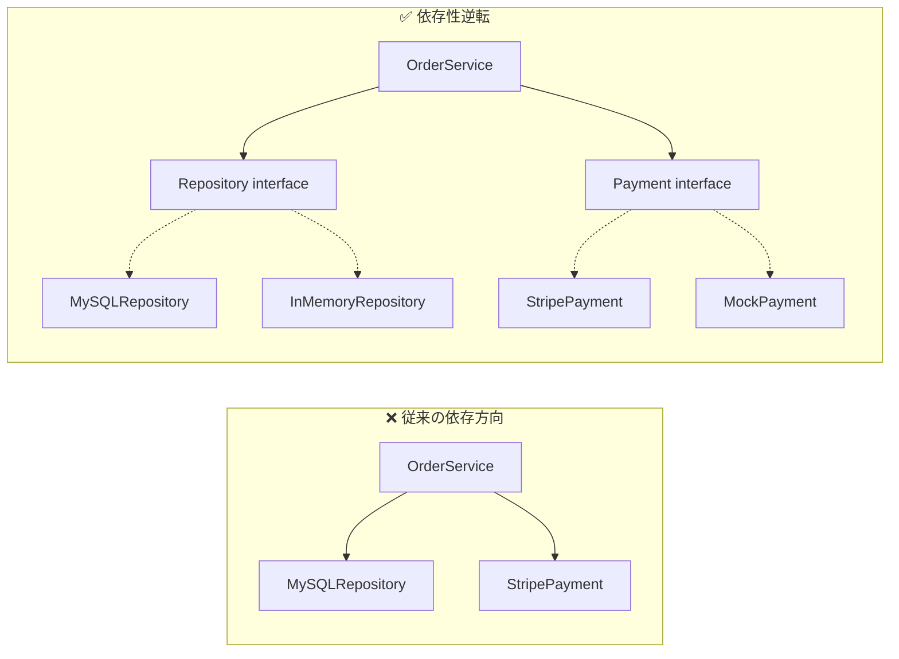
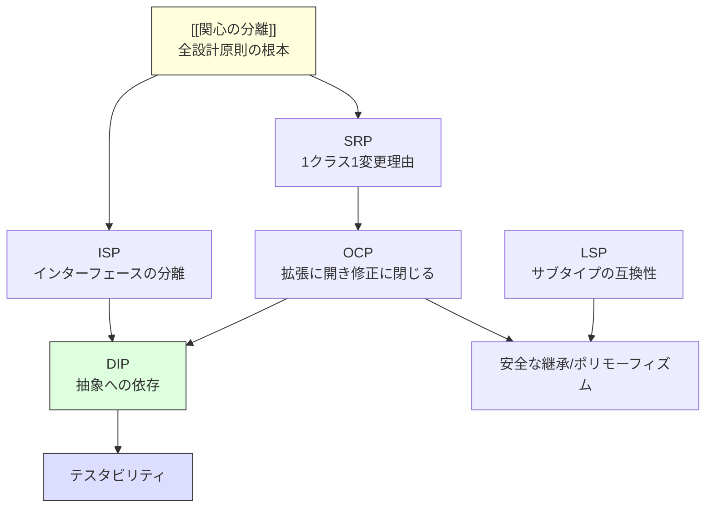

# SOLID原則

> **一言で言うと:** オブジェクト指向設計において、変更に強く拡張しやすいコードを書くための5つの原則。特に依存性逆転の原則（DIP）がモジュールの交換可能性とテスタビリティに直結する。

## なぜ必要か

コードは最初に書くときは誰でも動くものを作れる。問題は**2回目以降の変更**で起きる。

SOLID原則がなければ:

- **機能追加のたびに既存コードを修正する** — 新しい決済方法を追加するだけで決済処理全体のコードを書き換える必要がある。修正のたびにリグレッション（既存機能の破壊）リスクが発生する
- **1つの変更が想定外の箇所に波及する** — あるクラスが複数の責務を持っていると、1つの責務に対する変更が他の責務に影響する
- **テストが書けない/書いても意味がない** — 具体的な外部サービスに直接依存していると、そのサービスなしにはテストできない。モックもできない
- **コードの再利用ができない** — 不要な機能まで一緒についてくるので、部分的に使い回すことが不可能になる

SOLID原則は「動くコード」を「変更しやすいコード」に進化させるための指針である。

## どの問題を解決するか

SOLID は5つの原則の頭文字であり、それぞれが異なる設計上の問題を解決する。

### S — 単一責任原則（Single Responsibility Principle）

**問題:** 1つのクラスが複数の理由で変更される。ユーザー情報のバリデーション変更で、メール送信ロジックまで影響を受ける。

**解決:** 「クラスを変更する理由は1つだけであるべき」。これは[[関心の分離]]をクラスレベルで適用したもの。「責任」とは「変更の理由（Reason to Change）」のこと。

### O — 開放閉鎖原則（Open-Closed Principle）

**問題:** 新しい種類の処理を追加するたびに既存コードを修正する必要がある。if/else や switch 文が増殖していく。

**解決:** 「拡張に対して開いており、修正に対して閉じている」べき。[[ポリモーフィズムとストラテジーパターン]]で、既存コードを変更せずに新しい振る舞いを追加できる構造にする。

### L — リスコフの置換原則（Liskov Substitution Principle）

**問題:** 親クラスの代わりに子クラスを使うとプログラムが壊れる。`Square extends Rectangle` で `setWidth()` すると高さも変わってしまうような矛盾。

**解決:** 「サブタイプは、そのスーパータイプの契約を破ってはならない」。継承は「is-a」関係の表現だが、**振る舞いレベルで**互換性がなければ使ってはいけない。

### I — インターフェース分離原則（Interface Segregation Principle）

**問題:** 巨大なインターフェースを実装するクラスが、使わないメソッドまで実装を強制される。

**解決:** 「クライアントが使わないメソッドへの依存を強制してはならない」。大きなインターフェースを、利用者ごとに小さく分割する。

### D — 依存性逆転の原則（Dependency Inversion Principle）

**問題:** 上位モジュール（ビジネスロジック）が下位モジュール（DB、外部API）に直接依存しており、下位の変更が上位を破壊する。テスト時にも本物のDBや外部APIが必要になる。

**解決:** 「上位モジュールは下位モジュールに依存してはならない。両方とも抽象に依存すべき」。インターフェース（抽象）を間に挟むことで、依存の方向を逆転させる。



> 依存性逆転により、OrderService は抽象にのみ依存する。テスト時は InMemoryRepository や MockPayment に差し替え可能。

## 他の仕組みとどう関係するか

- **下位レイヤーとの関係:**
  - [[ルーティングとミドルウェア]] — ミドルウェアのチェーンは開放閉鎖原則の実践例。新しいミドルウェアを追加しても既存のミドルウェアを修正しない
  - [[コンポーネント設計]] — Reactのコンポーネント設計は単一責任原則の適用。Props による依存の注入はDIPのフロントエンド版
  - [[API設計-REST-GraphQL|API設計]] — APIの契約はインターフェース分離原則に通じる。クライアントが必要としないフィールドまで返さない（GraphQL はこの問題を直接解決する）

- **同レイヤーとの関係:**
  - [[関心の分離]] — SOLID原則はすべて関心の分離の具体化。SRP は「1クラス1関心」、ISP は「インターフェースレベルの関心分離」
  - [[テスト戦略]] — DIP によって依存を差し替え可能にすることが、ユニットテストの前提条件。SOLID に従ったコードはテストピラミッドの底辺を厚くできる
  - [[モノリスvsマイクロサービス]] — マイクロサービスの境界設計にもSOLID原則が適用される。サービス間のインターフェースはISP、サービスの責務分割はSRP
  - [[イベント駆動-CQRS]] — CQRSのコマンドとクエリの分離はISPの応用

- **上位レイヤーとの関係:**
  - 最上位レイヤーであるため直接の上位はないが、SOLID原則はチーム開発・コードレビューの共通言語として機能する

## 誤解されやすいポイント

### 1. 「単一責任 = 1つのことしかしない」ではない

SRP の「責任」は「機能」ではなく「変更の理由」を意味する。1つのクラスが複数のメソッドを持つのは問題ない。問題なのは、異なるステークホルダーや異なるビジネス上の理由でそのクラスが変更されること。例えば `Employee` クラスに「給与計算」と「レポート出力」があれば、経理部の要望とレポーティング部門の要望という2つの変更理由があるため SRP 違反。

### 2. 「開放閉鎖原則 = 既存コードは絶対に修正してはいけない」ではない

OCP はバグ修正や内部リファクタリングを禁止していない。禁止しているのは「新しい種類の振る舞いを追加するために、既存の分岐ロジックを修正すること」。全ての変化を事前に予測して抽象化するのは不可能であり、実際に変化が起きた箇所に対して適用する。

### 3. 「依存性逆転 = 依存性注入（DI）」と混同する

DIP は**原則**（依存の方向はどうあるべきか）であり、DI は**技法**（外部から依存を注入する）。DI は DIP を実現する手段の1つだが、[[DIコンテナ]]を使っていなくてもコンストラクタ引数で依存を受け取るだけで DIP は実現できる。逆に、DI コンテナを使っていても具体クラスを直接注入していれば DIP は達成されていない。

### 4. 「SOLIDを全てのコードに適用すべき」ではない

SOLID は**変更が予想されるコード**に対して最も効果を発揮する。使い捨てスクリプトや、変更されないことが確定している小さなプログラムに過剰に適用すると、コード量が増えて可読性が下がる。原則の適用は「ここは変わりそうか？」という判断とセットで行う。この「今必要ないものを先回りして作るな」という対の原則が[[YAGNI]]である。

## 設計のベストプラクティス

### 推奨パターン

**1. 変化の軸に沿って責務を分割する（SRP）**

「このコードが変わるのは、どんなときか？」を問う。変わる理由が2つ以上あれば、分割を検討する。

**2. ストラテジーパターンで振る舞いを拡張可能にする（OCP）**

条件分岐の増殖が見えたら、共通インターフェースを定義して[[ポリモーフィズムとストラテジーパターン|ストラテジー]]として差し替え可能にする。ただし、分岐が2つ以下のうちは早まらない。

**3. コンストラクタで依存を受け取る（DIP）**

クラス内部で `new` して具体クラスを生成するのではなく、コンストラクタの引数として受け取る。最もシンプルで効果的な DIP の実践。規模が大きくなったら[[DIコンテナ]]で自動化できる。

**4. 「テストできるか？」をリトマス試験にする**

ユニットテストが書きにくいコードは、たいてい SOLID 違反がある。テストのしにくさを設計の改善シグナルとして扱う。

### アンチパターン

**1. [[シングルトンパターン|シングルトン]]の乱用** — グローバルアクセスの便利さから `getInstance()` を多用すると、隠れた依存関係とテスト困難を招く。「インスタンスが1つ」の要件は DI コンテナのスコープ管理で実現すべき。

**2. インターフェース爆発** — 全てにインターフェースを定義し、1インターフェース1実装が大量発生。実装が1つしかないインターフェースは通常不要。

**3. 過剰な DI** — あらゆる細部まで注入可能にした結果、コンストラクタの引数が10個以上になる。これは SRP 違反のサイン（クラスの責務が多すぎる）。

**4. 継承の乱用** — 共通処理を親クラスに持たせる継承ヒエラルキーの深い設計。LSP 違反を招きやすい。[[コンポジションover継承]]の原則に従い、委譲を優先する。

## AIによる実装のアンチパターン

| アンチパターン | なぜ問題か | 対策 |
|---|---|---|
| 全クラスにインターフェースを自動生成 | 1実装1インターフェースの無意味な二重化。ファイル数が倍になり、変更箇所も倍になる | 交換可能性やテスト時の差し替えが必要な場合のみインターフェースを作る |
| Abstract Factory の過剰適用 | 単純なオブジェクト生成にファクトリ階層を構築。コード追跡が困難になる | `new` で十分な場合は `new` を使う。生成ロジックが複雑化した時点でファクトリを検討する |
| 全メソッドに try-catch を配置 | SRP に反してエラーハンドリングが全クラスに分散。エラーの握りつぶしも発生しやすい | エラーハンドリングの責務を専用のレイヤーに集約する |
| 依存注入のチェーンが深すぎる | A→B→C→D→E と5層以上の注入チェーン。1つの変更で全層に影響する | 本当に必要な依存のみ注入する。レイヤーの必要性を再検討する |

## 具体例

### SRP — 責務を分離する

```typescript
// ❌ 1つのクラスに「ユーザー永続化」と「メール送信」の責務が混在
class UserService {
  async register(data: UserInput) {
    const user = await db.users.create(data);
    await sendEmail(user.email, 'Welcome!', renderWelcomeTemplate(user));
    return user;
  }
}

// ✅ 責務ごとに分離
class UserService {
  constructor(private notifier: UserNotifier) {}

  async register(data: UserInput) {
    const user = await db.users.create(data);
    this.notifier.onRegistered(user); // 通知方法はUserServiceの関心外
    return user;
  }
}

class UserNotifier {
  async onRegistered(user: User) {
    await sendEmail(user.email, 'Welcome!', renderWelcomeTemplate(user));
  }
}
```

### OCP — 拡張に対して開く

```typescript
// ❌ 新しい割引タイプを追加するたびにこの関数を修正する必要がある
function calculateDiscount(type: string, amount: number): number {
  if (type === 'percentage') return amount * 0.1;
  if (type === 'fixed') return 100;
  if (type === 'seasonal') return amount * 0.2; // ← 追加のたびに修正
  return 0;
}

// ✅ 新しい割引はクラスを追加するだけ。既存コードは変更不要
interface DiscountStrategy {
  calculate(amount: number): number;
}

class PercentageDiscount implements DiscountStrategy {
  constructor(private rate: number) {}
  calculate(amount: number) { return amount * this.rate; }
}

class FixedDiscount implements DiscountStrategy {
  constructor(private value: number) {}
  calculate(_amount: number) { return this.value; }
}

// 使う側は DiscountStrategy にのみ依存
function applyDiscount(strategy: DiscountStrategy, amount: number): number {
  return amount - strategy.calculate(amount);
}
```

### DIP — 抽象に依存する

```php
// ❌ ビジネスロジックがStripeの具体実装に直接依存
class OrderService
{
    public function checkout(Order $order): void
    {
        $stripe = new \Stripe\StripeClient('sk_...');
        $stripe->paymentIntents->create([
            'amount' => $order->total,
            'currency' => 'jpy',
            'automatic_payment_methods' => ['enabled' => true],
        ]);
    }
}

// ✅ インターフェースに依存。実装は外部から注入
interface PaymentGateway
{
    public function charge(int $amount, string $currency): PaymentResult;
}

class StripeGateway implements PaymentGateway
{
    public function charge(int $amount, string $currency): PaymentResult
    {
        // Stripe固有の実装
    }
}

class OrderService
{
    public function __construct(private PaymentGateway $payment) {}

    public function checkout(Order $order): void
    {
        $this->payment->charge($order->total, 'jpy');
    }
}

// テスト時:
$service = new OrderService(new FakeGateway());
// 本番:
$service = new OrderService(new StripeGateway());
```

### SOLID原則の関係性



## 参考リソース

- *Clean Architecture* — Robert C. Martin（SOLID原則の提唱者による設計論の集大成）
- *Agile Software Development, Principles, Patterns, and Practices* — Robert C. Martin（SOLID原則の原典。各原則の詳細な動機と例）
- *Head First Design Patterns* — Eric Freeman 他（OCP・DIP を実現するデザインパターンを図解で解説）
- *A Philosophy of Software Design* — John Ousterhout（SOLIDとは異なる視点で「複雑さの管理」を論じる。対比として有用）

## 学習メモ

- SOLID は5原則を暗記するものではなく、「変更のコストを下げるにはどうすればよいか」という問いに対する5つの切り口
- 実務で最もインパクトが大きいのは DIP。テストを書く習慣がつくと、自然と DIP に向かうことが多い
- SOLID の過剰適用は「コードの追跡困難」「ファイル爆発」を招く。適用すべき場所は「変更が頻繁に起きるか、将来起きることが確実な箇所」
