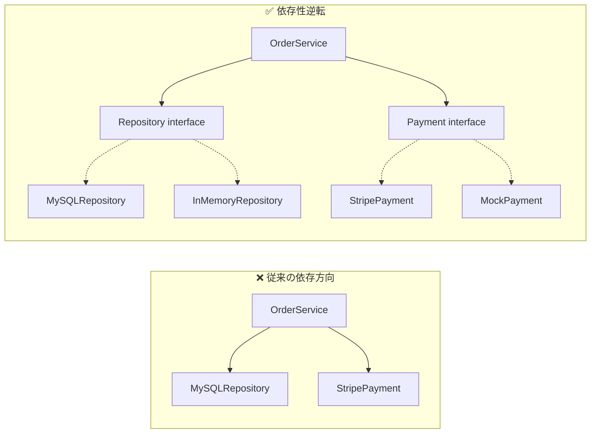
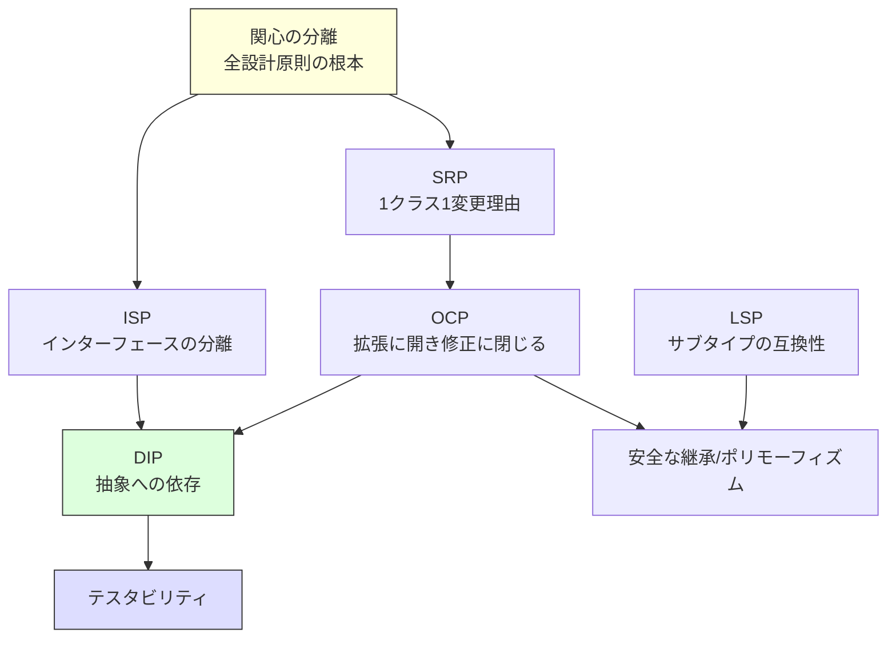

# SOLID原則

> **一言で言うと:** オブジェクト指向設計において、変更に強く拡張しやすいコードを書くための5つの原則。特に依存性逆転の原則（DIP）がモジュールの交換可能性とテスタビリティに直結する。

## 3分で全体像

- **何を解決する技術か:** 「機能追加のたびに既存コードを修正する」「1 つの変更が想定外の箇所に波及する」「テストが書けない」というオブジェクト指向設計の慢性的な痛みを、5 つの原則で構造的に止める
- **代表的な使用シーン:** ビジネスロジックを持つクラス設計、フレームワーク / SDK のインターフェース定義、テスタブルな依存注入、ストラテジーパターンによる拡張点の設計、マイクロサービス境界の責務分割、ドメインモデルの分離
- **これだけは覚える3つ:**
    1. **5 つの中で実務インパクトが最大なのは DIP（依存性逆転）** — 上位モジュール（ビジネスロジック）が下位モジュール（DB / 外部 API）に直接 `new` するのではなく、**インターフェース（抽象）を間に挟む**ことで、テスト時に Fake / Mock に差し替え可能になる。SOLID を 1 つだけ覚えるなら DIP
    2. **「責任」=「変更の理由」** — SRP の「単一責任」は「機能が 1 つ」ではなく「**変更を要求するステークホルダーが 1 種類**」という意味。1 クラスに複数メソッドがあっても、変更動機が同じなら SRP 違反ではない
    3. **OCP は「全変更を予測して抽象化せよ」ではない** — 「拡張に開き修正に閉じる」は**変化が実際に起きた箇所**に適用する後付けルール。投機的に全クラスをインターフェース化するのは [[YAGNI]] 違反であり、コード追跡を困難にする
- **AIに任せやすいか:** **一部任せられる** — DIP のためのコンストラクタ注入 / ストラテジーパターンの実装は AI が定型化できる。一方で **「今 SOLID を適用すべきか、まだ早いか」** **「どの軸で SRP を割るか」** はビジネス文脈と将来予測に依存し人間判断が要る。AI は **インターフェース爆発 / 1 実装 1 インターフェース / Abstract Factory の過剰適用** に常にバイアスがあり、**生成コード中の `interface XxxService { ... }` の本数は必ず疑う**
- **詰まったらここを読む:** [[関心の分離]] / [[テスト戦略]] / [[ポリモーフィズムとストラテジーパターン]]

## なぜ必要か

コードは最初に書くときは誰でも動くものを作れる。問題は**2回目以降の変更**で起きる。

SOLID原則がなければ:

- **機能追加のたびに既存コードを修正する** — 新しい決済方法を追加するだけで決済処理全体のコードを書き換える必要がある。修正のたびにリグレッション（既存機能の破壊）リスクが発生する
- **1つの変更が想定外の箇所に波及する** — あるクラスが複数の責務を持っていると、1つの責務に対する変更が他の責務に影響する
- **テストが書けない/書いても意味がない** — 具体的な外部サービスに直接依存していると、そのサービスなしにはテストできない。モックもできない
- **コードの再利用ができない** — 不要な機能まで一緒についてくるので、部分的に使い回すことが不可能になる

SOLID原則は「動くコード」を「変更しやすいコード」に進化させるための指針である。

## どの問題を解決するか

SOLID は5つの原則の頭文字であり、それぞれが異なる設計上の問題を解決する。

### S — 単一責任原則（Single Responsibility Principle）

**問題:** 1つのクラスが複数の理由で変更される。ユーザー情報のバリデーション変更で、メール送信ロジックまで影響を受ける。

**解決:** 「クラスを変更する理由は1つだけであるべき」。これは[[関心の分離]]をクラスレベルで適用したもの。「責任」とは「変更の理由（Reason to Change）」のこと。

### O — 開放閉鎖原則（Open-Closed Principle）

**問題:** 新しい種類の処理を追加するたびに既存コードを修正する必要がある。if/else や switch 文が増殖していく。

**解決:** 「拡張に対して開いており、修正に対して閉じている」べき。[[ポリモーフィズムとストラテジーパターン]]で、既存コードを変更せずに新しい振る舞いを追加できる構造にする。

### L — リスコフの置換原則（Liskov Substitution Principle）

**問題:** 親クラスの代わりに子クラスを使うとプログラムが壊れる。`Square extends Rectangle` で `setWidth()` すると高さも変わってしまうような矛盾。

**解決:** 「サブタイプは、そのスーパータイプの契約を破ってはならない」。継承は「is-a」関係の表現だが、**振る舞いレベルで**互換性がなければ使ってはいけない。

### I — インターフェース分離原則（Interface Segregation Principle）

**問題:** 巨大なインターフェースを実装するクラスが、使わないメソッドまで実装を強制される。

**解決:** 「クライアントが使わないメソッドへの依存を強制してはならない」。大きなインターフェースを、利用者ごとに小さく分割する。

### D — 依存性逆転の原則（Dependency Inversion Principle）

**問題:** 上位モジュール（ビジネスロジック）が下位モジュール（DB、外部API）に直接依存しており、下位の変更が上位を破壊する。テスト時にも本物のDBや外部APIが必要になる。

**解決:** 「上位モジュールは下位モジュールに依存してはならない。両方とも抽象に依存すべき」。インターフェース（抽象）を間に挟むことで、依存の方向を逆転させる。


```mermaid
graph LR
    subgraph "❌ 従来の依存方向"
        A1[OrderService] --> B1[MySQLRepository]
        A1 --> C1[StripePayment]
    end

    subgraph "✅ 依存性逆転"
        A2[OrderService] --> I1[Repository interface]
        A2 --> I2[Payment interface]
        I1 -.-> B2[MySQLRepository]
        I1 -.-> B3[InMemoryRepository]
        I2 -.-> C2[StripePayment]
        I2 -.-> C3[MockPayment]
    end
```

> 依存性逆転により、OrderService は抽象にのみ依存する。テスト時は InMemoryRepository や MockPayment に差し替え可能。

## 他の仕組みとどう関係するか

- **下位レイヤーとの関係:**
  - [[ルーティングとミドルウェア]] — ミドルウェアのチェーンは開放閉鎖原則の実践例。新しいミドルウェアを追加しても既存のミドルウェアを修正しない
  - [[コンポーネント設計]] — Reactのコンポーネント設計は単一責任原則の適用。Props による依存の注入はDIPのフロントエンド版
  - [[API設計-REST-GraphQL|API設計]] — APIの契約はインターフェース分離原則に通じる。クライアントが必要としないフィールドまで返さない（GraphQL はこの問題を直接解決する）

- **同レイヤーとの関係:**
  - [[関心の分離]] — SOLID原則はすべて関心の分離の具体化。SRP は「1クラス1関心」、ISP は「インターフェースレベルの関心分離」
  - [[テスト戦略]] — DIP によって依存を差し替え可能にすることが、ユニットテストの前提条件。SOLID に従ったコードはテストピラミッドの底辺を厚くできる
  - [[モノリスvsマイクロサービス]] — マイクロサービスの境界設計にもSOLID原則が適用される。サービス間のインターフェースはISP、サービスの責務分割はSRP
  - [[イベント駆動-CQRS]] — CQRSのコマンドとクエリの分離はISPの応用

- **上位レイヤーとの関係:**
  - 最上位レイヤーであるため直接の上位はないが、SOLID原則はチーム開発・コードレビューの共通言語として機能する

## 誤解されやすいポイント

### 1. 「単一責任 = 1つのことしかしない」ではない

SRP の「責任」は「機能」ではなく「変更の理由」を意味する。1つのクラスが複数のメソッドを持つのは問題ない。問題なのは、異なるステークホルダーや異なるビジネス上の理由でそのクラスが変更されること。例えば `Employee` クラスに「給与計算」と「レポート出力」があれば、経理部の要望とレポーティング部門の要望という2つの変更理由があるため SRP 違反。

### 2. 「開放閉鎖原則 = 既存コードは絶対に修正してはいけない」ではない

OCP はバグ修正や内部リファクタリングを禁止していない。禁止しているのは「新しい種類の振る舞いを追加するために、既存の分岐ロジックを修正すること」。全ての変化を事前に予測して抽象化するのは不可能であり、実際に変化が起きた箇所に対して適用する。

### 3. 「依存性逆転 = 依存性注入（DI）」と混同する

DIP は**原則**（依存の方向はどうあるべきか）であり、DI は**技法**（外部から依存を注入する）。DI は DIP を実現する手段の1つだが、[[DIコンテナ]]を使っていなくてもコンストラクタ引数で依存を受け取るだけで DIP は実現できる。逆に、DI コンテナを使っていても具体クラスを直接注入していれば DIP は達成されていない。

### 4. 「SOLIDを全てのコードに適用すべき」ではない

SOLID は**変更が予想されるコード**に対して最も効果を発揮する。使い捨てスクリプトや、変更されないことが確定している小さなプログラムに過剰に適用すると、コード量が増えて可読性が下がる。原則の適用は「ここは変わりそうか？」という判断とセットで行う。この「今必要ないものを先回りして作るな」という対の原則が[[YAGNI]]である。

## 設計のベストプラクティス

### 推奨パターン

**1. 変化の軸に沿って責務を分割する（SRP）**

「このコードが変わるのは、どんなときか？」を問う。変わる理由が2つ以上あれば、分割を検討する。

**2. ストラテジーパターンで振る舞いを拡張可能にする（OCP）**

条件分岐の増殖が見えたら、共通インターフェースを定義して[[ポリモーフィズムとストラテジーパターン|ストラテジー]]として差し替え可能にする。ただし、分岐が2つ以下のうちは早まらない。

**3. コンストラクタで依存を受け取る（DIP）**

クラス内部で `new` して具体クラスを生成するのではなく、コンストラクタの引数として受け取る。最もシンプルで効果的な DIP の実践。規模が大きくなったら[[DIコンテナ]]で自動化できる。

**4. 「テストできるか？」をリトマス試験にする**

ユニットテストが書きにくいコードは、たいてい SOLID 違反がある。テストのしにくさを設計の改善シグナルとして扱う。

### アンチパターン

**1. [[シングルトンパターン|シングルトン]]の乱用** — グローバルアクセスの便利さから `getInstance()` を多用すると、隠れた依存関係とテスト困難を招く。「インスタンスが1つ」の要件は DI コンテナのスコープ管理で実現すべき。

**2. インターフェース爆発** — 全てにインターフェースを定義し、1インターフェース1実装が大量発生。実装が1つしかないインターフェースは通常不要。

**3. 過剰な DI** — あらゆる細部まで注入可能にした結果、コンストラクタの引数が10個以上になる。これは SRP 違反のサイン（クラスの責務が多すぎる）。

**4. 継承の乱用** — 共通処理を親クラスに持たせる継承ヒエラルキーの深い設計。LSP 違反を招きやすい。[[コンポジションover継承]]の原則に従い、委譲を優先する。

## AIエージェントとの協働

> このトピックでAIコーディングエージェント（Claude Code, Copilot, Cursor 等）と協働するための観点。
> **「AIに何をどこまで任せ、AIに何をレビューさせ、人間は何を最終判断するか」**を整理する。実装だけでなく**レビューもAIに任せられる**前提で考える（AIコードレビュー観点で横断アンチパターン照合を行う）。

### AIに任せられる部分 / 人間が判断すべき部分

| タスク種類 | 任せ方（実装/レビュー） | 人間の関与 |
|---|---|---|
| DIP のコンストラクタ注入実装 | **実装もレビューも AI 主導** — TypeScript / PHP / Python / Go の DI パターンは AI が高品質に書ける | 「この依存は本当に注入するに値するか」（テストで差し替えるか / 環境別に切り替わるか）の判断 |
| ストラテジーパターンによる OCP 実現 | **実装は AI 主導** — 既存の `if/else` 増殖を見つけてストラテジー化する変換は定型 | **適用するか保留するかの判断は人間** — 分岐がまだ 2 つなら早すぎる |
| Liskov 置換違反の検出 | **AI レビュー有効** — `Square extends Rectangle` の典型違反パターンをAIコードレビュー観点で照合できる | 業務ドメインで「is-a」関係を満たすかの判断（鳥クラスとペンギンの飛行など） |
| インターフェースの粒度設計（ISP） | **AI に複数案** — 「`Repository` を `ReadRepository` / `WriteRepository` に分けるか」など複数案を生成させて比較 | **人間が最終判断** — クライアントの実際の利用パターンに依存。AI は分割優先のバイアスがある |
| 「今 SOLID を適用すべきか」の判断 | **AI には任せない** — AI は機械的に SOLID 適用を提案する傾向 | **完全に人間判断** — 変更頻度・将来予定・チームの理解度を踏まえる。使い捨てスクリプトには適用しない |
| インターフェース・抽象クラスの新規生成 | **AI に作らせない方針で運用** — プロンプトに「**実装が 1 つしかないインターフェースは作らない**」を明記 | レビュー時に **「`interface Xxx` の名前と実装クラス名が `XxxImpl` / 1 対 1 になっていないか」** を必ずチェック |

### AI生成コードのレビュー観点（このトピック固有）

AI生成物を受け取ったとき、最低限ここを見る。

1. **インターフェース爆発になっていないか** — 1 実装 1 インターフェース、命名が `UserService` / `UserServiceImpl` のような無意味な二重化。**実装が 1 つしかない時点で削除候補**。テストでモックする予定がなく、環境別に差し替えもしないなら不要
2. **DIP の方向が正しいか** — 上位モジュールが下位モジュールの**具体クラス**を import / `new` している箇所がないか。`new StripeClient()` を Service 内部で生成しているなら DIP 違反。**コンストラクタ引数 or DI コンテナ**で受け取るよう変更
3. **SRP の「責任」を機能数で誤解していないか** — AI は「メソッドが多いから分割しよう」と提案するが、**変更動機が同じなら分割しない**。逆に 1 メソッドのクラスでも、内部で複数の変更動機（バリデーション + DB 更新 + 通知）を抱えていれば分割対象

### 効くプロンプトの型

このトピックに関する実装をAIに依頼するとき、コンテキストとして渡すべき情報・制約・成功基準のテンプレ。

```
# 前提（プロジェクトの状況・既存のコード規約）
- 既存の DI 方針: コンストラクタ注入のみ（DI コンテナは未導入）
- 既存パターン: 外部依存（DB / 決済 / メール）はインターフェース、内部のドメインサービスは具象クラス直接使用
- テスト方針: ユニットテストは Fake 実装で差し替え、外部 API 呼び出しはユニットテストで一切行わない

# やってほしいこと
- 注文確定処理に決済機能を追加。本番は Stripe、テストでは Fake を使う

# 守ってほしい制約（このトピック固有のもの）
- DIP: 決済処理はインターフェース `PaymentGateway` で抽象化し、Service はそれにのみ依存する
- SRP: 「決済処理」と「決済結果のドメイン保存」は別クラスに分離
- ISP: PaymentGateway には今回必要な `charge()` のみ定義。返金 / 履歴取得は将来必要になった時点で別インターフェースを切る
- YAGNI: 「将来の拡張」のためにインターフェースを増やさない。実装が 1 つしかない箇所はインターフェース化しない

# 完了の判断基準
- OrderService が `new StripeClient()` をコード内で書いていない
- Stripe をモックせずに、`FakeGateway` を注入してユニットテストが書ける
- インターフェースは PaymentGateway 1 つのみ（他のドメインクラスはそのまま）
```

### AI実装のアンチパターン

LLM生成コードで頻出する過剰設計・誤用パターン。レビュー時の照合表として使う。

| アンチパターン | なぜ問題か | レビュー観点 / 対策 |
|---|---|---|
| 全クラスにインターフェースを自動生成 | 1実装1インターフェースの無意味な二重化。ファイル数が倍になり、変更箇所も倍になる | 交換可能性やテスト時の差し替えが必要な場合のみインターフェースを作る。命名が `XxxImpl` パターンなら削除候補 |
| Abstract Factory の過剰適用 | 単純なオブジェクト生成にファクトリ階層を構築。コード追跡が困難になる | `new` で十分な場合は `new` を使う。生成ロジックが複雑化した時点でファクトリを検討する |
| 全メソッドに try-catch を配置 | SRP に反してエラーハンドリングが全クラスに分散。エラーの握りつぶしも発生しやすい | エラーハンドリングの責務を専用のレイヤーに集約する。Controller / ミドルウェアで一元処理 |
| 依存注入のチェーンが深すぎる | A→B→C→D→E と5層以上の注入チェーン。1つの変更で全層に影響する | 本当に必要な依存のみ注入する。レイヤーの必要性を再検討する。中間層が単なるパススルーなら削除 |
| 上位モジュール内での `new` 直書き | DIP 違反。具体クラスへの依存が温存され、テストでモック差し替え不能 | コンストラクタ引数で受け取る。インターフェースに依存する |
| 巨大な Repository インターフェース | `find` `save` `delete` `bulkUpdate` `softDelete` `archive` ... を 1 つのインターフェースに詰め込み、ISP 違反 | 利用者ごとに必要メソッドを分離（例: `UserReader` / `UserWriter`） |
| シングルトン乱用での隠れ依存 | `getInstance()` でグローバルアクセスし、コンストラクタに現れない隠れた依存を生む | DI コンテナのスコープ管理で「インスタンスが 1 つ」の要件を実現する |
| 継承による共通化（LSP 違反予備軍） | `Animal extends LivingThing extends ...` の深い継承で、`fly()` を持たない子クラスが NotImplementedError を投げる | 継承より委譲（コンポジション）を優先する |

→ レイヤー横断のアンチパターン索引: [[_anti-patterns/_index|AIアンチパターン索引]]

## 具体例

### SRP — 責務を分離する

```typescript
// ❌ 1つのクラスに「ユーザー永続化」と「メール送信」の責務が混在
class UserService {
  async register(data: UserInput) {
    const user = await db.users.create(data);
    await sendEmail(user.email, 'Welcome!', renderWelcomeTemplate(user));
    return user;
  }
}

// ✅ 責務ごとに分離
class UserService {
  constructor(private notifier: UserNotifier) {}

  async register(data: UserInput) {
    const user = await db.users.create(data);
    this.notifier.onRegistered(user); // 通知方法はUserServiceの関心外
    return user;
  }
}

class UserNotifier {
  async onRegistered(user: User) {
    await sendEmail(user.email, 'Welcome!', renderWelcomeTemplate(user));
  }
}
```

### OCP — 拡張に対して開く

```typescript
// ❌ 新しい割引タイプを追加するたびにこの関数を修正する必要がある
function calculateDiscount(type: string, amount: number): number {
  if (type === 'percentage') return amount * 0.1;
  if (type === 'fixed') return 100;
  if (type === 'seasonal') return amount * 0.2; // ← 追加のたびに修正
  return 0;
}

// ✅ 新しい割引はクラスを追加するだけ。既存コードは変更不要
interface DiscountStrategy {
  calculate(amount: number): number;
}

class PercentageDiscount implements DiscountStrategy {
  constructor(private rate: number) {}
  calculate(amount: number) { return amount * this.rate; }
}

class FixedDiscount implements DiscountStrategy {
  constructor(private value: number) {}
  calculate(_amount: number) { return this.value; }
}

// 使う側は DiscountStrategy にのみ依存
function applyDiscount(strategy: DiscountStrategy, amount: number): number {
  return amount - strategy.calculate(amount);
}
```

### DIP — 抽象に依存する

```php
// ❌ ビジネスロジックがStripeの具体実装に直接依存
class OrderService
{
    public function checkout(Order $order): void
    {
        $stripe = new \Stripe\StripeClient('sk_...');
        $stripe->paymentIntents->create([
            'amount' => $order->total,
            'currency' => 'jpy',
            'automatic_payment_methods' => ['enabled' => true],
        ]);
    }
}

// ✅ インターフェースに依存。実装は外部から注入
interface PaymentGateway
{
    public function charge(int $amount, string $currency): PaymentResult;
}

class StripeGateway implements PaymentGateway
{
    public function charge(int $amount, string $currency): PaymentResult
    {
        // Stripe固有の実装
    }
}

class OrderService
{
    public function __construct(private PaymentGateway $payment) {}

    public function checkout(Order $order): void
    {
        $this->payment->charge($order->total, 'jpy');
    }
}

// テスト時:
$service = new OrderService(new FakeGateway());
// 本番:
$service = new OrderService(new StripeGateway());
```

### DIP — Go のインターフェースによる暗黙的な依存性逆転

Go では `implements` キーワードなしに、メソッドセットが一致すれば自動的にインターフェースを満たす（暗黙的実装）。これにより、インターフェースを**利用側が定義する**のが自然になり、DIP が言語レベルで促進される。

```go
package order

import "context"

// 利用側（上位モジュール）がインターフェースを定義する
// 実装側のパッケージを import する必要がない
type PaymentGateway interface {
	Charge(ctx context.Context, amount int, currency string) error
}

type OrderService struct {
	payment PaymentGateway
}

func NewOrderService(pg PaymentGateway) *OrderService {
	return &OrderService{payment: pg}
}

func (s *OrderService) Checkout(ctx context.Context, total int) error {
	return s.payment.Charge(ctx, total, "jpy")
}
```

```go
package stripe

import "context"

// stripe パッケージは order.PaymentGateway を知らない
// メソッドシグネチャが一致するだけで自動的にインターフェースを満たす
type Client struct {
	apiKey string
}

func NewClient(apiKey string) *Client {
	return &Client{apiKey: apiKey}
}

func (c *Client) Charge(ctx context.Context, amount int, currency string) error {
	// Stripe固有の実装
	return nil
}
```

### DIP — Python の Protocol による構造的部分型

Python 3.8+ の `Protocol` を使うと、Go と同様に暗黙的なインターフェース準拠を型チェッカーで検証できる。

```python
from typing import Protocol

# 利用側が Protocol（インターフェース）を定義
class PaymentGateway(Protocol):
    def charge(self, amount: int, currency: str) -> None: ...

class OrderService:
    def __init__(self, payment: PaymentGateway) -> None:
        self._payment = payment

    def checkout(self, total: int) -> None:
        self._payment.charge(total, "jpy")

# 実装側は Protocol を明示的に継承しなくてよい
# charge(int, str) -> None を持っていれば型チェックを通過する
class StripeGateway:
    def __init__(self, api_key: str) -> None:
        self._api_key = api_key

    def charge(self, amount: int, currency: str) -> None:
        ...  # Stripe固有の実装

class FakeGateway:
    def __init__(self) -> None:
        self.charges: list[tuple[int, str]] = []

    def charge(self, amount: int, currency: str) -> None:
        self.charges.append((amount, currency))

# テスト時: OrderService(FakeGateway())
# 本番:     OrderService(StripeGateway("sk_..."))
```

### SOLID原則の関係性


```mermaid
graph TD
    SoC["関心の分離<br/>全設計原則の根本"]
    SRP["SRP<br/>1クラス1変更理由"]
    OCP["OCP<br/>拡張に開き修正に閉じる"]
    LSP["LSP<br/>サブタイプの互換性"]
    ISP["ISP<br/>インターフェースの分離"]
    DIP["DIP<br/>抽象への依存"]

    SoC --> SRP
    SoC --> ISP
    SRP --> OCP
    OCP --> DIP
    ISP --> DIP
    DIP --> TEST["テスタビリティ"]
    LSP --> INHERIT["安全な継承/ポリモーフィズム"]
    OCP --> INHERIT

    style SoC fill:#ffd,stroke:#333
    style DIP fill:#dfd,stroke:#333
    style TEST fill:#ddf,stroke:#333
```

> 図中の「関心の分離」は [[関心の分離]] トピックを指す。SOLID 全原則の根本にある考え方。

## 参考リソース

- *Clean Architecture* — Robert C. Martin（SOLID原則の提唱者による設計論の集大成）
- *Agile Software Development, Principles, Patterns, and Practices* — Robert C. Martin（SOLID原則の原典。各原則の詳細な動機と例）
- *Head First Design Patterns* — Eric Freeman 他（OCP・DIP を実現するデザインパターンを図解で解説）
- *A Philosophy of Software Design* — John Ousterhout（SOLIDとは異なる視点で「複雑さの管理」を論じる。対比として有用）

## 理解度セルフチェック

> 答えられなければ本文に戻る。答えはこのファイル内に必ずある。

1. SOLID 原則のうち、実務で最もインパクトが大きいのはどの原則か？その理由を「テスタビリティ」と「変更コスト」の観点から 30 秒で説明してみよう
2. 「`Square extends Rectangle`」は LSP 違反の典型例とされる。なぜ違反になるか、`Rectangle` の `setWidth()` を継承した `Square` が実際にどんな振る舞いの矛盾を起こすかを具体的に説明せよ
3. AI が次のコードを生成した。SOLID の観点でどの原則に違反しているか、また「`OrderServiceImpl` を残しつつ `OrderService` インターフェースを削除すべきか保持すべきか」をどう判断すべきか答えよ
   ```typescript
   // 唯一の実装が OrderServiceImpl のみ、テストでもモックしない
   interface OrderService {
     placeOrder(userId: string, items: Item[]): Promise<Order>;
   }

   class OrderServiceImpl implements OrderService {
     constructor(
       private db: Database,
     ) {}

     async placeOrder(userId: string, items: Item[]): Promise<Order> {
       const order = new Order(userId, items);  // 内部で具体クラスを new
       await this.db.query('INSERT INTO orders ...');  // SQL 直書き
       return order;
     }
   }
   ```

> [!note]- 解答の指針
>
> > [!info] 用語ミニ辞典
> > - **DIP（Dependency Inversion Principle / 依存性逆転の原則）**: 上位モジュール（ビジネスロジック）が下位モジュール（DB / 外部 API）の具体実装に依存せず、両者が**抽象（インターフェース）**に依存するという原則。これによりテストでモックや Fake に差し替え可能になる
> > - **DI（Dependency Injection / 依存性注入）**: 依存オブジェクトを外部から渡す**実装技法**。コンストラクタ引数で受け取るのが最もシンプル。DIP は「原則」、DI は「手段」で別概念
> > - **LSP（Liskov Substitution Principle / リスコフの置換原則）**: 子クラスは親クラスの代わりにどこでも使えるべき、という原則。型システム上の `is-a` 関係だけでなく、**振る舞い（事前条件・事後条件・不変条件）**の互換性が必要
> > - **テスタビリティ**: コードがどれだけテストしやすいか。外部依存（DB / API）を差し替え可能にできることがほぼ同義
> > - **モック / Fake / Stub**: テスト用の代替実装。Mock は呼び出し検証用、Fake は本物に近い簡易実装、Stub は固定値を返すだけ
> > - **YAGNI（You Aren't Gonna Need It）**: 「今いらないものは作るな」原則。SOLID の過剰適用を抑制する対の原則
>
> 1. **DIP（依存性逆転の原則）**。理由は 2 つ:
>
>    - **テスタビリティ**: ビジネスロジックが具体クラス（DB / Stripe / メールサーバー）を直接 `new` していると、テストで本物の外部サービスを起動する必要がある。DIP に従いインターフェース経由にすれば、テストでは Fake 実装を注入してミリ秒で完結するユニットテストが書ける。これは [[テスト戦略]] の前提条件
>    - **変更コスト**: 外部サービスを切り替える（Stripe → Square、MySQL → PostgreSQL など）際、DIP に従っていれば新しい実装クラスを追加して DI 設定を 1 行変えるだけ。直接依存だと該当箇所を全箇所書き換える必要があり、変更が機能横断のショットガン手術になる
>
>    実務的には DIP は他の SOLID 原則（SRP / OCP / ISP）の**実現手段**としても機能する。例えば SRP で分離したクラス同士をインターフェースで結ぶことで初めて分離が完了する
>
> 2. `Rectangle` には「縦と横を独立に設定できる」という暗黙の**不変条件**がある。`setWidth(5)` を呼んだら `width=5` になり `height` は変わらない、という事後条件。
>
>    `Square extends Rectangle` で `setWidth(5)` を「正方形を保つため」`height=5` も同時に変える実装にすると、**親クラスの事後条件を破る**。すると、`Rectangle` を引数に取る関数:
>    ```typescript
>    function setSize(r: Rectangle, w: number, h: number) {
>      r.setWidth(w);   // height は変わらないはず
>      r.setHeight(h);  // width は変わらないはず
>      assert(r.width * r.height === w * h);  // ← Square を渡すと失敗
>    }
>    ```
>    に `Square` を渡すと、`setWidth(5)` で height も 5 になり、その後 `setHeight(3)` で width も 3 になるため、結果が `3*3=9` で `5*3=15` を期待する assertion を破る。
>
>    **本質**: 数学的には正方形は長方形だが、**振る舞い（mutable な setter の挙動）**では互換性がない。`is-a` 関係だけで継承を判断すると LSP 違反を埋め込む。**解決**: 不変な `Shape` インターフェースに `area()` だけを定義するか、`Square` は `Rectangle` を継承せず独立クラスにする
>
> 3. **違反している原則は DIP**。`OrderServiceImpl` の内部で:
>    - `new Order(...)` で具体クラスを直接生成している
>    - `this.db.query('INSERT INTO orders ...')` で SQL を直書きしており、Repository 層への抽象化がない
>
>    `Database` を注入しているのは DIP の方向だが、**SQL を Service 内に書く時点で**「永続化方式の変更」が Service の修正を強制する状態になっており、DIP の効果が打ち消されている。Repository インターフェースを介すべき。
>
>    **`OrderService` インターフェース削除の判断**: **削除すべき**。理由:
>    - 実装が `OrderServiceImpl` 1 つのみ（**インターフェース爆発**の典型）
>    - テストでモックしない方針なら差し替えポイントとして不要
>    - 命名 `XxxImpl` は AI 生成インターフェースの典型シグナル
>
>    **保持判断のための条件**: 「**今**」または「**確定済みの近い将来**」、別実装に差し替える計画があるか（例: 既存システムからの段階移行で `LegacyOrderService` も並行稼働させる、A/B テストで実装を切り替える等）。投機的な「**いつか別実装になるかも**」は YAGNI 違反であり、削除すべき。
>
>    **思考プロセス**: SOLID は「適用すれば良い」のではなく「**変更が起きる場所に適用する**」原則。AI は機械的に全箇所に適用するため、人間は「**今この抽象化が変更コストを下げているか**」を毎回問う必要がある

## 学習メモ

- SOLID は5原則を暗記するものではなく、「変更のコストを下げるにはどうすればよいか」という問いに対する5つの切り口
- 実務で最もインパクトが大きいのは DIP。テストを書く習慣がつくと、自然と DIP に向かうことが多い
- SOLID の過剰適用は「コードの追跡困難」「ファイル爆発」を招く。適用すべき場所は「変更が頻繁に起きるか、将来起きることが確実な箇所」
