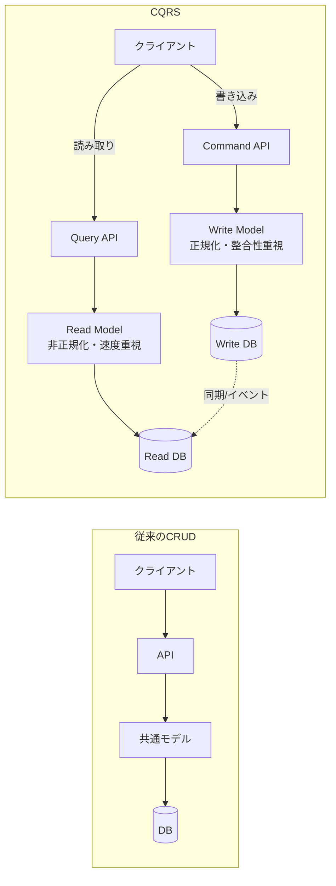
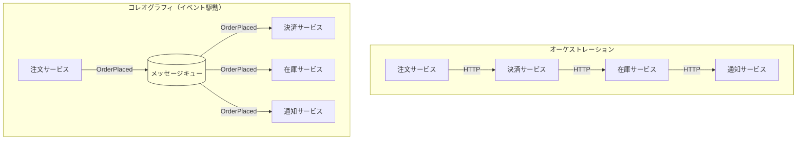
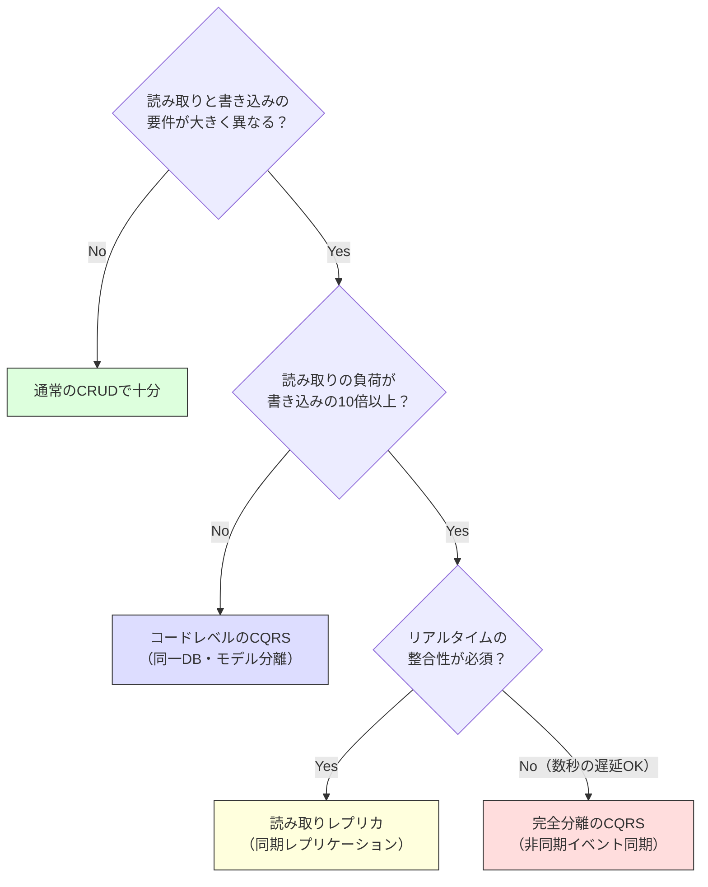

# イベント駆動 / CQRS

> **一言で言うと:** 読み取りと書き込みで最適なモデルが異なるという認識から生まれたアーキテクチャパターン。大規模システムでの「読み書きの非対称性」を解決する。

## なぜ必要か

従来のCRUDアーキテクチャでは、読み取り（Query）と書き込み（Command）が同じデータモデル・同じDB・同じAPIを共有する。小規模では問題ないが、システムが成長すると:

- **読み取りと書き込みの要件が衝突する** — 書き込みは正規化されたデータ構造（整合性優先）が最適だが、読み取りは非正規化されたデータ構造（パフォーマンス優先）が最適。1つのモデルで両方を満たそうとすると、どちらも中途半端になる
- **スケーリングの方向が異なる** — 多くのWebアプリケーションでは読み取りが書き込みの10〜100倍以上。読み取りだけスケールアウトしたいのに、書き込みモデルと結合しているためそれができない
- **処理の連鎖が同期的になる** — 「注文が確定したらメール送信・在庫更新・ポイント付与」を全て同期的に処理すると、レスポンスが遅くなり、1つの処理の失敗が全体を巻き戻す
- **システム間の結合が密になる** — サービスAがサービスBのAPIを直接呼び出す設計では、Bの変更がAを壊す。サービスの数が増えるほど結合の複雑さが爆発する

## どの問題を解決するか

### CQRS（Command Query Responsibility Segregation）

**問題:** 1つのモデルで読み取りと書き込みの両方を担当すると、クエリの最適化が書き込みロジックを複雑にし、書き込みの正規化が読み取りパフォーマンスを犠牲にする。

**解決方法:** コマンド（書き込み）とクエリ（読み取り）のモデルを分離する。



CQRSには段階がある:
1. **コード内の分離** — 同じDBだがコマンドとクエリで異なるモデル/クラスを使う（最小構成）
2. **DB読み取りレプリカ** — 書き込みはプライマリ、読み取りはレプリカへ
3. **完全分離** — 書き込みDBと読み取りDB（物理的に異なるDB製品も可）をイベントで同期

### イベント駆動アーキテクチャ（Event-Driven Architecture）

**問題:** サービス間を直接的なAPIコール（同期呼び出し）で結合すると、呼び出し側が被呼び出し側の可用性・レスポンス時間に依存する。サービスの数が増えると依存関係がスパゲティ化する。

**解決方法:** サービス間の通信を「イベント（起きた事実の通知）」に置き換える。

- **オーケストレーション（同期的）:** サービスAが B→C→D を順番に呼び出し、全体の流れを制御する
- **コレオグラフィ（イベント駆動）:** サービスAが「注文確定」イベントを発行し、B・C・Dがそれぞれ独立にそのイベントを受け取って処理する



### イベントソーシング（Event Sourcing）

**問題:** 現在の状態だけを保存すると「なぜこの状態になったか」の履歴が失われる。監査・デバッグ・状態の巻き戻しが困難。

**解決方法:** 状態そのものではなく、**状態変化のイベントの列**を永続化する。現在の状態はイベントを時系列に再生することで導出する。

銀行口座の例:
- CRUDアプローチ: `balance = 1000` を保存
- イベントソーシング: `Deposited(500)` → `Withdrawn(200)` → `Deposited(700)` を保存。残高はこれらを再生して算出 = 1000

## 他の仕組みとどう関係するか

- **下位レイヤーとの関係:**
  - [[RDB]] — CQRSのWrite側ではACIDトランザクションによる整合性保証が重要。Read側では非正規化テーブルやマテリアライズドビューで読み取りを最適化する
  - [[NoSQL]] — Read Modelに最適化されたNoSQL（Elasticsearch で全文検索、Redis でキャッシュ）を使い分けられるのがCQRS分離の利点
  - [[非同期処理とメッセージキュー|非同期処理・メッセージキュー]] — イベント駆動アーキテクチャの基盤技術。RabbitMQ、Amazon SQS/SNS、Apache Kafka がイベントの配信を担う。Kafka はイベントソーシングのイベントストアとしても機能する
  - [[キャッシュ戦略]] — CQRSのRead Model自体がキャッシュの一形態と見なせる。Write→Readの同期タイミングが[[キャッシュ戦略]]の無効化問題と同じ構造を持つ

- **同レイヤーとの関係:**
  - [[関心の分離]] — CQRSは「読み取り」と「書き込み」という2つの関心事を分離するパターン。[[関心の分離]]の具体的な適用例
  - [[SOLID原則]] — CQRSはインターフェース分離原則（ISP）の応用。1つのリポジトリで `find()` と `save()` の両方を持つのではなく、読み取り用と書き込み用に分離する
  - [[モノリスvsマイクロサービス]] — マイクロサービス間の疎結合な通信手段としてイベント駆動が多用される。サービスが互いのAPIを直接知る必要がなくなる
  - [[テスト戦略]] — イベント駆動システムではイベントの発行・消費をテストする必要がある。「このコマンドが実行されたら、このイベントが発行されること」をユニットテストで確認する

- **上位レイヤーとの関係:**
  - 最上位レイヤーのため直接の上位はない

## 誤解されやすいポイント

### 1. 「CQRS = 必ずDBを2つに分ける」ではない

CQRSの最小構成は**コード上でコマンドとクエリのモデルを分けるだけ**であり、同じDBを使ってよい。物理的にDBを分けるのはスケーリングの要求が大きい場合のみ。多くのアプリケーションでは、コードレベルの分離（Command用のServiceとQuery用のServiceを分ける）だけで十分な効果がある。

### 2. 「イベント駆動 = イベントソーシング」ではない

この2つは別の概念:
- **イベント駆動アーキテクチャ** — サービス間通信にイベントを使う。状態の保存方法は問わない（通常のCRUDでもよい）
- **イベントソーシング** — 状態変化をイベントとして永続化する。サービス間通信の方法は問わない

両者を組み合わせることは多いが、独立して適用可能。イベントソーシングはCQRSなしでも使えるし、CQRSはイベントソーシングなしでも使える。

### 3. 「結果整合性（Eventual Consistency）は常に許容できる」わけではない

CQRSでWrite DBからRead DBへの同期が非同期の場合、Read Modelが数秒〜数分遅延する。「ユーザーが商品を注文した直後に注文履歴を見ても表示されない」という状況が起きうる。金融取引や在庫管理など、即時の整合性が必要な領域では結果整合性は許容できない場合がある。

### 4. 「イベント駆動にすればシステムが疎結合になる」は自動的には成立しない

イベントの設計が悪ければ密結合のままになる。例えば `UserUpdated` イベントにユーザーの全フィールドを含めると、フィールドの追加・削除が全コンシューマに影響する。イベントは**ドメインの意味を持つ粒度**で設計する必要がある（`UserEmailChanged` のように具体的に）。

## 設計のベストプラクティス

### 推奨パターン

**1. 小さく始める — コードレベルのCQRS**

最初からDBを分離するのではなく、まずコマンドとクエリのモデルをコード上で分離する。効果を実感してからインフラレベルの分離に進む。

**2. イベントは「起きた事実」を表現する**

イベント名は過去形で命名する: `OrderPlaced`, `PaymentCompleted`, `UserRegistered`。「〜してください（コマンド）」ではなく「〜が起きた（事実）」という表現にすることで、発行者と消費者の結合を切る。

**3. べき等性（Idempotency）を保証する**

ネットワーク障害でイベントが重複配信されることは避けられない。イベントハンドラは同じイベントを複数回処理しても結果が変わらないように設計する。

**4. 段階的に導入する**

全システムを一度にイベント駆動にするのではなく、複雑さや規模の問題が実際に発生している箇所から段階的に導入する。

### アンチパターン

**1. イベントストームなしのイベント設計** — ドメイン分析なしにイベントを定義すると、CRUDの変換（`Created`, `Updated`, `Deleted`）になりがち。本来のドメインイベント（`OrderShipped`, `InventoryReserved`）とは意味が異なる。

**2. イベントの双方向依存** — サービスAがBのイベントを消費し、BもAのイベントを消費する循環。処理の順序が不定になり、デバッグが極めて困難になる。

**3. 巨大イベント** — イベントに大量のデータを詰め込む。変更のたびに全コンシューマに影響する。イベントにはIDと必要最小限のデータだけを含め、詳細が必要なコンシューマはAPIで取得する。

## AIによる実装のアンチパターン

| アンチパターン | なぜ問題か | 対策 |
|---|---|---|
| 全APIをCQRS化 | 単純なCRUDまでCQRSにすると、コード量が倍増するだけで効果がない | 読み書きの非対称性が実際に問題になっている箇所だけに適用する |
| CRUDイベント | `UserCreated`, `UserUpdated`, `UserDeleted` しかない。ドメインの意味が失われ、CRUDと変わらない | ドメインの言語でイベントを命名する（`UserEmailVerified`, `AccountSuspended`） |
| イベントハンドラに複雑なロジック | ハンドラ内で条件分岐・外部API呼び出し・DB更新を全て行う。テスト不能 | ハンドラはイベントの受信とドメインサービスへの委譲だけを行う |
| 非同期処理の例外を握りつぶす | イベントハンドラの例外をcatchして何もしない。データ不整合が静かに蓄積する | デッドレターキュー（DLQ）に失敗イベントを退避し、監視・リトライする |

## 具体例

### コードレベルのCQRS（TypeScript）

```typescript
// --- Command 側（書き込み）---
// ドメインロジックと整合性を重視
interface CreateOrderCommand {
  userId: string;
  items: { productId: string; quantity: number }[];
}

class OrderCommandService {
  constructor(private orderRepo: OrderRepository) {}

  async createOrder(cmd: CreateOrderCommand): Promise<string> {
    // ビジネスルールの検証
    if (cmd.items.length === 0) {
      throw new Error('注文には1つ以上の商品が必要です');
    }

    const order = Order.create(cmd.userId, cmd.items);
    await this.orderRepo.save(order);

    // ドメインイベントの発行
    await this.eventBus.publish(
      new OrderPlacedEvent(order.id, cmd.userId, cmd.items)
    );

    return order.id;
  }
}

// --- Query 側（読み取り）---
// パフォーマンスと表示に最適化
interface OrderSummaryDTO {
  orderId: string;
  userName: string;        // JOINで事前に結合済み
  totalAmount: number;     // 事前計算済み
  itemCount: number;
  status: string;
  placedAt: Date;
}

class OrderQueryService {
  constructor(private db: Database) {}

  async getOrderSummaries(userId: string): Promise<OrderSummaryDTO[]> {
    // 読み取り専用。非正規化されたビューから直接取得
    return this.db.query(`
      SELECT order_id, user_name, total_amount, item_count, status, placed_at
      FROM order_summaries
      WHERE user_id = $1
      ORDER BY placed_at DESC
    `, [userId]);
  }
}
```

### イベント駆動 — 注文処理の疎結合化（TypeScript）

```typescript
// --- イベントの定義 ---
// 過去形で命名。「起きた事実」を表現する
interface OrderPlacedEvent {
  type: 'OrderPlaced';
  orderId: string;
  userId: string;
  items: { productId: string; quantity: number; price: number }[];
  occurredAt: Date;
}

// --- 発行側（注文サービス）---
// 他のサービスの存在を知らない
class OrderService {
  constructor(
    private orderRepo: OrderRepository,
    private eventBus: EventBus,
  ) {}

  async placeOrder(userId: string, items: OrderItem[]): Promise<string> {
    const order = Order.create(userId, items);
    await this.orderRepo.save(order);

    // 「注文が確定した」という事実だけを発行
    await this.eventBus.publish({
      type: 'OrderPlaced',
      orderId: order.id,
      userId,
      items,
      occurredAt: new Date(),
    });

    return order.id;
  }
}

// --- 消費側（各サービスが独立にイベントを処理）---
// 注文サービスの存在を知らない

class InventoryEventHandler {
  async handle(event: OrderPlacedEvent) {
    for (const item of event.items) {
      await this.inventoryService.reserve(item.productId, item.quantity);
    }
  }
}

class NotificationEventHandler {
  async handle(event: OrderPlacedEvent) {
    await this.emailService.send(
      event.userId,
      '注文を受け付けました',
      `注文ID: ${event.orderId}`
    );
  }
}

class PointsEventHandler {
  async handle(event: OrderPlacedEvent) {
    const totalAmount = event.items.reduce(
      (sum, i) => sum + i.price * i.quantity, 0
    );
    await this.pointsService.award(event.userId, Math.floor(totalAmount / 100));
  }
}
```

### べき等なイベントハンドラ

```typescript
// 同じイベントが2回配信されても安全
class PaymentEventHandler {
  constructor(
    private paymentRepo: PaymentRepository,
    private processedEvents: Set<string>, // 処理済みイベントIDを記録
  ) {}

  async handle(event: OrderPlacedEvent) {
    // べき等性チェック: 既に処理済みならスキップ
    const eventId = `${event.type}:${event.orderId}`;
    if (await this.processedEvents.has(eventId)) {
      return; // 重複配信 — 何もしない
    }

    await this.paymentRepo.createCharge({
      orderId: event.orderId,
      amount: calculateTotal(event.items),
    });

    await this.processedEvents.add(eventId);
  }
}
```

### CQRSの適用判断



## 参考リソース

- *Designing Data-Intensive Applications* — Martin Kleppmann（イベントソーシング・ストリーム処理の理論的背景を詳細に解説）
- *Building Event-Driven Microservices* — Adam Bellemare（イベント駆動アーキテクチャの実践ガイド）
- *Domain-Driven Design* — Eric Evans（ドメインイベントの概念の原典。Bounded Context がイベント境界の候補）
- Martin Fowler "CQRS" — martinfowler.com（CQRSの概念と適用範囲を簡潔に解説）
- Greg Young "CQRS and Event Sourcing" — CQRSとイベントソーシングの提唱者による解説

## 学習メモ

- CQRS・イベント駆動・イベントソーシングは3つの独立した概念。組み合わせることが多いが、必要な部分だけ採用できる
- 「まだ必要ない」と判断できることが最も重要。CRUDで十分な場面にCQRSを導入するのは過剰設計
- 結果整合性のシステムでは「ユーザーに遅延をどう伝えるか」のUX設計も重要（「処理中です」の表示など）
- イベントストーミング（Event Storming）はドメインイベントを発見するワークショップ手法。CQRS/イベント駆動の設計前に実施すると効果的
