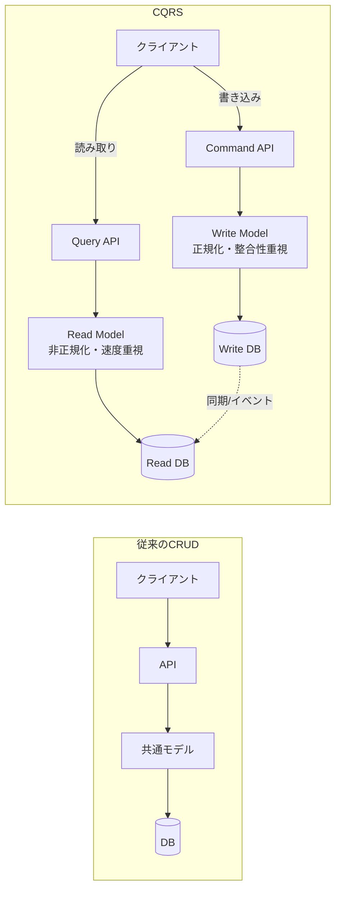
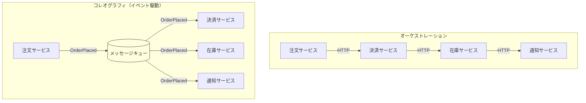
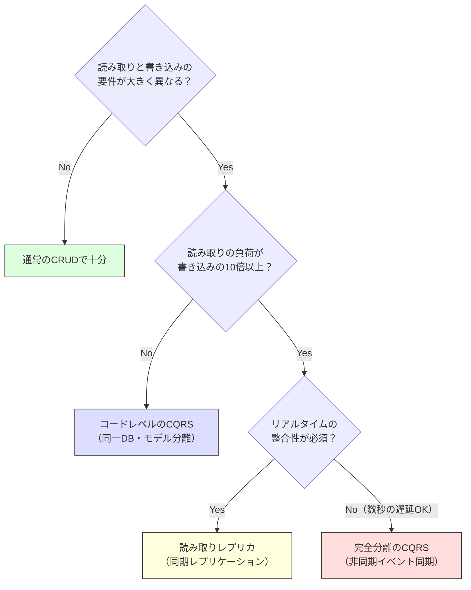

# イベント駆動 / CQRS

> **一言で言うと:** 読み取りと書き込みで最適なモデルが異なるという認識から生まれたアーキテクチャパターン。大規模システムでの「読み書きの非対称性」を解決する。

## 3分で全体像

- **何を解決する技術か:** 「読み書きで最適なデータ構造が衝突する」「読み取りだけスケールしたいのに書き込みモデルと結合している」「サービス間が同期 HTTP の連鎖で密結合」「『なぜこの状態になったか』の履歴が消える」という大規模システムの構造問題を、書き込みと読み取りの分離（CQRS）・イベント通信（イベント駆動）・状態の履歴化（イベントソーシング）で解決する
- **代表的な使用シーン:** EC サイトの注文確定後の決済 / 在庫 / 通知 / ポイント付与の並行処理、SNS のフィード生成（書き込み正規化 + 読み取り非正規化）、銀行口座の取引履歴管理（イベントソーシング）、マイクロサービス間の疎結合通信、検索エンジンの非同期インデックス更新、CDC（Change Data Capture）による分析 DB 連携
- **これだけは覚える3つ:**
    1. **CQRS / イベント駆動 / イベントソーシングは別概念** — よく一緒に語られるが互いに独立。CQRS は「読み書きモデルの分離」、イベント駆動は「サービス間通信にイベントを使う」、イベントソーシングは「状態を直接保存せずイベント列で表現する」。**必要な部分だけ採用してよい**
    2. **CQRS の最小構成は「コードレベルの分離」だけ** — 必ずしも DB を 2 つに分ける必要はない。同じ DB でも `OrderCommandService` / `OrderQueryService` のクラスを分けるだけで効果がある。**インフラ分離は読み取り負荷が書き込みの 10 倍以上**になってから検討する
    3. **イベントは「過去形 + 起きた事実」で命名する** — `CreateOrder`（命令）ではなく `OrderPlaced`（事実）。`UserUpdated`（漠然）ではなく `UserEmailVerified`（具体）。CRUD イベントは設計失敗のシグナルで、ドメイン分析（イベントストーミング）なしのイベントはモデルが揃わない
- **AIに任せやすいか:** **人間判断が要る** — 「CQRS / イベント駆動を採用すべきか」「どの粒度でイベントを切るか」「結果整合性のレベル」「べき等性とリトライ戦略」は**ビジネス要件 + 既存システム制約 + チーム成熟度**を踏まえた判断が必要で、AI は CRUD の機械変換に流れがち。一方で**べき等チェック / DLQ 設定 / 個別ハンドラの実装**は定型なので AI に任せられる。AI は **`UserCreated` / `UserUpdated` のような CRUD イベント / 例外を握りつぶすハンドラ / イベントに巨大ペイロードを詰め込む** バイアスがあり、生成されたイベント定義の**命名と粒度**は必ず疑う
- **詰まったらここを読む:** [[非同期処理とメッセージキュー]] / [[モノリスvsマイクロサービス]] / [[キャッシュ戦略]] / [[関心の分離]]

## なぜ必要か

従来のCRUDアーキテクチャでは、読み取り（Query）と書き込み（Command）が同じデータモデル・同じDB・同じAPIを共有する。小規模では問題ないが、システムが成長すると:

- **読み取りと書き込みの要件が衝突する** — 書き込みは正規化されたデータ構造（整合性優先）が最適だが、読み取りは非正規化されたデータ構造（パフォーマンス優先）が最適。1つのモデルで両方を満たそうとすると、どちらも中途半端になる
- **スケーリングの方向が異なる** — 多くのWebアプリケーションでは読み取りが書き込みの10〜100倍以上。読み取りだけスケールアウトしたいのに、書き込みモデルと結合しているためそれができない
- **処理の連鎖が同期的になる** — 「注文が確定したらメール送信・在庫更新・ポイント付与」を全て同期的に処理すると、レスポンスが遅くなり、1つの処理の失敗が全体を巻き戻す
- **システム間の結合が密になる** — サービスAがサービスBのAPIを直接呼び出す設計では、Bの変更がAを壊す。サービスの数が増えるほど結合の複雑さが爆発する

## どの問題を解決するか

### [[CQRS]]（Command Query Responsibility Segregation）

**問題:** 1つのモデルで読み取りと書き込みの両方を担当すると、クエリの最適化が書き込みロジックを複雑にし、書き込みの正規化が読み取りパフォーマンスを犠牲にする。

**解決方法:** コマンド（書き込み）とクエリ（読み取り）のモデルを分離する。


```mermaid
graph LR
    subgraph "従来のCRUD"
        CLIENT1["クライアント"] --> API1["API"]
        API1 --> MODEL1["共通モデル"]
        MODEL1 --> DB1[("DB")]
    end

    subgraph "CQRS"
        CLIENT2["クライアント"] -->|"書き込み"| CMD["Command API"]
        CLIENT2 -->|"読み取り"| QRY["Query API"]
        CMD --> WMODEL["Write Model<br/>正規化・整合性重視"]
        QRY --> RMODEL["Read Model<br/>非正規化・速度重視"]
        WMODEL --> WDB[("Write DB")]
        RMODEL --> RDB[("Read DB")]
        WDB -.->|"同期/イベント"| RDB
    end
```

CQRSには段階がある:
1. **コード内の分離** — 同じDBだがコマンドとクエリで異なるモデル/クラスを使う（最小構成）
2. **DB読み取りレプリカ** — 書き込みはプライマリ、読み取りはレプリカへ
3. **完全分離** — 書き込みDBと読み取りDB（物理的に異なるDB製品も可）をイベントで同期

段階2以降では「Read Modelをどう同期するか（同期更新 / アウトボックス / CDC / レプリカ / バッチ再構築）」「書き込み直後に読めない遅延をUIでどう吸収するか」という設計判断が必ず発生する。この判断軸と、そもそもなぜ「CQRS = DBを2つに分ける」と誤解されたのかという出自は [[CQRS]] で扱う。

### イベント駆動アーキテクチャ（Event-Driven Architecture）

**問題:** サービス間を直接的なAPIコール（同期呼び出し）で結合すると、呼び出し側が被呼び出し側の可用性・レスポンス時間に依存する。サービスの数が増えると依存関係がスパゲティ化する。

**解決方法:** サービス間の通信を「イベント（起きた事実の通知）」に置き換える。

- **オーケストレーション（同期的）:** サービスAが B→C→D を順番に呼び出し、全体の流れを制御する
- **コレオグラフィ（イベント駆動）:** サービスAが「注文確定」イベントを発行し、B・C・Dがそれぞれ独立にそのイベントを受け取って処理する


```mermaid
graph TD
    subgraph "オーケストレーション"
        O_ORDER["注文サービス"] -->|"HTTP"| O_PAY["決済サービス"]
        O_PAY -->|"HTTP"| O_INV["在庫サービス"]
        O_INV -->|"HTTP"| O_MAIL["通知サービス"]
    end

    subgraph "コレオグラフィ（イベント駆動）"
        E_ORDER["注文サービス"] -->|"OrderPlaced"| MQ[("メッセージキュー")]
        MQ -->|"OrderPlaced"| E_PAY["決済サービス"]
        MQ -->|"OrderPlaced"| E_INV["在庫サービス"]
        MQ -->|"OrderPlaced"| E_MAIL["通知サービス"]
    end

    style MQ fill:#ffd,stroke:#333
```

### [[イベントソーシング]]（Event Sourcing）

**問題:** 現在の状態だけを保存すると「なぜこの状態になったか」の履歴が失われる。監査・デバッグ・状態の巻き戻しが困難。

**解決方法:** 状態そのものではなく、**状態変化のイベントの列**を永続化する。現在の状態はイベントを時系列に再生することで導出する。

銀行口座の例:
- CRUDアプローチ: `balance = 1000` を保存
- イベントソーシング: `Deposited(500)` → `Withdrawn(200)` → `Deposited(700)` を保存。残高はこれらを再生して算出 = 1000

## 他の仕組みとどう関係するか

- **下位レイヤーとの関係:**
  - [[RDB]] — CQRSのWrite側ではACIDトランザクションによる整合性保証が重要。Read側では非正規化テーブルやマテリアライズドビューで読み取りを最適化する
  - [[NoSQL]] — Read Modelに最適化されたNoSQL（Elasticsearch で全文検索、Redis でキャッシュ）を使い分けられるのがCQRS分離の利点
  - [[非同期処理とメッセージキュー|非同期処理・メッセージキュー]] — イベント駆動アーキテクチャの基盤技術。RabbitMQ、Amazon SQS/SNS、Apache Kafka がイベントの配信を担う。Kafka はイベントソーシングのイベントストアとしても機能する
  - [[キャッシュ戦略]] — CQRSのRead Model自体がキャッシュの一形態と見なせる。Write→Readの同期タイミングが[[キャッシュ戦略]]の無効化問題と同じ構造を持つ

- **同レイヤーとの関係:**
  - [[関心の分離]] — CQRSは「読み取り」と「書き込み」という2つの関心事を分離するパターン。[[関心の分離]]の具体的な適用例
  - [[SOLID原則]] — CQRSはインターフェース分離原則（ISP）の応用。1つのリポジトリで `find()` と `save()` の両方を持つのではなく、読み取り用と書き込み用に分離する
  - [[モノリスvsマイクロサービス]] — マイクロサービス間の疎結合な通信手段としてイベント駆動が多用される。サービスが互いのAPIを直接知る必要がなくなる
  - [[テスト戦略]] — イベント駆動システムではイベントの発行・消費をテストする必要がある。「このコマンドが実行されたら、このイベントが発行されること」をユニットテストで確認する

- **上位レイヤーとの関係:**
  - 最上位レイヤーのため直接の上位はない

## 誤解されやすいポイント

### 1. 「CQRS = 必ずDBを2つに分ける」ではない

CQRSの最小構成は**コード上でコマンドとクエリのモデルを分けるだけ**であり、同じDBを使ってよい。物理的にDBを分けるのはスケーリングの要求が大きい場合のみ。多くのアプリケーションでは、コードレベルの分離（Command用のServiceとQuery用のServiceを分ける）だけで十分な効果がある。

### 2. 「イベント駆動 = イベントソーシング」ではない

この2つは別の概念:
- **イベント駆動アーキテクチャ** — サービス間通信にイベントを使う。状態の保存方法は問わない（通常のCRUDでもよい）
- **イベントソーシング** — 状態変化をイベントとして永続化する。サービス間通信の方法は問わない

両者を組み合わせることは多いが、独立して適用可能。イベントソーシングはCQRSなしでも使えるし、CQRSはイベントソーシングなしでも使える。

### 3. 「結果整合性（Eventual Consistency）は常に許容できる」わけではない

CQRSでWrite DBからRead DBへの同期が非同期の場合、Read Modelが数秒〜数分遅延する。「ユーザーが商品を注文した直後に注文履歴を見ても表示されない」という状況が起きうる。金融取引や在庫管理など、即時の整合性が必要な領域では結果整合性は許容できない場合がある。

### 4. 「イベント駆動にすればシステムが疎結合になる」は自動的には成立しない

イベントの設計が悪ければ密結合のままになる。例えば `UserUpdated` イベントにユーザーの全フィールドを含めると、フィールドの追加・削除が全コンシューマに影響する。イベントは**ドメインの意味を持つ粒度**で設計する必要がある（`UserEmailChanged` のように具体的に）。

## 設計のベストプラクティス

### 推奨パターン

**1. 小さく始める — コードレベルのCQRS**

最初からDBを分離するのではなく、まずコマンドとクエリのモデルをコード上で分離する。効果を実感してからインフラレベルの分離に進む。

**2. イベントは「起きた事実」を表現する**

イベント名は過去形で命名する: `OrderPlaced`, `PaymentCompleted`, `UserRegistered`。「〜してください（コマンド）」ではなく「〜が起きた（事実）」という表現にすることで、発行者と消費者の結合を切る。

**3. べき等性（Idempotency）を保証する**

ネットワーク障害でイベントが重複配信されることは避けられない。イベントハンドラは同じイベントを複数回処理しても結果が変わらないように設計する。

**4. 段階的に導入する**

全システムを一度にイベント駆動にするのではなく、複雑さや規模の問題が実際に発生している箇所から段階的に導入する。

### アンチパターン

**1. イベントストームなしのイベント設計** — ドメイン分析なしにイベントを定義すると、CRUDの変換（`Created`, `Updated`, `Deleted`）になりがち。本来のドメインイベント（`OrderShipped`, `InventoryReserved`）とは意味が異なる。

**2. イベントの双方向依存** — サービスAがBのイベントを消費し、BもAのイベントを消費する循環。処理の順序が不定になり、デバッグが極めて困難になる。

**3. 巨大イベント** — イベントに大量のデータを詰め込む。変更のたびに全コンシューマに影響する。イベントにはIDと必要最小限のデータだけを含め、詳細が必要なコンシューマはAPIで取得する。

## AIエージェントとの協働

> このトピックでAIコーディングエージェント（Claude Code, Copilot, Cursor 等）と協働するための観点。
> **「AIに何をどこまで任せ、AIに何をレビューさせ、人間は何を最終判断するか」**を整理する。実装だけでなく**レビューもAIに任せられる**前提で考える（AIコードレビュー観点で横断アンチパターン照合を行う）。

### AIに任せられる部分 / 人間が判断すべき部分

| タスク種類 | 任せ方（実装/レビュー） | 人間の関与 |
|---|---|---|
| イベントハンドラ・サブスクライバの実装 | **実装は AI 主導** — イベント受信 → ドメインサービス委譲の定型実装 | ハンドラに**過剰なロジック**が入っていないかレビュー |
| べき等性チェックの実装 | **実装は AI 主導** — Redis / DB で `processedEvents` を保持する典型パターン | べき等キーの設計（イベント ID / ビジネスキー / 複合キー）は人間が決める |
| DLQ（Dead Letter Queue）設定 | **実装は AI 主導** — SQS / Kafka / RabbitMQ の DLQ 設定は定型 | リトライ回数・退避後の監視・通知方針は人間判断 |
| イベント命名（CRUD → ドメインイベント） | **AI 単独不可** — AI は `XxxCreated` / `XxxUpdated` の CRUD 命名にバイアス | **完全に人間判断** — `OrderPlaced` `PaymentCompleted` `UserEmailVerified` のドメイン言語が必要。イベントストーミングの結果を AI に渡す |
| CQRS 採用判断 | **AI に任せない** — AI は機械的に「CQRS にしましょう」と提案する傾向 | **完全に人間判断** — 読み書きの非対称性が実際に痛みになっているか、結果整合性が許容できるかの判断 |
| 結果整合性 vs 強整合性の選択 | **AI に複数案** — トランザクショナルアウトボックス・SAGA・2PC の比較案を提示させる | **人間が最終判断** — ビジネス要件（即時整合 vs 数秒遅延 OK）を踏まえる。金融取引と SNS フィードでは答えが逆 |
| イベントスキーマ進化（バージョニング） | **AI に基本パターン** — `OrderPlacedV2` 並行運用、Schema Registry の使い方は AI が定型化できる | **人間が最終判断** — 既存コンシューマへの影響範囲、移行スケジュール、互換性ポリシー |

### AI生成コードのレビュー観点（このトピック固有）

AI生成物を受け取ったとき、最低限ここを見る。

1. **CRUD イベントになっていないか** — `UserCreated` / `UserUpdated` / `UserDeleted` のような CRUD 直訳は**ドメインの意味が失われている**サイン。「**何が起きたら誰の業務上の意味があるか**」を問い、`UserEmailVerified` `AccountSuspended` `SubscriptionRenewed` のようなドメイン言語に置き換える
2. **イベントハンドラが例外を握りつぶしていないか** — `catch (e) { console.log(e); }` で捕捉して継続するパターンは、**データ不整合が静かに蓄積**する。失敗イベントは DLQ に送り、監視・リトライ・エンジニアアラートに繋げる必要がある。AI は「動作を止めない」を優先して例外を吸収しがち
3. **べき等性が保証されているか** — メッセージキューは「at-least-once」配信が標準で、ネットワーク障害時にイベントが重複することは前提。同じイベントを 2 回受信しても結果が同じになる実装（イベント ID / ビジネスキーで重複検出）が必要。AI は「重複は来ない前提」のコードを書きがち

### 効くプロンプトの型

このトピックに関する実装をAIに依頼するとき、コンテキストとして渡すべき情報・制約・成功基準のテンプレ。

```
# 前提（プロジェクトの状況・既存のコード規約）
- アーキテクチャ: モジュラーモノリス + 内部イベントバス（既存実装あり）
- 既存イベント命名規約: `<DomainNoun><PastTenseVerb>` の過去形形式（例: OrderPlaced / PaymentCompleted）
- 既存のべき等性: 全イベントハンドラは Redis に `processedEventIds` を保持しチェック
- DB: PostgreSQL（書き込み + 読み取り共通）
- イベントの 10% 程度に重複配信が発生することを前提に設計

# やってほしいこと
- 「注文確定後の決済処理」のイベントハンドラ実装

# 守ってほしい制約（このトピック固有のもの）
- イベント命名は `OrderPlaced`（過去形 + 事実）。命令形やCRUD命名は禁止
- ハンドラ内で条件分岐・外部API呼び出し・DB更新を全て行わない。ドメインサービスに委譲
- べき等性チェックを必ず実装（イベント ID + ハンドラ名 で重複判定）
- 例外は catch して握りつぶさない。失敗時は DLQ へ送る
- イベントペイロードには ID と必要最小限のデータのみ含める。詳細は API で取得

# 完了の判断基準
- 同じイベントが 2 回配信されても、決済が 2 重実行されない
- ハンドラの例外時、エラーが DLQ に送られ監視に通知される
- ハンドラが 30 行以内で、ドメインサービスへの委譲のみを行う
- ユニットテストで決済成功 / 失敗 / 重複配信 の 3 ケースが検証される
```

### AI実装のアンチパターン

LLM生成コードで頻出する過剰設計・誤用パターン。レビュー時の照合表として使う。

| アンチパターン | なぜ問題か | レビュー観点 / 対策 |
|---|---|---|
| 全APIをCQRS化 | 単純なCRUDまでCQRSにすると、コード量が倍増するだけで効果がない | 読み書きの非対称性が実際に問題になっている箇所だけに適用する |
| CRUDイベント | `UserCreated`, `UserUpdated`, `UserDeleted` しかない。ドメインの意味が失われ、CRUDと変わらない | ドメインの言語でイベントを命名する（`UserEmailVerified`, `AccountSuspended`） |
| イベントハンドラに複雑なロジック | ハンドラ内で条件分岐・外部API呼び出し・DB更新を全て行う。テスト不能 | ハンドラはイベントの受信とドメインサービスへの委譲だけを行う |
| 非同期処理の例外を握りつぶす | イベントハンドラの例外をcatchして何もしない。データ不整合が静かに蓄積する | デッドレターキュー（DLQ）に失敗イベントを退避し、監視・リトライする |
| べき等性のないハンドラ | イベント重複配信時に決済 2 重実行・在庫 2 重引当などが発生 | イベント ID + ハンドラ名で `processedEvents` を保持し重複検出 |
| 巨大イベント | イベントに全フィールドを詰め込み、変更のたびに全コンシューマを破壊 | ID と必要最小限のデータのみ含め、詳細は API で取得 |
| イベントの双方向依存 | A が B のイベントを購読し、B も A のイベントを購読する循環。順序が不定でデバッグ困難 | 依存方向を一方向に限定。共通の上流イベントから両者が分岐する形に |
| アウトボックスパターン未使用での DB + イベント発行 | DB 更新成功 + イベント発行失敗で不整合。または DB 更新失敗 + イベント発行成功で不整合 | トランザクショナルアウトボックスで DB と outbox テーブルを 1 トランザクションで更新し、別ワーカーがイベント発行 |
| 同期 HTTP との混在で複雑化 | イベント駆動と同期 HTTP を一貫性なく混在させ、フローが追跡不能 | 各サービス間通信ごとに「同期 / 非同期」を明確に決め、ドキュメントに残す |

→ レイヤー横断のアンチパターン索引: [[_anti-patterns/_index|AIアンチパターン索引]]

## 具体例

### コードレベルのCQRS（TypeScript）

```typescript
// --- Command 側（書き込み）---
// ドメインロジックと整合性を重視
interface CreateOrderCommand {
  userId: string;
  items: { productId: string; quantity: number }[];
}

class OrderCommandService {
  constructor(
    private orderRepo: OrderRepository,
    private eventBus: EventBus,
  ) {}

  async createOrder(cmd: CreateOrderCommand): Promise<string> {
    // ビジネスルールの検証
    if (cmd.items.length === 0) {
      throw new Error('注文には1つ以上の商品が必要です');
    }

    const order = Order.create(cmd.userId, cmd.items);
    await this.orderRepo.save(order);

    // ドメインイベントの発行
    await this.eventBus.publish(
      new OrderPlacedEvent(order.id, cmd.userId, cmd.items)
    );

    return order.id;
  }
}

// --- Query 側（読み取り）---
// パフォーマンスと表示に最適化
interface OrderSummaryDTO {
  orderId: string;
  userName: string;        // JOINで事前に結合済み
  totalAmount: number;     // 事前計算済み
  itemCount: number;
  status: string;
  placedAt: Date;
}

class OrderQueryService {
  constructor(private db: Database) {}

  async getOrderSummaries(userId: string): Promise<OrderSummaryDTO[]> {
    // 読み取り専用。非正規化されたビューから直接取得
    return this.db.query(`
      SELECT order_id, user_name, total_amount, item_count, status, placed_at
      FROM order_summaries
      WHERE user_id = $1
      ORDER BY placed_at DESC
    `, [userId]);
  }
}
```

### イベント駆動 — 注文処理の疎結合化（TypeScript）

```typescript
// --- イベントの定義 ---
// 過去形で命名。「起きた事実」を表現する
interface OrderPlacedEvent {
  type: 'OrderPlaced';
  orderId: string;
  userId: string;
  items: { productId: string; quantity: number; price: number }[];
  occurredAt: Date;
}

// --- 発行側（注文サービス）---
// 他のサービスの存在を知らない
class OrderService {
  constructor(
    private orderRepo: OrderRepository,
    private eventBus: EventBus,
  ) {}

  async placeOrder(userId: string, items: OrderItem[]): Promise<string> {
    const order = Order.create(userId, items);
    await this.orderRepo.save(order);

    // 「注文が確定した」という事実だけを発行
    await this.eventBus.publish({
      type: 'OrderPlaced',
      orderId: order.id,
      userId,
      items,
      occurredAt: new Date(),
    });

    return order.id;
  }
}

// --- 消費側（各サービスが独立にイベントを処理）---
// 注文サービスの存在を知らない

class InventoryEventHandler {
  async handle(event: OrderPlacedEvent) {
    for (const item of event.items) {
      await this.inventoryService.reserve(item.productId, item.quantity);
    }
  }
}

class NotificationEventHandler {
  async handle(event: OrderPlacedEvent) {
    await this.emailService.send(
      event.userId,
      '注文を受け付けました',
      `注文ID: ${event.orderId}`
    );
  }
}

class PointsEventHandler {
  async handle(event: OrderPlacedEvent) {
    const totalAmount = event.items.reduce(
      (sum, i) => sum + i.price * i.quantity, 0
    );
    await this.pointsService.award(event.userId, Math.floor(totalAmount / 100));
  }
}
```

### べき等なイベントハンドラ

```typescript
// 同じイベントが2回配信されても安全
// 実務では processedEvents は Redis や DB で実装する（プロセス再起動で消えないように）
interface ProcessedEventStore {
  has(id: string): Promise<boolean>;
  add(id: string): Promise<void>;
}

class PaymentEventHandler {
  constructor(
    private paymentRepo: PaymentRepository,
    private processedEvents: ProcessedEventStore,
  ) {}

  async handle(event: OrderPlacedEvent) {
    // べき等性チェック: 既に処理済みならスキップ
    const eventId = `${event.type}:${event.orderId}`;
    if (await this.processedEvents.has(eventId)) {
      return; // 重複配信 — 何もしない
    }

    await this.paymentRepo.createCharge({
      orderId: event.orderId,
      amount: calculateTotal(event.items),
    });

    await this.processedEvents.add(eventId);
  }
}
```

### 他言語でのイベント駆動実装

**Go — チャネルとgoroutineを活用したイベントハンドラ**

```go
package main

import (
	"fmt"
	"sync"
)

// イベントの定義
type OrderPlacedEvent struct {
	OrderID string
	UserID  string
	Items   []OrderItem
}

type OrderItem struct {
	ProductID string
	Quantity  int
	Price     int
}

// イベントハンドラのインターフェース
type EventHandler interface {
	Handle(event OrderPlacedEvent)
}

// イベントバス — チャネルで非同期にイベントを配信
type EventBus struct {
	handlers []EventHandler
}

func (b *EventBus) Subscribe(h EventHandler) {
	b.handlers = append(b.handlers, h)
}

func (b *EventBus) Publish(event OrderPlacedEvent) {
	var wg sync.WaitGroup
	for _, h := range b.handlers {
		wg.Add(1)
		go func(handler EventHandler) {
			defer wg.Done()
			handler.Handle(event) // 各ハンドラをgoroutineで並行実行
		}(h)
	}
	wg.Wait()
}

// 在庫サービスのハンドラ
type InventoryHandler struct{}

func (h *InventoryHandler) Handle(event OrderPlacedEvent) {
	for _, item := range event.Items {
		fmt.Printf("[在庫] %s を %d 個引き当て\n", item.ProductID, item.Quantity)
	}
}

// 通知サービスのハンドラ
type NotificationHandler struct{}

func (h *NotificationHandler) Handle(event OrderPlacedEvent) {
	fmt.Printf("[通知] ユーザー %s に注文確認メール送信（注文ID: %s）\n",
		event.UserID, event.OrderID)
}

func main() {
	bus := &EventBus{}
	bus.Subscribe(&InventoryHandler{})
	bus.Subscribe(&NotificationHandler{})

	// 注文確定イベントを発行
	bus.Publish(OrderPlacedEvent{
		OrderID: "ORD-001",
		UserID:  "USR-42",
		Items:   []OrderItem{{ProductID: "PROD-A", Quantity: 2, Price: 500}},
	})
}
```

**Python — フレームワーク非依存のイベントバスパターン**

```python
from dataclasses import dataclass, field
from collections import defaultdict
from typing import Callable, Any

# イベントの定義
@dataclass
class OrderPlacedEvent:
    order_id: str
    user_id: str
    items: list[dict] = field(default_factory=list)

# シンプルなイベントバス
class EventBus:
    def __init__(self) -> None:
        # イベント型 → ハンドラリストのマッピング
        self._handlers: dict[type, list[Callable]] = defaultdict(list)

    def subscribe(self, event_type: type, handler: Callable) -> None:
        self._handlers[event_type].append(handler)

    def publish(self, event: Any) -> None:
        for handler in self._handlers[type(event)]:
            handler(event)

# 各サービスのハンドラ（独立した関数として定義）
def handle_inventory(event: OrderPlacedEvent) -> None:
    for item in event.items:
        print(f"[在庫] {item['product_id']} を {item['quantity']} 個引き当て")

def handle_notification(event: OrderPlacedEvent) -> None:
    print(f"[通知] ユーザー {event.user_id} に注文確認メール送信"
          f"（注文ID: {event.order_id}）")

def handle_points(event: OrderPlacedEvent) -> None:
    total = sum(i["price"] * i["quantity"] for i in event.items)
    points = total // 100  # 100円ごとに1ポイント
    print(f"[ポイント] ユーザー {event.user_id} に {points} pt 付与")

if __name__ == "__main__":
    bus = EventBus()
    bus.subscribe(OrderPlacedEvent, handle_inventory)
    bus.subscribe(OrderPlacedEvent, handle_notification)
    bus.subscribe(OrderPlacedEvent, handle_points)

    # 注文確定イベントを発行
    bus.publish(OrderPlacedEvent(
        order_id="ORD-001",
        user_id="USR-42",
        items=[{"product_id": "PROD-A", "quantity": 2, "price": 500}],
    ))
```

### CQRSの適用判断


```mermaid
flowchart TD
    Q1{"読み取りと書き込みの<br/>要件が大きく異なる？"} -->|"No"| CRUD["通常のCRUDで十分"]
    Q1 -->|"Yes"| Q2{"読み取りの負荷が<br/>書き込みの10倍以上？"}
    Q2 -->|"No"| CODE_CQRS["コードレベルのCQRS<br/>（同一DB・モデル分離）"]
    Q2 -->|"Yes"| Q3{"リアルタイムの<br/>整合性が必須？"}
    Q3 -->|"Yes"| REPLICA["読み取りレプリカ<br/>（同期レプリケーション）"]
    Q3 -->|"No（数秒の遅延OK）"| FULL_CQRS["完全分離のCQRS<br/>（非同期イベント同期）"]

    style CRUD fill:#dfd,stroke:#333
    style CODE_CQRS fill:#ddf,stroke:#333
    style REPLICA fill:#ffd,stroke:#333
    style FULL_CQRS fill:#fdd,stroke:#333
```

## 参考リソース

- *Designing Data-Intensive Applications* — Martin Kleppmann（イベントソーシング・ストリーム処理の理論的背景を詳細に解説）
- *Building Event-Driven Microservices* — Adam Bellemare（イベント駆動アーキテクチャの実践ガイド）
- *Domain-Driven Design* — Eric Evans（ドメインイベントの概念の原典。Bounded Context がイベント境界の候補）
- Martin Fowler "CQRS" — martinfowler.com（CQRSの概念と適用範囲を簡潔に解説）
- Greg Young "CQRS and Event Sourcing" — CQRSとイベントソーシングの提唱者による解説

## 理解度セルフチェック

> 答えられなければ本文に戻る。答えはこのファイル内に必ずある。

1. 「CQRS」「イベント駆動」「イベントソーシング」は混同されがちだが別概念。それぞれが解決する問題と、3 つを組み合わせなくても採用できることを 30 秒で説明してみよう
2. 「読み書きの非対称性が大きいシステムでも CQRS を採用すべきでない」場合がある。どんな状況で、なぜ採用しない方がよいかを「結果整合性のコスト」「移行・運用コスト」の観点から答えよ
3. AI が次のイベント駆動コードを生成した。本番投入前に修正すべき問題点を 3 つ以上指摘し、修正方針を答えよ
   ```typescript
   // 注文サービス
   async function placeOrder(userId: string, items: Item[]) {
     const order = await db.orders.create({ userId, items });
     // DB 更新後にイベント発行
     await eventBus.publish({
       type: 'OrderUpdated',  // ← イベント命名
       data: order,           // ← ペイロード
     });
     return order;
   }

   // 決済サービスのハンドラ
   eventBus.on('OrderUpdated', async (event) => {
     try {
       const charge = await stripe.charge(event.data.userId, calculateTotal(event.data.items));
       await db.payments.create({ orderId: event.data.id, chargeId: charge.id });
     } catch (e) {
       console.error(e);
     }
   });
   ```

> [!note]- 解答の指針
>
> > [!info] 用語ミニ辞典
> > - **CQRS（Command Query Responsibility Segregation）**: 読み取り（Query）と書き込み（Command）でモデルを分離する設計パターン。コードレベル分離 → DB 読み取りレプリカ → 完全分離の段階がある
> > - **イベント駆動アーキテクチャ**: サービス間の通信を「イベント（起きた事実の通知）」で疎結合にするアーキテクチャ。同期 HTTP の連鎖を回避できる
> > - **イベントソーシング**: 状態そのものではなく**状態変化のイベント列**を永続化し、現在状態をイベント再生で導出する手法
> > - **ドメインイベント**: ビジネス上の意味を持つ過去形の事実通知。`OrderPlaced` `PaymentCompleted` `UserEmailVerified` など
> > - **CRUD イベント**: `Created` / `Updated` / `Deleted` のように DB 操作を直訳した命名。ドメインの意味が消えており、設計失敗のシグナル
> > - **べき等性（Idempotency）**: 同じ操作を複数回実行しても結果が変わらない性質。メッセージキューの「at-least-once」配信前提では必須
> > - **DLQ（Dead Letter Queue / 死信キュー）**: 処理に失敗したメッセージを退避させる別キュー。監視・通知・手動リトライの起点になる
> > - **結果整合性（Eventual Consistency）**: ある時点では整合性がないが、最終的に整合する性質。書き込みから読み取りモデル更新までに数秒〜数分の遅延が許容されるシステムで採用
> > - **トランザクショナルアウトボックス**: DB 更新と「これからイベント発行する予定」を 1 つの DB トランザクション内で記録し、別ワーカーが outbox テーブルを読み取ってイベント発行する手法。DB 更新成功 + イベント発行失敗の不整合を防ぐ
> > - **イベントストーミング**: 付箋を使ってドメインイベントを発見するワークショップ手法。Alberto Brandolini 提唱
> > - **at-least-once 配信**: メッセージキューの配信保証レベル。同じメッセージが 2 回以上届くことを前提に、消費側でべき等性を実装する
>
> 1. **CQRS（読み書きモデル分離）**: 読み取りは非正規化された高速モデル、書き込みは正規化された整合性重視モデル、と最適化方向が違う問題を解決する。**コード上で `OrderCommandService` / `OrderQueryService` を分けるだけ**でも CQRS 成立。同じ DB を共有してよい
>
>    **イベント駆動（疎結合通信）**: サービス間が同期 HTTP で連鎖すると、可用性が積算され、変更の波及が大きくなる問題を解決する。「注文サービスが在庫サービスを呼ぶ」のではなく「注文サービスが `OrderPlaced` を発行し、在庫サービスがそれを受ける」。状態の保存方法（CRUD でも何でもよい）は問わない
>
>    **イベントソーシング（状態の履歴化）**: 「現在の状態だけ保存すると、なぜその状態になったかの履歴が消える」問題を解決する。状態そのものではなく**状態変化のイベント列**を永続化する。`balance = 1000` ではなく `Deposited(500)` `Withdrawn(200)` `Deposited(700)` を保存。サービス間通信の方法（同期 HTTP でも非同期でも）は問わない
>
>    **組み合わせの自由度**: 例えば「CQRS + 通常の DB（イベントソーシングなし）+ 同期 HTTP（イベント駆動なし）」も成立。逆に「イベント駆動のみ採用、CQRS もイベントソーシングも未採用」も成立。**問題に対して必要な部分だけ採用**するのが基本
>
> 2. **採用しない方がよい状況**:
>
>    1. **強整合性が必須のドメイン**: 金融取引・在庫の即時反映・予約システムなど、書き込み直後に読み取りで反映されないと業務が破綻する領域。CQRS の Read Model は通常**結果整合性**で数秒〜数分の遅延が発生する。「ユーザーが商品を注文した直後に注文履歴を見ても表示されない」は EC では UX 問題、銀行残高では重大バグ
>    2. **チームが結果整合性を運用できない**: イベント駆動 / CQRS は「重複配信処理」「順序の不定性」「Read Model の遅延」「DLQ 監視」など分散システムの運用知識が必要。チームに経験者がいなければ、本来不要な複雑さに振り回される
>    3. **既存システムが CRUD で機能している**: 痛みが出ていないシステムを「設計が綺麗だから」と CQRS / イベント駆動に書き換えるのは過剰設計。マイクロサービス化と同様、**痛みが出てから検討する**
>    4. **データ量・トラフィック量が小さい**: 読み取りが 1 秒間に数件程度なら、PostgreSQL のインデックス + キャッシュで十分対応可能。CQRS の運用コストが上回る
>
>    **判断基準**: CQRS の効果が明確に効くのは「読み取りが書き込みの 10 倍以上」「読み取りモデルに非正規化 / 全文検索 / 集計が大量に必要」「書き込みドメインが複雑なルールを持つ」が複数当てはまる場合。それ以外は通常の CRUD + キャッシュで十分
>
> 3. **修正すべき問題点**:
>
>    1. **イベント命名が CRUD 直訳**: `OrderUpdated` は CRUD 命名で、**何が起きたか**のドメインの意味が失われている。**修正**: `OrderPlaced`（注文が置かれた）に変更
>    2. **巨大イベント**: `data: order` で order 全体を渡している。`order` のフィールド変更で全コンシューマが影響を受ける。**修正**: `{ orderId, userId, items: [{ productId, quantity, price }], placedAt }` のように必要最小限のフィールドだけ含める。詳細が必要なコンシューマは API で取得
>    3. **べき等性が保証されていない**: メッセージキューは at-least-once 配信が標準。同じイベントが 2 回届いたら**Stripe で 2 重課金**が起きる。**修正**: イベント ID + ハンドラ名で `processedEvents` を Redis や DB で保持し、重複時はスキップ。
>
>       **注意 — べき等キーの名前空間設計**: 単純に `payment:${orderId}` のキーを使うと、**dev / staging / prod の Redis を共有している環境では衝突する**(staging で処理済みのイベント ID が prod で「処理済み」扱いされる事故)。さらに**複数の Pod / インスタンスが同時起動**しているマイクロサービス環境では、レースコンディションでキー書き込み前の二重実行も起こりうる。実装指針:
>       - 環境プレフィックス: `prod:payment:${orderId}` のように環境を必ず先頭に
>       - ハンドラ名を含める: `prod:payment-handler:${eventId}`(別ハンドラでの再利用を防ぐ)
>       - レース対策: `SET ... NX`(Redis)や `INSERT ... ON CONFLICT DO NOTHING`(PostgreSQL)で**チェックと書き込みをアトミック**に実行
>    4. **例外を握りつぶしている**: `catch (e) { console.error(e); }` で継続。決済失敗が**静かに失われ、注文だけ成立する不整合**が起こる。**修正**: 例外を再 throw し、メッセージキューの再試行 → 失敗時 DLQ に送る経路を構築。DLQ から監視 → エンジニア通知へ繋げる
>    5. **アウトボックスパターン未使用**: `db.orders.create` 成功直後の `eventBus.publish` がネットワーク障害で失敗すると、**DB に注文が残るが決済イベントが発行されない**不整合になる。**修正**: outbox テーブルを使い、`db.orders.create` と `outbox` 行追加を 1 トランザクションで実行、別ワーカーが outbox を読んでイベント発行
>    6. **ハンドラのロジックが複雑**: ハンドラ内で `stripe.charge` + `db.payments.create` を直接実行。テストでハンドラの責務が混乱する。**修正**: `paymentService.processPayment(orderId, amount)` のようなドメインサービスに委譲
>    7. **`event.data.id` が undefined になる可能性**: `data: order` で渡しているが、`order.id` が `id` フィールドか `orderId` フィールドかは ORM による。型システムで保証されないなら明示的に `orderId: order.id` で詰める
>
>    **修正後のイメージ**:
>    ```typescript
>    async function placeOrder(userId: string, items: Item[]) {
>      return db.transaction(async (tx) => {
>        const order = await tx.orders.create({ userId, items });
>        await tx.outbox.create({
>          eventType: 'OrderPlaced',
>          payload: {
>            orderId: order.id,
>            userId,
>            items: items.map(i => ({ productId: i.productId, quantity: i.quantity, price: i.price })),
>            placedAt: new Date().toISOString(),
>          },
>        });
>        return order;
>      });
>    }
>
>    eventBus.on('OrderPlaced', async (event) => {
>      const eventKey = `payment:${event.payload.orderId}`;
>      if (await processedEvents.has(eventKey)) return;
>
>      await paymentService.processPayment(event.payload.orderId, calculateTotal(event.payload.items));
>      await processedEvents.add(eventKey);
>      // 例外時は再 throw → メッセージキューの retry → DLQ へ
>    });
>    ```
>
>    **思考プロセス**: イベント駆動コードは**「重複配信」「失敗時の不整合」「巨大ペイロードの依存爆発」**の 3 つが定型のレビュー観点。AI 生成コードは Happy path のみ書きがちで、これらの障害シナリオへの対応が抜けやすい

## 学習メモ

- CQRS・イベント駆動・イベントソーシングは3つの独立した概念。組み合わせることが多いが、必要な部分だけ採用できる
- 「まだ必要ない」と判断できることが最も重要。CRUDで十分な場面にCQRSを導入するのは過剰設計
- 結果整合性のシステムでは「ユーザーに遅延をどう伝えるか」のUX設計も重要（「処理中です」の表示など）
- イベントストーミング（Event Storming）はドメインイベントを発見するワークショップ手法。CQRS/イベント駆動の設計前に実施すると効果的
