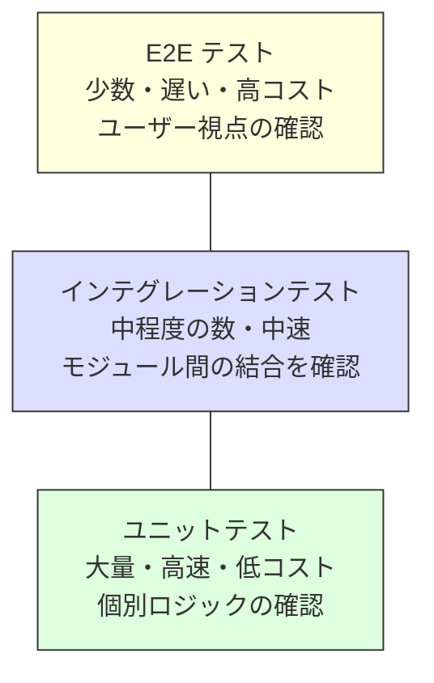
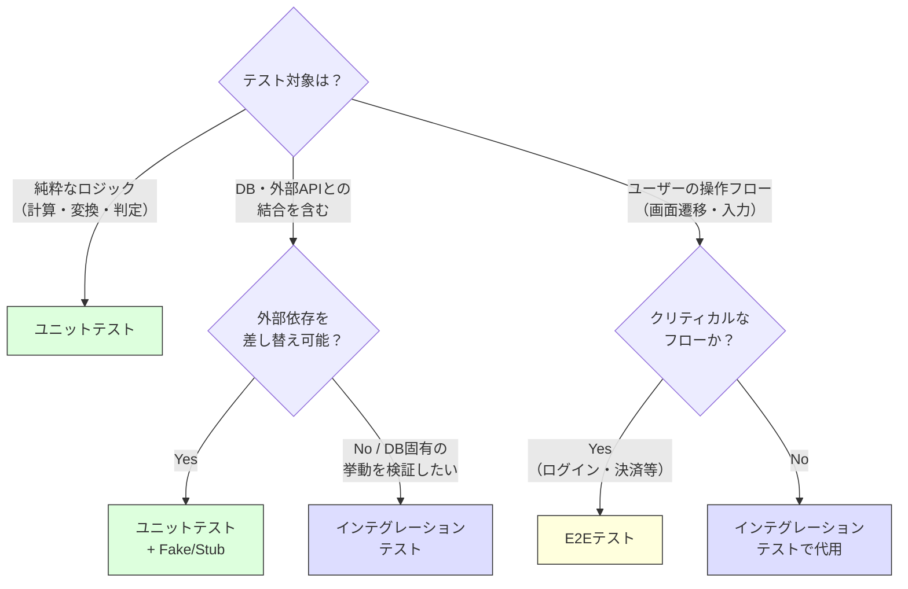

# テスト戦略

> **一言で言うと:** ユニットテスト（速い・安い・狭い）、インテグレーションテスト（中間）、E2Eテスト（遅い・高い・広い）のピラミッド構造で品質を多層的に守る。「何をどのレベルでテストするか」の判断が設計力そのもの。

## なぜ必要か

ソフトウェアは変更され続ける。テスト戦略がなければ:

- **変更のたびに手動で全機能を確認する** — 機能が増えるほど確認工数が爆発し、リグレッション（既存機能の破壊）を見逃す。チェックリストを人間が毎回正確に実行し続けるのは不可能
- **リファクタリングが怖くてできない** — 「動いているコードを触るな」という空気が生まれ、技術的負債が蓄積する。コードの改善が不可能になった時点で、プロダクトの寿命が決まる
- **バグの原因特定に時間がかかる** — テストがなければ「どの層のどのロジックが壊れたか」の切り分けができず、デバッグがシステム全体の調査になる
- **[[CI-CD]]が無意味になる** — 自動テストなしの CI/CD パイプラインは「壊れたコードを高速に本番へ届ける」仕組みにすぎない

## どの問題を解決するか

### 問題1: テストのレベルをどう使い分けるか — テストピラミッド

異なるレベルのテストには異なるトレードオフがある。テストピラミッドはその配分を示す。



| レベル | 速度 | コスト | 信頼性 | スコープ | 障害の局所化 |
|--------|------|--------|--------|----------|-------------|
| ユニット | ミリ秒 | 低 | 高（決定的） | 関数/クラス | ピンポイント |
| インテグレーション | 秒 | 中 | 中 | モジュール間/DB | モジュール単位 |
| E2E | 秒〜分 | 高 | 低（フレイキー） | システム全体 | 広範囲 |

**解決方法:** ユニットテストを厚くし、上のレベルほど数を絞る。ユニットテストで個々のロジックの正しさを保証し、インテグレーションテストで結合の正しさを確認し、E2Eテストで最も重要なユーザーシナリオだけを検証する。

### 問題2: 何をテストすべきか

全てのコードにテストを書くのは非現実的。限られたリソースでどこにテストを集中すべきか。

**解決方法:** テストの価値はリスクの高さに比例する。以下を優先的にテストする:
- **ビジネスロジック** — 金額計算、権限チェック、状態遷移。バグが直接的な損害をもたらす
- **境界条件** — 空配列、null、0件、上限値。ここにバグが集中する
- **バグの再発防止** — 過去に発生したバグに対するリグレッションテスト
- **複雑な条件分岐** — 人間が読んで正しさを判断しにくい箇所

### 問題3: 外部依存をどう扱うか

DB、外部API、ファイルシステムなどの外部依存があるとテストが遅く・不安定になる。

**解決方法:** テストダブル（Test Double）を使い分ける:
- **スタブ（Stub）** — 固定値を返す。外部APIの応答をシミュレート
- **モック（Mock）** — 呼び出しを検証する。「この関数が正しい引数で呼ばれたか」を確認
- **フェイク（Fake）** — 簡易実装を提供する。インメモリDBなど。本物に近い振る舞い

ただし**モックの過剰使用は実装への密結合を生む**。モックは「境界」に対して使い、内部の実装詳細はモックしない。

## 他の仕組みとどう関係するか

- **下位レイヤーとの関係:**
  - [[RDB]] — インテグレーションテストではテスト用DBを使い、マイグレーション・クエリの正しさを実際のDBで検証する。SQLiteで代用するとDB固有の挙動差によるバグを見逃す
  - [[Docker|コンテナ]] — テスト用DB・Redis等の外部依存をコンテナで立ち上げることで、CI環境でもインテグレーションテストを再現性高く実行できる
  - [[バリデーション]] — 入力バリデーションのロジックはユニットテストで網羅的にカバーすべき最優先対象。境界値テストが特に重要
  - [[認証と認可]] — 認可ロジック（権限チェック）はユニットテストで、認証フロー全体はインテグレーションテストで確認する

- **同レイヤーとの関係:**
  - [[CI-CD]] — テスト戦略はCI/CDパイプラインの設計と一体。ユニットテストはpushごとに、E2Eテストはデプロイ前にのみ実行するなど、実行タイミングの設計が必要
  - [[SOLID原則]] — DIP（依存性逆転）によって外部依存をインターフェースで抽象化すると、テスト時にモックやフェイクへの差し替えが容易になる。テストしにくいコードはSOLID違反のサイン
  - [[関心の分離]] — 関心が適切に分離されたコードは、ユニットテストの単位が自然に定まる。テストのセットアップが複雑な場合は関心が混ざっている証拠
  - [[モノリスvsマイクロサービス]] — マイクロサービスではサービス間の契約テスト（Contract Testing）が新たに必要になる。Consumer-Driven Contracts（CDC）パターンが有効

- **上位レイヤーとの関係:**
  - 最上位レイヤーのため直接の上位はない

## 誤解されやすいポイント

### 1. 「カバレッジが高ければ品質は高い」わけではない

カバレッジ100%を目標にすると、テスト自体が目的化する。カバレッジは「実行された行」を測るだけで、「正しく検証された」ことを意味しない。アサーションなしでコードを通過させてもカバレッジは上がる。カバレッジは「テストされていない箇所の発見」には有用だが、品質の指標としては不十分。

### 2. 「ユニットテスト = クラス/関数ごとのテスト」と固定しない

ユニットテストの「ユニット」は「1つのクラス」を意味するとは限らない。「ユニット」は**振る舞いの単位**であり、複数のクラスが協調して1つの振る舞いを実現するなら、それをまとめてテストしてよい。クラスごとに分離してモックだらけにするより、振る舞い単位のテストの方が変更に強い。

### 3. 「E2Eテストで全てカバーすれば安心」ではない

E2Eテストは最も本番に近い検証だが、最も遅く・不安定（フレイキー）で・原因特定が困難。E2Eテストだけに頼ると:
- テストの実行に数十分かかりフィードバックが遅い
- ネットワークやタイミングに起因する偽の失敗が頻発する
- 失敗時に「UI? API? DB? 外部サービス?」の切り分けに時間がかかる

E2Eテストは最も重要なユーザーフロー（ログイン、決済、登録）に絞るべき。

### 4. 「モックを使えばテストが速くて簡単になる」は両刃の剣

モックは外部依存を切り離す手段だが、**モックが実装の詳細に依存すると、リファクタリングのたびにテストが壊れる**。「メソッドAがメソッドBを3回呼ぶこと」を検証するテストは、内部実装が変わるだけで失敗する。テストは**入力と出力（振る舞い）を検証すべき**であり、内部の呼び出し順序を検証すべきではない。

## 設計のベストプラクティス

### 推奨パターン

**1. テストは振る舞いを検証する（実装ではなく）**

テストは「何をするか（What）」を検証し、「どうやるか（How）」は検証しない。これにより、実装を変更してもテストが壊れにくくなる。

**2. Arrange-Act-Assert（AAA）パターン**

テストの構造を3段階に統一する:
- **Arrange（準備）** — テスト対象の状態をセットアップ
- **Act（実行）** — テスト対象のメソッドを呼び出す
- **Assert（検証）** — 結果が期待通りか確認

**3. テストの独立性を保つ**

各テストは他のテストの実行結果に依存しない。テスト間で状態を共有しない。実行順序に関係なく全テストがパスする。

**4. 失敗するテストを先に書く（TDD の赤→緑→リファクタ）**

テスト駆動開発（Test-Driven Development）のサイクル:
1. 失敗するテストを書く（赤）
2. テストを通す最小限のコードを書く（緑）
3. コードを整理する（リファクタ）

全てのコードにTDDを適用する必要はないが、複雑なビジネスロジックには特に効果的。

### アンチパターン

**1. テストの共有フィクスチャ** — 全テストで同じセットアップデータを共有する。1つのテストのために追加したデータが他のテストを壊す。テストごとに必要なデータだけをセットアップする。

**2. 実装の詳細テスト** — privateメソッドを直接テストする、呼び出し回数を検証する。リファクタリングのたびにテストが壊れる。publicなインターフェースの振る舞いだけを検証する。

**3. フレイキーテストの放置** — 時々失敗するテストを放置すると、チーム全体が失敗を無視するようになる。フレイキーテストは即座に修正するか、一時的に隔離して対処する。

## AIによる実装のアンチパターン

| アンチパターン | なぜ問題か | 対策 |
|---|---|---|
| 全メソッドに1対1でテスト生成 | privateメソッドや内部実装をテストしてしまう。リファクタリングでテストが大量に壊れる | 公開インターフェースの振る舞い単位でテストを書く |
| モックだらけのユニットテスト | 全依存をモックし、実質的に「モックが正しく動くこと」をテストしている。本物の結合での不具合を検出できない | 境界（外部API・DB）のみモック。内部の協調はそのままテストする |
| テスト名が `test1`, `test2` | 失敗時に何が壊れたか分からない。テスト名は仕様の文書 | `should_return_error_when_email_is_invalid` のように振る舞いを記述 |
| Happy path のみテスト生成 | 正常系だけテストし、異常系・境界値を無視。バグは境界に集中する | 各テストに異常系・境界値のテストケースを必ず含める |

## 具体例

### ユニットテスト — 振る舞いを検証する（TypeScript / Vitest）

```typescript
import { describe, it, expect } from 'vitest';

// テスト対象: 注文の合計金額計算
function calculateTotal(items: { price: number; quantity: number }[]): number {
  return items.reduce((sum, item) => sum + item.price * item.quantity, 0);
}

function applyDiscount(total: number, discountRate: number): number {
  if (discountRate < 0 || discountRate > 1) {
    throw new Error('割引率は0〜1の範囲で指定してください');
  }
  return Math.round(total * (1 - discountRate));
}

describe('calculateTotal', () => {
  // 正常系
  it('should sum price * quantity for all items', () => {
    const items = [
      { price: 100, quantity: 2 },
      { price: 500, quantity: 1 },
    ];
    expect(calculateTotal(items)).toBe(700);
  });

  // 境界値
  it('should return 0 for empty array', () => {
    expect(calculateTotal([])).toBe(0);
  });
});

describe('applyDiscount', () => {
  it('should apply 10% discount', () => {
    expect(applyDiscount(1000, 0.1)).toBe(900);
  });

  // 異常系
  it('should throw for negative discount rate', () => {
    expect(() => applyDiscount(1000, -0.1)).toThrow('割引率は0〜1の範囲');
  });

  // 境界値
  it('should return 0 for 100% discount', () => {
    expect(applyDiscount(1000, 1)).toBe(0);
  });

  it('should return original amount for 0% discount', () => {
    expect(applyDiscount(1000, 0)).toBe(1000);
  });
});
```

### インテグレーションテスト — DBとの結合を検証する（TypeScript / Vitest）

```typescript
import { describe, it, expect, beforeEach } from 'vitest';
import { db } from './db'; // 実際のテスト用DB接続

describe('UserRepository', () => {
  beforeEach(async () => {
    // テストごとにクリーンな状態にする
    await db.query('DELETE FROM users');
  });

  it('should create and retrieve a user', async () => {
    // Arrange
    const repo = new UserRepository(db);

    // Act
    const created = await repo.create({
      name: 'テスト太郎',
      email: 'taro@example.com',
    });
    const found = await repo.findById(created.id);

    // Assert
    expect(found).toEqual({
      id: created.id,
      name: 'テスト太郎',
      email: 'taro@example.com',
    });
  });

  it('should return null for non-existent user', async () => {
    const repo = new UserRepository(db);
    const found = await repo.findById('non-existent-id');
    expect(found).toBeNull();
  });
});
```

### テストダブルの使い分け

```typescript
// --- Stub: 固定値を返す ---
class StubEmailService implements EmailService {
  async send(_to: string, _subject: string, _body: string) {
    // 何もしない（送信成功を装う）
  }
}

// --- Fake: 簡易実装を提供する ---
class FakeUserRepository implements UserRepository {
  private users = new Map<string, User>();

  async create(data: CreateUserInput): Promise<User> {
    const user = { id: crypto.randomUUID(), ...data };
    this.users.set(user.id, user);
    return user;
  }

  async findById(id: string): Promise<User | null> {
    return this.users.get(id) ?? null;
  }
}

// --- テストでの使用 ---
it('should register user and send welcome email', async () => {
  const emailService = new StubEmailService();
  const userRepo = new FakeUserRepository();
  const service = new UserService(userRepo, emailService);

  const user = await service.register({
    name: '田中',
    email: 'tanaka@example.com',
  });

  // 振る舞いを検証（実装の詳細ではなく結果を確認）
  const saved = await userRepo.findById(user.id);
  expect(saved?.name).toBe('田中');
});
```

### テストレベルの選択ガイド



## 参考リソース

- *Unit Testing: Principles, Practices, and Patterns* — Vladimir Khorikov（「良いテストとは何か」を体系化。振る舞いテスト vs 実装テストの議論が秀逸）
- *Growing Object-Oriented Software, Guided by Tests* — Steve Freeman, Nat Pryce（TDDの実践書。外側からテストを書く手法）
- *Working Effectively with Legacy Code* — Michael Feathers（テストのないレガシーコードにテストを追加する技法）
- Martin Fowler "TestPyramid" — martinfowler.com（テストピラミッドの概念の解説）
- Kent Beck "Test Desiderata" — テストが備えるべき12の性質のリスト

## 学習メモ

- テストの価値は「変更への自信」を与えること。テストがなければリファクタリングも機能追加もギャンブルになる
- 「テストを書く時間がない」は逆。テストがないから手動確認に時間がかかり、バグ修正に時間がかかる。テストは投資であり、長期的には時間を節約する
- モックの使いどころは「システムの境界」。内部のクラス間連携をモックするのは実装への密結合
- テスト名は仕様書。`should_reject_order_when_stock_is_zero` のように「何が起きるべきか」を書く
