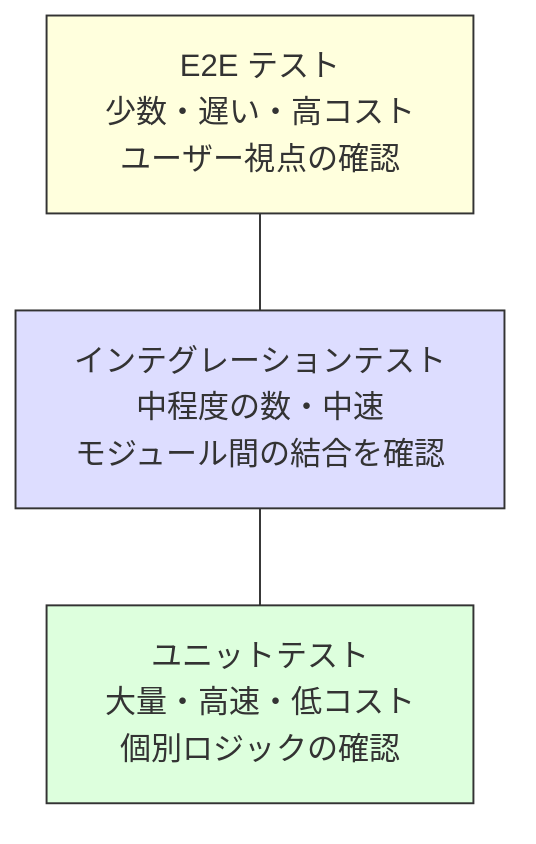
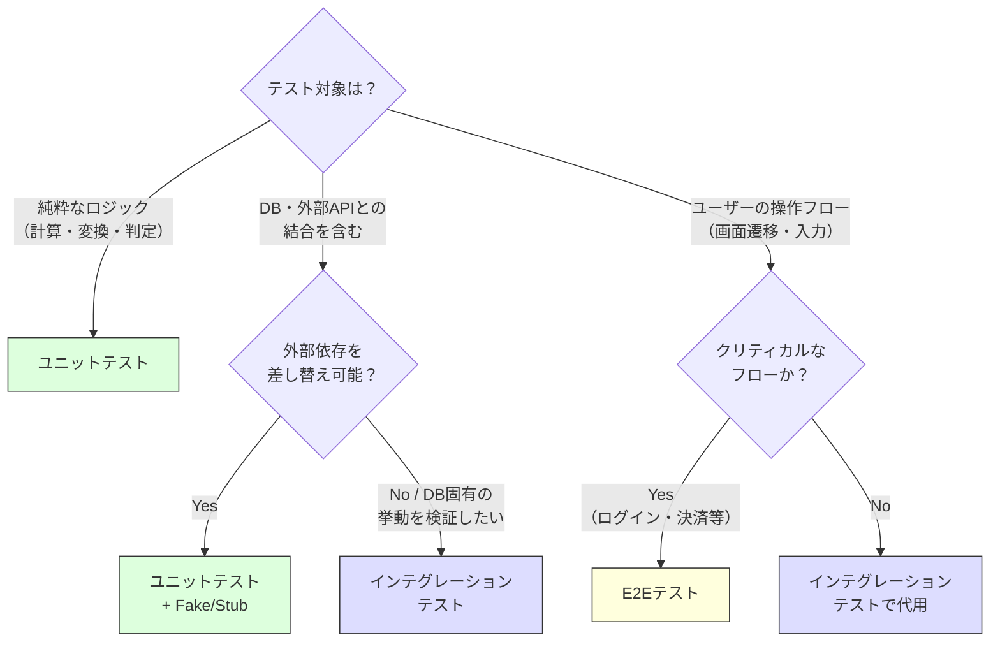

# テスト戦略

> **一言で言うと:** ユニットテスト（速い・安い・狭い）、インテグレーションテスト（中間）、E2Eテスト（遅い・高い・広い）のピラミッド構造で品質を多層的に守る。「何をどのレベルでテストするか」の判断が設計力そのもの。

## 3分で全体像

- **何を解決する技術か:** 「変更のたびに手動で全機能を確認する」「リファクタが怖くて触れない」「バグの原因特定にシステム全体の調査が必要」というソフトウェア寿命の短縮要因を、レベル別の自動テストで構造的に止める
- **代表的な使用シーン:** ビジネスロジックの境界値・異常系のユニットテスト、Repository → DB のインテグレーションテスト、決済 / ログイン / 注文確定など重要フローの E2E テスト、リファクタ前のセーフティネット構築、リグレッション防止、TDD（赤→緑→リファクタ）でのドメインロジック設計
- **これだけは覚える3つ:**
    1. **テストピラミッドはコストとフィードバック速度の最適化** — ユニット（ミリ秒・狭い）を厚く、インテグレーション（秒・中間）を中程度、E2E（分・広い）を最小限に。逆ピラミッド（E2E ばかり）はフィードバック遅延・フレイキー・原因特定困難の三重苦を招く
    2. **「カバレッジ 100%」は目的ではない** — カバレッジは「実行された行」を測るだけで、アサーションがなくても上がる。**意味のある検証**（境界値・異常系・ビジネスルール）の有無の方が桁違いに重要。リスクの高い箇所（金額計算 / 権限チェック / 状態遷移）を優先する
    3. **モックは「システムの境界」にだけ使う** — DB / 外部 API / メールなどの**外部依存**はモック / Fake で差し替えてよい。**内部のクラス間連携**をモックすると実装の詳細にテストが密結合し、リファクタのたびに壊れる。「メソッド A が B を 3 回呼ぶこと」のテストは典型的なアンチパターン
- **AIに任せやすいか:** **一部任せられる** — テンプレ通りの AAA（Arrange-Act-Assert）、テーブル駆動テスト、境界値の網羅は AI が高品質に書ける。一方で **「何をどのレベルでテストするか」「モックを使うべきかフェイクを使うべきか」「フレイキーテストの根本原因」** はコードと文脈を踏まえた人間判断が必要。AI は **モックだらけ / Happy path のみ / privateメソッド直接テスト** にバイアスがあり、生成されたテストの**モック依存数**と**異常系の網羅**を必ず疑う
- **詰まったらここを読む:** [[SOLID原則]] / [[CI-CD]] / [[関心の分離]]

## なぜ必要か

ソフトウェアは変更され続ける。テスト戦略がなければ:

- **変更のたびに手動で全機能を確認する** — 機能が増えるほど確認工数が爆発し、リグレッション（既存機能の破壊）を見逃す。チェックリストを人間が毎回正確に実行し続けるのは不可能
- **リファクタリングが怖くてできない** — 「動いているコードを触るな」という空気が生まれ、技術的負債が蓄積する。コードの改善が不可能になった時点で、プロダクトの寿命が決まる
- **バグの原因特定に時間がかかる** — テストがなければ「どの層のどのロジックが壊れたか」の切り分けができず、デバッグがシステム全体の調査になる
- **[[CI-CD]]が無意味になる** — 自動テストなしの CI/CD パイプラインは「壊れたコードを高速に本番へ届ける」仕組みにすぎない

## どの問題を解決するか

### 問題1: テストのレベルをどう使い分けるか — テストピラミッド

異なるレベルのテストには異なるトレードオフがある。テストピラミッドはその配分を示す。


```mermaid
graph TD
    E2E["E2E テスト<br/>少数・遅い・高コスト<br/>ユーザー視点の確認"]
    INT["インテグレーションテスト<br/>中程度の数・中速<br/>モジュール間の結合を確認"]
    UNIT["ユニットテスト<br/>大量・高速・低コスト<br/>個別ロジックの確認"]

    E2E --- INT --- UNIT

    style UNIT fill:#dfd,stroke:#333
    style INT fill:#ddf,stroke:#333
    style E2E fill:#ffd,stroke:#333
```

| レベル | 速度 | コスト | 信頼性 | スコープ | 障害の局所化 |
|--------|------|--------|--------|----------|-------------|
| ユニット | ミリ秒 | 低 | 高（決定的） | 関数/クラス | ピンポイント |
| インテグレーション | 秒 | 中 | 中 | モジュール間/DB | モジュール単位 |
| E2E | 秒〜分 | 高 | 低（フレイキー） | システム全体 | 広範囲 |

**解決方法:** ユニットテストを厚くし、上のレベルほど数を絞る。ユニットテストで個々のロジックの正しさを保証し、インテグレーションテストで結合の正しさを確認し、E2Eテストで最も重要なユーザーシナリオだけを検証する。

### 問題2: 何をテストすべきか

全てのコードにテストを書くのは非現実的。限られたリソースでどこにテストを集中すべきか。

**解決方法:** テストの価値はリスクの高さに比例する。以下を優先的にテストする:
- **ビジネスロジック** — 金額計算、権限チェック、状態遷移。バグが直接的な損害をもたらす
- **境界条件** — 空配列、null、0件、上限値。ここにバグが集中する
- **バグの再発防止** — 過去に発生したバグに対するリグレッションテスト
- **複雑な条件分岐** — 人間が読んで正しさを判断しにくい箇所

### 問題3: 外部依存をどう扱うか

DB、外部API、ファイルシステムなどの外部依存があるとテストが遅く・不安定になる。

**解決方法:** [[テストダブル]]（Test Double）を使い分ける:
- **スタブ（Stub）** — 固定値を返す。外部APIの応答をシミュレート
- **モック（Mock）** — 呼び出しを検証する。「この関数が正しい引数で呼ばれたか」を確認
- **フェイク（Fake）** — 簡易実装を提供する。インメモリDBなど。本物に近い振る舞い

ただし**モックの過剰使用は実装への密結合を生む**。モックは「境界」に対して使い、内部の実装詳細はモックしない。

## 他の仕組みとどう関係するか

- **下位レイヤーとの関係:**
  - [[RDB]] — インテグレーションテストではテスト用DBを使い、マイグレーション・クエリの正しさを実際のDBで検証する。SQLiteで代用するとDB固有の挙動差によるバグを見逃す
  - [[Docker|コンテナ]] — テスト用DB・Redis等の外部依存をコンテナで立ち上げることで、CI環境でもインテグレーションテストを再現性高く実行できる
  - [[バリデーション]] — 入力バリデーションのロジックはユニットテストで網羅的にカバーすべき最優先対象。境界値テストが特に重要
  - [[認証と認可]] — 認可ロジック（権限チェック）はユニットテストで、認証フロー全体はインテグレーションテストで確認する

- **同レイヤーとの関係:**
  - [[CI-CD]] — テスト戦略はCI/CDパイプラインの設計と一体。ユニットテストはpushごとに、E2Eテストはデプロイ前にのみ実行するなど、実行タイミングの設計が必要
  - [[SOLID原則]] — DIP（依存性逆転）によって外部依存をインターフェースで抽象化すると、テスト時にモックやフェイクへの差し替えが容易になる。テストしにくいコードはSOLID違反のサイン
  - [[関心の分離]] — 関心が適切に分離されたコードは、ユニットテストの単位が自然に定まる。テストのセットアップが複雑な場合は関心が混ざっている証拠
  - [[モノリスvsマイクロサービス]] — マイクロサービスではサービス間の契約テスト（Contract Testing）が新たに必要になる。Consumer-Driven Contracts（CDC）パターンが有効

- **上位レイヤーとの関係:**
  - 最上位レイヤーのため直接の上位はない

## 誤解されやすいポイント

### 1. 「カバレッジが高ければ品質は高い」わけではない

カバレッジ100%を目標にすると、テスト自体が目的化する。カバレッジは「実行された行」を測るだけで、「正しく検証された」ことを意味しない。アサーションなしでコードを通過させてもカバレッジは上がる。カバレッジは「テストされていない箇所の発見」には有用だが、品質の指標としては不十分。

### 2. 「ユニットテスト = クラス/関数ごとのテスト」と固定しない

ユニットテストの「ユニット」は「1つのクラス」を意味するとは限らない。「ユニット」は**振る舞いの単位**であり、複数のクラスが協調して1つの振る舞いを実現するなら、それをまとめてテストしてよい。クラスごとに分離してモックだらけにするより、振る舞い単位のテストの方が変更に強い。

### 3. 「E2Eテストで全てカバーすれば安心」ではない

E2Eテストは最も本番に近い検証だが、最も遅く・不安定（フレイキー）で・原因特定が困難。E2Eテストだけに頼ると:
- テストの実行に数十分かかりフィードバックが遅い
- ネットワークやタイミングに起因する偽の失敗が頻発する
- 失敗時に「UI? API? DB? 外部サービス?」の切り分けに時間がかかる

E2Eテストは最も重要なユーザーフロー（ログイン、決済、登録）に絞るべき。

### 4. 「モックを使えばテストが速くて簡単になる」は両刃の剣

モックは外部依存を切り離す手段だが、**モックが実装の詳細に依存すると、リファクタリングのたびにテストが壊れる**。「メソッドAがメソッドBを3回呼ぶこと」を検証するテストは、内部実装が変わるだけで失敗する。テストは**入力と出力（振る舞い）を検証すべき**であり、内部の呼び出し順序を検証すべきではない。

## 設計のベストプラクティス

### 推奨パターン

**1. テストは振る舞いを検証する（実装ではなく）**

テストは「何をするか（What）」を検証し、「どうやるか（How）」は検証しない。これにより、実装を変更してもテストが壊れにくくなる。

**2. Arrange-Act-Assert（AAA）パターン**

テストの構造を3段階に統一する:
- **Arrange（準備）** — テスト対象の状態をセットアップ
- **Act（実行）** — テスト対象のメソッドを呼び出す
- **Assert（検証）** — 結果が期待通りか確認

**3. テストの独立性を保つ**

各テストは他のテストの実行結果に依存しない。テスト間で状態を共有しない。実行順序に関係なく全テストがパスする。

**4. 失敗するテストを先に書く（TDD の赤→緑→リファクタ）**

テスト駆動開発（Test-Driven Development）のサイクル:
1. 失敗するテストを書く（赤）
2. テストを通す最小限のコードを書く（緑）
3. コードを整理する（リファクタ）

全てのコードにTDDを適用する必要はないが、複雑なビジネスロジックには特に効果的。

### アンチパターン

**1. テストの共有フィクスチャ** — 全テストで同じセットアップデータを共有する。1つのテストのために追加したデータが他のテストを壊す。テストごとに必要なデータだけをセットアップする。

**2. 実装の詳細テスト** — privateメソッドを直接テストする、呼び出し回数を検証する。リファクタリングのたびにテストが壊れる。publicなインターフェースの振る舞いだけを検証する。

**3. フレイキーテストの放置** — 時々失敗するテストを放置すると、チーム全体が失敗を無視するようになる。フレイキーテストは即座に修正するか、一時的に隔離して対処する。

## AIエージェントとの協働

> このトピックでAIコーディングエージェント（Claude Code, Copilot, Cursor 等）と協働するための観点。
> **「AIに何をどこまで任せ、AIに何をレビューさせ、人間は何を最終判断するか」**を整理する。実装だけでなく**レビューもAIに任せられる**前提で考える（AIコードレビュー観点で横断アンチパターン照合を行う）。

### AIに任せられる部分 / 人間が判断すべき部分

| タスク種類 | 任せ方（実装/レビュー） | 人間の関与 |
|---|---|---|
| 境界値・異常系のテストケース網羅 | **実装もレビューも AI 主導** — 「空配列 / null / 0 / 上限値 / マイナス値」の網羅は AI が定型化。テーブル駆動テストの生成も得意 | ビジネスルール固有の境界（消費税 8%/10% の境目、和暦の元号変わり目）を伝える |
| AAA パターンでのユニットテスト書き起こし | **実装は AI 主導** — 関数 / メソッドを渡せば AAA 形式で生成 | 「何を検証すべきか」（振る舞いの定義）は人間が言語化する |
| Fake 実装の作成 | **実装は AI 主導** — `FakeUserRepository` のようなインメモリ実装の生成は定型 | 「どこに Fake を置くか」「どこでモックを使うか」の境界線は人間が決める |
| テストレベルの振り分け（Unit / Integration / E2E） | **AI レビュー併用** — AIコードレビュー観点で「これは Integration になっているが Unit に下ろせるか」を問う | **人間が最終判断** — DB 固有の挙動を検証したい / モック差し替え可能か / 並列実行できるかで決める |
| フレイキーテストの根本原因特定 | **AI に診断させる** — テストコードと失敗ログを渡せば原因候補を出せる | **人間が最終判断** — タイミング依存 / 順序依存 / 外部依存のうち、どれが真因かはコード文脈と実行環境に依存 |
| カバレッジ目標の設定 | **AI に任せない** — AI は機械的に「100% を目指せ」と言いがち | **完全に人間判断** — リスクとコストのバランスで設定。クリティカル箇所は高めに、UI / 試作箇所は低めに |
| Mutation Testing の適用箇所判断 | **AI に提案させる** — 重要箇所の特定は AI に補助させられる | **人間が最終判断** — ビジネスインパクトの評価は人間 |

### AI生成コードのレビュー観点（このトピック固有）

AI生成物を受け取ったとき、最低限ここを見る。

1. **モックだらけになっていないか** — 全依存を Mock 化したテストは、実質「モックが正しく動くか」をテストしているだけ。**本物の結合バグを検出できない**。境界（DB / 外部 API）以外をモックしているなら Fake / 実物に差し替えを検討。`when(...).thenReturn(...)` が 5 箇所以上あれば疑う
2. **private メソッドや内部呼び出し順を検証していないか** — 「`a()` の中で `b()` が呼ばれた」「呼び出し回数 3 回」を検証するテストは**実装の詳細に密結合**しており、リファクタで壊れる。**入力 → 出力の振る舞い**を検証するテストに書き直す
3. **異常系 / 境界値が網羅されているか** — AI は **Happy path のみ**を生成しがち。空配列・null・0 件・上限値超え・並行アクセス・タイムアウト・例外発生時の挙動が抜けていないか確認。バグは境界に集中する

### 効くプロンプトの型

このトピックに関する実装をAIに依頼するとき、コンテキストとして渡すべき情報・制約・成功基準のテンプレ。

```
# 前提（プロジェクトの状況・既存のコード規約）
- フレームワーク: Vitest（TypeScript）
- 既存方針: ユニットテストは Fake 実装で外部依存を差し替え。Mock は最小限（境界のみ）
- カバレッジ目標: 重要なドメインロジック 90%、UI 60%、全体 75%
- テスト命名規約: `should_<期待される結果>_when_<前提>`

# やってほしいこと
- OrderService.placeOrder() のユニットテスト一式

# 守ってほしい制約（このトピック固有のもの）
- AAA パターン（Arrange / Act / Assert）で構造化
- 内部の呼び出し順序ではなく、入力 → 出力の振る舞いを検証
- 外部依存（PaymentGateway / EmailService）は Fake 実装を作成して注入
- private メソッドは直接テストしない
- 境界値（空配列 / 在庫 0 / 金額 0 / 上限超過）と異常系（決済失敗 / DB 切断）を必ず含める
- Happy path だけのテストは生成しない

# 完了の判断基準
- 各 it() がビジネスルール 1 つを検証（仕様書として読める）
- Mock は境界の PaymentGateway / EmailService のみ
- 「決済成功 → 注文確定 → 通知発行」の正常系 + 「決済失敗 → ロールバック」の異常系を含む
- Fake 実装が再利用可能な形で別ファイルに切り出されている
```

### AI実装のアンチパターン

LLM生成コードで頻出する過剰設計・誤用パターン。レビュー時の照合表として使う。

| アンチパターン | なぜ問題か | レビュー観点 / 対策 |
|---|---|---|
| 全メソッドに1対1でテスト生成 | privateメソッドや内部実装をテストしてしまう。リファクタリングでテストが大量に壊れる | 公開インターフェースの振る舞い単位でテストを書く |
| モックだらけのユニットテスト | 全依存をモックし、実質的に「モックが正しく動くこと」をテストしている。本物の結合での不具合を検出できない | 境界（外部API・DB）のみモック。内部の協調はそのままテストする |
| テスト名が `test1`, `test2` | 失敗時に何が壊れたか分からない。テスト名は仕様の文書 | `should_return_error_when_email_is_invalid` のように振る舞いを記述 |
| Happy path のみテスト生成 | 正常系だけテストし、異常系・境界値を無視。バグは境界に集中する | 各テストに異常系・境界値のテストケースを必ず含める |
| 共有フィクスチャの使い回し | `beforeAll` でテストデータを一括作成し、複数テストで共有。1 つのテストの変更が他テストを壊す | `beforeEach` でテストごとにクリーンセットアップ |
| 順序依存のテスト | テスト A が実行された後でないとテスト B が通らない。並列実行で破綻 | 各テストは独立。実行順序に依存しない |
| カバレッジ追求でアサーションなし | カバレッジ稼ぎのためにコードを実行するだけのテスト。バグを検出できない | 各テストに意味のある `expect()` / `assert` を必ず含める |
| フレイキーテストを `retry: 3` で誤魔化す | 失敗を retry で隠蔽し、根本原因（タイミング依存・外部依存・並行アクセス）が放置される | 真因を特定し修正する。retry は最終手段 |
| 実 DB を使わずに ORM の SQL 生成だけテスト | DB 固有のクエリ挙動（インデックス効率 / トランザクション分離レベル）が検証されない | Integration テストで実 DB（PostgreSQL コンテナ）を使う |

→ レイヤー横断のアンチパターン索引: [[_anti-patterns/_index|AIアンチパターン索引]]

## 具体例

### ユニットテスト — 振る舞いを検証する（TypeScript / Vitest）

```typescript
import { describe, it, expect } from 'vitest';

// テスト対象: 注文の合計金額計算
function calculateTotal(items: { price: number; quantity: number }[]): number {
  return items.reduce((sum, item) => sum + item.price * item.quantity, 0);
}

function applyDiscount(total: number, discountRate: number): number {
  if (discountRate < 0 || discountRate > 1) {
    throw new Error('割引率は0〜1の範囲で指定してください');
  }
  return Math.round(total * (1 - discountRate));
}

describe('calculateTotal', () => {
  // 正常系
  it('should sum price * quantity for all items', () => {
    const items = [
      { price: 100, quantity: 2 },
      { price: 500, quantity: 1 },
    ];
    expect(calculateTotal(items)).toBe(700);
  });

  // 境界値
  it('should return 0 for empty array', () => {
    expect(calculateTotal([])).toBe(0);
  });
});

describe('applyDiscount', () => {
  it('should apply 10% discount', () => {
    expect(applyDiscount(1000, 0.1)).toBe(900);
  });

  // 異常系
  it('should throw for negative discount rate', () => {
    expect(() => applyDiscount(1000, -0.1)).toThrow('割引率は0〜1の範囲');
  });

  // 境界値
  it('should return 0 for 100% discount', () => {
    expect(applyDiscount(1000, 1)).toBe(0);
  });

  it('should return original amount for 0% discount', () => {
    expect(applyDiscount(1000, 0)).toBe(1000);
  });
});
```

### インテグレーションテスト — DBとの結合を検証する（TypeScript / Vitest）

```typescript
import { describe, it, expect, beforeEach } from 'vitest';
import { db } from './db'; // 実際のテスト用DB接続

describe('UserRepository', () => {
  beforeEach(async () => {
    // テストごとにクリーンな状態にする
    await db.query('DELETE FROM users');
  });

  it('should create and retrieve a user', async () => {
    // Arrange
    const repo = new UserRepository(db);

    // Act
    const created = await repo.create({
      name: 'テスト太郎',
      email: 'taro@example.com',
    });
    const found = await repo.findById(created.id);

    // Assert
    expect(found).toEqual({
      id: created.id,
      name: 'テスト太郎',
      email: 'taro@example.com',
    });
  });

  it('should return null for non-existent user', async () => {
    const repo = new UserRepository(db);
    const found = await repo.findById('non-existent-id');
    expect(found).toBeNull();
  });
});
```

### テストダブルの使い分け

```typescript
// --- Stub: 固定値を返す ---
class StubEmailService implements EmailService {
  async send(_to: string, _subject: string, _body: string) {
    // 何もしない（送信成功を装う）
  }
}

// --- Fake: 簡易実装を提供する ---
class FakeUserRepository implements UserRepository {
  private users = new Map<string, User>();

  async create(data: CreateUserInput): Promise<User> {
    const user = { id: crypto.randomUUID(), ...data };
    this.users.set(user.id, user);
    return user;
  }

  async findById(id: string): Promise<User | null> {
    return this.users.get(id) ?? null;
  }
}

// --- テストでの使用 ---
it('should register user and send welcome email', async () => {
  const emailService = new StubEmailService();
  const userRepo = new FakeUserRepository();
  const service = new UserService(userRepo, emailService);

  const user = await service.register({
    name: '田中',
    email: 'tanaka@example.com',
  });

  // 振る舞いを検証（実装の詳細ではなく結果を確認）
  const saved = await userRepo.findById(user.id);
  expect(saved?.name).toBe('田中');
});
```

### 各言語のテストフレームワーク例

#### Go（testing パッケージ / テーブル駆動テスト）

```go
package order

import "testing"

// 注文の合計金額を計算する
func CalcTotal(unitPrice int, quantity int, discountRate float64) int {
	total := float64(unitPrice*quantity) * (1 - discountRate)
	return int(total)
}

func TestCalcTotal(t *testing.T) {
	// テーブル駆動テスト: ケースを宣言的に列挙する
	tests := []struct {
		name         string
		unitPrice    int
		quantity     int
		discountRate float64
		want         int
	}{
		{"割引なし", 1000, 3, 0.0, 3000},
		{"10%割引", 1000, 3, 0.1, 2700},
		{"数量1・割引なし", 500, 1, 0.0, 500},
	}

	for _, tt := range tests {
		t.Run(tt.name, func(t *testing.T) {
			got := CalcTotal(tt.unitPrice, tt.quantity, tt.discountRate)
			if got != tt.want {
				t.Errorf("CalcTotal(%d, %d, %.1f) = %d, want %d",
					tt.unitPrice, tt.quantity, tt.discountRate, got, tt.want)
			}
		})
	}
}
```

#### PHP（PHPUnit）

```php
<?php
// 注文の合計金額を計算するクラス
class OrderCalculator
{
    public function calcTotal(
        int $unitPrice,
        int $quantity,
        float $discountRate = 0.0
    ): int {
        return (int) ($unitPrice * $quantity * (1 - $discountRate));
    }
}

// --- テスト ---
use PHPUnit\Framework\TestCase;

class OrderCalculatorTest extends TestCase
{
    private OrderCalculator $calc;

    protected function setUp(): void
    {
        $this->calc = new OrderCalculator();
    }

    public function test_割引なしの合計(): void
    {
        $this->assertSame(3000, $this->calc->calcTotal(1000, 3));
    }

    public function test_10パーセント割引(): void
    {
        $this->assertSame(2700, $this->calc->calcTotal(1000, 3, 0.1));
    }

    public function test_数量1_割引なし(): void
    {
        $this->assertSame(500, $this->calc->calcTotal(500, 1));
    }
}
```

#### Python（pytest / パラメータ化テスト）

```python
# 注文の合計金額を計算する
def calc_total(unit_price: int, quantity: int, discount_rate: float = 0.0) -> int:
    return int(unit_price * quantity * (1 - discount_rate))


# --- テスト ---
import pytest

@pytest.mark.parametrize(
    "unit_price, quantity, discount_rate, expected",
    [
        (1000, 3, 0.0, 3000),   # 割引なし
        (1000, 3, 0.1, 2700),   # 10%割引
        (500,  1, 0.0, 500),    # 数量1・割引なし
    ],
)
def test_calc_total(unit_price, quantity, discount_rate, expected):
    assert calc_total(unit_price, quantity, discount_rate) == expected


def test_デフォルトは割引なし():
    """discount_rate を省略すると割引なしで計算される"""
    assert calc_total(1000, 2) == 2000
```

#### Ruby（RSpec）

```ruby
# 注文の合計金額を計算する
def calc_total(unit_price, quantity, discount_rate = 0.0)
  (unit_price * quantity * (1 - discount_rate)).to_i
end

# --- テスト ---
RSpec.describe '#calc_total' do
  [
    { unit_price: 1000, quantity: 3, discount_rate: 0.0, expected: 3000, label: '割引なし' },
    { unit_price: 1000, quantity: 3, discount_rate: 0.1, expected: 2700, label: '10%割引' },
    { unit_price: 500,  quantity: 1, discount_rate: 0.0, expected: 500,  label: '数量1・割引なし' },
  ].each do |t|
    it "#{t[:label]}: #{t[:expected]}円" do
      expect(calc_total(t[:unit_price], t[:quantity], t[:discount_rate])).to eq(t[:expected])
    end
  end

  it 'デフォルトは割引なし' do
    expect(calc_total(1000, 2)).to eq(2000)
  end
end
```

### テストレベルの選択ガイド


```mermaid
flowchart TD
    Q1{"テスト対象は？"} -->|"純粋なロジック<br/>（計算・変換・判定）"| UNIT["ユニットテスト"]
    Q1 -->|"DB・外部APIとの<br/>結合を含む"| Q2{"外部依存を<br/>差し替え可能？"}
    Q2 -->|"Yes"| UNIT_FAKE["ユニットテスト<br/>+ Fake/Stub"]
    Q2 -->|"No / DB固有の<br/>挙動を検証したい"| INT["インテグレーション<br/>テスト"]
    Q1 -->|"ユーザーの操作フロー<br/>（画面遷移・入力）"| Q3{"クリティカルな<br/>フローか？"}
    Q3 -->|"Yes<br/>（ログイン・決済等）"| E2E["E2Eテスト"]
    Q3 -->|"No"| INT2["インテグレーション<br/>テストで代用"]

    style UNIT fill:#dfd,stroke:#333
    style UNIT_FAKE fill:#dfd,stroke:#333
    style INT fill:#ddf,stroke:#333
    style INT2 fill:#ddf,stroke:#333
    style E2E fill:#ffd,stroke:#333
```

## 参考リソース

- *Unit Testing: Principles, Practices, and Patterns* — Vladimir Khorikov（「良いテストとは何か」を体系化。振る舞いテスト vs 実装テストの議論が秀逸）
- *Growing Object-Oriented Software, Guided by Tests* — Steve Freeman, Nat Pryce（TDDの実践書。外側からテストを書く手法）
- *Working Effectively with Legacy Code* — Michael Feathers（テストのないレガシーコードにテストを追加する技法）
- Martin Fowler "TestPyramid" — martinfowler.com（テストピラミッドの概念の解説）
- Kent Beck "Test Desiderata" — テストが備えるべき12の性質のリスト

## 理解度セルフチェック

> 答えられなければ本文に戻る。答えはこのファイル内に必ずある。

1. テストピラミッドにおいて、E2E テストを最少にしてユニットテストを最も多くすべき理由を、「速度」「コスト」「フレイキー性」「障害の局所化」の 4 つの観点から 30 秒で説明してみよう
2. 「カバレッジ 100% を達成しているのにバグが本番で発生する」という状況がなぜ起こりうるか、カバレッジの定義と「意味のある検証」の違いを踏まえて説明せよ
3. AI が次のテストコードを生成した。テスト戦略の観点で問題点を 3 つ指摘し、修正方針を答えよ
   ```typescript
   import { describe, it, expect, vi } from 'vitest';

   describe('UserService', () => {
     it('test1', async () => {
       const repo = { findById: vi.fn(), create: vi.fn(), update: vi.fn() };
       const emailService = { send: vi.fn() };
       const logger = { info: vi.fn(), error: vi.fn() };
       const cache = { get: vi.fn(), set: vi.fn() };
       const validator = { validate: vi.fn().mockReturnValue(true) };

       repo.findById.mockResolvedValue({ id: '1', name: 'Alice' });

       const service = new UserService(repo, emailService, logger, cache, validator);
       const user = await service.getUser('1');

       expect(user.name).toBe('Alice');
       expect(repo.findById).toHaveBeenCalledTimes(1);
       expect(repo.findById).toHaveBeenCalledWith('1');
       expect(logger.info).toHaveBeenCalledTimes(1);
     });
   });
   ```

> [!note]- 解答の指針
>
> > [!info] 用語ミニ辞典
> > - **テストピラミッド**: ユニット（多）→ インテグレーション（中）→ E2E（少）の三角形構成。Mike Cohn が提唱
> > - **ユニットテスト**: 関数 / クラス単位の振る舞い検証。ミリ秒で完結し外部依存を持たない
> > - **インテグレーションテスト**: 複数モジュールの結合動作（特に DB / 外部 API との連携）を検証
> > - **E2E テスト（End-to-End）**: ユーザー視点でシステム全体を通した動作を検証。ブラウザ自動化（Playwright / Cypress）でログイン → 操作 → 確認の流れを再現
> > - **テストダブル（Test Double）**: テスト用の代替実装の総称。Stub（固定値返却）・Mock（呼び出し検証）・Fake（簡易実装）・Spy（呼び出し記録）の 4 種が代表
> > - **Mock**: 「メソッド A が引数 X で呼ばれた」を検証するテストダブル。実装詳細に密結合しがち
> > - **Fake**: 本物に近い簡易実装（例: インメモリ DB）。実装の詳細を隠蔽し振る舞いを検証できる
> > - **AAA パターン（Arrange-Act-Assert）**: テストを「準備 → 実行 → 検証」の 3 段階で構造化する書き方
> > - **TDD（Test-Driven Development）**: 失敗するテストを先に書く（赤）→ 通す最小コードを書く（緑）→ リファクタの順序で開発する手法
> > - **フレイキーテスト**: 同じコードでも実行ごとに成否がぶれるテスト。タイミング依存・順序依存・外部依存が原因
> > - **Mutation Testing**: コードを意図的に壊して（mutate）テストが検出するか確認する手法。テストの実効品質を測る
>
> 1. **速度**: ユニットはミリ秒単位、E2E は秒〜分単位。1000 個のユニットは数秒で完了するが、10 個の E2E でも数分かかる。**フィードバックループの速さ**が開発速度を決める
>
>    **コスト**: ユニットは 1 関数のセットアップで済むが、E2E はブラウザ起動・テストデータ投入・DB クリーンアップ・複数サービスの起動が必要。**書く・維持するコスト**が桁違い
>
>    **フレイキー性**: ユニットは外部依存がないため決定的だが、E2E はネットワーク遅延・タイミング・ブラウザの非同期処理で**偽の失敗**が頻発。3 回に 1 回失敗するテストは**信頼性の意味で機能していない**
>
>    **障害の局所化**: ユニットが失敗すれば**どの関数のどのケース**かが即座に分かるが、E2E が失敗すると「UI? API? DB? 外部サービス? ネットワーク?」の切り分けに時間がかかる
>
>    **結論**: 「**疑似的な広いカバー**を E2E で得る」より「**確実な狭いカバー**をユニットで重ねる」方がコスト対効果が高い。E2E は**ログイン / 決済 / 注文確定**など最重要ユーザーフローに限定する
>
> 2. **カバレッジの定義**: 「テスト実行時にどのコード行 / ブランチが実行されたか」を測る指標。**`expect(...)` / `assert` の有無は問わない**ため、コードを通過させるだけでも 100% に到達できる
>
>    **意味のある検証 vs カバレッジ**: 例えば次のテストはカバレッジ 100% に貢献するが、何も検証していない:
>    ```typescript
>    it('test', () => {
>      const result = calculateTax(1000, 0.1);
>      // expect なし — result が何でも合格
>    });
>    ```
>    `calculateTax` が `return 0;` でも `return NaN;` でもこのテストは合格する。**バグを検出する力（テストの実効品質）**は、アサーションの内容に依存する
>
>    **本番でバグが起きる典型シナリオ**:
>    - **アサーション不足**: 上記のように expect 漏れ
>    - **境界値の検証漏れ**: 100% カバレッジでも「金額 0 / 負数 / 整数オーバーフロー」が未検証
>    - **並行性のバグ**: 単体実行では通るが、本番の並行アクセスで race condition が発生
>    - **環境差異**: テスト環境の SQLite で通ったクエリが本番 PostgreSQL で違う挙動
>    - **モック過剰**: モックされたコンポーネント間の本物の結合では発覚するバグ
>
>    **対策**: カバレッジを**目標**ではなく**未テスト箇所の発見ツール**として使う。「どの行が未実行か」を確認し、そこに**意味のあるテスト**を追加する。Mutation Testing でテストの実効品質を別軸で測る
>
> 3. **問題点と修正方針**:
>
>    1. **テスト名が `test1`**: 何を検証しているか不明。**修正**: `should_return_user_when_id_exists` のように振る舞いを記述
>    2. **モックだらけ（5 つ全てが Mock）**: `repo` / `emailService` / `logger` / `cache` / `validator` 全てをモック。実質「モックが正しく動くか」のテストでしかない。**修正**: 境界（外部 API / DB）のみモック。`emailService` / `logger` は本物 or Fake、内部の `validator` はそのまま使う
>    3. **実装の詳細を検証**: `repo.findById.toHaveBeenCalledTimes(1)` `logger.info.toHaveBeenCalledTimes(1)` は内部の呼び出し順序・回数を検証しており、リファクタで壊れる。例えばキャッシュを追加して `findById` が呼ばれなくなるとテスト失敗。**修正**: 振る舞い（戻り値の `user.name === 'Alice'`）のみ検証。`logger` の呼び出し回数は検証対象から削除
>    4. **AAA 構造の不在**: Arrange / Act / Assert の境界が不明確。**修正**: コメントまたは空行で 3 段階を明示
>    5. **Happy path のみ**: 「ユーザーが存在しない場合」「DB エラー時」「不正な ID（空文字 / null）」の異常系がない。**修正**: 異常系を別 `it()` で追加
>
>    **修正後のイメージ**:
>    ```typescript
>    describe('UserService.getUser', () => {
>      it('should_return_user_when_id_exists', async () => {
>        // Arrange
>        const repo = new FakeUserRepository();
>        await repo.create({ id: '1', name: 'Alice' });
>        const service = new UserService(repo, new FakeEmailService());
>
>        // Act
>        const user = await service.getUser('1');
>
>        // Assert
>        expect(user.name).toBe('Alice');
>      });
>
>      it('should_return_null_when_id_does_not_exist', async () => {
>        const repo = new FakeUserRepository();
>        const service = new UserService(repo, new FakeEmailService());
>        expect(await service.getUser('non-existent')).toBeNull();
>      });
>
>      it('should_throw_when_id_is_empty', async () => {
>        const service = new UserService(new FakeUserRepository(), new FakeEmailService());
>        await expect(service.getUser('')).rejects.toThrow('id required');
>      });
>    });
>    ```
>
>    **思考プロセス**: AI 生成テストは**カバレッジ稼ぎ + 実装追従**の傾向が強い。「**このテストはどんなバグを検出するか**」を毎回問い、答えがなければそのテストは削除候補。テストは仕様書として読める粒度で書く

## 学習メモ

- テストの価値は「変更への自信」を与えること。テストがなければリファクタリングも機能追加もギャンブルになる
- 「テストを書く時間がない」は逆。テストがないから手動確認に時間がかかり、バグ修正に時間がかかる。テストは投資であり、長期的には時間を節約する
- モックの使いどころは「システムの境界」。内部のクラス間連携をモックするのは実装への密結合
- テスト名は仕様書。`should_reject_order_when_stock_is_zero` のように「何が起きるべきか」を書く
