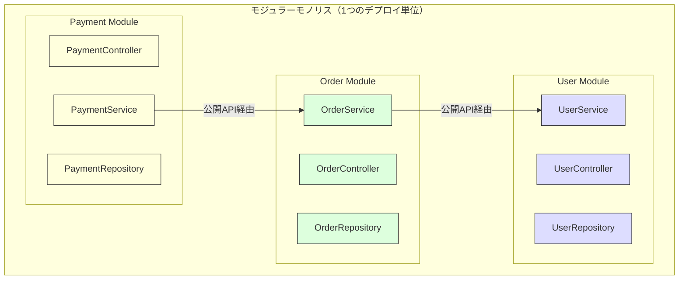
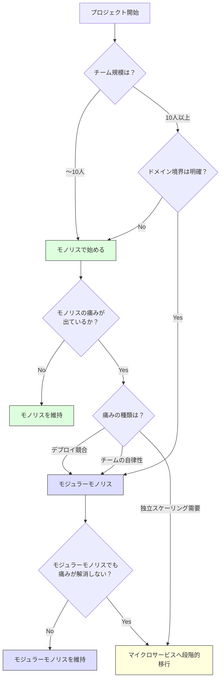

# モノリスvsマイクロサービス

> **一言で言うと:** 最初からマイクロサービスにするのはほぼ間違い。モノリスの「デプロイが一体」「変更の影響が波及する」という問題が**実際に痛みになってから**分割を検討する。

## なぜ必要か

アプリケーションのアーキテクチャには「1つの塊として構築・デプロイする（モノリス）」か「独立した小さなサービスに分割する（マイクロサービス）」かという根本的な選択がある。この選択を誤ると:

- **モノリスのまま放置しすぎた場合** — コードベースの肥大化で変更速度が低下し、チーム間のコンフリクトが常態化する。1行の修正でも全体をデプロイし直す必要がある
- **早すぎるマイクロサービス化** — ドメイン境界が固まっていない段階で分割すると、サービス間の頻繁なやり取りが発生し、モノリスより遥かに複雑な分散システムの問題（ネットワーク障害、データ整合性、デバッグの困難さ）を抱え込む

どちらを選ぶかは技術的な問題だけでなく、**チーム規模・組織構造・ビジネスの成長フェーズ**という文脈に依存する判断である。

## どの問題を解決するか

### モノリスが解決する問題

**問題:** 開発初期は「速く作って検証する」ことが最優先。サービス間通信やデプロイパイプラインの設計に時間を費やす余裕はない。

**解決方法:** 1つのコードベース・1つのデプロイ単位に全てを収める。

- 関数呼び出しで処理を連携できるため、通信のオーバーヘッドがない
- トランザクションで[[RDB]]のACID特性をそのまま活用できる
- デバッグはスタックトレースを追うだけで完結する
- 開発環境のセットアップが単純

### マイクロサービスが解決する問題

モノリスが成長して生じる以下の痛みを解決する:

**問題1: デプロイの結合**
小さな修正でも全体をデプロイする必要があり、リリース頻度が下がる。ある機能のデプロイ失敗が全体をロールバックさせる。

**解決:** サービスごとに独立してデプロイできるため、変更を小さく頻繁にリリースできる。

**問題2: チームのスケーリング**
50人以上の開発者が1つのコードベースで作業すると、コンフリクト・ビルド時間・テスト時間が深刻になる。

**解決:** チームごとにサービスを所有する（コンウェイの法則の意図的な活用）。各チームが自律的に開発・デプロイできる。

**問題3: 技術的異質性**
全体が1つの言語・フレームワークに縛られる。機械学習にはPython、リアルタイム処理にはGoが最適でも、モノリスでは選択できない。

**解決:** サービスごとに最適な技術スタックを選択できる。

**問題4: 障害の局所化**
モノリスでは1つのメモリリークや無限ループが全体をダウンさせる。

**解決:** サービスが独立プロセスで動作するため、1つのサービスの障害が他に波及しにくい（ただしサーキットブレーカーなどの対策が必要）。

## 他の仕組みとどう関係するか

- **下位レイヤーとの関係:**
  - [[Docker|コンテナ]] — マイクロサービスの実行単位として[[Docker|コンテナ]]が事実上の標準。サービスごとに独立した環境を提供する
  - [[TCP-IP]] / [[HTTP-HTTPS]] — モノリス内の関数呼び出しがサービス間のネットワーク通信に変わる。レイテンシ・障害モードが根本的に変わることを理解しておく必要がある
  - [[RDB]] — モノリスでは1つのDBを共有できるが、マイクロサービスでは「サービスごとにDBを持つ」が原則。JOINが使えなくなるトレードオフ
  - [[ロードバランシング]] — マイクロサービスではサービスごとにスケーリングが可能。CPUバウンドなサービスとI/Oバウンドなサービスで異なるスケーリング戦略を取れる
  - [[非同期処理とメッセージキュー|非同期処理・メッセージキュー]] — サービス間の疎結合な通信手段。同期的なHTTP呼び出しの連鎖（オーケストレーション）と、イベントによる非同期連携（コレオグラフィ）の選択がある

- **同レイヤーとの関係:**
  - [[関心の分離]] — マイクロサービスは関心の分離を「デプロイ単位」にまで拡張したもの。ただし分離のコスト（ネットワーク通信、データ整合性、運用複雑性）も桁違いに大きくなる
  - [[SOLID原則]] — 各サービスの内部設計にSOLID原則を適用する。サービス境界の設計にはSRP（1サービス1ドメイン）が直接関係する
  - [[CI-CD]] — マイクロサービスではサービスごとに独立したCI/CDパイプラインが必要。これがないとマイクロサービスのメリットが享受できない
  - [[テスト戦略]] — サービス間の結合テスト（Contract Testing）が新たに必要になる。テストの複雑さはモノリスより格段に増す
  - [[イベント駆動-CQRS]] — マイクロサービス間のデータ同期にイベント駆動が多用される

- **上位レイヤーとの関係:**
  - 最上位レイヤーのため直接の上位はない

## 誤解されやすいポイント

### 1. 「マイクロサービス = 良いアーキテクチャ」ではない

マイクロサービスは[[銀の弾丸はない|銀の弾丸]]ではなく、**組織とシステムの規模が一定以上になったときに初めて効果を発揮する**アーキテクチャ。5人のチームで10サービスを運用すると、ビジネスロジックの開発よりもインフラ管理とサービス間通信の問題解決に時間を取られる。Amazon・Netflix が採用しているのは、その規模と組織構造がマイクロサービスを正当化するからであり、全ての企業に適用できるわけではない。

### 2. 「モノリス = レガシー」ではない

モノリスは設計が悪いことを意味しない。内部が適切にモジュール化された「モジュラーモノリス（Modular Monolith）」は、マイクロサービスのメリット（独立した開発・明確な境界）を享受しつつ、分散システムのコスト（ネットワーク遅延・分散トランザクション・運用の複雑性）を回避できる。多くの場合、最適解はモノリスとマイクロサービスの中間にある。

### 3. 「サービスを小さくすればするほど良い」わけではない

サービスの「マイクロ」は物理的なコード量の少なさではなく、**ビジネスドメインの境界に沿った凝集度の高さ**を意味する。1つのAPIエンドポイントを1つのサービスにするような過度な分割（ナノサービス）は、サービス間通信の爆発とデバッグの困難を招く。

### 4. 「マイクロサービスにすればスケールする」は半分しか正しくない

サービス単位でのスケーリングは可能になるが、**データベースがボトルネックの場合はサービスを分割しても解決しない**。スケーラビリティの問題はまず[[インデックス]]、[[キャッシュ戦略]]、[[ロードバランシング]]で対処し、それでも解決しない場合にサービス分割を検討する。

## 設計のベストプラクティス

### 推奨パターン

**1. モノリスファースト（Monolith First）**

新規プロジェクトはモノリスで始める。ドメインの理解が深まり、境界が明確になり、チーム規模が拡大してから分割を検討する。Martin Fowler が提唱する「モノリスファースト」の原則。

**2. モジュラーモノリス**

モノリス内部をドメインごとのモジュールに分割し、モジュール間は明確なインターフェースを通じてのみ通信する。将来のマイクロサービス化の準備になる上、多くのプロジェクトではこの段階で十分。



**3. ストラングラーフィグパターン（Strangler Fig Pattern）**

モノリスからマイクロサービスへの移行は一括ではなく、段階的に行う。新機能をマイクロサービスとして構築し、既存機能を徐々に移行する。

**4. 分割の判断基準を持つ**

以下の条件が複数当てはまるとき、マイクロサービスへの分割を検討する:
- 異なるチームが同じコードベースで頻繁にコンフリクトしている
- デプロイ頻度がチーム間の調整コストで制限されている
- 特定の機能だけを独立してスケールする必要がある
- 特定の機能に最適な技術スタックが現在のスタックと異なる

### アンチパターン

**1. 分散モノリス（Distributed Monolith）** — サービスを分割したが、全サービスを同時にデプロイしなければ動かない状態。マイクロサービスのコストだけを背負い、メリットは何もない。原因はサービス間の密結合。

**2. 共有データベース** — 複数サービスが同じデータベースのテーブルを直接参照する。スキーマ変更が全サービスに影響し、独立デプロイが不可能になる。

**3. 同期通信の連鎖** — A→B→C→D と同期的にHTTP呼び出しが連鎖する。1つのサービスの遅延が全体に波及し、可用性は各サービスの可用性の積になる（99.9%^4 = 99.6%）。

## AIによる実装のアンチパターン

| アンチパターン | なぜ問題か | 対策 |
|---|---|---|
| 初期段階でのマイクロサービス設計 | ドメイン境界が不明確なうちにサービスを分割すると、境界の修正コストが膨大になる | モノリスまたはモジュラーモノリスで始める |
| 全通信をREST APIにする | サービス間通信が全て同期HTTP。障害の連鎖とレイテンシの積み上げが起こる | イベント駆動やメッセージキューを活用し、同期が本当に必要な箇所のみRESTを使う |
| サービスごとに異なるフレームワーク | 技術的自由を理由に各サービスで異なる技術を選択。運用・採用・学習コストが爆発する | 「選択できる」と「選択すべき」は異なる。明確な理由がなければ統一する |
| 共通ライブラリの密結合 | 共通処理を共有ライブラリにまとめ、全サービスが同バージョンに依存。更新が全サービスの再デプロイを強制する | 共通化は最小限に。バージョン互換性を慎重に管理する |

## 具体例

### モジュラーモノリスの境界定義（TypeScript）

```typescript
// --- モジュール境界を公開インターフェースで定義 ---

// modules/user/index.ts（公開API — これだけが外部からアクセス可能）
export interface UserModule {
  findById(id: string): Promise<UserDTO>;
  register(data: CreateUserInput): Promise<UserDTO>;
}

// modules/user/UserModuleImpl.ts（内部実装 — 外部から直接importしない）
import { UserRepository } from './UserRepository';

export class UserModuleImpl implements UserModule {
  constructor(private repo: UserRepository) {}

  async findById(id: string): Promise<UserDTO> {
    const user = await this.repo.findById(id);
    return toDTO(user); // 内部のEntityではなくDTOを返す
  }

  async register(data: CreateUserInput): Promise<UserDTO> {
    const user = await this.repo.create(data);
    return toDTO(user);
  }
}

// modules/order/OrderService.ts
// ✅ UserModule の公開インターフェースにのみ依存
export class OrderService {
  constructor(
    private userModule: UserModule,  // インターフェースに依存
    private orderRepo: OrderRepository,
  ) {}

  async createOrder(userId: string, items: OrderItem[]): Promise<Order> {
    const user = await this.userModule.findById(userId);
    if (!user) throw new Error('User not found');
    return this.orderRepo.create({ userId, items });
  }
}
```

### サーキットブレーカーパターン（マイクロサービス間の障害対策）

```typescript
// マイクロサービス間通信で必須のパターン
class CircuitBreaker {
  private failures = 0;
  private lastFailure = 0;
  private state: 'closed' | 'open' | 'half-open' = 'closed';

  constructor(
    private threshold: number = 5,
    private resetTimeout: number = 30_000,
  ) {}

  async call<T>(fn: () => Promise<T>): Promise<T> {
    if (this.state === 'open') {
      if (Date.now() - this.lastFailure > this.resetTimeout) {
        this.state = 'half-open';
      } else {
        throw new Error('Circuit is open — service unavailable');
      }
    }

    try {
      const result = await fn();
      this.onSuccess();
      return result;
    } catch (error) {
      this.onFailure();
      throw error;
    }
  }

  private onSuccess() {
    this.failures = 0;
    this.state = 'closed';
  }

  private onFailure() {
    this.failures++;
    this.lastFailure = Date.now();
    if (this.failures >= this.threshold) {
      this.state = 'open';
    }
  }
}

// 使用例
const paymentBreaker = new CircuitBreaker(5, 30_000);

async function processPayment(orderId: string) {
  return paymentBreaker.call(() =>
    fetch(`https://payment-service/charge/${orderId}`, { method: 'POST' })
  );
}
```

### 他言語でのモジュラーモノリス構成

#### Go — internal パッケージによるモジュール境界

Go では `internal` ディレクトリを使うことで、コンパイラレベルでモジュール内部の実装を外部から隠蔽できる。

```
myapp/
├── cmd/server/main.go
├── modules/
│   ├── user/
│   │   ├── handler.go          # 公開 API（外部からimport可能）
│   │   ├── service.go          # 公開サービスインターフェース
│   │   └── internal/
│   │       ├── repo.go         # 内部実装（外部パッケージからimport不可）
│   │       └── model.go
│   └── order/
│       ├── handler.go
│       ├── service.go
│       └── internal/
│           ├── repo.go
│           └── model.go
└── go.mod
```

```go
// modules/user/service.go
// 公開インターフェース — 他モジュールはこれだけに依存する
package user

import "context"

type User struct {
	ID    string
	Email string
	Name  string
}

// Service はユーザーモジュールの公開契約
type Service interface {
	FindByID(ctx context.Context, id string) (*User, error)
}

// NewService は内部実装を隠蔽して公開インターフェースを返す
func NewService(dsn string) Service {
	return &service{dsn: dsn}
}

// 非公開の実装 — 小文字始まりでパッケージ外からアクセス不可
type service struct {
	dsn string
}

func (s *service) FindByID(ctx context.Context, id string) (*User, error) {
	// internal/repo.go の関数を呼び出して DB アクセス
	// 外部モジュール (order等) からは internal 配下を直接参照できない
	return &User{ID: id, Email: "user@example.com", Name: "Alice"}, nil
}
```

```go
// modules/order/handler.go
// 他モジュールの公開インターフェースだけに依存する例
package order

import (
	"context"
	"errors"
	"myapp/modules/user" // user.Service のみ利用可能
)

type OrderService struct {
	userSvc user.Service // 内部実装ではなくインターフェースに依存
}

func NewOrderService(userSvc user.Service) *OrderService {
	return &OrderService{userSvc: userSvc}
}

func (s *OrderService) Create(ctx context.Context, userID string) error {
	u, err := s.userSvc.FindByID(ctx, userID)
	if err != nil {
		return err
	}
	if u == nil {
		return errors.New("user not found")
	}
	// 注文作成ロジック ...
	return nil
}
```

#### PHP/Laravel — ドメインフォルダ + Service Provider

Laravel ではデフォルトの `app/Models/`, `app/Http/Controllers/` 構成をやめ、ドメイン単位にフォルダを切ることでモジュラーモノリスを実現する。モジュール間の依存は Service Provider で制御する。

```
app/
├── Modules/
│   ├── User/
│   │   ├── UserServiceProvider.php
│   │   ├── Contracts/
│   │   │   └── UserServiceInterface.php   # 公開契約
│   │   ├── Services/
│   │   │   └── UserService.php            # 内部実装
│   │   ├── Models/
│   │   │   └── User.php
│   │   └── Routes/
│   │       └── api.php
│   └── Order/
│       ├── OrderServiceProvider.php
│       ├── Services/
│       │   └── OrderService.php
│       ├── Models/
│       │   └── Order.php
│       └── Routes/
│           └── api.php
└── Providers/
    └── AppServiceProvider.php
```

```php
<?php
// app/Modules/User/Contracts/UserServiceInterface.php
// モジュールの公開契約 — 他モジュールはこのインターフェースにのみ依存する
namespace App\Modules\User\Contracts;

interface UserServiceInterface
{
    public function findById(string $id): ?array;
}
```

```php
<?php
// app/Modules/User/Services/UserService.php
// 内部実装 — 直接参照せず ServiceProvider 経由で解決する
namespace App\Modules\User\Services;

use App\Modules\User\Contracts\UserServiceInterface;
use App\Modules\User\Models\User;

class UserService implements UserServiceInterface
{
    public function findById(string $id): ?array
    {
        $user = User::find($id);
        // モジュール外に Eloquent Model を漏らさず配列で返す
        return $user ? ['id' => $user->id, 'name' => $user->name] : null;
    }
}
```

```php
<?php
// app/Modules/User/UserServiceProvider.php
// Service Provider でインターフェースと実装をバインドする
namespace App\Modules\User;

use Illuminate\Support\ServiceProvider;
use App\Modules\User\Contracts\UserServiceInterface;
use App\Modules\User\Services\UserService;

class UserServiceProvider extends ServiceProvider
{
    public function register(): void
    {
        // 他モジュールは UserServiceInterface を型ヒントで注入できる
        $this->app->bind(UserServiceInterface::class, UserService::class);
    }

    public function boot(): void
    {
        $this->loadRoutesFrom(__DIR__ . '/Routes/api.php');
    }
}
```

```php
<?php
// app/Modules/Order/Services/OrderService.php
// 他モジュールの公開契約だけに依存する
namespace App\Modules\Order\Services;

use App\Modules\User\Contracts\UserServiceInterface;

class OrderService
{
    // コンストラクタインジェクションでインターフェースを受け取る
    public function __construct(
        private UserServiceInterface $userService,
    ) {}

    public function create(string $userId, array $items): void
    {
        $user = $this->userService->findById($userId);
        if ($user === null) {
            throw new \RuntimeException('User not found');
        }
        // 注文作成ロジック ...
    }
}
```

### アーキテクチャ選択のフローチャート



## 参考リソース

- *Building Microservices* (2nd Edition) — Sam Newman（マイクロサービスの設計・分割・運用の包括的ガイド）
- *Monolith to Microservices* — Sam Newman（移行戦略に特化。ストラングラーフィグパターンの詳細解説）
- *Domain-Driven Design* — Eric Evans（ドメイン境界の見つけ方。Bounded Context がサービス境界の候補になる）
- Martin Fowler "MonolithFirst" — martinfowler.com（モノリスファースト原則の原典記事）
- *Software Architecture: The Hard Parts* — Neal Ford 他（分割の判断基準を体系化した実践書）

## 学習メモ

- 「マイクロサービスはいつ採用すべきか？」に対する最良の回答は「モノリスでの痛みが、分散システムの複雑さを上回ったとき」
- コンウェイの法則「システムの設計は組織構造を反映する」は逆も真。アーキテクチャを変えたければ組織も変える必要がある（逆コンウェイ戦略）
- モジュラーモノリスは過小評価されている。多くのプロジェクトではこれが最適解であり、マイクロサービスまで進む必要はない
