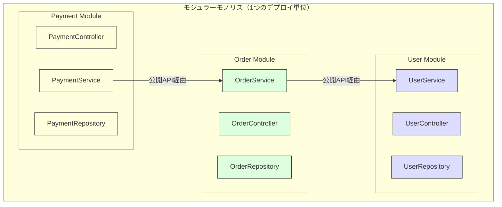
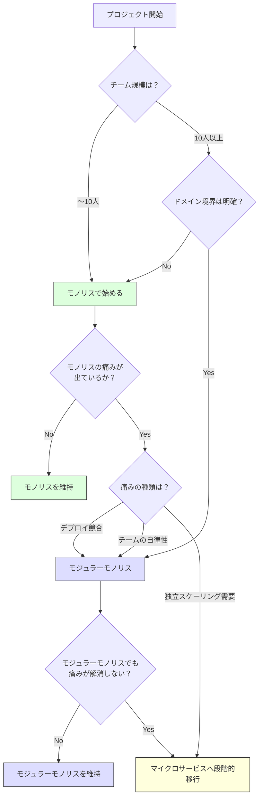

# モノリスvsマイクロサービス

> **一言で言うと:** 最初からマイクロサービスにするのはほぼ間違い。モノリスの「デプロイが一体」「変更の影響が波及する」という問題が**実際に痛みになってから**分割を検討する。

## 3分で全体像

- **何を解決する技術か:** 「コードベースが肥大化してデプロイ競合が起きる」「チーム間で同じコードを編集してコンフリクト」「機能ごとにスケーリング戦略を変えたい」というモノリスの慢性痛を、**サービス境界の分離**で解決する。ただし**分散システムの複雑さ**を背負うため、痛みが出てからの選択が原則
- **代表的な使用シーン:** Web アプリの新規開発（ほぼ常にモノリスで開始）、50 人超のエンジニアが 1 リポジトリで競合するフェーズ、特定機能（推薦エンジン / リアルタイム配信）に異なる技術スタックが必要なフェーズ、AWS / GCP のマネージド分散環境で運用するシステム、Bounded Context が明確に固まったドメイン
- **これだけは覚える3つ:**
    1. **モノリスファースト** — Martin Fowler が提唱する「新規プロジェクトはモノリスで始める」原則。ドメイン境界が固まっていないうちのマイクロサービス化は、**境界の修正コストが分散システムのコストを上回る**
    2. **モジュラーモノリスが多くの場合の最適解** — 「モノリス」と「マイクロサービス」の二択ではなく、**1 デプロイ単位の中で内部をモジュール分割する**第 3 の選択肢が存在する。マイクロサービスのメリット（明確な境界・チームの自律性）の多くを、分散システムのコスト（ネットワーク遅延・分散トランザクション・運用複雑性）なしで得られる
    3. **「マイクロサービス = スケールする」は半分しか正しくない** — DB がボトルネックの場合、サービスを分割しても解決しない。スケーラビリティ問題はまず [[インデックス]] / [[キャッシュ戦略]] / [[ロードバランシング]] / 読み取りレプリカで対処し、それでも駄目な場合に分割を検討する
- **AIに任せやすいか:** **人間判断が要る** — 「モノリスを分割すべきか」「どの境界で分割するか」「ストラングラーフィグ移行をどう段階化するか」は**チーム規模 / 組織構造 / ビジネスフェーズ / 既存ドメイン理解度**を踏まえた組織的判断であり、AI には判断材料の半分も渡せない。一方で、モジュラーモノリス化のリファクタ（フォルダ構成・公開インターフェース定義・ServiceProvider 配線）は AI に任せられる。**最も AI に任せてはいけないのは「最初からマイクロサービスにする」判断**で、AI は**早すぎる分割**側にバイアスがある
- **詰まったらここを読む:** [[関心の分離]] / [[CI-CD]] / [[イベント駆動-CQRS]] / [[非同期処理とメッセージキュー]]

## なぜ必要か

アプリケーションのアーキテクチャには「1つの塊として構築・デプロイする（モノリス）」か「独立した小さなサービスに分割する（マイクロサービス）」かという根本的な選択がある。この選択を誤ると:

- **モノリスのまま放置しすぎた場合** — コードベースの肥大化で変更速度が低下し、チーム間のコンフリクトが常態化する。1行の修正でも全体をデプロイし直す必要がある
- **早すぎるマイクロサービス化** — ドメイン境界が固まっていない段階で分割すると、サービス間の頻繁なやり取りが発生し、モノリスより遥かに複雑な分散システムの問題（ネットワーク障害、データ整合性、デバッグの困難さ）を抱え込む

どちらを選ぶかは技術的な問題だけでなく、**チーム規模・組織構造・ビジネスの成長フェーズ**という文脈に依存する判断である。この判断を駆動するのは[[機能要件と非機能要件|非機能要件]]（スケーラビリティ、可用性、デプロイ頻度など）であり、機能要件が同じでも非機能要件が異なればアーキテクチャは根本的に変わる。

## どの問題を解決するか

### モノリスが解決する問題

**問題:** 開発初期は「速く作って検証する」ことが最優先。サービス間通信やデプロイパイプラインの設計に時間を費やす余裕はない。

**解決方法:** 1つのコードベース・1つのデプロイ単位に全てを収める。

- 関数呼び出しで処理を連携できるため、通信のオーバーヘッドがない
- トランザクションで[[RDB]]のACID特性をそのまま活用できる
- デバッグはスタックトレースを追うだけで完結する
- 開発環境のセットアップが単純

### マイクロサービスが解決する問題

モノリスが成長して生じる以下の痛みを解決する:

**問題1: デプロイの結合**
小さな修正でも全体をデプロイする必要があり、リリース頻度が下がる。ある機能のデプロイ失敗が全体をロールバックさせる。

**解決:** サービスごとに独立してデプロイできるため、変更を小さく頻繁にリリースできる。

**問題2: チームのスケーリング**
50人以上の開発者が1つのコードベースで作業すると、コンフリクト・ビルド時間・テスト時間が深刻になる。

**解決:** チームごとにサービスを所有する（コンウェイの法則の意図的な活用）。各チームが自律的に開発・デプロイできる。

**問題3: 技術的異質性**
全体が1つの言語・フレームワークに縛られる。機械学習にはPython、リアルタイム処理にはGoが最適でも、モノリスでは選択できない。

**解決:** サービスごとに最適な技術スタックを選択できる。

**問題4: 障害の局所化**
モノリスでは1つのメモリリークや無限ループが全体をダウンさせる。

**解決:** サービスが独立プロセスで動作するため、1つのサービスの障害が他に波及しにくい（ただしサーキットブレーカーなどの対策が必要）。

## 他の仕組みとどう関係するか

- **下位レイヤーとの関係:**
  - [[Docker|コンテナ]] — マイクロサービスの実行単位として[[Docker|コンテナ]]が事実上の標準。サービスごとに独立した環境を提供する
  - [[TCP-IP]] / [[HTTP-HTTPS]] — モノリス内の関数呼び出しがサービス間のネットワーク通信に変わる。レイテンシ・障害モードが根本的に変わることを理解しておく必要がある
  - [[RDB]] — モノリスでは1つのDBを共有できるが、マイクロサービスでは「サービスごとにDBを持つ」が原則。JOINが使えなくなるトレードオフ
  - [[ロードバランシング]] — マイクロサービスではサービスごとにスケーリングが可能。CPUバウンドなサービスとI/Oバウンドなサービスで異なるスケーリング戦略を取れる
  - [[非同期処理とメッセージキュー|非同期処理・メッセージキュー]] — サービス間の疎結合な通信手段。同期的なHTTP呼び出しの連鎖（オーケストレーション）と、イベントによる非同期連携（コレオグラフィ）の選択がある

- **同レイヤーとの関係:**
  - [[関心の分離]] — マイクロサービスは関心の分離を「デプロイ単位」にまで拡張したもの。ただし分離のコスト（ネットワーク通信、データ整合性、運用複雑性）も桁違いに大きくなる
  - [[SOLID原則]] — 各サービスの内部設計にSOLID原則を適用する。サービス境界の設計にはSRP（1サービス1ドメイン）が直接関係する
  - [[CI-CD]] — マイクロサービスではサービスごとに独立したCI/CDパイプラインが必要。これがないとマイクロサービスのメリットが享受できない
  - [[テスト戦略]] — サービス間の結合テスト（Contract Testing）が新たに必要になる。テストの複雑さはモノリスより格段に増す
  - [[イベント駆動-CQRS]] — マイクロサービス間のデータ同期にイベント駆動が多用される

- **上位レイヤーとの関係:**
  - 最上位レイヤーのため直接の上位はない

## 誤解されやすいポイント

### 1. 「マイクロサービス = 良いアーキテクチャ」ではない

マイクロサービスは[[銀の弾丸はない|銀の弾丸]]ではなく、**組織とシステムの規模が一定以上になったときに初めて効果を発揮する**アーキテクチャ。5人のチームで10サービスを運用すると、ビジネスロジックの開発よりもインフラ管理とサービス間通信の問題解決に時間を取られる。Amazon・Netflix が採用しているのは、その規模と組織構造がマイクロサービスを正当化するからであり、全ての企業に適用できるわけではない。

### 2. 「モノリス = レガシー」ではない

モノリスは設計が悪いことを意味しない。内部が適切にモジュール化された「モジュラーモノリス（Modular Monolith）」は、マイクロサービスのメリット（独立した開発・明確な境界）を享受しつつ、分散システムのコスト（ネットワーク遅延・分散トランザクション・運用の複雑性）を回避できる。多くの場合、最適解はモノリスとマイクロサービスの中間にある。

### 3. 「サービスを小さくすればするほど良い」わけではない

サービスの「マイクロ」は物理的なコード量の少なさではなく、**ビジネスドメインの境界に沿った凝集度の高さ**を意味する。1つのAPIエンドポイントを1つのサービスにするような過度な分割（ナノサービス）は、サービス間通信の爆発とデバッグの困難を招く。

### 4. 「マイクロサービスにすればスケールする」は半分しか正しくない

サービス単位でのスケーリングは可能になるが、**データベースがボトルネックの場合はサービスを分割しても解決しない**。スケーラビリティの問題はまず[[インデックス]]、[[キャッシュ戦略]]、[[ロードバランシング]]で対処し、それでも解決しない場合にサービス分割を検討する。

## 設計のベストプラクティス

### 推奨パターン

**1. モノリスファースト（Monolith First）**

新規プロジェクトはモノリスで始める。ドメインの理解が深まり、境界が明確になり、チーム規模が拡大してから分割を検討する。Martin Fowler が提唱する「モノリスファースト」の原則。

**2. モジュラーモノリス**

モノリス内部をドメインごとのモジュールに分割し、モジュール間は明確なインターフェースを通じてのみ通信する。将来のマイクロサービス化の準備になる上、多くのプロジェクトではこの段階で十分。


```mermaid
graph TD
    subgraph "モジュラーモノリス（1つのデプロイ単位）"
        subgraph "User Module"
            UC[UserController]
            US[UserService]
            UR[UserRepository]
        end
        subgraph "Order Module"
            OC[OrderController]
            OS[OrderService]
            OR[OrderRepository]
        end
        subgraph "Payment Module"
            PC[PaymentController]
            PS[PaymentService]
            PR[PaymentRepository]
        end

        OS -->|"公開API経由"| US
        PS -->|"公開API経由"| OS
    end

    style UC fill:#ddf,stroke:#333
    style US fill:#ddf,stroke:#333
    style UR fill:#ddf,stroke:#333
    style OC fill:#dfd,stroke:#333
    style OS fill:#dfd,stroke:#333
    style OR fill:#dfd,stroke:#333
    style PC fill:#ffd,stroke:#333
    style PS fill:#ffd,stroke:#333
    style PR fill:#ffd,stroke:#333
```

**3. ストラングラーフィグパターン（Strangler Fig Pattern）**

モノリスからマイクロサービスへの移行は一括ではなく、段階的に行う。新機能をマイクロサービスとして構築し、既存機能を徐々に移行する。

**4. 分割の判断基準を持つ**

以下の条件が複数当てはまるとき、マイクロサービスへの分割を検討する:
- 異なるチームが同じコードベースで頻繁にコンフリクトしている
- デプロイ頻度がチーム間の調整コストで制限されている
- 特定の機能だけを独立してスケールする必要がある
- 特定の機能に最適な技術スタックが現在のスタックと異なる

### アンチパターン

**1. 分散モノリス（Distributed Monolith）** — サービスを分割したが、全サービスを同時にデプロイしなければ動かない状態。マイクロサービスのコストだけを背負い、メリットは何もない。原因はサービス間の密結合。

**2. 共有データベース** — 複数サービスが同じデータベースのテーブルを直接参照する。スキーマ変更が全サービスに影響し、独立デプロイが不可能になる。

**3. 同期通信の連鎖** — A→B→C→D と同期的にHTTP呼び出しが連鎖する。1つのサービスの遅延が全体に波及し、可用性は各サービスの可用性の積になる（99.9%^4 = 99.6%）。

## AIエージェントとの協働

> このトピックでAIコーディングエージェント（Claude Code, Copilot, Cursor 等）と協働するための観点。
> **「AIに何をどこまで任せ、AIに何をレビューさせ、人間は何を最終判断するか」**を整理する。実装だけでなく**レビューもAIに任せられる**前提で考える（`/review-ai-code` skillが横断アンチパターン照合を担う）。

### AIに任せられる部分 / 人間が判断すべき部分

| タスク種類 | 任せ方（実装/レビュー） | 人間の関与 |
|---|---|---|
| モジュラーモノリスのフォルダ構成生成 | **実装は AI 主導** — `app/Modules/{User,Order,Payment}/` の構成、ServiceProvider 雛形、公開インターフェース骨格は定型 | ドメイン分割の軸（**ユビキタス言語** = DDD でチーム内の用語を統一する原則 / Bounded Context）は人間が決める |
| サーキットブレーカー / リトライの実装 | **実装もレビューも AI 主導** — Polly / resilience4j / 自前実装パターンは AI が高品質に書く | しきい値・タイムアウト値・サーキット復帰時間の決定は実データに基づく人間判断 |
| サービス境界の決定 | **AI に任せない** — AI は「機能名から推測」で境界を引きがち | **完全に人間判断** — 過去 6 ヶ月の git log で同時変更されたファイルの組、チーム所有の現状、ステークホルダー構造から決定 |
| マイクロサービス化の意思決定 | **AI に任せない** — AI は技術的観点のみで「マイクロサービスにすべき」と提案する傾向 | **完全に人間判断** — モノリスの実痛（デプロイ競合 / チーム調整コスト / スケール要求）が分散システムのコスト（運用 / DB 整合性 / ネットワーク信頼性）を上回るかの天秤 |
| サービス間通信パターンの選択（REST / gRPC / イベント） | **AI に複数案** — 同期 REST と非同期イベントの両案を生成させて比較 | **人間が最終判断** — レイテンシ要件・整合性要件・障害時の挙動から決める |
| 移行戦略（ストラングラーフィグなど） | **AI に段階計画を出させる** — 既存モノリスから抜き出すモジュールの順序案を生成 | **人間が最終判断** — ビジネスインパクト・チーム稼働・本番影響範囲を踏まえて優先度を決定 |

### AI生成コードのレビュー観点（このトピック固有）

AI生成物を受け取ったとき、最低限ここを見る。

1. **分散モノリス化していないか** — サービスは分割されているのに、A をデプロイすると B も同時デプロイが必要、A と B が同じテーブルを直接参照している、A の API 変更が B のコードを書き換えさせる、などの密結合シグナルがあれば**マイクロサービスの最悪形**。共有 DB、共有ライブラリの過剰、同期 HTTP の連鎖が原因
2. **同期通信の連鎖になっていないか** — A → B → C → D と HTTP 呼び出しが連鎖すると、可用性が積算される（99.9%^4 = 99.6%）。エンドツーエンドのレイテンシも積み上がる。**境界を跨ぐ呼び出しは「同期が本当に必要か」を毎回問い**、不要なら非同期イベント / メッセージキューに置き換える
3. **モジュール内部の Entity / モデルが境界を漏れていないか** — `User` モジュールの Eloquent Model や Entity が直接 `Order` モジュールに渡っていれば、内部実装の変更が他モジュールを壊す。**DTO / 公開契約**で必ず変換する

### 効くプロンプトの型

このトピックに関する実装をAIに依頼するとき、コンテキストとして渡すべき情報・制約・成功基準のテンプレ。

```
# 前提（プロジェクトの状況・既存のコード規約）
- 現状: Laravel モノリス、コードベース 80,000 行、開発者 12 名、サービスは未分離
- 痛み: User / Order / Payment / Inventory が同じディレクトリに散在し、変更が頻繁に競合
- まだ「マイクロサービス化」の判断は降りていない。今回はモジュラーモノリス化のリファクタのみ
- 既存の DI: Laravel Service Container、コンストラクタ注入を使用

# やってほしいこと
- app/Modules/{User,Order,Payment,Inventory}/ への移行プランと初期構成

# 守ってほしい制約（このトピック固有のもの）
- 各モジュールに公開インターフェース（Contracts/）と内部実装（Services/, Repositories/）を分離
- モジュール間は ServiceProvider 経由でインターフェースを bind し、具象クラスを直接 import しない
- Eloquent Model はモジュール外に漏らさず、DTO（プリミティブ配列 or 専用クラス）で受け渡す
- 一切のサービス間 HTTP 通信を導入しない（プロセス内呼び出しのまま）
- 1 コミットで完結する小さな移行に分割する（ビッグバン書き換え禁止）

# 完了の判断基準
- 各モジュールが独立した名前空間とディレクトリ構造を持つ
- モジュール A の内部実装変更で、モジュール B / C / D のコードを書き換えなくて済む
- 将来マイクロサービスに分割する場合、各モジュールがそのまま 1 サービスとして切り出せる構造
```

### AI実装のアンチパターン

LLM生成コードで頻出する過剰設計・誤用パターン。レビュー時の照合表として使う。

| アンチパターン | なぜ問題か | レビュー観点 / 対策 |
|---|---|---|
| 初期段階でのマイクロサービス設計 | ドメイン境界が不明確なうちにサービスを分割すると、境界の修正コストが膨大になる | モノリスまたはモジュラーモノリスで始める。「**なぜマイクロサービスが必要か**」の質問に「スケールするから」「Netflix がやってるから」しか答えられないなら早すぎる |
| 全通信をREST APIにする | サービス間通信が全て同期HTTP。障害の連鎖とレイテンシの積み上げが起こる | イベント駆動やメッセージキューを活用し、同期が本当に必要な箇所のみRESTを使う |
| サービスごとに異なるフレームワーク | 技術的自由を理由に各サービスで異なる技術を選択。運用・採用・学習コストが爆発する | 「選択できる」と「選択すべき」は異なる。明確な理由がなければ統一する |
| 共通ライブラリの密結合 | 共通処理を共有ライブラリにまとめ、全サービスが同バージョンに依存。更新が全サービスの再デプロイを強制する | 共通化は最小限に。バージョン互換性を慎重に管理する |
| 共有データベース | 複数サービスが同じテーブルを直接参照。スキーマ変更が全サービスに影響し、独立デプロイが不可能になる | サービスごとに DB を持ち、データ共有は API / イベント経由 |
| サーキットブレーカー欠如 | サービス間通信に retry / timeout / circuit-breaker のいずれも入れない。1 サービスの遅延が全体ダウンを誘発 | 全サービス間呼び出しにタイムアウト + サーキットブレーカーを入れる |
| 分散トランザクションでの 2PC | サービス間で 2 フェーズコミットを実装。可用性が下がり性能も劣化 | Saga パターン（補償トランザクション）または**結果整合性**（最終的に整合する非同期反映を許容する設計）へ移行 |
| サービスごとの認証ロジック分散 | 各サービスで認証を独立実装。仕様変更が全サービスに波及 | ID プロバイダー（Auth0 / Cognito / Keycloak）に集約、サービスは JWT 検証のみ |

→ レイヤー横断のアンチパターン索引: [[_anti-patterns/_index|AIアンチパターン索引]]

## 具体例

### モジュラーモノリスの境界定義（TypeScript）

```typescript
// --- モジュール境界を公開インターフェースで定義 ---

// modules/user/index.ts（公開API — これだけが外部からアクセス可能）
export interface UserModule {
  findById(id: string): Promise<UserDTO>;
  register(data: CreateUserInput): Promise<UserDTO>;
}

// modules/user/UserModuleImpl.ts（内部実装 — 外部から直接importしない）
import { UserRepository } from './UserRepository';

export class UserModuleImpl implements UserModule {
  constructor(private repo: UserRepository) {}

  async findById(id: string): Promise<UserDTO> {
    const user = await this.repo.findById(id);
    return toDTO(user); // 内部のEntityではなくDTOを返す
  }

  async register(data: CreateUserInput): Promise<UserDTO> {
    const user = await this.repo.create(data);
    return toDTO(user);
  }
}

// modules/order/OrderService.ts
// ✅ UserModule の公開インターフェースにのみ依存
export class OrderService {
  constructor(
    private userModule: UserModule,  // インターフェースに依存
    private orderRepo: OrderRepository,
  ) {}

  async createOrder(userId: string, items: OrderItem[]): Promise<Order> {
    const user = await this.userModule.findById(userId);
    if (!user) throw new Error('User not found');
    return this.orderRepo.create({ userId, items });
  }
}
```

### サーキットブレーカーパターン（マイクロサービス間の障害対策）

```typescript
// マイクロサービス間通信で必須のパターン
class CircuitBreaker {
  private failures = 0;
  private lastFailure = 0;
  private state: 'closed' | 'open' | 'half-open' = 'closed';

  constructor(
    private threshold: number = 5,
    private resetTimeout: number = 30_000,
  ) {}

  async call<T>(fn: () => Promise<T>): Promise<T> {
    if (this.state === 'open') {
      if (Date.now() - this.lastFailure > this.resetTimeout) {
        this.state = 'half-open';
      } else {
        throw new Error('Circuit is open — service unavailable');
      }
    }

    try {
      const result = await fn();
      this.onSuccess();
      return result;
    } catch (error) {
      this.onFailure();
      throw error;
    }
  }

  private onSuccess() {
    this.failures = 0;
    this.state = 'closed';
  }

  private onFailure() {
    this.failures++;
    this.lastFailure = Date.now();
    if (this.failures >= this.threshold) {
      this.state = 'open';
    }
  }
}

// 使用例
const paymentBreaker = new CircuitBreaker(5, 30_000);

async function processPayment(orderId: string) {
  return paymentBreaker.call(() =>
    fetch(`https://payment-service/charge/${orderId}`, { method: 'POST' })
  );
}
```

### 他言語でのモジュラーモノリス構成

#### Go — internal パッケージによるモジュール境界

Go では `internal` ディレクトリを使うことで、コンパイラレベルでモジュール内部の実装を外部から隠蔽できる。

```
myapp/
├── cmd/server/main.go
├── modules/
│   ├── user/
│   │   ├── handler.go          # 公開 API（外部からimport可能）
│   │   ├── service.go          # 公開サービスインターフェース
│   │   └── internal/
│   │       ├── repo.go         # 内部実装（外部パッケージからimport不可）
│   │       └── model.go
│   └── order/
│       ├── handler.go
│       ├── service.go
│       └── internal/
│           ├── repo.go
│           └── model.go
└── go.mod
```

```go
// modules/user/service.go
// 公開インターフェース — 他モジュールはこれだけに依存する
package user

import "context"

type User struct {
	ID    string
	Email string
	Name  string
}

// Service はユーザーモジュールの公開契約
type Service interface {
	FindByID(ctx context.Context, id string) (*User, error)
}

// NewService は内部実装を隠蔽して公開インターフェースを返す
func NewService(dsn string) Service {
	return &service{dsn: dsn}
}

// 非公開の実装 — 小文字始まりでパッケージ外からアクセス不可
type service struct {
	dsn string
}

func (s *service) FindByID(ctx context.Context, id string) (*User, error) {
	// internal/repo.go の関数を呼び出して DB アクセス
	// 外部モジュール (order等) からは internal 配下を直接参照できない
	return &User{ID: id, Email: "user@example.com", Name: "Alice"}, nil
}
```

```go
// modules/order/handler.go
// 他モジュールの公開インターフェースだけに依存する例
package order

import (
	"context"
	"errors"
	"myapp/modules/user" // user.Service のみ利用可能
)

type OrderService struct {
	userSvc user.Service // 内部実装ではなくインターフェースに依存
}

func NewOrderService(userSvc user.Service) *OrderService {
	return &OrderService{userSvc: userSvc}
}

func (s *OrderService) Create(ctx context.Context, userID string) error {
	u, err := s.userSvc.FindByID(ctx, userID)
	if err != nil {
		return err
	}
	if u == nil {
		return errors.New("user not found")
	}
	// 注文作成ロジック ...
	return nil
}
```

#### PHP/Laravel — ドメインフォルダ + Service Provider

Laravel ではデフォルトの `app/Models/`, `app/Http/Controllers/` 構成をやめ、ドメイン単位にフォルダを切ることでモジュラーモノリスを実現する。モジュール間の依存は Service Provider で制御する。

```
app/
├── Modules/
│   ├── User/
│   │   ├── UserServiceProvider.php
│   │   ├── Contracts/
│   │   │   └── UserServiceInterface.php   # 公開契約
│   │   ├── Services/
│   │   │   └── UserService.php            # 内部実装
│   │   ├── Models/
│   │   │   └── User.php
│   │   └── Routes/
│   │       └── api.php
│   └── Order/
│       ├── OrderServiceProvider.php
│       ├── Services/
│       │   └── OrderService.php
│       ├── Models/
│       │   └── Order.php
│       └── Routes/
│           └── api.php
└── Providers/
    └── AppServiceProvider.php
```

```php
<?php
// app/Modules/User/Contracts/UserServiceInterface.php
// モジュールの公開契約 — 他モジュールはこのインターフェースにのみ依存する
namespace App\Modules\User\Contracts;

interface UserServiceInterface
{
    public function findById(string $id): ?array;
}
```

```php
<?php
// app/Modules/User/Services/UserService.php
// 内部実装 — 直接参照せず ServiceProvider 経由で解決する
namespace App\Modules\User\Services;

use App\Modules\User\Contracts\UserServiceInterface;
use App\Modules\User\Models\User;

class UserService implements UserServiceInterface
{
    public function findById(string $id): ?array
    {
        $user = User::find($id);
        // モジュール外に Eloquent Model を漏らさず配列で返す
        return $user ? ['id' => $user->id, 'name' => $user->name] : null;
    }
}
```

```php
<?php
// app/Modules/User/UserServiceProvider.php
// Service Provider でインターフェースと実装をバインドする
namespace App\Modules\User;

use Illuminate\Support\ServiceProvider;
use App\Modules\User\Contracts\UserServiceInterface;
use App\Modules\User\Services\UserService;

class UserServiceProvider extends ServiceProvider
{
    public function register(): void
    {
        // 他モジュールは UserServiceInterface を型ヒントで注入できる
        $this->app->bind(UserServiceInterface::class, UserService::class);
    }

    public function boot(): void
    {
        $this->loadRoutesFrom(__DIR__ . '/Routes/api.php');
    }
}
```

```php
<?php
// app/Modules/Order/Services/OrderService.php
// 他モジュールの公開契約だけに依存する
namespace App\Modules\Order\Services;

use App\Modules\User\Contracts\UserServiceInterface;

class OrderService
{
    // コンストラクタインジェクションでインターフェースを受け取る
    public function __construct(
        private UserServiceInterface $userService,
    ) {}

    public function create(string $userId, array $items): void
    {
        $user = $this->userService->findById($userId);
        if ($user === null) {
            throw new \RuntimeException('User not found');
        }
        // 注文作成ロジック ...
    }
}
```

### アーキテクチャ選択のフローチャート


```mermaid
flowchart TD
    START["プロジェクト開始"] --> Q1{"チーム規模は？"}
    Q1 -->|"〜10人"| MONO["モノリスで始める"]
    Q1 -->|"10人以上"| Q2{"ドメイン境界は明確？"}

    Q2 -->|"No"| MONO
    Q2 -->|"Yes"| MODULAR["モジュラーモノリス"]

    MONO --> PAIN{"モノリスの痛みが<br/>出ているか？"}
    PAIN -->|"No"| KEEP["モノリスを維持"]
    PAIN -->|"Yes"| Q3{"痛みの種類は？"}

    Q3 -->|"デプロイ競合"| MODULAR
    Q3 -->|"チームの自律性"| MODULAR
    Q3 -->|"独立スケーリング需要"| MICRO["マイクロサービスへ段階的移行"]

    MODULAR --> MPAIN{"モジュラーモノリスでも<br/>痛みが解消しない？"}
    MPAIN -->|"No"| MKEEP["モジュラーモノリスを維持"]
    MPAIN -->|"Yes"| MICRO

    style MONO fill:#dfd,stroke:#333
    style MODULAR fill:#ddf,stroke:#333
    style MICRO fill:#ffd,stroke:#333
    style KEEP fill:#dfd,stroke:#333
    style MKEEP fill:#ddf,stroke:#333
```

## 参考リソース

- *Building Microservices* (2nd Edition) — Sam Newman（マイクロサービスの設計・分割・運用の包括的ガイド）
- *Monolith to Microservices* — Sam Newman（移行戦略に特化。ストラングラーフィグパターンの詳細解説）
- *Domain-Driven Design* — Eric Evans（ドメイン境界の見つけ方。Bounded Context がサービス境界の候補になる）
- Martin Fowler "MonolithFirst" — martinfowler.com（モノリスファースト原則の原典記事）
- *Software Architecture: The Hard Parts* — Neal Ford 他（分割の判断基準を体系化した実践書）

## 理解度セルフチェック

> 答えられなければ本文に戻る。答えはこのファイル内に必ずある。

1. 「最初からマイクロサービスにすべきでない」理由を、Martin Fowler の「モノリスファースト」原則と、ドメイン境界の修正コストの観点から 30 秒で説明してみよう
2. ある会社で「DB のクエリが遅いので、ユーザー管理を独立したマイクロサービスに切り出してスケールする」という提案が出た。この提案の何が問題で、まず先に検討すべき手段を 2 つ挙げよ
3. AI が次の Node.js コードを「マイクロサービス間通信」として生成した。このコードを本番投入してよいか？問題があれば指摘し、修正方針を答えよ
   ```typescript
   // user-service.ts: 注文サービスから呼び出されるユーザー検証 API
   async function placeOrder(userId: string, items: Item[]) {
     const user = await fetch(`http://user-service/users/${userId}`);
     const profile = await user.json();
     const inventory = await fetch(`http://inventory-service/check`, { /* ... */ });
     const payment = await fetch(`http://payment-service/charge`, { /* ... */ });
     const notification = await fetch(`http://notification-service/send`, { /* ... */ });
     return { success: true };
   }
   ```

> [!note]- 解答の指針
>
> > [!info] 用語ミニ辞典
> > - **モノリス（Monolith）**: アプリケーション全体が 1 つのコードベース・1 つのデプロイ単位として構築される構成。プロセス内呼び出しで連携する
> > - **マイクロサービス**: 機能ごとに独立したプロセス / リポジトリ / デプロイパイプラインに分割し、ネットワーク経由で連携する構成。サービス境界は通常 Bounded Context に対応
> > - **モジュラーモノリス**: 1 デプロイ単位だが、内部を明確なモジュール境界で分割した構成。多くのプロジェクトで最適解
> > - **ストラングラーフィグパターン**: モノリスからマイクロサービスへ段階的に移行する手法。新機能をマイクロサービスとして構築し、古い機能を徐々に移行していく
> > - **Bounded Context（境界づけられたコンテキスト）**: DDD の概念で、特定のドメインモデルが意味を持つ範囲。サービス境界の有力候補
> > - **コンウェイの法則**: 「システムの設計は組織のコミュニケーション構造を反映する」という観察則。アーキテクチャを変えたければ組織も変える必要がある
> > - **サーキットブレーカー**: 連続して失敗する呼び出し先への通信を一時的に遮断するパターン。障害の連鎖を防ぐ
> > - **可用性の積算**: A → B → C → D の同期呼び出しチェーンで、エンドツーエンドの可用性が各サービス可用性の積になる現象（99.9%^4 ≈ 99.6%）
>
> 1. **理由 1: ドメイン境界が不明確**。新規プロジェクトでは「ユーザー / 注文 / 在庫」が独立した境界に見えても、ビジネスが動き始めると「ユーザーの注文履歴を在庫管理から逆引き」「決済情報をユーザー認証と統合」といった**境界を跨ぐ実装**が頻繁に出てくる。モノリスならリファクタで対応できるが、マイクロサービス化済みなら**サービス間 API 設計の作り直し / DB スキーマ移行 / デプロイ調整**が必要になり、修正コストが桁違いに高い
>
>    **理由 2: 分散システムのコスト**。マイクロサービスはネットワーク通信・データ整合性（分散トランザクション）・観測（分散トレーシング）・運用（複数の CI/CD パイプライン）の複雑さを背負う。**チーム規模 5 人 / コードベース小** のフェーズではこれらのコストが利益を上回る
>
>    **モノリスファースト**: ドメインの理解が深まり、境界が固まり、チーム規模が拡大して**実際にモノリスの痛み（デプロイ競合・チーム調整コスト）が出てから**分割を検討する。痛みが出ていない段階で分割するのは投機であり、投機の失敗コストが極めて高い
>
> 2. **問題**: 「DB が遅い」という症状から「**サービス分割でスケール**」という結論に飛んでいるが、**サービス分割は DB のボトルネックを解決しない**。ユーザー管理を独立サービスにしても、その内部の DB が同じ性能なら遅さは変わらない。「マイクロサービス = スケールする」の典型的誤解
>
>    **先に検討すべき手段 2 つ**:
>
>    1. **クエリ最適化と [[インデックス]] の見直し**: 遅いクエリを `EXPLAIN ANALYZE` で確認し、適切なインデックスを追加する。多くの「DB が遅い」は数本のインデックス追加で解決する。費用対効果が桁違いに高い
>    2. **[[キャッシュ戦略]] と読み取りレプリカ**: 読み取りが書き込みの 10 倍以上ならキャッシュ層（Redis）と読み取りレプリカで対応できる。これらはモノリスのまま実装可能で、サービス分割よりはるかに低コスト
>
>    **判断基準**: マイクロサービス分割は「DB のボトルネックではなく、**チーム間のデプロイ競合 / コードベースの認知負荷 / 機能ごとの独立スケーリング要求**」が痛みになってからの選択肢。技術的負債と組織的負債を混同しないこと
>
> 3. **本番投入してはいけない**。複数の重大な問題がある:
>
>    - **可用性の積算**: 4 つのサービスへの同期呼び出しが連鎖。各サービスの可用性が 99.9% でも、エンドツーエンドは 99.9%^4 ≈ 99.6% に低下し、月あたり許容ダウンタイムが 43 分 → 173 分に悪化
>    - **タイムアウト・リトライ・サーキットブレーカー欠如**: `fetch` をそのまま呼んでおり、1 サービスのハング（5 秒待ち）が全体のレイテンシを直撃。1 サービスが完全に落ちると注文機能が完全停止
>    - **同期処理の妥当性が問えない**: 通知サービスは**注文確定の同期パスに必要か？**「メールが送れなかったから注文が失敗」のビジネス挙動はおかしい。**非同期イベントでよい**
>    - **エラーハンドリング欠如**: HTTP ステータスチェックなし、各サービスの失敗時の挙動（ロールバック / 補償トランザクション）が未定義
>
>    **修正方針**:
>    1. **同期と非同期を分離**: 在庫確認・決済は同期（注文成立に必須）、通知は**非同期イベント**（`OrderPlaced` メッセージキュー発行）
>    2. **タイムアウト + サーキットブレーカー**: 全 fetch にタイムアウト（例: 3 秒）、連続失敗で遮断する resilience ライブラリ（Polly / Opossum 等）を導入
>    3. **障害時の補償**: 決済成功後に在庫確保が失敗するケースなどを想定し、Saga パターンで補償トランザクションを設計
>    4. **サーキットブレーカーの優先**: マイクロサービス間呼び出しで**最低限必須**なのはこの 3 つ（タイムアウト / リトライ / サーキットブレーカー）。AI は省略しがちで、レビュー時の必須チェック項目
>
>    **思考プロセス**: マイクロサービス間通信は「ネットワークは信頼できない」「他サービスはいつでも落ちる」を前提に設計する。AI は**ハッピーパスのみ**を生成しがちなため、人間は障害時の挙動を必ず追加検証する

## 学習メモ

- 「マイクロサービスはいつ採用すべきか？」に対する最良の回答は「モノリスでの痛みが、分散システムの複雑さを上回ったとき」
- コンウェイの法則「システムの設計は組織構造を反映する」は逆も真。アーキテクチャを変えたければ組織も変える必要がある（逆コンウェイ戦略）
- モジュラーモノリスは過小評価されている。多くのプロジェクトではこれが最適解であり、マイクロサービスまで進む必要はない
