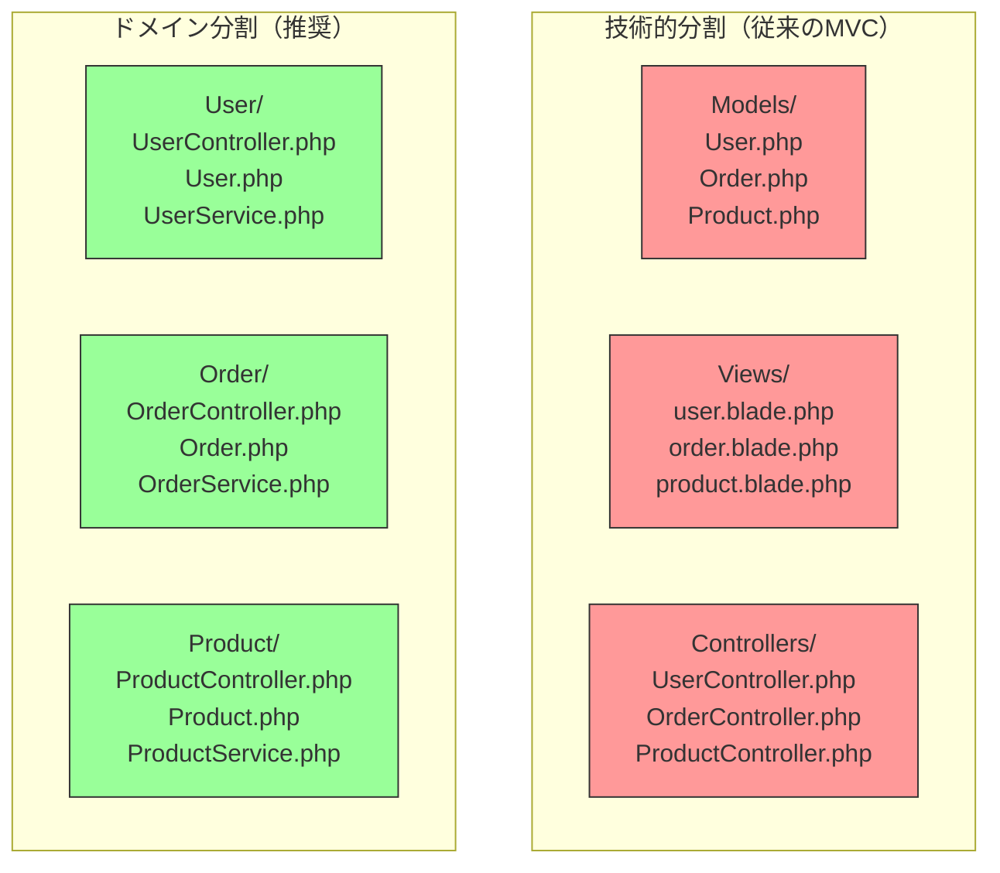

# 関心の分離

> **一言で言うと:** 「変更の理由が異なるものは分離する」という、全設計原則の根本にある考え方。MVC、レイヤードアーキテクチャ、マイクロサービスは全てこの原則の応用である。

## なぜ必要か

ソフトウェアは時間とともに変更される。変更されないソフトウェアは死んだソフトウェアだけだ。問題は、コードベースが成長すると**ある機能の変更が無関係な機能を壊す**という現象が起き始めることにある。

関心の分離（Separation of Concerns, SoC）がなければ:

- **変更の影響範囲が予測不能になる** — UIの色を変えただけでビジネスロジックが壊れる、バリデーションルールを修正しただけでデータベースへのクエリが変わる、といった事態が起こる
- **コードの理解に必要な文脈が爆発的に増える** — 1つのファイルを読むのに、システム全体を理解しなければならなくなる
- **チーム開発が破綻する** — 複数人が同じファイルを同時に編集することが増え、コンフリクトが日常化する
- **テストが困難になる** — 1つの機能をテストするためにシステム全体をセットアップする必要が出てくる

## どの問題を解決するか

### 問題1: 変更の波及（Ripple Effect）

あるモジュールの内部変更が、本来無関係な他のモジュールに波及する問題。

**解決方法:** 各モジュールが「1つの関心事」だけを担当するように分割する。関心事とは「変更される理由」と同義であり、これは[[SOLID原則]]の単一責任原則（SRP）そのものでもある。

### 問題2: 認知的負荷の増大

1つの処理を理解するために、関係ないコードまで読まなければならない問題。

**解決方法:** 関心事ごとにコードを分離し、それぞれの境界を明確にする。開発者は自分が扱う関心事だけに集中できるようになる。

### 問題3: 並行開発の困難

複数の開発者が同じコードを触ることによるコンフリクトや調整コストの問題。

**解決方法:** 関心事ごとに独立したモジュール/ファイルに分割し、チームメンバーが異なる領域を並行して開発できるようにする。

### 問題4: 再利用性の欠如

ある機能を別の場所で使いたいのに、不要な依存がついてくる問題。

**解決方法:** 関心事を分離することで、特定の機能だけを取り出して再利用可能にする。例えばバリデーションロジックがUIフレームワークに依存していなければ、フロントエンドでもバックエンドでも同じロジックを使える。

## 他の仕組みとどう関係するか

- **下位レイヤーとの関係:**
  - [[HTML-CSS-JS|HTML-CSS-JSの本質]] — HTMLは構造、CSSは見た目、JSは振る舞い、という3つの関心事の分離がWeb技術の出発点。これが崩れるとスタイルの変更にHTML修正が必要になるなど、保守性が著しく低下する
  - [[ルーティングとミドルウェア]] — ミドルウェアは「認証」「ログ」「エラーハンドリング」といった横断的関心事（Cross-Cutting Concerns）を本来のビジネスロジックから分離する仕組み。[[玉ねぎモデル]]はその典型的な実装パターン
  - [[コンポーネント設計]] — UIを関心事の単位で分割する実践。「変更の理由が1つ」になる粒度が正しい分割

- **同レイヤーとの関係:**
  - [[SOLID原則]] — 特に単一責任原則（SRP）は関心の分離を「クラス/モジュール」レベルで適用したもの。依存性逆転の原則（DIP）は分離した関心事間の依存方向を制御する手段
  - [[モノリスvsマイクロサービス]] — マイクロサービスは関心の分離を「デプロイ単位」にまで拡張したもの。ただし分離のコストも大きくなるため、痛みが出てから検討すべき
  - [[テスト戦略]] — 関心が適切に分離されているコードは、ユニットテストが書きやすい。テストのしにくさは、関心の分離が不十分なサイン
  - [[イベント駆動-CQRS]] — 読み取りと書き込みという2つの関心事を分離するアーキテクチャパターン

- **上位レイヤーとの関係:**
  - 関心の分離は最上位の設計原則であるため、「上位」は存在しない。むしろ、全レイヤーの設計判断の根幹となる考え方

## 誤解されやすいポイント

### 1. 「ファイルを分割すれば関心が分離される」わけではない

ファイルを分ける行為は関心の分離の**手段の一つ**にすぎない。重要なのは「変更の理由が異なるものが、異なるモジュールに属していること」であり、ファイルを100個に分けても、それぞれが互いの内部実装に依存していれば分離とは言えない。逆に、1つのファイル内でも関数レベルで適切に責務が分かれていれば、それは立派な関心の分離である。

### 2. 「レイヤーを増やすほど良い設計になる」わけではない

Controller → Service → Repository → DAO → Entity … と層を増やす過度なレイヤリングは、関心の分離ではなく**間接参照の増殖**にすぎない。各レイヤーに明確に異なる「変更の理由」がなければ、それはただの儀式的コードであり、変更のたびに複数ファイルを同時修正する「ショットガン手術」を招く。

### 3. 「関心の分離 = 技術的分割」と決めつけてしまう

従来のMVCはModel/View/Controllerという**技術的な役割**で分割する。しかし実務では「ユーザー管理」「決済」「通知」といった**ビジネスドメイン**で分割する方が変更の局所化に効果的な場合が多い。技術的分割では「ユーザー登録機能を変更する」際にModel・View・Controller全てを修正する必要があるが、ドメイン分割なら変更は1つのモジュールに閉じる。

### 4. 「DRYを守るために関心の分離を犠牲にする」

2つのコードが偶然似ているだけなのに、[[DRY原則]]に従って共通化してしまうケース。例えば「ユーザー登録のバリデーション」と「プロフィール更新のバリデーション」は今は同じルールでも、変更される理由が異なるため、無理に共通化すると後で分岐だらけのコードになる。**偶然の重複（Accidental Duplication）** と **本質的な重複（Essential Duplication）** を区別することが重要（→ [[DRY原則]]を参照）。

## 設計のベストプラクティス

### 推奨パターン

**1. 変更の理由で分割する**

分割の基準は技術的な役割ではなく「何がこのコードを変更させるか」。ビジネスルールの変更、UIデザインの変更、インフラの変更はそれぞれ異なる理由なので、分離すべき。

**2. 境界は「公開インターフェース」で定義する**

モジュール間の結合は、公開された関数やAPIを通じてのみ行う。内部実装の詳細は隠蔽する（[[デメテルの法則]]も参照）。これにより、内部を自由に変更できる。

**3. 依存の方向を一方向にする**

A → B の依存があるなら、B → A の依存は許さない。循環依存は関心の分離が不完全なサイン。依存の方向を制御する手法として[[SOLID原則]]の依存性逆転の原則がある。[[クリーンアーキテクチャ]]や[[オニオンアーキテクチャ]]はこの「依存方向の一方向化」を同心円モデルとして体系化したもの（前者は Use Case を独立層化し、後者はドメインモデルを最内層に置く点が異なる）。

**4. 横断的関心事は専用の仕組みで扱う**

ログ、認証、[[エラーハンドリングとフォールバックの設計戦略|エラーハンドリング]]などの横断的関心事（Cross-Cutting Concerns）は、ミドルウェアやデコレータ、アスペクト指向の仕組みで分離する。全モジュールにコピペするのは分離ではない。

### アンチパターン

**1. God Object / God Module** — 1つのクラスやモジュールがあらゆる責務を持つ。「Utils」「Helper」「Manager」「Service」という名前のクラスが肥大化していたら要注意。

**2. Feature Envy** — あるモジュールが別のモジュールのデータに頻繁にアクセスして処理を行う。そのロジックはデータを持っている側に移すべき（→ [[デメテルの法則]]）。なお、設計の複雑さを抑えるには[[KISS]]原則も意識する。

**3. ショットガン手術（Shotgun Surgery）** — 1つの変更のために多くのファイルを修正しなければならない。関心が適切に分離されていないか、分離の軸が間違っている。

## AIによる実装のアンチパターン

| アンチパターン | なぜ問題か | 対策 |
|---|---|---|
| 過剰なレイヤー分割 | CRUDのような単純な処理に Controller/Service/Repository/DAO を全て作る。各層がただのパススルーになる | 「このレイヤーに固有のロジックがあるか」を問い、なければ省略する |
| 儀式的なインターフェース | 実装が1つしかないのに全てにインターフェースを定義する。テストでモックする予定もない | インターフェースは「交換可能性が必要な場合」にのみ作成する |
| 技術分割の過信 | `models/` `views/` `controllers/` と機械的にフォルダ分けするだけで、ドメインの凝集度を無視する | 機能の変更が1箇所で完結するかを基準に構造を決める |
| 共通化の過剰追求 | 似たコードを見つけるとすぐにユーティリティ関数に切り出す。偶然の重複を本質的な重複と混同する | まず「変更理由が同じか」を問い、異なれば重複を許容する |

## 具体例

### 関心が混ざったコード（悪い例）

```typescript
// ❌ 1つの関数にUI・バリデーション・DB操作・通知の関心が混在
async function handleSubmit(form: HTMLFormElement) {
  const name = form.querySelector('#name').value;
  const email = form.querySelector('#email').value;

  // バリデーション
  if (!name || name.length < 2) {
    document.getElementById('error').textContent = '名前は2文字以上';
    return;
  }
  if (!email.includes('@')) {
    document.getElementById('error').textContent = 'メールアドレスが不正';
    return;
  }

  // DB保存
  const res = await fetch('/api/users', {
    method: 'POST',
    body: JSON.stringify({ name, email }),
  });

  // UI更新
  if (res.ok) {
    document.getElementById('success').style.display = 'block';
    // メール送信
    await fetch('/api/send-welcome-email', {
      method: 'POST',
      body: JSON.stringify({ email }),
    });
  }
}
```

### 関心を分離したコード（良い例）

```typescript
// ✅ 各関心事が独立したモジュールに分離されている

// --- バリデーション（ビジネスルール） ---
function validateUser(data: { name: string; email: string }): string[] {
  const errors: string[] = [];
  if (!data.name || data.name.length < 2) errors.push('名前は2文字以上');
  if (!data.email.includes('@')) errors.push('メールアドレスが不正');
  return errors;
}

// --- APIクライアント（データアクセス） ---
async function createUser(data: { name: string; email: string }) {
  const res = await fetch('/api/users', {
    method: 'POST',
    headers: { 'Content-Type': 'application/json' },
    body: JSON.stringify(data),
  });
  if (!res.ok) throw new Error('ユーザー作成に失敗');
  return res.json();
}

// --- UIハンドラ（表示とユーザー操作の橋渡し） ---
async function handleSubmit(form: HTMLFormElement) {
  const data = {
    name: form.querySelector<HTMLInputElement>('#name')!.value,
    email: form.querySelector<HTMLInputElement>('#email')!.value,
  };

  const errors = validateUser(data);
  if (errors.length > 0) {
    showErrors(errors);
    return;
  }

  await createUser(data);
  showSuccess();
}
```

### バックエンドでのレイヤー分離（Laravel の例）

```php
// --- Controller（HTTPの関心事） ---
class UserController extends Controller
{
    public function __construct(private UserService $userService) {}

    public function store(CreateUserRequest $request): JsonResponse
    {
        // バリデーションは FormRequest が担当（関心の分離）
        $user = $this->userService->register($request->validated());
        return response()->json($user, 201);
    }
}

// --- Service（ビジネスロジックの関心事） ---
class UserService
{
    public function __construct(
        private UserRepository $userRepository,
    ) {}

    public function register(array $data): User
    {
        $user = $this->userRepository->create($data);
        // 通知は非同期ジョブに分離（関心の分離）
        dispatch(new WelcomeEmailJob($user));
        return $user;
    }
}

// --- Repository（データアクセスの関心事） ---
class UserRepository
{
    public function create(array $data): User
    {
        return User::create($data);
    }
}
```

### 分離の軸の比較（Mermaid図）



> 技術的分割では「ユーザー機能を変更」するとModels・Views・Controllers の3箇所を修正する。ドメイン分割ではUser/ディレクトリ内で完結する。

## 参考リソース

- *Clean Architecture* — Robert C. Martin（関心の分離とアーキテクチャ境界の定番書）
- *A Philosophy of Software Design* — John Ousterhout（「深いモジュール」の概念が関心の分離を別角度から説明）
- *Domain-Driven Design* — Eric Evans（ドメインによる分割の原典）
- Separation of Concerns — Wikipedia（概念の歴史。Dijkstraが1974年に提唱）

## 学習メモ

- 関心の分離の「関心」とは「変更の理由」と読み替えると判断しやすい
- 過度な分離も害になる — 分離にはコスト（間接参照・ファイル数増加・コード追跡の困難さ）がかかるため、**実際の変更パターン**に基づいて判断すべき
- フロントエンドでは近年、技術分割（HTML/CSS/JS）よりコンポーネント単位の分割（関心事ごとのコロケーション）が主流になっている（React、Vue SFC など）
