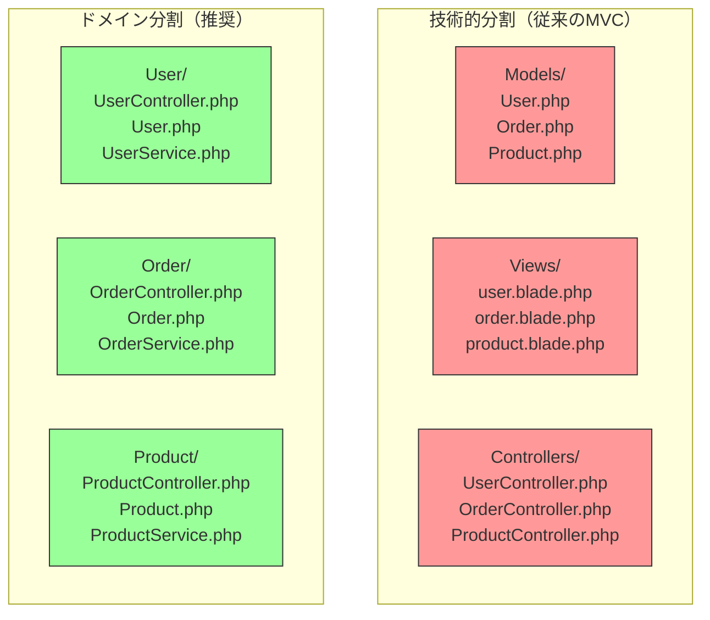

# 関心の分離

> **一言で言うと:** 「変更の理由が異なるものは分離する」という、全設計原則の根本にある考え方。MVC、レイヤードアーキテクチャ、マイクロサービスは全てこの原則の応用である。

## 3分で全体像

- **何を解決する技術か:** 「ある機能の変更が無関係な機能を壊す」「1つのコードを読むのにシステム全体を理解する必要がある」という保守性・認知負荷・並行開発の問題を、**変更の理由ごとにモジュールを分割する**ことで構造的に止める
- **代表的な使用シーン:** MVC / レイヤードアーキテクチャ / マイクロサービスの境界設計、ミドルウェアによる横断的関心事（ログ・認証・エラー処理）の切り出し、コンポーネント分割、ドメイン駆動設計（DDD）の Bounded Context、フロントエンドの状態管理とビューの分離
- **これだけは覚える3つ:**
    1. **「関心」=「変更の理由」と読み替える** — ファイルを分けたから分離されたわけではない。**異なるステークホルダー / 異なるビジネス上の理由で変更される単位**が異なるモジュールに属していることが本質。経理部の要望と運用部の要望が同じクラスを変更させるなら SoC 違反
    2. **分離のコストと利益を天秤にかける** — レイヤーを増やすほど良いわけではない。各レイヤーに**固有の変更理由**がなければ、それはただの間接参照増殖（ショットガン手術を招く）。3 ファイルが常に同時更新されているなら分離は不適切
    3. **技術分割よりドメイン分割の方が変更が局所化する** — `models/` `views/` `controllers/` で機械分割すると「ユーザー機能を変更」で 3 箇所修正が必要になる。`User/` `Order/` `Payment/` のドメイン分割なら 1 ディレクトリで完結する
- **AIに任せやすいか:** **一部任せられる** — 「Service / Repository を切り分け」「ミドルウェアに認証を切り出し」など定型分離は AI が高品質に書く。一方で「**何を 1 つの関心とみなすか**」「**今分離すべきか、まだ早いか**」「**ドメイン軸 vs 技術軸のどちらで割るか**」は実データの変更パターンとビジネス文脈に依存し、人間が最終判断する必要がある。AI は **「分離した方が綺麗に見える」**側に常にバイアスがあるため、**過剰なレイヤー分割**を疑う
- **詰まったらここを読む:** [[SOLID原則]] / [[モノリスvsマイクロサービス]] / [[コンポーネント設計]]

## なぜ必要か

ソフトウェアは時間とともに変更される。変更されないソフトウェアは死んだソフトウェアだけだ。問題は、コードベースが成長すると**ある機能の変更が無関係な機能を壊す**という現象が起き始めることにある。

関心の分離（Separation of Concerns, SoC）がなければ:

- **変更の影響範囲が予測不能になる** — UIの色を変えただけでビジネスロジックが壊れる、バリデーションルールを修正しただけでデータベースへのクエリが変わる、といった事態が起こる
- **コードの理解に必要な文脈が爆発的に増える** — 1つのファイルを読むのに、システム全体を理解しなければならなくなる
- **チーム開発が破綻する** — 複数人が同じファイルを同時に編集することが増え、コンフリクトが日常化する
- **テストが困難になる** — 1つの機能をテストするためにシステム全体をセットアップする必要が出てくる

## どの問題を解決するか

### 問題1: 変更の波及（Ripple Effect）

あるモジュールの内部変更が、本来無関係な他のモジュールに波及する問題。

**解決方法:** 各モジュールが「1つの関心事」だけを担当するように分割する。関心事とは「変更される理由」と同義であり、これは[[SOLID原則]]の単一責任原則（SRP）そのものでもある。

### 問題2: 認知的負荷の増大

1つの処理を理解するために、関係ないコードまで読まなければならない問題。

**解決方法:** 関心事ごとにコードを分離し、それぞれの境界を明確にする。開発者は自分が扱う関心事だけに集中できるようになる。

### 問題3: 並行開発の困難

複数の開発者が同じコードを触ることによるコンフリクトや調整コストの問題。

**解決方法:** 関心事ごとに独立したモジュール/ファイルに分割し、チームメンバーが異なる領域を並行して開発できるようにする。

### 問題4: 再利用性の欠如

ある機能を別の場所で使いたいのに、不要な依存がついてくる問題。

**解決方法:** 関心事を分離することで、特定の機能だけを取り出して再利用可能にする。例えばバリデーションロジックがUIフレームワークに依存していなければ、フロントエンドでもバックエンドでも同じロジックを使える。

## 他の仕組みとどう関係するか

- **下位レイヤーとの関係:**
  - [[HTML-CSS-JS|HTML-CSS-JSの本質]] — HTMLは構造、CSSは見た目、JSは振る舞い、という3つの関心事の分離がWeb技術の出発点。これが崩れるとスタイルの変更にHTML修正が必要になるなど、保守性が著しく低下する
  - [[ルーティングとミドルウェア]] — ミドルウェアは「認証」「ログ」「エラーハンドリング」といった横断的関心事（Cross-Cutting Concerns）を本来のビジネスロジックから分離する仕組み。[[玉ねぎモデル]]はその典型的な実装パターン
  - [[コンポーネント設計]] — UIを関心事の単位で分割する実践。「変更の理由が1つ」になる粒度が正しい分割

- **同レイヤーとの関係:**
  - [[SOLID原則]] — 特に単一責任原則（SRP）は関心の分離を「クラス/モジュール」レベルで適用したもの。依存性逆転の原則（DIP）は分離した関心事間の依存方向を制御する手段
  - [[モノリスvsマイクロサービス]] — マイクロサービスは関心の分離を「デプロイ単位」にまで拡張したもの。ただし分離のコストも大きくなるため、痛みが出てから検討すべき
  - [[テスト戦略]] — 関心が適切に分離されているコードは、ユニットテストが書きやすい。テストのしにくさは、関心の分離が不十分なサイン
  - [[イベント駆動-CQRS]] — 読み取りと書き込みという2つの関心事を分離するアーキテクチャパターン

- **上位レイヤーとの関係:**
  - 関心の分離は最上位の設計原則であるため、「上位」は存在しない。むしろ、全レイヤーの設計判断の根幹となる考え方

## 誤解されやすいポイント

### 1. 「ファイルを分割すれば関心が分離される」わけではない

ファイルを分ける行為は関心の分離の**手段の一つ**にすぎない。重要なのは「変更の理由が異なるものが、異なるモジュールに属していること」であり、ファイルを100個に分けても、それぞれが互いの内部実装に依存していれば分離とは言えない。逆に、1つのファイル内でも関数レベルで適切に責務が分かれていれば、それは立派な関心の分離である。

### 2. 「レイヤーを増やすほど良い設計になる」わけではない

Controller → Service → Repository → DAO → Entity … と層を増やす過度なレイヤリングは、関心の分離ではなく**間接参照の増殖**にすぎない。各レイヤーに明確に異なる「変更の理由」がなければ、それはただの儀式的コードであり、変更のたびに複数ファイルを同時修正する「ショットガン手術」を招く。

### 3. 「関心の分離 = 技術的分割」と決めつけてしまう

従来のMVCはModel/View/Controllerという**技術的な役割**で分割する。しかし実務では「ユーザー管理」「決済」「通知」といった**ビジネスドメイン**で分割する方が変更の局所化に効果的な場合が多い。技術的分割では「ユーザー登録機能を変更する」際にModel・View・Controller全てを修正する必要があるが、ドメイン分割なら変更は1つのモジュールに閉じる。

### 4. 「DRYを守るために関心の分離を犠牲にする」

2つのコードが偶然似ているだけなのに、[[DRY原則]]に従って共通化してしまうケース。例えば「ユーザー登録のバリデーション」と「プロフィール更新のバリデーション」は今は同じルールでも、変更される理由が異なるため、無理に共通化すると後で分岐だらけのコードになる。**偶然の重複（Accidental Duplication）** と **本質的な重複（Essential Duplication）** を区別することが重要（→ [[DRY原則]]を参照）。

## 設計のベストプラクティス

### 推奨パターン

**1. 変更の理由で分割する**

分割の基準は技術的な役割ではなく「何がこのコードを変更させるか」。ビジネスルールの変更、UIデザインの変更、インフラの変更はそれぞれ異なる理由なので、分離すべき。

**2. 境界は「公開インターフェース」で定義する**

モジュール間の結合は、公開された関数やAPIを通じてのみ行う。内部実装の詳細は隠蔽する（[[デメテルの法則]]も参照）。これにより、内部を自由に変更できる。

**3. 依存の方向を一方向にする**

A → B の依存があるなら、B → A の依存は許さない。循環依存は関心の分離が不完全なサイン。依存の方向を制御する手法として[[SOLID原則]]の依存性逆転の原則がある。[[クリーンアーキテクチャ]]や[[オニオンアーキテクチャ]]はこの「依存方向の一方向化」を同心円モデルとして体系化したもの（前者は Use Case を独立層化し、後者はドメインモデルを最内層に置く点が異なる）。

**4. 横断的関心事は専用の仕組みで扱う**

ログ、認証、[[エラーハンドリングとフォールバックの設計戦略|エラーハンドリング]]などの横断的関心事（Cross-Cutting Concerns）は、ミドルウェアやデコレータ、アスペクト指向の仕組みで分離する。全モジュールにコピペするのは分離ではない。

### アンチパターン

**1. God Object / God Module** — 1つのクラスやモジュールがあらゆる責務を持つ。「Utils」「Helper」「Manager」「Service」という名前のクラスが肥大化していたら要注意。

**2. Feature Envy** — あるモジュールが別のモジュールのデータに頻繁にアクセスして処理を行う。そのロジックはデータを持っている側に移すべき（→ [[デメテルの法則]]）。なお、設計の複雑さを抑えるには[[KISS]]原則も意識する。

**3. ショットガン手術（Shotgun Surgery）** — 1つの変更のために多くのファイルを修正しなければならない。関心が適切に分離されていないか、分離の軸が間違っている。

## AIエージェントとの協働

> このトピックでAIコーディングエージェント（Claude Code, Copilot, Cursor 等）と協働するための観点。
> **「AIに何をどこまで任せ、AIに何をレビューさせ、人間は何を最終判断するか」**を整理する。実装だけでなく**レビューもAIに任せられる**前提で考える（AIコードレビュー観点で横断アンチパターン照合を行う）。

### AIに任せられる部分 / 人間が判断すべき部分

| タスク種類 | 任せ方（実装/レビュー） | 人間の関与 |
|---|---|---|
| Service / Repository / Controller の定型分離 | **実装もレビューも AI 主導** — 既存パターンに沿った分離は AI が高品質に書ける。AIコードレビュー観点でレビューさせる | 既存プロジェクトの命名・配置規約と整合しているかの最終確認 |
| 横断的関心事（ログ・認証・エラー処理）のミドルウェア化 | **実装もレビューも AI 主導** — Express / Laravel / Django のミドルウェア / フィルター実装は AI が定型化できる | どの関心事を横断化すべきか（コピペが3箇所超えたか）の判断 |
| ドメイン分割 vs 技術分割の選択 | **AI に複数案を出させる** — `User/` 凝集型と `controllers/` 機能型のディレクトリ案を両方生成させて比較 | **人間が最終判断** — 実データの変更パターン（過去の git log で同時変更されたファイルの組）と将来予定機能で決める |
| 1 つの関心の粒度（クラス分割の判断） | **AI レビュー併用** — 「このクラスに変更理由が複数あるか」を AI に問わせる | **人間が最終判断** — ステークホルダーマップ（誰が何を変更させるか）を踏まえた判断はビジネス文脈依存 |
| 偶然の重複 vs 本質的な重複の判定 | **AI レビュー慎重** — AI は重複を見つけると共通化を即座に提案するため、「**変更理由が同じか**」を毎回問うルールで指示する | **人間が最終判断** — 「現在は似ているが今後別方向に進化するか」は AI には判断不能 |

### AI生成コードのレビュー観点（このトピック固有）

AI生成物を受け取ったとき、最低限ここを見る。

1. **層がパススルーになっていないか** — Controller → Service → Repository が全てただ次の層に丸投げしているなら、その層には**固有の責務**がない。削除を検討する
2. **ドメイン凝集が壊れていないか** — `User` 機能を変更するために `models/User.ts` `views/UserList.tsx` `controllers/UserController.ts` の 3 箇所を必ず触るなら、技術分割が**変更の局所化**を阻害している。ドメイン分割（`User/` 配下に集約）に変える価値がある
3. **「将来交換するかも」のためのインターフェースがないか** — 実装が 1 つしかなく、テストでモックもしないインターフェースは**儀式的抽象化**。削除する判断材料は「**今交換する計画があるか**」「**テストでモックするか**」の 2 つだけ

### 効くプロンプトの型

このトピックに関する実装をAIに依頼するとき、コンテキストとして渡すべき情報・制約・成功基準のテンプレ。

```
# 前提（プロジェクトの状況・既存のコード規約）
- 既存の構造: app/Modules/{Domain}/{Controllers,Services,Repositories} のドメイン分割
- 既存の横断関心事: ログ / 認証 / エラー処理は middleware/ に集約済み
- 直近の変更履歴: User ドメインは過去 6 ヶ月で 12 回 / Order は 3 回更新（変更頻度の非対称あり）

# やってほしいこと
- 注文確定機能の実装を新規追加。既存の Modules/Order/ 内に閉じ込める

# 守ってほしい制約（このトピック固有のもの）
- Controller は HTTP 入出力の関心のみ。バリデーションは FormRequest / DTO に分離
- Service にビジネスルール、Repository に DB アクセスの関心を限定
- 横断的関心事（ロギング・トランザクション制御）は既存 middleware を使い、Service 内で `try/catch` を増やさない
- 既存実装が 1 つしかないなら interface は作らない（YAGNI）

# 完了の判断基準
- Order ドメインを変更する将来の修正で、Modules/Order/ 以外を触らなくて済む
- 各層に「**この層が変更される固有の理由**」が説明できる
- ユニットテストが Service 単位で（DB を起動せずに）書ける
```

### AI実装のアンチパターン

LLM生成コードで頻出する過剰設計・誤用パターン。レビュー時の照合表として使う。

| アンチパターン | なぜ問題か | レビュー観点 / 対策 |
|---|---|---|
| 過剰なレイヤー分割 | CRUDのような単純な処理に Controller/Service/Repository/DAO を全て作る。各層がただのパススルーになる | 「このレイヤーに固有のロジックがあるか」を問い、なければ省略する。**3 層全てが 1 行のメソッド**ならそれはパススルー |
| 儀式的なインターフェース | 実装が1つしかないのに全てにインターフェースを定義する。テストでモックする予定もない | インターフェースは「**今交換する計画があるか / テストでモックするか**」の 2 条件のいずれかを満たす場合のみ作成 |
| 技術分割の過信 | `models/` `views/` `controllers/` と機械的にフォルダ分けするだけで、ドメインの凝集度を無視する | 機能の変更が1箇所で完結するかを基準に構造を決める。`User/` ドメイン配下に Model/View/Controller を集約する |
| 共通化の過剰追求 | 似たコードを見つけるとすぐにユーティリティ関数に切り出す。偶然の重複を本質的な重複と混同する | まず「変更理由が同じか」を問い、異なれば重複を許容する。**3 回以上完全に同じ重複が出るまで共通化しない**（Rule of Three） |
| 横断関心事のコピペ展開 | 認証チェック / ログ出力を全 Controller にコピペで埋め込む。1 箇所変更で全箇所修正が必要 | ミドルウェア / デコレータ / AOP に移譲し、本来のビジネスロジックから分離する |
| ショットガン手術の温存 | AI が「変更箇所のヒット数 = タスク完了の証拠」として複数ファイルを修正し、本来 1 ファイルに集約すべき責務に気づかない | 「1 つの変更で複数ファイル修正が必要なら**分離の軸が間違っている**サイン」を AI への指示に明記 |

→ レイヤー横断のアンチパターン索引: [[_anti-patterns/_index|AIアンチパターン索引]]

## 具体例

### 関心が混ざったコード（悪い例）

```typescript
// ❌ 1つの関数にUI・バリデーション・DB操作・通知の関心が混在
async function handleSubmit(form: HTMLFormElement) {
  const name = form.querySelector('#name').value;
  const email = form.querySelector('#email').value;

  // バリデーション
  if (!name || name.length < 2) {
    document.getElementById('error').textContent = '名前は2文字以上';
    return;
  }
  if (!email.includes('@')) {
    document.getElementById('error').textContent = 'メールアドレスが不正';
    return;
  }

  // DB保存
  const res = await fetch('/api/users', {
    method: 'POST',
    body: JSON.stringify({ name, email }),
  });

  // UI更新
  if (res.ok) {
    document.getElementById('success').style.display = 'block';
    // メール送信
    await fetch('/api/send-welcome-email', {
      method: 'POST',
      body: JSON.stringify({ email }),
    });
  }
}
```

### 関心を分離したコード（良い例）

```typescript
// ✅ 各関心事が独立したモジュールに分離されている

// --- バリデーション（ビジネスルール） ---
function validateUser(data: { name: string; email: string }): string[] {
  const errors: string[] = [];
  if (!data.name || data.name.length < 2) errors.push('名前は2文字以上');
  if (!data.email.includes('@')) errors.push('メールアドレスが不正');
  return errors;
}

// --- APIクライアント（データアクセス） ---
async function createUser(data: { name: string; email: string }) {
  const res = await fetch('/api/users', {
    method: 'POST',
    headers: { 'Content-Type': 'application/json' },
    body: JSON.stringify(data),
  });
  if (!res.ok) throw new Error('ユーザー作成に失敗');
  return res.json();
}

// --- UIハンドラ（表示とユーザー操作の橋渡し） ---
async function handleSubmit(form: HTMLFormElement) {
  const data = {
    name: form.querySelector<HTMLInputElement>('#name')!.value,
    email: form.querySelector<HTMLInputElement>('#email')!.value,
  };

  const errors = validateUser(data);
  if (errors.length > 0) {
    showErrors(errors);
    return;
  }

  await createUser(data);
  showSuccess();
}
```

### バックエンドでのレイヤー分離（Laravel の例）

```php
// --- Controller（HTTPの関心事） ---
class UserController extends Controller
{
    public function __construct(private UserService $userService) {}

    public function store(CreateUserRequest $request): JsonResponse
    {
        // バリデーションは FormRequest が担当（関心の分離）
        $user = $this->userService->register($request->validated());
        return response()->json($user, 201);
    }
}

// --- Service（ビジネスロジックの関心事） ---
class UserService
{
    public function __construct(
        private UserRepository $userRepository,
    ) {}

    public function register(array $data): User
    {
        $user = $this->userRepository->create($data);
        // 通知は非同期ジョブに分離（関心の分離）
        dispatch(new WelcomeEmailJob($user));
        return $user;
    }
}

// --- Repository（データアクセスの関心事） ---
class UserRepository
{
    public function create(array $data): User
    {
        return User::create($data);
    }
}
```

### 分離の軸の比較（Mermaid図）


```mermaid
graph TD
    subgraph "技術的分割（従来のMVC）"
        M["Models/<br/>User.php<br/>Order.php<br/>Product.php"]
        V["Views/<br/>user.blade.php<br/>order.blade.php<br/>product.blade.php"]
        C["Controllers/<br/>UserController.php<br/>OrderController.php<br/>ProductController.php"]
    end

    subgraph "ドメイン分割（推奨）"
        U["User/<br/>UserController.php<br/>User.php<br/>UserService.php"]
        O["Order/<br/>OrderController.php<br/>Order.php<br/>OrderService.php"]
        P["Product/<br/>ProductController.php<br/>Product.php<br/>ProductService.php"]
    end

    style M fill:#f99,stroke:#333
    style V fill:#f99,stroke:#333
    style C fill:#f99,stroke:#333
    style U fill:#9f9,stroke:#333
    style O fill:#9f9,stroke:#333
    style P fill:#9f9,stroke:#333
```

> 技術的分割では「ユーザー機能を変更」するとModels・Views・Controllers の3箇所を修正する。ドメイン分割ではUser/ディレクトリ内で完結する。

## 参考リソース

- *Clean Architecture* — Robert C. Martin（関心の分離とアーキテクチャ境界の定番書）
- *A Philosophy of Software Design* — John Ousterhout（「深いモジュール」の概念が関心の分離を別角度から説明）
- *Domain-Driven Design* — Eric Evans（ドメインによる分割の原典）
- Separation of Concerns — Wikipedia（概念の歴史。Dijkstraが1974年に提唱）

## 理解度セルフチェック

> 答えられなければ本文に戻る。答えはこのファイル内に必ずある。

1. 「関心の分離」の「関心」とは具体的に何のことか？「ファイルを 100 個に分けたから関心が分離された」と言えない理由を 30 秒で説明してみよう
2. 既存の Express アプリで、認証チェック処理が全 Controller の冒頭に同じ形でコピペされている。これは関心の分離としてどんな問題があり、どう解決すべきか？「DRY だから関数化する」だけでは不十分な理由も含めて答えよ
3. 以下のコードに対して AI が「Service 層が薄いので Repository を直接呼べばよい、Service を削除しよう」と提案してきた。この提案を受け入れるべきか、保留すべきか？判断するためにあなたが追加で確認すべき情報を 2 つ挙げよ
   ```typescript
   // app/Modules/User/Services/UserService.ts
   class UserService {
     constructor(private repo: UserRepository) {}

     async findById(id: string): Promise<User | null> {
       return this.repo.findById(id);  // 単純な委譲のみ
     }

     async create(data: CreateUserInput): Promise<User> {
       return this.repo.create(data);  // 単純な委譲のみ
     }
   }
   ```

> [!note]- 解答の指針
>
> > [!info] 用語ミニ辞典
> > - **関心（Concern）**: SoC 文脈では「変更の理由（Reason to Change）」と読み替える。誰が・どんな動機で・このコードを変更させるかの単位
> > - **ステークホルダー**: コード変更を要求しうる人や役割。経理部・運用部・マーケティング部など。同じクラスを別のステークホルダーが変更させるなら SoC 違反のサイン
> > - **横断的関心事（Cross-Cutting Concerns）**: ログ・認証・トランザクション・エラー処理など、複数のビジネス機能から共通に必要となる関心事。本来のビジネスロジックと混ぜず、ミドルウェア / デコレータ / AOP（アスペクト指向プログラミング）で分離する
> > - **DRY（Don't Repeat Yourself）**: 同じ知識をコード上に重複させない原則。ただし**「偶然の重複」**（今は同じだが変更理由が異なる）と**「本質的な重複」**（変更理由が同じ）を区別しないと、誤った共通化で後の分岐爆発を招く
> > - **パススルー層**: 受け取った引数をそのまま下の層に渡すだけで、独自のロジックを持たない層。間接参照だけ増えて変更コストが上がる、設計上の負債
>
> 1. 「関心」は「変更の理由（Reason to Change）」のこと。**異なるステークホルダー / 異なるビジネス上の動機でモジュールが変更されないこと**が分離の本質。ファイル数は手段にすぎず、100 ファイルに分けても互いの内部実装を直接参照していれば結合は変わらない。逆に 1 ファイル内の関数レベルでも、責務が変更理由ごとに分かれていれば SoC 成立。**判定基準**: 「この変更を要求するのは誰か」を問い、答えが 2 通り以上あればそのモジュールは分離余地がある
>
> 2. **問題**: 認証チェックは「**横断的関心事**」（全エンドポイントで必要）で、本来のビジネスロジック（注文作成・ユーザー登録など）とは**変更理由が異なる**。例えば「JWT に切り替える」という認証側の変更が、全ビジネスロジックの修正を要求してしまう。これは典型的な**ショットガン手術**。
>
>    **「DRY だから関数化」が不十分な理由**: 関数化（`checkAuth(req)` を全 Controller の冒頭で呼ぶ）はコピペは消えるが、**呼び出し箇所が分散したまま**。認証ロジックの呼び忘れ・順序ミスのリスクは残る。
>
>    **正しい解決**: ミドルウェア / デコレータに移譲し、ルーティング層で**宣言的に**適用する。Express なら `app.use('/api', authMiddleware, apiRouter)`、Laravel なら `Route::middleware('auth')->group(...)`。これで Controller のコードからは認証の関心が完全に消え、認証方式変更時はミドルウェア 1 箇所のみの修正で済む
>
> 3. **保留すべき**。AI の提案は表面的には正しい（**パススルー層**の典型）が、判断には文脈情報が必要。
>
>    **追加で確認すべき情報 2 つ**:
>
>    1. **将来予定機能で Service にロジックが入るか**: 例えば「next sprint で新規登録時にウェルカムメール送信・ポイント付与・分析イベント発行を追加する」予定があれば、Service 層は近い将来に責務を持つ。今削除すると後で復活させる二重作業 + その間に Controller に直接ビジネスロジックが書かれる悪化リスクがある。逆に「**この機能は今後変更予定なし**」が明確なら削除は妥当
>    2. **プロジェクト内の他ドメインの Service が同じ「薄さ」か**: User/Order/Payment 全ての Service が同様にパススルーなら**プロジェクト全体の規約**として Service 層を持つ判断（テスト時のモック点 / トランザクション境界 / ログ集約点として）。1 つのドメインだけ削除すると規約のばらつきが生まれ、新規メンバーの認知負荷が上がる
>
>    **思考プロセス**: AI のアドバイスは**「現時点のコードだけ」**を見て判断するため、**変更予定（時間軸）**と**プロジェクト規約（横軸）**の文脈を見落とす。SoC の判断は常に**過去の変更頻度 + 将来予定 + 他モジュールとの整合性**の 3 軸で行う

## 学習メモ

- 関心の分離の「関心」とは「変更の理由」と読み替えると判断しやすい
- 過度な分離も害になる — 分離にはコスト（間接参照・ファイル数増加・コード追跡の困難さ）がかかるため、**実際の変更パターン**に基づいて判断すべき
- フロントエンドでは近年、技術分割（HTML/CSS/JS）よりコンポーネント単位の分割（関心事ごとのコロケーション）が主流になっている（React、Vue SFC など）
