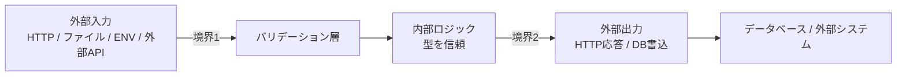

# 防御的すぎるエラーハンドリング — AI実装アンチパターン

> **このファイルは何か:** AIコーディングエージェントが頻発させる **「全関数・全引数・全レスポンスをチェックする」** 系アンチパターンの横断索引。「過剰なフォールバック」と隣接するが、こちらは **「チェックの過剰」**、向こうは **「リカバリの過剰」** で焦点が違う。

## 一言で言うと

> **「何か起きたときのため」と称して全関数にバリデーション・try-catch・null チェックを重ね、可読性とエラー検出力を同時に壊す。**

## 何が問題か

防御的プログラミング自体は良い習慣だが、**境界 (boundary) の概念が抜ける**と過剰になる。AI は「境界の内 / 外」を区別しないため、内部関数にも外部入力扱いのチェックを入れる。

- 内部関数の引数チェック（型システムが既に保証）
- 全メソッドに try-catch を直書き
- レスポンスのフィールドが存在するかを `??` で重ねる
- バリデーションを「フロントとバックの両方で同じルールで二重実装」
- 「起こりえないケース」への分岐
- ENV変数を読むたびに「なかったらデフォルト」（起動時に1回でよい）

これらは:
- **可読性を壊す** — 本質的なロジックがガード句に埋もれる
- **エラー検出を遅らせる** — 早期に失敗すべきものが「とりあえず動く」になる
- **テストを難しくする** — 起こりえない分岐をどうテストするか

## 典型コード

### 1. 内部関数の引数チェック地獄

```typescript
// ❌ 悪い例 — TypeScriptの型保証を二重チェック
function applyDiscount(price: number, discountRate: number): number {
  if (price === null || price === undefined) {
    throw new Error('price is required');
  }
  if (typeof price !== 'number') {
    throw new Error('price must be a number');
  }
  if (price < 0) {
    throw new Error('price must be non-negative');
  }
  if (discountRate === null || discountRate === undefined) {
    throw new Error('discountRate is required');
  }
  // ... さらに続く

  return price * (1 - discountRate);
}
```

何が悪いか: **TypeScript の型システムが既に保証**している不変条件を実行時に再チェック。本質ロジック（`price * (1 - discountRate)`）が埋もれる。

```typescript
// ✅ 良い例 — 型システムを信頼
function applyDiscount(price: number, discountRate: number): number {
  return price * (1 - discountRate);
}
```

**境界バリデーションは1回だけ:**

```typescript
// ✅ 境界 (API ハンドラ) では Zod 等でバリデーション
const schema = z.object({
  price: z.number().nonnegative(),
  discountRate: z.number().min(0).max(1),
});

app.post('/discount', (req) => {
  const input = schema.parse(req.body);  // ここで1回バリデーション
  return applyDiscount(input.price, input.discountRate);  // 内部は型を信頼
});
```

### 2. 全メソッドに try-catch

```python
# ❌ 悪い例 — 全関数に try-except
def get_user(user_id):
    try:
        return User.query.get(user_id)
    except Exception as e:
        logger.error(f"Failed to get user: {e}")
        return None

def get_user_email(user_id):
    try:
        user = get_user(user_id)
        if user is None:
            return None
        return user.email
    except Exception as e:
        logger.error(f"Failed to get email: {e}")
        return None

def send_welcome_email(user_id):
    try:
        email = get_user_email(user_id)
        if email is None:
            return None
        # ...
    except Exception as e:
        logger.error(f"...")
```

何が悪いか:
- 各関数で同じことを繰り返す → DRY 違反
- 何が起きたか分からない（全部 None）
- フレームワーク標準のエラーハンドリング機構が活きない

```python
# ✅ 良い例 — エラーは伝播、集約ハンドラで処理
def get_user(user_id):
    return User.query.get(user_id)  # 失敗は例外として伝播

def get_user_email(user_id):
    return get_user(user_id).email  # 内部はハッピーパスのみ

# Flask の global error handler で集約
@app.errorhandler(Exception)
def handle_error(e):
    logger.exception("Unhandled error")
    return {"error": "Internal error", "requestId": g.request_id}, 500
```

### 3. レスポンス構造の二重チェック

```typescript
// ❌ 悪い例 — 自社 API のレスポンスを毎回防御
const response = await fetch('/api/user');
const data = await response.json();

if (!data) return null;
if (!data.user) return null;
if (!data.user.profile) return null;
if (!data.user.profile.name) return null;

return data.user.profile.name;
```

何が悪いか: **OpenAPI / GraphQL スキーマで型保証されているなら不要**。バックエンド契約を信じない設計が、契約の意味を壊す。

```typescript
// ✅ 良い例 — スキーマからの型生成 + 1度だけ境界で検証
const data = UserResponseSchema.parse(await response.json());
return data.user.profile.name;
```

### 4. 起こりえないケースへの分岐

```typescript
// ❌ 悪い例 — switch の default で「ありえない」処理
type Status = 'active' | 'inactive' | 'pending';

function display(status: Status): string {
  switch (status) {
    case 'active':   return '有効';
    case 'inactive': return '無効';
    case 'pending':  return '保留';
    default:
      // status の型は never のはず
      return '不明';  // ← 何を意味するか曖昧
  }
}
```

何が悪いか: 型システムが網羅性を保証しているなら、`default` は **検出機構** にすべき:

```typescript
// ✅ 良い例 — 型システムに網羅性を強制させる
function display(status: Status): string {
  switch (status) {
    case 'active':   return '有効';
    case 'inactive': return '無効';
    case 'pending':  return '保留';
    default:
      const _exhaustive: never = status;  // 新ステータス追加時にコンパイルエラー
      throw new Error(`Unknown status: ${status}`);
  }
}
```

### 5. ENV変数の毎回読み + デフォルト

```python
# ❌ 悪い例 — 関数内で毎回 ENV を読み、なかったらデフォルト
def connect_db():
    host = os.getenv('DB_HOST', 'localhost')
    port = int(os.getenv('DB_PORT', '5432'))
    return psycopg2.connect(host=host, port=port, ...)
```

何が悪いか: **本番で `DB_HOST` 未設定なのに気づかず localhost に接続**してしまう。設定は **起動時に1回バリデーション**して、欠けていたら即停止が正しい。

```python
# ✅ 良い例 — 起動時に検証 (Pydantic Settings 等)
class Settings(BaseSettings):
    db_host: str   # 必須、未設定なら起動失敗
    db_port: int = 5432  # デフォルト明示

settings = Settings()  # ここで検証
```

## どう直すか

### 原則: 境界 (Boundary) の概念



- **境界1 (入力)**: バリデーション必須
- **境界2 (出力)**: スキーマ整形必須
- **内部 (C)**: 型/スキーマ保証を信頼、防御コード最小

### チェックリスト

- [ ] このチェックは境界か内部か？ — 内部なら多くは削除可
- [ ] 型システム / スキーマライブラリで既に保証されているか？
- [ ] エラー処理はフレームワーク標準の集約機構に任せられないか？
- [ ] `default` `else` は検出機構として書かれているか？それとも握りつぶしか？
- [ ] ENV / 設定は起動時に1回検証されているか？

## レイヤー別の発生地

| レイヤー | 典型例 | 索引へのリンク |
|---|---|---|
| Layer 0 | アルゴリズム引数の null チェック | [[_anti-patterns/レイヤー別/Layer0\|Layer0.md]] |
| Layer 4 Backend | 全フィールドに `if (!input.name)` の手書き、過剰防御コーディング | [[_anti-patterns/レイヤー別/Layer4-Backend\|Layer4-Backend.md]] |
| Layer 4 Frontend | API レスポンスの全プロパティ Optional チェック | [[_anti-patterns/レイヤー別/Layer4-Frontend\|Layer4-Frontend.md]] |
| Layer 7 | テスト戦略で「未到達コード」のテスト追加 | [[_anti-patterns/レイヤー別/Layer7\|Layer7.md]] |

## レビュー観点

1. **この `if` は型システムが保証していないか？** — 保証されているなら削除
2. **このチェックは外部入力か内部関数か？** — 内部なら撤去候補
3. **`default` / `else` は何を意味するか？** — 「ありえない」なら `never` 型で型に任せる
4. **同じ検証が複数箇所にあるか？** — 境界に集約

## 「これだけ AI に伝える」追プロンプト

```
以下のコードから防御的すぎるチェックを削除してください。

削除基準:
- TypeScript / Pydantic / Zod 等の型システムが既に保証している条件のチェック
- 内部関数の引数 null チェック（境界バリデーションが上流にあるなら）
- フレームワーク標準のエラーハンドラに任せられる try-catch
- 起こりえない default / else 分岐 (網羅性は型で保証する)

維持する:
- 境界バリデーション (HTTP リクエスト / ファイル / ENV / 外部 API レスポンス)
- ビジネスルール検証 (型では表せない不変条件)
- 必須環境変数の起動時検証

network 呼び出しや外部 API の例外は、上位のグローバルエラーハンドラへ伝播させてください。
```

## 関連

- [[_anti-patterns/_index|AIアンチパターン索引]]
- [[_anti-patterns/パターン別/過剰なフォールバック]]（隣接パターン）
- [[_anti-patterns/パターン別/不要な抽象化]]
- [[_starter/04_AI協働の基本動作]]
