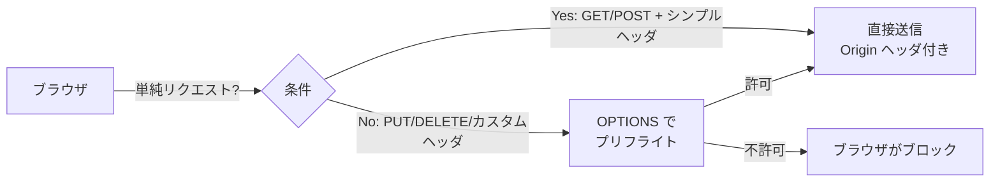

# Layer 2: ネットワーク・プロトコル — チートシート

> **このファイルは何か:** Layer 2（ネットワーク）の **「再読時に1分で思い出すための要約」**。HTTP / DNS / TLS / WebSocket の要点を1ページに集約。

## レイヤーの位置

> 物理的に離れた2台のマシンが、**信頼性のある通信**を行う。
> 上位 Layer 4 (App) はこの層の挙動を「当然動く」前提にしているが、本番障害の半分はここで起きる。

## トピック早見表

| トピック | これだけ覚える | AIに任せやすいか |
|---|---|---|
| [[TCP-IP]] | パケット保証 / 3-way handshake / TIME_WAIT | minimal（OS 設定は判断要） |
| [[DNS]] | TTL / Aレコード / CNAME / 階層解決 | partial |
| [[HTTP-HTTPS]] | ステートレス / メソッド / ステータス / Cookie | heavy |
| [[TLS-SSL]] | 証明書チェーン / ハンドシェイク / TLS 1.3 | partial |
| [[WebSocket]] | 全二重 / リアルタイム / 切断検知が課題 | partial |

## HTTPメソッドの早見表

| メソッド | 用途 | 冪等? | キャッシュ可? |
|---|---|---|---|
| GET | 取得 | ✅ | ✅ |
| HEAD | ヘッダのみ取得 | ✅ | ✅ |
| POST | 作成 / 任意処理 | ❌ | ❌ |
| PUT | 完全置換 | ✅ | ❌ |
| PATCH | 部分更新 | ❌（仕様上） | ❌ |
| DELETE | 削除 | ✅ | ❌ |
| OPTIONS | プリフライト | ✅ | — |

## HTTPステータスコード早見表

| 範囲 | 意味 | 代表例 |
|---|---|---|
| 1xx | 情報 | 100 Continue / 101 Switching Protocols |
| 2xx | 成功 | 200 OK / 201 Created / 204 No Content |
| 3xx | リダイレクト | 301 Moved Permanently / 304 Not Modified |
| 4xx | クライアントエラー | 400 / 401 / 403 / 404 / 409 / 422 / 429 |
| 5xx | サーバエラー | 500 / 502 / 503 / 504 |

**よく混同されるペア:**
- 401 (未認証) ⇔ 403 (認証済みだが権限なし)
- 400 (リクエスト不正) ⇔ 422 (リクエスト形式は OK だが意味的に処理不能)
- 502 (上流からの不正レスポンス) ⇔ 504 (上流タイムアウト)
- 401/403/404 の選択は「**存在の漏洩**」を伴う設計判断 — 認可失敗で 403 を返すと「リソースは存在する」と推測されるため、**存在自体を隠したいなら 404 で統一**する設計もある

## TLSハンドシェイクの所要

| バージョン | RTT | 特徴 |
|---|---|---|
| TLS 1.2 | 2-RTT | フルハンドシェイク |
| TLS 1.3 | 1-RTT | 標準。0-RTT は再接続時のみ |
| QUIC (HTTP/3) | 0-RTT | UDPベース、再接続が高速 |

**新規接続が遅い症状**は大抵ここ。**Keep-Alive** で再利用する。
**証明書の Subject Alternative Name (SAN)** で複数ドメインに対応。Common Name (CN) は廃止傾向。

## DNS の所要時間

| ステップ | 説明 | 通常時間 |
|---|---|---|
| キャッシュヒット (OS / リゾルバ) | TTL 内 | μs〜ms |
| 権威サーバ問い合わせ | TTL 切れ後 | 10〜100ms |
| TLD 経由の階層解決 | 完全初回 | 100〜500ms |

**DNS 関連の典型障害:**
- TTL 短すぎる → 権威サーバ負荷
- TTL 長すぎる → IP 変更が伝播しない
- CNAME チェーンが深い → 解決が遅い
- Negative Cache (NXDOMAIN キャッシュ) で復旧後も解決失敗が継続

## CORS の挙動



- `Access-Control-Allow-Origin: *` + `credentials: true` は **仕様上禁止**
- プリフライトのキャッシュは `Access-Control-Max-Age` で制御
- **CORS はブラウザだけの仕組み** — サーバ間通信は影響を受けない

## AI協働でよく出るアンチパターン (Layer 2)

- **HTTPステータスを 200 にして body の `success` で判別** → リトライ・キャッシュ・モニタリングが壊れる
- **TLS 検証を `verify=False` で無効化** → MITM 攻撃の温床
- **CORS で `*` + credentials** → ブラウザが拒否する
- **Cookie に Secure / HttpOnly / SameSite のいずれか欠落** → 3 属性すべて必須
- **WebSocket でハートビート未実装** → 切断検知できず、ゾンビ接続が積み上がる
- **DNS の `localhost` ハードコード** → コンテナ環境で解決失敗

詳細: [[_anti-patterns/レイヤー別/Layer2|Layer 2 アンチパターン集]]

## 「これだけ AI に伝える」プロンプト雛形

```
前提:
- 通信先: <ドメイン名>、想定 RPS: ___
- ブラウザ経由か、サーバ間か（CORS の関与）
- 認証方式: Cookie / Authorization ヘッダ / mTLS

やってほしいこと: <要件>

制約:
- HTTP メソッド・ステータスコードのセマンティクスを守る (例: バリデーション失敗は 422)
- TLS 検証を無効化しない
- Cookie は Secure / HttpOnly / SameSite を必ず付ける
- リトライは 5xx と 408/429 のみ、指数バックオフ + ジッター
- WebSocket はハートビート (ping/pong) と再接続戦略を含める

判断基準:
- ハンドシェイクのレイテンシが p99 で ___ ms 以下
- 接続切れ時の再接続が ___ 秒以内に成功
```

## 上位レイヤーへの繋がり

- → [[Layer4-アプリケーション/_index|Layer 4: App]]: HTTP → ルーティング・API設計
- → [[Layer5-パフォーマンス/_index|Layer 5: Perf]]: TLS → CDN / Keep-Alive / HTTP/2
- → [[Layer6-セキュリティ/_index|Layer 6: Security]]: HTTP/Cookie → CSRF / XSS / CORS / DDoS

## 関連

- [[Layer2-ネットワーク/_index|Layer 2 トピック一覧]]
- [[_glossary/用語集|用語集]]
- [[_anti-patterns/レイヤー別/Layer2|Layer 2 アンチパターン集]]
