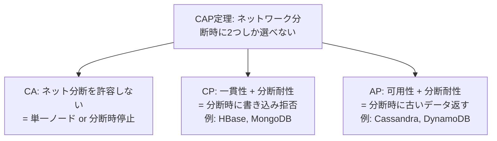

# Layer 3: データ永続化 — チートシート

> **このファイルは何か:** Layer 3（データ永続化）の **「再読時に1分で思い出すための要約」**。RDB / インデックス / NoSQL / キャッシュ戦略 / マイグレーションを1ページに集約。

## レイヤーの位置

> プロセスが終了してもデータが消えないようにし、**大量のデータから高速に必要な情報を取り出す**。
> 上位 Layer 4 (App) で書かれるバグの多くが、ここを正しく理解していれば防げる。

## トピック早見表

| トピック | これだけ覚える | AIに任せやすいか |
|---|---|---|
| [[RDB]] | ACID / 正規化 / トランザクション境界 | partial（境界判断は人間） |
| [[Resources/Study/Layer3-データ永続化/インデックス\|インデックス]] | B-Tree / 複合は左から / 書き込みコスト | partial |
| [[NoSQL]] | KVS / Document / Wide / Graph + CAP | partial（要件依存） |
| [[キャッシュ戦略]] | TTL / Write-through / Write-behind / 削除戦略 | partial |
| [[マイグレーション]] | 後方互換 / 段階リリース / リバーシブル | minimal |

## ACID 4性質

| 性質 | 意味 | 違反すると |
|---|---|---|
| **Atomicity** | 全成功 or 全失敗 | 中途半端な不整合 |
| **Consistency** | 整合性ルール維持 | 制約違反データ |
| **Isolation** | 同時実行が直列実行と等価 | ダーティリード等 |
| **Durability** | コミット後は永続 | 障害でデータ消失 |

## トランザクション分離レベル

| レベル | ダーティ・リード | ノンリピータブル・リード | ファントム・リード |
|---|---|---|---|
| Read Uncommitted | ⚠ 起きる | ⚠ 起きる | ⚠ 起きる |
| Read Committed (PostgreSQL/Oracle既定) | 防ぐ | ⚠ 起きる | ⚠ 起きる |
| Repeatable Read (MySQL InnoDB既定) | 防ぐ | 防ぐ | ⚠ 起きる (PG) |
| Serializable | 防ぐ | 防ぐ | 防ぐ |

**AI 生成コードはここを意識せず書きがち。** 在庫減・残高減のような Read-Modify-Write は **明示的にロック (`SELECT ... FOR UPDATE`) か Serializable** に上げる。

## インデックスの効き方

| 操作 | 効く? | 備考 |
|---|---|---|
| `WHERE col = ?` | ✅ | 等価検索 |
| `WHERE col IN (?, ?, ...)` | ✅ | IN リストが小さければ |
| `WHERE col LIKE 'abc%'` | ✅ | 前方一致のみ |
| `WHERE col LIKE '%abc'` | ❌ | 中間/後方一致は無効 |
| `WHERE FUNC(col) = ?` | ❌ | 関数適用で無効 (関数インデックスを別途作成) |
| `WHERE col1 = ? AND col2 = ?` (複合 index(col1, col2)) | ✅ | 左から使える |
| `WHERE col2 = ?` (複合 index(col1, col2)) | ❌ | 左カラムをスキップ |

**複合インデックスはカラム順が命。** 「等価 → 範囲 → ソート」の順で並べる。

## CAP定理 (NoSQL)



実務的には **「分断は必ず起きる」**前提で **CP か AP の選択** になる。RDB は通常 CA に近いが、レプリケーション時は CP/AP 設計が問われる。

## キャッシュ戦略

| 戦略 | 書き込み時 | 整合性 | 速度 |
|---|---|---|---|
| **Cache-Aside (Lazy)** | DBのみ更新、cache は invalidate | 古いデータ可能性 | 読み高速 |
| **Write-through** | DBとcacheを同期書き込み | 強い | 書き込み遅い |
| **Write-behind (Write-back)** | cache 即時、DB は非同期 | 失敗時データ消失リスク | 最高速 |

**削除戦略 (Eviction):**
- LRU (Least Recently Used) — 最も一般的
- LFU (Least Frequently Used) — アクセス頻度
- TTL — 時間ベース
- Random — 単純

## マイグレーションの安全な順序

**スキーマ変更の鉄則:** 「**先にコード、後でカラム削除**」「**後方互換マイグレーション**」

```
ステップ1: 新カラム追加 (NULL 許容)
ステップ2: コードが新旧両方を読み書きする
ステップ3: バックフィル (既存データを新カラムに埋める)
ステップ4: コードが新カラムのみ読み書き
ステップ5: 旧カラム削除 (NOT NULL 化、最後)
```

これを **1リリースで全部やる**と、ロールバック不能になる。

## AI協働でよく出るアンチパターン (Layer 3)

- **N+1** — ループ内で `.posts` のような関連アクセス → Eager Loading で解決
- **`SELECT *`** → 必要カラムだけ指定 (Index Only Scan を活かす)
- **トランザクション内に外部 API 呼び出し** → 長時間ロック保持 → デッドロック頻発
- **楽観/悲観ロックなしの Read-Modify-Write** → 同時アクセスでデータ消失
- **キャッシュとDBの整合性を考えない** → "Cache Stampede" / 古いデータ表示
- **マイグレーションを CD パイプライン外で手動実行** → ロールバック不能・順序ミス
- **NOT NULL カラムへの `COALESCE` / `IFNULL` 防御** → スキーマを信頼すべし

詳細: [[_anti-patterns/レイヤー別/Layer3|Layer 3 アンチパターン集]]

## 「これだけ AI に伝える」プロンプト雛形

```
前提:
- DB: PostgreSQL 16 / MySQL 8 / DynamoDB 等
- テーブル件数 / 主要カラム / 既存インデックス
- 同時アクセス数の想定 (RPS)
- 一貫性要件: 強い (RDB) / 結果整合性で OK (NoSQL)

やってほしいこと: <処理内容>

制約:
- N+1 を作らない (Eager Loading 必須)
- Read-Modify-Write は楽観/悲観ロックを明示
- トランザクション内で外部 API を呼ばない
- マイグレーションは後方互換、複数フェーズに分ける
- インデックスを追加する場合、`EXPLAIN` で効きを確認

判断基準:
- スロークエリログで p99 が ___ ms 以下
- 同時 ___ クライアントで整合性が崩れないこと (テスト)
```

## 上位レイヤーへの繋がり

- → [[Layer4-アプリケーション/_index|Layer 4: App]]: ORM / データアクセス層 → N+1 の典型発生地
- → [[Layer5-パフォーマンス/_index|Layer 5: Perf]]: クエリ最適化 / キャッシュ
- → [[Layer6-セキュリティ/_index|Layer 6: Security]]: SQL → SQLインジェクション / 暗号化保存

## 関連

- [[Layer3-データ永続化/_index|Layer 3 トピック一覧]]
- [[_glossary/用語集|用語集]]
- [[_anti-patterns/レイヤー別/Layer3|Layer 3 アンチパターン集]]
