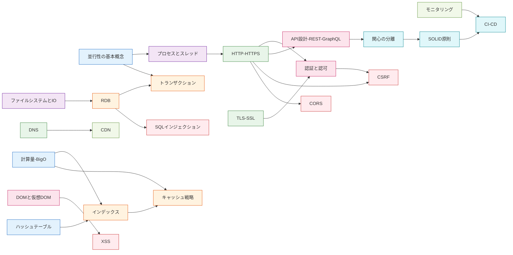

# 依存グラフ — レイヤー横断の核となる接続

> **このファイルは何か:** Web Engineer Knowledge Layers の中で **下位レイヤーが上位レイヤーをどう支えているか** の核となる依存を Mermaid で可視化する。Obsidian Graph View は雑多すぎて学習動線にならないため、**人間が編んだ最重要20本前後**をここに置く。

## 全体図

## 読み方

- 矢印 `A --> B` は **A の理解が B の理解の前提** という関係を示す
- 同じ色のノードは同じレイヤー（Layer 0 → 7 で寒色から暖色）
- 全エッジを描いているわけではなく、**学習動線として最重要なもの20本前後** に絞っている
- フルの依存関係は Obsidian の Graph View で確認できる

## 主要な依存ストーリー

### 1. データ構造 → DBの内部構造
**[[ハッシュテーブル]] / [[計算量-BigO]] → [[インデックス]] → [[キャッシュ戦略]]**

「なぜ WHERE が速くなるか」「なぜキャッシュ前後で挙動が変わるか」を支える。AIが大量データ処理を書いたとき、計算量を見抜けるかが分水嶺。

### 2. 並行性 → プロセス → HTTP
**[[並行性の基本概念]] → [[プロセスとスレッド]] → [[HTTP-HTTPS]]**

「Webサーバーがリクエストをどう捌くか」の根本。Node.js のシングルスレッドや Apache のマルチプロセスの選択判断はここに帰着する。

### 3. RDB → トランザクション → SQLインジェクション
**[[RDB]] → [[トランザクション]] / [[SQLインジェクション]]**

データの整合性とセキュリティの両輪。AIが生SQLを書いたら必ずインジェクションを疑う。

### 4. HTTP → 認証 → CSRF
**[[HTTP-HTTPS]] → [[認証と認可]] → [[CSRF]]**

ステートレスなHTTPの上にセッションを乗せる工夫が、そのまま CSRF 攻撃の温床になる。

### 5. 関心の分離 → SOLID → CI-CD
**[[関心の分離]] → [[SOLID原則]] → [[CI-CD]]**

コードベースを成長させる骨格。CI-CD が機能するかは設計の質に依存する。

### 6. DOM → XSS
**[[DOMと仮想DOM]] → [[XSS]]**

「画面が更新される」の中身を知らないと、なぜ `innerHTML` が危険でテンプレートエンジンが安全なのかが分からない。

### 7. モニタリング → CI-CD
**[[モニタリング]] → [[CI-CD]]**

観測不能なリリースは事故の温床。モニタリングが整っていない状態で CI-CD を回すと「失敗を検知できないデプロイ」になる。CI-CD はモニタリングが先に立っていることを前提にする。

## 関連

- [[web-engineer-knowledge-layers|全体マップ（MOC）]] — 各レイヤーの解説
- [[_starter/00_最小学習パス|最小学習パス]] — 14トピック厳選ルート
- [[_starter/_index|スターターガイド入口]]
