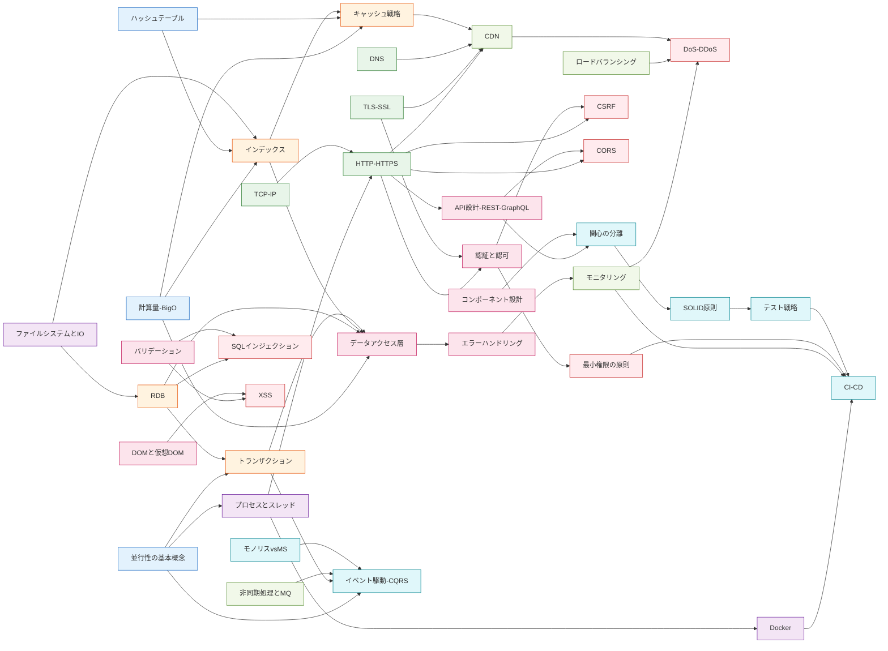

# 依存グラフ v2 — レイヤー横断の核となる接続

> **このファイルは何か:** Web Engineer Knowledge Layers の中で **下位レイヤーが上位レイヤーをどう支えているか** の核となる依存を Mermaid で可視化する。Obsidian Graph View は全リンクを機械的に表示して学習動線にならないため、**学習上の優先度で絞り込んだ最重要30本前後**をここに置く。
>
> v2 では Week 2-11 のレイヤー別改修で見えてきた **「AI協働で頻繁に詰まる依存」** を追加し、データアクセス層・テスト戦略・モニタリング・イベント駆動などのハブノードを補強した。

## 全体図

## 読み方

- 矢印 `A --> B` は **A の理解が B の理解の前提** という関係
- 同じ色のノードは同じレイヤー（Layer 0 → 7 で寒色から暖色）
- **学習動線として最重要なもの30本前後** に絞っている。フルの依存関係は Obsidian の Graph View で確認できる
- 「**ハブノード**」(入次数 + 出次数が大きい) は教材横断のチョークポイント。後述の「重要依存ストーリー」で接続を辿る
- **グラフは学習動線として絞り込んだ広域な依存** であり、各トピックの `prerequisites:` フロントマターと1:1で一致するわけではない。frontmatter は「そのトピック単体を読むのに最低限必要な前提」、グラフは「**そのトピックを使いこなすために理解の起点となる広域な依存**」を表す（例: Docker → CI-CD は CI-CD トピックの prerequisites には含まないが、CI-CD パイプラインを実装するなら Docker の概念は事実上必須、という関係）

## ハブノード一覧（v2 追加分含む）

| ノード | レイヤー | なぜハブか |
|---|---|---|
| [[計算量-BigO]] | 0 | インデックス / キャッシュ / データアクセス層すべての性能判断の根 |
| [[並行性の基本概念]] | 0 | プロセス / トランザクション / イベント駆動の3方向への前提 |
| [[HTTP-HTTPS]] | 2 | 認証・API・CSRF・CORS・CDN すべての前提 |
| [[トランザクション]] | 3 | データアクセス層・イベント駆動 (アウトボックス) で再登場 |
| [[データアクセス層]] | 4 | RDB / インデックス / トランザクション / 計算量を統合する Backend ハブ |
| [[モニタリング]] | 5 | CI-CD / DDoS 検知 / エラーハンドリングを支える観測の核 |
| [[関心の分離]] | 7 | SOLID・テスト戦略すべての出発点 |
| [[SOLID原則]] | 7 | テスト戦略への直結。AI が機械的にインターフェースを切る癖の修正起点 |

## 主要な依存ストーリー

### 1. データ構造 → DBの内部 → アプリの読み書き
**[[ハッシュテーブル]] / [[計算量-BigO]] → [[Resources/Study/Layer3-データ永続化/インデックス|インデックス]] → [[キャッシュ戦略]] → [[CDN]] → [[データアクセス層]]**

「なぜ WHERE が速くなるか」「キャッシュ前後で何が変わるか」を支える。**v2追加**: データアクセス層をハブとして明示し、N+1 / `SELECT *` / トランザクション境界の理解を「下位レイヤー → 上位の応用」で連続させた。AI が大量データ処理を書いたとき、この依存チェーンを **どの段階で破るか** が分水嶺。

### 2. 並行性 → プロセス → HTTP → 認証
**[[並行性の基本概念]] → [[プロセスとスレッド]] → [[HTTP-HTTPS]] → [[認証と認可]]**

「Webサーバーがリクエストをどう捌くか」の根本。Node.js のシングルスレッドや Apache のマルチプロセスの選択判断、認証セッションをどこに持つかの決定はここに帰着する。

### 3. RDB → トランザクション → セキュリティ / イベント駆動
**[[RDB]] → [[トランザクション]] → [[SQLインジェクション]] / [[イベント駆動-CQRS]]**

データの整合性とセキュリティの両輪。**v2追加**: トランザクション → イベント駆動の接続（アウトボックスパターン）を明示。AI が「DB 書き込み + イベント発行」を独立した処理として書く癖を抑える起点。

### 4. HTTP → 認証 → CSRF / 最小権限
**[[HTTP-HTTPS]] → [[認証と認可]] → [[CSRF]] / [[最小権限の原則]]**

ステートレスなHTTPの上にセッションを乗せる工夫が、そのまま CSRF 攻撃の温床になる。**v2追加**: 認証 → 最小権限の接続を明示（IAM / DB 接続ユーザ / API スコープなどの設計判断は認証の延長線にある）。

### 5. 関心の分離 → SOLID → テスト → CI-CD
**[[関心の分離]] → [[SOLID原則]] → [[テスト戦略]] → [[CI-CD]]**

コードベースを成長させる骨格。**v2追加**: テスト戦略を依存チェーンに組み込み、SOLID（特に DIP）が **テスタビリティに直結** することを明示。CI-CD はテスト戦略が機能していることを前提にする。

### 6. DOM → XSS / バリデーション → SQLI
**[[DOMと仮想DOM]] → [[XSS]] / [[バリデーション]] → [[SQLインジェクション]]**

「画面が更新される」「外部入力が解釈される」の中身を知らないと、なぜ `innerHTML` が危険でテンプレートエンジンが安全か、なぜプリペアドステートメントで根本解決するのかが分からない。**v2追加**: バリデーションを XSS / SQLi 双方への前提として明示し、「**入力境界の意味**」を一点に集約。

### 7. モニタリング → CI-CD / DDoS 検知
**[[モニタリング]] → [[CI-CD]] / [[DoS攻撃とDDoS攻撃]]**

観測不能なリリースは事故の温床。**v2追加**: モニタリング → DDoS 検知の接続を明示（メトリクスがなければ攻撃トラフィックも見えない）。CI-CD と DDoS 防御の両方が **モニタリングの上に立つ** ことを「観測なきものは制御できない」原則として表現。

### 8. CDN / LB → DDoS の多層防御
**[[CDN]] / [[ロードバランシング]] → [[DoS攻撃とDDoS攻撃]]**

可用性への攻撃は **エッジ → LB → API GW → アプリ** の多層で対処する。**v2追加**: Week 9 (Layer 6) で深掘りされた多層防御の依存を明示。

### 9. モノリス分割 → イベント駆動 / 非同期キュー
**[[モノリスvsマイクロサービス]] → [[イベント駆動-CQRS]] ← [[非同期処理とメッセージキュー]]**

サービス分割の判断はそのままサービス間通信の選択に直結する。同期 HTTP の連鎖（A→B→C→D）で可用性が積算する問題は、**非同期キュー + イベント駆動**で解決する。**v2追加**: Week 10 (Layer 7) で集約された Layer 5 と Layer 7 の接続。

## v1 → v2 の主な変更点

| 項目 | v1 | v2 |
|---|---|---|
| ノード数 | 22 | 37 |
| エッジ数 | 22 | 約 50 |
| Layer 4 ノード | 3 (AUTH/API/DOM) | 7 (DAL/VAL/ERR/CMP 追加) |
| Layer 5 ノード | 2 (CDN/MON) | 4 (QUE/LB 追加) |
| Layer 6 ノード | 4 | 6 (DDOS/LPRIV 追加) |
| Layer 7 ノード | 3 | 6 (TEST/EVT/MS 追加) |
| ハブノード明示 | なし | 8 ハブを表で明示 |
| 主要ストーリー | 7本 | 9本 |

**v2 の設計意図:**

- **Backend / Frontend のハブをそれぞれ追加** — Backend は [[データアクセス層]]、Frontend は [[コンポーネント設計]] を明示
- **「観測 → 制御」の依存を明示** — モニタリングをハブとして CI-CD / DDoS / エラーハンドリングへ三方向に展開
- **Layer 7 内部の接続を強化** — テスト戦略・モノリス分割・イベント駆動の3つを Week 10 改修の知見で接続
- **Layer 5 と Layer 6/7 の接続を強化** — CDN/LB → DDoS、QUE → イベント駆動 など、性能とセキュリティ・設計の境界をブリッジ

## このグラフをどう使うか

### 学習者として
1. [[_starter/00_最小学習パス|最小学習パス]] の14トピックの位置を把握する
2. **詰まったトピックの矢印を逆向きに辿る** と、どの前提が抜けているか分かる
3. ハブノードを見つけたら **複数のストーリーで再登場** することを意識する（再読の動機付け）

### AI協働で
1. AI に機能を頼む前に、**そのトピックがどの依存チェーンの中央にあるか** をグラフで確認
2. ハブノードに該当する場合は、依存元（前提）と依存先（影響範囲）を **プロンプトの「前提」「制約」** に展開する
3. 「[[計算量-BigO]] → [[データアクセス層]]」のような依存を見落とすと、AI は N+1 を量産する

## 関連

- [[web-engineer-knowledge-layers|全体マップ（MOC）]] — 各レイヤーの解説
- [[_starter/00_最小学習パス|最小学習パス]] — 14トピック厳選ルート
- [[_starter/02_実務症状からの逆引き|実務症状からの逆引き]] — このグラフを症状側から逆引き
- [[_starter/_index|スターターガイド入口]]
- [[_anti-patterns/_index|AIアンチパターン索引]] — ハブノードで頻発する AI の癖
