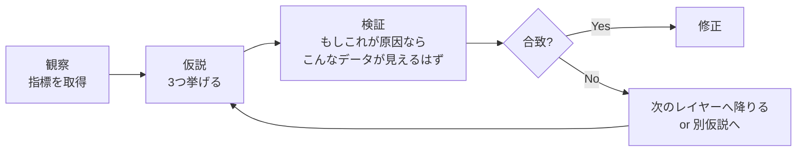

# 実務症状からの逆引き — 「症状」から関連レイヤー・トピックへ

> **このファイルは何か:** 実務でよく遭遇する症状（「APIが遅い」「ログインが切れる」等）から、**関連レイヤー・トピックへ降りる経路**を示す逆引き索引。本教材を「辞書として」使うときの入口。

## 設計思想

- **症状はユーザーやアプリに近い層で観察される**が、原因は下位レイヤーにあることが多い
- 経路は **「上位（症状に近い）→ 下位（原因に近い）」** の順で降りる。観察コストが低い指標から確認できる
- 各経路には「**観察すべき指標**」「**疑うべきトピック**」「**確認方法（コマンド・ヘッダ・メトリクス名）**」を併記する
- このファイルで原因の見当がついたら、`/diagnose` skill で詳細な追跡経路を生成できる

## 症状の俯瞰

| 症状カテゴリ | 代表的な症状 | 主に疑うレイヤー |
|---|---|---|
| **遅い** | API遅延 / ページ表示遅い / DBクエリ遅い | Layer 5 → 4 → 3 → 2 → 1 |
| **落ちる / エラー** | 5xx急増 / OOM / コンテナ再起動ループ | Layer 4 → 5 → 1 → 2 |
| **間欠で動かない** | フレイキーテスト / 一部ユーザでだけ失敗 | Layer 1 → 2 → 5 (キャッシュ) |
| **データがおかしい** | 不整合 / 集計値がズレる / 二重登録 | Layer 3 → 4 → 0 (並行性) |
| **セキュリティ事象** | 未認証アクセス / トークン窃取 / 攻撃トラフィック | Layer 6 → 4 → 2 |
| **本番でだけ動かない** | ローカルでは動く / ステージングでは動く | Layer 1 → 2 → 6 (権限) |

## カテゴリ別の経路

### A. 遅い

#### A-1. APIが遅い（p99 レイテンシ悪化）
**観察すべき指標:** p50 / p95 / p99 レイテンシ、エラー率、スループット (RPS)

| 順 | レイヤー | 疑うトピック | 確認方法 |
|---|---|---|---|
| 1 | Layer 4 (App) | [[ルーティングとミドルウェア]] / [[エラーハンドリング]] | ハンドラ単体の処理時間、ミドルウェアの順序 |
| 2 | Layer 5 (Perf) | [[非同期処理とメッセージキュー]] / [[CDN]] | 同期処理になっていないか、CDN ヒット率 |
| 3 | Layer 3 (DB) | [[Resources/Study/Layer3-データ永続化/インデックス\|インデックス]] / [[RDB]] / [[キャッシュ戦略]] | スロークエリログ、N+1、キャッシュヒット率 |
| 4 | Layer 2 (Network) | [[HTTP-HTTPS]] / [[DNS]] / [[TLS-SSL]] | TLS ハンドシェイクのタイムアウト、DNS 解決時間 |
| 5 | Layer 1 (OS) | [[ファイルシステムとIO]] / [[プロセスとスレッド]] | CPU飽和、IOPS、スワップ |

#### A-2. ページ表示が遅い（フロント）
**観察すべき指標:** Core Web Vitals (LCP/INP/CLS)、TTFB、JSバンドルサイズ

| 順 | レイヤー | 疑うトピック | 確認方法 |
|---|---|---|---|
| 1 | Layer 5 | [[CoreWebVitals]] / [[CDN]] | Lighthouse, WebPageTest |
| 2 | Layer 4 (FE) | [[コンポーネント設計]] / [[状態管理]] | 不要な再レンダリング、巨大バンドル |
| 3 | Layer 4 (BE) | [[API設計-REST-GraphQL]] | API 待ち時間、ペイロードサイズ |
| 4 | Layer 2 | [[HTTP-HTTPS]] | HTTP/2, 圧縮、Keep-Alive |

#### A-3. DBクエリが遅い
**観察すべき指標:** EXPLAIN 結果、スロークエリログ

| 順 | レイヤー | 疑うトピック | 確認方法 |
|---|---|---|---|
| 1 | Layer 3 | [[Resources/Study/Layer3-データ永続化/インデックス\|インデックス]] | EXPLAIN で Seq Scan / Index 不使用 |
| 2 | Layer 4 | [[データアクセス層]] | N+1 / `SELECT *` / 大きすぎる IN 句 |
| 3 | Layer 0 | [[計算量-BigO]] | クエリの計算量、JOIN の組み合わせ爆発 |
| 4 | Layer 1 | [[ファイルシステムとIO]] | IOPS、ディスク種別 (SSD/HDD)、buffer pool |

### B. 落ちる / エラー

#### B-1. 5xxが急増した
**観察すべき指標:** 5xx 率、4xx 率、エラーログのスタックトレース、外部 API 状態

| 順 | レイヤー | 疑うトピック | 確認方法 |
|---|---|---|---|
| 1 | Layer 4 | [[エラーハンドリング]] / [[認証と認可]] | アプリログ、最近のデプロイ差分 |
| 2 | Layer 5 | [[ロードバランシング]] / [[モニタリング]] | LBヘルスチェック、特定 instance に偏っていないか |
| 3 | Layer 3 | [[RDB]] / [[キャッシュ戦略]] | DB 接続数、コネクションプール枯渇 |
| 4 | Layer 2 | [[TLS-SSL]] / [[DNS]] | 証明書期限、DNS 解決失敗 |
| 5 | Layer 1 | [[Docker]] / [[プロセスとスレッド]] | OOM Killer、コンテナ再起動 |

#### B-2. OOM / メモリリーク
**観察すべき指標:** RSS、Heap Used、GC 頻度、コンテナ memory limit

| 順 | レイヤー | 疑うトピック | 確認方法 |
|---|---|---|---|
| 1 | Layer 4 | 該当機能のコード | キャッシュの無制限蓄積、クロージャでの保持 |
| 2 | Layer 1 | [[プロセスとスレッド]] / [[Docker]] | `kubectl top`, `docker stats` |
| 3 | Layer 0 | [[データ構造とアルゴリズム]] | リスト・マップが伸びっぱなし、循環参照 |

#### B-3. コンテナが再起動ループ
| 順 | レイヤー | 疑うトピック | 確認方法 |
|---|---|---|---|
| 1 | Layer 1 | [[Docker]] / [[Linux基礎]] | `kubectl describe pod` の Events、Liveness 失敗 |
| 2 | Layer 4 | [[エラーハンドリング]] | 起動時の例外、設定読み込み失敗 |
| 3 | Layer 6 | [[最小権限の原則]] | シークレット未注入、IAM ロール不足 |

### C. 間欠で動かない

#### C-1. フレイキーテスト（CI で 10% 失敗する等）
**観察すべき指標:** 失敗テストの偏り、再実行で通るか

| 順 | レイヤー | 疑うトピック | 確認方法 |
|---|---|---|---|
| 1 | Layer 7 | [[テスト戦略]] | 順序依存、共有フィクスチャ、時刻依存 |
| 2 | Layer 0 | [[並行性の基本概念]] | 競合状態、`sleep` で誤魔化し |
| 3 | Layer 5 | [[非同期処理とメッセージキュー]] | 非同期処理の `await` 漏れ |

#### C-2. 一部ユーザでだけ失敗
**観察すべき指標:** 失敗ユーザの共通点（リージョン、ブラウザ、認証経路）

| 順 | レイヤー | 疑うトピック | 確認方法 |
|---|---|---|---|
| 1 | Layer 5 | [[CDN]] / [[キャッシュ戦略]] | エッジキャッシュの古いバージョン、リージョン差分 |
| 2 | Layer 2 | [[DNS]] / [[CORS]] | DNS の段階的伝播、CORS プリフライト失敗 |
| 3 | Layer 4 | [[認証と認可]] | セッションタイムアウト、Cookie 属性 |

### D. データがおかしい

#### D-1. データ不整合（口座残高 / 在庫がズレる）
**観察すべき指標:** 不整合発生時刻、関連トランザクションログ、同時アクセス数

| 順 | レイヤー | 疑うトピック | 確認方法 |
|---|---|---|---|
| 1 | Layer 3 | [[トランザクション]] / [[RDB]] | 楽観/悲観ロック、分離レベル、トランザクション境界 |
| 2 | Layer 0 | [[並行性の基本概念]] | 競合状態、Read-Modify-Write |
| 3 | Layer 4 | [[データアクセス層]] | 複数テーブル更新が独立コミット |
| 4 | Layer 7 | [[イベント駆動-CQRS]] | べき等性、重複配信 |

#### D-2. 集計値が定期的にズレる
| 順 | レイヤー | 疑うトピック | 確認方法 |
|---|---|---|---|
| 1 | Layer 5 | [[キャッシュ戦略]] | 古いキャッシュ、TTL 不適切 |
| 2 | Layer 3 | [[NoSQL]] / [[RDB]] | レプリカ遅延、結果整合性 |
| 3 | Layer 7 | [[イベント駆動-CQRS]] | Read Model の更新失敗 |

### E. セキュリティ事象

#### E-1. 未認証アクセスが成功している
**観察すべき指標:** 認証ログ、アクセスパターン、トークン有効期限

| 順 | レイヤー | 疑うトピック | 確認方法 |
|---|---|---|---|
| 1 | Layer 6 | [[認証と認可]] / [[最小権限の原則]] | JWT alg=none、認可チェック漏れ |
| 2 | Layer 4 | [[ルーティングとミドルウェア]] | 認証ミドルウェア未適用ルート |
| 3 | Layer 2 | [[CORS]] | ワイルドカード `*` + credentials |

#### E-2. トークン窃取の疑い
| 順 | レイヤー | 疑うトピック | 確認方法 |
|---|---|---|---|
| 1 | Layer 6 | [[XSS]] / [[CSRF]] | localStorage 保存、CSP 不在 |
| 2 | Layer 2 | [[HTTP-HTTPS]] / [[TLS-SSL]] | Cookie の Secure 属性、HSTS |
| 3 | Layer 6 | [[サプライチェーンセキュリティ]] | 依存パッケージの脆弱性 |

#### E-3. 攻撃トラフィック / DDoS
| 順 | レイヤー | 疑うトピック | 確認方法 |
|---|---|---|---|
| 1 | Layer 6 | [[DoS攻撃とDDoS攻撃]] | リクエスト元 IP 分布、Pattern |
| 2 | Layer 5 | [[CDN]] / [[ロードバランシング]] | レート制限、WAF |
| 3 | Layer 2 | [[HTTP-HTTPS]] | HTTP/2 Rapid Reset 等のプロトコル攻撃 |

### F. 本番でだけ動かない

#### F-1. ローカルでは動くが本番で動かない
**観察すべき指標:** 環境差分（OS、Node/Python/JVM バージョン、環境変数）

| 順 | レイヤー | 疑うトピック | 確認方法 |
|---|---|---|---|
| 1 | Layer 1 | [[Docker]] / [[Linux基礎]] | コンテナの差分、`latest` タグ、環境変数 |
| 2 | Layer 2 | [[DNS]] / [[TLS-SSL]] | 内部DNS、証明書信頼チェーン |
| 3 | Layer 6 | [[最小権限の原則]] | IAM、ファイル権限、ネットワーク ACL |
| 4 | Layer 7 | [[CI-CD]] | デプロイ差分、マイグレーション順序 |

## 経路を辿った後

1. 該当トピックの **「3分で全体像」** を読み、現象に合致するか確認
2. 該当トピックの **「誤解されやすいポイント」** で典型的な勘違いを避ける
3. 該当レイヤーの **[[_anti-patterns/レイヤー別/Layer{N}|アンチパターン索引]]** で AI 生成コード由来の典型問題を確認
4. 仮説が固まったら **`/diagnose 症状の説明`** でより詳細な確認手順を生成

## 仮説検証の流れ

すべての症状に共通する**観察 → 仮説 → 検証 → 絞り込み**の流れ:

**仮説を3つ挙げる** ところがコツ。1つだと自分の先入観に引きずられ、4つ以上だと検証コストが膨れる。**「最も怪しい / 次に怪しい / 念のため疑う」** の3階層で仮説を作ると、検証順序が自動で決まる。

## 関連

- [[_starter/_index|スターターガイド入口]]
- [[_starter/00_最小学習パス|最小学習パス]]
- [[_starter/01_週次プラン|週次プラン]]
- [[_anti-patterns/_index|AIアンチパターン索引]]
- [[_graph/依存グラフ|レイヤー横断の依存グラフ]]
- `/diagnose` skill — 症状を渡すと詳細な追跡経路を生成
