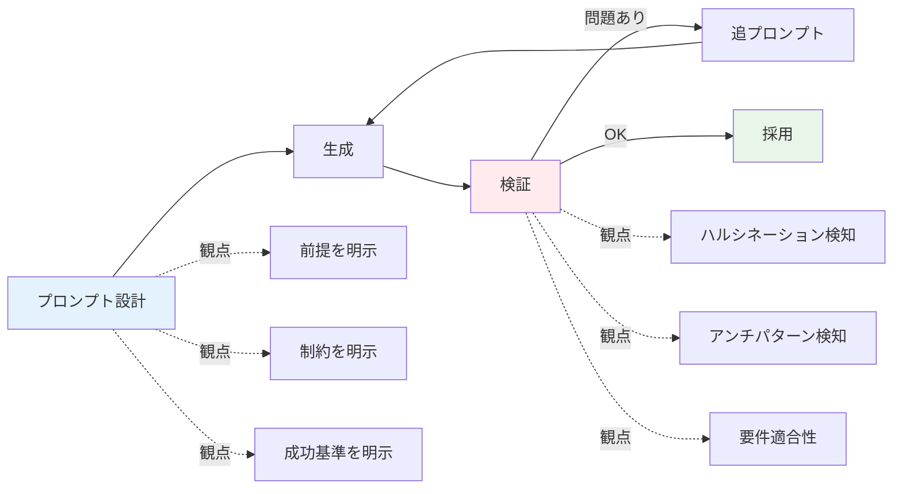

# AI協働の基本動作

> **このファイルは何か:** AIコーディングエージェントと協働するときの「最低限の動作」をまとめた実践ガイド。**プロンプト設計・検証ループ・ハルシネーション検知**の3軸で、明日から使える型を提示する。

## 3軸の全体像



## 軸1: プロンプト設計の核（4要素）

### 1. 前提（Context）
プロジェクトの状況、既存のコード規約、関連ファイルのパスを渡す。これを省くと、AIは**汎用解**を返す。汎用解は往々にしてプロジェクトの規約に合わない。

```
# 前提
- TypeScript + Express + PostgreSQL
- 既存の認証は src/auth/middleware.ts の requireAuth を使う
- DBアクセスは src/db/queries.ts 経由で、生SQLは禁止
```

### 2. やってほしいこと（Task）
要件を、曖昧さなく具体的に書く。「いい感じに」は禁句。

```
# やってほしいこと
- POST /users エンドポイントを追加
- 入力: email, password, name
- bcryptでハッシュ化してDBに保存
- 重複時は409、バリデーション失敗時は400を返す
```

### 3. 守ってほしい制約（Constraints）
**トピックの「誤解されやすいポイント」「アンチパターン」から引いた、罠を避けるための制約**を書く。これがAIレビュー力の代替になる。

```
# 守ってほしい制約
- パスワードは平文でログ出力しない
- bcryptのコストは10
- email は CITEXT 型で大文字小文字を吸収する
- 内部関数の引数チェックを過剰に書かない（型システムで保証されている）
```

### 4. 完了の判断基準（Definition of Done）
AIが「できました」と言っても、本当にできているかを判断する基準を**事前に**示す。これを省くと、検証段階で揉める。

```
# 完了の判断基準
- curl で 201 が返る
- pg のテーブルにレコードが増えている
- 同じemailで2回叩くと409が返る
- パスワードカラムに平文が入っていない
- npm test が全件通る
```

## 軸2: 検証の3観点

### 観点1: ハルシネーション検知

AIは存在しない関数・引数・ライブラリを**自信満々に**使う。検証の最初は**書かれているものが実在するか**を確認する。

| チェックポイント | 方法 |
|----------------|------|
| import されているライブラリ | `package.json` / `go.mod` / `requirements.txt` で実在確認 |
| 呼ばれている関数 / メソッド | 公式ドキュメント / 既存コードの grep で実在確認 |
| 引数の型・順序 | 型定義 / 公式ドキュメント |
| 設定ファイルのキー名 | 公式ドキュメント / 既存設定ファイル grep |
| ライブラリのバージョン依存挙動 | 該当バージョンの changelog |

### 観点2: アンチパターン検知

AIは「動くコード」を返すが、しばしば**過剰**または**不足**している。`/anti-pattern-scan` で照合できるが、最低限以下を見る:

- **過剰なフォールバック:** 起こりえないケースに `try/catch` やデフォルト値が入っていないか
- **既存ユーティリティの再発明:** プロジェクト内に既存の関数があるのに自前実装していないか
- **不要な抽象化:** 1箇所しか使わないインターフェースを切っていないか
- **防御的すぎるエラーハンドリング:** 内部関数の引数チェックが過剰でないか

詳細は [[_anti-patterns/_index]]。

### 観点3: 要件適合性

書かれたコードが、**渡した「やってほしいこと」と「制約」と「完了の判断基準」を全て満たしているか**を、項目ごとにチェックする。「だいたい合ってる」で済ませない。

実行確認は必ず行う。AIが「動きます」と言ってもそれは**生成時の自信**であって、**実機での動作確認**ではない。

## 軸3: ハルシネーション検知の詳細

特に注意すべきAIのハルシネーションパターン:

| パターン | 例 | 検知方法 |
|---------|---|---------|
| 存在しないAPI | `Array.prototype.findLastBy()` | MDN / 公式ドキュメント |
| 古いAPIを最新と勘違い | Node.js 16以降で削除されたものを使う | バージョン確認 |
| 引数順序の入れ替え | `bcrypt.hash(rounds, password)` | 公式ドキュメント |
| 設定キーの誤り | `database_url` vs `databaseUrl` | 既存設定ファイル grep |
| ライブラリ名のtypo | `react-hook-forms` vs `react-hook-form` | npm 検索 |
| 著者・出典の捏造 | RFCの番号、論文タイトル | 一次ソース確認 |

**実行・型チェック・テスト・grep の4本立て**でほぼ検知できる。AIに「動きます」と言わせる前に、`tsc --noEmit` `go vet` `python -m py_compile` 等を必ず通す習慣をつける。

## 追プロンプトの設計

検証で問題が見つかったら、**何が問題かを言語化して**追プロンプトを書く。「直して」だけでは不十分。

### 悪い追プロンプト

```
動かない。直して。
```

### 良い追プロンプト

```
POST /users で500が返る。ログには `pg: relation "users" does not exist` と出ている。

# 制約
- マイグレーションは別途管理しているので、ここでテーブル作成しないでほしい

# やってほしいこと
- テーブル不在時のエラーメッセージを「Table not initialized. Run migrations.」に変える
- ステータスを503で返す
```

「症状」「制約」「望む対処」の3点を明示する。

## チェックリスト（コピペ用）

明日からAIに何かを依頼するとき、以下を頭の中で確認する:

- [ ] 前提（プロジェクト状況・既存コード規約）を渡したか
- [ ] やってほしいことを曖昧さなく書いたか
- [ ] 制約（このトピックの誤解されやすいポイント）を渡したか
- [ ] 完了の判断基準を**事前**に示したか
- [ ] 受け取ったコードの import / 関数 / 引数の実在を確認したか
- [ ] アンチパターン（過剰フォールバック・再発明・過剰抽象化）が紛れていないか
- [ ] 要件と制約と判断基準を**項目ごとに**満たしているか確認したか
- [ ] 実機で動作確認 / テスト実行したか

## トピック別の効くプロンプトの型

各トピックの「AIエージェントとの協働 → 効くプロンプトの型」セクションに、トピック固有の制約・成功基準テンプレが置かれている。実装前に該当トピックを開く習慣をつけると、検閲の漏れが減る。

## 関連

- [[_starter/_index|スターターガイド入口]]
- [[_starter/03_AIコーディング時代の学び方]]
- [[_anti-patterns/_index|AI実装アンチパターン索引]]
- 各トピックの「AIエージェントとの協働 → 効くプロンプトの型」
