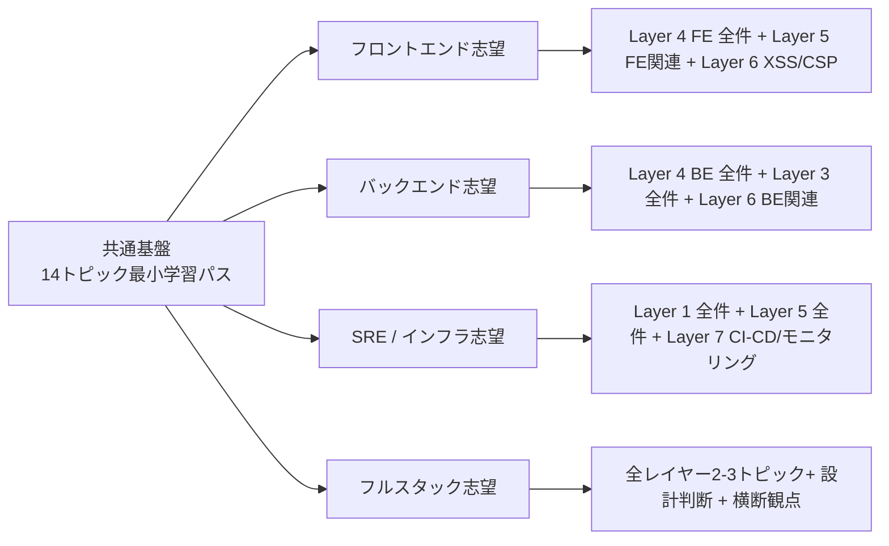
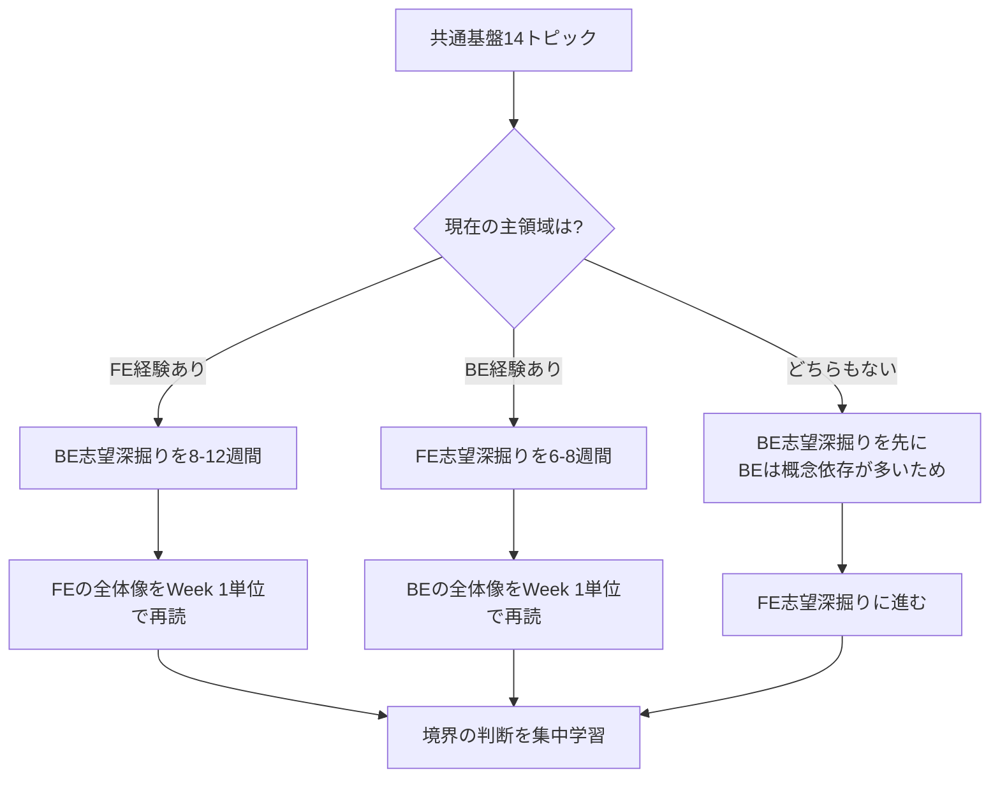

# ロール別パス — FE志望 / BE志望 / SRE志望 / フルスタック志望

> **このファイルは何か:** [[_starter/00_最小学習パス|最小学習パス]] の14トピックは「全 Web エンジニアが最低限押さえる」ための **共通基盤**。本ファイルはそこから先、**志望ロールごとに何を深掘りすべきか** の地図を提供する。`/starter-path` skill が動的にパーソナライズする際の **静的な裏付け資料**。

## 設計思想

- 14トピックの最小学習パスは **共通基盤として全員必読** — ここはスキップさせない
- そこから先で **「自分の志望に直結するレイヤー」** に深く潜る
- ただし「触らないレイヤーは無視してよい」ではない。**3分で全体像だけ拾う** ことで、システム俯瞰力は維持する
- 教材は **「初学者〜ミドル層 → シニア層」** の押し上げを目的とするため、ロール別パスも **「シニアになるために必要な視点」** を含める。表層的な技術選定だけでなく **「他ロールとの境界での判断」** が重要

## ロール別の深掘りマップ

## A. フロントエンド志望

### 深掘りすべきレイヤー (推奨順)

| 順 | レイヤー | トピック | 重点 |
|---|---|---|---|
| 1 | Layer 4 FE 全件 | [[HTML-CSS-JS]] / [[DOMと仮想DOM]] / [[コンポーネント設計]] / [[状態管理]] / [[アクセシビリティ]] | 5 つすべて |
| 2 | Layer 5 (FE関連) | [[CoreWebVitals]] / [[CDN]] / [[パフォーマンス最適化]] | LCP/INP/CLS は実務で必ず触る |
| 3 | Layer 6 (FE関連) | [[XSS]] / [[CSRF]] / [[CORS]] / [[サプライチェーンセキュリティ]] | npm エコシステムの脆弱性も含む |
| 4 | Layer 2 | [[HTTP-HTTPS]] / [[TLS-SSL]] | 共通基盤と重複するが、SPA / Cookie 属性視点で再読 |
| 5 | Layer 7 (FE関連) | [[関心の分離]] / [[テスト戦略]] | コンポーネント設計の上位原則 |

### 後回しでよいレイヤー

- **Layer 0**: [[計算量-BigO]] と [[ハッシュテーブル]] のみ「3分で全体像」を拾う
- **Layer 1**: [[Docker]] と [[クラウドサービスモデル]] のみ「3分で全体像」
- **Layer 3**: [[RDB]] と [[NoSQL]] のみ概要把握。深掘りは BE 担当へ
- **Layer 4 BE**: [[API設計-REST-GraphQL]] のみ深掘り（フロントが叩く側として理解）

### 「FE志望でもシニアになるなら」追加で必要な視点

- **API設計の判断軸** — REST / GraphQL の選択、Over-fetching / Under-fetching の体感、フロントから見たエラー型の設計
- **Web Performance の観測** — Real User Monitoring (RUM) / Lighthouse CI、Core Web Vitals の本番値
- **アクセシビリティの法的観点** — WCAG / ADA / EAA、表面的な ARIA ではなくセマンティック HTML から
- **SSR / SSG / CSR / ISR の判断** — 各方式のトレードオフ、Hydration エラーの根本原因
- **State Management の進化系** — サーバ状態（React Query / SWR）と UI 状態（Zustand / Jotai）の分離思想

> 上記の「**SSR / SSG / CSR / ISR の判断**」は [[レンダリング戦略]] トピックで深掘りされている。Hydration ミスマッチ・認証境界とキャッシュ・Server Component / Client Component の境界が中心テーマ。

### 想定学習時間

- 共通基盤4週間 + ロール別深掘り **6-8週間**
- 計 2.5-3ヶ月で「FE 担当として一通り判断軸を持てる」レベル

## B. バックエンド志望

### 深掘りすべきレイヤー (推奨順)

| 順 | レイヤー | トピック | 重点 |
|---|---|---|---|
| 1 | Layer 4 BE 全件 | [[ルーティングとミドルウェア]] / [[エラーハンドリング]] / [[バリデーション]] / [[認証と認可]] / [[API設計-REST-GraphQL]] / [[データアクセス層]] | 6 つすべて |
| 2 | Layer 3 全件 | [[RDB]] / [[Resources/Study/Layer3-データ永続化/インデックス\|インデックス]] / [[NoSQL]] / [[キャッシュ戦略]] / [[マイグレーション]] | 5 つすべて |
| 3 | Layer 6 (BE関連) | [[SQLインジェクション]] / [[最小権限の原則]] / [[サプライチェーンセキュリティ]] / [[DoS攻撃とDDoS攻撃]] / [[CSRF]] | サーバ視点で全部 |
| 4 | Layer 5 (BE関連) | [[ロードバランシング]] / [[非同期処理とメッセージキュー]] / [[モニタリング]] / [[パフォーマンス最適化]] | キャッシュ・DB 観点 |
| 5 | Layer 7 全件 | [[関心の分離]] / [[SOLID原則]] / [[モノリスvsマイクロサービス]] / [[テスト戦略]] / [[CI-CD]] / [[イベント駆動-CQRS]] | 設計判断の中核 |
| 6 | Layer 0/1 | [[並行性の基本概念]] / [[計算量-BigO]] / [[プロセスとスレッド]] / [[メモリ管理]] | 性能分析の基盤 |

### 後回しでよいレイヤー

- **Layer 4 FE**: [[DOMと仮想DOM]] / [[状態管理]] のみ「3分で全体像」
- **Layer 5 FE**: [[CoreWebVitals]] のみ概要把握

### 「BE志望でもシニアになるなら」追加で必要な視点

- **トランザクション境界の設計** — 「どこから始まりどこで終わるか」、楽観/悲観ロックの判断、Saga パターン
- **イベント駆動への踏み出し** — モノリス分割の判断軸、ドメイン命名 (CRUD → 業務イベント)、アウトボックスパターン
- **データモデリング** — 正規化と非正規化の判断、CQRS の読み書き分離、レプリカ遅延への対処
- **N+1 / 計算量の本番感覚** — 開発環境では見えない問題を本番規模で予測する力
- **AI 生成コードでのよくある脆弱性** — JWT alg=none、パスワード比較のタイミング攻撃、SQL文字列結合、トランザクション欠落

### 想定学習時間

- 共通基盤4週間 + ロール別深掘り **8-12週間**
- 計 3-4ヶ月で「BE 担当として一通り判断軸を持てる」レベル

## C. SRE / インフラ志望

### 深掘りすべきレイヤー (推奨順)

| 順 | レイヤー | トピック | 重点 |
|---|---|---|---|
| 1 | Layer 1 全件 | [[Linux基本操作]] / [[Docker]] / [[プロセスとスレッド]] / [[メモリ管理]] / [[ファイルシステムとIO]] / [[クラウドサービスモデル]] | 6 つすべて |
| 2 | Layer 5 全件 | [[CDN]] / [[ロードバランシング]] / [[非同期処理とメッセージキュー]] / [[モニタリング]] / [[CoreWebVitals]] / [[パフォーマンス最適化]] | 6 つすべて |
| 3 | Layer 7 (SRE関連) | [[CI-CD]] / [[テスト戦略]] / [[モノリスvsマイクロサービス]] / [[イベント駆動-CQRS]] | デリバリーと運用 |
| 4 | Layer 6 全件 | [[DoS攻撃とDDoS攻撃]] / [[最小権限の原則]] / [[サプライチェーンセキュリティ]] / [[CSRF]] / [[CORS]] / [[XSS]] / [[SQLインジェクション]] | インフラの守り |
| 5 | Layer 2 全件 | [[TCP-IP]] / [[DNS]] / [[HTTP-HTTPS]] / [[TLS-SSL]] / [[WebSocket]] | プロトコル理解 |
| 6 | Layer 0 | [[計算量-BigO]] / [[並行性の基本概念]] | 性能分析の基盤 |

### 後回しでよいレイヤー

- **Layer 4 FE**: [[コンポーネント設計]] / [[状態管理]] / [[アクセシビリティ]] は「3分で全体像」のみ
- **Layer 4 BE**: [[ルーティングとミドルウェア]] / [[認証と認可]] / [[API設計-REST-GraphQL]] のみ深掘り（**運用観点**）

> **「運用観点」とは:** SRE が BE トピックを学ぶ時の視点。BE エンジニア向けの「設計判断」ではなく、**「本番運用でのパフォーマンス特性 / 可観測性 / 障害時の挙動」** に焦点を当てる。
>
> - **ルーティング/ミドルウェア**: ミドルウェア計装（リクエスト ID / トレース ID 注入）、リクエスト処理時間の分布、ヘルスチェックエンドポイントの設計
> - **認証認可**: 認証スキームのレイテンシ特性（JWT 検証 vs DB セッションルックアップ）、トークン失効伝播、ログイン失敗の監視・レート制限
> - **API 設計**: スキーマの運用可観測性（バージョニング、契約テスト、API ゲートウェイ計装）、エラー型のメトリクス分類

### 「SRE志望でもシニアになるなら」追加で必要な視点

- **オブザーバビリティの3本柱** — メトリクス・ログ・トレース。p50/p95/p99 の使い分け、構造化ログの設計
- **SLI / SLO / SLA / エラーバジェット** — リスクのある変更をどれだけ許容できるか、定量管理
- **インシデント対応の構造** — Postmortem 文化、Blameless、5 Whys、根本原因と寄与原因の分離
- **キャパシティプランニング** — 負荷の3階層（一定 / バースト / 攻撃トラフィック）の見極め
- **コスト最適化** — クラウド料金体系、リザーブド / スポット / オンデマンド、データ転送費用
- **多層防御の設計** — エッジ → LB → API GW → アプリの DDoS 防御層設計

### 想定学習時間

- 共通基盤4週間 + ロール別深掘り **8-10週間**
- 計 3-3.5ヶ月

## D. フルスタック志望

### 設計思想

フルスタック = **「FE と BE を浅く広く」ではなく「両方を深く理解した上で境界の判断ができる」** を目指す。FE 志望と BE 志望の両方を半分ずつやるのではなく、**「FE → BE」または「BE → FE」の段階的な深掘り** を推奨。

### 推奨進路

### 「FE と BE の境界で判断できるようになる」追加観点

- **API 契約の設計** — OpenAPI / GraphQL SDL を単一ソース、型生成、フロント/バック両方が同じスキーマを見る
- **エラー型の往復** — バック側の例外をフロント向けにどう変換するか、status コード設計、structured error
- **認証フロー** — Cookie + Session vs JWT の選択、SPA / SSR でのトークン保存場所
- **状態の境界** — サーバ状態 (DB) / クライアント状態 (UI) / 同期状態 (URL) の分離
- **レンダリング戦略の影響** — SSR にすると Cookie / Auth が変わる、CSR にすると SEO / TTFB が変わる
- **Performance Budget** — LCP の予算をフロントとバックでどう配分するか

### 想定学習時間

- 共通基盤4週間 + 主領域深掘り 8-12週間 + 副領域深掘り 4-6週間 + 境界の判断 2-4週間
- 計 5-6ヶ月

## E. ロール未定 / 学習中

### 推奨進路

1. **共通基盤14トピック** を 4-6週間でじっくり通読（学習中なので時間をかけてよい）
2. **各レイヤーの `_index.md`** を順に通読し、**自分が一番興味を持つレイヤーを発見** する
3. 興味を持ったレイヤーから **B / C / D いずれかのパス** を選ぶ
4. 1ヶ月後、興味が変わっていたら別パスに移る — **早期に1つのロールに絞らない**

### 「学生 / 新人がやらない方がよいこと」

- **完璧主義** — 全 51 トピックを「読み終える」を目的にしない。**何度も読み返す** 設計
- **演習主義** — 本教材は **読み物** として設計されている。コードを書きたい時は別の場所で
- **AIに丸投げ** — AI に書かせる練習は重要だが、**書かせたコードを読み解ける** 段階に達してから
- **早期の進捗フォーカス** — セルフチェック3問目（AI生成コードレビュー設問）が答えられるかを **進捗指標** にする。トピック数ではなく

## ロール別パスの使い方

### 学習者向け
1. 共通基盤14トピック ([[_starter/00_最小学習パス|最小学習パス]]) を完了
2. 本ファイルで **自分のロールに該当するセクション** を読む
3. 「**深掘りすべきレイヤー**」を優先順位通りに進める
4. 「**シニアになるなら**」観点を **半年後の自分への課題** として記録する

### `/starter-path` skill との関係

`/starter-path` skill は学習者の状況（経験年数 / 既知トピック / 学習時間）を聞いて **動的に** パーソナライズする。本ファイルはその **静的な土台** として機能する:

- skill は本ファイルの典型パスを **ベースライン** として使う
- 学習者の追加情報（「並行性が苦手」「セキュリティを最優先」等）に応じて **微調整** する
- 本ファイルが提示する「シニアになるなら」観点は **共通の到達目標** として全パスに含まれる

## 関連

- [[_starter/_index|スターターガイド入口]]
- [[_starter/00_最小学習パス|最小学習パス（共通基盤14トピック）]]
- [[_starter/01_週次プラン|週次プラン（4週間構成）]]
- [[_starter/02_実務症状からの逆引き|実務症状からの逆引き]]
- [[_starter/03_AIコーディング時代の学び方]]
- [[_starter/04_AI協働の基本動作]]
- [[_graph/依存グラフ|依存グラフ v2]]
- [[_glossary/用語集]]
