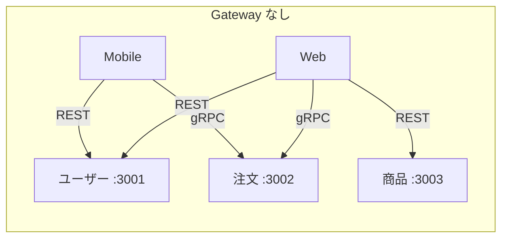
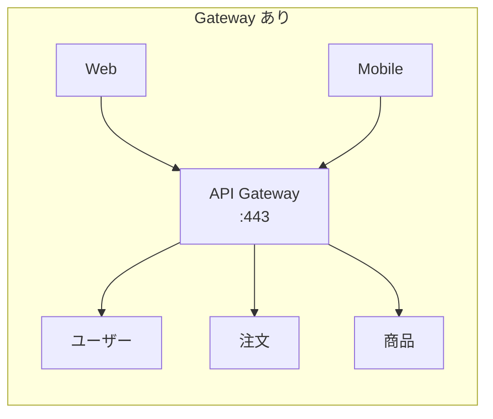
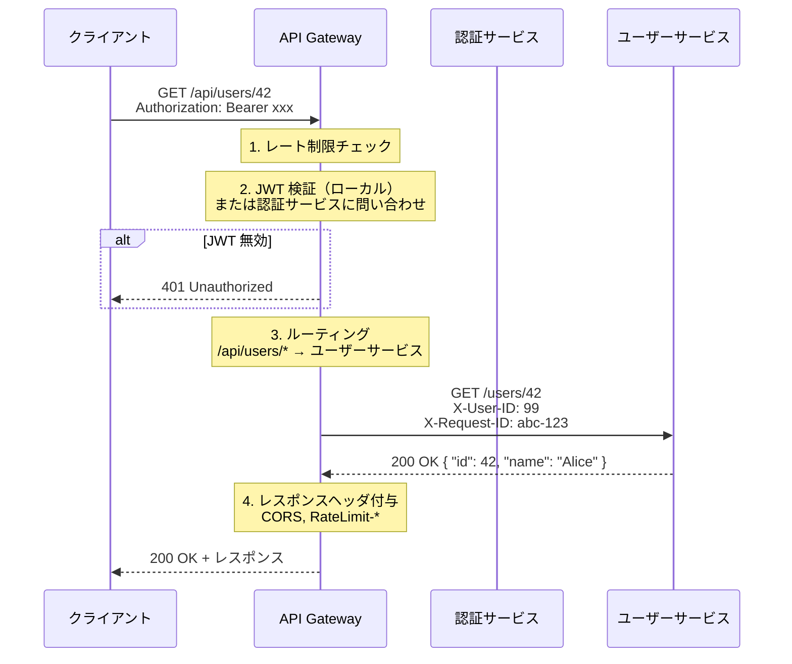
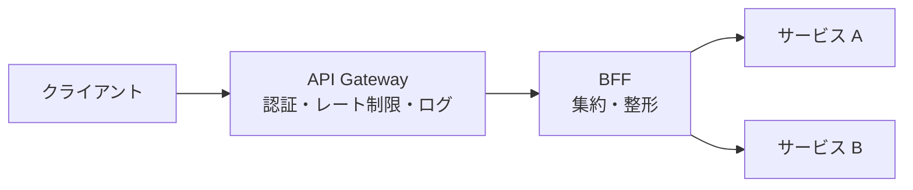

# API Gateway（API ゲートウェイ）

> **一言で言うと:** マイクロサービス群の前面に配置され、すべての外部リクエストを一元的に受け付けるリバースプロキシ。認証・[[レート制限]]・ルーティング・プロトコル変換といった**横断的関心事（Cross-Cutting Concerns）**を各サービスから切り離し、単一のエントリポイントに集約する。

## なぜ必要か

モノリスでは1つのサーバーが全リクエストを処理するため、認証・ログ・レート制限はアプリケーション内のミドルウェアで完結する。しかしマイクロサービスアーキテクチャでは、数十〜数百のサービスが独立して動く。API Gateway がなければ:

1. **クライアントがサービスの所在を知る必要がある** — ユーザーサービスは `user.internal:3001`、注文サービスは `order.internal:3002`…とクライアントが個別のホスト・ポートを管理する
2. **横断的関心事が各サービスに重複する** — 認証チェック、レート制限、リクエストログ、[[CORS]] ヘッダ付与を全サービスで個別に実装する
3. **内部構造の変更がクライアントに影響する** — サービスの分割・統合・リネームがクライアントの破壊的変更になる
4. **プロトコルの不一致** — 内部は gRPC だがクライアントは REST/GraphQL で通信したい





## 主要な責務

| 責務 | 説明 | 具体例 |
|------|------|--------|
| **リクエストルーティング** | URLパスに基づいてリクエストを適切なバックエンドサービスに転送する | `/api/users/*` → ユーザーサービス、`/api/orders/*` → 注文サービス |
| **認証・認可** | JWT 検証や API キーの確認を Gateway で一元処理し、認証済み情報をヘッダで下流に伝搬する | `Authorization: Bearer xxx` → 検証 → `X-User-ID: 42` をバックエンドに付与 |
| **[[レート制限]]** | クライアント単位・エンドポイント単位のリクエスト数制限 | 未認証: 60 req/min、認証済み: 1000 req/min |
| **プロトコル変換** | クライアントとバックエンドで異なるプロトコルを橋渡しする | 外部: REST (JSON over HTTP) → 内部: gRPC (Protocol Buffers) |
| **レスポンスキャッシュ** | 頻繁にアクセスされるリソースを Gateway 層でキャッシュする | `GET /api/products/popular` を 60 秒間キャッシュ |
| **ロギング・メトリクス** | 全リクエストのアクセスログ・レイテンシ・エラー率を集約する | リクエスト ID の発行、分散トレーシング用ヘッダの注入 |
| **ロードバランシング** | 同一サービスの複数インスタンスにリクエストを分散する | ラウンドロビン、最小接続数、重み付け |
| **サーキットブレーカー** | バックエンドの障害時にリクエストを遮断し、カスケード障害を防ぐ | 5 秒間にエラー率 50% 超 → 30 秒間 503 を即返し |

## リクエストの処理フロー



## リバースプロキシ・ロードバランサーとの違い

API Gateway は Nginx のようなリバースプロキシの機能を包含しつつ、アプリケーション層の関心事（認証、プロトコル変換、リクエスト/レスポンス変換）を担う。

| 観点 | リバースプロキシ（Nginx 等） | ロードバランサー（L4/L7） | API Gateway |
|------|---------------------------|--------------------------|-------------|
| レイヤー | L7（HTTP） | L4（TCP）/ L7（HTTP） | L7（HTTP + アプリケーション） |
| 主な責務 | 静的配信、SSL 終端、リクエスト転送 | トラフィック分散、ヘルスチェック | 認証、レート制限、プロトコル変換、ルーティング |
| ルーティングの粒度 | パスベース | IP/ポートベース（L4）、パスベース（L7） | パス + ヘッダ + クエリ + メソッドの組み合わせ |
| 認証 | 基本認証程度 | なし | JWT 検証、OAuth、API キー |
| プロトコル変換 | なし | なし | REST ↔ gRPC、HTTP ↔ WebSocket |
| 設定方法 | 設定ファイル（宣言的） | 設定ファイル / クラウド UI | 設定ファイル + 管理 API + UI |

実務では Nginx をリバースプロキシとして使いつつ、API Gateway としても機能させるケース（OpenResty、Kong）や、クラウドのマネージドサービス（AWS API Gateway、Google Cloud Endpoints）を使うケースがある。

## [[Backend-For-Frontend|BFF]] との違い

API Gateway と BFF は補完関係にある。詳細は [[Backend-For-Frontend]] を参照。

| 観点 | API Gateway | BFF |
|------|------------|-----|
| 関心事 | **横断的**（認証・レート制限・ロギング） | **クライアント固有**（レスポンスの集約・整形） |
| 数 | システムに 1 つ（または少数） | クライアント種別ごとに 1 つ |
| 所有チーム | プラットフォーム / インフラチーム | フロントエンドチーム |
| 配置 | クライアントと BFF / サービスの間 | API Gateway とマイクロサービスの間 |



## 代表的な実装の比較

| 実装 | 種別 | 特徴 |
|------|------|------|
| **Kong** | OSS + Enterprise | Nginx (OpenResty) ベース。プラグインエコシステムが豊富。宣言的設定で GitOps 対応 |
| **AWS API Gateway** | マネージド | Lambda 統合、REST / HTTP / WebSocket API。サーバーレス構成の第一選択 |
| **Google Cloud Endpoints** | マネージド | Envoy ベース。OpenAPI / gRPC スキーマからの自動生成 |
| **Envoy** | OSS | C++ 製の高性能 L7 プロキシ。Istio のデータプレーンとして使われる |
| **Traefik** | OSS | Docker / Kubernetes ネイティブ。設定の自動検出（サービスディスカバリ） |
| **YARP** | OSS | .NET 製のリバースプロキシ。ASP.NET Core のミドルウェアパイプラインと統合 |

## コード例

### TypeScript（Express）— 簡易 API Gateway

実務では Kong や AWS API Gateway を使うが、仕組みの理解のために Express で Gateway の主要機能を実装する。

```typescript
import express, { Request, Response, NextFunction } from 'express';
import { createProxyMiddleware } from 'http-proxy-middleware';

const app = express();

// --- 横断的関心事をミドルウェアで実装 ---

// 1. リクエスト ID の発行
app.use((req: Request, _res: Response, next: NextFunction) => {
  req.headers['x-request-id'] = crypto.randomUUID();
  next();
});

// 2. 簡易 JWT 検証（実務では jose 等のライブラリを使用）
function authMiddleware(req: Request, res: Response, next: NextFunction) {
  const token = req.headers.authorization?.replace('Bearer ', '');
  if (!token) {
    return res.status(401).json({ error: 'Missing token' });
  }

  // JWT をデコード・検証して userId を抽出（簡略化）
  try {
    const payload = JSON.parse(
      Buffer.from(token.split('.')[1], 'base64url').toString()
    );
    req.headers['x-user-id'] = String(payload.sub);
    next();
  } catch {
    res.status(401).json({ error: 'Invalid token' });
  }
}

// 3. ルーティング — パスに基づいてバックエンドサービスに転送
const routes: Record<string, string> = {
  '/api/users': 'http://user-service:3001',
  '/api/orders': 'http://order-service:3002',
  '/api/products': 'http://product-service:3003',
};

for (const [path, target] of Object.entries(routes)) {
  app.use(
    path,
    authMiddleware,
    createProxyMiddleware({
      target,
      changeOrigin: true,
      pathRewrite: { [`^${path}`]: '' },
    })
  );
}

// 4. ヘルスチェック（認証不要）
app.get('/health', (_req, res) => res.json({ status: 'ok' }));

app.listen(8080);
```

### Go — 簡易 API Gateway（リバースプロキシ）

```go
package main

import (
	"log"
	"net/http"
	"net/http/httputil"
	"net/url"
	"strings"
	"time"

	"github.com/google/uuid"
)

// ルーティングテーブル: パスプレフィックス → バックエンドURL
var routes = map[string]string{
	"/api/users":    "http://user-service:3001",
	"/api/orders":   "http://order-service:3002",
	"/api/products": "http://product-service:3003",
}

func main() {
	mux := http.NewServeMux()

	for prefix, target := range routes {
		targetURL, _ := url.Parse(target)
		proxy := httputil.NewSingleHostReverseProxy(targetURL)

		// パスプレフィックスを strip してバックエンドに転送
		mux.HandleFunc(prefix+"/", func(w http.ResponseWriter, r *http.Request) {
			r.URL.Path = strings.TrimPrefix(r.URL.Path, prefix)
			if r.URL.Path == "" {
				r.URL.Path = "/"
			}
			proxy.ServeHTTP(w, r)
		})
	}

	mux.HandleFunc("/health", func(w http.ResponseWriter, r *http.Request) {
		w.Write([]byte(`{"status":"ok"}`))
	})

	// ミドルウェアチェーン: リクエストID → ログ → ルーティング
	handler := requestIDMiddleware(loggingMiddleware(mux))

	log.Println("API Gateway listening on :8080")
	http.ListenAndServe(":8080", handler)
}

func requestIDMiddleware(next http.Handler) http.Handler {
	return http.HandlerFunc(func(w http.ResponseWriter, r *http.Request) {
		id := uuid.New().String()
		r.Header.Set("X-Request-ID", id)
		w.Header().Set("X-Request-ID", id)
		next.ServeHTTP(w, r)
	})
}

func loggingMiddleware(next http.Handler) http.Handler {
	return http.HandlerFunc(func(w http.ResponseWriter, r *http.Request) {
		start := time.Now()
		next.ServeHTTP(w, r)
		log.Printf("%s %s %s %s",
			r.Header.Get("X-Request-ID"),
			r.Method,
			r.URL.Path,
			time.Since(start),
		)
	})
}
```

### Nginx — API Gateway 設定

実務で最もよく使われる構成の一つ。Nginx 自体を API Gateway として使う。

```nginx
http {
    # --- http コンテキストで定義するディレクティブ ---

    # レート制限（IP ベース、100 req/min）
    limit_req_zone $binary_remote_addr zone=api:10m rate=100r/m;

    # リクエスト ID の発行
    map $request_id $req_id {
        default $request_id;
    }

    # アクセスログ（JSON 形式）
    log_format json_log escape=json '{'
        '"request_id": "$req_id",'
        '"remote_addr": "$remote_addr",'
        '"method": "$request_method",'
        '"uri": "$request_uri",'
        '"status": $status,'
        '"upstream_response_time": "$upstream_response_time"'
    '}';

    upstream user_service {
        server user-service:3001;
    }

    upstream order_service {
        server order-service:3002;
    }

    server {
        listen 443 ssl;
        server_name api.example.com;

        ssl_certificate     /etc/nginx/ssl/cert.pem;
        ssl_certificate_key /etc/nginx/ssl/key.pem;

        access_log /var/log/nginx/api.log json_log;

        # --- ルーティング ---

        location /api/users/ {
            limit_req zone=api burst=20 nodelay;
            proxy_pass http://user_service/;
            proxy_set_header X-Request-ID $req_id;
            proxy_set_header X-Real-IP $remote_addr;
        }

        location /api/orders/ {
            limit_req zone=api burst=20 nodelay;
            proxy_pass http://order_service/;
            proxy_set_header X-Request-ID $req_id;
            proxy_set_header X-Real-IP $remote_addr;
        }

        # ヘルスチェック（認証不要・レート制限不要）
        location /health {
            return 200 '{"status":"ok"}';
            add_header Content-Type application/json;
        }
    }
}
```

## よくある落とし穴

### 1. API Gateway が単一障害点（SPOF）になる

すべてのトラフィックが Gateway を通過するため、Gateway が落ちるとシステム全体が停止する。**対策:** Gateway 自体を冗長化し、ロードバランサーの背後に複数インスタンスを配置する。マネージドサービス（AWS API Gateway 等）ならインフラ側で冗長化が担保される。

### 2. Gateway にビジネスロジックを入れてしまう

リクエストの変換やフィールドの加工を Gateway で行い始めると、Gateway が肥大化してデプロイのボトルネックになる。**原則:** Gateway は「通過させるか拒否するか」のゲートキーパーに徹する。レスポンスの集約・整形が必要なら [[Backend-For-Frontend|BFF]] に分離する。

### 3. Gateway のレイテンシを無視する

Gateway を経由することで全リクエストに数ミリ秒のオーバーヘッドが加わる。JWT 検証をリモートの認証サービスへの HTTP コールで行うと、さらに数十ミリ秒が追加される。**対策:** JWT は公開鍵をローカルにキャッシュしてゲートウェイ内で検証する。外部サービスへの問い合わせが必要な場合はレスポンスをキャッシュする。

### 4. 全サービスを 1 つの Gateway に集約しすぎる

数百のマイクロサービスを 1 つの Gateway でルーティングすると、設定ファイルが肥大化し、Gateway のデプロイが全サービスに影響する。**対策:** ドメインごとに Gateway を分割する（例: `api.example.com` と `admin.example.com` で別の Gateway）。

### 5. Gateway と各サービスで認証を二重に行う

Gateway で JWT を検証しているのに、各バックエンドサービスでも同じ JWT 検証を行うと、認証ロジックが重複しメンテナンスコストが増える。**対策:** Gateway で認証を行い、検証済みの情報（ユーザー ID、ロール）をヘッダ（`X-User-ID`、`X-User-Role`）でバックエンドに伝搬する。バックエンドは Gateway からのリクエストのみを信頼する（ネットワークレベルで制限）。

## AIによる実装のアンチパターン

| アンチパターン | なぜ問題か | 対策 |
|---|---|---|
| Gateway でリクエストボディを加工・結合する | Gateway の責務を超えて BFF 化し、肥大化とデプロイリスクを招く | レスポンスの集約・整形が必要なら BFF を別サービスとして切り出す |
| 全エンドポイントに同じレート制限を適用する | ログインのような攻撃対象になりやすいエンドポイントが過剰に緩い制限になる | エンドポイントごとに適切な制限値を設定する |
| Gateway 内で DB に直接アクセスする | Gateway がデータ層に依存し、マイクロサービスの境界が崩壊する | データアクセスはバックエンドサービスに任せる |
| サーキットブレーカーなしでバックエンドに転送する | バックエンド障害時にリクエストが滞留し、Gateway 自体がリソース枯渇する | タイムアウトとサーキットブレーカーを設定する |

## 実務での使用シーン

| シーン | 構成例 | ポイント |
|--------|--------|---------|
| **サーバーレス API** | AWS API Gateway + Lambda | Gateway がリクエスト → Lambda 呼び出し → レスポンスの全フローを管理。インフラ管理不要 |
| **Kubernetes マイクロサービス** | Ingress Controller (Nginx / Traefik) + Envoy サイドカー | Ingress が外部トラフィックのエントリポイント、Envoy がサービス間通信を制御 |
| **モバイル + Web の統一エントリポイント** | Kong + BFF | Kong で認証・レート制限を一元管理し、BFF でクライアント固有のレスポンスを生成 |
| **レガシー → マイクロサービス移行** | Gateway でルーティングを段階的に切り替え | Strangler Fig パターン: 新サービスへのルーティングを Gateway で徐々に増やす |

## 関連トピック

- [[API設計-REST-GraphQL]] — 親トピック。Gateway はマイクロサービス環境での API 設計に不可欠なインフラ層
- [[Backend-For-Frontend]] — Gateway と BFF の補完関係
- [[レート制限]] — Gateway の主要な責務の一つ
- [[CORS]] — Gateway で CORS ヘッダを一元管理すると各サービスの設定が不要になる
- [[認証と認可]] — Gateway での JWT 検証と認可情報の伝搬
- [[L4とL7ロードバランサーの違い]] — Gateway はL7ロードバランサーの上位概念

## 参考リソース

- Chris Richardson, "Microservices Patterns" — API Gateway パターンの詳細な解説（Chapter 8）
- Kong 公式ドキュメント — OSS API Gateway の代表的な実装
- AWS API Gateway ドキュメント — マネージド API Gateway のリファレンス
- "Building Microservices" (Sam Newman) — マイクロサービスにおける Gateway の位置づけ
