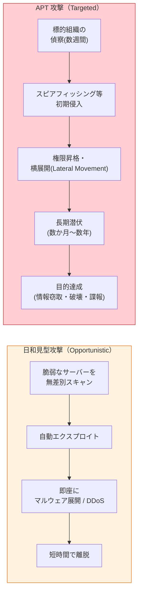
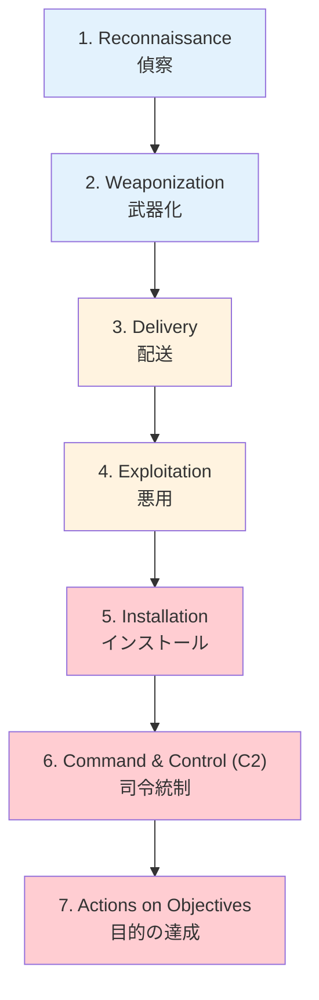
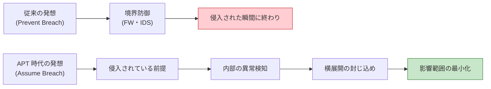
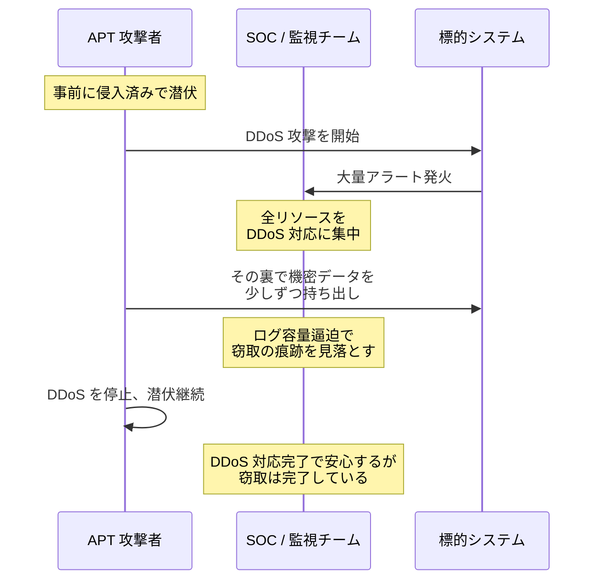

# APT 攻撃（Advanced Persistent Threat）

> **一言で言うと:** 国家・組織犯罪レベルの攻撃者が、特定の組織を**長期間（数か月〜数年）にわたって**標的にし、検知を回避しながら段階的に侵入・潜伏・情報窃取を進める高度な攻撃。単発の侵入ではなく「居座り続ける」のが特徴で、防御は「侵入を防ぐ」ではなく「**侵入されている前提（Assume Breach）で検知・封じ込める**」発想に切り替える必要がある。

## APT の 3 要素

APT という用語は米空軍が 2006 年頃に使い始め、Mandiant の "APT1" レポート（2013）で広く知られるようになった。3 つの単語それぞれに意味がある。

| 要素 | 意味 | 通常の攻撃との違い |
|------|------|------------------|
| **Advanced（高度）** | ゼロデイ脆弱性の自製、カスタムマルウェア、複数の侵入経路の組合せ | 既知 CVE のスキャンに依存しない |
| **Persistent（持続的）** | 数か月〜数年の潜伏、検知されても再侵入する執着 | 一発勝負ではない |
| **Threat（脅威 = 主体性）** | 自動化されたボットではなく、明確な目的と人間のオペレーターが背後にいる | 機械的な無差別攻撃ではない |

「Advanced」が独り歩きしがちだが、本質は **Persistent**（しつこさ）と **Threat**（主体性）。技術的に派手でなくても、長期潜伏と人間の判断が組み合わされば APT に分類される。

## 通常の攻撃との比較



| 観点 | 日和見型攻撃 | APT 攻撃 |
|------|------------|---------|
| 標的 | 脆弱なサーバー全般 | 特定組織 |
| 動機 | 金銭・愉快犯 | 諜報・知財窃取・国家戦略 |
| 期間 | 数分〜数時間 | 数か月〜数年 |
| 侵入手段 | 既知 CVE スキャン | スピアフィッシング、サプライチェーン、ゼロデイ |
| 検知後の挙動 | 諦めて別標的へ | 再侵入を試みる |
| 主な攻撃者 | スクリプトキディ、犯罪組織 | 国家機関、組織犯罪、産業スパイ |

## Cyber Kill Chain — APT の 7 段階

Lockheed Martin が提唱した攻撃プロセスのモデル。APT を理解する標準フレームワーク。



| 段階 | 攻撃者の活動 | 防御側の検知ポイント |
|------|------------|-------------------|
| 1. 偵察 | LinkedIn / OSINT で従業員調査、ドメイン情報収集 | 困難（検知しにくい） |
| 2. 武器化 | マルウェア + 文書ファイルの組合せを準備 | 攻撃者側の活動で検知不可 |
| 3. 配送 | スピアフィッシングメール、USB ドロップ、水飲み場攻撃 | メールゲートウェイ、Web プロキシ |
| 4. 悪用 | 文書のマクロ実行、ブラウザの脆弱性悪用 | EDR、サンドボックス |
| 5. インストール | バックドア・RAT の常駐化、レジストリ改ざん | EDR、ファイル整合性監視 |
| 6. C2 通信 | DNS トンネル、HTTPS 上の正規プロトコル偽装 | NDR、DNS ログ分析 |
| 7. 目的達成 | データ窃取、破壊、横展開 | DLP、UEBA、監査ログ |

「**Kill Chain は 1 段階でも遮断できれば攻撃は失敗する**」というのが防御側の基本原則。後段ほど被害が大きいので、なるべく前段で止めるほど望ましい。

## MITRE ATT&CK — より詳細な戦術・技術カタログ

Cyber Kill Chain は **7 段階の大きな流れ**を示すが、各段階で攻撃者が使う具体的なテクニックは膨大。MITRE ATT&CK（Adversarial Tactics, Techniques, and Common Knowledge）は実際の APT グループの行動を観測し、戦術 (Tactics) × 技術 (Techniques) のマトリクスとして公開している。

| Cyber Kill Chain | 対応する MITRE ATT&CK の戦術 |
|----------------|---------------------------|
| 偵察 | Reconnaissance, Resource Development |
| 配送 / 悪用 | Initial Access, Execution |
| インストール | Persistence, Privilege Escalation, Defense Evasion, Credential Access |
| C2 | Command and Control |
| 目的達成 | Discovery, Lateral Movement, Collection, Exfiltration, Impact |

**実務上の使い方:** インシデント対応時に「観測された行動が ATT&CK のどの技術 ID（例: T1566.001 スピアフィッシング添付ファイル）に該当するか」をマッピングし、関連する他の技術が同じ攻撃者によって使われていないか調査する。SIEM の検知ルール（Sigma rule 等）も ATT&CK ID で整理されることが多い。

## 代表的な APT グループ

| グループ名 | 通称 | 帰属（推定） | 主な標的・特徴 |
|----------|------|------------|-------------|
| APT28 | Fancy Bear | ロシア GRU | 政府、軍、メディア。スピアフィッシング多用 |
| APT29 | Cozy Bear | ロシア SVR | 外交、シンクタンク。長期潜伏が特徴。SolarWinds 事件 |
| APT41 | Double Dragon | 中国 | 諜報 + 金銭目的の併用。ゲーム業界も標的。2020 年に米司法省が 5 名のメンバーを起訴 |
| Lazarus Group | Hidden Cobra | 北朝鮮 | 暗号資産取引所、銀行、Sony Pictures Hack（2014）、WannaCry |
| Equation Group | — | 米国 NSA 系（推定） | Kaspersky が 2015 年に命名。Fanny worm 等の独自マルウェアファミリーが特徴で、Stuxnet（2010、イラン核施設）とのコード類似性が研究者により指摘されている |

帰属（attribution）は確証が難しく、ベンダーごとに命名規則が異なるため同一グループに複数の名前が付くことが多い（例: APT29 / Cozy Bear / The Dukes / Nobelium）。

## 防御戦略 — Assume Breach パラダイム

APT への防御は「侵入を防ぐ」だけでは破綻する。以下の前提で設計する。



### 多層防御の中核要素

| 対策 | 役割 | 具体例 |
|------|------|--------|
| **[[最小権限の原則]]** | 横展開（Lateral Movement）を阻害 | ロール分離、ジャストインタイム権限昇格、踏み台サーバー経由の管理アクセス |
| **ネットワーク分離（マイクロセグメンテーション）** | 侵害サーバーから他への到達を制限 | VPC/Subnet 分離、East-West トラフィックの ACL |
| **EDR（Endpoint Detection & Response）** | エンドポイントの異常挙動を検知 | プロセス異常、レジストリ書き込み、不審な PowerShell 実行 |
| **UEBA（User Entity Behavior Analytics）** | 通常パターンからの逸脱を統計的に検知 | 普段アクセスしない時間帯のログイン、大量ファイルダウンロード |
| **SIEM + ログ集約** | 複数ソースのログを横断検索 | Splunk, Elastic Stack, Datadog |
| **継続的な脅威ハンティング** | プロアクティブな調査 | ATT&CK ID ベースの仮説検証 |
| **インシデント対応訓練（IR）** | 検知後の対応速度を上げる | テーブルトップ演習、Purple Team 訓練 |

### Zero Trust アーキテクチャ

「内部ネットワークだから信頼する」という前提を捨て、**すべてのアクセスを毎回認証・認可する**設計。BeyondCorp（Google）が代表例。APT 対策としては、内部に侵入されても勝手に横展開できない構造を作るのが目的。

## DoS / DDoS との関係 — スモークスクリーン

[[DoS攻撃とDDoS攻撃]] の項目で触れた「別攻撃の隠蔽（スモークスクリーン）」は、APT の典型的な手法の一つ。



DDoS が「単独の事象」ではなく「**何かを隠すための囮**」である可能性を常に疑うことが重要。特に大規模な DDoS の最中・直後には、通常時より厳しくログ監視を続ける運用ルールが必要。

## コード例 — 異常検知の入口

APT 自体は概念であり「APT 用のライブラリ」は存在しない。代わりに、APT 検知につながりやすい異常パターンを検出するサンプルを示す。

### Python — 異なる国からの並行ログイン検知（impossible travel の簡易版）

```python
from collections import defaultdict
from datetime import datetime, timedelta

# auth ログから「同一ユーザーが短時間に異なる国からログイン」を検知する簡易版。
# 厳密な impossible travel は地理座標と移動可能時間の物理計算が必要。

WINDOW = timedelta(minutes=10)
auth_log = [
    # (timestamp, user, ip, country)
    (datetime(2026, 4, 9, 10, 0, 0), "alice", "203.0.113.1", "JP"),
    (datetime(2026, 4, 9, 10, 5, 0), "alice", "198.51.100.5", "RU"),  # 5分後にロシア
]

def detect_concurrent_geo_login(events):
    by_user = defaultdict(list)
    for ts, user, ip, country in events:
        by_user[user].append((ts, ip, country))

    alerts = []
    for user, sessions in by_user.items():
        sessions.sort()
        for (t1, ip1, c1), (t2, ip2, c2) in zip(sessions, sessions[1:]):
            if c1 != c2 and (t2 - t1) < WINDOW:
                alerts.append({
                    "user": user,
                    "from": (t1.isoformat(), ip1, c1),
                    "to": (t2.isoformat(), ip2, c2),
                    "delta_seconds": (t2 - t1).total_seconds(),
                    "reason": "concurrent_geo_login",
                })
    return alerts


for alert in detect_concurrent_geo_login(auth_log):
    print(alert)
# {'user': 'alice', 'from': (...JP...), 'to': (...RU...),
#  'delta_seconds': 300.0, 'reason': 'concurrent_geo_login'}
```

これは UEBA 系製品が内部で行っている検知の最小例。実運用では地理座標 + 移動時間の物理計算、信頼デバイスの考慮、VPN 検知などを組み合わせる。

### TypeScript — Lateral Movement の兆候検知

```typescript
// API アクセスログから「普段アクセスしないリソースへの大量アクセス」を検知
type AccessEvent = {
  ts: Date;
  userId: string;
  resource: string; // 例: "/api/customers/12345"
};

type Baseline = Map<string, Set<string>>; // userId -> 過去30日間にアクセスしたリソースの集合

function detectAnomalousAccess(
  events: AccessEvent[],
  baseline: Baseline,
  thresholdNew: number = 50,
): Array<{ userId: string; newResources: number }> {
  const newResourcesByUser = new Map<string, Set<string>>();

  for (const e of events) {
    const known = baseline.get(e.userId) ?? new Set();
    if (!known.has(e.resource)) {
      const set = newResourcesByUser.get(e.userId) ?? new Set();
      set.add(e.resource);
      newResourcesByUser.set(e.userId, set);
    }
  }

  // 直近のセッションで「初見のリソース」を threshold 件以上触ったユーザーを抽出
  const alerts: Array<{ userId: string; newResources: number }> = [];
  for (const [userId, set] of newResourcesByUser) {
    if (set.size >= thresholdNew) {
      alerts.push({ userId, newResources: set.size });
    }
  }
  return alerts;
}
```

正常な業務拡大による「初見アクセス増加」と区別するため、実運用では時間帯・部署・ロールも考慮した統計的モデルを使う。これも UEBA の基本パターン。

## よくある誤解

### 1. 「APT は国家機関しかやらない」
近年は犯罪組織（特に Ransomware-as-a-Service 系）が APT 的な手口を使うようになっている。ロシア圏の犯罪組織（Conti、Ryuk 等）が国家機関と人的・運用的に重なる例も観測されており（2022 年の Conti Leaks で部分的に判明）、攻撃者の境界は曖昧化している。

### 2. 「ウチは中小企業だから APT には狙われない」
取引先（大企業）への入口として中小企業が踏み台にされる「**サプライチェーン経由の APT**」が主流の侵入経路の一つ。SolarWinds 事件（2020）はソフトウェア配布経路、Target 事件（2013）は HVAC 業者経由が初期侵入だった。中小企業でも標的になる現実がある。

### 3. 「EDR を入れれば APT は防げる」
EDR は強力だが単独では不十分。攻撃者は EDR を無効化する手法（BYOVD: Bring Your Own Vulnerable Driver 等）を持っており、EDR・SIEM・NDR・UEBA・人間のアナリストの組合せが必要。**ツール導入と運用体制は別物**。

### 4. 「ゼロトラストを導入すれば APT は無効化される」
Zero Trust は横展開を困難にするが「ゼロにする」わけではない。実装の不備（過剰な信頼セッション、設定の例外）があれば突破される。継続的な検証と監査が前提。

### 5. 「APT 対策はセキュリティチームの仕事」
開発チームの責任範囲も大きい。具体的には:
- ログを十分に出力する（特に認証イベント、権限変更、データアクセス）
- 認証情報を環境変数やシークレット管理に隔離する
- 依存パッケージの管理（[[サプライチェーンセキュリティ]]）
- 個人開発端末のセキュリティ（EDR、ディスク暗号化）

開発者の認証情報・端末侵害は APT 初期侵入の主要経路の一つ。

## AI による実装のアンチパターン

| アンチパターン | なぜ問題か | 対策 |
|---|---|---|
| 「APT 対策」と称して特定の EDR/SIEM を導入する設定を生成 | ツール購入だけでは検知しない、運用が前提 | 検知ルールの設計・チューニング・アラート対応プロセスを含めて提案 |
| ログ出力を「個人情報保護のため」と称して最小化 | 監査ログ不足で侵害時の原因特定不能 | 個人情報をマスクしつつ、認証イベント・権限変更・アクセスログは必ず保存 |
| インシデント対応を「ベストプラクティス」一覧で済ませる | 訓練していないと現場で動けない | テーブルトップ演習、定期的な IR 訓練、ランブック整備を提案 |
| 検知ルールを作って「閾値超えたらアラート」だけで終わる | 偽陽性で SOC 疲弊 → 本物の検知を見逃す | アラート優先度、エスカレーション基準、誤検知のチューニング機構を含めて設計 |

## 関連トピック

- [[DoS攻撃とDDoS攻撃]] — 親トピック。DDoS が APT のスモークスクリーンとして使われるパターン
- [[最小権限の原則]] — 横展開を阻害する基盤原則。APT 対策の中核
- [[サプライチェーンセキュリティ]] — APT の主要な初期侵入経路の一つ
- [[XSS]] / [[CSRF]] / [[SQLインジェクション]] — APT が初期侵入で使う Web 脆弱性の代表

## 参考リソース

- [MITRE ATT&CK](https://attack.mitre.org/) — 戦術・技術カタログの本家
- [Lockheed Martin: Cyber Kill Chain](https://www.lockheedmartin.com/en-us/capabilities/cyber/cyber-kill-chain.html)
- [Mandiant APT1 Report (2013)](https://www.mandiant.com/resources/reports/apt1-exposing-one-chinas-cyber-espionage-units) — APT という用語が広まった象徴的レポート
- [NIST SP 800-61: Computer Security Incident Handling Guide](https://csrc.nist.gov/publications/detail/sp/800-61/rev-2/final)
- [BeyondCorp: A New Approach to Enterprise Security](https://research.google/pubs/pub43231/) — Zero Trust の代表事例
