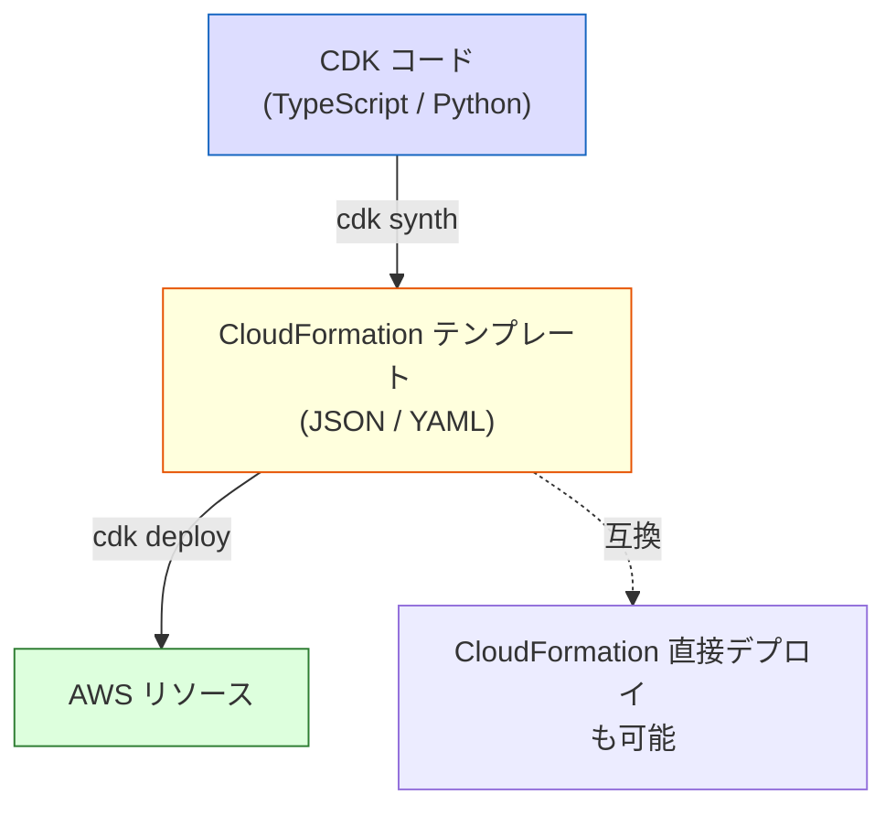
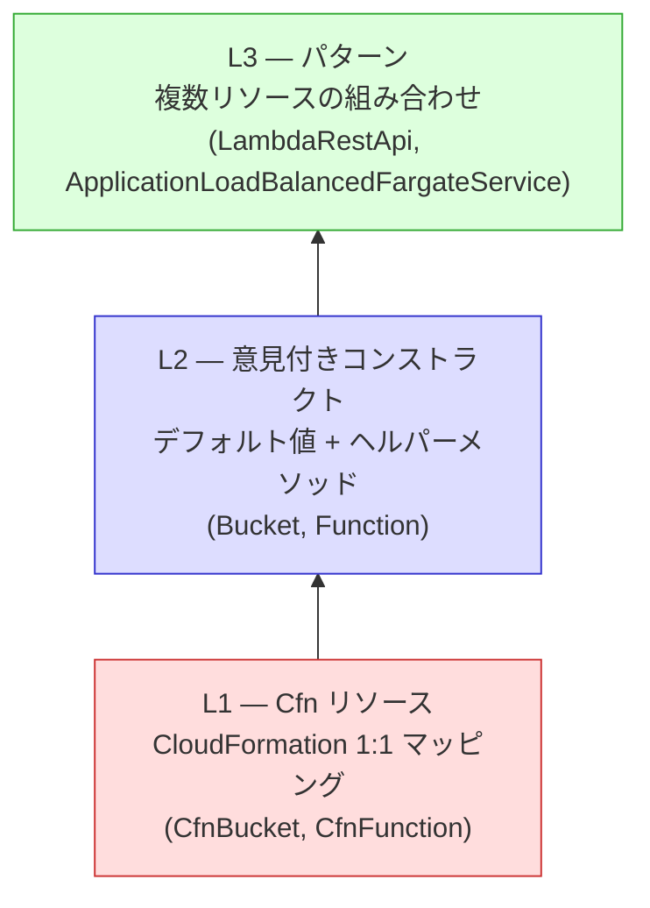
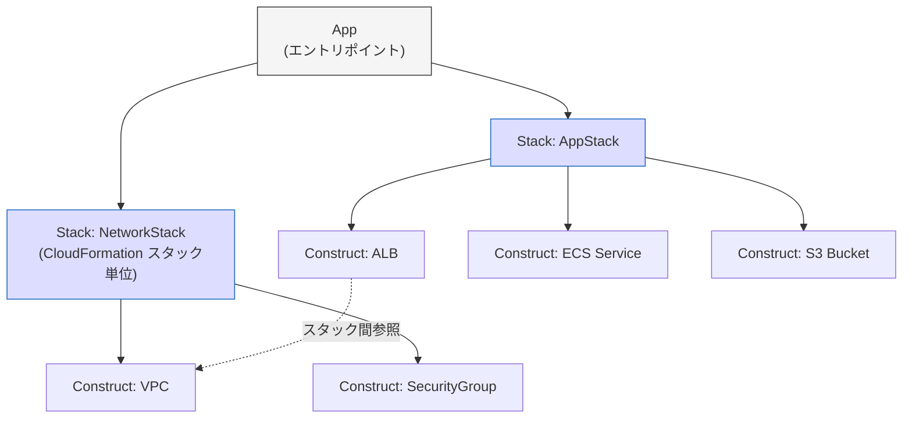
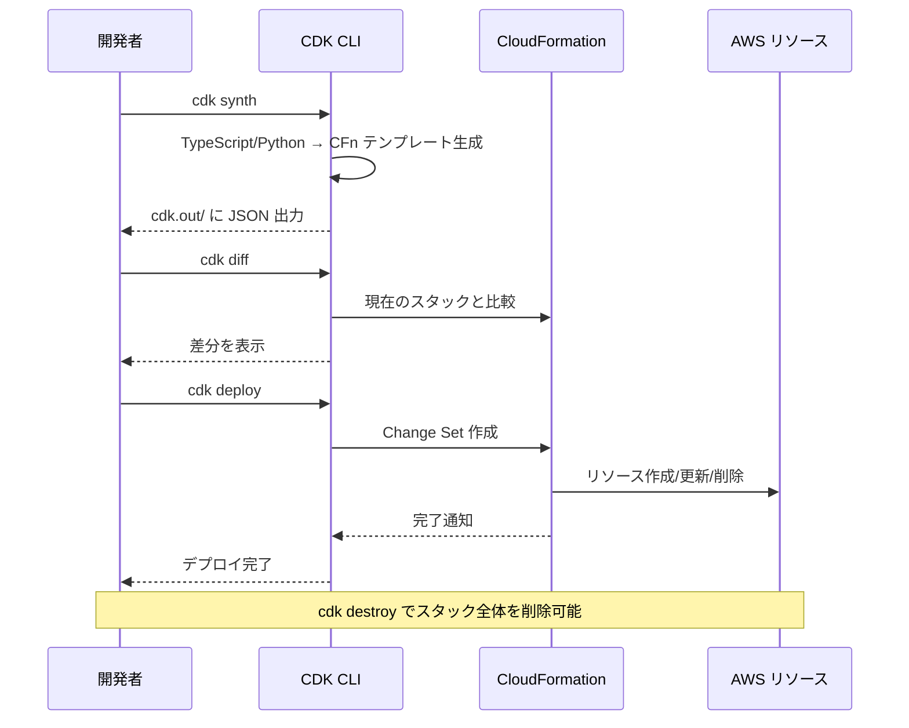

# AWS CDKのコンストラクトモデル（AWS Cloud Development Kit — Construct Model）

> **一言で言うと:** AWS CDK は汎用プログラミング言語でインフラを定義するフレームワーク。コンストラクト（Construct）という再利用可能なビルディングブロックを L1（低レベル）→ L2（意見付き）→ L3（パターン）の3層で抽象化し、CloudFormation テンプレートを生成する。

## CDK の位置づけ

[[IaCとクラウドインフラ管理]]で概観した通り、IaC ツールは大きく「DSL / YAML 系」と「汎用プログラミング言語系」に分かれる。CDK は後者の代表であり、TypeScript・Python・Go・Java・C# でインフラを定義できる。



CDK のコードは最終的に CloudFormation テンプレートに変換（synthesize）される。つまり CDK は CloudFormation の**上位抽象化層**であり、CloudFormation の制約（リソース数上限 500、スタック間参照の制限等）はそのまま適用される。

## コンストラクトの3層モデル

CDK の最も重要な概念はコンストラクト（Construct）。全てのリソース定義はコンストラクトであり、抽象度によって3つのレベルに分類される。



### L1 コンストラクト（CloudFormation Resources）

CloudFormation リソースと1:1で対応する最低レベルのコンストラクト。`Cfn` プレフィックスが付く。CloudFormation テンプレートの YAML をそのまま TypeScript に変換した形。

```typescript
import * as cdk from 'aws-cdk-lib';
import * as s3 from 'aws-cdk-lib/aws-s3';

// L1: CloudFormation プロパティをそのまま指定
// メリット: CloudFormation の全プロパティにアクセスできる
// デメリット: 冗長で、デフォルト値の恩恵がない
new s3.CfnBucket(this, 'MyBucket', {
  bucketName: 'my-app-data',
  versioningConfiguration: {
    status: 'Enabled',
  },
  publicAccessBlockConfiguration: {
    blockPublicAcls: true,
    blockPublicPolicy: true,
    ignorePublicAcls: true,
    restrictPublicBuckets: true,
  },
});
```

### L2 コンストラクト（Curated Constructs）

AWS のベストプラクティスを反映したデフォルト値とヘルパーメソッドを持つ。**日常の開発で最も多く使うレベル**。

```typescript
import * as s3 from 'aws-cdk-lib/aws-s3';
import * as iam from 'aws-cdk-lib/aws-iam';

// L2: セキュアなデフォルトが適用される
// - パブリックアクセスブロック: 自動で有効
// - 暗号化: S3 マネージドキーがデフォルト
const bucket = new s3.Bucket(this, 'MyBucket', {
  versioned: true,
  removalPolicy: cdk.RemovalPolicy.RETAIN,  // スタック削除時にバケットを保持
  lifecycleRules: [{
    expiration: cdk.Duration.days(90),
    transitions: [{
      storageClass: s3.StorageClass.INFREQUENT_ACCESS,
      transitionAfter: cdk.Duration.days(30),
    }],
  }],
});

// L2 のヘルパーメソッド — IAM ポリシーの生成を自動化
// bucket.grantRead() は内部で必要な IAM ステートメントを生成する
const lambdaRole = new iam.Role(this, 'LambdaRole', {
  assumedBy: new iam.ServicePrincipal('lambda.amazonaws.com'),
});
bucket.grantRead(lambdaRole);  // s3:GetObject, s3:ListBucket を自動付与
```

```python
# Python での同等の L2 コンストラクト
import aws_cdk as cdk
from aws_cdk import aws_s3 as s3, aws_iam as iam

# L2: TypeScript 版と同じセキュアなデフォルトが適用される
bucket = s3.Bucket(self, "MyBucket",
    versioned=True,
    removal_policy=cdk.RemovalPolicy.RETAIN,
    lifecycle_rules=[s3.LifecycleRule(
        expiration=cdk.Duration.days(90),
        transitions=[s3.Transition(
            storage_class=s3.StorageClass.INFREQUENT_ACCESS,
            transition_after=cdk.Duration.days(30),
        )],
    )],
)

# ヘルパーメソッドも同様に使える
lambda_role = iam.Role(self, "LambdaRole",
    assumed_by=iam.ServicePrincipal("lambda.amazonaws.com"),
)
bucket.grant_read(lambda_role)
```

L1 と L2 の違いを同じ S3 バケットで比較すると：

| 観点 | L1（CfnBucket） | L2（Bucket） |
|------|-----------------|-------------|
| パブリックアクセスブロック | 自分で設定 | デフォルトで有効 |
| 暗号化 | 自分で設定 | デフォルトで S3 マネージドキー |
| IAM 権限付与 | IAM ポリシーを自分で書く | `grantRead()` 等のメソッドで自動生成 |
| イベント通知 | NotificationConfiguration を手動設定 | `bucket.addEventNotification()` で型安全に設定 |
| コード量 | 多い | 少ない |

### L3 コンストラクト（パターン）

複数のリソースを組み合わせた実用的なアーキテクチャパターン。一般的なユースケースを数行で構築できる。

```typescript
import * as ecs_patterns from 'aws-cdk-lib/aws-ecs-patterns';
import * as ecs from 'aws-cdk-lib/aws-ecs';

// L3: ALB + Fargate + ターゲットグループ + セキュリティグループ + ログ
// これだけで VPC・ALB・ECS クラスター・Fargate サービス・CloudWatch Logs が構築される
const service = new ecs_patterns.ApplicationLoadBalancedFargateService(this, 'WebService', {
  taskImageOptions: {
    image: ecs.ContainerImage.fromRegistry('nginx:latest'),
    containerPort: 80,
  },
  publicLoadBalancer: true,
  desiredCount: 2,
  cpu: 256,
  memoryLimitMiB: 512,
});

// オートスケーリングもメソッドチェーンで追加
const scaling = service.service.autoScaleTaskCount({ maxCapacity: 10 });
scaling.scaleOnCpuUtilization('CpuScaling', {
  targetUtilizationPercent: 70,
});
```

## App・Stack・Construct の階層構造

CDK のプログラム全体は**ツリー構造**で構成される。



```typescript
import * as cdk from 'aws-cdk-lib';
import * as ec2 from 'aws-cdk-lib/aws-ec2';
import { Construct } from 'constructs';  // CDK v2 では constructs パッケージから import

// カスタムコンストラクト — 再利用可能なインフラ部品
class NetworkConstruct extends Construct {
  public readonly vpc: ec2.Vpc;

  constructor(scope: Construct, id: string) {
    super(scope, id);

    this.vpc = new ec2.Vpc(this, 'Vpc', {
      maxAzs: 2,
      natGateways: 1,
    });
  }
}

// Stack — CloudFormation スタックに対応（Stack は aws-cdk-lib から継承）
class NetworkStack extends cdk.Stack {
  public readonly network: NetworkConstruct;

  constructor(scope: Construct, id: string) {
    super(scope, id);
    this.network = new NetworkConstruct(this, 'Network');
  }
}

class AppStack extends cdk.Stack {
  constructor(scope: Construct, id: string, props: { vpc: ec2.Vpc }) {
    super(scope, id);
    // 別スタックの VPC を参照
    // CDK が自動で CloudFormation のクロススタック参照（Export/Import）を生成する
    new ec2.SecurityGroup(this, 'AppSg', { vpc: props.vpc });
  }
}

// App — エントリポイント
const app = new cdk.App();
const networkStack = new NetworkStack(app, 'NetworkStack');
new AppStack(app, 'AppStack', { vpc: networkStack.network.vpc });
```

## CDK のテスト

CDK の大きな利点は、通常のテストフレームワークでインフラ定義をテストできること。

### TypeScript（Jest + assertions）

```typescript
import * as cdk from 'aws-cdk-lib';
import { Template, Match } from 'aws-cdk-lib/assertions';
import { AppStack } from '../lib/app-stack';

describe('AppStack', () => {
  const app = new cdk.App();
  const stack = new AppStack(app, 'TestStack');
  const template = Template.fromStack(stack);

  test('S3 バケットが暗号化されていること', () => {
    template.hasResourceProperties('AWS::S3::Bucket', {
      BucketEncryption: {
        ServerSideEncryptionConfiguration: Match.arrayWith([
          Match.objectLike({
            ServerSideEncryptionByDefault: {
              SSEAlgorithm: 'aws:kms',
            },
          }),
        ]),
      },
    });
  });

  test('Lambda 関数のメモリが 512MB であること', () => {
    template.hasResourceProperties('AWS::Lambda::Function', {
      MemorySize: 512,
      Runtime: 'nodejs20.x',
    });
  });

  test('DynamoDB テーブルが 1 つだけ作成されること', () => {
    template.resourceCountIs('AWS::DynamoDB::Table', 1);
  });
});
```

### Python（pytest + assertions）

```python
import aws_cdk as cdk
from aws_cdk.assertions import Template, Match
from my_app.app_stack import AppStack

def test_s3_bucket_encrypted():
    app = cdk.App()
    stack = AppStack(app, "TestStack")
    template = Template.from_stack(stack)

    template.has_resource_properties("AWS::S3::Bucket", {
        "BucketEncryption": {
            "ServerSideEncryptionConfiguration": Match.array_with([
                Match.object_like({
                    "ServerSideEncryptionByDefault": {
                        "SSEAlgorithm": "aws:kms"
                    }
                })
            ])
        }
    })

def test_lambda_count():
    app = cdk.App()
    stack = AppStack(app, "TestStack")
    template = Template.from_stack(stack)
    template.resource_count_is("AWS::Lambda::Function", 2)
```

## Aspects — 横断的なポリシー適用

Aspects は CDK ツリー全体を走査して、ポリシーを横断的に適用する仕組み。セキュリティチームが全スタックに一括でルールを適用するような場面で使う。

```typescript
import * as cdk from 'aws-cdk-lib';
import * as s3 from 'aws-cdk-lib/aws-s3';

// Aspect: 全 S3 バケットにバージョニングを強制
class BucketVersioningChecker implements cdk.IAspect {
  visit(node: cdk.IConstruct): void {
    if (node instanceof s3.CfnBucket) {
      if (!node.versioningConfiguration ||
          (node.versioningConfiguration as any).status !== 'Enabled') {
        cdk.Annotations.of(node).addError(
          'S3 バケットにはバージョニングが必須です'
        );
      }
    }
  }
}

// App 全体に Aspect を適用 — 全スタックの全 S3 バケットがチェックされる
const app = new cdk.App();
cdk.Aspects.of(app).add(new BucketVersioningChecker());
```

## CDK のワークフロー



| コマンド | 用途 |
|---------|------|
| `cdk init` | プロジェクトのスキャフォールド |
| `cdk synth` | CloudFormation テンプレートを生成（`cdk.out/`） |
| `cdk diff` | 現在のスタックとの差分を表示（`terraform plan` に相当） |
| `cdk deploy` | スタックをデプロイ |
| `cdk destroy` | スタックを削除 |
| `cdk bootstrap` | CDK 用のブートストラップスタック（S3 + IAM）を作成（初回のみ） |

## よくある落とし穴

### 1. `cdk bootstrap` の忘れ

CDK は内部で S3 バケットや IAM ロールを使ってアセット（Lambda のコード等）をデプロイする。初回は `cdk bootstrap` でこれらのリソースを作成する必要がある。忘れるとデプロイ時に権限エラーになる。

### 2. コンストラクトID の重複

同じスコープ内で同じ ID を使うとエラーになる。特にループで動的にリソースを生成する場合に注意。

```typescript
// NG: ループ内で同じ ID
for (const name of ['api', 'web', 'worker']) {
  new s3.Bucket(this, 'Bucket', { bucketName: name });  // エラー: ID 'Bucket' が重複
}

// OK: ユニークな ID を付与
for (const name of ['api', 'web', 'worker']) {
  new s3.Bucket(this, `Bucket-${name}`, { bucketName: name });
}
```

### 3. RemovalPolicy の未設定

デフォルトでは、スタック削除時にほとんどのリソースが一緒に削除される。本番環境のデータベースやバケットは `RemovalPolicy.RETAIN` を設定しないと、`cdk destroy` で消失する。

### 4. スタックの肥大化

1つのスタックに全リソースを詰め込むと、CloudFormation のリソース上限（500）に到達する。また、1箇所の変更が巨大な Change Set を生成し、デプロイが遅くなる。機能単位でスタックを分割する。

## AIによる実装のアンチパターン

| アンチパターン | なぜ問題か | 対策 |
|---|---|---|
| L2 が存在するのに L1 を使う | L1 はセキュアなデフォルトが適用されず、コードも冗長になる | まず L2 を探し、不足する場合のみ L1 の `addOverride()` で補完 |
| 全リソースを1つの Stack に詰める | CloudFormation の上限到達・デプロイ速度低下・影響範囲の拡大 | ドメインや機能単位でスタックを分割する |
| `cdk.CfnOutput` を使わずに値を共有 | スタック間でハードコードされた値が散在し、環境差異のバグが発生する | `CfnOutput` + クロススタック参照、または SSM パラメータストアを使う |
| テストなしでデプロイ | CloudFormation レベルのエラーはデプロイ時まで検出できず、ロールバックに時間がかかる | `assertions` ライブラリでユニットテストを必ず書く |

## 関連トピック

- [[IaCとクラウドインフラ管理]] — CDK を含む IaC ツール全体の比較と選択指針
- [[CI-CD]] — CDK のデプロイを CI/CD パイプラインに組み込むフロー
- [[SDKとAPIクライアント]] — CDK は内部で AWS SDK（CloudFormation API）を呼び出している
- [[テスト戦略]] — CDK の `assertions` ライブラリはユニットテスト層に位置する

## 参考リソース

- [AWS CDK Developer Guide](https://docs.aws.amazon.com/cdk/v2/guide/) — 公式ガイド。Construct Library のリファレンスが充実
- [CDK Patterns](https://cdkpatterns.com/) — 実践的なアーキテクチャパターン集
- [Construct Hub](https://constructs.dev/) — コミュニティ製のコンストラクトライブラリを検索できるレジストリ
- *The CDK Book* — Sathyajith Bhat 他（CDK のベストプラクティスを体系的にまとめた実践書）
